

<strong>Universidad Peruana de Ciencias Aplicadas</strong>

<strong>Carrera de Ingeniería de Software</strong>

 

<strong>1ACC0238</strong>

<strong>Aplicaciones para Dispositivos Móviles</strong>

NRC

<strong>4945</strong>

<h2 align="center">Informe del Trabajo Final</h2>

Docente

<strong>Mayta Guillermo, Jorge Luis</strong>

 

Equipo

<strong>VitalCare</strong>

Proyecto

<strong>Serenia</strong>

 

<strong>Integrantes</strong>

<table align="center">
  <tr><th>Código</th><th>Apellidos y nombres</th></tr>
  <tr><td>u202414802</td><td>Contreras Torres, Arturo Valentino</td></tr>
  <tr><td>u202414970</td><td>Gallardo Morales, Carla Alejandra</td></tr>
  <tr><td>u202012001</td><td>García Paredes, Victor Manuel</td></tr>
  <tr><td>u202410239</td><td>Salinas Guzman, Brianna Cristina</td></tr>
  <tr><td>u202418645</td><td>Sandoval Aiquipa, Kelber Yamir</td></tr>
</table>
 

<strong>Período 202620</strong>

<strong>Septiembre 2026</strong>

 

---

# Registro de Versiones del Informe

<table>
  <tr>
    <th>Versión</th>
    <th>Fecha</th>
    <th>Autor</th>
    <th>Descripción de modificación</th>
  </tr>

  <tr>
    <td><b>Primera Entrega (AV1)</b></td>
    <td>18/09/2026</td>
    <td>
      Contreras Torres, Arturo Valentino  
      

      Gallardo Morales, Carla Alejandra  
      

      García Paredes, Victor Manuel  
      

      Salinas Guzman, Brianna Cristina  
      

      Sandoval Aiquipa, Kelber Yamir  
    </td>
    <td>
      Capítulo I: Presentación  
      Capítulo II: Requirements Development and Software Solution Design  
    </td>
  </tr>
  </table>

 

  ---

# Project Report Collaboration Insights

El informe del proyecto fue desarrollado de manera colaborativa por el equipo mediante repositorios de GitHub creados para la gestión del Project Report y de los diferentes componentes del proyecto. Estos repositorios contienen los archivos del informe, diagramas, evidencias, wireframes, mockups y el historial de versiones correspondiente a cada entrega.

URL del repositorio (report): https://github.com/upc-pre-202620-1acc0238-4945-vitalcare/serenia-report  

**Primera Entrega (AV1)**

 

---

# Contenido

## Tabla de Contenidos

- [Registro de Versiones del Informe](#registro-de-versiones-del-informe)
- [Project Report Collaboration Insights](#project-report-collaboration-insights)
- [Contenido](#contenido)
  - [Tabla de Contenidos](#tabla-de-contenidos)
- [Student Outcome](#student-outcome)
- [Objetivos SMART](#objetivos-smart)
- [Capítulo I: Presentación](#capítulo-i-presentación)
  - [1.1. Startup Profile](#11-startup-profile)
    - [1.1.1. Descripción de la Startup](#111-descripción-de-la-startup)
    - [1.1.2. Perfiles de integrantes del equipo](#112-perfiles-de-integrantes-del-equipo)
  - [1.2. Solution Profile](#12-solution-profile)
    - [1.2.1. Antecedentes y problemática](#121-antecedentes-y-problemática)
    - [1.2.2. Lean UX Process](#122-lean-ux-process)
      - [1.2.2.1. Lean UX Problem Statements](#1221-lean-ux-problem-statements)
      - [1.2.2.2. Lean UX Assumptions](#1222-lean-ux-assumptions)
      - [1.2.2.3. Lean UX Hypothesis Statements](#1223-lean-ux-hypothesis-statements)
      - [1.2.2.4. Lean UX Canvas](#1224-lean-ux-canvas)
  - [1.3. Segmentos objetivo](#13-segmentos-objetivo)
- [Capítulo II: Requirements Development and Software Solution Design](#capítulo-ii-requirements-development-and-software-solution-design)
  - [2.1. Competidores](#21-competidores)
    - [2.1.1. Análisis competitivo](#211-análisis-competitivo)
    - [2.1.2. Estrategias y tácticas frente a competidores](#212-estrategias-y-tácticas-frente-a-competidores)
  - [2.2. Entrevistas](#22-entrevistas)
    - [2.2.1. Diseño de entrevistas](#221-diseño-de-entrevistas)
    - [2.2.2. Registro de entrevistas](#222-registro-de-entrevistas)
    - [2.2.3. Análisis de entrevistas](#223-análisis-de-entrevistas)
  - [2.3. Needfinding](#23-needfinding)
    - [2.3.1. User Personas](#231-user-personas)
    - [2.3.2. User Task Matrix](#232-user-task-matrix)
    - [2.3.3. User Journey Mapping](#233-user-journey-mapping)
    - [2.3.4. Empathy Mapping](#234-empathy-mapping)
    - [2.3.5. Big Picture EventStorming](#235-big-picture-eventstorming)
    - [2.3.6. Ubiquitous Language](#236-ubiquitous-language)
  - [2.4. Requirements specification](#24-requirements-specification)
    - [2.4.1. User Stories](#241-user-stories)
    - [2.4.2. Impact Mapping](#242-impact-mapping)
    - [2.4.3. Product Backlog](#243-product-backlog)
  - [2.5. Strategic-Level Domain-Driven Design](#25-strategic-level-domain-driven-design)
    - [2.5.1. EventStorming](#251-eventstorming)
      - [2.5.1.1. Candidate Context Discovery](#2511-candidate-context-discovery)
      - [2.5.1.2. Domain Message Flows Modeling](#2512-domain-message-flows-modeling)
      - [2.5.1.3. Bounded Context Canvases](#2513-bounded-context-canvases)
    - [2.5.2. Context Mapping](#252-context-mapping)
    - [2.5.3. Software Architecture](#253-software-architecture)
      - [2.5.3.1. Software Architecture Context Level Diagrams](#2531-software-architecture-context-level-diagrams)
      - [2.5.3.2. Software Architecture Container Level Diagrams](#2532-software-architecture-container-level-diagrams)
      - [2.5.3.3. Software Architecture Deployment Diagrams](#2533-software-architecture-deployment-diagrams)
  - [2.6. Tactical-Level Domain-Driven Design](#26-tactical-level-domain-driven-design)
    - [2.6.1. Bounded Context: Identity \& Access Context](#261-bounded-context-identity--access-context)
      - [2.6.1.1. Domain Layer](#2611-domain-layer)
      - [2.6.1.2. Interface Layer](#2612-interface-layer)
      - [2.6.1.3. Application Layer](#2613-application-layer)
      - [2.6.1.4 Infrastructure Layer](#2614-infrastructure-layer)
      - [2.6.1.5. Bounded Context Software Architecture Component Level Diagrams](#2615-bounded-context-software-architecture-component-level-diagrams)
      - [2.6.1.6. Bounded Context Software Architecture Code Level Diagrams](#2616-bounded-context-software-architecture-code-level-diagrams)
        - [2.6.1.6.1. Bounded Context Domain Layer Class Diagrams](#26161-bounded-context-domain-layer-class-diagrams)
        - [2.6.1.6.2. Bounded Context Database Design Diagram](#26162-bounded-context-database-design-diagram)
    - [2.6.2. Bounded Context: Care Circle](#262-bounded-context-care-circle)
      - [2.6.2.1. Domain Layer](#2621-domain-layer)
      - [2.6.2.2. Interface Layer](#2622-interface-layer)
      - [2.6.2.3. Application Layer](#2623-application-layer)
      - [2.6.2.4 Infrastructure Layer](#2624-infrastructure-layer)
      - [2.6.2.5. Bounded Context Software Architecture Component Level Diagrams](#2625-bounded-context-software-architecture-component-level-diagrams)
      - [2.6.2.6. Bounded Context Software Architecture Code Level Diagrams](#2626-bounded-context-software-architecture-code-level-diagrams)
        - [2.6.2.6.1. Bounded Context Domain Layer Class Diagrams](#26261-bounded-context-domain-layer-class-diagrams)
        - [2.6.2.6.2. Bounded Context Database Design Diagram](#26262-bounded-context-database-design-diagram)
    - [2.6.3. Bounded Context: Daily Check-in](#263-bounded-context-daily-check-in)
      - [2.6.3.1. Domain Layer](#2631-domain-layer)
      - [2.6.3.2. Interface Layer](#2632-interface-layer)
      - [2.6.3.3. Application Layer](#2633-application-layer)
      - [2.6.3.4 Infrastructure Layer](#2634-infrastructure-layer)
      - [2.6.3.5. Bounded Context Software Architecture Component Level Diagrams](#2635-bounded-context-software-architecture-component-level-diagrams)
      - [2.6.3.6. Bounded Context Software Architecture Code Level Diagrams](#2636-bounded-context-software-architecture-code-level-diagrams)
        - [2.6.3.6.1. Bounded Context Domain Layer Class Diagrams](#26361-bounded-context-domain-layer-class-diagrams)
        - [2.6.3.6.2. Bounded Context Database Design Diagram](#26362-bounded-context-database-design-diagram)
    - [2.6.4. Bounded Context: Wellbeing Monitoring](#264-bounded-context-wellbeing-monitoring)
      - [2.6.4.1. Domain Layer](#2641-domain-layer)
      - [2.6.4.2. Interface Layer](#2642-interface-layer)
      - [2.6.4.3. Application Layer](#2643-application-layer)
      - [2.6.4.4 Infrastructure Layer](#2644-infrastructure-layer)
      - [2.6.4.5. Bounded Context Software Architecture Component Level Diagrams](#2645-bounded-context-software-architecture-component-level-diagrams)
      - [2.6.4.6. Bounded Context Software Architecture Code Level Diagrams](#2646-bounded-context-software-architecture-code-level-diagrams)
        - [2.6.4.6.1. Bounded Context Domain Layer Class Diagrams](#26461-bounded-context-domain-layer-class-diagrams)
        - [2.6.4.6.2. Bounded Context Database Design Diagram](#26462-bounded-context-database-design-diagram)
    - [2.6.5. Bounded Context: Social Companionship](#265-bounded-context-social-companionship)
      - [2.6.5.1. Domain Layer](#2651-domain-layer)
      - [2.6.5.2. Interface Layer](#2652-interface-layer)
      - [2.6.5.3. Application Layer](#2653-application-layer)
      - [2.6.5.4 Infrastructure Layer](#2654-infrastructure-layer)
      - [2.6.5.5. Bounded Context Software Architecture Component Level Diagrams](#2655-bounded-context-software-architecture-component-level-diagrams)
      - [2.6.5.6. Bounded Context Software Architecture Code Level Diagrams](#2656-bounded-context-software-architecture-code-level-diagrams)
        - [2.6.5.6.1. Bounded Context Domain Layer Class Diagrams](#26561-bounded-context-domain-layer-class-diagrams)
        - [2.6.5.6.2. Bounded Context Database Design Diagram](#26562-bounded-context-database-design-diagram)
    - [2.6.6. Bounded Context: Alerts \& Safety](#266-bounded-context-alerts--safety)
      - [2.6.6.1. Domain Layer](#2661-domain-layer)
      - [2.6.6.2. Interface Layer](#2662-interface-layer)
      - [2.6.6.3. Application Layer](#2663-application-layer)
      - [2.6.6.4 Infrastructure Layer](#2664-infrastructure-layer)
      - [2.6.6.5. Bounded Context Software Architecture Component Level Diagrams](#2665-bounded-context-software-architecture-component-level-diagrams)
      - [2.6.6.6. Bounded Context Software Architecture Code Level Diagrams](#2666-bounded-context-software-architecture-code-level-diagrams)
        - [2.6.6.6.1. Bounded Context Domain Layer Class Diagrams](#26661-bounded-context-domain-layer-class-diagrams)
        - [2.6.6.6.2. Bounded Context Database Design Diagram](#26662-bounded-context-database-design-diagram)
- [Conclusiones](#conclusiones)
  - [Conclusiones y Recomendaciones](#conclusionesyrecomendaciones)
- [Glosario](#glosario)
- [Bibliografía](#bibliografía)
- [Anexos](#anexos)

 

---

# Student Outcome

El curso contribuye al cumplimiento del Student Outcome ABET:

**ABET – EAC - Student Outcome 7**

**Criterio:** *La capacidad de adquirir y aplicar nuevos conocimientos según sea necesario, utilizando estrategias de aprendizaje apropiadas.*

En el siguiente cuadro se describe las acciones realizadas y enunciados de conclusiones por parte del grupo, que permiten sustentar el haber alcanzado el logro del ABET – EAC - Student Outcome 7.

<table>
  <tr>
    <th>Criterio específico</th>
    <th>Acciones realizadas</th>
    <th>Conclusiones</th>
  </tr>
  <tr>
      <td><b>Actualiza conceptos y conocimientos necesarios para su desarrollo profesional y en especial para su proyecto en soluciones de software.</b></td>
      <td>
            <b>Contreras Torres, Arturo Valentino</b> 
            <u>AV1</u> 
            Estudié Domain-Driven Design estratégico para liderar el EventStorming y las User Stories del equipo, y apliqué técnicas de entrevista para definir los segmentos objetivo y el perfil de la solución.
              
            <b>Gallardo Morales, Carla Alejandra</b> 
            <u>AV1</u> 
            Aprendí y apliqué técnicas de UX Research —User Personas y User Journey Mapping— a partir del análisis de entrevistas, e incorporé prácticas ágiles al estructurar el Product Backlog priorizado.
              
            <b>García Paredes, Victor Manuel</b> 
            <u>AV1</u> 
            Asimilé el proceso Lean UX para formular hipótesis validables antes de diseñar la solución, y apliqué modelado de dominio en el Big Picture EventStorming y el Context Mapping.
              
            <b>Salinas Guzman, Brianna Cristina</b> 
            <u>AV1</u> 
            Incorporé el modelo C4 para documentar la arquitectura por niveles de abstracción, y apliqué técnicas de investigación en el análisis competitivo y en la problemática sustentada con fuentes.
              
            <b>Sandoval Aiquipa, Kelber Yamir</b> 
            <u>AV1</u> 
            Apliqué herramientas nuevas de diseño centrado en el usuario, como el Empathy Mapping y el Impact Mapping, para traducir las necesidades detectadas en entrevistas en objetivos del producto.
              
        </td>
        <td>
            <u>AV1</u> 
            El equipo incorporó marcos que no conocía previamente —Lean UX, Needfinding, Domain-Driven Design, EventStorming y el modelo C4—; cada integrante estudió por su cuenta la técnica asignada y la explicó al resto, convirtiendo el aprendizaje individual en conocimiento compartido. Además, sustentamos las decisiones del proyecto con técnicas de investigación como entrevistas y análisis competitivo, en lugar de basarnos en supuestos.
        </td>
    </tr>
      <tr>
      <td><b>Reconoce la necesidad del aprendizaje permanente para el desempeño profesional y el desarrollo de proyectos en soluciones de software.</b></td>
      <td>
            <b>Contreras Torres, Arturo Valentino</b> 
            <u>AV1</u> 
            Identifico la arquitectura de software como mi área de crecimiento; mi plan es profundizar en Clean Architecture y DDD aplicados a backend para sustentar decisiones técnicas con criterio propio.
              
            <b>Gallardo Morales, Carla Alejandra</b> 
            <u>AV1</u> 
            Reconozco que necesito fortalecer la investigación de usuarios y la gestión de producto; mi plan es seguir formándome en UX Research y validar mis supuestos con usuarios reales en cada entregable.
              
            <b>García Paredes, Victor Manuel</b> 
            <u>AV1</u> 
            Mi área de interés es el diseño e integración de sistemas; mi plan es continuar estudiando patrones de integración entre contextos para aplicarlos en los siguientes entregables.
              
            <b>Salinas Guzman, Brianna Cristina</b> 
            <u>AV1</u> 
            Identifico la arquitectura de software y la infraestructura en la nube como mi área de crecimiento; mi plan es formarme en servicios cloud y documentación arquitectónica.
              
            <b>Sandoval Aiquipa, Kelber Yamir</b> 
            <u>AV1</u> 
            Reconozco que las herramientas de análisis cambian constantemente; mi plan es seguir aprendiendo metodologías de descubrimiento de producto y modelado de requisitos y aplicarlas de forma continua.
              
        </td>
        <td>
            <u>AV1</u> 
            El entregable evidenció que lo visto en clase no basta para sostener un proyecto real: cada técnica exigió estudio adicional del responsable y aprendizaje entre pares. A partir de ello, cada integrante identificó un área concreta de crecimiento profesional y un plan de formación alineado a ella, asumiendo el aprendizaje permanente como una condición del ejercicio profesional y no como una etapa que termina con el curso.
        </td>
    </tr>
</table>

---

# Objetivos SMART

Eh esta sección, cada integrante del equipo formula un plan de dos objetivos SMART orientados a su desarrollo profesional una vez finalizada la carrera. Estos objetivos reflejan de manera clara y medible las metas de crecimiento profesional continuo que cada miembro se propone alcanzar tras su graduación.

**Contreras Torres, Arturo Valentino**

<u> *Objetivo SMART 1:* </u>  
Conseguir un puesto remoto como Desarrollador de Software en una empresa extranjera dentro de los 12 meses posteriores a mi egreso, dedicando al menos 8 horas semanales en fortalecer mi portafolio y postular activamente a vacantes internacionales, con el fin de expandir mis conocimientos en arquitecturas de software y ganar experiencia profesional en un contexto global.

<u> *Objetivo SMART 2:* </u>  
Ser admitido en una maestría de Arquitectura de Software dentro de los 2 años posteriores a mi egreso, cumpliendo con los requisitos de admisión durante el primer año, con el fin de fortalecer mi perfil profesional y acceder a posiciones de mayor responsabilidad técnica.

**Gallardo Morales, Carla Alejandra**

<u> *Objetivo SMART 1:* </u>  
Obtener mi título universitario y conseguir, dentro de los 2 años posteriores a mi graduación, una oportunidad laboral en una empresa extranjera como desarrolladora backend, fortaleciendo continuamente mis conocimientos mediante cursos de actualización y proyectos personales relacionados con tecnologías como .NET, Azure, Python y desarrollo de software, con el propósito de adquirir experiencia y posteriormente postular a empresas tecnológicas internacionales como IBM, Google o Microsoft.

<u> *Objetivo SMART 2:* </u>  
Conseguir, durante los 2 años posteriores a mi graduación, una beca para realizar una maestría en el extranjero, priorizando universidades ubicadas en centros tecnológicos como Seattle, Estados Unidos, y completar dicha formación para ampliar mis conocimientos en desarrollo de software y tecnologías emergentes, fortalecer mi perfil profesional y acceder posteriormente a oportunidades laborales en empresas tecnológicas internacionales.

**García Paredes, Victor Manuel**

<u> *Objetivo SMART 1:* </u>  
Obtener al menos una certificación profesional reconocida en la nube (por ejemplo, AWS Certified Developer o Microsoft Azure Fundamentals) dentro del primer año posterior a mi egreso, dedicando al menos 5 horas semanales a su preparación, con el fin de fortalecer mis competencias técnicas y aumentar mi competitividad en el mercado laboral.

<u> *Objetivo SMART 2:* </u>  
Conseguir un empleo remoto como desarrollador de software dentro de los 12 meses posteriores a mi egreso, que me permita trabajar desde al menos 2 países distintos durante mi primer año en el puesto, con el fin de combinar mi pasión por la programación con mi interés por conocer el mundo.

<u> *Objetivo SMART 3:* </u>  
Fundar mi propia empresa o startup de software dentro de los 3 años posteriores a mi egreso, validando un modelo de negocio y consiguiendo al menos 1 cliente o usuario piloto en ese periodo, con el fin de aplicar de forma independiente los conocimientos técnicos y de gestión adquiridos en la carrera.

**Salinas Guzman, Brianna Cristina**

<u> *Objetivo SMART 1:* </u>  

Conseguir un puesto remoto como Desarrolladora de Software con especialización en ciberseguridad en una empresa internacional dentro de los 12 meses posteriores a mi egreso, obteniendo al menos una certificación reconocida en el área (por ejemplo, CompTIA Security+ o similar) durante ese periodo y dedicando 6 horas semanales a su preparación, con el fin de posicionarme en un área de alta demanda y acceder a oportunidades laborales remotas.

<u> *Objetivo SMART 2:* </u>  

Fundar mi propia startup de desarrollo de software orientada a resolver problemas del mercado peruano dentro de los 3 años posteriores a mi egreso, completando un plan de negocio validado durante el primer año y consiguiendo al menos 3 clientes o usuarios piloto en el segundo año de operación, con el fin de impulsar el desarrollo tecnológico local y consolidar mi propio proyecto empresarial.

**Sandoval Aiquipa, Kelber Yamir**

<u> *Objetivo SMART 1:* </u>  
Conseguir un puesto como Desarrollador Backend en una empresa del sector tecnológico dentro de los 12 meses posteriores a mi egreso, dedicando 6 horas semanales a perfeccionar mis habilidades en frameworks como Spring Boot y en el diseño de arquitecturas basadas en Domain-Driven Design (DDD), con el fin de especializarme en la construcción de sistemas robustos y escalables.

<u> *Objetivo SMART 2:* </u>  
Asumir un rol de liderazgo técnico o gestión de proyectos (como Tech Lead o Scrum Master) dentro de los 3 primeros años de mi carrera profesional, aprovechando la capacidad de resolución de conflictos y gestión de personal adquirida supervisando equipos de ventas y atención al cliente, y obteniendo una certificación oficial en metodologías ágiles durante los primeros 18 meses.

 

# Capítulo I: Presentación
## 1.1. Startup Profile
### 1.1.1. Descripción de la Startup

Vivir lejos de un padre o una madre mayor genera una tensión particular: la necesidad de saber que están bien sin querer invadir su día a día con llamadas constantes. Esta dinámica se ha vuelto cada vez más común en el Perú, donde, según el INEI, 1 de cada 4 hogares liderados por adultos mayores en Lima es unipersonal. Muchos de estos adultos mayores optan por no contar cuando algo no anda bien, para no generar preocupación en sus familias, lo que termina alejando a ambas partes justo cuando más necesitan estar conectadas.

VitalCare nace para sanar esta desconexión apostando por tecnología que acompaña, no que vigila. Nuestro primer producto, Serenia, permite al adulto mayor compartir como se siente con un solo toque desde su dispositivo, sin necesidad de dar largas explicaciones. Mientras tanto, la familia recibe actualizaciones sobre su bienestar en tiempo real, sin tener que preguntar todo el tiempo.

El corazón de Serenia es que cada interacción se sienta como una charla genuina y no como un chequeo médico. Incluye preguntas ligeras, un espacio para grabar anécdotas y alertas familiares que solo suenan cuando de verdad hacen falta. Queremos devolver la naturalidad al cuidado a distancia: dándole tranquilidad a la familia y respetando siempre la autonomía del adulto mayor.

 

## Misión

Dar a los adultos mayores que viven solos una forma simple y natural de comunicar su día a día, y a sus familias, la tranquilidad de saber cómo están. Reducimos la ansiedad de la distancia conectándolos desde el afecto, sin caer en el monitoreo invasivo.

 

## Visión

Ser la plataforma de compañía digital que transforme cómo las familias de Latinoamérica se cuidan a distancia. Queremos fortalecer el vínculo emocional por encima del reporte clínico, logrando que ningún adulto mayor enfrente la soledad en silencio.

 

## Valores

- **Cercanía:**  
  Diseñamos cada interacción con un lenguaje cálido y humano. Cuidar no debe sentirse como una obligación ni leerse como un historial médico.

- **Autonomía:**  
  El adulto mayor decide qué y cuándo compartir. Respetamos su independencia y evitamos que se sienta incapaz de gestionar su vida.

- **Confianza:**  
  Más que vigilancia constante, ofrecemos información honesta y alertas oportunas para darle verdadera tranquilidad a ambas partes.
  
- **Conexión emocional:**  
  Celebramos lo bueno de la rutina. Fomentamos espacios como "cuéntame algo" para registrar pequeñas victorias y reforzar el cariño diario, no solo para alertar sobre problemas.

 

### 1.1.2. Perfiles de integrantes del equipo

<table>
  <tr>
    <td rowspan="3" align="center">
      
    </td>
    <td><b>Nombre:</b> Arturo Valentino Contreras Torres</td>
  </tr>
  <tr>
    <td><b>Código:</b> u202414802</td>
  </tr>
  <tr>
    <td>
      <b>Descripción:</b> 
      Soy <b>Arturo Valentino Contreras Torres</b>, tengo 19 años y estudio Ingeniería de Software en la UPC, actualmente en el 6to ciclo. Me gusta aprender y aplicar tecnologías innovadoras para resolver problemas complejos y desarrollar soluciones eficientes. Me apasiona participar en concursos de programación, donde profundizo en programación competitiva y en la creación de nuevas ideas. Tengo conocimiento en frameworks como Vue, Angular y Spring Boot, y disfruto trabajar en equipo bajo metodologías ágiles. También me interesan Clean Architecture, Domain-Driven Design y otras prácticas que ayudan a escribir mejor código.
       
    </td>
  </tr>

  <tr>
    <td rowspan="3" align="center">
      
    </td>
    <td><b>Nombre:</b> Gallardo Morales, Carla Alejandra</td>
  </tr>
  <tr>
    <td><b>Código:</b> u202414970</td>
  </tr>
  <tr>
    <td>
      <b>Descripción:</b> 
      Soy <b>Carla Alejandra Gallardo Morales</b>, tengo 19 años. Desde que me incorporé en la Universidad Peruana de Ciencias Aplicadas en el periodo 2024-01, es decir que ahora mismo estoy cursando el sexto ciclo de la carrera de Ing. de Software, he adquirido y desarrollado distintos conocimientos a cerca de la programación, específicamente en el lenguaje C++, JavaScript y TypeScript, además, de forma autodidacta y extracurricular, he profundizado en el lenguaje Python, lo que ha ampliado mi perspectiva sobre la lógica y resolución de problemas.
        
      Dentro del equipo, mi contribución se basa en el apoyo continuo del desarrollo del frontend de nuestro aplicativo mobile, asimismo ayudo en la implementación del informe de nuestro proyecto.
       
    </td>
  </tr>

  <tr>
    <td rowspan="3" align="center">
      
    </td>
    <td><b>Nombre:</b> García Paredes, Victor Manuel</td>
  </tr>
  <tr>
    <td><b>Código:</b> u202012001</td>
  </tr>
  <tr>
    <td>
      <b>Descripción:</b> 
      Soy <b>Victor Manuel García Paredes</b>, estudiante de la carrera de Ingeniería de Software en la Universidad Peruana de Ciencias Aplicadas (UPC), con sólidos conocimientos en desarrollo de aplicaciones, estructuras de datos y programación orientada a objetos. Tengo experiencia en el uso de C++, así como en la gestión de proyectos mediante herramientas como Git y GitHub para el control de versiones. También tengo conocimientos básicos de Python, MSSQL, MongoDB, JavaScript y TypeScript. Me caracterizo por ser una persona responsable, con iniciativa para el aprendizaje autónomo, y con habilidades para el trabajo en equipo y la comunicación efectiva de ideas.
       
    </td>
  </tr>

  <tr>
    <td rowspan="3" align="center">
      
    </td>
    <td><b>Nombre:</b> Salinas Guzman, Brianna Cristina</td>
  </tr>
  <tr>
    <td><b>Código:</b> u202410239</td>
  </tr>
  <tr>
    <td>
      <b>Descripción:</b> 
      Soy <b>Brianna Cristina Salinas Guzmán</b>, tengo 19 años y estudio Ingeniería de Software en la Universidad Peruana de Ciencias Aplicadas (UPC), actualmente en el 6to ciclo. Tengo experiencia en desarrollo backend con Spring Boot y Express.js, aplicando Domain-Driven Design (bounded contexts, autenticación JWT, integración con APIs externas), así como en frontend con Angular, React y Vue. Me interesa profundizar en el desarrollo de aplicaciones móviles, tanto nativas como multiplataforma, y disfruto trabajar bajo metodologías ágiles y buenas prácticas de arquitectura de software.
       
    </td>
  </tr>

  <tr>
    <td rowspan="3" align="center">
      
    </td>
    <td><b>Nombre:</b> Sandoval Aiquipa, Kelber Yamir</td>
  </tr>
  
  <tr>
    <td><b>Código:</b> u202418645</td>
  </tr>
  <tr>
    <td>
      <b>Descripción:</b> 
      Soy <b>Kelber Yamir Sandoval Aiquipa</b>, estudiante de la carrera de Ingeniería de Software en la Universidad Peruana de Ciencias Aplicadas (UPC), cursando actualmente el 6to ciclo. Cuento con experiencia en programación orientada a objetos, estructuras de datos y desarrollo backend utilizando Spring Boot y bases de datos relacionales y no relacionales. Me apasiona el diseño de software bajo el enfoque de Domain-Driven Design y el desarrollo de aplicaciones móviles enfocadas en resolver necesidades reales con alto impacto en la experiencia de usuario. En el equipo, aporto en la definición de la lógica de negocio, arquitectura del software y en el aseguramiento de buenas prácticas colaborativas con Git y GitHub.
       
    </td>
  </tr>
</table>

 

## 1.2. Solution Profile

Serenia es una solución con dos interfaces: una dirigida al adulto mayor que vive solo y otra dirigida al familiar a distancia. Ambos comparten un mismo objetivo: sustituir la llamada telefónica diaria motivada por la ansiedad con una forma de comunicación más simple, natural y menos invasiva del bienestar cotidiano.

Del lado del adulto mayor, la aplicación inicia el contacto de forma proactiva: a una hora determinada del día, le pregunta cómo se encuentra mediante una interacción de un solo toque, alternando preguntas ligeras y variables (no siempre preguntas comunes como "¿cómo estás?", "¿qué haces?", sino también "¿jugaste bingo hoy con tus amigos?" o "¿qué tal te pareció el partido de hoy?") para que la experiencia se sienta como una conversación real y no como un control constante. Además, cuenta con un espacio de "cuéntame algo" donde puede grabar un audio corto sobre su día, con recordatorios de contacto social más allá de los médicos, con la posibilidad de indicar que ese día no desea que le pregunten nada, con un modo simplificado para jornadas de menor energía, y con un botón de auxilio siempre visible para emergencias.

Del lado del familiar, la aplicación ofrece un panel de estado diario que muestra si el adulto mayor completó su check-in y cómo se sintió, sin necesidad de llamar para averiguarlo. Las alertas solo se activan cuando algo se sale de lo habitual, evitando que el familiar revise la aplicación de forma ansiosa durante todo el día. La aplicación también sugiere acciones suaves cuando el adulto mayor reporta sentirse "no tan bien" varios días seguidos y registra pequeñas victorias además de alertas.

El diferenciador central de Serenia frente a otras soluciones de monitoreo es su enfoque en la compañía por encima de la vigilancia: el lenguaje y las interacciones evitan el tono clínico o de "reporte", priorizando el vínculo emocional cotidiano entre adulto mayor y su familia, sin descuidar la seguridad ante situaciones de emergencia.

 

### 1.2.1. Antecedentes y problemática

## The 5W's y 2H's

### Who (¿Quién?)

Los afectados son, por un lado, los adultos mayores que viven solos (sin convivir con hijos o familiares) y, por otro, sus familiares directos que residen en otra vivienda o ciudad y que ejercen un rol de cuidado a distancia.

### What (¿Qué?)

Existe una desconexión de cuidado entre ambas partes: los familiares viven en un estado constante de incertidumbre sobre el bienestar del adulto mayor, mientras que el adulto mayor tiende a ocultar cuando tuvo un mal día, un malestar o un momento de soledad, para no "molestar" a la familia. El resultado es que ambas partes terminan cuidándose a medias, sin un canal simple y natural para comunicar y monitorear el bienestar diario.

### Where (¿Dónde?)

El problema se ubica principalmente en hogares peruanos donde el adulto mayor vive de manera unipersonal (solo), mientras que los familiares a cargo residen en otro hogar, distrito o ciudad, lo que impide la supervisión presencial cotidiana.

### When (¿Cuándo?)

Es un problema de naturaleza diaria y recurrente, no puntual: la incertidumbre y las llamadas por ansiedad ocurren todos los días, y se agrava progresivamente a medida que crece la proporción de adultos mayores que viven solos.

### Why (¿Por qué?)

Según la Agencia Andina (2025), citando datos del Instituto Nacional de Estadística e Informática (INEI), en Lima Metropolitana el 25,3% de los hogares jefaturados por adultos mayores (60 años a más) son unipersonales —es decir, compuestos únicamente por la persona mayor—, cifra que aumentó 2,3 puntos porcentuales respecto al mismo periodo del año anterior (Andina, 2025). Esta tendencia se ha mantenido creciente: según cifras más recientes del INEI correspondientes al tercer trimestre de 2025, reportadas por Infobae (2025), a nivel nacional el 26,9% de los hogares con jefatura de una persona adulta mayor ya son unipersonales, frente al 24,5% registrado dos años antes (Infobae, 2025). Esta creciente proporción de adultos mayores que viven solos explica por qué los familiares terminan llamando todos los días por ansiedad —no porque haya pasado algo puntual— y por qué el adulto mayor evita reportar molestias por no sentirse una carga. No existe hoy un canal intermedio entre "no comunicarse" y "llamar todos los días" que permita transmitir bienestar de forma ligera, sin fricción y sin depender de una llamada telefónica.

 

  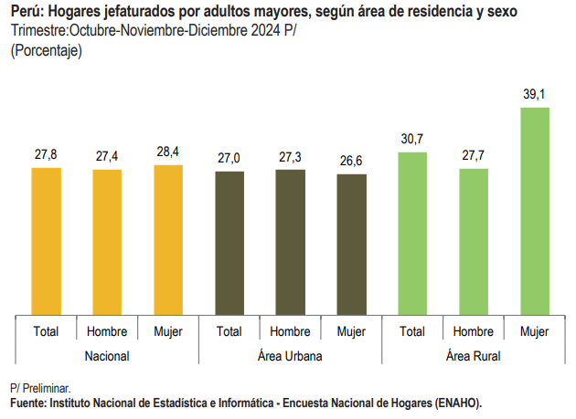

Imagen 1. Hogares jefaturados por adultos mayores, según área de residencia y sexo. Tomado de <em>Informe Técnico: Situación de la Población Adulta Mayor</em>, por Instituto Nacional de Estadística e Informática [INEI], 2025, p. 3 (https://m.inei.gob.pe/media/MenuRecursivo/boletines/informe-tecnico_adultomayor.pdf).

### How (¿Cómo?)

Se propone Serenia, una solución compuesta por dos aplicaciones móviles conectadas: una dirigida al adulto mayor y otra dirigida al familiar a distancia. La app del adulto mayor inicia proactivamente un check-in diario de un solo toque con preguntas variables y ligeras (no solo "¿cómo estás?"), ofrece un espacio opcional de "cuéntame algo" (mensajes de audio cortos), recordatorios de contacto social, control sobre su propia sensibilidad, un modo simplificado y un botón de auxilio siempre visible. La app del familiar ofrece un panel de estado diario, alertas solo ante señales fuera de lo habitual, sugerencias suaves de acción, registro de pequeñas victorias, coordinación entre varios familiares y notas compartidas. El diferenciador central es que la propuesta busca sentirse como compañía con respaldo y no como una herramienta de vigilancia o monitoreo clínico.

### How much (¿Cuánto?)

El costo de no resolver este problema no es solo emocional, sino también económico y de salud mental para quienes ejercen el rol de cuidado a distancia: el Banco Interamericano de Desarrollo (BID, 2024), en una encuesta aplicada en 25 países de América Latina y el Caribe, encontró que el 31% de los cuidadores no remunerados de personas mayores reporta síntomas de depresión y que el 44% ha tenido que dejar su empleo para poder cuidar (Banco Interamericano de Desarrollo [BID], 2024). Esto evidencia que, sin una herramienta que aligere la carga de supervisión constante, el desgaste recae de forma directa sobre la salud mental y la estabilidad laboral del familiar cuidador. Para el AV1, el alcance se limita al análisis del problema, la propuesta de valor y el diseño de la solución (sin desarrollo de código todavía), enfocado en las dos aplicaciones descritas: la app nativa para el adulto mayor y la app cross-platform para el familiar.

 

### 1.2.2. Lean UX Process

Esta sección desarrolla el Lean UX Process aplicado al dominio del problema de Serenia, siguiendo la metodología de Lean UX (Gothelf & Seiden, 2021). Se parte de un Problem Statement único para todo el proyecto, se derivan los Assumptions organizados según los cinco tipos propuestos por Lean UX, se construyen los Hypothesis Statements correspondientes a cada Feature Assumption, y finalmente se consolida todo en un Lean UX Canvas.

#### 1.2.2.1. Lean UX Problem Statements

El estado actual de **la comunicación entre adultos mayores que viven solos y sus familiares a distancia** se ha enfocado principalmente en **llamadas telefónicas reactivas motivadas por la ansiedad, y en aplicaciones de monitoreo de salud con un enfoque clínico y de vigilancia constante**.

Lo que los productos o servicios existentes no logran resolver es **una forma de comunicación cotidiana, ligera y bidireccional que transmita bienestar emocional sin invadir la autonomía del adulto mayor ni generar una carga de vigilancia sobre el familiar**.

Nuestro producto resolverá esta brecha **ofreciendo un check-in diario de un solo toque para el adulto mayor, con preguntas variables y un tono de compañía (no clínico), y un panel de estado para el familiar que solo emite alertas cuando algo se sale de lo habitual**.

Nuestro enfoque inicial será **adultos mayores de 60 años a más que viven solos en zonas urbanas del Perú, y sus familiares directos de 25 a 59 años que residen en una ciudad o distrito distinto**.

Sabremos que hemos tenido éxito cuando veamos **una alta tasa de check-ins diarios completados por el adulto mayor, una reducción en la frecuencia de llamadas motivadas por ansiedad por parte del familiar, y un uso recurrente del panel de estado sin necesidad de soporte o intervención externa**.

 

#### 1.2.2.2. Lean UX Assumptions

**Business Assumptions**
- Existe un mercado desatendido de soluciones de comunicación familiar a distancia que no dependen de dispositivos médicos ni wearables costosos.
- Un modelo freemium (funciones básicas gratuitas, funciones familiares avanzadas de pago) es viable como estrategia de monetización, dado el bajo costo de adquisición vía recomendación familiar (boca a boca).
- VitalCare puede posicionarse como alternativa a las apps de monitoreo de salud, diferenciándose por su enfoque emocional y no clínico.

**Business Outcome Assumptions**
- El aumento en la cantidad de check-ins completados por semana indicará que la solución se está adoptando como hábito.
- La reducción en el costo de soporte/atención al cliente (menos consultas del tipo "¿cómo sé si está bien mi familiar?") indicará que el panel de estado cumple su función sin fricción.
- El incremento en el número de familiares que se registran a partir de una recomendación de otro usuario validará el boca a boca como canal de adquisición.

**User Assumptions**
- El adulto mayor que vive solo tiene acceso a un smartphone táctil y sabe realizar interacciones simples (tocar un botón, grabar un audio).
- El familiar a distancia revisa su smartphone varias veces al día y está dispuesto a instalar una aplicación adicional para conocer el bienestar de su familiar.
- Ambos segmentos desconfían de soluciones que se sientan "médicas" o de vigilancia constante.

**User Outcome and Benefit Assumptions**
- El adulto mayor obtiene una forma de expresar cómo se siente sin tener que iniciar una llamada ni dar explicaciones extensas.
- El familiar obtiene tranquilidad diaria sin tener que llamar constantemente ni sentir que está invadiendo la rutina del adulto mayor.
- Ambos segmentos fortalecen su vínculo emocional a través de interacciones ligeras (como "cuéntame algo"), en lugar de limitarse a reportes de estado.

**Feature Assumptions**
- Un check-in diario de un solo toque con preguntas variables reducirá la fricción de comunicación para el adulto mayor.
- Un espacio de "cuéntame algo" (audio corto) permitirá capturar momentos cotidianos que fortalezcan el vínculo familiar.
- Un panel de estado con alertas inteligentes (solo ante anomalías) evitará que el familiar revise la aplicación de forma ansiosa.
- Un botón de auxilio siempre visible cubrirá el escenario de emergencia sin necesidad de vigilancia constante.

 

#### 1.2.2.3. Lean UX Hypothesis Statements

1. **Check-in diario de un toque**: Creemos que lograremos *una alta tasa de adopción diaria del check-in* si *los adultos mayores que viven solos en zonas urbanas del Perú* logran *comunicar su estado de ánimo sin esfuerzo ni necesidad de dar explicaciones extensas* con *un check-in de un solo toque con preguntas ligeras y variables*.
2. **"Cuéntame algo"**: Creemos que lograremos *un mayor vínculo emocional percibido entre ambos segmentos* si *los adultos mayores y sus familiares a distancia* logran *compartir momentos cotidianos más allá de reportes de bienestar* con *un espacio de grabación de audio corto llamado "cuéntame algo"*.
3. **Panel de estado con alertas inteligentes**: Creemos que lograremos *una reducción en la frecuencia de llamadas motivadas por ansiedad* si *los familiares a distancia* logran *conocer el estado de bienestar de su familiar sin necesidad de preguntar constantemente* con *un panel de estado diario que solo emite alertas cuando se detecta una anomalía*.
4. **Botón de auxilio**: Creemos que lograremos *mayor confianza en la solución como respaldo ante emergencias* si *los adultos mayores que viven solos* logran *solicitar ayuda de forma inmediata en caso de urgencia* con *un botón de auxilio siempre visible y de fácil acceso*.

 

#### 1.2.2.4. Lean UX Canvas

El Lean UX Canvas consolida el Business Problem, los Business Outcomes, los Users, los User Outcomes & Benefits, las Solutions y las Hypotheses desarrolladas en las subsecciones anteriores, junto con la identificación de la asunción de mayor riesgo (Segmento 1 adoptando el check-in diario como hábito) y el experimento de menor esfuerzo para validarla.

  
     <i>Imagen 2. Lean UX Canvas.</i>

URL del archivo en Figma: https://www.figma.com/design/MtWwz8GxmrY0eR7eyc2UC0/Lean-UX-Canvas--Serenia-?node-id=0-1

 

## 1.3. Segmentos objetivo

Serenia conecta a dos perfiles de usuarios clave, definidos a partir del problema que resolvemos y respaldados por la realidad demográfica peruana.

#### Segmento 1: Adultos mayores que viven solos

- **Perfil:** Personas de 60 años a más, residentes en zonas urbanas del Perú, que viven solas y cuentan con un teléfono celular.

- **Sustento:** Aunque se suele pensar que la tecnología es una barrera, las cifras dicen lo contrario. En este grupo etario, el uso de celular llega al 97,7%, y la penetración de internet en áreas urbanas alcanza el 56,8% (INEI, 2025b). Además, el 25,3% de los hogares limeños con jefatura adulta mayor son unipersonales (INEI, 2025a). Esto confirma un escenario claro: existe un grupo numeroso de adultos mayores viviendo sin compañía permanente, pero que ya tienen en sus manos el dispositivo necesario para aprovechar una interacción sencilla, de un solo toque, como la que propone Serenia.

#### Segmento 2: Familiares a distancia

- **Perfil:** Hijos, hijas o parientes cercanos de 25 a 59 años que no conviven con el adulto mayor (ya sea por migración a otra ciudad o por vivir en distritos distintos) y buscan saber de ellos sin recurrir a llamadas constantes.

- **Sustento:** Lima concentra el 45,4% de los migrantes internos del país por motivos laborales o educativos (Carrasco Freitas, 2026), evidenciando una alta proporción de familias separadas geográficamente. Para acortar esta distancia, la tecnología es el puente ideal: el 95,4% de hogares peruanos ya cuenta con un smartphone (OSIPTEL, 2026), con una adopción que bordea el 95% en los adultos jóvenes y de mediana edad. Así, este segmento combina perfectamente la necesidad emocional de estar presentes con la fluidez tecnológica para integrar la app en su rutina diaria.

 

# Capítulo II: Requirements Development and Software Solution Design
## 2.1. Competidores

### 2.1.1. Análisis competitivo

Esta sección tiene como objetivo profundizar en el conocimiento de los competidores, contrastando la percepción inicial con un análisis más detallado. Para ello, se desarrolla el siguiente Landscape:

<table>
  <tr>
    <th colspan="6" align="center">Competitive analysis landscape</th>
  </tr>
  <tr>
    <td colspan="2"><b>¿Por qué llevar a cabo este análisis?</b></td>
    <td colspan="4">
      Comparar las soluciones que ya existen en el mercado para el cuidado y bienestar de adultos mayores, con el fin de identificar por qué Serenia es una mejor opción: cómo se diferencia de cada una y cómo resuelve el problema de la desconexión entre el adulto mayor y su familia de una forma que ellas no logran.
    </td>
  </tr>
  <tr>
    <td colspan="2" align="center"><i>Competidor</i></td>
    <td align="center">
       
      <b>Serenia</b>
    </td>
    <td align="center">
       
      <b>Snug Safety</b>
    </td>
    <td align="center">
       
      <b>Caring Village</b>
    </td>
    <td align="center">
       
      <b>Papa</b>
    </td>
  </tr>

  <tr>
    <td rowspan="2" align="center"><b>Perfil</b></td>
    <td><b>Overview</b></td>
    <td>App móvil para el adulto mayor y sus seres queridos, con check-ins diarios ligeros iniciados por la app y un panel de estado tranquilo para la familia, priorizando el vínculo emocional sobre el monitoreo clínico.</td>
    <td>App 100% móvil (sin hardware) de check-in diario de un solo toque para personas que viven solas; si el usuario no responde, notifica automáticamente a sus contactos de emergencia.</td>
    <td>App móvil (iOS/Android) + web de coordinación del cuidado familiar: centraliza calendarios, tareas, medicación y mensajería entre varios cuidadores, con un asistente de IA ("Julia").</td>
    <td>Plataforma de acompañamiento a domicilio que conecta adultos mayores con "Papa Pals" (acompañantes verificados) para visitas de compañía, tareas del hogar y transporte, sin brindar cuidado médico.</td>
  </tr>
  <tr>
    <td><b>Ventaja competitiva</b> ¿Qué valor ofrece a los clientes?</td>
    <td>Comunicación bidireccional simple y de tono humano (no clínico), sin necesidad de comprar hardware adicional, pensada para el contexto de hogares peruanos con adultos mayores que viven solos.</td>
    <td>Protocolo de respuesta automática ante la falta de check-in (sin que el usuario deba pedir ayuda activamente), con un nivel gratuito genuino.</td>
    <td>Combina coordinación operativa (tareas, calendarios, documentos) con orientación de IA 24/7 en un solo "sistema de registro" para todo el equipo de cuidado.</td>
    <td>Compañía humana real y presencial (no solo digital), con costo cero para el usuario final al estar cubierta por seguros o beneficios laborales.</td>
  </tr>

  <tr>
    <td rowspan="2" align="center"><b>Perfil de Marketing</b></td>
    <td><b>Mercado objetivo</b></td>
    <td>Familias peruanas urbanas con adultos mayores que viven solos y familiares que residen en otro distrito o ciudad.</td>
    <td>Adultos mayores que viven de forma independiente en EE. UU., y adultos jóvenes/familias preocupadas por parientes que viven solos.</td>
    <td>Cuidadores familiares de adultos mayores o personas con enfermedades crónicas, especialmente equipos de cuidado distribuidos/a distancia.</td>
    <td>Miembros de planes Medicare Advantage o beneficios de empleadores en EE. UU.</td>
  </tr>
  <tr>
    <td><b>Estrategias de marketing</b></td>
    <td>Contenido dirigido a hijos/nietos cuidadores en redes sociales, alianzas con clínicas geriátricas o seguros locales, y boca a boca familiar.</td>
    <td>Cobertura de medios (AARP, The New Yorker), boca a boca y alto volumen de reseñas positivas; posicionamiento como servicio "genuinamente gratuito".</td>
    <td>Testimonios de usuarios y respaldo de profesionales de enfermería; posicionamiento como "la solución de cuidado más completa"; marketing directo al consumidor vía su plataforma web.</td>
    <td>Partnerships B2B con aseguradoras y empleadores como canal principal; baja publicidad directa al consumidor.</td>
  </tr>

  <tr>
    <td rowspan="3" align="center"><b>Perfil de Producto</b></td>
    <td><b>Productos & Servicios</b></td>
    <td>App nativa (adulto mayor) + app cross-platform (familiar): check-in diario, mensajes de audio, alertas selectivas, coordinación entre familiares.</td>
    <td>Check-in de un toque, notificación a contactos de emergencia, modo vacaciones, check-in telefónico alternativo, notas de perfil médico.</td>
    <td>Calendarios compartidos, delegación de tareas, mensajería segura, recordatorios de medicación, almacenamiento seguro de documentos, diario de bienestar, asistente de IA 24/7.</td>
    <td>Servicio de acompañamiento humano a domicilio, coordinado vía app/plataforma.</td>
  </tr>
  <tr>
    <td><b>Precios & Costos</b></td>
    <td>Modelo propuesto: freemium (funciones básicas gratuitas; funciones familiares avanzadas bajo suscripción mensual accesible).</td>
    <td>Plan gratuito con alertas de texto ilimitadas; Snug Dispatch USD 12.50/mes o USD 149.99/año con despachador profesional.</td>
    <td>Plan gratuito (1 "village", 2 miembros); Circle USD 14.99/mes (2 villages, 5 miembros); Village USD 24.99/mes (5 villages, 50 miembros).</td>
    <td>Gratuito para el usuario final (cubierto por seguros/beneficios); el cuidado de compañía tradicional cuesta USD 20–40/hora como referencia.</td>
  </tr>
  <tr>
    <td><b>Canales de distribución</b> (Web y/o Móvil)</td>
    <td>Apps móviles (Android nativo + cross-platform), sin hardware adicional requerido.</td>
    <td>App móvil (iOS/Android) únicamente, sin wearables ni hardware requerido.</td>
    <td>App móvil (iOS/Android) + plataforma web, modelo directo al consumidor.</td>
    <td>Plataforma web y móvil, con acceso mediado por aseguradoras y empleadores (B2B2C, no venta directa al público).</td>
  </tr>

  <tr>
    <td rowspan="5" align="center"><b>Análisis SWOT</b></td>
    <td colspan="5">
      Realice esto para su startup y sus competidores.
    </td>
  </tr>
  <tr>
    <td><b>Fortalezas</b></td>
    <td>No requiere hardware adicional; lenguaje cercano no clínico como diferenciador emocional; enfocado en el contexto e idioma local (Perú).</td>
    <td>Interfaz simple; soporte humano real (EE. UU.); +30 millones de check-ins completados desde 2016; +2400 reseñas 5 estrellas; cobertura mediática (AARP, The New Yorker); nivel gratuito genuino.</td>
    <td>Todo en un solo lugar ("system of record" único); asistente de IA para orientación 24/7; accesible entre generaciones sin requerir conocimientos técnicos; respaldo de profesionales de salud.</td>
    <td>Sin compromisos ni contratos a largo plazo; disponible en los 50 estados de EE. UU.; costo cero para el usuario final vía seguros; acompañantes verificados con antecedentes revisados.</td>
  </tr>
  <tr>
    <td><b>Debilidades</b></td>
    <td>Sin marca ni base de usuarios instalada; sin canal B2B con aseguradoras; depende de que ambos extremos (adulto mayor y familiar) usen la app de forma consistente.</td>
    <td>Depende de que el usuario recuerde hacer el check-in diario; el nivel gratuito solo da alertas de texto (la respuesta profesional requiere pago); sin opción wearable para quienes no pueden usar smartphone.</td>
    <td>No sustituye a clínicos, abogados ni servicios de emergencia (se declara explícitamente); el plan gratuito es muy limitado (solo 2 miembros); el enfoque en coordinación de tareas puede sentirse más "de gestión" que de compañía emocional cercana.</td>
    <td>No puede brindar cuidado médico ni personal (baño, movilidad); los "Pals" no cuentan con certificación formal de cuidado; acceso público limitado, depende de tener el seguro o beneficio laboral adecuado.</td>
  </tr>
  <tr>
    <td><b>Oportunidades</b></td>
    <td>Mercado peruano/latinoamericano de cuidado de adultos mayores aún sin un jugador digital dominante enfocado en el vínculo emocional; posibles alianzas con clínicas geriátricas o EPS locales; creciente proporción de adultos mayores viviendo solos (Andina, 2025) amplía el mercado objetivo.</td>
    <td>Creciente población de adultos mayores viviendo solos en EE. UU. que busca alternativas económicas a sistemas de monitoreo costosos; posible expansión internacional de su modelo freemium.</td>
    <td>Creciente número de cuidadores a distancia que necesitan centralizar información dispersa entre correos y documentos; posible expansión a mercados donde no existe una app equivalente.</td>
    <td>Expansión de coberturas de seguros de salud (Medicare Advantage y similares) que incluyan beneficios de compañía; crecimiento general de la tendencia de "aging in place".</td>
  </tr>
  <tr>
    <td><b>Amenazas</b></td>
    <td>Entrada de jugadores como Snug Safety o Caring Village a mercados emergentes; baja disposición a pagar suscripciones en el segmento peruano; resistencia tecnológica del adulto mayor; sustitutos informales y gratuitos (grupos de WhatsApp familiares).</td>
    <td>Aparición de apps similares gratuitas; dependencia total de que el usuario mantenga el hábito diario de check-in; competidores con mayor financiamiento.</td>
    <td>Alta competencia en el nicho de apps de coordinación de cuidado familiar en EE. UU.; depende de que todos los miembros de la familia adopten la plataforma para que funcione.</td>
    <td>Dependencia total de contratos B2B con aseguradoras y empleadores (si se cancelan, se pierde el canal de acceso); competencia de otras plataformas de cuidado tipo gig.</td>
  </tr>
</table>

 

### 2.1.2. Estrategias y tácticas frente a competidores

A partir del análisis competitivo y el FODA desarrollado, se plantean las siguientes estrategias y tácticas preliminares que Serenia aplicará para afrontar las fortalezas de la competencia, aprovechar sus debilidades, y responder al contexto de oportunidades y amenazas del entorno.

<table>
  <tr>
    <th colspan="2" align="center">Matriz de estrategias (TOWS): Serenia frente a la competencia</th>
  </tr>
  <tr>
    <td width="25%"><b>Fortalezas + Oportunidades (FO)</b> Usar las fortalezas propias para capitalizar oportunidades del entorno</td>
    <td>
      Aprovechar el lenguaje cercano y no clínico de Serenia, junto con su bajo costo de entrada (no requiere comprar hardware ni pagar planes B2B), para capturar el mercado peruano y latinoamericano que Snug Safety, Caring Village y Papa aún no atienden, ya que las tres soluciones están diseñadas y comercializadas principalmente para EE. UU. Esta ventana se refuerza con la creciente proporción de adultos mayores que viven solos en Lima Metropolitana (Andina, 2025), lo que amplía el mercado objetivo antes de que un jugador extranjero localice su oferta.
    </td>
  </tr>
  <tr>
    <td><b>Fortalezas + Amenazas (FA)</b> Usar las fortalezas propias para neutralizar amenazas externas</td>
    <td>
      Frente a la amenaza de que jugadores como Snug Safety o Caring Village ingresen a mercados emergentes, Serenia debe afianzar su ventaja de contexto local (idioma, sensibilidad cultural, alianzas con clínicas geriátricas o EPS peruanas) antes de que estas empresas adapten su oferta a la región. Frente a la resistencia tecnológica del adulto mayor, se mantiene la interacción de un solo toque en el check-in diario como barrera de simplicidad, replicando el principio de check-in ultra simple que hace fuerte a Snug Safety, pero con un enfoque emocional y no solo de seguridad/emergencia.
    </td>
  </tr>
  <tr>
    <td><b>Debilidades + Oportunidades (DO)</b> Corregir debilidades propias apoyándose en oportunidades del entorno</td>
    <td>
      Para compensar la falta de marca instalada y de un canal B2B (a diferencia de Papa, que accede a usuarios mediante seguros y beneficios laborales), Serenia puede buscar alianzas tempranas con EPS, clínicas geriátricas o municipios peruanos que permitan escalar sin depender únicamente de la adquisición directa al consumidor. Asimismo, se debe aprovechar el vacío de mercado identificado para posicionarse antes de que surja un competidor local equivalente.
    </td>
  </tr>
  <tr>
    <td><b>Debilidades + Amenazas (DA)</b> Minimizar debilidades propias y evitar el impacto de amenazas externas</td>
    <td>
      Dado que Serenia depende de que ambos extremos (adulto mayor y familiar) adopten la app de forma consistente, y que existe baja disposición a pagar suscripciones en el segmento peruano, se debe ofrecer un modelo freemium con fricción mínima de onboarding, siguiendo el ejemplo del nivel gratuito genuino de Snug Safety y evitando planes con límites muy restrictivos como el de Caring Village (solo 2 miembros en su plan gratuito). Esto también reduce el riesgo de que sustitutos informales y gratuitos, como los grupos familiares de WhatsApp, sigan siendo la opción por defecto.
    </td>
  </tr>
</table>

 

## Tácticas específicas frente a cada competidor

Frente a **Snug Safety**, cuya fortaleza es el check-in diario simple y gratuito con gran base de usuarios en EE. UU., Serenia diferencia su propuesta enfocándose en el vínculo emocional (preguntas variables, mensajes de audio "cuéntame algo") y no solo en la señal de seguridad/emergencia, además de dirigirse a un mercado (Perú) donde Snug Safety no tiene presencia ni soporte en español.

Frente a **Caring Village**, cuya fortaleza es centralizar toda la coordinación del cuidado familiar en un solo lugar con apoyo de IA, Serenia se posiciona como una alternativa más ligera y cercana emocionalmente, sin la complejidad de gestión de tareas/calendarios que puede sentirse corporativa, aprovechando además que su plan gratuito es muy limitado (solo 2 miembros).

Frente a **Papa**, cuya fortaleza es la compañía humana presencial, Serenia posiciona su espacio de "cuéntame algo" y el check-in emocional diario como un complemento cotidiano entre visitas físicas esporádicas, no como un sustituto, aprovechando además que Papa depende de contratos con aseguradoras y empleadores estadounidenses y no tiene presencia en el mercado peruano.

 

## 2.2. Entrevistas

### 2.2.1. Diseño de entrevistas

Para conocer mejor a nuestros dos segmentos, se diseñaron dos guías de entrevista: una para adultos mayores que viven solos y otra para familiares a distancia. Las preguntas van de lo general (datos personales, rutina) a lo más específico (vínculo familiar, tecnología, frustraciones), buscando entender tanto hechos concretos como sentimientos y motivaciones de cada entrevistado.

#### Segmento 1: Adultos mayores que viven solos

1. ¿Cuál es su nombre, edad y distrito de residencia?
2. ¿Vive solo/a? ¿Desde hace cuánto tiempo?
3. ¿Cuál es su estado civil? ¿Tiene hijos u otros familiares cercanos?
4. ¿A qué se dedica o se dedicaba usted?
5. ¿Cómo es un día normal para usted?
6. ¿Con qué frecuencia sale de casa y para qué?
7. ¿Con qué frecuencia habla con sus familiares que no viven con usted?
8. Cuando tiene un mal día, ¿se lo cuenta a su familia? ¿Por qué?
9. ¿Qué celular usa: táctil o de botones?
10. ¿Qué aplicaciones usa más seguido?
11. ¿Alguna vez sintió que no quiere "molestar" a su familia contándole algo suyo?
12. ¿Qué le frustra o incomoda de usar aplicaciones o el celular?

#### Segmento 2: Familiares a distancia

1. ¿Cuál es su nombre, edad y distrito de residencia?
2. ¿Cuál es su estado civil y con quién vive actualmente?
3. ¿A qué se dedica actualmente?
4. ¿Quién es su familiar adulto mayor que vive solo y hace cuánto no conviven?
5. ¿Con qué frecuencia se comunica con él/ella y por qué medio?
6. ¿Alguna vez sintió ansiedad por no saber cómo estaba? Cuénteme.
7. ¿Qué es lo que más le preocupa sobre su bienestar?
8. ¿Coordina con otros familiares para comunicarse con él/ella?
9. ¿Qué smartphone usa y qué apps usa con más frecuencia?
10. ¿Ha usado alguna app de monitoreo de salud o bienestar familiar?
11. Si pudiera ver diariamente cómo está su familiar sin llamarlo, ¿qué información le gustaría ver?
12. ¿Qué le generaría desconfianza en una app así?

 

### 2.2.2. Registro de entrevistas

Para cada segmento se registraron entre 3 y 5 entrevistas. Todas las entrevistas se editarán en un único video, por lo que el campo "Timing en el video" indica el momento exacto (inicio-fin) en que se ubica cada una dentro de dicho video consolidado.

 

#### Segmento 1: Adultos mayores que viven solos

##### Entrevista 1

 

<table align="center">
  <tr><th>Campo</th><th>Detalle</th></tr>
  <tr><td><b>Nombres y apellidos</b></td><td>Yrma Huamán Jiménez</td></tr>
  <tr><td><b>Edad</b></td><td>61 años</td></tr>
  <tr><td><b>Distrito</b></td><td>Tarapoto, San Martín</td></tr>
  <tr><td><b>Timing en el video</b></td><td><i>00:03</i></td></tr>
  <tr><td><b>URL del video</b></td><td><i> <a href="https://upcedupe-my.sharepoint.com/:v:/g/personal/u202414970_upc_edu_pe/IQCGnQ62jYHXR64Bx3zDMu5VAS2WHslQx9PQog9g6PNzP0o?e=xnrkLf&nav=eyJyZWZlcnJhbEluZm8iOnsicmVmZXJyYWxBcHAiOiJTdHJlYW1XZWJBcHAiLCJyZWZlcnJhbFZpZXciOiJTaGFyZURpYWxvZy1MaW5rIiwicmVmZXJyYWxBcHBQbGF0Zm9ybSI6IldlYiIsInJlZmVycmFsTW9kZSI6InZpZXcifX0%3D">Enlace de entrevistas</a></i></td></tr>
</table>

**Resumen:**

Yrma vive sola hace 6 años en Tarapoto, desde que sus dos hijas (abogada y administradora) se mudaron a Lima por estudios y luego trabajo. Es profesora jubilada, con una rutina tranquila centrada en el hogar (cocina, televisión, revisar el celular por las tardes) y sale de casa solo 2-3 veces por semana para el mercado. Habla con sus hijas casi a diario por WhatsApp, llamada o mensaje, aunque a veces pasan 2-3 días. Un patrón clave: cuando tiene un mal día, prefiere no contarlo para no preocupar a sus hijas ni sentir que es una carga para ellas, sabiendo que están lejos y "solo van a poder preocuparse". En tecnología, usa un smartphone táctil (Samsung) que le regalaron sus hijas; sus apps más usadas son WhatsApp, Facebook (fotos y noticias) y Messenger. Como frustración, menciona dificultad con funciones nuevas y que el celular "se traba". Por eso evita llamar a sus hijas para no interrumpirlas en su trabajo, reforzando el mismo patrón de no querer molestar.

 

##### Entrevista 2

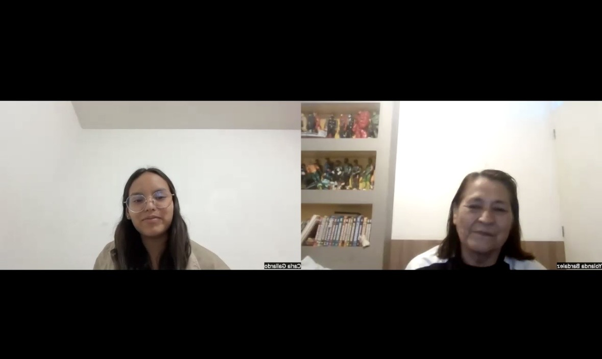

 

<table align="center">
  <tr><th>Campo</th><th>Detalle</th></tr>
  <tr><td><b>Nombres y apellidos</b></td><td><i>Yolanda Bardalez Hernandez vda. de Gallardo</i></td></tr>
  <tr><td><b>Edad</b></td><td><i>74 años</i></td></tr>
  <tr><td><b>Distrito</b></td><td><i>Chorrillos</i></td></tr>
  <tr><td><b>Timing en el video</b></td><td><i>08:34</i></td></tr>
  <tr><td><b>URL del video</b></td><td><i> <a href="https://upcedupe-my.sharepoint.com/:v:/g/personal/u202414970_upc_edu_pe/IQCGnQ62jYHXR64Bx3zDMu5VAS2WHslQx9PQog9g6PNzP0o?e=xnrkLf&nav=eyJyZWZlcnJhbEluZm8iOnsicmVmZXJyYWxBcHAiOiJTdHJlYW1XZWJBcHAiLCJyZWZlcnJhbFZpZXciOiJTaGFyZURpYWxvZy1MaW5rIiwicmVmZXJyYWxBcHBQbGF0Zm9ybSI6IldlYiIsInJlZmVycmFsTW9kZSI6InZpZXcifX0%3D">Enlace de entrevistas</a></i></td></tr>
</table>

**Resumen:**

Yolanda vive sola desde hace 13 años. Tiene tres hijos y nueve nietos, quienes mantienen una relación cercana con ella. Su rutina diaria consiste principalmente en realizar las compras en el mercado y encargarse de los quehaceres del hogar. Nos comenta que la mayoría de las tardes sus nietos la visitan para almorzar después de salir de la escuela.
Yolanda no suele salir diariamente; sin embargo, cada vez que sus hijos o nietos la invitan a comer o a realizar alguna actividad fuera de casa, acepta y disfruta de compartir con ellos.
En cuanto al uso de la tecnología, Yolanda utiliza principalmente su celular para realizar llamadas y comunicarse con sus hijos mediante WhatsApp. Asimismo, utiliza diariamente aplicaciones como YouTube y Facebook para entretenerse. Sin embargo, uno de sus principales motivos de frustración surge cuando no sabe cómo utilizar alguna función de su celular y necesita recurrir a las personas que se encuentran a su alrededor para solucionar el problema.
Además, menciona que en muchas ocasiones prefiere no comunicar ciertos problemas, tanto relacionados con el uso del celular como situaciones personales, por miedo a molestar a los demás o pensar que no recibirá ayuda, especialmente debido a que sus familiares viven lejos. 

 

##### Entrevista 3

 

<table align="center">
  <tr><th>Campo</th><th>Detalle</th></tr>
  <tr><td><b>Nombres y apellidos</b></td><td><i>Eva Martinez Torres</i></td></tr>
  <tr><td><b>Edad</b></td><td><i>67 años</i></td></tr>
  <tr><td><b>Distrito</b></td><td><i>Chanchamayo - Junín</i></td></tr>
  <tr><td><b>Timing en el video</b></td><td><i>13:05</i></td></tr>
  <tr><td><b>URL del video</b></td><td><i> <a href="https://upcedupe-my.sharepoint.com/:v:/g/personal/u202414970_upc_edu_pe/IQCGnQ62jYHXR64Bx3zDMu5VAS2WHslQx9PQog9g6PNzP0o?e=xnrkLf&nav=eyJyZWZlcnJhbEluZm8iOnsicmVmZXJyYWxBcHAiOiJTdHJlYW1XZWJBcHAiLCJyZWZlcnJhbFZpZXciOiJTaGFyZURpYWxvZy1MaW5rIiwicmVmZXJyYWxBcHBQbGF0Zm9ybSI6IldlYiIsInJlZmVycmFsTW9kZSI6InZpZXcifX0%3D">Enlace de entrevistas</a></i></td></tr>
</table>

**Resumen:**

Eva Martínez Torres tiene 67 años y reside en el distrito de Chanchamayo, provincia de Junín. Es casada y tiene 2 hijas, aunque vive sola desde hace 16 años; anteriormente tenía un negocio de ropa deportiva que cerró por la pandemia. Su rutina diaria incluye limpieza del hogar, compras y preparación de comidas, y ocasionalmente trabaja como costurera, saliendo con frecuencia para hacer compras o reunirse con sus amigas. Mantiene comunicación frecuente con sus hijas, aunque el contacto con el resto de la familia le resulta un poco más complicado; la mayoría de las veces comparte con su familia cuando tiene un mal día, pero procura no saturarlos con sus problemas y trata de resolverlos por su cuenta primero. En cuanto a tecnología, cuenta con un celular táctil y usa Facebook, TikTok y WhatsApp, señalando como principal molestia la lentitud ocasional de estas aplicaciones.

 

#### Segmento 2: Familiares a distancia

##### Entrevista 1

 

<table align="center">
  <tr><th>Campo</th><th>Detalle</th></tr>
  <tr><td><b>Nombres y apellidos</b></td><td><i>Isabel Maria del Carmen Morales Reyna</i></td></tr>
  <tr><td><b>Edad</b></td><td><i>60 años </i></td></tr>
  <tr><td><b>Distrito</b></td><td><i>La Molina</i></td></tr>
  <tr><td><b>Timing en el video</b></td><td><i>20:22</i></td></tr>
  <tr><td><b>URL del video</b></td><td><i> <a href="https://upcedupe-my.sharepoint.com/:v:/g/personal/u202414970_upc_edu_pe/IQCGnQ62jYHXR64Bx3zDMu5VAS2WHslQx9PQog9g6PNzP0o?e=xnrkLf&nav=eyJyZWZlcnJhbEluZm8iOnsicmVmZXJyYWxBcHAiOiJTdHJlYW1XZWJBcHAiLCJyZWZlcnJhbFZpZXciOiJTaGFyZURpYWxvZy1MaW5rIiwicmVmZXJyYWxBcHBQbGF0Zm9ybSI6IldlYiIsInJlZmVycmFsTW9kZSI6InZpZXcifX0%3D">Enlace de entrevistas</a></i></td></tr>
</table>

**Resumen:**

Isabel nos comenta que es hija de un adulto mayor de 89 años, quien vive solo desde hace aproximadamente 40 años por decisión propia. La comunicación entre ambos es casi escasa debido a la distancia entre sus hogares y, principalmente, a que su padre presenta un 95 % de discapacidad visual y no utiliza el celular, ya que se le dificulta manejarlo. Por ello, su principal medio de comunicación es la presencialidad.
Isabel expresa su preocupación por el bienestar de su padre cuando se encuentra solo, debido a que, por su avanzada edad y condición visual, podría sufrir alguna caída o presentar algún problema relacionado con su salud sin contar con alguien que pueda asistirlo inmediatamente. Por esta razón, le gustaría que nuestra aplicación cuente con cámaras que le permitan monitorear a su padre a distancia, así como conocer determinadas actividades, por ejemplo, si ha abierto la puerta o si ha dormido a sus horas.
Asimismo, considera importante que la aplicación sea de fácil uso y accesible, tomando en cuenta la condición visual de su padre. También manifestó su interés en que la solución incluya una sección de juegos mentales y noticias informativas dirigidas a los adultos mayores, con el objetivo de mantenerlos activos y entretenidos.
Isabel nos comentó que nunca ha utilizado una aplicación enfocada en salud o bienestar familiar; sin embargo, estaría dispuesta a probar nuestra solución, ya que considera que existen pocos proyectos que se preocupen específicamente por el bienestar y cuidado de los adultos mayores.

 

##### Entrevista 2

 

<table align="center">
  <tr><th>Campo</th><th>Detalle</th></tr>
  <tr><td><b>Nombres y apellidos</b></td><td><i>Enrique Isaias Guzmán Miranda</i></td></tr>
  <tr><td><b>Edad</b></td><td><i>74 años</i></td></tr>
  <tr><td><b>Distrito</b></td><td><i>Mollendo - Arequipa</i></td></tr>
  <tr><td><b>Timing en el video</b></td><td><i>46:55</i></td></tr>
  <tr><td><b>URL del video</b></td><td><i> <a href="https://upcedupe-my.sharepoint.com/:v:/g/personal/u202414970_upc_edu_pe/IQCGnQ62jYHXR64Bx3zDMu5VAS2WHslQx9PQog9g6PNzP0o?e=xnrkLf&nav=eyJyZWZlcnJhbEluZm8iOnsicmVmZXJyYWxBcHAiOiJTdHJlYW1XZWJBcHAiLCJyZWZlcnJhbFZpZXciOiJTaGFyZURpYWxvZy1MaW5rIiwicmVmZXJyYWxBcHBQbGF0Zm9ybSI6IldlYiIsInJlZmVycmFsTW9kZSI6InZpZXcifX0%3D">Enlace de entrevistas</a></i></td></tr>
</table>

**Resumen:**

Enrique Guzmán Miranda es un adulto mayor jubilado que actualmente continúa realizando actividades laborales de manera independiente y por horas. Vive con su esposa, quien continúa trabajando como gerente de una empresa. Enrique nos comenta que su madre tiene 96 años y vive sola desde el fallecimiento de su esposo, ya que siempre ha preferido permanecer en su propia casa a pesar de que sus hijos intentaron que viviera con alguno de ellos. Debido al deterioro propio de la edad, actualmente necesita asistencia permanente y cuenta con cuidadoras durante el día y la noche. Enrique la visita casi interdiariamente y se encarga de llevarle alimentos, realizar compras y atender sus necesidades, mientras que una de sus hermanas vive al lado y puede atender cualquier emergencia. Además, la familia utiliza cámaras de vigilancia las 24 horas para supervisar su bienestar y el trato que recibe de las cuidadoras. Actualmente, su madre tiene dificultades para caminar, utiliza una silla de ruedas y presenta una pérdida considerable de audición, aunque se encuentra estable de salud y recibe visitas médicas periódicas. Las cuidadoras registran diariamente su temperatura, pulso, presión y cualquier anomalía en un cuaderno de bitácora que los familiares revisan durante sus visitas. Enrique considera que una aplicación de monitoreo podría ser de mucha ayuda para conocer el estado de su madre y recibir información sin depender exclusivamente de llamadas o visitas; sin embargo, desconfía de que una aplicación pueda realizar diagnósticos médicos adecuados, ya que un error podría ocasionar una medicación incorrecta y empeorar su estado de salud. Por ello, considera especialmente importantes funciones como el monitoreo de signos vitales, registro de información, alertas de emergencia y supervisión del bienestar del adulto mayor.

 

##### Entrevista 3

*

 

<table align="center">
  <tr><th>Campo</th><th>Detalle</th></tr>
  <tr><td><b>Nombres y apellidos</b></td><td><i>José Cámara</i></td></tr>
  <tr><td><b>Edad</b></td><td><i>20 años</i></td></tr>
  <tr><td><b>Distrito</b></td><td><i>Surco</i></td></tr>
  <tr><td><b>Timing en el video</b></td><td><i>42:33</i></td></tr>
  <tr><td><b>URL del video</b></td><td><i> <a href="https://upcedupe-my.sharepoint.com/:v:/g/personal/u202414970_upc_edu_pe/IQCGnQ62jYHXR64Bx3zDMu5VAS2WHslQx9PQog9g6PNzP0o?e=xnrkLf&nav=eyJyZWZlcnJhbEluZm8iOnsicmVmZXJyYWxBcHAiOiJTdHJlYW1XZWJBcHAiLCJyZWZlcnJhbFZpZXciOiJTaGFyZURpYWxvZy1MaW5rIiwicmVmZXJyYWxBcHBQbGF0Zm9ybSI6IldlYiIsInJlZmVycmFsTW9kZSI6InZpZXcifX0%3D">Enlace de entrevistas</a></i></td></tr>
</table>

**Resumen:**

José es un joven soltero que reside con su padre y dos hermanos menores. Su rutina diaria es bastante pesada, ya que estudia en la universidad por las mañanas y trabaja como supervisor de turno en el área de ventas y atención al cliente durante las tardes. Su familiar adulto mayor es su abuela materna, con quien dejó de convivir hace aproximadamente cuatro años. Él intenta comunicarse con ella diariamente llamándola a su celular antes de entrar a su turno de trabajo. Sin embargo, debido al ritmo acelerado de su día, a veces se le pasa. José experimenta ansiedad y angustia cuando su abuela no contesta el teléfono rápidamente, preocupándose de que haya sufrido una caída o un problema de salud y él no pueda asistirla por estar trabajando. Además, menciona que no tiene una coordinación clara con su padre sobre quién se comunica con ella, asumiendo a veces que la otra persona ya lo hizo. Utiliza un dispositivo Android y sus aplicaciones principales son WhatsApp, Spotify y las herramientas de la universidad. Nunca ha utilizado aplicaciones de monitoreo de salud familiar porque las considera invasivas. Le gustaría contar con una herramienta que le permita confirmar que su abuela se levantó bien, que está de buen ánimo o poder escuchar un audio suyo, brindándole paz mental sin estresarla. Le genera desconfianza que una aplicación sea difícil de usar para ella o que parezca un reporte médico que invada su privacidad.

 

##### Entrevista 4

 

<table align="center">
  <tr><th>Campo</th><th>Detalle</th></tr>
  <tr><td><b>Nombres y apellidos</b></td><td><i>Kevin</i></td></tr>
  <tr><td><b>Edad</b></td><td><i>27 años</i></td></tr>
  <tr><td><b>Distrito</b></td><td><i>San Juan de Miraflores</i></td></tr>
  <tr><td><b>Timing en el video</b></td><td><i>35:53</i></td></tr>
  <tr><td><b>URL del video</b></td><td><i> <a href="https://upcedupe-my.sharepoint.com/:v:/g/personal/u202414970_upc_edu_pe/IQCGnQ62jYHXR64Bx3zDMu5VAS2WHslQx9PQog9g6PNzP0o?e=xnrkLf&nav=eyJyZWZlcnJhbEluZm8iOnsicmVmZXJyYWxBcHAiOiJTdHJlYW1XZWJBcHAiLCJyZWZlcnJhbFZpZXciOiJTaGFyZURpYWxvZy1MaW5rIiwicmVmZXJyYWxBcHBQbGF0Zm9ybSI6IldlYiIsInJlZmVycmFsTW9kZSI6InZpZXcifX0%3D">Enlace de entrevistas</a></i></td></tr>
</table>

**Resumen:**

Kevin está comprometido y vive con su novia y su hijo recién nacido. Trabaja como contador en una empresa corporativa, cumpliendo un horario de oficina que en ocasiones se extiende hasta más tarde. Su familiar adulto mayor es su padre, quien vive solo en otra provincia desde hace casi 10 años tras separarse la familia por temas de salud de la madre. La comunicación entre ellos se da casi todos los días a través de WhatsApp, pero las llamadas telefónicas suelen limitarse a los fines de semana. Kevin siente preocupación durante las tardes en el trabajo, imaginando si su padre pudo haber sufrido una caída o ser víctima de la delincuencia sin tener a nadie cerca para auxiliarlo. Coordina ocasionalmente con su hermana, que también vive lejos, pero a veces asumen de forma incorrecta que el otro ya se comunicó. Utiliza un celular Xiaomi con sistema Android y frecuenta aplicaciones como WhatsApp, el correo laboral, LinkedIn y aplicaciones bancarias. Anteriormente, intentó usar Google Maps para compartir la ubicación, pero a su padre no le gustó la experiencia porque se sentía vigilado o espiado. A Kevin le gustaría una solución que le confirme, mediante datos puntuales, que su padre inició bien el día y que todo está en orden, permitiéndole trabajar tranquilo. Su principal motivo de desconfianza hacia una nueva aplicación es que requiera demasiados datos médicos o personales, o que posea una interfaz compleja que termine estresando a su padre, quien no es muy intuitivo con la tecnología.

 

### 2.2.3. Análisis de entrevistas

#### Segmento 1: Adultos mayores que viven solos

A partir de las tres entrevistas realizadas a adultos mayores que viven solos, se identificaron características comunes relacionadas con su situación familiar, rutina diaria, comunicación con sus familiares y uso de tecnología. Estos aspectos permiten reconocer patrones importantes para la construcción del arquetipo del segmento.

#### Características objetivas

| Característica | Resultado | Porcentaje |
|---|---:|---:|
| Viven solos | 3 de 3 entrevistadas | 100 % |
| Tienen hijos | 3 de 3 entrevistadas | 100 % |
| Mantienen comunicación con sus familiares | 3 de 3 entrevistadas | 100 % |
| Utilizan smartphone | 3 de 3 entrevistadas | 100 % |
| Utilizan WhatsApp | 3 de 3 entrevistadas | 100 % |
| Realizan actividades del hogar | 3 de 3 entrevistadas | 100 % |
| Presentan dificultades ocasionales con el uso del celular | 3 de 3 entrevistadas | 100 % |

Las tres entrevistadas viven solas, aunque mantienen algún nivel de contacto con sus familiares. Yrma vive sola desde hace 6 años, Yolanda desde hace 13 años y Eva desde hace 16 años. A pesar de esta situación, las tres mantienen comunicación con sus hijos o familiares mediante llamadas, WhatsApp o mensajes.

En cuanto a su rutina, las entrevistadas realizan principalmente actividades relacionadas con el hogar, como cocinar, limpiar y realizar compras. Eva, además, realiza ocasionalmente trabajos de costura y sale para reunirse con sus amigas, mientras que Yolanda suele recibir la visita de sus nietos y salir cuando sus familiares la invitan.

Respecto al uso de tecnología, las tres cuentan con un celular táctil y utilizan WhatsApp como uno de sus principales medios de comunicación. También utilizan otras aplicaciones como Facebook, Messenger, YouTube y TikTok. Sin embargo, las tres mencionan dificultades cuando se enfrentan a funciones nuevas, problemas de rendimiento o situaciones que no saben resolver por sí mismas.

#### Características subjetivas

Uno de los patrones más importantes encontrados es el temor a molestar o preocupar a sus familiares. En las tres entrevistas aparece, aunque con diferentes matices, la tendencia a intentar resolver los problemas por cuenta propia antes de comunicarlos.

Yrma menciona que cuando tiene un mal día prefiere no contarles a sus hijas para no preocuparlas, especialmente porque se encuentran lejos. Yolanda también señala que en algunas ocasiones evita comunicar problemas personales por miedo a molestar a los demás o pensar que no recibirá ayuda. Por su parte, Eva suele compartir sus problemas con su familia, pero procura no saturarlos y primero intenta resolverlos por sí misma.

Esto permite identificar que 3 de 3 entrevistadas (100 %) presentan algún nivel de reserva al momento de comunicar sus problemas o necesidades, principalmente para no convertirse en una carga para sus familiares.

Otro aspecto común es la necesidad de sentirse acompañadas y mantener el vínculo familiar, a pesar de vivir solas. Las tres valoran la comunicación con sus hijos o familiares y encuentran en el celular una herramienta importante para mantenerse conectadas.

Finalmente, existe una dificultad tecnológica recurrente. Las entrevistadas utilizan el celular para comunicarse y entretenerse, pero no siempre se sienten seguras utilizando nuevas funciones. Yrma menciona que el celular puede trabarse y que evita llamar para no interrumpir a sus hijas, Yolanda necesita pedir ayuda cuando no sabe utilizar alguna función, y Eva señala como molestia la lentitud ocasional de algunas aplicaciones.

#### Principales patrones identificados

| Patrón identificado | Entrevistas relacionadas | Porcentaje |
|---|---|---:|
| Vive sola | Yrma, Yolanda, Eva | 100 % |
| Mantiene comunicación con familiares | Yrma, Yolanda, Eva | 100 % |
| Usa WhatsApp | Yrma, Yolanda, Eva | 100 % |
| Presenta dificultades con algunas funciones del celular | Yrma, Yolanda, Eva | 100 % |
| Evita comunicar algunos problemas para no molestar | Yrma, Yolanda, Eva | 100 % |
| Busca mantener una relación cercana con su familia | Yrma, Yolanda, Eva | 100 % |

#### Segmento 2: Familiares a distancia

A partir de las cuatro entrevistas realizadas a familiares de adultos mayores que viven separados de ellos, se identificaron características comunes relacionadas con la distancia, la preocupación por el bienestar del adulto mayor, la comunicación familiar y la necesidad de contar con información sobre su estado sin invadir su privacidad. Estos aspectos permiten reconocer patrones relevantes para la construcción del arquetipo del segmento.

#### Características objetivas

| Característica | Resultado | Porcentaje |
|---|---:|---:|
| Tienen un familiar adulto mayor que vive separado de ellos | 4 de 4 entrevistados | 100 % |
| Mantienen comunicación con el adulto mayor | 4 de 4 entrevistados | 100 % |
| Utilizan WhatsApp u otros medios digitales para comunicarse | 4 de 4 entrevistados | 100 % |
| Se preocupan por el bienestar del adulto mayor cuando no pueden contactarlo | 4 de 4 entrevistados | 100 % |
| Han experimentado dificultades para coordinar el cuidado o comunicación con otros familiares | 2 de 4 entrevistados | 50 % |
| Consideran útil recibir información sobre el estado del adulto mayor a distancia | 4 de 4 entrevistados | 100 % |
| Presentan preocupación por la privacidad o sensación de vigilancia | 2 de 4 entrevistados | 50 % |

Los cuatro entrevistados tienen un familiar adulto mayor que vive separado de ellos. Isabel tiene un padre de 89 años que vive solo, Enrique tiene una madre de 96 años, José tiene una abuela con quien dejó de convivir hace aproximadamente cuatro años y Kevin tiene un padre que vive solo en otra provincia desde hace casi diez años.

A pesar de la distancia, todos mantienen algún tipo de comunicación con el adulto mayor. WhatsApp y las llamadas telefónicas son los principales medios utilizados. Sin embargo, la frecuencia y facilidad de comunicación varían según la situación de cada familia. Por ejemplo, José intenta llamar diariamente a su abuela antes de entrar a trabajar, mientras que Kevin se comunica con su padre principalmente mediante WhatsApp y realiza llamadas durante los fines de semana.

Un aspecto común es que la distancia dificulta conocer directamente cómo se encuentra el adulto mayor. Los cuatro entrevistados expresaron preocupación ante la posibilidad de que ocurra una emergencia, una caída o algún problema de salud cuando ellos no se encuentran cerca.

#### Características subjetivas

La principal característica identificada en este segmento es la preocupación constante por el bienestar del adulto mayor. Los familiares quieren saber que la persona se encuentra bien, pero no siempre pueden visitarla o comunicarse con ella durante el día.

José, por ejemplo, experimenta ansiedad cuando su abuela no contesta rápidamente el teléfono, ya que piensa que pudo haber sufrido una caída o algún problema de salud. De manera similar, Kevin se preocupa durante su jornada laboral por la posibilidad de que su padre haya sufrido una caída o algún incidente mientras se encuentra solo.

Esto permite identificar que 4 de 4 entrevistados (100 %) presentan preocupación por no poder verificar directamente el estado del adulto mayor.

Otro patrón importante es la necesidad de recibir información puntual sin tener que realizar constantemente llamadas o visitas. Isabel considera útil poder conocer determinadas actividades de su padre, mientras que Enrique considera que una aplicación podría permitir a la familia conocer el estado de su madre sin depender exclusivamente de visitas o llamadas. José y Kevin también buscan una forma sencilla de confirmar que sus familiares iniciaron bien el día y que todo se encuentra en orden.

Asimismo, se identifica una preocupación por no invadir la privacidad del adulto mayor. José considera invasivas las aplicaciones de monitoreo y busca una solución que permita acompañar a su abuela sin estresarla. Kevin también menciona que su padre tuvo una mala experiencia con Google Maps porque sentía que estaba siendo vigilado. Por ello, 2 de 4 entrevistados (50 %) expresan directamente preocupación por la sensación de vigilancia o invasión de privacidad.

Finalmente, también aparece la necesidad de contar con una solución simple y accesible. Isabel señala que la aplicación debería ser fácil de utilizar y considerar la condición visual de su padre. José y Kevin también consideran importante que la interfaz no sea complicada para el adulto mayor, ya que esto podría generar rechazo o estrés.

#### Principales patrones identificados

| Patrón identificado | Entrevistas relacionadas | Porcentaje |
|---|---|---:|
| Se preocupa por el bienestar del adulto mayor | Isabel, Enrique, José, Kevin | 100 % |
| Mantiene comunicación a distancia | Isabel, Enrique, José, Kevin | 100 % |
| Busca confirmar que el adulto mayor se encuentra bien | Isabel, Enrique, José, Kevin | 100 % |
| Considera útil recibir información a distancia | Isabel, Enrique, José, Kevin | 100 % |
| Busca reducir la dependencia de llamadas o visitas | Isabel, Enrique, José, Kevin | 100 % |
| Presenta preocupación por la privacidad o sensación de vigilancia | José, Kevin | 50 % |
| Considera importante una interfaz sencilla | Isabel, José, Kevin | 75 % |
| Presenta problemas de coordinación con otros familiares | José, Kevin | 50 % |

 

## 2.3. Needfinding
### 2.3.1. User Personas

En esta sección se presentan los user personas construidos a partir del análisis de las entrevistas de los adultos mayores y sus familiares a distancia. Estos artefactos sintetizan patrones de comportamiento, necesidades, motivaciones y frustraciones identificadas durante la investigación, permitiendo representar de manera clara a los segmentos clave de nuestro proyecto.

### Segmento 1 - Adultos mayores que viven solos

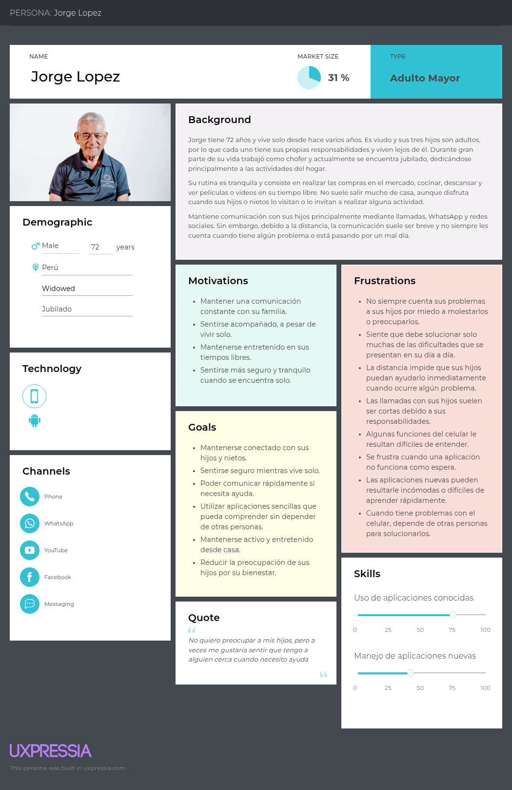
   <i>Imagen 3. User Persona - Primer Segmento.</i>

### Segmento 2 - Familiares a distancia

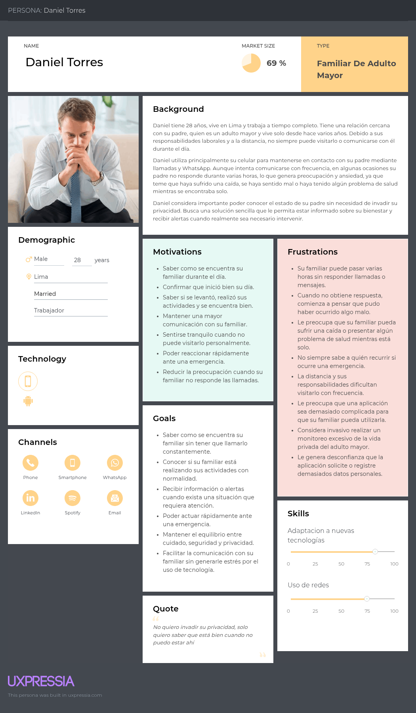
   <i>Imagen 4. User Persona - Segundo Segmento.</i>

 

### 2.3.2. User Task Matrix

En esta sección se concentran las tareas principales que los User Personas deben realizar para cumplir sus objetivos diarios de comunicación, cuidado y bienestar de manera natural y poco invasiva. Para este análisis, hemos considerado a nuestros dos segmentos principales: el Adulto Mayor y el Familiar a distancia.

 

#### Segmento 1: Adultos mayores que viven solos

| Tarea | Frecuencia | Importancia |
| :--- | :--- | :--- |
| Reportar su estado de bienestar o responder al check-in diario | Often | High |
| Solicitar ayuda inmediata mediante el botón de auxilio | Rarely | High |
| Grabar y compartir anécdotas, quejas o mensajes de voz | Sometimes | High |
| Atender recordatorios para mantener contacto social con amistades | Sometimes | Medium |
| Ajustar su nivel de interacción (modo simplificado / sin preguntas hoy) | Occasionally | High |
| Revisar recordatorios ligeros sobre rutinas (comidas, salidas) | Often | Medium |

 

#### Segmento 2: Familiares a distancia

| Tarea | Frecuencia | Importancia |
| :--- | :--- | :--- |
| Revisar el panel de estado diario (el check-in) del adulto mayor | Often | High |
| Recibir y gestionar alertas ante inactividad o respuestas inusuales | Occasionally | High |
| Escuchar las anécdotas o audios compartidos por el adulto mayor | Sometimes | High |
| Coordinar turnos de llamadas o atención con otros familiares | Sometimes | Medium |
| Registrar notas compartidas de contexto (ej. próximas citas médicas) | Occasionally | Medium |
| Recibir sugerencias de acción o ver los refuerzos positivos del día | Often | Medium |

 

**Análisis de Tareas**

Al analizar la matriz, se observa que las tareas con mayor frecuencia e importancia para ambos arquetipos giran en torno al estado diario: el adulto mayor reportando su bienestar (Often/High) y el familiar revisándolo para tener paz mental (Often/High). 

La principal diferencia radica en la naturaleza de su interacción; el adulto mayor se enfoca en la autogestión y en compartir vivencias bajo sus propios términos (ajustar privacidad, grabar audios), mientras que el familiar asume un rol de consumo de información, monitoreo sutil y coordinación logística con otros parientes. La coincidencia más crítica es el alto nivel de importancia que ambos le otorgan tanto al manejo de emergencias (alertas/botón de auxilio) como a la conexión emocional real (compartir y escuchar anécdotas), demostrando que la solución debe equilibrar la seguridad física con la salud mental.

 

### 2.3.3. User Journey Mapping

En esta sección se detallan los User Journey Maps en su versión "As-Is", uno por cada segmento de usuario definido. El objetivo de estos mapas es ilustrar el proceso de extremo a extremo que realizan actualmente los usuarios para intentar resolver su necesidad, evidenciando los puntos de dolor, las frustraciones y las ineficiencias que experimentan antes de la implementación de nuestra solución propuesta.

A continuación, se presentan los diagramas que resumen la situación actual de los usuarios:

### Segmento 1 - Adultos mayores que viven solos

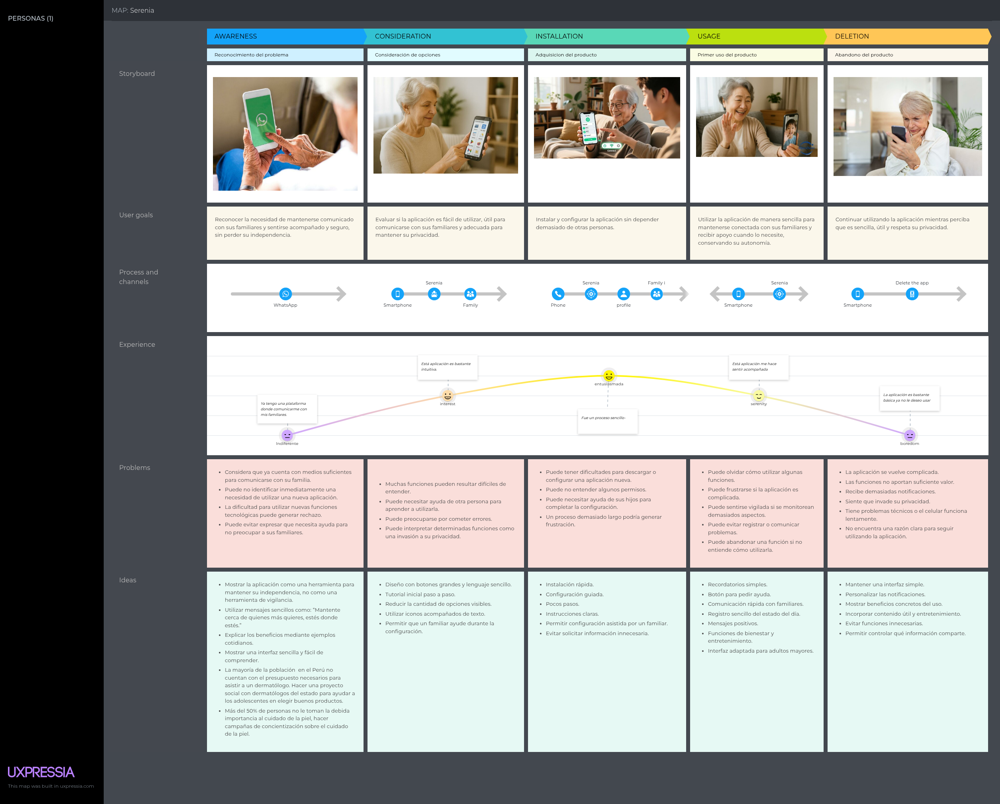
   <i>Imagen 5. User Journey Mapping - Primer Segmento.</i>

### Segmento 2 - Familiares a distancia

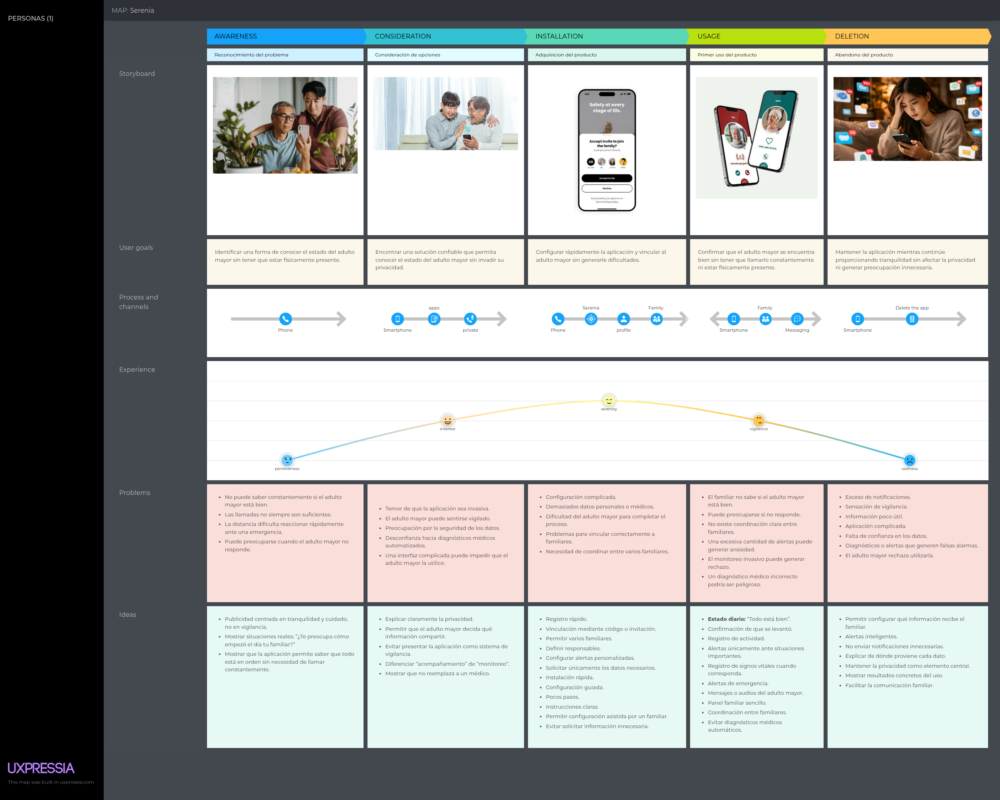
   <i>Imagen 6. User Journey Mapping - Segundo Segmento.</i>

 

### 2.3.4. Empathy Mapping

En esta sección, el equipo resume el proceso de elaboración de los *Empathy Maps* realizados en UXPressia para cada uno de nuestros *User Personas*[cite: 1]. Durante sesiones colaborativas, nos centramos en empatizar profundamente con nuestros dos actores principales: el adulto mayor que vive solo y su familiar a distancia. Para lograrlo, respondimos preguntas clave sobre su entorno, sus preocupaciones (Pains) y aquello que aliviaría sus frustraciones y los convencería de que nuestra aplicación es la alternativa correcta para mantener su vínculo (Gains)[cite: 1].

A continuación, se presentan las capturas de los mapas resultantes elaborados en la herramienta indicada:

### Segmento 1 - Adultos mayores que viven solos

   <i>Imagen 7. Empathy Map - Primer Segmento.</i>

### Segmento 2 - Familiares a distancia

   <i>Imagen 8. Empathy Map - Segundo Segmento.</i>

 

### 2.3.5. Big Picture EventStorming

El equipo realizó una sesión colaborativa de *Big Picture EventStorming* en Miro, con el objetivo de explorar de forma visual el dominio completo de Serenia: desde la vinculación entre el adulto mayor y su familiar, pasando por el check-in diario y su interpretación, hasta el manejo de emergencias y la compañía social. Se identificaron 45 eventos de dominio, redactados en pasado y en inglés siguiendo la convención de nomenclatura adoptada por el equipo, y se ordenaron cronológicamente para cada uno de los procesos identificados.

 

URL del tablero en Miro: [https://miro.com/app/board/uXjVHmgj4G8=/](https://miro.com/app/board/uXjVHmgj4G8=/)

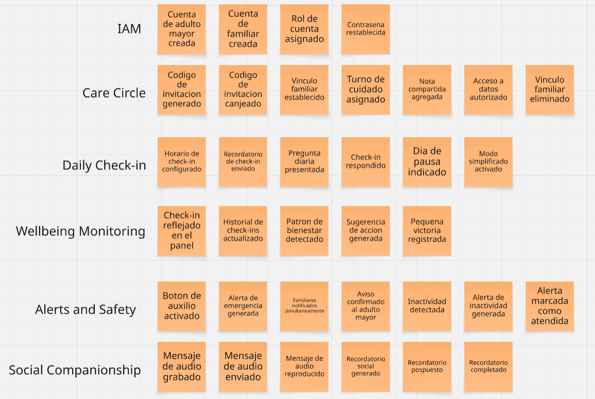
   <i>Imagen 9. Big Picture EventStorming del dominio de Serenia.</i>

**Procesos clave identificados:**

- Alta y vínculo: la creación de cuentas y el establecimiento del vínculo familiar son el punto de partida obligatorio antes de que cualquier otro proceso pueda ocurrir.
- Check-in diario: el ritual central del lado del adulto mayor, con eventos que reflejan tanto su ejecución habitual como sus excepciones (pausa del día, modo simplificado, check-in no respondido).
- Interpretación de bienestar: un conjunto de eventos de lectura que traducen los check-ins en información útil para el familiar, sin decidir por sí solos si algo es urgente.
- Alertas y seguridad: los eventos más críticos del dominio, tanto por activación directa (botón de auxilio) como por detección pasiva (inactividad).
- Compañía social: eventos desligados de cualquier fin de monitoreo, centrados en el vínculo emocional (audios, recordatorios sociales).

 

**Oportunidades y problemas expuestos durante la sesión:**

- Se evidenció que "Relatives Notified Simultaneously" y "Inactivity Alert Generated" comparten el mismo mecanismo de notificación aunque se disparan por causas distintas (activación directa vs. detección pasiva), lo que se debe resolver con cuidado en el diseño técnico para no duplicar lógica.
- Se identificó que la autorización de acceso a los datos de un adulto mayor específico depende del vínculo familiar vigente, por lo que cualquier eliminación de vínculo debe revocar ese acceso de forma inmediata.
- Los eventos se organizaron visualmente en las agrupaciones que el equipo identificó durante la sesión, las cuales se retoman y detallan formalmente como *bounded contexts* en la sección 2.5.1.1 Candidate Context Discover.

 

### 2.3.6. Ubiquitous Language

A continuación, se presenta el glosario de términos del dominio del negocio manejados por el equipo, con el fin de mantener una comunicación clara y sin ambigüedades entre todos los miembros del equipo y los stakeholders del proyecto.

| Término (en inglés) | Definición |
|---|---|
| **Older Adult** (Adulto Mayor) | Persona de edad avanzada que vive sola o pasa la mayor parte del día sin compañía, y que constituye el usuario principal receptor del cuidado y la compañía brindada a través de la aplicación. |
| **Distant Caregiver** (Cuidador a Distancia) | Familiar (hijo, hija, nieto, etc.) que, por motivos de trabajo, distancia geográfica u otras responsabilidades, no puede acompañar físicamente al adulto mayor de forma constante, pero desea mantenerse informado de su bienestar y sentirse presente en su día a día. |
| **Family Circle** (Círculo Familiar) | Conjunto de familiares y cuidadores vinculados a un mismo adulto mayor dentro de la aplicación, quienes comparten la responsabilidad de su cuidado, bienestar y compañía. |
| **Daily Check-in** (Chequeo Diario) | Acción cotidiana mediante la cual el adulto mayor confirma que se encuentra bien, permitiendo a su círculo familiar conocer su estado sin necesidad de una llamada o visita. |
| **Wellbeing Status** (Estado de Bienestar) | Indicador que resume la condición general del adulto mayor en un momento dado (por ejemplo, "bien", "necesita atención" o "sin respuesta"), calculado a partir de sus check-ins diarios y su actividad reciente en la aplicación. |
| **Emergency Alert** (Alerta de Emergencia) | Notificación urgente enviada al círculo familiar cuando el adulto mayor solicita ayuda inmediata o cuando se detecta una ausencia prolongada de actividad que sugiere una posible situación de riesgo. |
| **Social Isolation** (Aislamiento Social) | Situación en la que el adulto mayor carece de contacto frecuente con familiares u otras personas, lo cual incrementa su vulnerabilidad emocional y física, y constituye el problema central que la solución busca mitigar. |
| **Companionship** (Compañía / Acompañamiento) | Sensación de cercanía afectiva y apoyo emocional que se busca generar en el adulto mayor a través de la interacción frecuente con su familia, aun cuando esta no pueda estar físicamente presente. |
| **Voice Message** (Mensaje de Voz/Audio) | Forma de comunicación asíncrona basada en grabaciones de audio, utilizada entre el adulto mayor y su círculo familiar como una alternativa más cercana y accesible que el texto escrito. |
| **Social Contact Reminder** (Recordatorio de Contacto Social) | Aviso programado que motiva al familiar a comunicarse con el adulto mayor, o a este último a interactuar con su círculo familiar, con el fin de mantener una frecuencia de contacto saludable. |
| **Caregiver Coordination** (Coordinación entre Cuidadores) | Proceso mediante el cual los distintos familiares de un mismo círculo se organizan y distribuyen responsabilidades de acompañamiento y supervisión del adulto mayor, evitando la sobrecarga de un solo cuidador. |
| **Peace of Mind** (Tranquilidad) | Estado emocional de calma y confianza que experimenta el familiar cuidador al saber, gracias a la aplicación, que el adulto mayor se encuentra bien, aun estando distante. |
| **Family Bond** (Vínculo Familiar) | Relación afectiva y de cercanía entre el adulto mayor y sus familiares, que la solución busca fortalecer y mantener vigente a pesar de la distancia física. |
| **Autonomy** (Autonomía) | Capacidad del adulto mayor de realizar por sí mismo sus actividades diarias e interactuar con la aplicación sin depender por completo de terceros, respetando su independencia y dignidad. |
| **Invitation Code** (Código de Invitación) | Código que un familiar genera para invitar a otro miembro de la familia a integrarse al círculo familiar de un adulto mayor, estableciendo así el vínculo entre ambas cuentas. |
| **Care Shift** (Turno de Cuidado) | Periodo de tiempo durante el cual un familiar específico asume la responsabilidad principal de estar atento al bienestar del adulto mayor dentro del círculo familiar. |
| **Shared Note** (Nota Compartida) | Anotación breve que un familiar deja disponible para el resto del círculo familiar, con el fin de mantener informados a los demás cuidadores sobre alguna situación particular del adulto mayor. |
| **Simplified Mode** (Modo Simplificado) | Configuración de la interacción del check-in diario pensada para adultos mayores con menor familiaridad tecnológica, que reduce la cantidad de pasos y la complejidad visual necesarios para completar el chequeo. |
| **Pause Day** (Día de Pausa) | Indicación que el adulto mayor puede registrar para señalar, de forma anticipada, que no completará su check-in en una fecha determinada (por ejemplo, por un viaje o una visita familiar), evitando así una alerta innecesaria. |
| **Help Button** (Botón de Ayuda) | Elemento de la aplicación que el adulto mayor puede activar de forma directa e inmediata para solicitar auxilio ante una emergencia, sin depender de la detección pasiva de inactividad. |
| **Inactivity Alert** (Alerta de Inactividad) | Aviso generado automáticamente cuando la aplicación detecta una ausencia prolongada de actividad por parte del adulto mayor, sin que este haya activado el botón de ayuda, y que sugiere una posible situación de riesgo. |
| **Small Win** (Pequeño Logro) | Registro de un avance o comportamiento positivo del adulto mayor (por ejemplo, una racha de check-ins completados) que la aplicación destaca para reforzar su bienestar y motivación. |
| **Wellbeing Trend** (Tendencia de Bienestar) | Lectura de la evolución del estado de bienestar del adulto mayor a lo largo del tiempo, construida a partir del historial de check-ins, que permite al familiar identificar mejoras o retrocesos sostenidos. |
| **Action Suggestion** (Sugerencia de Acción) | Recomendación que la aplicación entrega al familiar a partir de los patrones de bienestar detectados, orientada a motivarlo a tomar una acción concreta de acompañamiento hacia el adulto mayor. |

 

## 2.4. Requirements specification

### 2.4.1. User Stories

En esta sección se presentan los requisitos identificados para Serenia a partir del análisis realizado en las etapas previas de investigación, organizados en Epics y User Stories que reflejan las necesidades del adulto mayor que vive solo, su familiar a distancia y los demás usuarios del producto.

<table>
  <tr>
    <th style="width: 20%;">Epic ID</th>
    <th style="width: 80%;">Nombre del Epic</th>
  </tr>
  <tr>
    <td style="text-align: center;"><strong>EP01</strong></td>
    <td style="text-align: center;">Gestión de Identidad y Vínculo Familiar</td>
  </tr>
  <tr>
    <td style="text-align: center;"><strong>EP02</strong></td>
    <td style="text-align: center;">Check-in Diario y Autonomía del Usuario</td>
  </tr>
  <tr>
    <td style="text-align: center;"><strong>EP03</strong></td>
    <td style="text-align: center;">Mensajería Multimedia Asíncrona</td>
  </tr>
  <tr>
    <td style="text-align: center;"><strong>EP04</strong></td>
    <td style="text-align: center;">Recordatorios de Contacto Social</td>
  </tr>
  <tr>
    <td style="text-align: center;"><strong>EP05</strong></td>
    <td style="text-align: center;">Alertas de Emergencia</td>
  </tr>
  <tr>
    <td style="text-align: center;"><strong>EP06</strong></td>
    <td style="text-align: center;">Panel de Estado y Alertas de Bienestar</td>
  </tr>
  <tr>
    <td style="text-align: center;"><strong>EP07</strong></td>
    <td style="text-align: center;">Coordinación entre Cuidadores Familiares</td>
  </tr>
  <tr>
    <td style="text-align: center;"><strong>EP08</strong></td>
    <td style="text-align: center;">Experiencia Web — Landing Page</td>
  </tr>
  <tr>
    <td style="text-align: center;"><strong>EP09</strong></td>
    <td style="text-align: center;">Calidad y Accesibilidad de la Experiencia</td>
  </tr>
  <tr>
    <td style="text-align: center;"><strong>EP10</strong></td>
    <td style="text-align: center;">Servicios REST</td>
  </tr>
</table>

 

<table>
  <tr>
    <th style="width: 20%;">Story ID</th>
    <th style="width: 25%;">User</th>
    <th style="width: 20%;">Priority</th>
    <th style="width: 35%;">Epic</th>
  </tr>
  <tr>
    <td style="text-align: center;"><strong>US01</strong></td>
    <td style="text-align: center;">Adulto mayor que vive solo</td>
    <td style="text-align: center;">High</td>
    <td style="text-align: center;">EP01 – Gestión de Identidad y Vínculo Familiar</td>
  </tr>
  <tr>
    <th>Title</th>
    <td colspan="3"><strong>Registro de cuenta de usuario</strong></td>
  </tr>
  <tr>
    <th colspan="4" style="text-align: center;">Description</th>
  </tr>
  <tr>
    <td colspan="4">Como adulto mayor que vive solo, quiero registrarme en la aplicación con mis datos básicos para acceder al check-in diario y mantenerme comunicado con mi familia.</td>
  </tr>
  <tr>
    <th colspan="4" style="text-align: center;">Acceptance Criteria</th>
  </tr>
  <tr>
    <td colspan="4"><strong>Escenario 1: Registro exitoso</strong> - <strong>Dado que</strong> el usuario ingresa a la aplicación por primera vez - <strong>Cuando</strong> completa el formulario de registro con datos válidos y lo confirma - <strong>Entonces</strong> el sistema crea la cuenta - <strong>Y</strong> habilita el acceso a la pantalla principal  <strong>Escenario 2: Datos incompletos o inválidos</strong> - <strong>Dado que</strong> el usuario completa el formulario de registro - <strong>Cuando</strong> intenta confirmarlo con campos obligatorios vacíos o con formato incorrecto - <strong>Entonces</strong> el sistema rechaza el registro - <strong>Y</strong> indica los campos que requieren corrección</td>
  </tr>
</table>

 

<table>
  <tr>
    <th style="width: 20%;">Story ID</th>
    <th style="width: 25%;">User</th>
    <th style="width: 20%;">Priority</th>
    <th style="width: 35%;">Epic</th>
  </tr>
  <tr>
    <td style="text-align: center;"><strong>US02</strong></td>
    <td style="text-align: center;">Familiar a distancia</td>
    <td style="text-align: center;">High</td>
    <td style="text-align: center;">EP01 – Gestión de Identidad y Vínculo Familiar</td>
  </tr>
  <tr>
    <th>Title</th>
    <td colspan="3"><strong>Vinculación familiar por código de invitación</strong></td>
  </tr>
  <tr>
    <th colspan="4" style="text-align: center;">Description</th>
  </tr>
  <tr>
    <td colspan="4">Como familiar a distancia, quiero vincular mi cuenta con la de mi adulto mayor mediante un código de invitación para acceder a su panel de estado y recibir sus alertas.</td>
  </tr>
  <tr>
    <th colspan="4" style="text-align: center;">Acceptance Criteria</th>
  </tr>
  <tr>
    <td colspan="4"><strong>Escenario 1: Vinculación exitosa</strong> - <strong>Dado que</strong> el familiar dispone del código de invitación generado por el adulto mayor - <strong>Cuando</strong> ingresa el código y confirma la solicitud - <strong>Entonces</strong> el sistema registra el vínculo familiar - <strong>Y</strong> habilita el acceso al panel de estado del adulto mayor  <strong>Escenario 2: Código inválido o expirado</strong> - <strong>Dado que</strong> el familiar ingresa un código de invitación - <strong>Cuando</strong> el código no corresponde a ningún adulto mayor o ya fue utilizado - <strong>Entonces</strong> el sistema rechaza la vinculación - <strong>Y</strong> informa que el código no es válido</td>
  </tr>
</table>

 

<table>
  <tr>
    <th style="width: 20%;">Story ID</th>
    <th style="width: 25%;">User</th>
    <th style="width: 20%;">Priority</th>
    <th style="width: 35%;">Epic</th>
  </tr>
  <tr>
    <td style="text-align: center;"><strong>US03</strong></td>
    <td style="text-align: center;">Adulto mayor que vive solo</td>
    <td style="text-align: center;">High</td>
    <td style="text-align: center;">EP02 – Check-in Diario y Autonomía del Usuario</td>
  </tr>
  <tr>
    <th>Title</th>
    <td colspan="3"><strong>Registro de respuesta del check-in diario</strong></td>
  </tr>
  <tr>
    <th colspan="4" style="text-align: center;">Description</th>
  </tr>
  <tr>
    <td colspan="4">Como adulto mayor que vive solo, quiero responder con un solo toque la pregunta diaria sobre cómo me siento para comunicar mi bienestar sin depender de una llamada telefónica.</td>
  </tr>
  <tr>
    <th colspan="4" style="text-align: center;">Acceptance Criteria</th>
  </tr>
  <tr>
    <td colspan="4"><strong>Escenario 1: Check-in respondido</strong> - <strong>Dado que</strong> el sistema presenta la pregunta del check-in del día - <strong>Cuando</strong> el usuario selecciona una de las respuestas disponibles - <strong>Entonces</strong> el sistema registra la respuesta con su fecha y hora - <strong>Y</strong> la pone a disposición de los familiares vinculados  <strong>Escenario 2: Check-in no respondido</strong> - <strong>Dado que</strong> el sistema presentó la pregunta del check-in del día - <strong>Cuando</strong> transcurre el tiempo límite a partir del horario configurado sin recibir respuesta - <strong>Entonces</strong> el sistema marca el check-in del día como no respondido</td>
  </tr>
</table>

 

<table>
  <tr>
    <th style="width: 20%;">Story ID</th>
    <th style="width: 25%;">User</th>
    <th style="width: 20%;">Priority</th>
    <th style="width: 35%;">Epic</th>
  </tr>
  <tr>
    <td style="text-align: center;"><strong>US04</strong></td>
    <td style="text-align: center;">Adulto mayor que vive solo</td>
    <td style="text-align: center;">High</td>
    <td style="text-align: center;">EP02 – Check-in Diario y Autonomía del Usuario</td>
  </tr>
  <tr>
    <th>Title</th>
    <td colspan="3"><strong>Notificación programada del check-in diario</strong></td>
  </tr>
  <tr>
    <th colspan="4" style="text-align: center;">Description</th>
  </tr>
  <tr>
    <td colspan="4">Como adulto mayor que vive solo, quiero recibir una notificación en el horario habitual para responder mi check-in sin tener que recordar abrir la aplicación.</td>
  </tr>
  <tr>
    <th colspan="4" style="text-align: center;">Acceptance Criteria</th>
  </tr>
  <tr>
    <td colspan="4"><strong>Escenario 1: Notificación enviada</strong> - <strong>Dado que</strong> se alcanza el horario configurado para el check-in del usuario - <strong>Cuando</strong> el sistema verifica que el check-in del día sigue pendiente - <strong>Entonces</strong> el sistema envía una notificación invitando a responderlo  <strong>Escenario 2: Check-in ya respondido</strong> - <strong>Dado que</strong> el usuario respondió su check-in antes del horario configurado - <strong>Cuando</strong> se alcanza dicho horario - <strong>Entonces</strong> el sistema omite el envío de la notificación  <strong>Escenario 3: Preguntas pausadas</strong> - <strong>Dado que</strong> el usuario activó la pausa de preguntas para el día en curso - <strong>Cuando</strong> se alcanza el horario configurado - <strong>Entonces</strong> el sistema omite el envío de la notificación</td>
  </tr>
</table>

 

<table>
  <tr>
    <th style="width: 20%;">Story ID</th>
    <th style="width: 25%;">User</th>
    <th style="width: 20%;">Priority</th>
    <th style="width: 35%;">Epic</th>
  </tr>
  <tr>
    <td style="text-align: center;"><strong>US05</strong></td>
    <td style="text-align: center;">Adulto mayor que vive solo</td>
    <td style="text-align: center;">Medium</td>
    <td style="text-align: center;">EP02 – Check-in Diario y Autonomía del Usuario</td>
  </tr>
  <tr>
    <th>Title</th>
    <td colspan="3"><strong>Configuración del horario del check-in</strong></td>
  </tr>
  <tr>
    <th colspan="4" style="text-align: center;">Description</th>
  </tr>
  <tr>
    <td colspan="4">Como adulto mayor que vive solo, quiero definir a qué hora del día se me consulta cómo me siento para que el check-in se ajuste a mi rutina.</td>
  </tr>
  <tr>
    <th colspan="4" style="text-align: center;">Acceptance Criteria</th>
  </tr>
  <tr>
    <td colspan="4"><strong>Escenario 1: Horario actualizado</strong> - <strong>Dado que</strong> el usuario accede a la configuración de su check-in - <strong>Cuando</strong> selecciona un nuevo horario dentro del rango permitido y lo confirma - <strong>Entonces</strong> el sistema guarda el horario - <strong>Y</strong> lo aplica a partir del siguiente check-in  <strong>Escenario 2: Horario fuera del rango permitido</strong> - <strong>Dado que</strong> el usuario selecciona un horario fuera del rango permitido por la aplicación - <strong>Cuando</strong> confirma el cambio - <strong>Entonces</strong> el sistema rechaza la configuración - <strong>Y</strong> informa el rango de horarios válido</td>
  </tr>
</table>

 

<table>
  <tr>
    <th style="width: 20%;">Story ID</th>
    <th style="width: 25%;">User</th>
    <th style="width: 20%;">Priority</th>
    <th style="width: 35%;">Epic</th>
  </tr>
  <tr>
    <td style="text-align: center;"><strong>US06</strong></td>
    <td style="text-align: center;">Adulto mayor que vive solo</td>
    <td style="text-align: center;">Low</td>
    <td style="text-align: center;">EP02 – Check-in Diario y Autonomía del Usuario</td>
  </tr>
  <tr>
    <th>Title</th>
    <td colspan="3"><strong>Rotación de preguntas del check-in</strong></td>
  </tr>
  <tr>
    <th colspan="4" style="text-align: center;">Description</th>
  </tr>
  <tr>
    <td colspan="4">Como adulto mayor que vive solo, quiero que las preguntas del check-in varíen entre días para que la interacción se perciba como una conversación y no como un control repetitivo.</td>
  </tr>
  <tr>
    <th colspan="4" style="text-align: center;">Acceptance Criteria</th>
  </tr>
  <tr>
    <td colspan="4"><strong>Escenario 1: Pregunta distinta a la del día anterior</strong> - <strong>Dado que</strong> el usuario recibe el check-in de un nuevo día - <strong>Cuando</strong> el sistema selecciona la pregunta a presentar - <strong>Entonces</strong> el sistema presenta una pregunta distinta a la del día inmediatamente anterior  <strong>Escenario 2: Rotación dentro del conjunto disponible</strong> - <strong>Dado que</strong> existe un conjunto de preguntas configuradas para el check-in - <strong>Cuando</strong> el sistema construye el check-in del día - <strong>Entonces</strong> el sistema evita repetir una pregunta utilizada recientemente dentro de ese conjunto</td>
  </tr>
</table>

 

<table>
  <tr>
    <th style="width: 20%;">Story ID</th>
    <th style="width: 25%;">User</th>
    <th style="width: 20%;">Priority</th>
    <th style="width: 35%;">Epic</th>
  </tr>
  <tr>
    <td style="text-align: center;"><strong>US07</strong></td>
    <td style="text-align: center;">Adulto mayor que vive solo</td>
    <td style="text-align: center;">Medium</td>
    <td style="text-align: center;">EP02 – Check-in Diario y Autonomía del Usuario</td>
  </tr>
  <tr>
    <th>Title</th>
    <td colspan="3"><strong>Pausa diaria de preguntas</strong></td>
  </tr>
  <tr>
    <th colspan="4" style="text-align: center;">Description</th>
  </tr>
  <tr>
    <td colspan="4">Como adulto mayor que vive solo, quiero indicar que hoy no deseo recibir preguntas para conservar el control sobre mi propia disposición a comunicarme.</td>
  </tr>
  <tr>
    <th colspan="4" style="text-align: center;">Acceptance Criteria</th>
  </tr>
  <tr>
    <td colspan="4"><strong>Escenario 1: Pausa activada</strong> - <strong>Dado que</strong> el usuario decide no recibir preguntas durante el día en curso - <strong>Cuando</strong> activa la opción de pausar las preguntas - <strong>Entonces</strong> el sistema omite el check-in del día - <strong>Y</strong> informa a los familiares vinculados que el usuario optó por no participar hoy  <strong>Escenario 2: Reanudación automática</strong> - <strong>Dado que</strong> el usuario activó la pausa de preguntas para el día en curso - <strong>Cuando</strong> inicia un nuevo día - <strong>Entonces</strong> el sistema reanuda el envío del check-in diario</td>
  </tr>
</table>

 

<table>
  <tr>
    <th style="width: 20%;">Story ID</th>
    <th style="width: 25%;">User</th>
    <th style="width: 20%;">Priority</th>
    <th style="width: 35%;">Epic</th>
  </tr>
  <tr>
    <td style="text-align: center;"><strong>US08</strong></td>
    <td style="text-align: center;">Adulto mayor que vive solo</td>
    <td style="text-align: center;">Medium</td>
    <td style="text-align: center;">EP02 – Check-in Diario y Autonomía del Usuario</td>
  </tr>
  <tr>
    <th>Title</th>
    <td colspan="3"><strong>Modo simplificado de interfaz</strong></td>
  </tr>
  <tr>
    <th colspan="4" style="text-align: center;">Description</th>
  </tr>
  <tr>
    <td colspan="4">Como adulto mayor que vive solo, quiero activar un modo con menos opciones en pantalla para interactuar de forma mínima en los días de menor energía.</td>
  </tr>
  <tr>
    <th colspan="4" style="text-align: center;">Acceptance Criteria</th>
  </tr>
  <tr>
    <td colspan="4"><strong>Escenario 1: Modo simplificado activado</strong> - <strong>Dado que</strong> el usuario accede a la configuración de su cuenta - <strong>Cuando</strong> activa la opción de modo simplificado - <strong>Entonces</strong> el sistema reduce las funcionalidades visibles a las necesarias para completar el check-in diario  <strong>Escenario 2: Modo simplificado desactivado</strong> - <strong>Dado que</strong> el usuario tiene activado el modo simplificado - <strong>Cuando</strong> selecciona desactivarlo - <strong>Entonces</strong> el sistema restablece el conjunto completo de funcionalidades disponibles</td>
  </tr>
</table>

 

<table>
  <tr>
    <th style="width: 20%;">Story ID</th>
    <th style="width: 25%;">User</th>
    <th style="width: 20%;">Priority</th>
    <th style="width: 35%;">Epic</th>
  </tr>
  <tr>
    <td style="text-align: center;"><strong>US09</strong></td>
    <td style="text-align: center;">Adulto mayor que vive solo</td>
    <td style="text-align: center;">Medium</td>
    <td style="text-align: center;">EP03 – Mensajería Multimedia Asíncrona</td>
  </tr>
  <tr>
    <th>Title</th>
    <td colspan="3"><strong>Grabación y envío de mensaje de audio</strong></td>
  </tr>
  <tr>
    <th colspan="4" style="text-align: center;">Description</th>
  </tr>
  <tr>
    <td colspan="4">Como adulto mayor que vive solo, quiero grabar un audio breve sobre mi día para compartir un mensaje personal con mi familia sin depender de una llamada.</td>
  </tr>
  <tr>
    <th colspan="4" style="text-align: center;">Acceptance Criteria</th>
  </tr>
  <tr>
    <td colspan="4"><strong>Escenario 1: Audio enviado</strong> - <strong>Dado que</strong> el usuario graba un audio en el espacio de mensajes personales - <strong>Cuando</strong> confirma el envío - <strong>Entonces</strong> el sistema almacena el audio - <strong>Y</strong> lo pone a disposición de los familiares vinculados  <strong>Escenario 2: Grabación cancelada</strong> - <strong>Dado que</strong> el usuario se encuentra grabando un audio - <strong>Cuando</strong> cancela la grabación antes de confirmarla - <strong>Entonces</strong> el sistema descarta el audio - <strong>Y</strong> no lo comparte con los familiares vinculados</td>
  </tr>
</table>

 

<table>
  <tr>
    <th style="width: 20%;">Story ID</th>
    <th style="width: 25%;">User</th>
    <th style="width: 20%;">Priority</th>
    <th style="width: 35%;">Epic</th>
  </tr>
  <tr>
    <td style="text-align: center;"><strong>US10</strong></td>
    <td style="text-align: center;">Familiar a distancia</td>
    <td style="text-align: center;">Medium</td>
    <td style="text-align: center;">EP03 – Mensajería Multimedia Asíncrona</td>
  </tr>
  <tr>
    <th>Title</th>
    <td colspan="3"><strong>Reproducción de mensajes de audio recibidos</strong></td>
  </tr>
  <tr>
    <th colspan="4" style="text-align: center;">Description</th>
  </tr>
  <tr>
    <td colspan="4">Como familiar a distancia, quiero reproducir los audios que comparte mi adulto mayor para conocer cómo estuvo su día de una forma más cercana que un indicador de estado.</td>
  </tr>
  <tr>
    <th colspan="4" style="text-align: center;">Acceptance Criteria</th>
  </tr>
  <tr>
    <td colspan="4"><strong>Escenario 1: Reproducción exitosa</strong> - <strong>Dado que</strong> el adulto mayor vinculado compartió un audio - <strong>Cuando</strong> el familiar accede a la sección de mensajes de audio y selecciona uno - <strong>Entonces</strong> el sistema reproduce el audio seleccionado  <strong>Escenario 2: Sin audios disponibles</strong> - <strong>Dado que</strong> el adulto mayor vinculado no ha compartido audios - <strong>Cuando</strong> el familiar accede a la sección de mensajes de audio - <strong>Entonces</strong> el sistema informa que aún no hay audios disponibles</td>
  </tr>
</table>

 

<table>
  <tr>
    <th style="width: 20%;">Story ID</th>
    <th style="width: 25%;">User</th>
    <th style="width: 20%;">Priority</th>
    <th style="width: 35%;">Epic</th>
  </tr>
  <tr>
    <td style="text-align: center;"><strong>US11</strong></td>
    <td style="text-align: center;">Adulto mayor que vive solo</td>
    <td style="text-align: center;">Low</td>
    <td style="text-align: center;">EP04 – Recordatorios de Contacto Social</td>
  </tr>
  <tr>
    <th>Title</th>
    <td colspan="3"><strong>Notificación de recordatorio de contacto social</strong></td>
  </tr>
  <tr>
    <th colspan="4" style="text-align: center;">Description</th>
  </tr>
  <tr>
    <td colspan="4">Como adulto mayor que vive solo, quiero recibir recordatorios para contactar a una amistad o asistir a una actividad social para mantener mi vida social activa y no solo mi seguridad física.</td>
  </tr>
  <tr>
    <th colspan="4" style="text-align: center;">Acceptance Criteria</th>
  </tr>
  <tr>
    <td colspan="4"><strong>Escenario 1: Recordatorio presentado</strong> - <strong>Dado que</strong> existe un recordatorio de contacto social programado para el día en curso - <strong>Cuando</strong> se alcanza la hora programada - <strong>Entonces</strong> el sistema presenta el recordatorio al usuario  <strong>Escenario 2: Recordatorio completado</strong> - <strong>Dado que</strong> el sistema presentó un recordatorio de contacto social - <strong>Cuando</strong> el usuario indica que ya lo realizó - <strong>Entonces</strong> el sistema marca el recordatorio como completado - <strong>Y</strong> no vuelve a presentarlo durante el día</td>
  </tr>
</table>

 

<table>
  <tr>
    <th style="width: 20%;">Story ID</th>
    <th style="width: 25%;">User</th>
    <th style="width: 20%;">Priority</th>
    <th style="width: 35%;">Epic</th>
  </tr>
  <tr>
    <td style="text-align: center;"><strong>US12</strong></td>
    <td style="text-align: center;">Adulto mayor que vive solo</td>
    <td style="text-align: center;">Low</td>
    <td style="text-align: center;">EP04 – Recordatorios de Contacto Social</td>
  </tr>
  <tr>
    <th>Title</th>
    <td colspan="3"><strong>Postergación de recordatorio de contacto social</strong></td>
  </tr>
  <tr>
    <th colspan="4" style="text-align: center;">Description</th>
  </tr>
  <tr>
    <td colspan="4">Como adulto mayor que vive solo, quiero posponer un recordatorio en lugar de descartarlo para no percibir como una falta el no poder atenderlo en ese momento.</td>
  </tr>
  <tr>
    <th colspan="4" style="text-align: center;">Acceptance Criteria</th>
  </tr>
  <tr>
    <td colspan="4"><strong>Escenario 1: Recordatorio pospuesto</strong> - <strong>Dado que</strong> el sistema presenta un recordatorio de contacto social - <strong>Cuando</strong> el usuario selecciona posponerlo - <strong>Entonces</strong> el sistema lo reprograma para un momento posterior del mismo día  <strong>Escenario 2: Recordatorio pospuesto sin atender</strong> - <strong>Dado que</strong> un recordatorio fue pospuesto dentro del día en curso - <strong>Cuando</strong> finaliza el día sin que el usuario interactúe con él - <strong>Entonces</strong> el sistema lo marca como no completado</td>
  </tr>
</table>

 

<table>
  <tr>
    <th style="width: 20%;">Story ID</th>
    <th style="width: 25%;">User</th>
    <th style="width: 20%;">Priority</th>
    <th style="width: 35%;">Epic</th>
  </tr>
  <tr>
    <td style="text-align: center;"><strong>US13</strong></td>
    <td style="text-align: center;">Adulto mayor que vive solo</td>
    <td style="text-align: center;">High</td>
    <td style="text-align: center;">EP05 – Alertas de Emergencia</td>
  </tr>
  <tr>
    <th>Title</th>
    <td colspan="3"><strong>Activación del botón de auxilio</strong></td>
  </tr>
  <tr>
    <th colspan="4" style="text-align: center;">Description</th>
  </tr>
  <tr>
    <td colspan="4">Como adulto mayor que vive solo, quiero solicitar ayuda de forma inmediata ante una emergencia para contar con el respaldo de mi familia en cualquier momento del día.</td>
  </tr>
  <tr>
    <th colspan="4" style="text-align: center;">Acceptance Criteria</th>
  </tr>
  <tr>
    <td colspan="4"><strong>Escenario 1: Auxilio activado</strong> - <strong>Dado que</strong> el usuario se encuentra en una situación de emergencia - <strong>Cuando</strong> activa el botón de auxilio - <strong>Entonces</strong> el sistema registra la activación - <strong>Y</strong> notifica de inmediato a los familiares vinculados  <strong>Escenario 2: Confirmación al usuario</strong> - <strong>Dado que</strong> el usuario activó el botón de auxilio - <strong>Cuando</strong> el sistema completa el envío de la alerta - <strong>Entonces</strong> el sistema confirma al usuario que su familia fue notificada</td>
  </tr>
</table>

 

<table>
  <tr>
    <th style="width: 20%;">Story ID</th>
    <th style="width: 25%;">User</th>
    <th style="width: 20%;">Priority</th>
    <th style="width: 35%;">Epic</th>
  </tr>
  <tr>
    <td style="text-align: center;"><strong>US14</strong></td>
    <td style="text-align: center;">Familiar a distancia</td>
    <td style="text-align: center;">High</td>
    <td style="text-align: center;">EP05 – Alertas de Emergencia</td>
  </tr>
  <tr>
    <th>Title</th>
    <td colspan="3"><strong>Recepción de alerta de emergencia</strong></td>
  </tr>
  <tr>
    <th colspan="4" style="text-align: center;">Description</th>
  </tr>
  <tr>
    <td colspan="4">Como familiar a distancia, quiero recibir una alerta inmediata cuando mi adulto mayor activa el botón de auxilio para poder actuar sin demora.</td>
  </tr>
  <tr>
    <th colspan="4" style="text-align: center;">Acceptance Criteria</th>
  </tr>
  <tr>
    <td colspan="4"><strong>Escenario 1: Alerta recibida</strong> - <strong>Dado que</strong> el adulto mayor vinculado activa el botón de auxilio - <strong>Cuando</strong> el sistema procesa la activación - <strong>Entonces</strong> el sistema notifica al familiar - <strong>Y</strong> incluye la fecha y hora de la activación  <strong>Escenario 2: Notificación a múltiples familiares</strong> - <strong>Dado que</strong> el adulto mayor tiene más de un familiar vinculado - <strong>Cuando</strong> se registra una alerta de emergencia - <strong>Entonces</strong> el sistema notifica a todos los familiares vinculados de forma simultánea</td>
  </tr>
</table>

 

<table>
  <tr>
    <th style="width: 20%;">Story ID</th>
    <th style="width: 25%;">User</th>
    <th style="width: 20%;">Priority</th>
    <th style="width: 35%;">Epic</th>
  </tr>
  <tr>
    <td style="text-align: center;"><strong>US15</strong></td>
    <td style="text-align: center;">Familiar a distancia</td>
    <td style="text-align: center;">High</td>
    <td style="text-align: center;">EP06 – Panel de Estado y Alertas de Bienestar</td>
  </tr>
  <tr>
    <th>Title</th>
    <td colspan="3"><strong>Consulta del panel de estado diario</strong></td>
  </tr>
  <tr>
    <th colspan="4" style="text-align: center;">Description</th>
  </tr>
  <tr>
    <td colspan="4">Como familiar a distancia, quiero consultar el estado diario de mi adulto mayor para saber si completó su check-in y cómo se sintió sin necesidad de llamarlo.</td>
  </tr>
  <tr>
    <th colspan="4" style="text-align: center;">Acceptance Criteria</th>
  </tr>
  <tr>
    <td colspan="4"><strong>Escenario 1: Check-in disponible</strong> - <strong>Dado que</strong> el adulto mayor vinculado respondió su check-in del día - <strong>Cuando</strong> el familiar accede al panel de estado - <strong>Entonces</strong> el sistema muestra la respuesta registrada junto con su fecha y hora  <strong>Escenario 2: Check-in pendiente</strong> - <strong>Dado que</strong> el adulto mayor vinculado no ha respondido su check-in del día - <strong>Cuando</strong> el familiar accede al panel de estado - <strong>Entonces</strong> el sistema indica que el check-in del día se encuentra pendiente</td>
  </tr>
</table>

 

<table>
  <tr>
    <th style="width: 20%;">Story ID</th>
    <th style="width: 25%;">User</th>
    <th style="width: 20%;">Priority</th>
    <th style="width: 35%;">Epic</th>
  </tr>
  <tr>
    <td style="text-align: center;"><strong>US16</strong></td>
    <td style="text-align: center;">Familiar a distancia</td>
    <td style="text-align: center;">High</td>
    <td style="text-align: center;">EP06 – Panel de Estado y Alertas de Bienestar</td>
  </tr>
  <tr>
    <th>Title</th>
    <td colspan="3"><strong>Alerta por inactividad del check-in</strong></td>
  </tr>
  <tr>
    <th colspan="4" style="text-align: center;">Description</th>
  </tr>
  <tr>
    <td colspan="4">Como familiar a distancia, quiero recibir una alerta únicamente cuando algo se sale de lo habitual para no tener que revisar la aplicación durante todo el día.</td>
  </tr>
  <tr>
    <th colspan="4" style="text-align: center;">Acceptance Criteria</th>
  </tr>
  <tr>
    <td colspan="4"><strong>Escenario 1: Check-in no respondido</strong> - <strong>Dado que</strong> el adulto mayor vinculado no respondió su check-in dentro del tiempo límite a partir de su horario configurado - <strong>Cuando</strong> el sistema evalúa el estado del día - <strong>Entonces</strong> el sistema genera una alerta de inactividad para el familiar  <strong>Escenario 2: Respuesta dentro de lo habitual</strong> - <strong>Dado que</strong> el adulto mayor vinculado respondió su check-in dentro de un rango considerado habitual - <strong>Cuando</strong> el sistema procesa la respuesta - <strong>Entonces</strong> el sistema no genera ninguna alerta  <strong>Escenario 3: Preguntas pausadas por el usuario</strong> - <strong>Dado que</strong> el adulto mayor vinculado activó la pausa de preguntas para el día en curso - <strong>Cuando</strong> finaliza el día sin un check-in registrado - <strong>Entonces</strong> el sistema no genera una alerta de inactividad</td>
  </tr>
</table>

 

<table>
  <tr>
    <th style="width: 20%;">Story ID</th>
    <th style="width: 25%;">User</th>
    <th style="width: 20%;">Priority</th>
    <th style="width: 35%;">Epic</th>
  </tr>
  <tr>
    <td style="text-align: center;"><strong>US17</strong></td>
    <td style="text-align: center;">Familiar a distancia</td>
    <td style="text-align: center;">Medium</td>
    <td style="text-align: center;">EP06 – Panel de Estado y Alertas de Bienestar</td>
  </tr>
  <tr>
    <th>Title</th>
    <td colspan="3"><strong>Historial de check-ins del adulto mayor</strong></td>
  </tr>
  <tr>
    <th colspan="4" style="text-align: center;">Description</th>
  </tr>
  <tr>
    <td colspan="4">Como familiar a distancia, quiero consultar los check-ins de días anteriores para identificar patrones y no limitarme al estado del día en curso.</td>
  </tr>
  <tr>
    <th colspan="4" style="text-align: center;">Acceptance Criteria</th>
  </tr>
  <tr>
    <td colspan="4"><strong>Escenario 1: Historial disponible</strong> - <strong>Dado que</strong> el adulto mayor vinculado cuenta con check-ins registrados en días anteriores - <strong>Cuando</strong> el familiar accede al historial - <strong>Entonces</strong> el sistema muestra las respuestas ordenadas por fecha  <strong>Escenario 2: Sin registros previos</strong> - <strong>Dado que</strong> el adulto mayor vinculado no cuenta con check-ins previos - <strong>Cuando</strong> el familiar accede al historial - <strong>Entonces</strong> el sistema informa que aún no existen registros disponibles</td>
  </tr>
</table>

 

<table>
  <tr>
    <th style="width: 20%;">Story ID</th>
    <th style="width: 25%;">User</th>
    <th style="width: 20%;">Priority</th>
    <th style="width: 35%;">Epic</th>
  </tr>
  <tr>
    <td style="text-align: center;"><strong>US18</strong></td>
    <td style="text-align: center;">Familiar a distancia</td>
    <td style="text-align: center;">Low</td>
    <td style="text-align: center;">EP06 – Panel de Estado y Alertas de Bienestar</td>
  </tr>
  <tr>
    <th>Title</th>
    <td colspan="3"><strong>Sugerencia de acción por patrón de malestar</strong></td>
  </tr>
  <tr>
    <th colspan="4" style="text-align: center;">Description</th>
  </tr>
  <tr>
    <td colspan="4">Como familiar a distancia, quiero recibir una sugerencia cuando mi adulto mayor reporta malestar durante varios días seguidos para saber cuándo es oportuno llamarlo o visitarlo.</td>
  </tr>
  <tr>
    <th colspan="4" style="text-align: center;">Acceptance Criteria</th>
  </tr>
  <tr>
    <td colspan="4"><strong>Escenario 1: Patrón detectado</strong> - <strong>Dado que</strong> el adulto mayor vinculado reporta malestar durante varios días consecutivos - <strong>Cuando</strong> el sistema evalúa sus respuestas recientes - <strong>Entonces</strong> el sistema genera una sugerencia de acción para el familiar  <strong>Escenario 2: Sin patrón sostenido</strong> - <strong>Dado que</strong> el adulto mayor vinculado no presenta un patrón sostenido de malestar - <strong>Cuando</strong> el sistema evalúa sus respuestas recientes - <strong>Entonces</strong> el sistema no genera ninguna sugerencia</td>
  </tr>
</table>

 

<table>
  <tr>
    <th style="width: 20%;">Story ID</th>
    <th style="width: 25%;">User</th>
    <th style="width: 20%;">Priority</th>
    <th style="width: 35%;">Epic</th>
  </tr>
  <tr>
    <td style="text-align: center;"><strong>US19</strong></td>
    <td style="text-align: center;">Familiar a distancia</td>
    <td style="text-align: center;">Low</td>
    <td style="text-align: center;">EP06 – Panel de Estado y Alertas de Bienestar</td>
  </tr>
  <tr>
    <th>Title</th>
    <td colspan="3"><strong>Registro de pequeñas victorias</strong></td>
  </tr>
  <tr>
    <th colspan="4" style="text-align: center;">Description</th>
  </tr>
  <tr>
    <td colspan="4">Como familiar a distancia, quiero visualizar los días buenos y las actividades positivas de mi adulto mayor para reforzar lo positivo y no recibir únicamente alertas.</td>
  </tr>
  <tr>
    <th colspan="4" style="text-align: center;">Acceptance Criteria</th>
  </tr>
  <tr>
    <td colspan="4"><strong>Escenario 1: Victorias disponibles</strong> - <strong>Dado que</strong> el adulto mayor vinculado reportó actividades positivas en sus check-ins recientes - <strong>Cuando</strong> el familiar accede al registro de pequeñas victorias - <strong>Entonces</strong> el sistema muestra dichas actividades junto con su fecha  <strong>Escenario 2: Sin victorias registradas</strong> - <strong>Dado que</strong> no existen actividades positivas registradas en el período reciente - <strong>Cuando</strong> el familiar accede al registro de pequeñas victorias - <strong>Entonces</strong> el sistema informa que no hay registros en el período</td>
  </tr>
</table>

 

<table>
  <tr>
    <th style="width: 20%;">Story ID</th>
    <th style="width: 25%;">User</th>
    <th style="width: 20%;">Priority</th>
    <th style="width: 35%;">Epic</th>
  </tr>
  <tr>
    <td style="text-align: center;"><strong>US20</strong></td>
    <td style="text-align: center;">Familiar a distancia</td>
    <td style="text-align: center;">Medium</td>
    <td style="text-align: center;">EP07 – Coordinación entre Cuidadores Familiares</td>
  </tr>
  <tr>
    <th>Title</th>
    <td colspan="3"><strong>Asignación de turnos de atención</strong></td>
  </tr>
  <tr>
    <th colspan="4" style="text-align: center;">Description</th>
  </tr>
  <tr>
    <td colspan="4">Como familiar a distancia, quiero asignarme turnos de atención junto a los demás familiares para evitar que todos asuman que otra persona ya se comunicó con el adulto mayor.</td>
  </tr>
  <tr>
    <th colspan="4" style="text-align: center;">Acceptance Criteria</th>
  </tr>
  <tr>
    <td colspan="4"><strong>Escenario 1: Turno asignado</strong> - <strong>Dado que</strong> existen varios familiares vinculados al mismo adulto mayor - <strong>Cuando</strong> un familiar se asigna un turno de atención para una fecha determinada - <strong>Entonces</strong> el sistema registra el turno - <strong>Y</strong> lo hace visible para todos los familiares vinculados  <strong>Escenario 2: Turno ya asignado</strong> - <strong>Dado que</strong> una fecha ya cuenta con un turno de atención asignado - <strong>Cuando</strong> otro familiar intenta asignarse el mismo turno - <strong>Entonces</strong> el sistema rechaza la asignación - <strong>Y</strong> informa que la fecha ya se encuentra cubierta</td>
  </tr>
</table>

 

<table>
  <tr>
    <th style="width: 20%;">Story ID</th>
    <th style="width: 25%;">User</th>
    <th style="width: 20%;">Priority</th>
    <th style="width: 35%;">Epic</th>
  </tr>
  <tr>
    <td style="text-align: center;"><strong>US21</strong></td>
    <td style="text-align: center;">Familiar a distancia</td>
    <td style="text-align: center;">Medium</td>
    <td style="text-align: center;">EP07 – Coordinación entre Cuidadores Familiares</td>
  </tr>
  <tr>
    <th>Title</th>
    <td colspan="3"><strong>Consulta del turno de atención vigente</strong></td>
  </tr>
  <tr>
    <th colspan="4" style="text-align: center;">Description</th>
  </tr>
  <tr>
    <td colspan="4">Como familiar a distancia, quiero consultar quién tiene asignado el turno del día para saber si me corresponde a mí hacer seguimiento o ya está cubierto.</td>
  </tr>
  <tr>
    <th colspan="4" style="text-align: center;">Acceptance Criteria</th>
  </tr>
  <tr>
    <td colspan="4"><strong>Escenario 1: Turno vigente asignado</strong> - <strong>Dado que</strong> existe un turno de atención asignado para el día en curso - <strong>Cuando</strong> el familiar consulta la coordinación de turnos - <strong>Entonces</strong> el sistema muestra al familiar responsable de esa fecha  <strong>Escenario 2: Día sin asignar</strong> - <strong>Dado que</strong> no existe un turno de atención asignado para el día en curso - <strong>Cuando</strong> el familiar consulta la coordinación de turnos - <strong>Entonces</strong> el sistema indica que la fecha se encuentra sin asignar</td>
  </tr>
</table>

 

<table>
  <tr>
    <th style="width: 20%;">Story ID</th>
    <th style="width: 25%;">User</th>
    <th style="width: 20%;">Priority</th>
    <th style="width: 35%;">Epic</th>
  </tr>
  <tr>
    <td style="text-align: center;"><strong>US22</strong></td>
    <td style="text-align: center;">Familiar a distancia</td>
    <td style="text-align: center;">Low</td>
    <td style="text-align: center;">EP07 – Coordinación entre Cuidadores Familiares</td>
  </tr>
  <tr>
    <th>Title</th>
    <td colspan="3"><strong>Notas compartidas entre familiares</strong></td>
  </tr>
  <tr>
    <th colspan="4" style="text-align: center;">Description</th>
  </tr>
  <tr>
    <td colspan="4">Como familiar a distancia, quiero registrar notas compartidas con información relevante para que el contexto no se pierda entre los distintos familiares.</td>
  </tr>
  <tr>
    <th colspan="4" style="text-align: center;">Acceptance Criteria</th>
  </tr>
  <tr>
    <td colspan="4"><strong>Escenario 1: Nota registrada</strong> - <strong>Dado que</strong> el familiar dispone de información relevante sobre el adulto mayor - <strong>Cuando</strong> registra una nota compartida - <strong>Entonces</strong> el sistema la almacena - <strong>Y</strong> la hace visible para todos los familiares vinculados  <strong>Escenario 2: Nota editada</strong> - <strong>Dado que</strong> existe una nota compartida registrada previamente - <strong>Cuando</strong> el familiar que la creó modifica su contenido - <strong>Entonces</strong> el sistema actualiza la nota para todos los familiares vinculados</td>
  </tr>
</table>

 

<table>
  <tr>
    <th style="width: 20%;">Story ID</th>
    <th style="width: 25%;">User</th>
    <th style="width: 20%;">Priority</th>
    <th style="width: 35%;">Epic</th>
  </tr>
  <tr>
    <td style="text-align: center;"><strong>US23</strong></td>
    <td style="text-align: center;">Visitante del sitio web</td>
    <td style="text-align: center;">High</td>
    <td style="text-align: center;">EP08 – Experiencia Web — Landing Page</td>
  </tr>
  <tr>
    <th>Title</th>
    <td colspan="3"><strong>Propuesta de valor en la landing page</strong></td>
  </tr>
  <tr>
    <th colspan="4" style="text-align: center;">Description</th>
  </tr>
  <tr>
    <td colspan="4">Como visitante del sitio web, quiero identificar qué ofrece Serenia y qué problema resuelve para evaluar si corresponde a la necesidad de mi familia.</td>
  </tr>
  <tr>
    <th colspan="4" style="text-align: center;">Acceptance Criteria</th>
  </tr>
  <tr>
    <td colspan="4"><strong>Escenario 1: Propuesta de valor presentada</strong> - <strong>Dado que</strong> el visitante accede a la landing page - <strong>Cuando</strong> el sistema carga el contenido - <strong>Entonces</strong> el sistema presenta la propuesta de valor principal junto con las funcionalidades de check-in diario, panel de estado familiar y botón de auxilio  <strong>Escenario 2: Diferenciador comunicado</strong> - <strong>Dado que</strong> el visitante recorre la landing page - <strong>Cuando</strong> consulta la sección de propuesta de valor - <strong>Entonces</strong> el sistema comunica el enfoque de acompañamiento y vínculo emocional por encima del monitoreo clínico</td>
  </tr>
</table>

 

<table>
  <tr>
    <th style="width: 20%;">Story ID</th>
    <th style="width: 25%;">User</th>
    <th style="width: 20%;">Priority</th>
    <th style="width: 35%;">Epic</th>
  </tr>
  <tr>
    <td style="text-align: center;"><strong>US24</strong></td>
    <td style="text-align: center;">Visitante del sitio web</td>
    <td style="text-align: center;">Medium</td>
    <td style="text-align: center;">EP08 – Experiencia Web — Landing Page</td>
  </tr>
  <tr>
    <th>Title</th>
    <td colspan="3"><strong>Presentación del modelo de dos aplicaciones</strong></td>
  </tr>
  <tr>
    <th colspan="4" style="text-align: center;">Description</th>
  </tr>
  <tr>
    <td colspan="4">Como visitante del sitio web, quiero entender cómo operan de forma conectada la aplicación del adulto mayor y la del familiar para saber qué implica adoptar Serenia.</td>
  </tr>
  <tr>
    <th colspan="4" style="text-align: center;">Acceptance Criteria</th>
  </tr>
  <tr>
    <td colspan="4"><strong>Escenario 1: Flujo de uso presentado</strong> - <strong>Dado que</strong> el visitante accede a la sección de funcionamiento - <strong>Cuando</strong> el sistema carga el contenido - <strong>Entonces</strong> el sistema presenta el flujo de uso de ambas aplicaciones y la forma en que se vinculan  <strong>Escenario 2: Distinción por segmento</strong> - <strong>Dado que</strong> el visitante consulta la sección de funcionamiento - <strong>Cuando</strong> compara ambas aplicaciones - <strong>Entonces</strong> el sistema distingue las funcionalidades correspondientes al adulto mayor de las del familiar</td>
  </tr>
</table>

 

<table>
  <tr>
    <th style="width: 20%;">Story ID</th>
    <th style="width: 25%;">User</th>
    <th style="width: 20%;">Priority</th>
    <th style="width: 35%;">Epic</th>
  </tr>
  <tr>
    <td style="text-align: center;"><strong>US25</strong></td>
    <td style="text-align: center;">Visitante del sitio web</td>
    <td style="text-align: center;">Medium</td>
    <td style="text-align: center;">EP08 – Experiencia Web — Landing Page</td>
  </tr>
  <tr>
    <th>Title</th>
    <td colspan="3"><strong>Navegación y diseño responsive del sitio</strong></td>
  </tr>
  <tr>
    <th colspan="4" style="text-align: center;">Description</th>
  </tr>
  <tr>
    <td colspan="4">Como visitante del sitio web, quiero recorrer las secciones de la landing page desde cualquier dispositivo para consultar el contenido que me interesa sin dificultad.</td>
  </tr>
  <tr>
    <th colspan="4" style="text-align: center;">Acceptance Criteria</th>
  </tr>
  <tr>
    <td colspan="4"><strong>Escenario 1: Navegación entre secciones</strong> - <strong>Dado que</strong> el visitante accede a la landing page - <strong>Cuando</strong> selecciona una sección del menú de navegación - <strong>Entonces</strong> el sistema desplaza la vista hacia la sección correspondiente  <strong>Escenario 2: Visualización en dispositivos móviles</strong> - <strong>Dado que</strong> el visitante accede a la landing page desde un dispositivo móvil - <strong>Cuando</strong> el sistema carga el contenido - <strong>Entonces</strong> el sistema adapta la disposición del contenido y del menú al tamaño de la pantalla</td>
  </tr>
</table>

 

<table>
  <tr>
    <th style="width: 20%;">Story ID</th>
    <th style="width: 25%;">User</th>
    <th style="width: 20%;">Priority</th>
    <th style="width: 35%;">Epic</th>
  </tr>
  <tr>
    <td style="text-align: center;"><strong>US26</strong></td>
    <td style="text-align: center;">Visitante del sitio web</td>
    <td style="text-align: center;">Low</td>
    <td style="text-align: center;">EP08 – Experiencia Web — Landing Page</td>
  </tr>
  <tr>
    <th>Title</th>
    <td colspan="3"><strong>Sección institucional de la startup</strong></td>
  </tr>
  <tr>
    <th colspan="4" style="text-align: center;">Description</th>
  </tr>
  <tr>
    <td colspan="4">Como visitante del sitio web, quiero conocer quiénes están detrás de Serenia para confiar en un producto al que le proporcionaré información sobre mi familia.</td>
  </tr>
  <tr>
    <th colspan="4" style="text-align: center;">Acceptance Criteria</th>
  </tr>
  <tr>
    <td colspan="4"><strong>Escenario 1: Información institucional disponible</strong> - <strong>Dado que</strong> el visitante accede a la sección institucional - <strong>Cuando</strong> el sistema carga el contenido - <strong>Entonces</strong> el sistema presenta la misión, la visión y al equipo de VitalCare</td>
  </tr>
</table>

 

<table>
  <tr>
    <th style="width: 20%;">Story ID</th>
    <th style="width: 25%;">User</th>
    <th style="width: 20%;">Priority</th>
    <th style="width: 35%;">Epic</th>
  </tr>
  <tr>
    <td style="text-align: center;"><strong>US27</strong></td>
    <td style="text-align: center;">Familiar a distancia</td>
    <td style="text-align: center;">Medium</td>
    <td style="text-align: center;">EP03 – Mensajería Multimedia Asíncrona</td>
  </tr>
  <tr>
    <th>Title</th>
    <td colspan="3"><strong>Envío de fotografía al adulto mayor</strong></td>
  </tr>
  <tr>
    <th colspan="4" style="text-align: center;">Description</th>
  </tr>
  <tr>
    <td colspan="4">Como familiar a distancia, quiero compartir una fotografía con mi adulto mayor para hacerle sentir presente en mi día a día sin depender de una llamada.</td>
  </tr>
  <tr>
    <th colspan="4" style="text-align: center;">Acceptance Criteria</th>
  </tr>
  <tr>
    <td colspan="4"><strong>Escenario 1: Fotografía enviada</strong> - <strong>Dado que</strong> el familiar selecciona una fotografía para compartir con su adulto mayor vinculado - <strong>Cuando</strong> confirma el envío - <strong>Entonces</strong> el sistema almacena la fotografía - <strong>Y</strong> la pone a disposición del adulto mayor  <strong>Escenario 2: Envío cancelado</strong> - <strong>Dado que</strong> el familiar seleccionó una fotografía para compartir - <strong>Cuando</strong> cancela el envío antes de confirmarlo - <strong>Entonces</strong> el sistema descarta la fotografía - <strong>Y</strong> no la comparte con el adulto mayor</td>
  </tr>
</table>

 

<table>
  <tr>
    <th style="width: 20%;">Story ID</th>
    <th style="width: 25%;">User</th>
    <th style="width: 20%;">Priority</th>
    <th style="width: 35%;">Epic</th>
  </tr>
  <tr>
    <td style="text-align: center;"><strong>NF01</strong></td>
    <td style="text-align: center;">Adulto mayor que vive solo</td>
    <td style="text-align: center;">High</td>
    <td style="text-align: center;">EP09 – Calidad y Accesibilidad de la Experiencia</td>
  </tr>
  <tr>
    <th>Title</th>
    <td colspan="3"><strong>Accesibilidad visual y táctil de la interfaz</strong></td>
  </tr>
  <tr>
    <th colspan="4" style="text-align: center;">Description</th>
  </tr>
  <tr>
    <td colspan="4">Como adulto mayor con posibles limitaciones visuales o motrices, quiero una interfaz con texto amplio, buen contraste y controles fáciles de accionar para utilizar la aplicación sin dificultad.</td>
  </tr>
  <tr>
    <th colspan="4" style="text-align: center;">Acceptance Criteria</th>
  </tr>
  <tr>
    <td colspan="4"><strong>Escenario 1: Legibilidad del contenido</strong> - <strong>Dado que</strong> el usuario accede a cualquier pantalla de la aplicación - <strong>Cuando</strong> el sistema presenta el contenido - <strong>Entonces</strong> el texto y los controles resultan suficientemente amplios y claros para leerse y accionarse sin esfuerzo  <strong>Escenario 2: Contraste adecuado</strong> - <strong>Dado que</strong> el usuario visualiza cualquier pantalla de la aplicación - <strong>Cuando</strong> el sistema aplica su estilo visual - <strong>Entonces</strong> los colores mantienen un contraste que permite distinguir el contenido con facilidad</td>
  </tr>
</table>

 

<table>
  <tr>
    <th style="width: 20%;">Story ID</th>
    <th style="width: 25%;">User</th>
    <th style="width: 20%;">Priority</th>
    <th style="width: 35%;">Epic</th>
  </tr>
  <tr>
    <td style="text-align: center;"><strong>NF02</strong></td>
    <td style="text-align: center;">Adulto mayor que vive solo</td>
    <td style="text-align: center;">High</td>
    <td style="text-align: center;">EP09 – Calidad y Accesibilidad de la Experiencia</td>
  </tr>
  <tr>
    <th>Title</th>
    <td colspan="3"><strong>Latencia de entrega de alertas de emergencia</strong></td>
  </tr>
  <tr>
    <th colspan="4" style="text-align: center;">Description</th>
  </tr>
  <tr>
    <td colspan="4">Como adulto mayor que vive solo, quiero que la alerta de auxilio se entregue y confirme con rapidez para tener certeza de que mi familia será notificada sin demora.</td>
  </tr>
  <tr>
    <th colspan="4" style="text-align: center;">Acceptance Criteria</th>
  </tr>
  <tr>
    <td colspan="4"><strong>Escenario 1: Entrega inmediata de la alerta</strong> - <strong>Dado que</strong> el usuario activa el botón de auxilio con conexión disponible - <strong>Cuando</strong> el sistema procesa la activación - <strong>Entonces</strong> la notificación alcanza a los familiares vinculados de forma prácticamente inmediata</td>
  </tr>
</table>

 

<table>
  <tr>
    <th style="width: 20%;">Story ID</th>
    <th style="width: 25%;">User</th>
    <th style="width: 20%;">Priority</th>
    <th style="width: 35%;">Epic</th>
  </tr>
  <tr>
    <td style="text-align: center;"><strong>NF03</strong></td>
    <td style="text-align: center;">Adulto mayor que vive solo / Familiar a distancia</td>
    <td style="text-align: center;">High</td>
    <td style="text-align: center;">EP09 – Calidad y Accesibilidad de la Experiencia</td>
  </tr>
  <tr>
    <th>Title</th>
    <td colspan="3"><strong>Control de acceso a los datos de bienestar</strong></td>
  </tr>
  <tr>
    <th colspan="4" style="text-align: center;">Description</th>
  </tr>
  <tr>
    <td colspan="4">Como usuario de la plataforma, quiero que mi información personal y de bienestar permanezca protegida para confiar en el resguardo de datos sensibles sobre mi familia.</td>
  </tr>
  <tr>
    <th colspan="4" style="text-align: center;">Acceptance Criteria</th>
  </tr>
  <tr>
    <td colspan="4"><strong>Escenario 1: Acceso no autorizado denegado</strong> - <strong>Dado que</strong> un familiar intenta acceder al panel de estado de un adulto mayor - <strong>Cuando</strong> el sistema verifica que no existe un vínculo con esa cuenta - <strong>Entonces</strong> el sistema deniega el acceso a la información solicitada</td>
  </tr>
</table>

 

<table>
  <tr>
    <th style="width: 20%;">Story ID</th>
    <th style="width: 25%;">User</th>
    <th style="width: 20%;">Priority</th>
    <th style="width: 35%;">Epic</th>
  </tr>
  <tr>
    <td style="text-align: center;"><strong>NF04</strong></td>
    <td style="text-align: center;">Adulto mayor que vive solo</td>
    <td style="text-align: center;">Medium</td>
    <td style="text-align: center;">EP09 – Calidad y Accesibilidad de la Experiencia</td>
  </tr>
  <tr>
    <th>Title</th>
    <td colspan="3"><strong>Usabilidad sin experiencia tecnológica previa</strong></td>
  </tr>
  <tr>
    <th colspan="4" style="text-align: center;">Description</th>
  </tr>
  <tr>
    <td colspan="4">Como adulto mayor con poca experiencia en aplicaciones móviles, quiero completar las tareas principales en pocos pasos y sin instrucciones externas para no depender de la ayuda de terceros.</td>
  </tr>
  <tr>
    <th colspan="4" style="text-align: center;">Acceptance Criteria</th>
  </tr>
  <tr>
    <td colspan="4"><strong>Escenario 1: Tarea principal completada de forma autónoma</strong> - <strong>Dado que</strong> un usuario sin experiencia previa accede a la aplicación por primera vez - <strong>Cuando</strong> intenta completar una tarea principal como el check-in diario - <strong>Entonces</strong> el usuario la completa siguiendo únicamente las indicaciones presentes en la interfaz</td>
  </tr>
</table>

 

<table>
  <tr>
    <th style="width: 20%;">Story ID</th>
    <th style="width: 25%;">User</th>
    <th style="width: 20%;">Priority</th>
    <th style="width: 35%;">Epic</th>
  </tr>
  <tr>
    <td style="text-align: center;"><strong>TS01</strong></td>
    <td style="text-align: center;">Developer</td>
    <td style="text-align: center;">High</td>
    <td style="text-align: center;">EP10 – Servicios REST</td>
  </tr>
  <tr>
    <th>Title</th>
    <td colspan="3"><strong>Gestión de usuarios del sistema</strong></td>
  </tr>
  <tr>
    <th colspan="4" style="text-align: center;">Description</th>
  </tr>
  <tr>
    <td colspan="4">Como developer, quiero consumir los endpoints de users para registrar y gestionar las cuentas de los usuarios de Serenia.</td>
  </tr>
  <tr>
    <th colspan="4" style="text-align: center;">Acceptance Criteria</th>
  </tr>
  <tr>
    <td colspan="4"><strong>Escenario 1: Registro de usuario exitoso</strong> - <strong>Dado que</strong> el developer envía una solicitud POST a /users con los datos requeridos válidos - <strong>Cuando</strong> el servidor procesa la solicitud - <strong>Entonces</strong> retorna 201 Created con el objeto del usuario creado  <strong>Escenario 2: Datos inválidos en el registro</strong> - <strong>Dado que</strong> el developer envía una solicitud POST a /users con campos requeridos faltantes o mal formateados - <strong>Cuando</strong> el servidor valida la solicitud - <strong>Entonces</strong> retorna 400 Bad Request con el detalle de validación  <strong>Escenario 3: Obtener usuario por ID exitoso</strong> - <strong>Dado que</strong> el developer envía una solicitud GET a /users/{id} con un ID existente - <strong>Cuando</strong> el servidor busca el recurso - <strong>Entonces</strong> retorna 200 OK con el objeto del usuario correspondiente  <strong>Escenario 4: Usuario no encontrado</strong> - <strong>Dado que</strong> el developer envía una solicitud GET a /users/{id} con un ID inexistente - <strong>Cuando</strong> el servidor busca el recurso - <strong>Entonces</strong> retorna 404 Not Found</td>
  </tr>
</table>

 

<table>
  <tr>
    <th style="width: 20%;">Story ID</th>
    <th style="width: 25%;">User</th>
    <th style="width: 20%;">Priority</th>
    <th style="width: 35%;">Epic</th>
  </tr>
  <tr>
    <td style="text-align: center;"><strong>TS02</strong></td>
    <td style="text-align: center;">Developer</td>
    <td style="text-align: center;">High</td>
    <td style="text-align: center;">EP10 – Servicios REST</td>
  </tr>
  <tr>
    <th>Title</th>
    <td colspan="3"><strong>Gestión de sesiones de autenticación</strong></td>
  </tr>
  <tr>
    <th colspan="4" style="text-align: center;">Description</th>
  </tr>
  <tr>
    <td colspan="4">Como developer, quiero consumir el endpoint de sessions para autenticar usuarios y gestionar el acceso a la aplicación.</td>
  </tr>
  <tr>
    <th colspan="4" style="text-align: center;">Acceptance Criteria</th>
  </tr>
  <tr>
    <td colspan="4"><strong>Escenario 1: Inicio de sesión exitoso</strong> - <strong>Dado que</strong> el developer envía una solicitud POST a /sessions con credenciales válidas - <strong>Cuando</strong> el servidor autentica las credenciales - <strong>Entonces</strong> retorna 200 OK con el token de sesión y los datos del usuario autenticado  <strong>Escenario 2: Credenciales incorrectas</strong> - <strong>Dado que</strong> el developer envía una solicitud POST a /sessions con credenciales inválidas - <strong>Cuando</strong> el servidor valida las credenciales - <strong>Entonces</strong> retorna 401 Unauthorized  <strong>Escenario 3: Campos requeridos faltantes</strong> - <strong>Dado que</strong> el developer envía una solicitud POST a /sessions sin los campos requeridos - <strong>Cuando</strong> el servidor valida la solicitud - <strong>Entonces</strong> retorna 400 Bad Request con el detalle de validación</td>
  </tr>
</table>

 

<table>
  <tr>
    <th style="width: 20%;">Story ID</th>
    <th style="width: 25%;">User</th>
    <th style="width: 20%;">Priority</th>
    <th style="width: 35%;">Epic</th>
  </tr>
  <tr>
    <td style="text-align: center;"><strong>TS03</strong></td>
    <td style="text-align: center;">Developer</td>
    <td style="text-align: center;">High</td>
    <td style="text-align: center;">EP10 – Servicios REST</td>
  </tr>
  <tr>
    <th>Title</th>
    <td colspan="3"><strong>Gestión de vínculos familiares</strong></td>
  </tr>
  <tr>
    <th colspan="4" style="text-align: center;">Description</th>
  </tr>
  <tr>
    <td colspan="4">Como developer, quiero consumir los endpoints de family_links para vincular la cuenta de un familiar con la de un adulto mayor mediante un código de invitación.</td>
  </tr>
  <tr>
    <th colspan="4" style="text-align: center;">Acceptance Criteria</th>
  </tr>
  <tr>
    <td colspan="4"><strong>Escenario 1: Vinculación exitosa</strong> - <strong>Dado que</strong> el developer envía una solicitud POST a /family_links con un código de invitación válido - <strong>Cuando</strong> el servidor procesa la solicitud - <strong>Entonces</strong> retorna 201 Created con el vínculo familiar creado  <strong>Escenario 2: Código de invitación inexistente</strong> - <strong>Dado que</strong> el developer envía una solicitud POST a /family_links con un código que no corresponde a ningún adulto mayor - <strong>Cuando</strong> el servidor valida el código - <strong>Entonces</strong> retorna 404 Not Found  <strong>Escenario 3: Código utilizado o expirado</strong> - <strong>Dado que</strong> el developer envía una solicitud POST a /family_links con un código ya utilizado o expirado - <strong>Cuando</strong> el servidor valida el código - <strong>Entonces</strong> retorna 409 Conflict  <strong>Escenario 4: Obtener vínculos de un usuario exitoso</strong> - <strong>Dado que</strong> el developer envía una solicitud GET a /family_links con un ID de usuario válido - <strong>Cuando</strong> el servidor busca los registros - <strong>Entonces</strong> retorna 200 OK con la lista de vínculos familiares del usuario</td>
  </tr>
</table>

 

<table>
  <tr>
    <th style="width: 20%;">Story ID</th>
    <th style="width: 25%;">User</th>
    <th style="width: 20%;">Priority</th>
    <th style="width: 35%;">Epic</th>
  </tr>
  <tr>
    <td style="text-align: center;"><strong>TS04</strong></td>
    <td style="text-align: center;">Developer</td>
    <td style="text-align: center;">High</td>
    <td style="text-align: center;">EP10 – Servicios REST</td>
  </tr>
  <tr>
    <th>Title</th>
    <td colspan="3"><strong>Gestión de check-ins diarios</strong></td>
  </tr>
  <tr>
    <th colspan="4" style="text-align: center;">Description</th>
  </tr>
  <tr>
    <td colspan="4">Como developer, quiero consumir los endpoints de check_ins para registrar y consultar las respuestas diarias del adulto mayor.</td>
  </tr>
  <tr>
    <th colspan="4" style="text-align: center;">Acceptance Criteria</th>
  </tr>
  <tr>
    <td colspan="4"><strong>Escenario 1: Registro de check-in exitoso</strong> - <strong>Dado que</strong> el developer envía una solicitud POST a /check_ins con los datos requeridos válidos - <strong>Cuando</strong> el servidor procesa la solicitud - <strong>Entonces</strong> retorna 201 Created con el check-in registrado  <strong>Escenario 2: Check-in duplicado en el mismo día</strong> - <strong>Dado que</strong> el developer envía una solicitud POST a /check_ins para un adulto mayor que ya registró su check-in del día - <strong>Cuando</strong> el servidor valida la solicitud - <strong>Entonces</strong> retorna 409 Conflict  <strong>Escenario 3: Obtener historial de check-ins exitoso</strong> - <strong>Dado que</strong> el developer envía una solicitud GET a /check_ins con un ID de adulto mayor válido - <strong>Cuando</strong> el servidor busca los registros - <strong>Entonces</strong> retorna 200 OK con la lista de check-ins ordenados por fecha  <strong>Escenario 4: Datos inválidos</strong> - <strong>Dado que</strong> el developer envía una solicitud POST a /check_ins con campos requeridos faltantes - <strong>Cuando</strong> el servidor valida la solicitud - <strong>Entonces</strong> retorna 400 Bad Request con el detalle de validación</td>
  </tr>
</table>

 

<table>
  <tr>
    <th style="width: 20%;">Story ID</th>
    <th style="width: 25%;">User</th>
    <th style="width: 20%;">Priority</th>
    <th style="width: 35%;">Epic</th>
  </tr>
  <tr>
    <td style="text-align: center;"><strong>TS05</strong></td>
    <td style="text-align: center;">Developer</td>
    <td style="text-align: center;">Medium</td>
    <td style="text-align: center;">EP10 – Servicios REST</td>
  </tr>
  <tr>
    <th>Title</th>
    <td colspan="3"><strong>Gestión de preferencias del usuario</strong></td>
  </tr>
  <tr>
    <th colspan="4" style="text-align: center;">Description</th>
  </tr>
  <tr>
    <td colspan="4">Como developer, quiero consumir los endpoints de user_preferences para gestionar el horario del check-in, la pausa diaria de preguntas y el modo simplificado.</td>
  </tr>
  <tr>
    <th colspan="4" style="text-align: center;">Acceptance Criteria</th>
  </tr>
  <tr>
    <td colspan="4"><strong>Escenario 1: Actualización de preferencias exitosa</strong> - <strong>Dado que</strong> el developer envía una solicitud PUT a /user_preferences/{id} con los datos actualizados - <strong>Cuando</strong> el servidor procesa la actualización - <strong>Entonces</strong> retorna 200 OK con las preferencias actualizadas  <strong>Escenario 2: Obtener preferencias exitoso</strong> - <strong>Dado que</strong> el developer envía una solicitud GET a /user_preferences con un ID de usuario válido - <strong>Cuando</strong> el servidor busca el registro - <strong>Entonces</strong> retorna 200 OK con las preferencias configuradas  <strong>Escenario 3: Horario fuera del rango permitido</strong> - <strong>Dado que</strong> el developer envía una solicitud PUT a /user_preferences/{id} con un horario fuera del rango permitido - <strong>Cuando</strong> el servidor valida la solicitud - <strong>Entonces</strong> retorna 400 Bad Request con el detalle de validación</td>
  </tr>
</table>

 

<table>
  <tr>
    <th style="width: 20%;">Story ID</th>
    <th style="width: 25%;">User</th>
    <th style="width: 20%;">Priority</th>
    <th style="width: 35%;">Epic</th>
  </tr>
  <tr>
    <td style="text-align: center;"><strong>TS06</strong></td>
    <td style="text-align: center;">Developer</td>
    <td style="text-align: center;">Medium</td>
    <td style="text-align: center;">EP10 – Servicios REST</td>
  </tr>
  <tr>
    <th>Title</th>
    <td colspan="3"><strong>Gestión de mensajes de audio</strong></td>
  </tr>
  <tr>
    <th colspan="4" style="text-align: center;">Description</th>
  </tr>
  <tr>
    <td colspan="4">Como developer, quiero consumir los endpoints de audio_messages para subir y recuperar los audios compartidos por el adulto mayor.</td>
  </tr>
  <tr>
    <th colspan="4" style="text-align: center;">Acceptance Criteria</th>
  </tr>
  <tr>
    <td colspan="4"><strong>Escenario 1: Subida de audio exitosa</strong> - <strong>Dado que</strong> el developer envía una solicitud POST a /audio_messages con un archivo de audio válido - <strong>Cuando</strong> el servidor procesa la solicitud - <strong>Entonces</strong> retorna 201 Created con el mensaje de audio registrado y su URL de acceso  <strong>Escenario 2: Formato de archivo no soportado</strong> - <strong>Dado que</strong> el developer envía una solicitud POST a /audio_messages con un archivo en un formato no soportado - <strong>Cuando</strong> el servidor valida el archivo - <strong>Entonces</strong> retorna 415 Unsupported Media Type  <strong>Escenario 3: Obtener audios exitoso</strong> - <strong>Dado que</strong> el developer envía una solicitud GET a /audio_messages con un ID de adulto mayor válido - <strong>Cuando</strong> el servidor busca los registros - <strong>Entonces</strong> retorna 200 OK con la lista de audios ordenados por fecha  <strong>Escenario 4: Audio no encontrado</strong> - <strong>Dado que</strong> el developer envía una solicitud GET a /audio_messages/{id} con un ID inexistente - <strong>Cuando</strong> el servidor busca el recurso - <strong>Entonces</strong> retorna 404 Not Found</td>
  </tr>
</table>

 

<table>
  <tr>
    <th style="width: 20%;">Story ID</th>
    <th style="width: 25%;">User</th>
    <th style="width: 20%;">Priority</th>
    <th style="width: 35%;">Epic</th>
  </tr>
  <tr>
    <td style="text-align: center;"><strong>TS07</strong></td>
    <td style="text-align: center;">Developer</td>
    <td style="text-align: center;">Low</td>
    <td style="text-align: center;">EP10 – Servicios REST</td>
  </tr>
  <tr>
    <th>Title</th>
    <td colspan="3"><strong>Gestión de recordatorios de contacto social</strong></td>
  </tr>
  <tr>
    <th colspan="4" style="text-align: center;">Description</th>
  </tr>
  <tr>
    <td colspan="4">Como developer, quiero consumir los endpoints de social_reminders para registrar, consultar y actualizar el estado de los recordatorios del adulto mayor.</td>
  </tr>
  <tr>
    <th colspan="4" style="text-align: center;">Acceptance Criteria</th>
  </tr>
  <tr>
    <td colspan="4"><strong>Escenario 1: Registro de recordatorio exitoso</strong> - <strong>Dado que</strong> el developer envía una solicitud POST a /social_reminders con los datos requeridos válidos - <strong>Cuando</strong> el servidor procesa la solicitud - <strong>Entonces</strong> retorna 201 Created con el recordatorio registrado  <strong>Escenario 2: Obtener recordatorios exitoso</strong> - <strong>Dado que</strong> el developer envía una solicitud GET a /social_reminders con un ID de adulto mayor válido - <strong>Cuando</strong> el servidor busca los registros - <strong>Entonces</strong> retorna 200 OK con la lista de recordatorios programados  <strong>Escenario 3: Actualizar estado de recordatorio exitoso</strong> - <strong>Dado que</strong> el developer envía una solicitud PUT a /social_reminders/{id} actualizando su estado a completado o pospuesto - <strong>Cuando</strong> el servidor procesa la actualización - <strong>Entonces</strong> retorna 200 OK con el recordatorio actualizado  <strong>Escenario 4: Recordatorio no encontrado</strong> - <strong>Dado que</strong> el developer envía una solicitud PUT a /social_reminders/{id} con un ID inexistente - <strong>Cuando</strong> el servidor busca el recurso - <strong>Entonces</strong> retorna 404 Not Found</td>
  </tr>
</table>

 

<table>
  <tr>
    <th style="width: 20%;">Story ID</th>
    <th style="width: 25%;">User</th>
    <th style="width: 20%;">Priority</th>
    <th style="width: 35%;">Epic</th>
  </tr>
  <tr>
    <td style="text-align: center;"><strong>TS08</strong></td>
    <td style="text-align: center;">Developer</td>
    <td style="text-align: center;">High</td>
    <td style="text-align: center;">EP10 – Servicios REST</td>
  </tr>
  <tr>
    <th>Title</th>
    <td colspan="3"><strong>Gestión de alertas de emergencia</strong></td>
  </tr>
  <tr>
    <th colspan="4" style="text-align: center;">Description</th>
  </tr>
  <tr>
    <td colspan="4">Como developer, quiero consumir los endpoints de emergency_alerts para registrar la activación del botón de auxilio y notificar a los familiares vinculados.</td>
  </tr>
  <tr>
    <th colspan="4" style="text-align: center;">Acceptance Criteria</th>
  </tr>
  <tr>
    <td colspan="4"><strong>Escenario 1: Registro de alerta exitoso</strong> - <strong>Dado que</strong> el developer envía una solicitud POST a /emergency_alerts con los datos requeridos válidos - <strong>Cuando</strong> el servidor procesa la solicitud - <strong>Entonces</strong> retorna 201 Created con la alerta registrada - <strong>Y</strong> notifica a los familiares vinculados  <strong>Escenario 2: Adulto mayor sin familiares vinculados</strong> - <strong>Dado que</strong> el developer envía una solicitud POST a /emergency_alerts para un adulto mayor sin vínculos familiares registrados - <strong>Cuando</strong> el servidor procesa la solicitud - <strong>Entonces</strong> retorna 422 Unprocessable Entity  <strong>Escenario 3: Obtener alertas exitoso</strong> - <strong>Dado que</strong> el developer envía una solicitud GET a /emergency_alerts con un ID de adulto mayor válido - <strong>Cuando</strong> el servidor busca los registros - <strong>Entonces</strong> retorna 200 OK con la lista de alertas y su fecha y hora de activación</td>
  </tr>
</table>

 

<table>
  <tr>
    <th style="width: 20%;">Story ID</th>
    <th style="width: 25%;">User</th>
    <th style="width: 20%;">Priority</th>
    <th style="width: 35%;">Epic</th>
  </tr>
  <tr>
    <td style="text-align: center;"><strong>TS09</strong></td>
    <td style="text-align: center;">Developer</td>
    <td style="text-align: center;">High</td>
    <td style="text-align: center;">EP10 – Servicios REST</td>
  </tr>
  <tr>
    <th>Title</th>
    <td colspan="3"><strong>Gestión del panel de estado</strong></td>
  </tr>
  <tr>
    <th colspan="4" style="text-align: center;">Description</th>
  </tr>
  <tr>
    <td colspan="4">Como developer, quiero consumir los endpoints de status_summaries para exponer al familiar el estado diario del adulto mayor vinculado.</td>
  </tr>
  <tr>
    <th colspan="4" style="text-align: center;">Acceptance Criteria</th>
  </tr>
  <tr>
    <td colspan="4"><strong>Escenario 1: Obtener estado del día exitoso</strong> - <strong>Dado que</strong> el developer envía una solicitud GET a /status_summaries/{elderly_id} con un familiar vinculado autenticado - <strong>Cuando</strong> el servidor busca el registro - <strong>Entonces</strong> retorna 200 OK con el estado del día y la hora del último check-in  <strong>Escenario 2: Familiar no vinculado</strong> - <strong>Dado que</strong> el developer envía una solicitud GET a /status_summaries/{elderly_id} con un familiar que no está vinculado a esa cuenta - <strong>Cuando</strong> el servidor valida la autorización - <strong>Entonces</strong> retorna 403 Forbidden  <strong>Escenario 3: Adulto mayor no encontrado</strong> - <strong>Dado que</strong> el developer envía una solicitud GET a /status_summaries/{elderly_id} con un ID inexistente - <strong>Cuando</strong> el servidor busca el recurso - <strong>Entonces</strong> retorna 404 Not Found</td>
  </tr>
</table>

 

<table>
  <tr>
    <th style="width: 20%;">Story ID</th>
    <th style="width: 25%;">User</th>
    <th style="width: 20%;">Priority</th>
    <th style="width: 35%;">Epic</th>
  </tr>
  <tr>
    <td style="text-align: center;"><strong>TS10</strong></td>
    <td style="text-align: center;">Developer</td>
    <td style="text-align: center;">Medium</td>
    <td style="text-align: center;">EP10 – Servicios REST</td>
  </tr>
  <tr>
    <th>Title</th>
    <td colspan="3"><strong>Gestión de alertas de inactividad</strong></td>
  </tr>
  <tr>
    <th colspan="4" style="text-align: center;">Description</th>
  </tr>
  <tr>
    <td colspan="4">Como developer, quiero consumir los endpoints de inactivity_alerts para consultar y actualizar las alertas generadas cuando el adulto mayor no responde su check-in.</td>
  </tr>
  <tr>
    <th colspan="4" style="text-align: center;">Acceptance Criteria</th>
  </tr>
  <tr>
    <td colspan="4"><strong>Escenario 1: Obtener alertas exitoso</strong> - <strong>Dado que</strong> el developer envía una solicitud GET a /inactivity_alerts con un ID de adulto mayor válido - <strong>Cuando</strong> el servidor busca los registros - <strong>Entonces</strong> retorna 200 OK con la lista de alertas generadas  <strong>Escenario 2: Sin alertas registradas</strong> - <strong>Dado que</strong> el developer envía una solicitud GET a /inactivity_alerts para un adulto mayor sin alertas generadas - <strong>Cuando</strong> el servidor busca los registros - <strong>Entonces</strong> retorna 200 OK con una lista vacía  <strong>Escenario 3: Marcar alerta como atendida exitoso</strong> - <strong>Dado que</strong> el developer envía una solicitud PUT a /inactivity_alerts/{id} actualizando su estado a atendida - <strong>Cuando</strong> el servidor procesa la actualización - <strong>Entonces</strong> retorna 200 OK con la alerta actualizada</td>
  </tr>
</table>

 

<table>
  <tr>
    <th style="width: 20%;">Story ID</th>
    <th style="width: 25%;">User</th>
    <th style="width: 20%;">Priority</th>
    <th style="width: 35%;">Epic</th>
  </tr>
  <tr>
    <td style="text-align: center;"><strong>TS11</strong></td>
    <td style="text-align: center;">Developer</td>
    <td style="text-align: center;">Medium</td>
    <td style="text-align: center;">EP10 – Servicios REST</td>
  </tr>
  <tr>
    <th>Title</th>
    <td colspan="3"><strong>Gestión de turnos de atención</strong></td>
  </tr>
  <tr>
    <th colspan="4" style="text-align: center;">Description</th>
  </tr>
  <tr>
    <td colspan="4">Como developer, quiero consumir los endpoints de care_shifts para asignar y consultar los turnos de atención entre familiares.</td>
  </tr>
  <tr>
    <th colspan="4" style="text-align: center;">Acceptance Criteria</th>
  </tr>
  <tr>
    <td colspan="4"><strong>Escenario 1: Asignación de turno exitosa</strong> - <strong>Dado que</strong> el developer envía una solicitud POST a /care_shifts con los datos requeridos válidos - <strong>Cuando</strong> el servidor procesa la solicitud - <strong>Entonces</strong> retorna 201 Created con el turno asignado  <strong>Escenario 2: Turno ya asignado para esa fecha</strong> - <strong>Dado que</strong> el developer envía una solicitud POST a /care_shifts para una fecha que ya cuenta con un turno asignado - <strong>Cuando</strong> el servidor valida la solicitud - <strong>Entonces</strong> retorna 409 Conflict  <strong>Escenario 3: Obtener turnos exitoso</strong> - <strong>Dado que</strong> el developer envía una solicitud GET a /care_shifts con un ID de adulto mayor válido - <strong>Cuando</strong> el servidor busca los registros - <strong>Entonces</strong> retorna 200 OK con la lista de turnos asignados y sus responsables  <strong>Escenario 4: Datos inválidos</strong> - <strong>Dado que</strong> el developer envía una solicitud POST a /care_shifts con campos requeridos faltantes - <strong>Cuando</strong> el servidor valida la solicitud - <strong>Entonces</strong> retorna 400 Bad Request con el detalle de validación</td>
  </tr>
</table>

 

<table>
  <tr>
    <th style="width: 20%;">Story ID</th>
    <th style="width: 25%;">User</th>
    <th style="width: 20%;">Priority</th>
    <th style="width: 35%;">Epic</th>
  </tr>
  <tr>
    <td style="text-align: center;"><strong>TS12</strong></td>
    <td style="text-align: center;">Developer</td>
    <td style="text-align: center;">Low</td>
    <td style="text-align: center;">EP10 – Servicios REST</td>
  </tr>
  <tr>
    <th>Title</th>
    <td colspan="3"><strong>Gestión de notas compartidas</strong></td>
  </tr>
  <tr>
    <th colspan="4" style="text-align: center;">Description</th>
  </tr>
  <tr>
    <td colspan="4">Como developer, quiero consumir los endpoints de shared_notes para registrar, consultar y editar las notas compartidas entre familiares.</td>
  </tr>
  <tr>
    <th colspan="4" style="text-align: center;">Acceptance Criteria</th>
  </tr>
  <tr>
    <td colspan="4"><strong>Escenario 1: Registro de nota exitoso</strong> - <strong>Dado que</strong> el developer envía una solicitud POST a /shared_notes con los datos requeridos válidos - <strong>Cuando</strong> el servidor procesa la solicitud - <strong>Entonces</strong> retorna 201 Created con la nota creada  <strong>Escenario 2: Obtener notas compartidas exitoso</strong> - <strong>Dado que</strong> el developer envía una solicitud GET a /shared_notes con un ID de adulto mayor válido - <strong>Cuando</strong> el servidor busca los registros - <strong>Entonces</strong> retorna 200 OK con la lista de notas compartidas  <strong>Escenario 3: Edición de nota exitosa</strong> - <strong>Dado que</strong> el developer envía una solicitud PUT a /shared_notes/{id} con los datos actualizados - <strong>Cuando</strong> el servidor procesa la actualización - <strong>Entonces</strong> retorna 200 OK con la nota actualizada  <strong>Escenario 4: Nota no encontrada</strong> - <strong>Dado que</strong> el developer envía una solicitud PUT a /shared_notes/{id} con un ID inexistente - <strong>Cuando</strong> el servidor busca el recurso - <strong>Entonces</strong> retorna 404 Not Found</td>
  </tr>
</table>

 

<table>
  <tr>
    <th style="width: 20%;">Story ID</th>
    <th style="width: 25%;">User</th>
    <th style="width: 20%;">Priority</th>
    <th style="width: 35%;">Epic</th>
  </tr>
  <tr>
    <td style="text-align: center;"><strong>TS13</strong></td>
    <td style="text-align: center;">Developer</td>
    <td style="text-align: center;">Low</td>
    <td style="text-align: center;">EP10 – Servicios REST</td>
  </tr>
  <tr>
    <th>Title</th>
    <td colspan="3"><strong>Gestión de indicadores de bienestar</strong></td>
  </tr>
  <tr>
    <th colspan="4" style="text-align: center;">Description</th>
  </tr>
  <tr>
    <td colspan="4">Como developer, quiero consumir los endpoints de wellbeing_insights para exponer las sugerencias de acción y el registro de pequeñas victorias del adulto mayor.</td>
  </tr>
  <tr>
    <th colspan="4" style="text-align: center;">Acceptance Criteria</th>
  </tr>
  <tr>
    <td colspan="4"><strong>Escenario 1: Obtener sugerencias exitoso</strong> - <strong>Dado que</strong> el developer envía una solicitud GET a /wellbeing_insights/suggestions con un ID de adulto mayor válido - <strong>Cuando</strong> el servidor evalúa las respuestas recientes - <strong>Entonces</strong> retorna 200 OK con la lista de sugerencias activas  <strong>Escenario 2: Obtener pequeñas victorias exitoso</strong> - <strong>Dado que</strong> el developer envía una solicitud GET a /wellbeing_insights/wins con un ID de adulto mayor válido - <strong>Cuando</strong> el servidor busca los registros - <strong>Entonces</strong> retorna 200 OK con la lista de actividades positivas del período  <strong>Escenario 3: Sin datos suficientes</strong> - <strong>Dado que</strong> el developer envía una solicitud GET a /wellbeing_insights/suggestions para un adulto mayor sin respuestas suficientes - <strong>Cuando</strong> el servidor evalúa los datos - <strong>Entonces</strong> retorna 200 OK con una lista vacía</td>
  </tr>
</table>

#### Spike Stories

**SP01 - Spike: Investigar la Integración de Firebase Cloud Messaging para Notificaciones Push en la Plataforma Serenia**

<u>Contexto</u>

La plataforma Serenia consta de una aplicación móvil nativa Android construida con Kotlin y Jetpack Compose dirigida al adulto mayor, una aplicación móvil multiplataforma construida con Flutter y Dart dirigida al familiar, y un backend Spring Boot con Java para servicios web RESTful, desplegado sobre Azure App Service con una base de datos MySQL Flexible Server.

El equipo requiere un mecanismo de notificaciones push para tres funcionalidades críticas del producto: el recordatorio programado del check-in diario (US04), la alerta de emergencia generada por el botón de auxilio (US13 y US14) y la alerta por inactividad del check-in (US16). La necesidad surge porque estas funcionalidades no pueden depender de que el usuario tenga la aplicación abierta, y el consumo periódico de la API desde el cliente resulta inviable en términos de batería y consumo de datos para un uso diario sostenido.

<u>Spike Story</u>  
Como equipo de desarrollo (Android, Flutter y backend), quiero investigar y prototipar la integración de Firebase Cloud Messaging en la aplicación Android con Kotlin, la aplicación Flutter y el backend Spring Boot de la plataforma Serenia, para que podamos entender las implicaciones técnicas, los riesgos potenciales y el esfuerzo requerido para implementar las notificaciones de check-in, inactividad y emergencia.

<u>Criterios de Aceptación</u>

1. Revisión de documentación de Firebase Cloud Messaging
- Dado que el equipo necesita comprender las capacidades de FCM para el envío de notificaciones a dispositivos móviles,
- Cuando el desarrollador revisa la documentación oficial de Firebase Cloud Messaging,
- Entonces el desarrollador identifica y documenta el tipo de mensaje más adecuado (notification message, data message o mensaje combinado) para cada caso de uso de Serenia en un informe compartido.

2. Evaluación de compatibilidad con la aplicación Android
- Dado que la aplicación del adulto mayor está construida con Kotlin y Jetpack Compose,
- Cuando el desarrollador evalúa la integración del SDK de Firebase para Android,
- Entonces el desarrollador documenta los requisitos de integración.

3. Evaluación de compatibilidad con la aplicación Flutter
- Dado que la aplicación del familiar está construida con Flutter y Dart,
- Cuando el desarrollador evalúa la integración del paquete firebase_messaging,
- Entonces el desarrollador documenta los requisitos de integración en el informe.

4. Evaluación de compatibilidad del backend
- Dado que el backend está construido con Spring Boot y Java sobre Azure App Service,
- Cuando el desarrollador evalúa la integración del Firebase Admin SDK para Java,
- Entonces el desarrollador documenta los requisitos de integración en el informe.

5. Análisis de gestión de tokens de dispositivo
- Dado que cada instalación de la aplicación genera un token de registro que puede rotar,
- Cuando el desarrollador analiza el ciclo de vida de los tokens y su almacenamiento en el backend,
- Entonces el desarrollador documenta la estrategia de registro, actualización y depuración de tokens inválidos en el informe.

6. Identificación de implicaciones de seguridad y privacidad
- Dado que las notificaciones de Serenia transportan información sensible sobre el bienestar de una persona,
- Cuando el desarrollador analiza los riesgos asociados (contenido visible en la pantalla de bloqueo, resguardo de credenciales de servicio, envío dirigido únicamente a familiares vinculados),
- Entonces el desarrollador incluye un resumen de riesgos y sus medidas de mitigación en el informe.

7. Evaluación de latencia de entrega para el caso de emergencia
- Dado que la alerta de auxilio debe alcanzar al familiar de forma prácticamente inmediata según NF02,
- Cuando el desarrollador mide el tiempo transcurrido entre el disparo desde el backend y la recepción en el dispositivo del familiar,
- Entonces el desarrollador documenta los tiempos observados y cualquier limitación identificada en el informe.

8. Identificación de dependencias y costos
- Dado que el proyecto se despliega sobre Azure con crédito estudiantil limitado,
- Cuando el desarrollador investiga las configuraciones y los límites del plan gratuito de Firebase,
- Entonces el desarrollador lista las dependencias requeridas y señala cualquier costo asociado en el informe.

9. Prototipo de la integración de FCM
- Dado que es necesario validar la viabilidad técnica de Firebase Cloud Messaging,
- Cuando el desarrollador construye un proof-of-concept mínimo que envía una notificación desde un endpoint de Spring Boot y la recibe en la aplicación Android y en la aplicación Flutter,
- Entonces el PoC es funcional, está registrado en una rama del repositorio y se referencia en el informe.

10. Estimación de esfuerzo
- Dado que el equipo necesita dimensionar la implementación completa,
- Cuando el desarrollador desglosa la integración en tareas de Android, Flutter y backend a partir de los hallazgos del Spike,
- Entonces el desarrollador proporciona una estimación aproximada en puntos de historia para las historias US04, US13, US14 y US16 en el informe.

11. Documentación y difusión de hallazgos
- Dado que el Spike está completo,
- Cuando el desarrollador compila todos los hallazgos en un informe compartido,
- Entonces el informe incluye ventajas, desventajas, enfoque recomendado y cualquier bloqueador, y es revisado en una reunión de equipo o sesión de refinamiento.

<u>Definition of Done (DoD)</u>
- El código del PoC está registrado en una rama del repositorio.
- El informe se comparte y revisa en una reunión de equipo o sesión de refinamiento del backlog.
- Los hallazgos se utilizan para crear o refinar historias de implementación en el backlog.
- El Spike está limitado a 8-16 horas y se completa dentro del sprint.

 

**SP02 - Spike: Investigar la Grabación, Almacenamiento y Reproducción de Mensajes de Audio en la Plataforma Serenia**

<u>Contexto</u>

La plataforma Serenia contempla una funcionalidad de mensajería de audio asíncrona que permite al adulto mayor grabar un mensaje breve desde la aplicación Android construida con Kotlin y Jetpack Compose, y al familiar reproducirlo desde la aplicación Flutter. El backend Spring Boot con Java expone los servicios RESTful correspondientes y se despliega sobre Azure App Service con una base de datos MySQL Flexible Server.

Esta funcionalidad, descrita en las historias US09, US10 y TS06, introduce el manejo de archivos binarios, lo cual no forma parte de las operaciones CRUD habituales del resto del sistema. El equipo debe resolver decisiones que afectan directamente al diagrama de despliegue y al diseño de la infraestructura: el formato y códec de grabación, el mecanismo de subida hacia el backend, la ubicación física del archivo (sistema de archivos del App Service frente a Azure Blob Storage) y el mecanismo de reproducción desde la aplicación Flutter.

<u>Spike Story</u>  
Como equipo de desarrollo (Android, Flutter y backend), quiero investigar y prototipar la grabación, subida, almacenamiento y reproducción de mensajes de audio en la plataforma Serenia, para que podamos determinar el enfoque de almacenamiento más adecuado y estimar el esfuerzo requerido para implementar la funcionalidad de mensajería de audio.

<u>Criterios de Aceptación</u>

1. Evaluación de alternativas de grabación en Android
- Dado que la aplicación del adulto mayor está construida con Kotlin y Jetpack Compose,
- Cuando el desarrollador evalúa las APIs de grabación disponibles y los formatos y códecs soportados,
- Entonces el desarrollador documenta la configuración recomendada de formato, códec, tasa de bits y canales, junto con el tamaño estimado por minuto de audio, en un informe compartido.

2. Análisis de gestión de permisos de micrófono
- Dado que la grabación requiere el permiso de micrófono en tiempo de ejecución,
- Cuando el desarrollador analiza el flujo de solicitud de permisos y los escenarios de denegación,
- Entonces el desarrollador documenta el flujo recomendado, considerando la simplicidad requerida por el perfil de usuario adulto mayor, en el informe.

3. Evaluación del mecanismo de subida al backend
- Dado que el backend está construido con Spring Boot y Java,
- Cuando el desarrollador evalúa la recepción de archivos mediante solicitudes multipart en endpoints de Spring MVC,
- Entonces el desarrollador documenta la configuración requerida, incluyendo los límites de tamaño de archivo y la validación de tipo de contenido, en el informe.

4. Comparación de alternativas de almacenamiento
- Dado que el archivo de audio debe persistir de forma accesible para la aplicación del familiar,
- Cuando el desarrollador compara el almacenamiento en el sistema de archivos del App Service frente a Azure Blob Storage,
- Entonces el desarrollador documenta las ventajas, desventajas, implicaciones de costo y el impacto de cada alternativa sobre el diagrama de despliegue en el informe.

5. Evaluación de reproducción desde la aplicación Flutter
- Dado que la aplicación del familiar está construida con Flutter y Dart,
- Cuando el desarrollador evalúa los paquetes de reproducción de audio disponibles y el soporte de reproducción por streaming,
- Entonces el desarrollador documenta el paquete recomendado y los requisitos que debe cumplir el endpoint del backend para permitir el desplazamiento dentro del audio en el informe.

6. Identificación de implicaciones de seguridad y privacidad
- Dado que los mensajes de audio contienen información personal del adulto mayor,
- Cuando el desarrollador analiza los riesgos de acceso no autorizado a los archivos almacenados,
- Entonces el desarrollador documenta la estrategia de control de acceso, alineada con el criterio establecido en NF03, en el informe.

7. Identificación de dependencias y costos
- Dado que el proyecto se despliega sobre Azure con crédito estudiantil limitado,
- Cuando el desarrollador estima el volumen de almacenamiento y el tráfico de salida generados por un uso académico de la funcionalidad,
- Entonces el desarrollador lista las dependencias requeridas y el costo estimado de cada alternativa de almacenamiento en el informe.

8. Prototipo del flujo completo de audio
- Dado que es necesario validar la viabilidad técnica del flujo de extremo a extremo,
- Cuando el desarrollador construye un proof-of-concept mínimo que graba un audio en la aplicación Android, lo sube mediante un endpoint de Spring Boot y lo reproduce desde la aplicación Flutter,
- Entonces el PoC es funcional, está registrado en una rama del repositorio y se referencia en el informe.

9. Estimación de esfuerzo
- Dado que el equipo necesita dimensionar la implementación completa,
- Cuando el desarrollador desglosa la funcionalidad en tareas de Android, Flutter y backend a partir de los hallazgos del Spike,
- Entonces el desarrollador proporciona una estimación aproximada en puntos de historia para las historias US09, US10 y TS06 en el informe.

10. Documentación y difusión de hallazgos
- Dado que el Spike está completo,
- Cuando el desarrollador compila todos los hallazgos en un informe compartido,
- Entonces el informe incluye la alternativa de almacenamiento recomendada con su justificación, y es revisado en una reunión de equipo o sesión de refinamiento.

<u>Definition of Done (DoD)</u>
- El código del PoC está registrado en una rama del repositorio.
- El informe se comparte y revisa en una reunión de equipo o sesión de refinamiento del backlog.
- La alternativa de almacenamiento seleccionada se refleja en el diagrama de despliegue del proyecto.
- El Spike está limitado a 8-16 horas y se completa dentro del sprint.

 

### 2.4.2. Impact Mapping

En esta sección se presenta el Impact Mapping de Serenia, una herramienta visual que nos permite alinear las funcionalidades del producto con los objetivos estratégicos del negocio y las necesidades de nuestros usuarios. Este mapa asegura que cada User Story desarrollada contribuya directamente a generar un cambio de comportamiento positivo (Impact) en nuestros segmentos (Actors) para alcanzar una meta medible (Business Goal).

**Business Goal (Meta de Negocio SMART):**
Alcanzar 1,000 usuarios activos mensuales en los primeros 6 meses tras el lanzamiento en Lima Metropolitana, logrando una tasa de retención del 70% mediante el uso continuo del check-in diario.

#### Desglose del Impact Mapping

**Actor 1: Adulto mayor que vive solo (Segmento 1)**
*   **Impacto (¿Cómo queremos que cambie su comportamiento?):** Comunicar bienestar diario sin perder independencia.
    *   **Deliverables (Entregables):** Check-in diario de un toque, Modo simplificado de interfaz.
    *   **User Stories Relacionadas:** US03, US04, US06, US08, NF01.
*   **Impacto:** Compartir su día a día a su propio ritmo.
    *   **Deliverables:** Mensajería de audio asíncrona.
    *   **User Stories Relacionadas:** US09.
*   **Impacto:** Sentir seguridad física ante crisis reales.
    *   **Deliverables:** Botón de auxilio.
    *   **User Stories Relacionadas:** US13, NF02.

**Actor 2: Familiar a distancia (Segmento 2)**
*   **Impacto (¿Cómo queremos que cambie su comportamiento?):** Reducir ansiedad comprobando estado pasivamente.
    *   **Deliverables:** Panel de estado diario, Alertas inteligentes.
    *   **User Stories Relacionadas:** US15, US17, US19, US16, US18.
*   **Impacto:** Mejorar logística y evitar duplicidad de esfuerzos.
    *   **Deliverables:** Asignación de turnos, Notas compartidas.
    *   **User Stories Relacionadas:** US20, US21, US22.

 

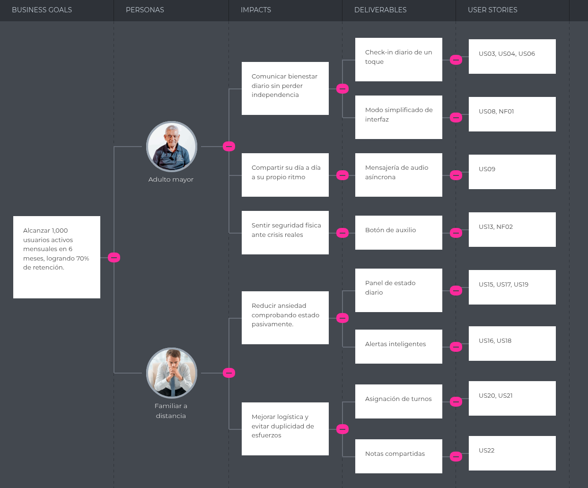
   <i>Imagen 10. Diagrama de Impact Mapping.</i>

 

### 2.4.3. Product Backlog

| Orden | User Story Id | Título | Story Points (1 / 2 / 3 / 5 / 8) | Sprint |
|---:|---|---|---:|---|
| 1 | US04 | Notificación programada del check-in diario | 5 | Sprint 1 |
| 2 | US09 | Grabación y envío de mensaje de audio | 5 | Sprint 1 |
| 3 | US13 | Activación del botón de auxilio | 5 | Sprint 1 |
| 4 | US14 | Recepción de alerta de emergencia | 5 | Sprint 1 |
| 5 | NF01 | Accesibilidad visual y táctil de la interfaz | 5 | Sprint 1 |
| 6 | TS01 | Gestión de usuarios del sistema | 5 | Sprint 1 |
| 7 | TS02 | Gestión de sesiones de autenticación | 5 | Sprint 1 |
| 8 | TS03 | Gestión de vínculos familiares | 5 | Sprint 1 |
| 9 | TS04 | Gestión de check-ins diarios | 5 | Sprint 1 |
| 10 | US01 | Registro de cuenta de usuario | 3 | Sprint 1 |
| 11 | US02 | Vinculación familiar por código de invitación | 3 | Sprint 1 |
| 12 | US10 | Reproducción de mensajes de audio recibidos | 3 | Sprint 1 |
| 13 | US15 | Consulta del estado diario | 3 | Sprint 1 |
| 14 | NF02 | Latencia de entrega de alertas de emergencia | 3 | Sprint 1 |
| 15 | TS05 | Gestión de preferencias del usuario | 3 | Sprint 1 |
| 16 | US23 | Propuesta de valor en la landing page | 1 | Sprint 1 |
| 17 | US16 | Alerta por inactividad del check-in | 5 | Sprint 2 |
| 18 | US18 | Sugerencia de acción por patrón de malestar | 5 | Sprint 2 |
| 19 | US20 | Asignación de turnos de atención | 5 | Sprint 2 |
| 20 | NF03 | Control de acceso a los datos de bienestar | 5 | Sprint 2 |
| 21 | TS06 | Gestión de mensajes de audio | 5 | Sprint 2 |
| 22 | TS08 | Gestión de alertas de emergencia | 5 | Sprint 2 |
| 23 | TS09 | Gestión del panel de estado | 5 | Sprint 2 |
| 24 | TS10 | Gestión de alertas de inactividad | 5 | Sprint 2 |
| 25 | TS11 | Gestión de turnos de atención | 5 | Sprint 2 |
| 26 | TS13 | Gestión de indicadores de bienestar | 5 | Sprint 2 |
| 27 | US06 | Rotación de preguntas del check-in | 3 | Sprint 2 |
| 28 | US08 | Modo simplificado de interfaz | 3 | Sprint 2 |
| 29 | US17 | Historial de check-ins del adulto mayor | 3 | Sprint 2 |
| 30 | NF04 | Usabilidad sin experiencia tecnológica previa | 3 | Sprint 2 |
| 31 | TS07 | Gestión de recordatorios de contacto social | 3 | Sprint 2 |
| 32 | TS12 | Gestión de notas compartidas | 3 | Sprint 2 |
| 33 | US25 | Navegación y diseño responsive del sitio | 3 | Sprint 2 |
| 34 | US03 | Registro de respuesta del check-in diario | 2 | Sprint 2 |
| 35 | US05 | Configuración del horario del check-in | 2 | Sprint 2 |
| 36 | US07 | Pausa diaria de preguntas | 2 | Sprint 2 |
| 37 | US21 | Consulta del turno de atención vigente | 2 | Sprint 2 |
| 38 | US11 | Notificación de recordatorio de contacto social | 3 | Sprint 3 |
| 39 | US22 | Notas compartidas entre familiares | 3 | Sprint 3 |
| 40 | US12 | Postergación de recordatorio de contacto social | 2 | Sprint 3 |
| 41 | US19 | Registro de pequeñas victorias | 2 | Sprint 3 |
| 42 | US24 | Presentación del modelo de dos aplicaciones | 1 | Sprint 3 |
| 43 | US26 | Sección institucional de la startup | 1 | Sprint 3 |
| 44 | US27 | Envío de fotografía al adulto mayor | 2 | Sprint 3 |
| 45| SP01 | Integración de Firebase Cloud Messaging | 5 | Sprint 3 |
| 46 | SP02 | Grabación, almacenamiento y reproducción de audio | 5 | Sprint 3 |

 

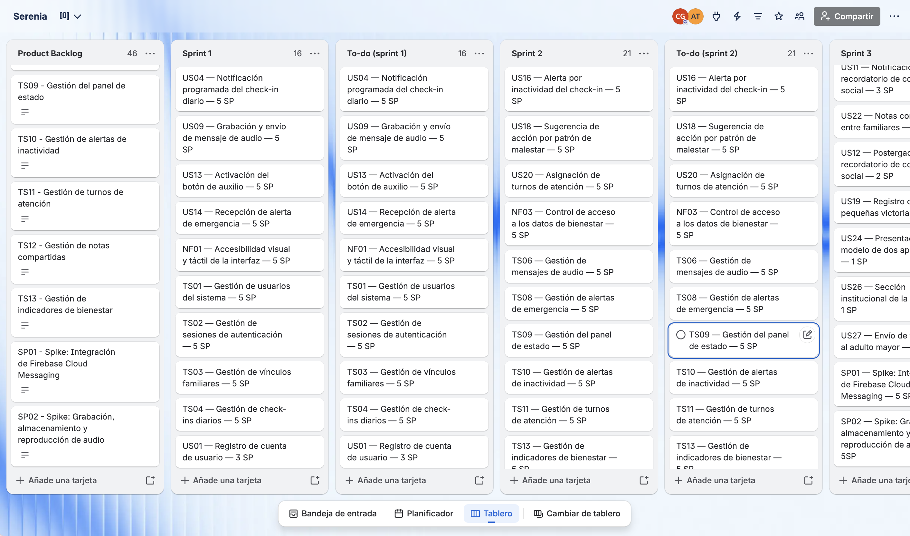
   <i>Imagen 11. Captura de Product Backlog en Trello.</i>

 

**URL:** https://trello.com/invite/b/6aa8e6d78ed225cd21e9e93c/ATTI46cbaeeceb1072274d9c62399714ddaeF68A89AE/serenia

 

## 2.5. Strategic-Level Domain-Driven Design
### 2.5.1. EventStorming
#### 2.5.1.1. Candidate Context Discovery

A partir del dominio modelado en el Big Picture EventStorming, el equipo desarrolló una sesión de Candidate Context Discovery con el fin de identificar los bounded contexts de Serenia. La sesión se realizó en Miro sobre el muro de 46 eventos de dominio previamente levantados y tuvo una duración aproximada de 1 hora y media.

La técnica aplicada fue start-with-value. En lugar de descomponer el timeline de forma secuencial, el equipo partió de la pregunta sobre qué partes del dominio concentran el mayor valor para el negocio, entendiendo por valor aquello que sostiene directamente la propuesta diferencial de Serenia: reemplazar la común llamada telefónica por un acompañamiento emocional sostenido y verificable a distancia.

 

El proceso se desarrolló en tres momentos:

**Identificación del core.** El equipo recorrió el muro marcando los eventos sin los cuales la propuesta de valor de Serenia deja de existir. De este recorrido surgieron tres núcleos: los eventos de registro y respuesta del check-in diario, que son el mecanismo por el cual el adulto mayor comunica su estado sin sentirse vigilado; los eventos de interpretación de patrones de bienestar, que convierten esas respuestas en información valiosa para el familiar a distancia; y los eventos de alerta ante emergencia o inactividad prolongada, que son la garantía de tranquilidad que el familiar a distancia está comprando. Estos tres núcleos se delimitaron primero, por ser los que concentran la lógica de negocio propia del producto.

**Delimitación del contexto habilitador.** Un segundo recorrido identificó los eventos que no generan valor por sí mismos pero sin los cuales el core no puede operar: los de creación del círculo de cuidado y vinculación familiar. Sin un vínculo establecido no hay a quién notificar ni con quién compartir el estado del adulto mayor. Este conjunto se delimitó como un contexto propio y no se absorbió dentro del core, ya que administra la estructura de la relación familiar (sobre quién está vinculado, quién tiene un turno de cuidado asignado y qué notas se comparten) y no la interpretación del bienestar.

**Separación de lo genérico y lo complementario.** Finalmente, el equipo aisló los eventos que no aportan diferenciación competitiva. Por un lado, los de identidad, autenticación y gestión de perfil, que son resolubles con mecanismos estándar y cuyas reglas no cambian con el negocio de Serenia. Por otro lado, los de mensajería de audio, imágenes y recordatorios sociales, que enriquecen la experiencia de acompañamiento pero no producen ninguna señal que el sistema evalúe ni disparan ningún flujo de alerta.

El resultado de la sesión fuerons seis bounded contexts candidatos, clasificados según su aporte de valor:

 

### Daily Check-in - Core  
Es el mecanismo primario por el cual Serenia genera valor diferencial: convierte una interacción emocional cotidiana en una señal estructurada, sin que el adulto mayor sienta que está siendo monitoreado clínicamente. Sin este contexto no existe el dato que el resto del sistema necesita para funcionar.

 

  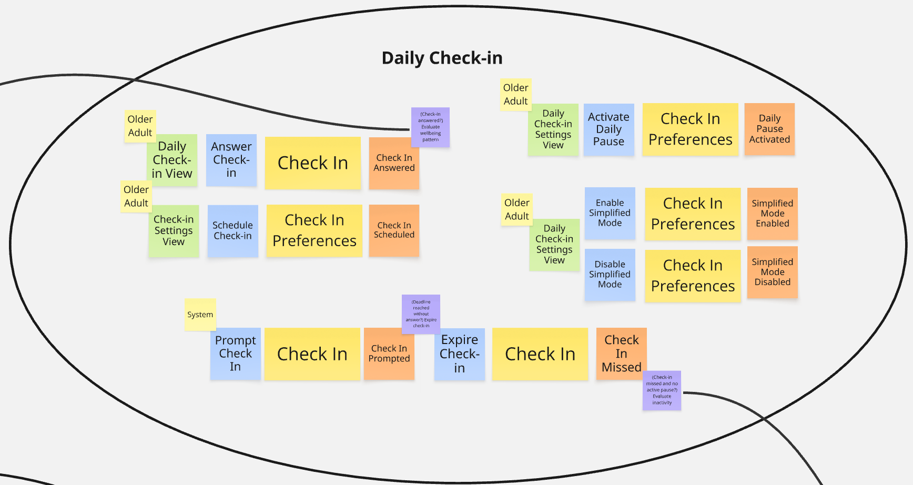
   <i>Imagen 12. Daily Check-in - Bounded Context Core identificado en el Candidate Context Discovery.</i>

  

### Wellbeing Monitoring - Core  
Es el contexto que interpreta las señales del check-in y las convierte en información para la familia a distancia. Concentra la lógica del negocio más distintiva de Serenia: distinguir un mal día puntual de un patrón de deterioro sostenido, evitando tanto la falsa alarma como la negligencia.

 

  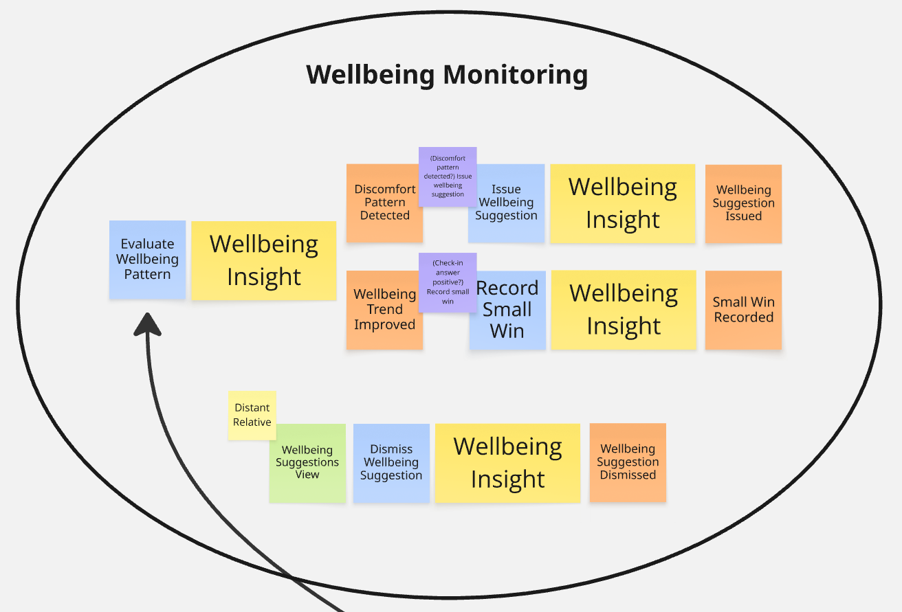
   <i>Imagen 13. Wellbeing Monitoring - Bounded Context Core identificado en el Candidate Context Discovery.</i>

  

### Alerts & Safety - Core  
Es la garantía de tranquilidad que sostiene la decisión de compra del familiar a distancia. Sin una respuesta confiable ante inactividad o emergencia, el resto de la propuesta de valor pierde sustento, porque el familiar seguiría necesitando de llamar por su cuenta ante cualquier duda.

 

  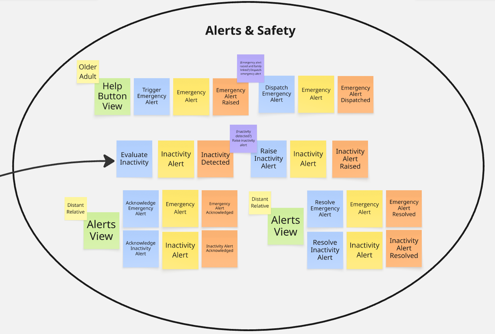
   <i>Imagen 14. Alerts & Safety - Bounded Context Core identificado en el Candidate Context Discovery.</i>

  

### Care Circle - Supporting  
No genera valor por sí solo, pero es indispensable para que el core opere: sin un vínculo familiar establecido no hay a quién notificar ni con quién compartir el estado del adulto mayor. Se mantiene separado del core porque administra estructura de relación (vínculos, turnos, notas compartidas), no interpretación de bienestar.

 

  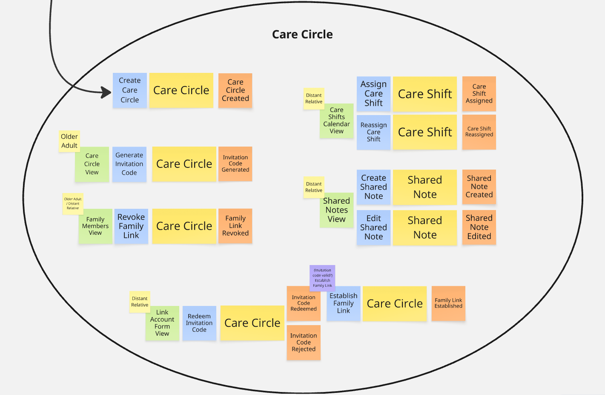
   <i>Imagen 15. Care Circle - Bounded Context Supporting identificado en el Candidate Context Discovery.</i>

  

### Social Companionship - Supporting  
Complementa la experiencia de acompañamiento con mensajería de audio, fotos y recordatorios sociales, pero ninguno de sus eventos produce una señal que el sistema evalúe ni deriva en alerta. Aporta valor percibido, no valor operativo.

 

  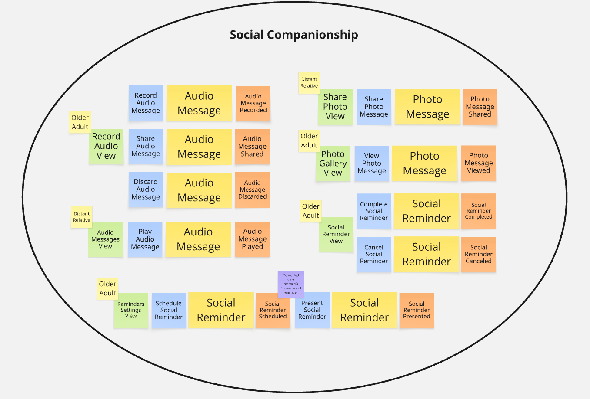
   <i>Imagen 16. Social Companionship - Bounded Context Supporting identificado en el Candidate Context Discovery.</i>

  

### Identity & Access - Generic  
Resuelve un problema estándar (registro, autenticación, gestión de sesión) con reglas de negocio genéricas que no cambian por ser Serenia. Es indispensable para que exista cualquier otro contexto, pero no distingue a Serenia de ninguna otra aplicación.

 

  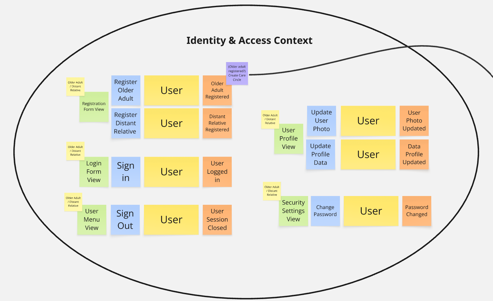
   <i>Imagen 17. Identity & Access - Bounded Context Generic identificado en el Candidate Context Discovery.</i>

  

Al finalizar, el equipo aplicó una verificación del lenguaje ubicuo sobre cada frontera, comprobando que ningún término tuviera dos significados dentro de un mismo contexto. Esta revisión confirmó, por ejemplo, la separación entre Daily Check-in y Wellbeing Monitoring. Otra discusión del equipo fue la frontera entre Daily Check-in y Social Companionship, por compartir ambos la dimensión emocional de la interacción; se resolvió mantenerlas separadas sobre la base de que únicamente el check-in produce una señal que el sistema evalúa, mientras que el acompañamiento social no está sujeto a ninguna evaluación.

## EventStorming Serenia

 

  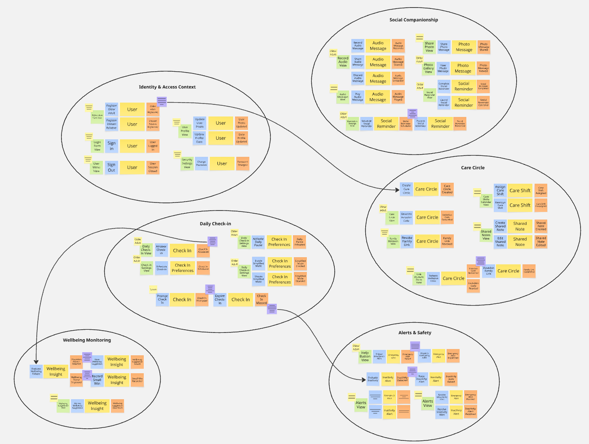
   <i>Imagen 18. Candidate Context Discovery completo del dominio de Serenia.</i>

 

#### 2.5.1.2. Domain Message Flows Modeling

Una vez delimitados los bounded contexts candidatos, el equipo desarrolló una sesión de Domain Message Flows Modeling con el fin de visualizar cómo deben colaborar dichos contextos para resolver los casos de negocio que enfrentan los usuarios del sistema. Mientras que la sesión anterior respondió dónde trazar las fronteras, esta buscó responder qué mensajes deben cruzarlas.

La técnica aplicada fue Domain Storytelling, empleando la herramienta Egon.io. La notación representa cada escenario mediante actores, objetos de trabajo y actividades numeradas que se leen como oraciones completas, lo que permite validar el flujo con lenguaje natural del dominio. El equipo introdujo una variante deliberada sobre la notación clásica: además de los actores humanos, cada bounded context fue modelado como un actor de tipo sistema. De esta forma, toda flecha que va de un contexto a otro constituye un mensaje de dominio explícito, y el diagrama evidencia directamente la colaboración entre fronteras en lugar de tratar al sistema como una caja negra.

La selección de escenarios no buscó cobertura funcional completa, sino aquellos casos en los que más de un bounded context debe intervenir para resolver una necesidad del usuario. Bajo ese criterio se modelaron tres domain stories, cada una correspondiente a un escenario de camino feliz. Los casos de rechazo y las variantes excepcionales quedaron fuera del alcance, ya que en Domain Storytelling cada variación constituye una historia independiente y no una ramificación del mismo diagrama.

 

**Domain Story 1: Registro y vinculación familiar**

Este escenario resuelve el caso en que un adulto mayor se registra en Serenia y habilita a un familiar a distancia para acceder a su estado. Es la historia que da origen a toda relación posterior en el sistema: sin un vínculo familiar establecido, ningún otro flujo puede ejecutarse.

 

  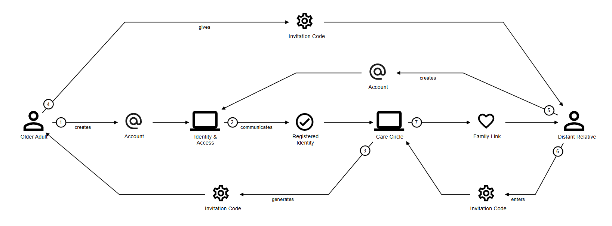
   <i>Imagen 19. Domain Story 1 - Registro y vinculación familiar.</i>

 

El adulto mayor crea su cuenta en Identity & Access (1), el cual comunica la identidad registrada a Care Circle (2). Care Circle genera entonces un código de invitación y lo entrega al adulto mayor (3), quien se lo transmite al familiar a distancia por un medio ajeno al sistema (4). El familiar crea su propia cuenta en Identity & Access (5), ingresa el código de invitación en Care Circle (6) y recibe la confirmación del vínculo familiar establecido (7).

 

**Domain Story 2: Check-in diario y consulta del estado**

Este escenario representa la operación cotidiana de Serenia y el caso de uso que sostiene su propuesta de valor: el adulto mayor comunica su bienestar sin necesidad de una llamada, y el familiar a distancia lo verifica sin necesidad de interrumpirlo.

 

  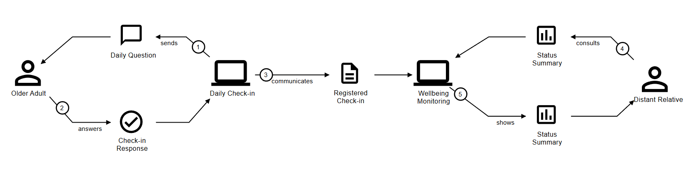
   <i>Imagen 20. Domain Story 2 - Check-in diario y consulta del estado.</i>

 

Daily Check-in envía la pregunta diaria al adulto mayor (1), quien responde el check-in (2). Daily Check-in comunica entonces el check-in registrado a Wellbeing Monitoring (3), que lo incorpora al historial del adulto mayor. Posteriormente, el familiar a distancia consulta el resumen de estado (4) y Wellbeing Monitoring se lo muestra (5).

 

**Domain Story 3: Detección de un patrón de malestar**

Este escenario resuelve el caso en que el adulto mayor reporta malestar durante varios días consecutivos sin que ello constituya una emergencia. Es el flujo que distingue a Serenia de una aplicación de alertas reactivas, ya que actúa sobre una tendencia y no sobre un evento aislado.

 

  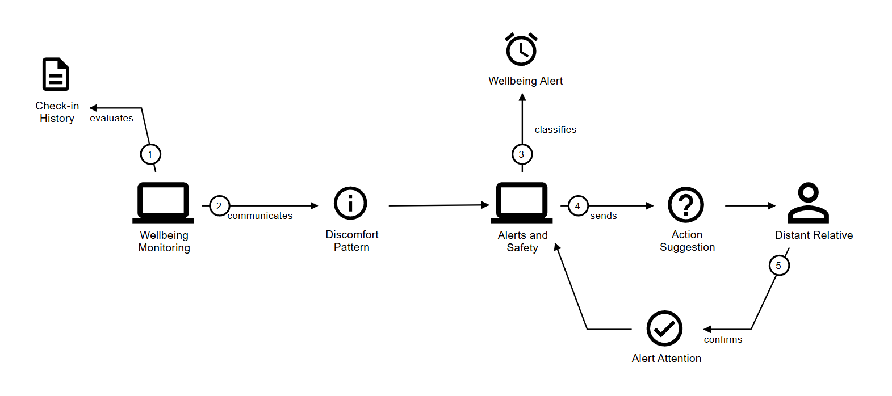
   <i>Imagen 21. Domain Story 3 - Detección de un patrón de malestar.</i>

 

Wellbeing Monitoring evalúa el historial de check-ins del adulto mayor (1) y, al identificar un patrón sostenido de malestar, lo comunica a Alerts and Safety (2). Este último clasifica la alerta de bienestar según su severidad (3), envía una sugerencia de acción al familiar a distancia (4) y registra la confirmación de atención por parte de este (5).

 

El modelado de los flujos de mensajes permitió comprobar que la descomposición propuesta resiste la ejecución de los casos de negocio reales de Serenia. Las tres historias muestran una cadena de colaboración coherente: Care Circle origina el vínculo familiar del que dependen todas las comunicaciones posteriores, Daily Check-in captura la señal diaria, Wellbeing Monitoring la acumula e interpreta, y Alerts and Safety actúa únicamente cuando esa interpretación lo amerita. Cada contexto recibe lo que necesita para cumplir su responsabilidad y ninguno requiere asumir la de otro, lo que confirma que las fronteras trazadas son operativas y no solo conceptuales.

Adicionalmente, los diagramas identificaron con precisión los tres puntos de integración del sistema —identidad registrada, check-in registrado y patrón de malestar detectado—, que constituyen el insumo directo para definir los patrones de relación entre contextos.

 

#### 2.5.1.3. Bounded Context Canvases

Con los bounded contexts identificados y sus flujos de colaboración visualizados, el equipo procedió a diseñar cada uno de ellos mediante la técnica del Bounded Context Canvas. A diferencia de las secciones anteriores, cuyo propósito fue descubrir y validar las fronteras, esta busca definir el contrato de diseño de cada contexto: su razón de existir, las reglas de negocio que encapsula, los mensajes que expone y las dependencias que mantiene con los demás.

Los contextos se presentan por orden de importancia, iniciando por los clasificados como Core, continuando con los Supporting y cerrando con el Generic.

<table> <tr><th colspan="2">Bounded Context Canvas 1 — Daily Check-in</th></tr> <tr><td><b>Purpose</b></td><td>Permitir que el adulto mayor comunique su bienestar cotidiano mediante una interacción de un solo toque, sin necesidad de una llamada telefónica ni de dar explicaciones extensas, preservando su autonomía y evitando que la interacción se perciba como vigilancia clínica.</td></tr> <tr><td><b>Strategic Classification</b></td><td><b>Domain:</b> Core — es el mecanismo primario de generación de valor. <b>Business Model:</b> Engagement Creator — el adulto mayor no paga por esta funcionalidad, pero su uso sostenido es la condición de todo lo demás. <b>Evolution:</b> Custom Built — existen check-ins en otras soluciones, pero Serenia los diferencia por su tono no clínico y su variabilidad.</td></tr> <tr><td><b>Domain Roles</b></td><td>Execution context — ejecuta el ciclo diario de captura de respuesta. No interpreta ni acumula: esa responsabilidad corresponde a Wellbeing Monitoring.</td></tr> <tr><td><b>Inbound Communication</b></td><td>Check-in response (Command) — Older Adult, interacción directa de UI Pausa de preguntas activada (Command) — Older Adult, interacción directa de UI Family link established (Event) — Care Circle, Published Language</td></tr> <tr><td><b>Outbound Communication</b></td><td>Daily question (Event) — Older Adult, interacción directa de UI Registered check-in (Event) — Wellbeing Monitoring, Customer/Supplier Unanswered check-in (Event) — Alerts and Safety, Customer/Supplier</td></tr> <tr><td><b>Ubiquitous Language</b></td><td><b>Check-in:</b> respuesta diaria del adulto mayor sobre su estado. <b>Daily Question:</b> estímulo variable que inicia el check-in. <b>Time Limit Window:</b> plazo desde el horario configurado dentro del cual se espera la respuesta. <b>Daily Pause:</b> suspensión voluntaria del check-in por el día en curso.</td></tr> <tr><td><b>Business Decisions</b></td><td>El check-in se responde con un solo toque, sin formularios ni campos adicionales (US03). El adulto mayor puede activar la pausa de preguntas para el día en curso; en ese caso no se evalúa la ausencia de respuesta (US16). La pregunta diaria es variable y de tono de compañía, no clínico.</td></tr> <tr><td><b>Assumptions</b></td><td>El adulto mayor dispone de un smartphone táctil y puede realizar interacciones simples sin asistencia. El horario de la pregunta diaria es configurable por el adulto mayor.</td></tr> <tr><td><b>Verification Metrics</b></td><td>Tasa de check-ins diarios completados. Frecuencia de uso de la pausa de preguntas. Tiempo promedio entre el envío de la pregunta y la respuesta.</td></tr> <tr><td><b>Open Questions</b></td><td>¿La pregunta diaria varía en contenido o únicamente en horario de aparición? ¿Existe un número máximo de recordatorios si el adulto mayor abre la aplicación pero no responde?</td></tr> </table>

 

<table> <tr><th colspan="2">Bounded Context Canvas 2 — Wellbeing Monitoring</th></tr> <tr><td><b>Purpose</b></td><td>Convertir las respuestas diarias del adulto mayor en información significativa para el familiar a distancia, distinguiendo un mal día puntual de un patrón sostenido de deterioro, de modo que el familiar conozca su estado sin necesidad de interrumpirlo.</td></tr> <tr><td><b>Strategic Classification</b></td><td><b>Domain:</b> Core — concentra la lógica de negocio más distintiva de Serenia. <b>Business Model:</b> Revenue Generator — el panel de estado y el historial constituyen el núcleo de las funciones familiares del modelo freemium. <b>Evolution:</b> Custom Built — la interpretación emocional no clínica de patrones no tiene equivalente estandarizado.</td></tr> <tr><td><b>Domain Roles</b></td><td>Analysis context — recibe señales, las acumula y las interpreta para producir información derivada. No ejecuta acciones sobre el usuario.</td></tr> <tr><td><b>Inbound Communication</b></td><td>Registered check-in (Event) — Daily Check-in, Customer/Supplier Status summary request (Query) — Distant Relative, interacción directa de UI Check-in history request (Query) — Distant Relative, interacción directa de UI Family link established (Event) — Care Circle, Published Language</td></tr> <tr><td><b>Outbound Communication</b></td><td>Status summary (Query response) — Distant Relative, interacción directa de UI Discomfort pattern detected (Event) — Alerts and Safety, Customer/Supplier</td></tr> <tr><td><b>Ubiquitous Language</b></td><td><b>Check-in History:</b> secuencia ordenada de respuestas del adulto mayor. <b>Status Summary:</b> vista del día en curso que consulta el familiar. <b>Discomfort Pattern:</b> tendencia sostenida de respuestas negativas en días consecutivos. <b>Small Win:</b> actividad positiva registrada en un check-in.</td></tr> <tr><td><b>Business Decisions</b></td><td>Un patrón de malestar requiere varios días consecutivos de reporte negativo; una respuesta aislada no lo constituye (US18). El historial se presenta ordenado por fecha y no se limita al día en curso (US17). Se registran también las actividades positivas, de modo que el familiar no reciba únicamente señales negativas (US19).</td></tr> <tr><td><b>Assumptions</b></td><td>El familiar revisa el panel de estado con frecuencia suficiente como para que la consulta bajo demanda sea adecuada y no se requiera notificación activa. La información de vinculación familiar se encuentra disponible localmente por propagación desde Care Circle.</td></tr> <tr><td><b>Verification Metrics</b></td><td>Frecuencia de consulta del panel de estado por familiar. Proporción de patrones detectados que derivan en atención efectiva del familiar. Reducción de llamadas motivadas por ansiedad reportadas por los usuarios.</td></tr> <tr><td><b>Open Questions</b></td><td>¿Cuántos días consecutivos configuran un patrón de malestar? ¿El umbral es fijo o se ajusta al comportamiento habitual de cada adulto mayor?</td></tr> </table>

 

<table> <tr><th colspan="2">Bounded Context Canvas 3 — Alerts and Safety</th></tr> <tr><td><b>Purpose</b></td><td>Garantizar que el familiar a distancia sea informado cuando la situación del adulto mayor lo amerite, ya sea por ausencia prolongada de respuesta, por un patrón de malestar sostenido o por una emergencia declarada, de modo que no necesite verificar por su cuenta ante cada duda.</td></tr> <tr><td><b>Strategic Classification</b></td><td><b>Domain:</b> Core — es la garantía de tranquilidad que sostiene la decisión de adopción del familiar. <b>Business Model:</b> Revenue Generator — las alertas selectivas forman parte de las funciones familiares de pago. <b>Evolution:</b> Product — existen soluciones de alerta de emergencia en el mercado, aunque sin la selectividad que Serenia propone.</td></tr> <tr><td><b>Domain Roles</b></td><td>Execution context con rol de notificación — aplica reglas de escalamiento y decide a quién y cuándo notificar.</td></tr> <tr><td><b>Inbound Communication</b></td><td>Unanswered check-in (Event) — Daily Check-in, Customer/Supplier Discomfort pattern detected (Event) — Wellbeing Monitoring, Customer/Supplier Emergency alert triggered (Command) — Older Adult, interacción directa de UI Alert attention confirmed (Command) — Distant Relative, interacción directa de UI Family link established (Event) — Care Circle, Published Language</td></tr> <tr><td><b>Outbound Communication</b></td><td>Action suggestion (Event) — Distant Relative, interacción directa de UI Inactivity alert (Event) — Distant Relative, interacción directa de UI Emergency alert (Event) — Distant Relative, interacción directa de UI Contact reminder (Event) — Older Adult, interacción directa de UI</td></tr> <tr><td><b>Ubiquitous Language</b></td><td><b>Inactivity Alert:</b> notificación generada por ausencia de check-in dentro del plazo. <b>Emergency Alert:</b> notificación iniciada explícitamente por el adulto mayor. <b>Inactivity Window:</b> plazo que transcurre antes de escalar una ausencia de respuesta. <b>Suggested Action:</b> recomendación dirigida al familiar ante un patrón de malestar. <b>Severity:</b> nivel asignado a una alerta según su origen y urgencia.</td></tr> <tr><td><b>Business Decisions</b></td><td>La alerta de inactividad se genera solo si el check-in no fue respondido dentro del tiempo límite y la pausa de preguntas no está activa (US16). Una alerta de emergencia dirigida a un adulto mayor sin familiares vinculados no puede procesarse (TS08). La alerta escala a emergencia únicamente tras vencer la ventana de inactividad sin respuesta al recordatorio de contacto.</td></tr> <tr><td><b>Assumptions</b></td><td>El familiar tiene las notificaciones habilitadas en su dispositivo. La lista de familiares vinculados se encuentra disponible localmente por propagación desde Care Circle, sin requerir consulta síncrona.</td></tr> <tr><td><b>Verification Metrics</b></td><td>Proporción de alertas confirmadas como atendidas por el familiar. Tasa de falsos positivos reportados. Tiempo entre la generación de la alerta y su atención.</td></tr> <tr><td><b>Open Questions</b></td><td>¿Cuál es la duración de la ventana de inactividad y es configurable por el familiar? ¿Todos los familiares vinculados reciben la alerta simultáneamente o se respeta el turno de atención vigente?</td></tr> </table>

 

<table> <tr><th colspan="2">Bounded Context Canvas 4 — Care Circle</th></tr> <tr><td><b>Purpose</b></td><td>Establecer y administrar la relación entre el adulto mayor y sus familiares a distancia, determinando quiénes están vinculados a él, quién asume el turno de atención y qué información comparten entre sí, de modo que los demás contextos sepan a quién corresponde informar.</td></tr> <tr><td><b>Strategic Classification</b></td><td><b>Domain:</b> Supporting — no genera valor por sí solo, pero ningún contexto Core puede operar sin él. <b>Business Model:</b> Engagement Creator — la coordinación entre familiares incrementa el uso pero no se cobra de forma directa. <b>Evolution:</b> Custom Built — la estructura del círculo de cuidado responde a la dinámica familiar específica que Serenia atiende.</td></tr> <tr><td><b>Domain Roles</b></td><td>Registry context — mantiene y publica la estructura de relaciones. No interpreta información de bienestar ni emite alertas.</td></tr> <tr><td><b>Inbound Communication</b></td><td>Registered identity (Event) — Identity &amp; Access, Conformist Invitation code entered (Command) — Distant Relative, interacción directa de UI Care shift assigned (Command) — Distant Relative, interacción directa de UI Shared note added (Command) — Distant Relative, interacción directa de UI</td></tr> <tr><td><b>Outbound Communication</b></td><td>Invitation code (Event) — Older Adult, interacción directa de UI Family link established (Event) — Daily Check-in, Wellbeing Monitoring, Alerts and Safety y Social Companionship, Published Language Care shift confirmation (Event) — Distant Relative, interacción directa de UI</td></tr> <tr><td><b>Ubiquitous Language</b></td><td><b>Care Circle:</b> conjunto de familiares vinculados a un adulto mayor. <b>Family Link:</b> relación establecida entre la cuenta de un familiar y la de un adulto mayor. <b>Invitation Code:</b> credencial de un solo uso generada por el adulto mayor para habilitar un vínculo. <b>Care Shift:</b> responsabilidad de seguimiento asignada a un familiar para una fecha determinada.</td></tr> <tr><td><b>Business Decisions</b></td><td>El código de invitación es generado por el adulto mayor y corresponde a un solo uso; un código ya utilizado o expirado no permite vinculación (US02). Una fecha admite un único turno de atención asignado; un segundo intento sobre la misma fecha se rechaza (US20). Un adulto mayor puede tener varios familiares vinculados simultáneamente.</td></tr> <tr><td><b>Assumptions</b></td><td>La transmisión del código de invitación del adulto mayor al familiar ocurre por un canal externo al sistema. El adulto mayor es siempre quien origina el vínculo, nunca el familiar.</td></tr> <tr><td><b>Verification Metrics</b></td><td>Proporción de códigos de invitación generados que derivan en un vínculo efectivo. Número promedio de familiares vinculados por adulto mayor. Frecuencia de uso de la asignación de turnos.</td></tr> <tr><td><b>Open Questions</b></td><td>¿El código de invitación tiene un plazo de expiración definido? ¿Puede un vínculo familiar ser revocado y por quién?</td></tr> </table>

 

<table> <tr><th colspan="2">Bounded Context Canvas 5 — Social Companionship</th></tr> <tr><td><b>Purpose</b></td><td>Enriquecer la relación entre el adulto mayor y su familia mediante intercambios afectivos ligeros —mensajes de audio, fotografías y recordatorios sociales— que refuercen el sentido de compañía más allá de la verificación de bienestar.</td></tr> <tr><td><b>Strategic Classification</b></td><td><b>Domain:</b> Supporting — aporta valor percibido pero no valor operativo; ninguna de sus interacciones produce señal evaluable. <b>Business Model:</b> Engagement Creator — incrementa la frecuencia de uso sin constituir en sí mismo una fuente de ingreso. <b>Evolution:</b> Product — la mensajería multimedia es una capacidad ampliamente disponible en el mercado.</td></tr> <tr><td><b>Domain Roles</b></td><td>Communication context — transporta contenido entre personas sin interpretarlo ni evaluarlo.</td></tr> <tr><td><b>Inbound Communication</b></td><td>Audio message sent (Command) — Distant Relative y Older Adult, interacción directa de UI Photo shared (Command) — Distant Relative, interacción directa de UI Family link established (Event) — Care Circle, Published Language</td></tr> <tr><td><b>Outbound Communication</b></td><td>Message delivered (Event) — Older Adult y Distant Relative, interacción directa de UI Social reminder (Event) — Older Adult, interacción directa de UI</td></tr> <tr><td><b>Ubiquitous Language</b></td><td><b>Audio Message:</b> grabación de voz enviada entre miembros del círculo de cuidado. <b>Social Reminder:</b> aviso de una fecha o evento familiar relevante. <b>Reaction:</b> respuesta breve a un mensaje recibido.</td></tr> <tr><td><b>Business Decisions</b></td><td>Solo pueden intercambiar mensajes los miembros de un mismo círculo de cuidado. Ningún contenido intercambiado en este contexto se evalúa, interpreta ni deriva en alerta.</td></tr> <tr><td><b>Assumptions</b></td><td>El adulto mayor sabe grabar y reproducir un mensaje de audio sin asistencia. El volumen de contenido multimedia no requiere políticas de retención específicas en esta etapa.</td></tr> <tr><td><b>Verification Metrics</b></td><td>Frecuencia de mensajes intercambiados por círculo de cuidado. Proporción de mensajes recibidos que obtienen respuesta o reacción.</td></tr> <tr><td><b>Open Questions</b></td><td>¿Existe un límite de duración o tamaño para los mensajes de audio y las fotografías? ¿Los recordatorios sociales son creados manualmente por el familiar o se derivan de fechas registradas en el perfil?</td></tr> </table>

 

<table> <tr><th colspan="2">Bounded Context Canvas 6 — Identity & Access</th></tr> <tr><td><b>Purpose</b></td><td>Administrar el registro, la autenticación y la sesión de los usuarios de Serenia, garantizando que cada persona acceda únicamente a la información que le corresponde según su rol y sus vínculos establecidos.</td></tr> <tr><td><b>Strategic Classification</b></td><td><b>Domain:</b> Generic — resuelve un problema estándar cuyas reglas no cambian por tratarse de Serenia. <b>Business Model:</b> Compliance Enforcer — protege los datos de los usuarios y la responsabilidad legal del producto. <b>Evolution:</b> Commodity — existen soluciones altamente estandarizadas para esta capacidad.</td></tr> <tr><td><b>Domain Roles</b></td><td>Gatekeeper context — valida credenciales y autoriza accesos. No participa en ninguna regla de negocio del dominio de cuidado.</td></tr> <tr><td><b>Inbound Communication</b></td><td>Account creation (Command) — Older Adult y Distant Relative, interacción directa de UI Session request (Command) — Older Adult y Distant Relative, interacción directa de UI Profile update (Command) — Older Adult y Distant Relative, interacción directa de UI</td></tr> <tr><td><b>Outbound Communication</b></td><td>Registered identity (Event) — Care Circle, Published Language Session token (Query response) — Older Adult y Distant Relative, interacción directa de UI</td></tr> <tr><td><b>Ubiquitous Language</b></td><td><b>Account:</b> registro de un usuario en el sistema. <b>Session:</b> periodo de acceso autenticado. <b>Profile:</b> datos personales asociados a una cuenta. <b>Role:</b> tipo de usuario, adulto mayor o familiar a distancia.</td></tr> <tr><td><b>Business Decisions</b></td><td>El registro se rechaza si existen campos obligatorios vacíos o con formato incorrecto (US01). Una solicitud de sesión con credenciales inválidas se rechaza sin revelar cuál de los campos es incorrecto (TS02). El rol del usuario se define en el momento del registro y determina la aplicación a la que accede.</td></tr> <tr><td><b>Assumptions</b></td><td>El registro no requiere verificación mediante código enviado por correo electrónico o mensaje de texto en esta etapa del producto. Un usuario mantiene un único rol durante toda la vida de su cuenta.</td></tr> <tr><td><b>Verification Metrics</b></td><td>Tasa de registros completados respecto de los iniciados. Proporción de intentos de sesión fallidos. Frecuencia de solicitudes de recuperación de acceso.</td></tr> <tr><td><b>Open Questions</b></td><td>¿Se contempla incorporar verificación de identidad en una fase posterior del producto? ¿Cómo se gestiona la recuperación de acceso para un adulto mayor con baja familiaridad digital?</td></tr> </table>

 

La elaboración de los seis canvases permitió pasar de una descripción de los bounded contexts a una definición formal de su contrato de diseño. Al exigir que cada contexto declarara explícitamente las reglas de negocio que encapsula y los mensajes que expone, el ejercicio hizo evidente que ninguna regla del dominio quedó sin un contexto responsable y que ningún contexto aplica reglas que correspondan a otro.

 

### 2.5.2. Context Mapping

A partir de los 6 bounded contexts identificados (IAM, Care Circle, Daily Check-in, Wellbeing Monitoring, Alerts and Safety, Social Companionship), el equipo elaboró un Context Map para visualizar y explicar las relaciones estructurales entre ellos, revisando la información recolectada en las etapas previas de investigación para producir el diseño candidato.

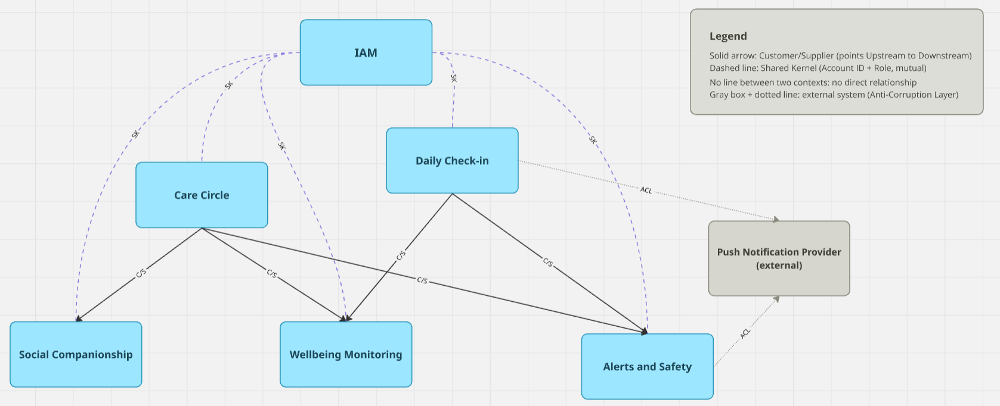
   <i>Imagen 22. Context Mapping Diagram.</i>

**URL del tablero en Miro:** https://miro.com/app/board/uXjVHm8lGW8=/

 

**Discusión de alternativas consideradas:**

- *¿Qué pasaría si duplicamos el Account ID y el Role en cada bounded context, en vez de compartirlo?* Se descartó porque generaría inconsistencias si un rol cambia (por ejemplo, si se revoca una cuenta) y cada context tendría que sincronizarse por separado. Por eso se optó por un **Shared Kernel** mínimo (solo Account ID + Role) entre IAM y los otros 5 contexts.
- *¿Qué pasaría si Wellbeing Monitoring y Alerts & Safety compartieran directamente su lógica de detección de anomalías?* Se evaluó, pero se decidió mantenerlos separados: Wellbeing Monitoring interpreta tendencias de bienestar (no urgentes), mientras que Alerts & Safety reacciona a umbrales que requieren atención inmediata. Fusionarlos mezclaría dos responsabilidades con niveles de criticidad distintos.
- *¿Qué pasaría si creáramos un shared service para reducir la duplicación entre Care Circle y los contexts que consultan el vínculo familiar (Wellbeing Monitoring, Alerts and Safety, Social Companionship)?* Se descartó por ahora: como los tres consumen el mismo dato (autorización de vínculo) de la misma forma, no hay duplicación de lógica que justifique un servicio nuevo, ya que cada uno simplemente consulta a Care Circle como su proveedor (**Customer/Supplier**).
- *¿Qué pasaría si Daily Check-in y Alerts and Safety adoptaran directamente el modelo del Push Notification Provider externo (Conformist), en vez de traducirlo?* Se descartó: el modelo de un proveedor externo (device tokens, formato de payload propio de cada plataforma) es un detalle de infraestructura que no debería filtrarse al dominio, y adoptarlo tal cual dejaría a ambos contexts acoplados a las decisiones de ese proveedor. Por eso se optó por una **Anti-Corruption Layer (ACL)** que traduce el modelo externo antes de que entre al dominio.

**Patrones aplicados:**
- **Shared Kernel**: IAM comparte Account ID + Role con los 5 contexts restantes, dado el alto acoplamiento aceptable para un dato tan básico y transversal.
- **Customer/Supplier**: predomina en el resto de relaciones (Care Circle y Daily Check-in como proveedores), ya que todo el sistema lo construye el mismo equipo y puede coordinar cambios libremente entre contexts.
- **Anti-Corruption Layer (ACL)**: Daily Check-in y Alerts and Safety dependen de un Push Notification Provider externo (servicio de terceros) para enviar notificaciones push al dispositivo del usuario. Se optó por una ACL en lugar de un Conformist porque el modelo del proveedor externo (tokens de dispositivo, formato de payload específico por plataforma) no debe filtrarse al dominio; cada context traduce hacia/desde ese modelo externo antes de operar con sus propios conceptos.
- **Conformist** no se aplicó: se decidió no adoptar el modelo del proveedor externo tal cual, precisamente para poder aislar el dominio y facilitar un eventual cambio de proveedor sin impactar la lógica de negocio.

 

### 2.5.3. Software Architecture

#### 2.5.3.1. Software Architecture Context Level Diagrams

En esta sección se presenta el *System Context Diagram*, primer nivel del C4 Model, elaborado en Structurizr. Este diagrama muestra al sistema Serenia como una única caja central, rodeada de los usuarios y de los sistemas externos con los que interactúa, sin entrar en detalles internos de la solución.

 

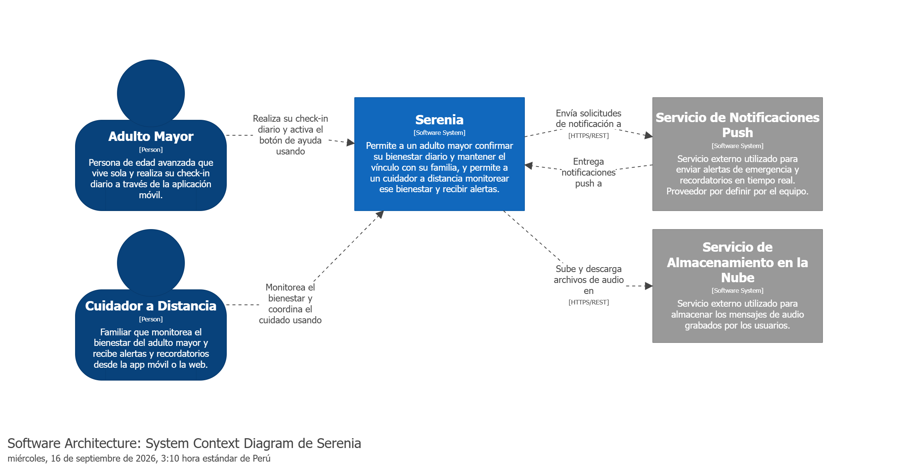
   <i>Imagen 23. System Context Diagram de Serenia.</i>

 

Como se observa en el diagrama, el sistema Serenia interactúa con dos tipos de usuario: el **Adulto Mayor**, quien realiza el check-in diario y puede activar el botón de ayuda ante una emergencia, y el **Cuidador a Distancia**, quien recibe alertas, revisa el estado de bienestar y coordina el cuidado junto al resto del círculo familiar desde la aplicación móvil o la landing page web. Asimismo, Serenia depende de sistemas externos para su funcionamiento: un servicio de notificaciones push para el envío de alertas y recordatorios en tiempo real (proveedor aún por definir por el equipo), y un servicio de almacenamiento en la nube para los mensajes de audio grabados por los usuarios.

 

#### 2.5.3.2. Software Architecture Container Level Diagrams

En esta sección se presenta el *Container Diagram*, segundo nivel del C4 Model, el cual descompone al sistema Serenia en los grandes bloques tecnológicos (aplicaciones, servicios y almacenes de datos) que lo conforman, indicando la tecnología empleada en cada uno y la forma en que se comunican entre sí.

 

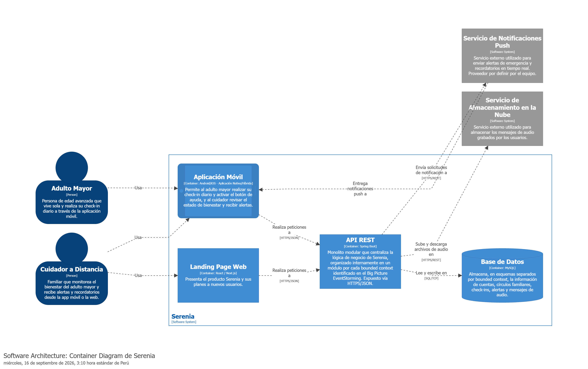
   <i>Imagen 24. Container Diagram de Serenia.</i>

 

El diagrama evidencia los principales contenedores de la solución: la **aplicación móvil** (consumida por el adulto mayor y el cuidador a distancia), la **landing page web** (donde se presenta el producto y sus planes a nuevos usuarios), la **API REST** desarrollada en **Spring Boot** —implementada como un **monolito modular**, organizado internamente en un módulo por cada bounded context identificado en el Big Picture EventStorming (IAM, Care Circle, Daily Check-in, Wellbeing Monitoring, Alerts and Safety y Social Companionship), la **base de datos MySQL** donde se persiste, en esquemas separados por bounded context, la información de cuentas, círculos familiares, check-ins y alertas, y el **servicio de notificaciones push** (proveedor aún por definir por el equipo), encargado de entregar en tiempo real las alertas de emergencia y los recordatorios sociales. Todos los contenedores de cliente (móvil y web) se comunican con la API REST mediante peticiones HTTPS/JSON. La composición interna de dicho monolito por módulos se detalla más adelante en los *Component Level Diagrams* de cada bounded context.

Como evidencia complementaria de esta organización modular, se presenta a continuación el diagrama de componentes interno del contenedor API REST, elaborado también en Structurizr, que muestra los módulos correspondientes a cada bounded context y sus relaciones de dependencia:

 

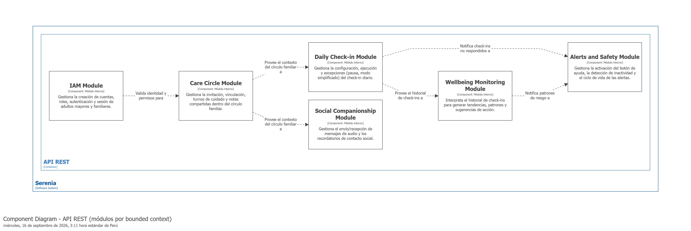
   <i>Imagen 25. Component Diagram del contenedor API REST, organizado por bounded context.</i>

Como se observa, el módulo **IAM** valida la identidad y los permisos que consume el módulo **Care Circle**, el cual a su vez provee el contexto del círculo familiar tanto al módulo **Daily Check-in** como al módulo **Social Companionship**. El módulo **Daily Check-in** provee el historial de check-ins al módulo **Wellbeing Monitoring** y notifica directamente al módulo **Alerts and Safety** los check-ins no respondidos, mientras que **Wellbeing Monitoring** notifica a **Alerts and Safety** los patrones de riesgo detectados. Esta descomposición interna se retomará y detallará individualmente por cada bounded context.

 

#### 2.5.3.3. Software Architecture Deployment Diagrams

En esta sección se presenta el *Deployment Diagram*, el cual muestra la distribución física del sistema, destacando cómo los contenedores de software descritos en la sección anterior se despliegan sobre el hardware y los entornos correspondientes. Este diagrama visualiza los dispositivos, servidores, redes y demás nodos físicos que alojan el software, así como las relaciones y dependencias entre ellos.

 

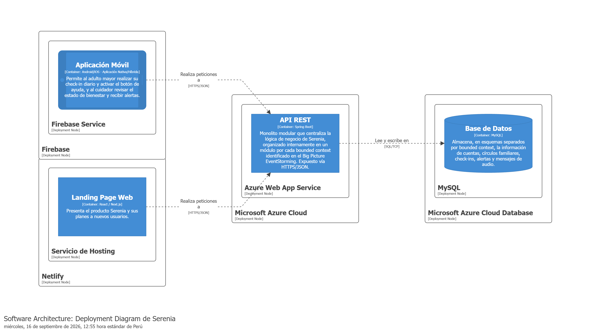
   <i>Imagen 26. Deployment Diagram de Serenia.</i>

 

Como se observa en el diagrama, cada uno de los containers de Serenia se despliega sobre un proveedor de infraestructura distinto. La **Aplicación Móvil** se distribuye y se prueba en los dispositivos Android/iOS del adulto mayor y del cuidador a distancia a través de **Firebase**, específicamente mediante **Firebase App Distribution**, lo que permite instalar y validar la aplicación en distintos dispositivos de prueba antes de su lanzamiento. La **Landing Page Web**, al ser un sitio estático, se aloja en **Netlify**, como servicio de hosting/CDN independiente del backend. La **API REST**, correspondiente al monolito modular desarrollado en Spring Boot, se despliega en **Microsoft Azure**, específicamente en un **Azure Web App Service**, mientras que la **Base de Datos MySQL** se aloja en **Microsoft Azure Cloud**, dentro del mismo proveedor cloud que la API, lo que favorece una comunicación de baja latencia entre ambos containers. La Aplicación Móvil y la Landing Page Web realizan peticiones a la API REST vía HTTPS/JSON, y esta a su vez lee y escribe información en la base de datos utilizando el protocolo SQL/TCP.

 

## 2.6. Tactical-Level Domain-Driven Design
### 2.6.1. Bounded Context: Identity & Access Context

El bounded context Identity & Access concentra todo lo relacionado con la identidad de las personas que usan Serenia: el registro diferenciado de adultos mayores y familiares a distancia, el inicio y cierre de sesión, la actualización de los datos de perfil y el cambio de contraseña. Es un contexto genérico: sus reglas son estándar y no se derivan del negocio del cuidado, pero ningún otro contexto puede operar sin él, ya que toda acción del sistema se atribuye a un usuario autenticado y a un rol determinado.

Su modelo gira en torno a un único aggregate, `User`, que es la raíz responsable de garantizar la consistencia de las credenciales, el estado de la cuenta y las sesiones abiertas de una misma persona. El rol se fija en el momento del registro y determina a qué aplicación accede el usuario. Al completarse el registro de un adulto mayor, el contexto publica el evento correspondiente, que habilita la creación posterior de su círculo de cuidado.

#### 2.6.1.1. Domain Layer

En esta capa se representan las reglas de negocio propias de la identidad de un usuario, sin dependencia de frameworks de persistencia, red ni interfaz.

**Sub-capa Model — Aggregates**

`User` (Aggregate Root): representa la cuenta de una persona en Serenia, sea adulto mayor o familiar a distancia. Controla la validez de sus credenciales, el estado de la cuenta y el ciclo de vida de sus sesiones.

| Atributo | Tipo | Visibilidad | Descripción |
| --- | --- | --- | --- |
| id | UserId | private | Identificador único de la cuenta. |
| email | EmailAddress | private | Correo electrónico único con el que el usuario inicia sesión. |
| passwordHash | PasswordHash | private | Representación cifrada de la contraseña; nunca almacena el valor en claro. |
| role | UserRole | private | Rol asignado en el registro; determina la aplicación a la que accede. |
| fullName | PersonName | private | Nombre completo del usuario. |
| phoneNumber | PhoneNumber | private | Número de contacto, opcional. |
| birthDate | LocalDate | private | Fecha de nacimiento, opcional. |
| photoUrl | String | private | Ubicación de la fotografía de perfil, opcional. |
| locale | LocaleCode | private | Idioma y región de la interfaz. |
| status | AccountStatus | private | Estado de la cuenta: activa, suspendida o eliminada. |
| sessions | List\<Session\> | private | Sesiones abiertas o históricas de la cuenta. |
| createdAt | LocalDateTime | private | Fecha y hora de creación de la cuenta. |
| updatedAt | LocalDateTime | private | Fecha y hora de la última modificación. |

| Método | Visibilidad | Descripción |
| --- | --- | --- |
| registerOlderAdult(email, passwordHash, fullName, locale) | public (static) | Crea una cuenta con rol de adulto mayor a partir de datos ya validados. |
| registerDistantRelative(email, passwordHash, fullName, locale) | public (static) | Crea una cuenta con rol de familiar a distancia. |
| openSession(tokenHash, deviceInfo, expiresAt) | public | Abre una nueva sesión para la cuenta y la incorpora al aggregate. |
| closeSession(sessionId) | public | Revoca la sesión indicada y la marca como cerrada. |
| updatePhoto(photoUrl) | public | Reemplaza la fotografía de perfil del usuario. |
| updateProfileData(fullName, phoneNumber, birthDate, locale) | public | Actualiza los datos personales de la cuenta. |
| changePassword(newPasswordHash) | public | Sustituye la contraseña cifrada de la cuenta. |
| activeSessions() | public | Devuelve las sesiones vigentes, sin revocar ni expiradas. |
| isActive() | public | Indica si la cuenta se encuentra en estado activo. |
| ensureActive() | private | Impide ejecutar operaciones sobre una cuenta suspendida o eliminada. |

**Sub-capa Model — Entities**

`Session`: representa un periodo de acceso autenticado de un usuario desde un dispositivo. Pertenece al aggregate `User` y no se manipula fuera de él.

| Atributo | Tipo | Visibilidad | Descripción |
| --- | --- | --- | --- |
| id | SessionId | private | Identificador único de la sesión. |
| tokenHash | TokenHash | private | Representación cifrada del token entregado al cliente. |
| deviceInfo | DeviceInfo | private | Descripción del dispositivo desde el que se inició la sesión. |
| issuedAt | LocalDateTime | private | Fecha y hora de emisión del token. |
| expiresAt | LocalDateTime | private | Fecha y hora en que el token deja de ser válido. |
| revokedAt | LocalDateTime | private | Fecha y hora del cierre de sesión, si ocurrió. |

| Método | Visibilidad | Descripción |
| --- | --- | --- |
| revoke(revokedAt) | public | Marca la sesión como cerrada en el instante indicado. |
| isExpired(referenceTime) | public | Indica si el token ya superó su fecha de expiración. |
| isActive(referenceTime) | public | Indica si la sesión sigue vigente: no revocada y no expirada. |

**Sub-capa Model — Value Objects**

| Nombre | Atributos | Descripción |
| --- | --- | --- |
| UserId | value: UUID | Identidad inmutable de una cuenta. |
| SessionId | value: UUID | Identidad inmutable de una sesión. |
| EmailAddress | value: String | Correo electrónico validado en formato y longitud máxima. |
| PasswordHash | value: String | Contraseña ya cifrada; impide que el dominio maneje texto plano. |
| TokenHash | value: String | Token de sesión cifrado, nunca almacenado en claro. |
| PersonName | value: String | Nombre completo con validación de obligatoriedad y longitud. |
| PhoneNumber | value: String | Número telefónico validado en formato. |
| LocaleCode | value: String | Código de idioma y región de la interfaz. |
| DeviceInfo | value: String | Descripción del dispositivo asociado a una sesión. |

**Sub-capa Model — Enumerations**

| Nombre | Valores | Descripción |
| --- | --- | --- |
| UserRole | OLDER_ADULT, DISTANT_RELATIVE | Rol del usuario, definido en el registro e inmutable. |
| AccountStatus | ACTIVE, SUSPENDED, DELETED | Estado del ciclo de vida de la cuenta. |

**Sub-capa Model — Commands**

| Nombre | Descripción |
| --- | --- |
| RegisterOlderAdultCommand | Intención de crear una cuenta con rol de adulto mayor. |
| RegisterDistantRelativeCommand | Intención de crear una cuenta con rol de familiar a distancia. |
| SignInCommand | Intención de autenticar a un usuario y abrir una sesión. |
| SignOutCommand | Intención de cerrar una sesión vigente. |
| UpdateUserPhotoCommand | Intención de actualizar la fotografía de perfil. |
| UpdateProfileDataCommand | Intención de actualizar los datos personales del perfil. |
| ChangePasswordCommand | Intención de reemplazar la contraseña de la cuenta. |

**Sub-capa Model — Queries**

| Nombre | Descripción |
| --- | --- |
| GetUserByIdQuery | Consulta de una cuenta por su identificador. |
| GetUserByEmailQuery | Consulta de una cuenta por su correo electrónico. |
| GetUserBySessionTokenQuery | Consulta de la cuenta asociada a un token de sesión vigente. |
| GetActiveSessionsByUserIdQuery | Consulta de las sesiones vigentes de una cuenta. |

**Sub-capa Model — Events**

| Nombre | Descripción |
| --- | --- |
| OlderAdultRegistered | Se creó una cuenta con rol de adulto mayor. |
| DistantRelativeRegistered | Se creó una cuenta con rol de familiar a distancia. |
| UserLoggedIn | Un usuario se autenticó correctamente y abrió una sesión. |
| UserSessionClosed | Un usuario cerró su sesión de forma explícita. |
| UserPhotoUpdated | Se actualizó la fotografía de perfil de un usuario. |
| ProfileDataUpdated | Se actualizaron los datos personales de un usuario. |
| PasswordChanged | Se modificó la contraseña de una cuenta. |

**Sub-capa Repositories**

| Tipo | Nombre | Métodos principales | Descripción |
| --- | --- | --- | --- |
| Interface | IUserRepository | save(user), findById(userId), findByEmail(email), existsByEmail(email), findBySessionTokenHash(tokenHash), findAll() | Contrato de persistencia del aggregate `User` junto con sus sesiones. Se implementa en Infrastructure. |

**Sub-capa Services**

| Tipo | Nombre | Métodos principales | Descripción |
| --- | --- | --- | --- |
| Interface | IUserCommandService | handle(RegisterOlderAdultCommand), handle(RegisterDistantRelativeCommand), handle(SignInCommand), handle(SignOutCommand), handle(UpdateUserPhotoCommand), handle(UpdateProfileDataCommand), handle(ChangePasswordCommand) | Contrato de las operaciones de escritura del contexto. |
| Interface | IUserQueryService | handle(GetUserByIdQuery), handle(GetUserByEmailQuery), handle(GetUserBySessionTokenQuery), handle(GetActiveSessionsByUserIdQuery) | Contrato de las operaciones de lectura del contexto. |
| Interface | IPasswordHashingService | hash(rawPassword), matches(rawPassword, passwordHash) | Abstracción del cifrado y verificación de contraseñas; mantiene el dominio libre de librerías de seguridad. |
| Interface | ITokenService | generate(userId, role), hash(token), expirationOf(token) | Abstracción de la generación y el cifrado de tokens de sesión. |
| Interface | IDomainEventPublisher | publish(event) | Abstracción para publicar los eventos de dominio hacia los demás módulos. |

#### 2.6.1.2. Interface Layer

Clases que exponen el bounded context hacia el exterior y traducen las peticiones entrantes al lenguaje del dominio.

**Sub-capa REST — Controllers**

| Nombre | Endpoints | Descripción |
| --- | --- | --- |
| UsersController | POST /users, GET /users/{id}, PUT /users/{id}/photo, PUT /users/{id}/profile, PUT /users/{id}/password | Punto de entrada de las operaciones de registro, consulta y gestión de perfil. Delega en los servicios de comandos y consultas. |
| SessionsController | POST /sessions, DELETE /sessions/{id} | Punto de entrada de la autenticación y el cierre de sesión. |

**Sub-capa REST — Resources**

| Nombre | Descripción |
| --- | --- |
| RegisterUserResource | Datos de entrada del registro, incluido el rol solicitado. |
| UserResource | Representación pública de una cuenta, sin datos sensibles. |
| SignInResource | Credenciales enviadas para solicitar una sesión. |
| AuthenticatedUserResource | Token de sesión emitido junto con los datos del usuario autenticado. |
| UpdateUserPhotoResource | Datos de entrada para actualizar la fotografía de perfil. |
| UpdateProfileDataResource | Datos de entrada para actualizar los datos personales. |
| ChangePasswordResource | Datos de entrada para el cambio de contraseña. |
| SessionResource | Representación de una sesión vigente y su dispositivo asociado. |

**Sub-capa REST — Transform**

| Nombre | Descripción |
| --- | --- |
| UserResourceFromEntityAssembler | Convierte el aggregate `User` en su representación REST. |
| AuthenticatedUserResourceFromEntityAssembler | Combina usuario y token emitido en un único recurso de respuesta. |
| SessionResourceFromEntityAssembler | Convierte la entidad `Session` en su representación REST. |
| RegisterOlderAdultCommandFromResourceAssembler | Convierte la petición de registro en el comando de adulto mayor. |
| RegisterDistantRelativeCommandFromResourceAssembler | Convierte la petición de registro en el comando de familiar a distancia. |
| SignInCommandFromResourceAssembler | Convierte las credenciales recibidas en el comando de autenticación. |
| UpdateUserPhotoCommandFromResourceAssembler | Convierte la petición de fotografía en su comando. |
| UpdateProfileDataCommandFromResourceAssembler | Convierte la petición de datos personales en su comando. |
| ChangePasswordCommandFromResourceAssembler | Convierte la petición de cambio de contraseña en su comando. |

#### 2.6.1.3. Application Layer

Clases que orquestan los flujos del contexto, coordinando el aggregate, los repositorios y los servicios de seguridad.

**Sub-capa Internal — CommandServices**

| Nombre | Responsabilidad principal | Relación con otros elementos |
| --- | --- | --- |
| UserCommandService | Ejecuta los siete comandos del contexto: valida la unicidad del correo, delega el cifrado de contraseñas, invoca los métodos del aggregate `User`, persiste el resultado y publica los eventos de dominio correspondientes. | Implementa `IUserCommandService`; usa `IUserRepository`, `IPasswordHashingService`, `ITokenService` e `IDomainEventPublisher`. |

**Sub-capa Internal — QueryServices**

| Nombre | Responsabilidad principal | Relación con otros elementos |
| --- | --- | --- |
| UserQueryService | Resuelve las consultas de cuentas y sesiones, devolviendo el aggregate o sus sesiones vigentes sin modificar el estado. | Implementa `IUserQueryService`; usa `IUserRepository`. |

#### 2.6.1.4 Infrastructure Layer

Clases que resuelven el acceso a la base de datos y a los mecanismos técnicos de seguridad, implementando las abstracciones definidas en el dominio.

**Sub-capa Persistence — Repositories**

| Nombre | Responsabilidad principal | Relación con otros elementos |
| --- | --- | --- |
| UserRepository | Persiste y recupera el aggregate `User` junto con sus sesiones sobre las tablas `users` y `sessions`, resolviendo además la búsqueda por correo y por token de sesión. | Implementa `IUserRepository`; usado por la capa Application. |

**Sub-capa Persistence — Mappers**

| Nombre | Responsabilidad principal | Relación con otros elementos |
| --- | --- | --- |
| UserPersistenceMapper | Traduce entre el aggregate `User` y su representación en base de datos, evitando que el modelo de persistencia se filtre al dominio. | Usado por `UserRepository`. |

**Sub-capa Security — Services**

| Nombre | Responsabilidad principal | Relación con otros elementos |
| --- | --- | --- |
| BCryptPasswordHashingService | Cifra las contraseñas y verifica credenciales mediante el algoritmo BCrypt. | Implementa `IPasswordHashingService`. |
| JwtTokenService | Genera los tokens de sesión, calcula su expiración y produce el hash que se almacena en la tabla `sessions`. | Implementa `ITokenService`. |

**Sub-capa Messaging — Publishers**

| Nombre | Responsabilidad principal | Relación con otros elementos |
| --- | --- | --- |
| DomainEventPublisherAdapter | Publica los eventos de dominio del contexto dentro del monolito modular para que otros módulos reaccionen a ellos. | Implementa `IDomainEventPublisher`. |

#### 2.6.1.5. Bounded Context Software Architecture Component Level Diagrams

En esta sección se presenta el Component Diagram de C4 Model correspondiente al bounded context Identity & Access, elaborado con la herramienta Structurizr. El diagrama descompone el módulo de identidad dentro del container API REST y muestra cómo sus componentes se distribuyen entre las cuatro capas del diseño táctico, respetando la regla de dependencia unidireccional hacia el dominio.

El flujo de entrada llega desde la Aplicación Móvil hacia los dos componentes de la capa Interface: `UsersController`, que atiende el registro, la consulta de cuentas y las operaciones de perfil, y `SessionsController`, que atiende la autenticación y el cierre de sesión. Ambos delegan en la capa Application, donde `UserCommandService` resuelve las operaciones de escritura y `UserQueryService` las de lectura.

En el centro del diagrama se ubica el aggregate `User`, junto con la entidad `Session` que contiene, los Commands y Queries que expresan las intenciones del contexto y los Domain Events que se publican al completarse cada operación. Alrededor del aggregate se muestran las abstracciones que el dominio declara y que ninguna capa superior implementa: `IUserRepository`, `IPasswordHashingService`, `ITokenService` e `IDomainEventPublisher`.

La capa Infrastructure aparece en el extremo opuesto, con las implementaciones concretas de esas abstracciones: `UserRepository`, que persiste el aggregate sobre las tablas `users` y `sessions` apoyándose en `UserPersistenceMapper`; `BCryptPasswordHashingService`, encargado del cifrado y la verificación de credenciales; `JwtTokenService`, que emite los tokens de sesión y calcula su hash; y `DomainEventPublisherAdapter`, que publica los eventos de dominio dentro del monolito modular para que otros módulos reaccionen a ellos. Las flechas evidencian que las dependencias apuntan siempre hacia el dominio y que ningún componente de Interface accede directamente a la base de datos.

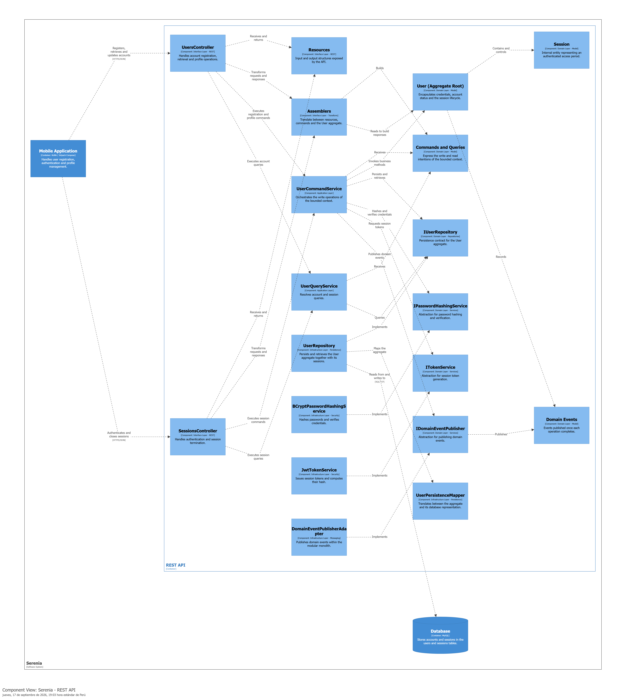
   <i>Imagen X. Component Diagram del Bounded Context Identity and Access.</i>

#### 2.6.1.6. Bounded Context Software Architecture Code Level Diagrams

En esta sección se presentan los diagramas de mayor nivel de detalle sobre la implementación del bounded context Identity & Access. Se incluye el diagrama de clases de la capa Domain y el diagrama de diseño de base de datos correspondiente a las tablas que dan persistencia al aggregate.

##### 2.6.1.6.1. Bounded Context Domain Layer Class Diagrams

El diagrama de clases representa la capa Domain del bounded context Identity & Access, elaborado con la herramienta UML correspondiente. En él se muestran las clases, interfaces y enumeraciones del dominio junto con sus atributos, métodos y el scope de cada miembro.

El elemento central es `User`, el aggregate root del contexto. Sus atributos son privados y solo se modifican a través de sus métodos públicos, lo que garantiza que ninguna regla de identidad pueda vulnerarse desde fuera del aggregate. `User` mantiene una relación de composición con `Session`, con multiplicidad 1 a 0..*: una cuenta puede tener varias sesiones a lo largo del tiempo y ninguna sesión existe de forma independiente de la cuenta que la originó. Por ello, la apertura y la revocación de sesiones se realizan mediante los métodos `openSession` y `closeSession` del aggregate, y no sobre la entidad directamente.

Los value objects aparecen relacionados con `User` y con `Session` por composición, cada uno con multiplicidad 1, salvo aquellos que corresponden a datos opcionales de la cuenta. Estos tipos encapsulan las validaciones de formato y evitan la obsesión por primitivos: el dominio nunca maneja un correo, una contraseña o un token como cadenas simples. Las enumeraciones `UserRole` y `AccountStatus` se asocian también a `User` con multiplicidad 1, y expresan respectivamente el rol inmutable definido en el registro y el estado del ciclo de vida de la cuenta.

El diagrama incluye además los Commands y Queries que expresan las intenciones de escritura y lectura del contexto, y los Domain Events que el aggregate registra al completarse cada operación. Finalmente se muestran las abstracciones declaradas por el dominio: `IUserRepository`, que define el contrato de persistencia del aggregate; `IUserCommandService` e `IUserQueryService`, que definen las operaciones de escritura y lectura; e `IPasswordHashingService`, `ITokenService` e `IDomainEventPublisher`, que aíslan al dominio de los mecanismos técnicos de cifrado, emisión de tokens y publicación de eventos. Ninguna de estas interfaces depende de las capas superiores, de modo que las dependencias apuntan siempre hacia el dominio.

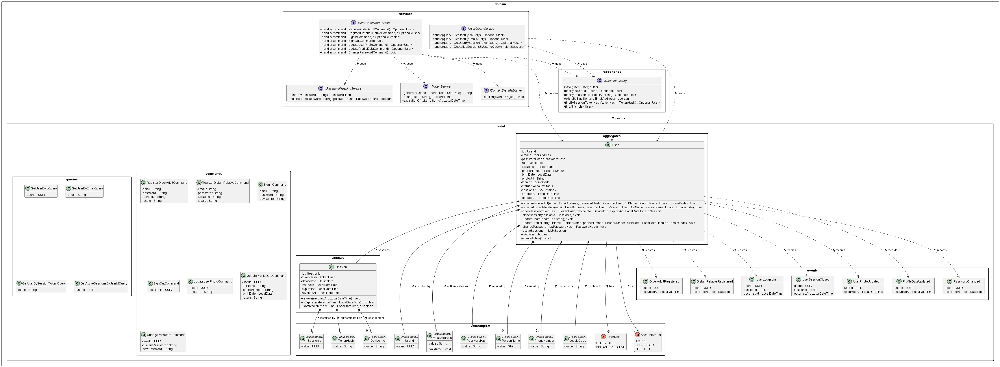
   <i>Imagen X. Domain Layer Class Diagram del Bounded Context Identity and Access.</i>

 

##### 2.6.1.6.2. Bounded Context Database Design Diagram

El diagrama de base de datos presenta los objetos que permiten la persistencia del bounded context Identity & Access sobre el motor MySQL. El contexto se materializa en dos tablas, `users` y `sessions`, que corresponden respectivamente al aggregate root `User` y a la entidad `Session` que este contiene.

**Tabla `users`**

| Columna | Tipo | Constraints | Descripción |
| --- | --- | --- | --- |
| id | uuid | PK | Identificador único de la cuenta. |
| email | varchar(160) | NOT NULL, UNIQUE | Correo electrónico con el que el usuario inicia sesión. |
| password_hash | varchar(255) | NOT NULL | Contraseña cifrada de la cuenta. |
| role | user_role | NOT NULL | Rol del usuario: adulto mayor o familiar a distancia. |
| full_name | varchar(120) | NOT NULL | Nombre completo del usuario. |
| phone_number | varchar(20) | — | Número de contacto del usuario. |
| birth_date | date | — | Fecha de nacimiento del usuario. |
| photo_url | varchar(500) | — | Ubicación de la fotografía de perfil del usuario. |
| locale | varchar(10) | NOT NULL, DEFAULT 'es_419' | Idioma y región de la interfaz. |
| status | account_status | NOT NULL, DEFAULT 'ACTIVE' | Estado de la cuenta: activa, suspendida o eliminada. |
| created_at | timestamp | NOT NULL | Fecha y hora de creación de la cuenta. |
| updated_at | timestamp | NOT NULL | Fecha y hora de la última modificación. |

La tabla incluye un índice único sobre `email`, que garantiza a nivel de base de datos la regla de unicidad de cuentas, y un índice sobre `role`, que optimiza las consultas que filtran usuarios según el tipo de aplicación a la que acceden.

**Tabla `sessions`**

| Columna | Tipo | Constraints | Descripción |
| --- | --- | --- | --- |
| id | uuid | PK | Identificador único de la sesión. |
| user_id | uuid | NOT NULL, FK → users.id | Cuenta a la que pertenece la sesión. |
| token_hash | varchar(255) | NOT NULL | Token de sesión cifrado entregado al cliente. |
| device_info | varchar(200) | — | Descripción del dispositivo desde el que se inició la sesión. |
| issued_at | timestamp | NOT NULL | Fecha y hora de emisión del token. |
| expires_at | timestamp | NOT NULL | Fecha y hora en que el token deja de ser válido. |
| revoked_at | timestamp | — | Fecha y hora del cierre de sesión, si este ocurrió. |

La tabla cuenta con un índice sobre `user_id`, que soporta la consulta de las sesiones vigentes de una cuenta.

**Relación entre tablas**

Existe una relación de uno a muchos entre `users` y `sessions`: una cuenta puede tener cero o varias sesiones registradas, mientras que toda sesión pertenece obligatoriamente a una única cuenta. Esta relación se implementa mediante la clave foránea `sessions.user_id`, que referencia a `users.id` y que refleja en la base de datos la composición definida en el modelo de dominio entre el aggregate `User` y la entidad `Session`.

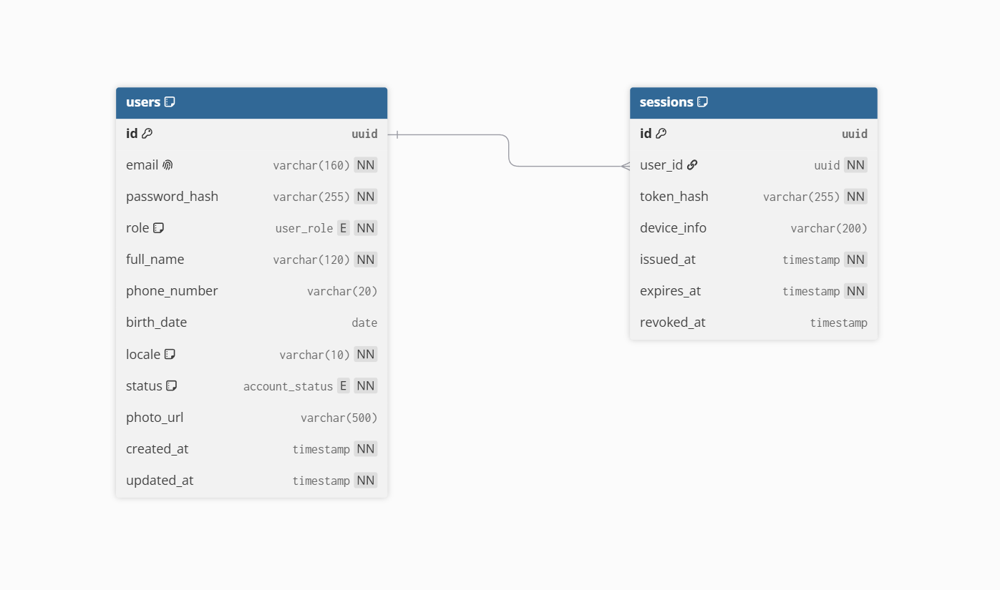
   <i>Imagen X. Database Design Diagram del Bounded Context Identity and Access.</i>

 

### 2.6.2. Bounded Context: Care Circle

 

#### 2.6.2.1. Domain Layer

 

#### 2.6.2.2. Interface Layer
Clases que exponen el bounded context hacia el exterior y traducen las peticiones entrantes al lenguaje del dominio.

**Sub-capa Rest - Controllers**

| **Nombre** | **Endpoints** | **Descripción** |
|---|---|---|
| **CareCirclesController** | POST /care-circles   GET /care-circles/{id} | Punto de entrada para la creación y consulta de un círculo de cuidado. Delega en los servicios de comandos y consultas correspondientes. |
| **FamilyLinksController** | POST /care-circles/{id}/invitation-code   POST /family-links/redeem   DELETE /care-circles/{id}/family-links/{userId} | Punto de entrada para generar códigos de invitación, establecer vínculos familiares mediante el canje de invitaciones y revocar vínculos existentes. |
| **CareShiftsController** | POST /care-circles/{id}/shifts   PUT /care-circles/{id}/shifts/{shiftId} | Punto de entrada para la asignación y reasignación de turnos de cuidado dentro de un Care Circle. |
| **SharedNotesController** | POST /care-circles/{id}/shared-notes  PUT /care-circles/{id}/shared-notes/{noteId} | Punto de entrada para crear y editar notas compartidas entre los miembros del Care Circle. |

**Sub-capa Rest - Resources**

Los Resources representan los datos que entran o salen de la API, sin exponer directamente las entidades o agregados del dominio.

| **Nombre** | **Descripción** |
|---|---|
| **CreateCareCircleResource** | Datos de entrada necesarios para crear un nuevo Care Circle. |
| **CareCircleResource** | Representación pública de un Care Circle y su información relevante para los usuarios. |
| **GenerateInvitationCodeResource** | Datos necesarios para solicitar la generación de un código de invitación para incorporar un familiar al Care Circle. |
| **InvitationCodeResource** | Representación del código de invitación generado y la información asociada a su vigencia. |
| **RedeemInvitationCodeResource** | Código de invitación enviado por un usuario para solicitar su incorporación al Care Circle. |
| **FamilyLinkResource** | Representación de un vínculo familiar establecido entre un miembro y el Care Circle. |
| **AssignCareShiftResource** | Datos de entrada necesarios para asignar un turno de cuidado a un miembro del Care Circle. |
| **CareShiftResource** | Representación de un turno de cuidado asignado dentro del Care Circle. |
| **ReassignCareShiftResource** | Datos necesarios para modificar el miembro responsable de un turno de cuidado existente. |
| **CreateSharedNoteResource** | Datos de entrada para crear una nota compartida dentro del Care Circle. |
| **SharedNoteResource** | Representación de una nota compartida y sus datos relevantes. |
| **EditSharedNoteResource** | Datos de entrada para modificar el contenido de una nota compartida existente. |

**Sub-Capa Rest - Transform**

| **Nombre** | **Descripción** |
|---|---|
| **CareCircleResourceFromEntityAssembler** | Convierte el aggregate CareCircle en su representación REST. |
| **FamilyLinkResourceFromEntityAssembler** | Convierte la entidad FamilyLink en su representación REST. |
| **CareShiftResourceFromEntityAssembler** | Convierte la entidad CareShift en su representación REST. |
| **SharedNoteResourceFromEntityAssembler** | Convierte la entidad SharedNote en su representación REST. |
| **CreateCareCircleCommandFromResourceAssembler** | Convierte la petición de creación del Care Circle en el comando correspondiente. |
| **GenerateInvitationCodeCommandFromResourceAssembler** | Convierte la petición de generación de código de invitación en el comando correspondiente. |
| **RedeemInvitationCodeCommandFromResourceAssembler** | Convierte el código recibido en el comando para canjear la invitación. |
| **RevokeFamilyLinkCommandFromResourceAssembler** | Convierte la petición de revocación de un vínculo familiar en su comando correspondiente. |
| **AssignCareShiftCommandFromResourceAssembler** | Convierte la petición de asignación de un turno en el comando correspondiente. |
| **ReassignCareShiftCommandFromResourceAssembler** | Convierte la petición de reasignación de un turno en el comando correspondiente. |
| **CreateSharedNoteCommandFromResourceAssembler** | Convierte la petición de creación de una nota compartida en el comando correspondiente. |
| **EditSharedNoteCommandFromResourceAssembler** | Convierte la petición de edición de una nota compartida en el comando correspondiente. |

 

#### 2.6.2.3. Application Layer

Clases que orquestan los flujos del contexto, coordinando los aggregates, los repositorios y la publicación de eventos de dominio.

**Sub-capa Internal - CommandServices**

| **Nombre** | **Responsabilidad principal** | **Relación con otros elementos** |
|---|---|---|
| **CareCircleCommandService** | Ejecuta los comandos del contexto relacionados con la creación y gestión del Care Circle, generación y canje de códigos de invitación, establecimiento y revocación de vínculos familiares, asignación y reasignación de turnos de cuidado, y creación y edición de notas compartidas. Valida las reglas de negocio, invoca los métodos de los aggregates, persiste los cambios y publica los eventos de dominio correspondientes. | Implementa ICareCircleCommandService; usa ICareCircleRepository, IFamilyLinkRepository, ICareShiftRepository, ISharedNoteRepository e IDomainEventPublisher. |

**Sub-capa Internal - QueryServices**

| **Nombre** | **Responsabilidad principal** | **Relación con otros elementos** |
|---|---|---|
| **CareCircleQueryService** | Resuelve las consultas de los Care Circle, sus miembros, vínculos familiares, turnos de cuidado y notas compartidas, devolviendo la información necesaria para las vistas sin modificar el estado del dominio. | Implementa ICareCircleQueryService; usa ICareCircleRepository, IFamilyLinkRepository, ICareShiftRepository e ISharedNoteRepository. |

 

#### 2.6.2.4 Infrastructure Layer

 

#### 2.6.2.5. Bounded Context Software Architecture Component Level Diagrams

 

#### 2.6.2.6. Bounded Context Software Architecture Code Level Diagrams

 

##### 2.6.2.6.1. Bounded Context Domain Layer Class Diagrams

 

##### 2.6.2.6.2. Bounded Context Database Design Diagram

 

### 2.6.3. Bounded Context: Daily Check-in

 

#### 2.6.3.1. Domain Layer

 

#### 2.6.3.2. Interface Layer

 

#### 2.6.3.3. Application Layer

 

#### 2.6.3.4 Infrastructure Layer

 

#### 2.6.3.5. Bounded Context Software Architecture Component Level Diagrams

 

#### 2.6.3.6. Bounded Context Software Architecture Code Level Diagrams

 

##### 2.6.3.6.1. Bounded Context Domain Layer Class Diagrams

 

##### 2.6.3.6.2. Bounded Context Database Design Diagram

 

### 2.6.4. Bounded Context: Wellbeing Monitoring

El bounded context **Wellbeing Monitoring** es responsable de interpretar el historial de check-ins registrados por el módulo **Daily Check-in** para generar un **Wellbeing Insight** del adulto mayor: detectar si existe un patrón de incomodidad sostenido (*Discomfort Pattern Detected*) o una mejora en la tendencia de bienestar (*Wellbeing Trend Improved*), y reaccionar en consecuencia emitiendo una sugerencia de bienestar (*Wellbeing Suggestion*) o registrando un pequeño logro (*Small Win*) para el cuidador a distancia. El diseño táctico presentado a continuación está alineado directamente con los eventos de dominio levantados en la sesión de EventStorming del bounded context (ver imagen).

 

#### 2.6.4.1. Domain Layer

**Sub-capa Model - Aggregates:**

| Tipo | Nombre | Descripción | Responsabilidad Principal | Relación con otros elementos |
|---|---|---|---|---|
| Aggregate | WellbeingInsight | Entidad que representa la interpretación acumulada del bienestar de un adulto mayor, incluyendo el patrón de incomodidad o mejora de tendencia detectado más recientemente | Ser el punto de entrada para evaluar el historial de check-ins y mantener la integridad del estado de bienestar como entidad del dominio | Relacionado con el bounded context Daily Check-in (origen del historial de check-ins) y Alerts and Safety (destino de las sugerencias de bienestar emitidas) |

 

**Sub-capa Model - Commands:**

| Tipo | Nombre | Descripción | Responsabilidad Principal | Relación con otros elementos |
|---|---|---|---|---|
| Command | EvaluateWellbeingPatternCommand | Comando para evaluar el patrón de bienestar de un adulto mayor (evento de dominio *Evaluate Wellbeing Pattern*) | Representar la intención de analizar el historial de check-ins disponible y determinar si corresponde un *Discomfort Pattern Detected* o un *Wellbeing Trend Improved* | Usado en la implementación del servicio de comandos de bienestar |
| Command | IssueWellbeingSuggestionCommand | Comando para emitir una sugerencia de bienestar (evento de dominio *Issue Wellbeing Suggestion*) | Representar la intención de emitir una sugerencia de bienestar cuando `EvaluateWellbeingPatternCommand` detecta un patrón de incomodidad | Usado en la implementación del servicio de comandos de bienestar |
| Command | RecordSmallWinCommand | Comando para registrar un pequeño logro (evento de dominio *Record Small Win*) | Representar la intención de registrar un pequeño logro cuando `EvaluateWellbeingPatternCommand` detecta una mejora en la tendencia de bienestar | Usado en la implementación del servicio de comandos de bienestar |
| Command | DismissWellbeingSuggestionCommand | Comando para descartar una sugerencia de bienestar (evento de dominio *Dismiss Wellbeing Suggestion*) | Representar la intención del cuidador a distancia de descartar una sugerencia de bienestar previamente emitida | Usado en la implementación del servicio de comandos de bienestar |

 

**Sub-capa Model - Queries:**

| Tipo | Nombre | Descripción | Responsabilidad Principal | Relación con otros elementos |
|---|---|---|---|---|
| Query | GetWellbeingInsightByOlderAdultIdQuery | Consulta para obtener el wellbeing insight por identificador del adulto mayor | Representar la intención de obtener el estado de bienestar actual de un adulto mayor específico | Usado en la implementación del servicio de consultas |
| Query | GetWellbeingSuggestionsViewQuery | Consulta para obtener la vista de sugerencias de bienestar (evento de dominio *Wellbeing Suggestions View*) | Representar la intención del cuidador a distancia de visualizar las sugerencias de bienestar vigentes de un adulto mayor | Usado en la implementación del servicio de consultas |
| Query | GetWellbeingTrendHistoryQuery | Consulta para obtener el historial de tendencias de bienestar | Representar la intención de obtener las tendencias calculadas para un adulto mayor en un rango de periodos | Usado en la implementación del servicio de consultas |
| Query | GetAllWellbeingInsightsQuery | Consulta para obtener todos los wellbeing insights | Representar la intención de obtener la lista completa de wellbeing insights registrados | Usado en la implementación del servicio de consultas |

 

**Sub-capa Repositories:**

| Tipo | Nombre | Descripción | Responsabilidad Principal | Relación con otros elementos |
|---|---|---|---|---|
| Interface | IWellbeingInsightRepository | Repositorio para operaciones de persistencia del modelo WellbeingInsight | Definir contratos para operaciones CRUD sobre los wellbeing insights | Implementado en la capa de Infrastructure |

 

**Sub-capa Services:**

| Tipo | Nombre | Descripción | Responsabilidad Principal | Relación con otros elementos |
|---|---|---|---|---|
| Interface | IWellbeingCommandService | Servicio para métodos de comandos de bienestar | Estipular una estructura clara a seguir para operaciones de escritura (evaluación de patrones, emisión de sugerencias, registro de logros) | Usado en la capa "Application" para implementar los métodos dados |
| Interface | IWellbeingQueryService | Servicio para métodos de consulta de bienestar | Estipular una estructura clara a seguir para operaciones de lectura | Usado en la capa "Application" para la implementación de los métodos |

 

#### 2.6.4.2. Interface Layer

**Sub-capa REST - Resources:**

| Tipo | Nombre | Descripción | Responsabilidad Principal | Relación con otros elementos |
|---|---|---|---|---|
| Resource | WellbeingInsightResource | Estructura de datos de wellbeing insight para API | Representar y exponer datos del wellbeing insight de forma accesible y estructurada para el cliente | Usado en controladores para estructurar respuestas de wellbeing insight |
| Resource | WellbeingSuggestionsViewResource | Estructura de datos de la vista de sugerencias de bienestar para API | Representar y exponer las sugerencias de bienestar vigentes de forma accesible para el cliente | Usado en controladores para estructurar la respuesta de `Wellbeing Suggestions View` |
| Resource | WellbeingTrendResource | Estructura de datos de tendencia de bienestar para API | Representar y exponer una tendencia calculada de forma accesible para el cliente | Usado en controladores para estructurar respuestas de historial de tendencias |
| Resource | DismissWellbeingSuggestionResource | Estructura de petición para descartar una sugerencia de bienestar | Representar datos necesarios para identificar y marcar como descartada una sugerencia de bienestar | Usado en controlador para procesar peticiones de descarte |

 

**Sub-capa REST - Transform:**

| Tipo | Nombre | Descripción | Responsabilidad Principal | Relación con otros elementos |
|---|---|---|---|---|
| Assembler | WellbeingInsightResourceFromEntityAssembler | Transformador de entidad WellbeingInsight a WellbeingInsightResource | Convertir la entidad del dominio a su representación REST correspondiente | Usado en controladores para transformar respuestas |
| Assembler | WellbeingSuggestionsViewResourceFromEntityAssembler | Transformador del read model de sugerencias vigentes a WellbeingSuggestionsViewResource | Convertir el read model del dominio a su representación REST correspondiente | Usado en controladores para transformar la respuesta de `Wellbeing Suggestions View` |
| Assembler | WellbeingTrendResourceFromEntityAssembler | Transformador de entidad WellbeingTrend a WellbeingTrendResource | Convertir la entidad del dominio a su representación REST correspondiente | Usado en controladores para transformar respuestas |
| Assembler | DismissWellbeingSuggestionCommandFromResourceAssembler | Transformador de DismissWellbeingSuggestionResource a DismissWellbeingSuggestionCommand | Convertir la petición REST a comando del dominio | Usado en controlador para procesar peticiones de descarte |

 

**Sub-capa ACL - Consumers:**

| Tipo | Nombre | Descripción | Responsabilidad Principal | Relación con otros elementos |
|---|---|---|---|---|
| Consumer | CheckInRecordedConsumer | Consumidor interno del evento de dominio CheckInRecorded | Escuchar, dentro del monolito modular, el evento publicado por el módulo Daily Check-in para desencadenar el `EvaluateWellbeingPatternCommand` correspondiente | Usado como puente entre el bounded context Daily Check-in y Wellbeing Monitoring |

 

#### 2.6.4.3. Application Layer

**Sub-capa Internal - CommandServices:**

| Tipo | Nombre | Descripción | Responsabilidad Principal | Relación con otros elementos |
|---|---|---|---|---|
| CommandHandler | WellbeingCommandService | Implementación de comandos de bienestar | Implementar los métodos para evaluar el patrón de bienestar y publicar los eventos `DiscomfortPatternDetected` o `WellbeingTrendImproved`, emitir sugerencias (`WellbeingSuggestionIssued`), registrar pequeños logros (`SmallWinRecorded`) y descartar sugerencias (`WellbeingSuggestionDismissed`) | Implementa los métodos de la interface IWellbeingCommandService en la capa de "Services" |

 

**Sub-capa Internal - QueryServices:**

| Tipo | Nombre | Descripción | Responsabilidad Principal | Relación con otros elementos |
|---|---|---|---|---|
| QueryHandler | WellbeingQueryService | Implementación de consultas de bienestar | Implementar los métodos para las consultas de wellbeing insights, tendencias y la vista de sugerencias de bienestar | Implementa los métodos de la interface IWellbeingQueryService en la capa de "Services" |

 

#### 2.6.4.4 Infrastructure Layer

**Sub-capa Persistence - Repositories:**

| Tipo | Nombre | Descripción | Responsabilidad Principal | Relación con otros elementos |
|---|---|---|---|---|
| Repository | WellbeingInsightRepository | Repositorio para uso del modelo "WellbeingInsight" | Acceder y manipular datos persistidos de wellbeing insights, sus tendencias, sugerencias y pequeños logros en la base de datos | Usado en la capa "Application" para implementar operaciones CRUD de wellbeing insights |

 

#### 2.6.4.5. Bounded Context Software Architecture Component Level Diagrams

En esta sección se presenta el Component Diagram de C4 Model correspondiente al bounded context Wellbeing Monitoring, elaborado con la herramienta Structurizr. El diagrama muestra la descomposición interna del bounded context en sus clases principales, agrupadas según su rol dentro de la arquitectura: el `WellbeingController` como punto de entrada de las peticiones REST; los *Resources* (`WellbeingInsightResource`, `WellbeingSuggestionsViewResource`, `WellbeingTrendResource`, `DismissWellbeingSuggestionResource`) que estructuran los datos expuestos por la API; los *Assemblers*, encargados de transformar entre resources, commands y la entidad de dominio `WellbeingInsight`; los *Commands* (`EvaluateWellbeingPatternCommand`, `IssueWellbeingSuggestionCommand`, `RecordSmallWinCommand`, `DismissWellbeingSuggestionCommand`) y *Queries* que representan las intenciones de escritura y lectura del bounded context; los servicios `WellbeingCommandService` y `WellbeingQueryService`, que implementan dichas operaciones e implementan a su vez las interfaces `IWellbeingCommandService` e `IWellbeingQueryService`; y finalmente `IWellbeingInsightRepository`, implementado por `WellbeingInsightRepository`, que gestiona la persistencia del agregado. Se incluye además `CheckInRecordedConsumer`, componente que escucha el evento `CheckInRecorded` publicado por el bounded context Daily Check-in para desencadenar la evaluación de un nuevo wellbeing insight.

   <i>Imagen 27. Component Diagram del Bounded Context Wellbeing Monitoring.</i>

 

#### 2.6.4.6. Bounded Context Software Architecture Code Level Diagrams

##### 2.6.4.6.1. Bounded Context Domain Layer Class Diagrams

Diagrama de clases de la capa Domain: En esta imagen se muestran las clases del dominio Wellbeing Monitoring que incluyen `WellbeingInsight` como aggregate root, Commands para las operaciones de evaluación de patrones, emisión de sugerencias y registro de pequeños logros, Queries para las consultas de información de bienestar, e interfaces para los servicios de dominio con sus respectivas implementaciones. El diagrama fue elaborado en PlantUML.

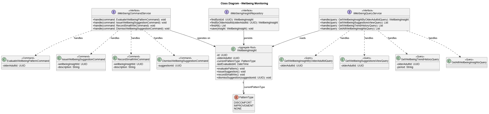
   <i>Imagen 28. Domain Layer Class Diagram del Bounded Context Wellbeing Monitoring.</i>

 

 

##### 2.6.4.6.2. Bounded Context Database Design Diagram

Diagrama de base de datos: En esta imagen se muestra el diseño de las tablas correspondientes al Bounded Context Wellbeing Monitoring, compuesto por `wellbeing_entries` (registro de estado de ánimo asociado a cada check-in), `status_summaries` (resumen diario del estado del adulto mayor), `small_wins` (historial de pequeños logros registrados) y `wellbeing_patterns` (patrones de malestar sostenido o mejora detectados en el historial de check-ins), relacionadas mediante llaves foráneas hacia `users` (Identity & Access) y `check_ins` (Daily Check-in). Los nombres de las columnas siguen la convención de nomenclatura del equipo, prefijando cada campo con el código de 3 letras de su tabla (`wbe`, `sts`, `smw`, `wbp`).

**Tabla `wellbeing_entries`:**

| Nombre | Descripción |
|---|---|
| wbe_id | Identificador único del registro, clave primaria de la tabla (prefijo `wbe` de `wellbeing_entries`). |
| wbe_older_adult_id | Llave foránea hacia `users.id`; identifica al adulto mayor al que pertenece el registro de estado de ánimo. |
| wbe_check_in_id | Llave foránea hacia `check_ins.id`; identifica el check-in del cual se derivó este registro de estado de ánimo. |
| wbe_mood | Nivel de ánimo reportado en el check-in (VERY_LOW, LOW, NEUTRAL, GOOD, VERY_GOOD). |
| wbe_mood_score | Puntaje numérico asociado al nivel de ánimo reportado. |
| wbe_recorded_at | Fecha y hora en que se registró el estado de ánimo. |

**Tabla `status_summaries`:**

| Nombre | Descripción |
|---|---|
| sts_id | Identificador único del registro, clave primaria de la tabla (prefijo `sts` de `status_summaries`). |
| sts_older_adult_id | Llave foránea hacia `users.id`; identifica al adulto mayor al que pertenece el resumen diario. |
| sts_summary_date | Fecha a la que corresponde el resumen de estado. |
| sts_mood | Estado de ánimo predominante del día resumido. |
| sts_has_answered | Indica si el adulto mayor respondió su check-in ese día. |
| sts_highlight | Dato destacado del día, mostrado al cuidador a distancia. |
| sts_generated_at | Fecha y hora en que se generó el resumen. |

**Tabla `small_wins`:**

| Nombre | Descripción |
|---|---|
| smw_id | Identificador único del registro, clave primaria de la tabla (prefijo `smw` de `small_wins`). |
| smw_older_adult_id | Llave foránea hacia `users.id`; identifica al adulto mayor al que pertenece el pequeño logro registrado. |
| smw_check_in_id | Llave foránea hacia `check_ins.id`; identifica el check-in del cual se derivó el pequeño logro, cuando aplica. |
| smw_description | Descripción del pequeño logro, generada a partir de una mejora detectada en el patrón de bienestar. |
| smw_recorded_at | Fecha y hora en que se registró el pequeño logro. |

**Tabla `wellbeing_patterns`:**

| Nombre | Descripción |
|---|---|
| wbp_id | Identificador único del registro, clave primaria de la tabla (prefijo `wbp` de `wellbeing_patterns`). |
| wbp_older_adult_id | Llave foránea hacia `users.id`; identifica al adulto mayor al que pertenece el patrón detectado. |
| wbp_type | Tipo de patrón detectado en el historial de check-ins (SUSTAINED_DISCOMFORT, IMPROVEMENT). |
| wbp_consecutive_days | Cantidad de días consecutivos que sostienen el patrón detectado. |
| wbp_start_date | Fecha de inicio del periodo en que se detectó el patrón. |
| wbp_end_date | Fecha de fin del periodo en que se detectó el patrón. |
| wbp_detected_at | Fecha y hora en que se detectó el patrón. |

 

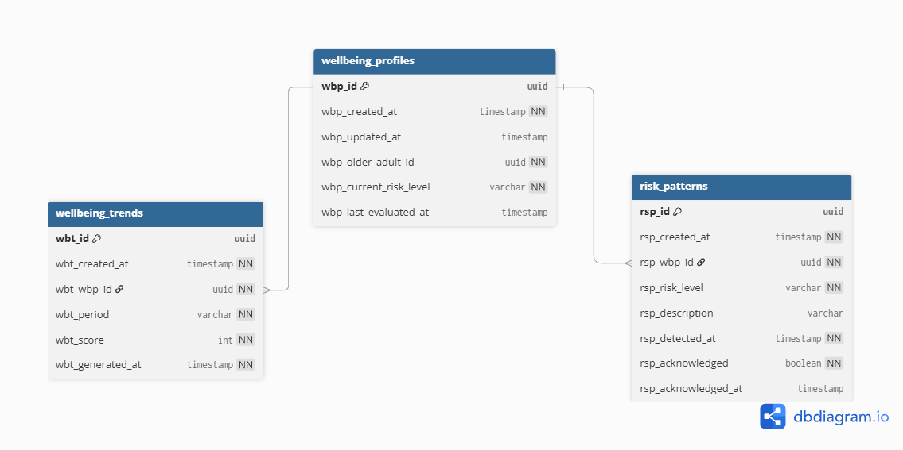
   <i>Imagen 29. Database Design Diagram del Bounded Context Wellbeing Monitoring.</i>

 

### 2.6.5. Bounded Context: Social Companionship

 

#### 2.6.5.1. Domain Layer

 

#### 2.6.5.2. Interface Layer

 

#### 2.6.5.3. Application Layer

 

#### 2.6.5.4 Infrastructure Layer

 

#### 2.6.5.5. Bounded Context Software Architecture Component Level Diagrams

 

#### 2.6.5.6. Bounded Context Software Architecture Code Level Diagrams

 

##### 2.6.5.6.1. Bounded Context Domain Layer Class Diagrams

 

##### 2.6.5.6.2. Bounded Context Database Design Diagram

 

### 2.6.6. Bounded Context: Alerts & Safety

El bounded context **Alerts and Safety** es responsable de garantizar que el familiar a distancia sea informado cuando la situación del adulto mayor lo amerite: ante una emergencia declarada explícitamente por el propio adulto mayor, ante una ausencia prolongada de respuesta al check-in diario, o ante un patrón sostenido de malestar detectado por **Wellbeing Monitoring**. A continuación se presenta el diseño táctico propuesto por el equipo para este bounded context, aplicando Domain-Driven Design, alineado con el diagrama de base de datos consolidado del equipo.

 

#### 2.6.6.1. Domain Layer

**Sub-capa Model - Aggregates:**

| Tipo | Nombre | Descripción | Responsabilidad Principal | Relación con otros elementos |
|---|---|---|---|---|
| Aggregate | Alert | Entidad que representa un incidente crítico generado por el botón de auxilio, por inactividad sostenida o por un patrón de bienestar negativo | Mantener el ciclo de vida del incidente (apertura, notificación, atención y cierre), clasificando su tipo y severidad | Relacionado con Wellbeing Monitoring (origen del patrón cuando el tipo es WELLBEING) y con InactivityWindow (origen cuando el tipo es INACTIVITY) |
| Entity | AlertNotification | Entidad que registra el envío de una notificación push de un Alert a un familiar vinculado específico | Trazar el estado de entrega de la notificación por cada familiar y canal | Pertenece al aggregate Alert; se crea una por cada familiar vinculado notificado |
| Entity | AlertAttention | Entidad que registra la confirmación de atención de un Alert por parte de un familiar | Guardar quién atendió el incidente, cuándo y con qué nota de resolución | Pertenece al aggregate Alert |
| Aggregate | InactivityWindow | Entidad que representa el plazo de espera entre un check-in no respondido y la eventual escalación a un Alert | Registrar la apertura de la ventana, el envío del recordatorio de contacto y, de vencer sin respuesta, marcar la escalación | Relacionado con el bounded context Daily Check-in (origen del check-in no respondido) y con Alert (destino cuando la ventana escala) |

 

**Sub-capa Model - Commands:**

| Tipo | Nombre | Descripción | Responsabilidad Principal | Relación con otros elementos |
|---|---|---|---|---|
| Command | TriggerEmergencyAlertCommand | Comando para registrar la activación del botón de auxilio | Representar la intención del adulto mayor de solicitar ayuda inmediata, creando un Alert de tipo EMERGENCY solo si existen familiares vinculados registrados localmente | Usado en la implementación del servicio de comandos de alertas |
| Command | OpenInactivityWindowCommand | Comando para abrir una ventana de inactividad | Representar la intención de iniciar el plazo de espera tras un check-in no respondido | Ejecutado por el consumer del evento `UnansweredCheckIn` de Daily Check-in |
| Command | SendInactivityReminderCommand | Comando para enviar un recordatorio de contacto al adulto mayor | Representar la intención de notificarlo antes de que la ventana de inactividad expire | Usado en la implementación del servicio de comandos de alertas |
| Command | CloseInactivityWindowCommand | Comando para cerrar una ventana de inactividad sin escalamiento | Representar la intención de finalizar la ventana cuando el adulto mayor retoma actividad antes de que expire | Usado en la implementación del servicio de comandos de alertas |
| Command | EscalateInactivityWindowCommand | Comando para escalar una ventana de inactividad vencida | Representar la intención de convertir la inactividad no atendida en un Alert de tipo INACTIVITY | Ejecutado automáticamente por una policy tras vencer la ventana sin respuesta al recordatorio |
| Command | RaiseWellbeingAlertCommand | Comando para generar un Alert a partir de un patrón de malestar | Representar la intención de clasificar la severidad del patrón notificado por Wellbeing Monitoring y crear un Alert de tipo WELLBEING | Ejecutado por el consumer del evento `DiscomfortPatternDetected` de Wellbeing Monitoring |
| Command | NotifyLinkedRelativesCommand | Comando para notificar un Alert a los familiares vinculados | Representar la intención de crear una AlertNotification por cada familiar vinculado y cambiar el estado del Alert a NOTIFIED | Ejecutado automáticamente por una policy tras la creación de cualquier Alert |
| Command | ConfirmAlertAttentionCommand | Comando para registrar la atención de un Alert | Representar la intención del familiar de confirmar que atendió el incidente, creando una AlertAttention y cambiando el estado del Alert a ATTENDED | Usado en la implementación del servicio de comandos de alertas |
| Command | CloseAlertCommand | Comando para cerrar un Alert atendido | Representar la intención del familiar de marcar el incidente como resuelto | Usado en la implementación del servicio de comandos de alertas |

 

**Sub-capa Model - Queries:**

| Tipo | Nombre | Descripción | Responsabilidad Principal | Relación con otros elementos |
|---|---|---|---|---|
| Query | GetAlertByIdQuery | Consulta para obtener un Alert por su identificador | Representar la intención de obtener el detalle de un incidente específico | Usado en la implementación del servicio de consultas |
| Query | GetAlertsByOlderAdultIdQuery | Consulta para obtener los Alerts de un adulto mayor | Representar la intención de listar el historial completo de incidentes (emergencia, inactividad y bienestar) asociado a un adulto mayor | Usado en la implementación del servicio de consultas |
| Query | GetActiveAlertsByOlderAdultIdQuery | Consulta para obtener los Alerts activos de un adulto mayor | Representar la intención de listar únicamente los incidentes que aún no han sido cerrados | Usado en la implementación del servicio de consultas |

 

**Sub-capa Repositories:**

| Tipo | Nombre | Descripción | Responsabilidad Principal | Relación con otros elementos |
|---|---|---|---|---|
| Interface | IAlertRepository | Repositorio para operaciones de persistencia del modelo Alert, incluyendo sus entidades AlertNotification y AlertAttention | Definir contratos para operaciones CRUD sobre los incidentes | Implementado en la capa de Infrastructure |
| Interface | IInactivityWindowRepository | Repositorio para operaciones de persistencia del modelo InactivityWindow | Definir contratos para operaciones CRUD sobre las ventanas de inactividad | Implementado en la capa de Infrastructure |

 

**Sub-capa Services:**

| Tipo | Nombre | Descripción | Responsabilidad Principal | Relación con otros elementos |
|---|---|---|---|---|
| Interface | IAlertCommandService | Servicio para métodos de comandos de alertas | Estipular una estructura clara a seguir para operaciones de escritura sobre incidentes y ventanas de inactividad | Usado en la capa "Application" para implementar los métodos dados |
| Interface | IAlertQueryService | Servicio para métodos de consulta de alertas | Estipular una estructura clara a seguir para operaciones de lectura | Usado en la capa "Application" para la implementación de los métodos |

 

#### 2.6.6.2. Interface Layer

**Sub-capa REST - Resources:**

| Tipo | Nombre | Descripción | Responsabilidad Principal | Relación con otros elementos |
|---|---|---|---|---|
| Resource | AlertResource | Estructura de datos de un Alert para API | Representar y exponer datos de un incidente (emergencia, inactividad o bienestar) de forma accesible y estructurada para el cliente | Usado en controladores para estructurar respuestas de alertas |
| Resource | TriggerEmergencyAlertResource | Estructura de petición para activar una emergencia | Representar datos de entrada necesarios para solicitar la activación del botón de auxilio | Usado en controlador para procesar peticiones de activación |
| Resource | ConfirmAlertAttentionResource | Estructura de petición para confirmar la atención de un Alert | Representar datos necesarios para identificar el Alert y registrar la nota de resolución | Usado en controlador para procesar peticiones de confirmación |

 

**Sub-capa REST - Transform:**

| Tipo | Nombre | Descripción | Responsabilidad Principal | Relación con otros elementos |
|---|---|---|---|---|
| Assembler | AlertResourceFromEntityAssembler | Transformador de entidad Alert a AlertResource | Convertir la entidad del dominio a su representación REST correspondiente | Usado en controladores para transformar respuestas |
| Assembler | TriggerEmergencyAlertCommandFromResourceAssembler | Transformador de TriggerEmergencyAlertResource a TriggerEmergencyAlertCommand | Convertir la petición REST a comando del dominio | Usado en controlador para procesar peticiones de activación |
| Assembler | ConfirmAlertAttentionCommandFromResourceAssembler | Transformador de ConfirmAlertAttentionResource a ConfirmAlertAttentionCommand | Convertir la petición REST a comando del dominio | Usado en controlador para procesar peticiones de confirmación |

 

**Sub-capa ACL - Consumers:**

| Tipo | Nombre | Descripción | Responsabilidad Principal | Relación con otros elementos |
|---|---|---|---|---|
| Consumer | UnansweredCheckInConsumer | Consumidor interno del evento de dominio UnansweredCheckIn | Escuchar, dentro del monolito modular, el evento publicado por el módulo Daily Check-in para desencadenar el `OpenInactivityWindowCommand` correspondiente | Usado como puente entre el bounded context Daily Check-in y Alerts and Safety |
| Consumer | DiscomfortPatternDetectedConsumer | Consumidor interno del evento de dominio DiscomfortPatternDetected | Escuchar, dentro del monolito modular, el evento publicado por el módulo Wellbeing Monitoring para desencadenar el `RaiseWellbeingAlertCommand` correspondiente | Usado como puente entre el bounded context Wellbeing Monitoring y Alerts and Safety |
| Consumer | FamilyLinkEstablishedConsumer | Consumidor interno del evento de dominio FamilyLinkEstablished | Mantener localmente la referencia de familiares vinculados a cada adulto mayor, disponible por propagación desde Care Circle sin requerir consulta síncrona al momento de notificar un Alert | Usado como puente entre el bounded context Care Circle y Alerts and Safety |

 

#### 2.6.6.3. Application Layer

**Sub-capa Internal - CommandServices:**

| Tipo | Nombre | Descripción | Responsabilidad Principal | Relación con otros elementos |
|---|---|---|---|---|
| CommandHandler | AlertCommandService | Implementación de comandos de alertas | Implementar los métodos para abrir, recordar, escalar y cerrar ventanas de inactividad, así como para activar, notificar, confirmar y cerrar Alerts, publicando los eventos de dominio correspondientes | Implementa los métodos de la interface IAlertCommandService en la capa de "Services" |

 

**Sub-capa Internal - QueryServices:**

| Tipo | Nombre | Descripción | Responsabilidad Principal | Relación con otros elementos |
|---|---|---|---|---|
| QueryHandler | AlertQueryService | Implementación de consultas de alertas | Implementar los métodos para las consultas de Alerts por identificador, por adulto mayor y por estado activo | Implementa los métodos de la interface IAlertQueryService en la capa de "Services" |

 

#### 2.6.6.4 Infrastructure Layer

**Sub-capa Persistence - Repositories:**

| Tipo | Nombre | Descripción | Responsabilidad Principal | Relación con otros elementos |
|---|---|---|---|---|
| Repository | AlertRepository | Repositorio para uso del modelo "Alert" | Acceder y manipular datos persistidos de alertas, notificaciones y atenciones en la base de datos | Usado en la capa "Application" para implementar operaciones CRUD de Alerts |
| Repository | InactivityWindowRepository | Repositorio para uso del modelo "InactivityWindow" | Acceder y manipular datos persistidos de ventanas de inactividad en la base de datos | Usado en la capa "Application" para implementar operaciones CRUD de ventanas de inactividad |

 

#### 2.6.6.5. Bounded Context Software Architecture Component Level Diagrams

En esta sección se presenta el Component Diagram de C4 Model correspondiente al bounded context Alerts and Safety, elaborado con la herramienta Structurizr. El diagrama muestra la descomposición interna del bounded context en sus clases principales, agrupadas según su rol dentro de la arquitectura: el `AlertController` como punto de entrada de las peticiones REST; los *Resources* (`AlertResource`, `TriggerEmergencyAlertResource`, `ConfirmAlertAttentionResource`) que estructuran los datos expuestos por la API; los *Assemblers*, encargados de transformar entre resources, commands y la entidad de dominio `Alert`; los *Commands* y *Queries* que representan las intenciones de escritura y lectura del bounded context; los servicios `AlertCommandService` y `AlertQueryService`, que implementan dichas operaciones e implementan a su vez las interfaces `IAlertCommandService` e `IAlertQueryService`; y finalmente `IAlertRepository` e `IInactivityWindowRepository`, implementados por sus respectivos repositorios concretos, que gestionan la persistencia de los dos aggregates. Se incluye además `UnansweredCheckInConsumer`, `DiscomfortPatternDetectedConsumer` y `FamilyLinkEstablishedConsumer`, componentes que escuchan los eventos `UnansweredCheckIn` (publicado por Daily Check-in), `DiscomfortPatternDetected` (publicado por Wellbeing Monitoring) y `FamilyLinkEstablished` (publicado por Care Circle), respectivamente, para desencadenar la apertura de la ventana de inactividad, la generación de un Alert de tipo WELLBEING y el mantenimiento local de la referencia de familiares vinculados, esta última sin requerir consulta síncrona a Care Circle al momento de notificar un Alert.

 

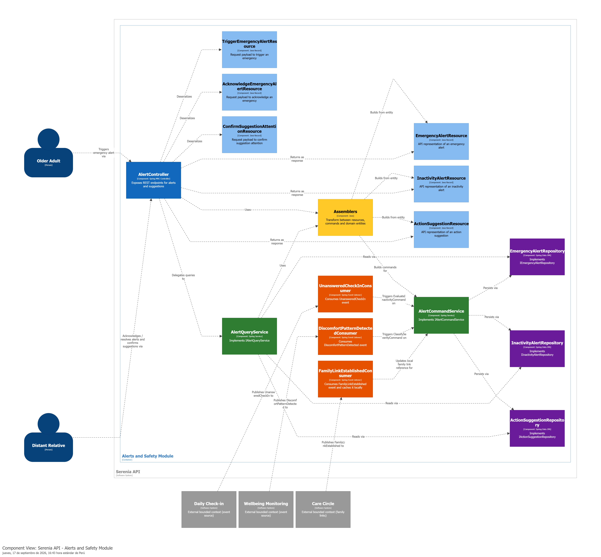
   <i>Imagen X. Component Diagram del Bounded Context Alerts and Safety.</i>

 

#### 2.6.6.6. Bounded Context Software Architecture Code Level Diagrams

 

##### 2.6.6.6.1. Bounded Context Domain Layer Class Diagrams

Diagrama de clases de la capa Domain: en esta imagen se muestran las clases del dominio Alerts and Safety, que incluyen `Alert` (con sus entidades internas `AlertNotification` y `AlertAttention`) e `InactivityWindow` como aggregate roots, los Commands para las operaciones de activación, apertura, recordatorio, escalamiento, notificación, confirmación y cierre, las Queries para las consultas de historial por adulto mayor, e interfaces para los servicios de dominio con sus respectivas implementaciones.

 

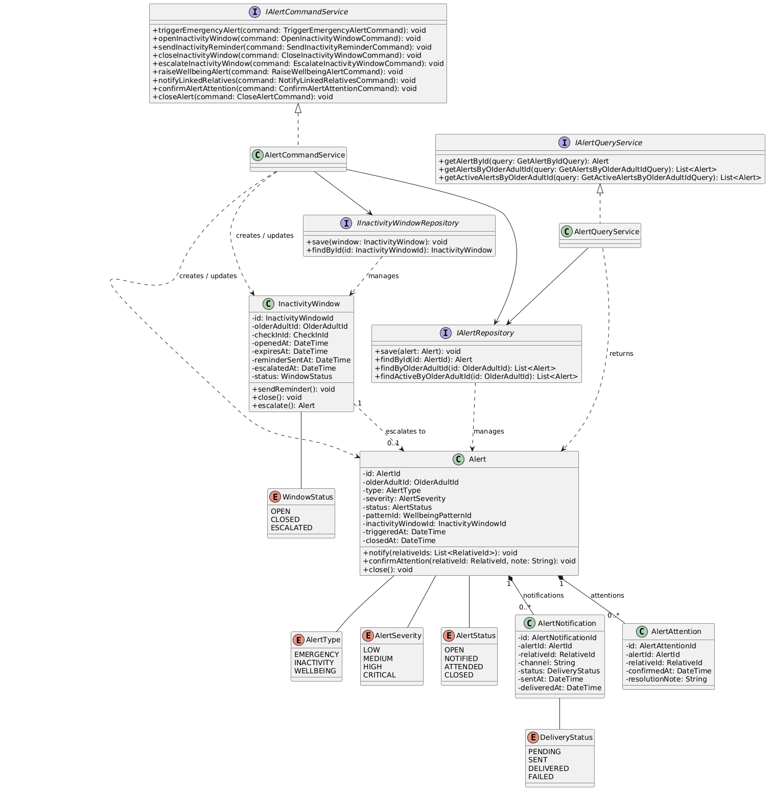
   <i>Imagen X. Domain Layer Class Diagram del Bounded Context Alerts and Safety.</i>

 

##### 2.6.6.6.2. Bounded Context Database Design Diagram

A continuación se presentan las tablas del bounded context Alerts and Safety, a partir del diagrama de base de datos consolidado por el equipo:

- **inactivity_windows:** Temporizadores que miden el silencio antes de escalar a una alarma real. Atributos: `id`, `older_adult_id`, `check_in_id`, `opened_at`, `expires_at`, `reminder_sent_at`, `escalated_at`, `status`.
- **alerts:** Incidentes críticos generados por el botón de pánico, inactividad o patrones negativos. Atributos: `id`, `older_adult_id`, `type`, `severity`, `status`, `pattern_id`, `inactivity_window_id`, `triggered_at`, `closed_at`.
- **alert_notifications:** Trazabilidad de la entrega de notificaciones push para cada alerta. Atributos: `id`, `alert_id`, `relative_id`, `channel`, `status`, `sent_at`, `delivered_at`.
- **alert_attentions:** Registro de resolución para saber qué familiar atendió la crisis. Atributos: `id`, `alert_id`, `relative_id`, `confirmed_at`, `resolution_note`.

 

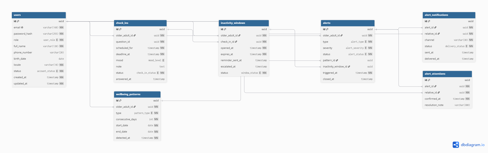
   <i>Imagen X. Database Design Diagram del Bounded Context Alerts and Safety.</i>

 

# Conclusiones
## Conclusiones y Recomendaciones

 

# Glosario

- **ACL (Anti-Corruption Layer):** Capa de traducción que aísla el modelo de dominio de los modelos externos (DTOs de red o de base de datos local), evitando que estructuras ajenas al negocio contaminen las capas superiores.
- **Aggregate root:** Entidad raíz dentro de un bounded context que controla la consistencia interna del conjunto de objetos que agrupa; ninguna entidad interna debe modificarse sin pasar por ella.
- **Big Picture Event Storming:** Técnica colaborativa de exploración de dominio en la que el equipo mapea eventos significativos del negocio y sus relaciones para obtener una visión general de alto nivel.
- **Bounded Context:** Límite explícito dentro del cual un modelo de dominio y su lenguaje ubicuo tienen un significado consistente y sin ambigüedad.
- **Clean Architecture:** Estilo arquitectónico que organiza el código en capas concéntricas (dominio, aplicación, infraestructura, presentación) donde las dependencias siempre apuntan hacia el núcleo del negocio.
- **Dependency Injection (DI):** Patrón mediante el cual las dependencias de un objeto se proveen externamente en lugar de ser instanciadas internamente, facilitando pruebas y desacoplamiento.
- **Design Thinking:** Metodología centrada en el usuario que guía el proceso de identificación de necesidades y generación de soluciones a través de fases de empatía, definición, ideación, prototipado y validación.
- **Domain layer:** Capa central de la arquitectura que contiene las reglas de negocio puras, sin dependencias de frameworks externos.
- **DTO (Data Transfer Object):** Estructura de datos usada para transportar información entre capas o servicios, sin lógica de negocio.
- **Empathy Map:** Artefacto visual que organiza las observaciones del equipo sobre un User Persona (qué dice, piensa, siente, hace) para identificar necesidades y puntos de dolor.
- **i18n (Internationalization):** Práctica de diseñar una aplicación para que pueda adaptarse a distintos idiomas y regiones sin cambios estructurales en el código.
- **Jetpack Compose:** Framework declarativo de UI para Android usado en la capa de presentación para construir pantallas y componentes reutilizables.
- **Kotlin Multiplatform (KMP):** Tecnología que permite compartir código Kotlin entre distintas plataformas (Android e iOS), usada para la app complementaria de familiares.
- **Needfinding:** Fase del proceso de Design Thinking dedicada a la investigación y análisis de las necesidades reales de los usuarios mediante entrevistas y artefactos de análisis.
- **Product Backlog:** Lista priorizada de funcionalidades, historias de usuario y mejoras pendientes de un proyecto.
- **Repository (interfaz):** Contrato que define las operaciones de lectura/escritura sobre entidades del dominio, sin exponer detalles de la implementación.
- **Retrofit:** Librería de Android para consumir servicios web REST, usada en la capa de infraestructura para las llamadas de red.
- **Sprint:** Ciclo de tiempo fijo en el que un equipo Scrum desarrolla un incremento de producto.
- **Use Case / Interactor:** Componente de la capa de aplicación que representa una acción específica del usuario, orquestando las reglas del dominio para cumplirla.
- **User Journey Map:** Representación visual del recorrido end-to-end de un usuario al interactuar con un producto o servicio.
- **User Persona:** Arquetipo ficticio que representa a un segmento de usuarios, construido a partir de datos demográficos, conductuales y de entrevistas.
- **Value Object:** Tipo inmutable que encapsula validaciones y no tiene identidad propia; dos instancias con los mismos valores se consideran iguales.
- **ViewModel:** Componente de la capa de presentación que captura interacciones del usuario, invoca casos de uso y expone el estado de la UI de forma inmutable.

 

# Bibliografía

> Agencia Andina. (2025, 26 de marzo). *INEI: En Lima Metropolitana, uno de cada cuatro adulto mayor vive solo*. Andina. https://andina.pe/agencia/noticia-inei-lima-metropolitana-uno-cada-cuatro-adulto-mayor-vive-solo-1023716.aspx

> Banco Interamericano de Desarrollo. (2024). *Cuidadoras de personas mayores: sobrecargadas y mal pagadas. Evidencia de una encuesta del Banco Interamericano de Desarrollo en América Latina y el Caribe* (Versión 1). https://publications.iadb.org/publications/spanish/document/Cuidadoras-de-personas-mayores-sobrecargadas-y-mal-pagadas-evidencia-de-una-encuesta-del-Banco-Interamericano-de-Desarrollo-en-America-Latina-y-el-Caribe.-Version-1-junio-2024.pdf

> Carrasco Freitas, M. (2026, 29 de mayo). Lima es el principal destino migratorio: más de 3 millones de peruanos llegaron desde otras regiones, según Censo 2025. Infobae. https://www.infobae.com/peru/2026/05/29/lima-es-el-principal-destrino-migratorio-mas-de-3-millones-de-peruanos-llegaron-desde-otras-regiones-segun-censo-2025/

> Gothelf, J., & Seiden, J. (2021). *Lean UX: Designing great products with agile teams* (3rd ed.). O'Reilly Media. https://www.oreilly.com/library/view/lean-ux-3rd/9781098116293/

> Infobae. (2025, 31 de diciembre). *Las familias peruanas con adultos mayores en el hogar creció en el tercer trimestre de 2025*. Infobae Perú. https://www.infobae.com/peru/2025/12/31/las-familias-peruanas-con-adultos-mayores-en-el-hogar-crecio-en-2025/

> Instituto Nacional de Estadística e Informática. (2025a, 26 de marzo). El 42,0 % de los hogares del país tiene entre sus miembros a un adulto mayor. Gob.pe. https://www.gob.pe/institucion/inei/noticias/1133454-el-42-0-de-los-hogares-

> Instituto Nacional de Estadística e Informática. (2025b). Estadísticas de las tecnologías de información y comunicación en los hogares: informe técnico, enero-febrero-marzo 2025. https://www.inei.gob.pe/media/MenuRecursivo/boletines/informe-tecnico_tecnologiasdelainformacion_ene_feb_mar2025.pdf

> Organismo Supervisor de Inversión Privada en Telecomunicaciones. (2026). Erestel 2025: cada vez más hogares peruanos cuentan con un smartphone. https://www.osiptel.gob.pe/portal-del-usuario/noticias/erestel-2025-cada-vez-m%C3%A1s-hogares-peruanos-cuentan-con-un-smartphone-cu%C3%A1ntos-tienen/

 

# Anexos

URL de la organización (Serenia):  [Organización Serenia](https://github.com/upc-pre-202620-1acc0238-4945-vitalcare)

URL del repositorio (Report):  [Repositorio Reporte](https://github.com/upc-pre-202620-1acc0238-4945-vitalcare/serenia-report)