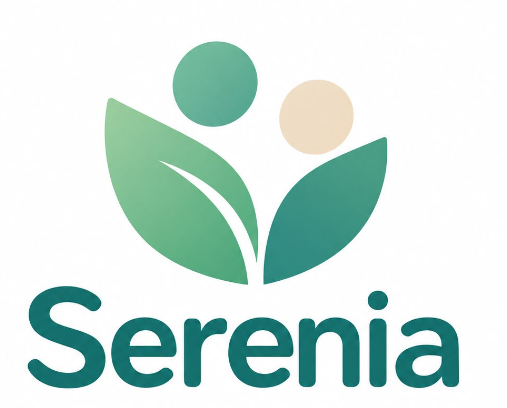
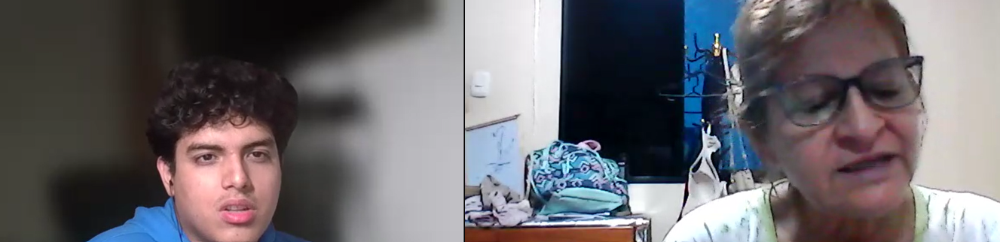
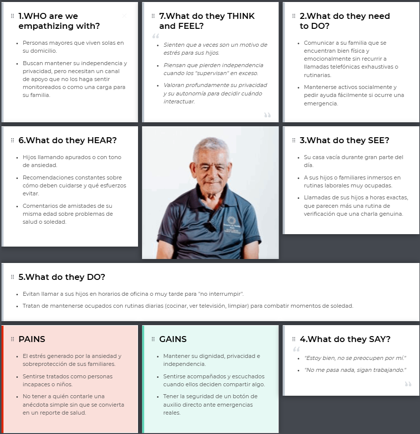
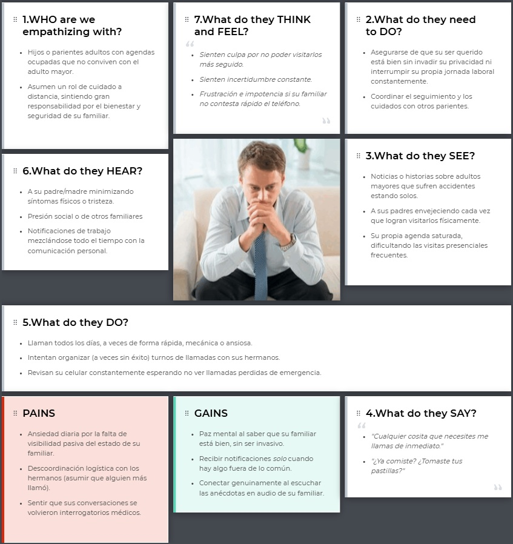

Universidad Peruana de Ciencias Aplicadas

Carrera de Ingeniería de Software

**1ACC0238**

**Aplicaciones para Dispositivos Móviles**

NRC: **4945**

### Informe del Trabajo Final

Docente: **Mayta Guillermo, Jorge Luis**

 

Equipo

**VitalCare**

Proyecto

**Serenia**

 

Integrantes

| Código | Apellidos y Nombres |
|---|---|
| u202414802 | Contreras Torres, Arturo Valentino |
| u202414970 | Gallardo Morales, Carla Alejandra |
| u202012001 | García Paredes, Victor Manuel |
| u202410239 | Salinas Guzman, Brianna Cristina |
| u202418645 | Sandoval Aiquipa, Kelber Yamir |

 

**Período 2026-20**

**Septiembre 2026**

 

---

# Registro de Versiones del Informe

<table>
  <tr>
    <th>Versión</th>
    <th>Fecha</th>
    <th>Autor</th>
    <th>Descripción de modificación</th>
  </tr>

  <tr>
    <td><b>Primera Entrega (AV1)</b></td>
    <td>XX/09/2026</td>
    <td>
      Contreras Torres, Arturo Valentino  
      

      Gallardo Morales, Carla Alejandra  
      

      García Paredes, Victor Manuel  
      

      Salinas Guzman, Brianna Cristina  
      

      Sandoval Aiquipa, Kelber Yamir  
    </td>
    <td>
      Capítulo I: Presentación  
      Capítulo II: Requirements Development and Software Solution Design  
    </td>
  </tr>
  </table>

 

  ---

# Project Report Collaboration Insights

El informe del proyecto fue desarrollado de manera colaborativa por el equipo mediante repositorios de GitHub creados para la gestión del Project Report y de los diferentes componentes del proyecto. Estos repositorios contienen los archivos del informe, diagramas, evidencias, wireframes, mockups y el historial de versiones correspondiente a cada entrega.

URL del repositorio (report): https://github.com/upc-pre-202620-1acc0238-4945-vitalcare/serenia-report  

**Primera Entrega (AV1)**

 

---

# Contenido

## Tabla de Contenidos

- [Registro de Versiones del Informe](#registro-de-versiones-del-informe)
- [Project Report Collaboration Insights](#project-report-collaboration-insights)
- [Contenido](#contenido)
  - [Tabla de Contenidos](#tabla-de-contenidos)
- [Student Outcome](#student-outcome)
- [Objetivos SMART](#objetivos-smart)
- [Capítulo I: Presentación](#capítulo-i-presentación)
  - [1.1. Startup Profile](#11-startup-profile)
    - [1.1.1. Descripción de la Startup](#111-descripción-de-la-startup)
      - [Misión](#misión)
      - [Visión](#visión)
      - [Valores](#valores)
    - [1.1.2. Perfiles de integrantes del equipo](#112-perfiles-de-integrantes-del-equipo)
  - [1.2. Solution Profile](#12-solution-profile)
    - [1.2.1. Antecedentes y problemática](#121-antecedentes-y-problemática)
    - [1.2.2. Lean UX Process](#122-lean-ux-process)
      - [1.2.2.1. Lean UX Problem Statements](#1221-lean-ux-problem-statements)
      - [1.2.2.2. Lean UX Assumptions](#1222-lean-ux-assumptions)
      - [1.2.2.3. Lean UX Hypothesis Statements](#1223-lean-ux-hypothesis-statements)
      - [1.2.2.4. Lean UX Canvas](#1224-lean-ux-canvas)
  - [1.3. Segmentos objetivo](#13-segmentos-objetivo)
      - [Segmento 1: Adultos mayores que viven solos](#segmento-1-adultos-mayores-que-viven-solos)
      - [Segmento 2: Familiares a distancia](#segmento-2-familiares-a-distancia)
- [Capítulo II: Requirements Development and Software Solution Design](#capítulo-ii-requirements-development-and-software-solution-design)
  - [2.1. Competidores](#21-competidores)
    - [2.1.1. Análisis competitivo](#211-análisis-competitivo)
    - [2.1.2. Estrategias y tácticas frente a competidores](#212-estrategias-y-tácticas-frente-a-competidores)
  - [2.2. Entrevistas](#22-entrevistas)
    - [2.2.1. Diseño de entrevistas](#221-diseño-de-entrevistas)
      - [Segmento 1: Adultos mayores que viven solos](#segmento-1-adultos-mayores-que-viven-solos-1)
      - [Segmento 2: Familiares a distancia](#segmento-2-familiares-a-distancia-1)
    - [2.2.2. Registro de entrevistas](#222-registro-de-entrevistas)
    - [2.2.3. Análisis de entrevistas](#223-análisis-de-entrevistas)
  - [2.3. Needfinding](#23-needfinding)
    - [2.3.1. User Personas](#231-user-personas)
    - [2.3.2. User Task Matrix](#232-user-task-matrix)
    - [2.3.3. User Journey Mapping](#233-user-journey-mapping)
    - [2.3.4. Empathy Mapping](#234-empathy-mapping)
    - [2.3.5. Big Picture EventStorming](#235-big-picture-eventstorming)
    - [2.3.6. Ubiquitous Language](#236-ubiquitous-language)
  - [2.4. Requirements specification](#24-requirements-specification)
    - [2.4.1. User Stories](#241-user-stories)
    - [2.4.2. Impact Mapping](#242-impact-mapping)
    - [2.4.3. Product Backlog](#243-product-backlog)
  - [2.5. Strategic-Level Domain-Driven Design](#25-strategic-level-domain-driven-design)
    - [2.5.1. EventStorming](#251-eventstorming)
      - [2.5.1.1. Candidate Context Discovery](#2511-candidate-context-discovery)
      - [2.5.1.2. Domain Message Flows Modeling](#2512-domain-message-flows-modeling)
      - [2.5.1.3. Bounded Context Canvases](#2513-bounded-context-canvases)
    - [2.5.2. Context Mapping](#252-context-mapping)
    - [2.5.3. Software Architecture](#253-software-architecture)
      - [2.5.3.1. Software Architecture Context Level Diagrams](#2531-software-architecture-context-level-diagrams)
      - [2.5.3.2. Software Architecture Container Level Diagrams](#2532-software-architecture-container-level-diagrams)
      - [2.5.3.3. Software Architecture Deployment Diagrams](#2533-software-architecture-deployment-diagrams)
  - [2.6. Tactical-Level Domain-Driven Design](#26-tactical-level-domain-driven-design)
    - [2.6.x. Bounded Context: ](#26x-bounded-context-)
      - [2.6.x.1. Domain Layer](#26x1-domain-layer)
      - [2.6.x.2. Interface Layer](#26x2-interface-layer)
      - [2.6.x.3. Application Layer](#26x3-application-layer)
      - [2.6.x.4 Infrastructure Layer](#26x4-infrastructure-layer)
      - [2.6.x.5. Bounded Context Software Architecture Component Level Diagrams](#26x5-bounded-context-software-architecture-component-level-diagrams)
      - [2.6.x.6. Bounded Context Software Architecture Code Level Diagrams](#26x6-bounded-context-software-architecture-code-level-diagrams)
        - [2.6.x.6.1. Bounded Context Domain Layer Class Diagrams](#26x61-bounded-context-domain-layer-class-diagrams)
        - [2.6.x.6.2. Bounded Context Database Design Diagram](#26x62-bounded-context-database-design-diagram)
- [Capítulo III: Solution UI/UX Design](#capítulo-iii-solution-uiux-design)
  - [3.1. Product design](#31-product-design)
    - [3.1.1. Style Guidelines](#311-style-guidelines)
      - [3.1.1.1. General Style Guidelines](#3111-general-style-guidelines)
    - [3.1.2. Information Architecture](#312-information-architecture)
      - [3.1.2.1. Organization Systems](#3121-organization-systems)
      - [3.1.2.2. Labelling Systems](#3122-labelling-systems)
      - [3.1.2.3. SEO Tags and Meta Tags](#3123-seo-tags-and-meta-tags)
      - [3.1.2.4. Searching Systems](#3124-searching-systems)
      - [3.1.2.5. Navigation Systems](#3125-navigation-systems)
    - [3.1.3. Landing Page UI Design](#313-landing-page-ui-design)
      - [3.1.3.1. Landing Page Wireframe](#3131-landing-page-wireframe)
      - [3.1.3.2. Landing Page Mock-up](#3132-landing-page-mock-up)
    - [3.1.4. Mobile Applications UX/UI Design](#314-mobile-applications-uxui-design)
      - [3.1.4.1. Mobile Applications Wireframes](#3141-mobile-applications-wireframes)
      - [3.1.4.2. Mobile Applications Wireflow Diagrams](#3142-mobile-applications-wireflow-diagrams)
      - [3.1.4.3. Mobile Applications Mock-ups](#3143-mobile-applications-mock-ups)
      - [3.1.4.4. Mobile Applications User Flow Diagrams](#3144-mobile-applications-user-flow-diagrams)
      - [3.1.4.5. Mobile Applications Prototyping](#3145-mobile-applications-prototyping)
- [Capítulo IV: Product Implementation \& Validation](#capítulo-iv-product-implementation--validation)
  - [4. Product Implementation \& Validation](#4-product-implementation--validation)
  - [4.1. Software Configuration Management](#41-software-configuration-management)
    - [4.1.1. Software Development Environment Configuration](#411-software-development-environment-configuration)
    - [4.1.2. Source Code Management](#412-source-code-management)
    - [4.1.3. Source Code Style Guide \& Conventions](#413-source-code-style-guide--conventions)
    - [4.1.4. Software Deployment Configuration](#414-software-deployment-configuration)
  - [4.2. Landing Page \& Mobile Application Implementation](#42-landing-page--mobile-application-implementation)
    - [4.2.1. Sprint n](#421-sprint-n)
      - [4.2.1.1. Sprint Planning n](#4211-sprint-planning-n)
      - [4.2.1.2. Aspect Leaders and Collaborators](#4212-aspect-leaders-and-collaborators)
      - [4.2.1.3. Sprint Backlog n](#4213-sprint-backlog-n)
      - [4.2.1.4. Development Evidence for Sprint Review](#4214-development-evidence-for-sprint-review)
      - [4.2.1.5. Testing Suite Evidence for Sprint Review](#4215-testing-suite-evidence-for-sprint-review)
      - [4.2.1.6. Execution Evidence for Sprint Review](#4216-execution-evidence-for-sprint-review)
      - [4.2.1.7. Services Documentation Evidence for Sprint Review](#4217-services-documentation-evidence-for-sprint-review)
      - [4.2.1.8. Software Deployment Evidence for Sprint Review](#4218-software-deployment-evidence-for-sprint-review)
      - [4.2.1.9. Team Collaboration Insights during Sprint](#4219-team-collaboration-insights-during-sprint)
  - [4.3. Validation Interviews](#43-validation-interviews)
    - [4.3.1. Diseño de Entrevistas](#431-diseño-de-entrevistas)
    - [4.3.2. Registro de Entrevistas](#432-registro-de-entrevistas)
    - [4.3.3. Evaluaciones según heurísticas](#433-evaluaciones-según-heurísticas)
- [Conclusiones](#conclusiones)
  - [Conclusiones y recomendaciones.](#conclusiones-y-recomendaciones)
  - [Video App Validation](#video-app-validation)
  - [Video About the product](#video-about-the-product)
  - [Video About the team](#video-about-the-team)
- [Glosario](#glosario)
- [Bibliografía](#bibliografía)
- [Anexos](#anexos)

 

---

# Student Outcome

El curso contribuye al cumplimiento del Student Outcome ABET:

**ABET – EAC - Student Outcome 7**

**Criterio:** *La capacidad de adquirir y aplicar nuevos conocimientos según sea necesario, utilizando estrategias de aprendizaje apropiadas.*

En el siguiente cuadro se describe las acciones realizadas y enunciados de conclusiones por parte del grupo, que permiten sustentar el haber alcanzado el logro del ABET – EAC - Student Outcome 7.

<table>
  <tr>
    <th>Criterio específico</th>
    <th>Acciones realizadas</th>
    <th>Conclusiones</th>
  </tr>
  <tr>
      <td><b>Actualiza conceptos y conocimientos necesarios para su desarrollo profesional y en especial para su proyecto en soluciones de software.</b></td>
      <td>
            <b>Contreras Torres, Arturo Valentino</b> 
            <u>AV1</u> 
              
            <b>Gallardo Morales, Carla Alejandra</b> 
            <u>AV1</u> 
              
            <b>García Paredes, Victor Manuel</b> 
            <u>AV1</u> 
              
            <b>Salinas Guzman, Brianna Cristina</b> 
            <u>AV1</u> 
              
            <b>Sandoval Aiquipa, Kelber Yamir</b> 
            <u>AV1</u> 
              
        </td>
        <td>
            <u>AV1</u> 
        </td>
    </tr>
      <tr>
      <td><b>Reconoce la necesidad del aprendizaje permanente para el desempeño profesional y el desarrollo de proyectos en soluciones de software.</b></td>
      <td>
            <b>Contreras Torres, Arturo Valentino</b> 
            <u>AV1</u> 
              
            <b>Gallardo Morales, Carla Alejandra</b> 
            <u>AV1</u> 
              
            <b>García Paredes, Victor Manuel</b> 
            <u>AV1</u> 
              
            <b>Salinas Guzman, Brianna Cristina</b> 
            <u>AV1</u> 
              
            <b>Sandoval Aiquipa, Kelber Yamir</b> 
            <u>AV1</u> 
              
        </td>
        <td>
            <u>AV1</u> 
        </td>
    </tr>
</table>

---

# Objetivos SMART

 

# Capítulo I: Presentación
## 1.1. Startup Profile
### 1.1.1. Descripción de la Startup

Vivir lejos de un padre o una madre mayor genera una tensión particular: la necesidad de saber que están bien sin querer invadir su día a día con llamadas constantes. Esta dinámica se ha vuelto cada vez más común en el Perú, donde, según el INEI, 1 de cada 4 hogares liderados por adultos mayores en Lima es unipersonal. Muchos de estos adultos mayores optan por no contar cuando algo no anda bien, para no generar preocupación en sus familias, lo que termina alejando a ambas partes justo cuando más necesitan estar conectadas.

VitalCare nace para sanar esta desconexión apostando por tecnología que acompaña, no que vigila. Nuestro primer producto, Serenia, permite al adulto mayor compartir como se siente con un solo toque desde su dispositivo, sin necesidad de dar largas explicaciones. Mientras tanto, la familia recibe actualizaciones sobre su bienestar en tiempo real, sin tener que preguntar todo el tiempo.

El corazón de Serenia es que cada interacción se sienta como una charla genuina y no como un chequeo médico. Incluye preguntas ligeras, un espacio para grabar anécdotas y alertas familiares que solo suenan cuando de verdad hacen falta. Queremos devolver la naturalidad al cuidado a distancia: dándole tranquilidad a la familia y respetando siempre la autonomía del adulto mayor.

 

## Misión

Dar a los adultos mayores que viven solos una forma simple y natural de comunicar su día a día, y a sus familias, la tranquilidad de saber cómo están. Reducimos la ansiedad de la distancia conectándolos desde el afecto, sin caer en el monitoreo invasivo.

 

## Visión

Ser la plataforma de compañía digital que transforme cómo las familias de Latinoamérica se cuidan a distancia. Queremos fortalecer el vínculo emocional por encima del reporte clínico, logrando que ningún adulto mayor enfrente la soledad en silencio.

 

## Valores

- **Cercanía:**  
  Diseñamos cada interacción con un lenguaje cálido y humano. Cuidar no debe sentirse como una obligación ni leerse como un historial médico.

- **Autonomía:**  
  El adulto mayor decide qué y cuándo compartir. Respetamos su independencia y evitamos que se sienta incapaz de gestionar su vida.

- **Confianza:**  
  Más que vigilancia constante, ofrecemos información honesta y alertas oportunas para darle verdadera tranquilidad a ambas partes.
  
- **Conexión emocional:**  
  Celebramos lo bueno de la rutina. Fomentamos espacios como "cuéntame algo" para registrar pequeñas victorias y reforzar el cariño diario, no solo para alertar sobre problemas.

 

### 1.1.2. Perfiles de integrantes del equipo

<table>
  <tr>
    <td rowspan="3" align="center">
      
    </td>
    <td><b>Nombre:</b> Arturo Valentino Contreras Torres</td>
  </tr>
  <tr>
    <td><b>Código:</b> u202414802</td>
  </tr>
  <tr>
    <td>
      <b>Descripción:</b> 
      Soy <b>Arturo Valentino Contreras Torres</b>, tengo 19 años y estudio Ingeniería de Software en la UPC, actualmente en el 6to ciclo. Me gusta aprender y aplicar tecnologías innovadoras para resolver problemas complejos y desarrollar soluciones eficientes. Me apasiona participar en concursos de programación, donde profundizo en programación competitiva y en la creación de nuevas ideas. Tengo conocimiento en frameworks como Vue, Angular y Spring Boot, y disfruto trabajar en equipo bajo metodologías ágiles. También me interesan Clean Architecture, Domain-Driven Design y otras prácticas que ayudan a escribir mejor código.
       
    </td>
  </tr>

  <tr>
    <td rowspan="3" align="center">
      
    </td>
    <td><b>Nombre:</b> Gallardo Morales, Carla Alejandra</td>
  </tr>
  <tr>
    <td><b>Código:</b> u202414970</td>
  </tr>
  <tr>
    <td>
      <b>Descripción:</b> 
      Soy <b>Carla Alejandra Gallardo Morales</b>, tengo 19 años. Desde que me incorporé en la Universidad Peruana de Ciencias Aplicadas en el periodo 2024-01, es decir que ahora mismo estoy cursando el sexto ciclo de la carrera de Ing. de Software, he adquirido y desarrollado distintos conocimientos a cerca de la programación, específicamente en el lenguaje C++, JavaScript y TypeScript, además, de forma autodidacta y extracurricular, he profundizado en el lenguaje Python, lo que ha ampliado mi perspectiva sobre la lógica y resolución de problemas.
        
      Dentro del equipo, mi contribución se basa en el apoyo continuo del desarrollo del frontend de nuestro aplicativo mobile, asimismo ayudo en la implementación del informe de nuestro proyecto.
       
    </td>
  </tr>

  <tr>
    <td rowspan="3" align="center">
      
    </td>
    <td><b>Nombre:</b> García Paredes, Victor Manuel</td>
  </tr>
  <tr>
    <td><b>Código:</b> u202012001</td>
  </tr>
  <tr>
    <td>
      <b>Descripción:</b> 
      Soy <b>Victor Manuel García Paredes</b>, estudiante de la carrera de Ingeniería de Software en la Universidad Peruana de Ciencias Aplicadas (UPC), con sólidos conocimientos en desarrollo de aplicaciones, estructuras de datos y programación orientada a objetos. Tengo experiencia en el uso de C++, así como en la gestión de proyectos mediante herramientas como Git y GitHub para el control de versiones. También tengo conocimientos básicos de Python, MSSQL, MongoDB, JavaScript y TypeScript. Me caracterizo por ser una persona responsable, con iniciativa para el aprendizaje autónomo, y con habilidades para el trabajo en equipo y la comunicación efectiva de ideas.
       
    </td>
  </tr>

  <tr>
    <td rowspan="3" align="center">
      
    </td>
    <td><b>Nombre:</b> Salinas Guzman, Brianna Cristina</td>
  </tr>
  <tr>
    <td><b>Código:</b> u202410239</td>
  </tr>
  <tr>
    <td>
      <b>Descripción:</b> 
      Soy <b>Brianna Cristina Salinas Guzmán</b>, tengo 19 años y estudio Ingeniería de Software en la Universidad Peruana de Ciencias Aplicadas (UPC), actualmente en el 6to ciclo. Tengo experiencia en desarrollo backend con Spring Boot y Express.js, aplicando Domain-Driven Design (bounded contexts, autenticación JWT, integración con APIs externas), así como en frontend con Angular, React y Vue. Me interesa profundizar en el desarrollo de aplicaciones móviles, tanto nativas como multiplataforma, y disfruto trabajar bajo metodologías ágiles y buenas prácticas de arquitectura de software.
       
    </td>
  </tr>

  <tr>
    <td rowspan="3" align="center">
      
    </td>
    <td><b>Nombre:</b> Sandoval Aiquipa, Kelber Yamir</td>
  </tr>
  
  <tr>
    <td><b>Código:</b> u202418645</td>
  </tr>
  <tr>
    <td>
      <b>Descripción:</b> 
      Soy <b>Kelber Yamir Sandoval Aiquipa</b>, estudiante de la carrera de Ingeniería de Software en la Universidad Peruana de Ciencias Aplicadas (UPC), cursando actualmente el 6to ciclo. Cuento con experiencia en programación orientada a objetos, estructuras de datos y desarrollo backend utilizando Spring Boot y bases de datos relacionales y no relacionales. Me apasiona el diseño de software bajo el enfoque de Domain-Driven Design y el desarrollo de aplicaciones móviles enfocadas en resolver necesidades reales con alto impacto en la experiencia de usuario. En el equipo, aporto en la definición de la lógica de negocio, arquitectura del software y en el aseguramiento de buenas prácticas colaborativas con Git y GitHub.
       
    </td>
  </tr>
</table>

 

## 1.2. Solution Profile

Serenia es una solución con dos interfaces: una dirigida al adulto mayor que vive solo y otra dirigida al familiar a distancia. Ambos comparten un mismo objetivo: sustituir la llamada telefónica diaria motivada por la ansiedad con una forma de comunicación más simple, natural y menos invasiva del bienestar cotidiano.

Del lado del adulto mayor, la aplicación inicia el contacto de forma proactiva: a una hora determinada del día, le pregunta cómo se encuentra mediante una interacción de un solo toque, alternando preguntas ligeras y variables (no siempre preguntas comunes como "¿cómo estás?", "¿qué haces?", sino también "¿jugaste bingo hoy con tus amigos?" o "¿qué tal te pareció el partido de hoy?") para que la experiencia se sienta como una conversación real y no como un control constante. Además, cuenta con un espacio de "cuéntame algo" donde puede grabar un audio corto sobre su día, con recordatorios de contacto social más allá de los médicos, con la posibilidad de indicar que ese día no desea que le pregunten nada, con un modo simplificado para jornadas de menor energía, y con un botón de auxilio siempre visible para emergencias.

Del lado del familiar, la aplicación ofrece un panel de estado diario que muestra si el adulto mayor completó su check-in y cómo se sintió, sin necesidad de llamar para averiguarlo. Las alertas solo se activan cuando algo se sale de lo habitual, evitando que el familiar revise la aplicación de forma ansiosa durante todo el día. La aplicación también sugiere acciones suaves cuando el adulto mayor reporta sentirse "no tan bien" varios días seguidos y registra pequeñas victorias además de alertas.

El diferenciador central de Serenia frente a otras soluciones de monitoreo es su enfoque en la compañía por encima de la vigilancia: el lenguaje y las interacciones evitan el tono clínico o de "reporte", priorizando el vínculo emocional cotidiano entre adulto mayor y su familia, sin descuidar la seguridad ante situaciones de emergencia.

 

### 1.2.1. Antecedentes y problemática

## The 5W's y 2H's
### Who (¿Quién?)

Los afectados son, por un lado, los adultos mayores que viven solos (sin convivir con hijos o familiares) y, por otro, sus familiares directos que residen en otra vivienda o ciudad y que ejercen un rol de cuidado a distancia.

### What (¿Qué?)
Existe una desconexión de cuidado entre ambas partes: los familiares viven en un estado constante de incertidumbre sobre el bienestar del adulto mayor, mientras que el adulto mayor tiende a ocultar cuando tuvo un mal día, un malestar o un momento de soledad, para no "molestar" a la familia. El resultado es que ambas partes terminan cuidándose a medias, sin un canal simple y natural para comunicar y monitorear el bienestar diario.

### Where (¿Dónde?)
El problema se ubica principalmente en hogares peruanos donde el adulto mayor vive de manera unipersonal (solo), mientras que los familiares a cargo residen en otro hogar, distrito o ciudad, lo que impide la supervisión presencial cotidiana.

### When (¿Cuándo?)

Es un problema de naturaleza diaria y recurrente, no puntual: la incertidumbre y las llamadas por ansiedad ocurren todos los días, y se agrava progresivamente a medida que crece la proporción de adultos mayores que viven solos.

### Why (¿Por qué?)
Según la Agencia Andina (2025), citando datos del Instituto Nacional de Estadística e Informática (INEI), en Lima Metropolitana el 25,3% de los hogares jefaturados por adultos mayores (60 años a más) son unipersonales (es decir, compuestos únicamente por la persona mayor), cifra que aumentó 2,3 puntos porcentuales respecto al mismo periodo del año anterior (Andina, 2025). Esta creciente proporción de adultos mayores que viven solos explica por qué los familiares terminan llamando todos los días por ansiedad, no porque haya pasado algo puntual, y por qué el adulto mayor evita reportar molestias por no sentirse una carga. No existe hoy un canal intermedio entre "no comunicarse" y "llamar todos los días" que permita transmitir bienestar de forma ligera, sin fricción y sin depender de una llamada telefónica.

### How (¿Cómo?)
Se propone Serenia, una solución compuesta por dos aplicaciones móviles conectadas: una dirigida al adulto mayor y otra dirigida al familiar a distancia. La app del adulto mayor inicia proactivamente un check-in diario de un solo toque con preguntas variables y ligeras (no solo "¿cómo estás?"), ofrece un espacio opcional de "cuéntame algo" (mensajes de audio cortos), recordatorios de contacto social, control sobre su propia sensibilidad, un modo simplificado y un botón de auxilio siempre visible. La app del familiar ofrece un panel de estado diario, alertas solo ante señales fuera de lo habitual, sugerencias suaves de acción, registro de pequeñas victorias, coordinación entre varios familiares y notas compartidas. El diferenciador central es que la propuesta busca sentirse como compañía con respaldo y no como una herramienta de vigilancia o monitoreo clínico.

### How much (¿Cuánto?)
El costo de no resolver este problema no es solo emocional, sino también económico y de salud mental para quienes ejercen el rol de cuidado a distancia: el Banco Interamericano de Desarrollo (BID, 2024), en una encuesta aplicada en 25 países de América Latina y el Caribe, encontró que el 31% de los cuidadores no remunerados de personas mayores reporta síntomas de depresión y que el 44% ha tenido que dejar su empleo para poder cuidar (Banco Interamericano de Desarrollo [BID], 2024). Esto evidencia que, sin una herramienta que aligere la carga de supervisión constante, el desgaste recae de forma directa sobre la salud mental y la estabilidad laboral del familiar cuidador. Para el AV1, el alcance se limita al análisis del problema, la propuesta de valor y el diseño de la solución (sin desarrollo de código todavía), enfocado en las dos aplicaciones descritas: la app nativa para el adulto mayor y la app cross-platform para el familiar.

 

### 1.2.2. Lean UX Process

Esta sección desarrolla el Lean UX Process aplicado al dominio del problema de Serenia, siguiendo la metodología de Lean UX (Gothelf & Seiden, 2021). Se parte de un Problem Statement único para todo el proyecto, se derivan los Assumptions organizados según los cinco tipos propuestos por Lean UX, se construyen los Hypothesis Statements correspondientes a cada Feature Assumption, y finalmente se consolida todo en un Lean UX Canvas.

#### 1.2.2.1. Lean UX Problem Statements

El estado actual de **la comunicación entre adultos mayores que viven solos y sus familiares a distancia** se ha enfocado principalmente en **llamadas telefónicas reactivas motivadas por la ansiedad, y en aplicaciones de monitoreo de salud con un enfoque clínico y de vigilancia constante**.

Lo que los productos o servicios existentes no logran resolver es **una forma de comunicación cotidiana, ligera y bidireccional que transmita bienestar emocional sin invadir la autonomía del adulto mayor ni generar una carga de vigilancia sobre el familiar**.

Nuestro producto resolverá esta brecha **ofreciendo un check-in diario de un solo toque para el adulto mayor, con preguntas variables y un tono de compañía (no clínico), y un panel de estado para el familiar que solo emite alertas cuando algo se sale de lo habitual**.

Nuestro enfoque inicial será **adultos mayores de 60 años a más que viven solos en zonas urbanas del Perú, y sus familiares directos de 25 a 59 años que residen en una ciudad o distrito distinto**.

Sabremos que hemos tenido éxito cuando veamos **una alta tasa de check-ins diarios completados por el adulto mayor, una reducción en la frecuencia de llamadas motivadas por ansiedad por parte del familiar, y un uso recurrente del panel de estado sin necesidad de soporte o intervención externa**.

 

#### 1.2.2.2. Lean UX Assumptions

**Business Assumptions**
- Existe un mercado desatendido de soluciones de comunicación familiar a distancia que no dependen de dispositivos médicos ni wearables costosos.
- Un modelo freemium (funciones básicas gratuitas, funciones familiares avanzadas de pago) es viable como estrategia de monetización, dado el bajo costo de adquisición vía recomendación familiar (boca a boca).
- VitalCare puede posicionarse como alternativa a las apps de monitoreo de salud, diferenciándose por su enfoque emocional y no clínico.

**Business Outcome Assumptions**
- El aumento en la cantidad de check-ins completados por semana indicará que la solución se está adoptando como hábito.
- La reducción en el costo de soporte/atención al cliente (menos consultas del tipo "¿cómo sé si está bien mi familiar?") indicará que el panel de estado cumple su función sin fricción.
- El incremento en el número de familiares que se registran a partir de una recomendación de otro usuario validará el boca a boca como canal de adquisición.

**User Assumptions**
- El adulto mayor que vive solo tiene acceso a un smartphone táctil y sabe realizar interacciones simples (tocar un botón, grabar un audio).
- El familiar a distancia revisa su smartphone varias veces al día y está dispuesto a instalar una aplicación adicional para conocer el bienestar de su familiar.
- Ambos segmentos desconfían de soluciones que se sientan "médicas" o de vigilancia constante.

**User Outcome and Benefit Assumptions**
- El adulto mayor obtiene una forma de expresar cómo se siente sin tener que iniciar una llamada ni dar explicaciones extensas.
- El familiar obtiene tranquilidad diaria sin tener que llamar constantemente ni sentir que está invadiendo la rutina del adulto mayor.
- Ambos segmentos fortalecen su vínculo emocional a través de interacciones ligeras (como "cuéntame algo"), en lugar de limitarse a reportes de estado.

**Feature Assumptions**
- Un check-in diario de un solo toque con preguntas variables reducirá la fricción de comunicación para el adulto mayor.
- Un espacio de "cuéntame algo" (audio corto) permitirá capturar momentos cotidianos que fortalezcan el vínculo familiar.
- Un panel de estado con alertas inteligentes (solo ante anomalías) evitará que el familiar revise la aplicación de forma ansiosa.
- Un botón de auxilio siempre visible cubrirá el escenario de emergencia sin necesidad de vigilancia constante.

 

#### 1.2.2.3. Lean UX Hypothesis Statements

1. **Check-in diario de un toque**: Creemos que lograremos *una alta tasa de adopción diaria del check-in* si *los adultos mayores que viven solos en zonas urbanas del Perú* logran *comunicar su estado de ánimo sin esfuerzo ni necesidad de dar explicaciones extensas* con *un check-in de un solo toque con preguntas ligeras y variables*.
2. **"Cuéntame algo"**: Creemos que lograremos *un mayor vínculo emocional percibido entre ambos segmentos* si *los adultos mayores y sus familiares a distancia* logran *compartir momentos cotidianos más allá de reportes de bienestar* con *un espacio de grabación de audio corto llamado "cuéntame algo"*.
3. **Panel de estado con alertas inteligentes**: Creemos que lograremos *una reducción en la frecuencia de llamadas motivadas por ansiedad* si *los familiares a distancia* logran *conocer el estado de bienestar de su familiar sin necesidad de preguntar constantemente* con *un panel de estado diario que solo emite alertas cuando se detecta una anomalía*.
4. **Botón de auxilio**: Creemos que lograremos *mayor confianza en la solución como respaldo ante emergencias* si *los adultos mayores que viven solos* logran *solicitar ayuda de forma inmediata en caso de urgencia* con *un botón de auxilio siempre visible y de fácil acceso*.

 

#### 1.2.2.4. Lean UX Canvas

El Lean UX Canvas consolida el Business Problem, los Business Outcomes, los Users, los User Outcomes & Benefits, las Solutions y las Hypotheses desarrolladas en las subsecciones anteriores, junto con la identificación de la asunción de mayor riesgo (Segmento 1 adoptando el check-in diario como hábito) y el experimento de menor esfuerzo para validarla.

  

URL del archivo en Figma: https://www.figma.com/design/MtWwz8GxmrY0eR7eyc2UC0/Lean-UX-Canvas--Serenia-?node-id=0-1

 

## 1.3. Segmentos objetivo

Serenia conecta a dos perfiles de usuarios clave, definidos a partir del problema que resolvemos y respaldados por la realidad demográfica peruana.

#### Segmento 1: Adultos mayores que viven solos

- **Perfil:** Personas de 60 años a más, residentes en zonas urbanas del Perú, que viven solas y cuentan con un teléfono celular.

- **Sustento:** Aunque se suele pensar que la tecnología es una barrera, las cifras dicen lo contrario. En este grupo etario, el uso de celular llega al 97,7%, y la penetración de internet en áreas urbanas alcanza el 56,8% (INEI, 2025b). Además, el 25,3% de los hogares limeños con jefatura adulta mayor son unipersonales (INEI, 2025a). Esto confirma un escenario claro: existe un grupo numeroso de adultos mayores viviendo sin compañía permanente, pero que ya tienen en sus manos el dispositivo necesario para aprovechar una interacción sencilla, de un solo toque, como la que propone Serenia.

#### Segmento 2: Familiares a distancia

- **Perfil:** Hijos, hijas o parientes cercanos de 25 a 59 años que no conviven con el adulto mayor (ya sea por migración a otra ciudad o por vivir en distritos distintos) y buscan saber de ellos sin recurrir a llamadas constantes.

- **Sustento:** Lima concentra el 45,4% de los migrantes internos del país por motivos laborales o educativos (Carrasco Freitas, 2026), evidenciando una alta proporción de familias separadas geográficamente. Para acortar esta distancia, la tecnología es el puente ideal: el 95,4% de hogares peruanos ya cuenta con un smartphone (OSIPTEL, 2026), con una adopción que bordea el 95% en los adultos jóvenes y de mediana edad. Así, este segmento combina perfectamente la necesidad emocional de estar presentes con la fluidez tecnológica para integrar la app en su rutina diaria.

 

# Capítulo II: Requirements Development and Software Solution Design
## 2.1. Competidores

### 2.1.1. Análisis competitivo

Esta sección tiene como objetivo profundizar en el conocimiento de los competidores, contrastando la percepción inicial con un análisis más detallado. Para ello, se desarrolla el siguiente Landscape:

<table>
  <tr>
    <th colspan="6" align="center">Competitive analysis landscape</th>
  </tr>
  <tr>
    <td colspan="2"><b>¿Por qué llevar a cabo este análisis?</b></td>
    <td colspan="4">
      Entender cómo las soluciones existentes de cuidado, seguridad y compañía para adultos mayores abordan la conexión con la familia a distancia, para identificar vacíos que Serenia puede cubrir con su enfoque de "compañía con respaldo" (no de vigilancia clínica), y detectar amenazas y oportunidades reales de mercado. Se priorizan competidores que, como Serenia, son principalmente apps móviles (sin requerir hardware dedicado), más uno de referencia con un modelo de compañía humana.
    </td>
  </tr>
  <tr>
    <td colspan="2" align="center"><i>Competidor</i></td>
    <td align="center">
       
      <b>Serenia</b>
    </td>
    <td align="center">
       
      <b>Snug Safety</b>
    </td>
    <td align="center">
       
      <b>Caring Village</b>
    </td>
    <td align="center">
       
      <b>Papa</b>
    </td>
  </tr>

  <tr>
    <td rowspan="2" align="center"><b>Perfil</b></td>
    <td><b>Overview</b></td>
    <td>Dos apps móviles conectadas (una nativa para el adulto mayor y otra cross-platform para el familiar), con check-ins diarios ligeros iniciados por la app y un panel de estado tranquilo para la familia, priorizando el vínculo emocional sobre el monitoreo clínico.</td>
    <td>App 100% móvil (sin hardware) de check-in diario de un solo toque para personas que viven solas; si el usuario no responde, notifica automáticamente a sus contactos de emergencia.</td>
    <td>App móvil (iOS/Android) + web de coordinación del cuidado familiar: centraliza calendarios, tareas, medicación y mensajería entre varios cuidadores, con un asistente de IA ("Julia").</td>
    <td>Plataforma de acompañamiento a domicilio que conecta adultos mayores con "Papa Pals" (acompañantes verificados) para visitas de compañía, tareas del hogar y transporte, sin brindar cuidado médico.</td>
  </tr>
  <tr>
    <td><b>Ventaja competitiva</b> ¿Qué valor ofrece a los clientes?</td>
    <td>Comunicación bidireccional simple y de tono humano (no clínico), sin necesidad de comprar hardware adicional, pensada para el contexto de hogares peruanos con adultos mayores que viven solos.</td>
    <td>Protocolo de respuesta automática ante la falta de check-in (sin que el usuario deba pedir ayuda activamente), con un nivel gratuito genuino.</td>
    <td>Combina coordinación operativa (tareas, calendarios, documentos) con orientación de IA 24/7 en un solo "sistema de registro" para todo el equipo de cuidado.</td>
    <td>Compañía humana real y presencial (no solo digital), con costo cero para el usuario final al estar cubierta por seguros o beneficios laborales.</td>
  </tr>

  <tr>
    <td rowspan="2" align="center"><b>Perfil de Marketing</b></td>
    <td><b>Mercado objetivo</b></td>
    <td>Familias peruanas urbanas con adultos mayores que viven solos y familiares que residen en otro distrito o ciudad.</td>
    <td>Adultos mayores que viven de forma independiente en EE. UU., y adultos jóvenes/familias preocupadas por parientes que viven solos.</td>
    <td>Cuidadores familiares de adultos mayores o personas con enfermedades crónicas, especialmente equipos de cuidado distribuidos/a distancia.</td>
    <td>Miembros de planes Medicare Advantage o beneficios de empleadores en EE. UU.</td>
  </tr>
  <tr>
    <td><b>Estrategias de marketing</b></td>
    <td>Contenido dirigido a hijos/nietos cuidadores en redes sociales, alianzas con clínicas geriátricas o seguros locales, y boca a boca familiar.</td>
    <td>Cobertura de medios (AARP, The New Yorker), boca a boca y alto volumen de reseñas positivas; posicionamiento como servicio "genuinamente gratuito".</td>
    <td>Testimonios de usuarios y respaldo de profesionales de enfermería; posicionamiento como "la solución de cuidado más completa"; marketing directo al consumidor vía su plataforma web.</td>
    <td>Partnerships B2B con aseguradoras y empleadores como canal principal; baja publicidad directa al consumidor.</td>
  </tr>

  <tr>
    <td rowspan="3" align="center"><b>Perfil de Producto</b></td>
    <td><b>Productos & Servicios</b></td>
    <td>App nativa (adulto mayor) + app cross-platform (familiar): check-in diario, mensajes de audio, alertas selectivas, coordinación entre familiares.</td>
    <td>Check-in de un toque, notificación a contactos de emergencia, modo vacaciones, check-in telefónico alternativo, notas de perfil médico.</td>
    <td>Calendarios compartidos, delegación de tareas, mensajería segura, recordatorios de medicación, almacenamiento seguro de documentos, diario de bienestar, asistente de IA 24/7.</td>
    <td>Servicio de acompañamiento humano a domicilio, coordinado vía app/plataforma.</td>
  </tr>
  <tr>
    <td><b>Precios & Costos</b></td>
    <td>Modelo propuesto: freemium (funciones básicas gratuitas; funciones familiares avanzadas bajo suscripción mensual accesible).</td>
    <td>Plan gratuito con alertas de texto ilimitadas; Snug Dispatch USD 12.50/mes o USD 149.99/año con despachador profesional.</td>
    <td>Plan gratuito (1 "village", 2 miembros); Circle USD 14.99/mes (2 villages, 5 miembros); Village USD 24.99/mes (5 villages, 50 miembros).</td>
    <td>Gratuito para el usuario final (cubierto por seguros/beneficios); el cuidado de compañía tradicional cuesta USD 20–40/hora como referencia.</td>
  </tr>
  <tr>
    <td><b>Canales de distribución</b> (Web y/o Móvil)</td>
    <td>Apps móviles (Android nativo + cross-platform), sin hardware adicional requerido.</td>
    <td>App móvil (iOS/Android) únicamente, sin wearables ni hardware requerido.</td>
    <td>App móvil (iOS/Android) + plataforma web, modelo directo al consumidor.</td>
    <td>Plataforma web y móvil, con acceso mediado por aseguradoras y empleadores (B2B2C, no venta directa al público).</td>
  </tr>

  <tr>
    <td rowspan="5" align="center"><b>Análisis SWOT</b></td>
    <td colspan="5">
      Realice esto para su startup y sus competidores.
    </td>
  </tr>
  <tr>
    <td><b>Fortalezas</b></td>
    <td>No requiere hardware adicional; lenguaje cercano no clínico como diferenciador emocional; enfocado en el contexto e idioma local (Perú).</td>
    <td>Interfaz simple; soporte humano real (EE. UU.); +30 millones de check-ins completados desde 2016; +2400 reseñas 5 estrellas; cobertura mediática (AARP, The New Yorker); nivel gratuito genuino.</td>
    <td>Todo en un solo lugar ("system of record" único); asistente de IA para orientación 24/7; accesible entre generaciones sin requerir conocimientos técnicos; respaldo de profesionales de salud.</td>
    <td>Sin compromisos ni contratos a largo plazo; disponible en los 50 estados de EE. UU.; costo cero para el usuario final vía seguros; acompañantes verificados con antecedentes revisados.</td>
  </tr>
  <tr>
    <td><b>Debilidades</b></td>
    <td>Sin marca ni base de usuarios instalada; sin canal B2B con aseguradoras; depende de que ambos extremos (adulto mayor y familiar) usen la app de forma consistente.</td>
    <td>Depende de que el usuario recuerde hacer el check-in diario; el nivel gratuito solo da alertas de texto (la respuesta profesional requiere pago); sin opción wearable para quienes no pueden usar smartphone.</td>
    <td>No sustituye a clínicos, abogados ni servicios de emergencia (se declara explícitamente); el plan gratuito es muy limitado (solo 2 miembros); el enfoque en coordinación de tareas puede sentirse más "de gestión" que de compañía emocional cercana.</td>
    <td>No puede brindar cuidado médico ni personal (baño, movilidad); los "Pals" no cuentan con certificación formal de cuidado; acceso público limitado, depende de tener el seguro o beneficio laboral adecuado.</td>
  </tr>
  <tr>
    <td><b>Oportunidades</b></td>
    <td>Mercado peruano/latinoamericano de cuidado de adultos mayores aún sin un jugador digital dominante enfocado en el vínculo emocional; posibles alianzas con clínicas geriátricas o EPS locales; creciente proporción de adultos mayores viviendo solos (Andina, 2025) amplía el mercado objetivo.</td>
    <td>Creciente población de adultos mayores viviendo solos en EE. UU. que busca alternativas económicas a sistemas de monitoreo costosos; posible expansión internacional de su modelo freemium.</td>
    <td>Creciente número de cuidadores a distancia que necesitan centralizar información dispersa entre correos y documentos; posible expansión a mercados donde no existe una app equivalente.</td>
    <td>Expansión de coberturas de seguros de salud (Medicare Advantage y similares) que incluyan beneficios de compañía; crecimiento general de la tendencia de "aging in place".</td>
  </tr>
  <tr>
    <td><b>Amenazas</b></td>
    <td>Entrada de jugadores como Snug Safety o Caring Village a mercados emergentes; baja disposición a pagar suscripciones en el segmento peruano; resistencia tecnológica del adulto mayor; sustitutos informales y gratuitos (grupos de WhatsApp familiares).</td>
    <td>Aparición de apps similares gratuitas; dependencia total de que el usuario mantenga el hábito diario de check-in; competidores con mayor financiamiento.</td>
    <td>Alta competencia en el nicho de apps de coordinación de cuidado familiar en EE. UU.; depende de que todos los miembros de la familia adopten la plataforma para que funcione.</td>
    <td>Dependencia total de contratos B2B con aseguradoras y empleadores (si se cancelan, se pierde el canal de acceso); competencia de otras plataformas de cuidado tipo gig.</td>
  </tr>
</table>

 

### 2.1.2. Estrategias y tácticas frente a competidores

A partir del análisis competitivo y el FODA desarrollado, se plantean las siguientes estrategias y tácticas preliminares que Serenia aplicará para afrontar las fortalezas de la competencia, aprovechar sus debilidades, y responder al contexto de oportunidades y amenazas del entorno.

<table>
  <tr>
    <th colspan="2" align="center">Matriz de estrategias (TOWS): Serenia frente a la competencia</th>
  </tr>
  <tr>
    <td width="25%"><b>Fortalezas + Oportunidades (FO)</b> Usar las fortalezas propias para capitalizar oportunidades del entorno</td>
    <td>
      Aprovechar el lenguaje cercano y no clínico de Serenia, junto con su bajo costo de entrada (no requiere comprar hardware ni pagar planes B2B), para capturar el mercado peruano y latinoamericano que Snug Safety, Caring Village y Papa aún no atienden, ya que las tres soluciones están diseñadas y comercializadas principalmente para EE. UU. Esta ventana se refuerza con la creciente proporción de adultos mayores que viven solos en Lima Metropolitana (Andina, 2025), lo que amplía el mercado objetivo antes de que un jugador extranjero localice su oferta.
    </td>
  </tr>
  <tr>
    <td><b>Fortalezas + Amenazas (FA)</b> Usar las fortalezas propias para neutralizar amenazas externas</td>
    <td>
      Frente a la amenaza de que jugadores como Snug Safety o Caring Village ingresen a mercados emergentes, Serenia debe afianzar su ventaja de contexto local (idioma, sensibilidad cultural, alianzas con clínicas geriátricas o EPS peruanas) antes de que estas empresas adapten su oferta a la región. Frente a la resistencia tecnológica del adulto mayor, se mantiene la interacción de un solo toque en el check-in diario como barrera de simplicidad, replicando el principio de check-in ultra simple que hace fuerte a Snug Safety, pero con un enfoque emocional y no solo de seguridad/emergencia.
    </td>
  </tr>
  <tr>
    <td><b>Debilidades + Oportunidades (DO)</b> Corregir debilidades propias apoyándose en oportunidades del entorno</td>
    <td>
      Para compensar la falta de marca instalada y de un canal B2B (a diferencia de Papa, que accede a usuarios mediante seguros y beneficios laborales), Serenia puede buscar alianzas tempranas con EPS, clínicas geriátricas o municipios peruanos que permitan escalar sin depender únicamente de la adquisición directa al consumidor. Asimismo, se debe aprovechar el vacío de mercado identificado para posicionarse antes de que surja un competidor local equivalente.
    </td>
  </tr>
  <tr>
    <td><b>Debilidades + Amenazas (DA)</b> Minimizar debilidades propias y evitar el impacto de amenazas externas</td>
    <td>
      Dado que Serenia depende de que ambos extremos (adulto mayor y familiar) adopten la app de forma consistente, y que existe baja disposición a pagar suscripciones en el segmento peruano, se debe ofrecer un modelo freemium con fricción mínima de onboarding, siguiendo el ejemplo del nivel gratuito genuino de Snug Safety y evitando planes con límites muy restrictivos como el de Caring Village (solo 2 miembros en su plan gratuito). Esto también reduce el riesgo de que sustitutos informales y gratuitos, como los grupos familiares de WhatsApp, sigan siendo la opción por defecto.
    </td>
  </tr>
</table>

 

## Tácticas específicas frente a cada competidor

Frente a **Snug Safety**, cuya fortaleza es el check-in diario simple y gratuito con gran base de usuarios en EE. UU., Serenia diferencia su propuesta enfocándose en el vínculo emocional (preguntas variables, mensajes de audio "cuéntame algo") y no solo en la señal de seguridad/emergencia, además de dirigirse a un mercado (Perú) donde Snug Safety no tiene presencia ni soporte en español.

Frente a **Caring Village**, cuya fortaleza es centralizar toda la coordinación del cuidado familiar en un solo lugar con apoyo de IA, Serenia se posiciona como una alternativa más ligera y cercana emocionalmente, sin la complejidad de gestión de tareas/calendarios que puede sentirse corporativa, aprovechando además que su plan gratuito es muy limitado (solo 2 miembros).

Frente a **Papa**, cuya fortaleza es la compañía humana presencial, Serenia posiciona su espacio de "cuéntame algo" y el check-in emocional diario como un complemento cotidiano entre visitas físicas esporádicas, no como un sustituto, aprovechando además que Papa depende de contratos con aseguradoras y empleadores estadounidenses y no tiene presencia en el mercado peruano.

 

## 2.2. Entrevistas

### 2.2.1. Diseño de entrevistas

Para conocer mejor a nuestros dos segmentos, se diseñaron dos guías de entrevista: una para adultos mayores que viven solos y otra para familiares a distancia. Las preguntas van de lo general (datos personales, rutina) a lo más específico (vínculo familiar, tecnología, frustraciones), buscando entender tanto hechos concretos como sentimientos y motivaciones de cada entrevistado.

#### Segmento 1: Adultos mayores que viven solos

1. ¿Cuál es su nombre, edad y distrito de residencia?
2. ¿Vive solo/a? ¿Desde hace cuánto tiempo?
3. ¿Cuál es su estado civil? ¿Tiene hijos u otros familiares cercanos?
4. ¿A qué se dedica o se dedicaba usted?
5. ¿Cómo es un día normal para usted?
6. ¿Con qué frecuencia sale de casa y para qué?
7. ¿Con qué frecuencia habla con sus familiares que no viven con usted?
8. Cuando tiene un mal día, ¿se lo cuenta a su familia? ¿Por qué?
9. ¿Qué celular usa: táctil o de botones?
10. ¿Qué aplicaciones usa más seguido?
11. ¿Alguna vez sintió que no quiere "molestar" a su familia contándole algo suyo?
12. ¿Qué le frustra o incomoda de usar aplicaciones o el celular?

#### Segmento 2: Familiares a distancia

1. ¿Cuál es su nombre, edad y distrito de residencia?
2. ¿Cuál es su estado civil y con quién vive actualmente?
3. ¿A qué se dedica actualmente?
4. ¿Quién es su familiar adulto mayor que vive solo y hace cuánto no conviven?
5. ¿Con qué frecuencia se comunica con él/ella y por qué medio?
6. ¿Alguna vez sintió ansiedad por no saber cómo estaba? Cuénteme.
7. ¿Qué es lo que más le preocupa sobre su bienestar?
8. ¿Coordina con otros familiares para comunicarse con él/ella?
9. ¿Qué smartphone usa y qué apps usa con más frecuencia?
10. ¿Ha usado alguna app de monitoreo de salud o bienestar familiar?
11. Si pudiera ver diariamente cómo está su familiar sin llamarlo, ¿qué información le gustaría ver?
12. ¿Qué le generaría desconfianza en una app así?

 

### 2.2.2. Registro de entrevistas

Para cada segmento se registraron entre 3 y 5 entrevistas. Todas las entrevistas se editarán en un único video, por lo que el campo "Timing en el video" indica el momento exacto (inicio-fin) en que se ubica cada una dentro de dicho video consolidado.

 

#### Segmento 1: Adultos mayores que viven solos

##### Entrevista 1

 

<table align="center">
  <tr><th>Campo</th><th>Detalle</th></tr>
  <tr><td><b>Nombres y apellidos</b></td><td>Yrma Huamán Jiménez</td></tr>
  <tr><td><b>Edad</b></td><td>61 años</td></tr>
  <tr><td><b>Distrito</b></td><td>Tarapoto, San Martín</td></tr>
  <tr><td><b>Timing en el video</b></td><td><i>Pendiente</i></td></tr>
  <tr><td><b>URL del video</b></td><td><i>Pendiente</i></td></tr>
</table>

**Resumen:**

Yrma vive sola hace 6 años en Tarapoto, desde que sus dos hijas (abogada y administradora) se mudaron a Lima por estudios y luego trabajo. Es profesora jubilada, con una rutina tranquila centrada en el hogar (cocina, televisión, revisar el celular por las tardes) y sale de casa solo 2-3 veces por semana para el mercado. Habla con sus hijas casi a diario por WhatsApp, llamada o mensaje, aunque a veces pasan 2-3 días. Un patrón clave: cuando tiene un mal día, prefiere no contarlo para no preocupar a sus hijas ni sentir que es una carga para ellas, sabiendo que están lejos y "solo van a poder preocuparse". En tecnología, usa un smartphone táctil (Samsung) que le regalaron sus hijas; sus apps más usadas son WhatsApp, Facebook (fotos y noticias) y Messenger. Como frustración, menciona dificultad con funciones nuevas y que el celular "se traba". Por eso evita llamar a sus hijas para no interrumpirlas en su trabajo, reforzando el mismo patrón de no querer molestar.

 

##### Entrevista 2

*Screenshot: pendiente.*

 

<table align="center">
  <tr><th>Campo</th><th>Detalle</th></tr>
  <tr><td><b>Nombres y apellidos</b></td><td><i>Pendiente</i></td></tr>
  <tr><td><b>Edad</b></td><td><i>Pendiente</i></td></tr>
  <tr><td><b>Distrito</b></td><td><i>Pendiente</i></td></tr>
  <tr><td><b>Timing en el video</b></td><td><i>Pendiente</i></td></tr>
  <tr><td><b>URL del video</b></td><td><i>Pendiente</i></td></tr>
</table>

**Resumen:**

*Pendiente.*

 

##### Entrevista 3

*Screenshot: pendiente.*

 

<table align="center">
  <tr><th>Campo</th><th>Detalle</th></tr>
  <tr><td><b>Nombres y apellidos</b></td><td><i>Pendiente</i></td></tr>
  <tr><td><b>Edad</b></td><td><i>Pendiente</i></td></tr>
  <tr><td><b>Distrito</b></td><td><i>Pendiente</i></td></tr>
  <tr><td><b>Timing en el video</b></td><td><i>Pendiente</i></td></tr>
  <tr><td><b>URL del video</b></td><td><i>Pendiente</i></td></tr>
</table>

**Resumen:**

*Pendiente.*

 

#### Segmento 2: Familiares a distancia

##### Entrevista 1

*Screenshot: pendiente.*

 

<table align="center">
  <tr><th>Campo</th><th>Detalle</th></tr>
  <tr><td><b>Nombres y apellidos</b></td><td><i>Pendiente</i></td></tr>
  <tr><td><b>Edad</b></td><td><i>Pendiente</i></td></tr>
  <tr><td><b>Distrito</b></td><td><i>Pendiente</i></td></tr>
  <tr><td><b>Timing en el video</b></td><td><i>Pendiente</i></td></tr>
  <tr><td><b>URL del video</b></td><td><i>Pendiente</i></td></tr>
</table>

**Resumen:**

*Pendiente.*

 

##### Entrevista 2

*Screenshot: pendiente.*

 

<table align="center">
  <tr><th>Campo</th><th>Detalle</th></tr>
  <tr><td><b>Nombres y apellidos</b></td><td><i>Pendiente</i></td></tr>
  <tr><td><b>Edad</b></td><td><i>Pendiente</i></td></tr>
  <tr><td><b>Distrito</b></td><td><i>Pendiente</i></td></tr>
  <tr><td><b>Timing en el video</b></td><td><i>Pendiente</i></td></tr>
  <tr><td><b>URL del video</b></td><td><i>Pendiente</i></td></tr>
</table>

**Resumen:**

*Pendiente.*

 

##### Entrevista 3

*Screenshot: pendiente.*

 

<table align="center">
  <tr><th>Campo</th><th>Detalle</th></tr>
  <tr><td><b>Nombres y apellidos</b></td><td><i>Pendiente</i></td></tr>
  <tr><td><b>Edad</b></td><td><i>Pendiente</i></td></tr>
  <tr><td><b>Distrito</b></td><td><i>Pendiente</i></td></tr>
  <tr><td><b>Timing en el video</b></td><td><i>Pendiente</i></td></tr>
  <tr><td><b>URL del video</b></td><td><i>Pendiente</i></td></tr>
</table>

**Resumen:**

*Pendiente.*

 

### 2.2.3. Análisis de entrevistas

 

## 2.3. Needfinding
### 2.3.1. User Personas

 

### 2.3.2. User Task Matrix

En esta sección se concentran las tareas principales que los User Personas deben realizar para cumplir sus objetivos diarios de comunicación, cuidado y bienestar de manera natural y poco invasiva. Para este análisis, hemos considerado a nuestros dos segmentos principales: el Adulto Mayor y el Familiar a distancia.

#### Segmento 1: Adulto Mayor (Usuario Independiente)

| Tarea | Frecuencia | Importancia |
| :--- | :--- | :--- |
| Reportar su estado de bienestar o responder al check-in diario | Often | High |
| Solicitar ayuda inmediata mediante el botón de auxilio | Rarely | High |
| Grabar y compartir anécdotas, quejas o mensajes de voz | Sometimes | High |
| Atender recordatorios para mantener contacto social con amistades | Sometimes | Medium |
| Ajustar su nivel de interacción (modo simplificado / sin preguntas hoy) | Occasionally | High |
| Revisar recordatorios ligeros sobre rutinas (comidas, salidas) | Often | Medium |

#### Segmento 2: Familiar a distancia (Red de Apoyo)

| Tarea | Frecuencia | Importancia |
| :--- | :--- | :--- |
| Revisar el panel de estado diario (el check-in) del adulto mayor | Often | High |
| Recibir y gestionar alertas ante inactividad o respuestas inusuales | Occasionally | High |
| Escuchar las anécdotas o audios compartidos por el adulto mayor | Sometimes | High |
| Coordinar turnos de llamadas o atención con otros familiares | Sometimes | Medium |
| Registrar notas compartidas de contexto (ej. próximas citas médicas) | Occasionally | Medium |
| Recibir sugerencias de acción o ver los refuerzos positivos del día | Often | Medium |

**Análisis de Tareas**

Al analizar la matriz, se observa que las tareas con mayor frecuencia e importancia para ambos arquetipos giran en torno al estado diario: el adulto mayor reportando su bienestar (Often/High) y el familiar revisándolo para tener paz mental (Often/High). 

La principal diferencia radica en la naturaleza de su interacción; el adulto mayor se enfoca en la autogestión y en compartir vivencias bajo sus propios términos (ajustar privacidad, grabar audios), mientras que el familiar asume un rol de consumo de información, monitoreo sutil y coordinación logística con otros parientes. La coincidencia más crítica es el alto nivel de importancia que ambos le otorgan tanto al manejo de emergencias (alertas/botón de auxilio) como a la conexión emocional real (compartir y escuchar anécdotas), demostrando que la solución debe equilibrar la seguridad física con la salud mental.

### 2.3.3. User Journey Mapping

 

### 2.3.4. Empathy Mapping

En esta sección, el equipo resume el proceso de elaboración de los *Empathy Maps* realizados en UXPressia para cada uno de nuestros *User Personas*[cite: 1]. Durante sesiones colaborativas, nos centramos en empatizar profundamente con nuestros dos actores principales: el adulto mayor que vive solo y su familiar a distancia. Para lograrlo, respondimos preguntas clave sobre su entorno, sus preocupaciones (Pains) y aquello que aliviaría sus frustraciones y los convencería de que nuestra aplicación es la alternativa correcta para mantener su vínculo (Gains)[cite: 1].

A continuación, se presentan las capturas de los mapas resultantes elaborados en la herramienta indicada:

#### Mapa de Empatía: Segmento 1 - Adulto Mayor (Usuario Independiente)

#### Mapa de Empatía: Segmento 2 - Familiar a distancia (Red de Apoyo)

### 2.3.5. Big Picture EventStorming

 

### 2.3.6. Ubiquitous Language

 

## 2.4. Requirements specification

### 2.4.1. User Stories

 

### 2.4.2. Impact Mapping

 

### 2.4.3. Product Backlog

 

## 2.5. Strategic-Level Domain-Driven Design
### 2.5.1. EventStorming
#### 2.5.1.1. Candidate Context Discovery

 

#### 2.5.1.2. Domain Message Flows Modeling

 

#### 2.5.1.3. Bounded Context Canvases

 

### 2.5.2. Context Mapping

 

### 2.5.3. Software Architecture
#### 2.5.3.1. Software Architecture Context Level Diagrams

 

#### 2.5.3.2. Software Architecture Container Level Diagrams

 

#### 2.5.3.3. Software Architecture Deployment Diagrams

 

## 2.6. Tactical-Level Domain-Driven Design
### 2.6.x. Bounded Context: <Bounded Context Name>

 

#### 2.6.x.1. Domain Layer

 

#### 2.6.x.2. Interface Layer

 

#### 2.6.x.3. Application Layer

 

#### 2.6.x.4 Infrastructure Layer

 

#### 2.6.x.5. Bounded Context Software Architecture Component Level Diagrams

 

#### 2.6.x.6. Bounded Context Software Architecture Code Level Diagrams

 

##### 2.6.x.6.1. Bounded Context Domain Layer Class Diagrams

 

##### 2.6.x.6.2. Bounded Context Database Design Diagram

 

# Capítulo III: Solution UI/UX Design
## 3.1. Product design
### 3.1.1. Style Guidelines

 

#### 3.1.1.1. General Style Guidelines

 

### 3.1.2. Information Architecture
#### 3.1.2.1. Organization Systems

 

#### 3.1.2.2. Labelling Systems

 

#### 3.1.2.3. SEO Tags and Meta Tags

 

#### 3.1.2.4. Searching Systems

 

#### 3.1.2.5. Navigation Systems

 

### 3.1.3. Landing Page UI Design
#### 3.1.3.1. Landing Page Wireframe

 

#### 3.1.3.2. Landing Page Mock-up

 

### 3.1.4. Mobile Applications UX/UI Design
#### 3.1.4.1. Mobile Applications Wireframes

 

#### 3.1.4.2. Mobile Applications Wireflow Diagrams

 

#### 3.1.4.3. Mobile Applications Mock-ups

 

#### 3.1.4.4. Mobile Applications User Flow Diagrams

 

#### 3.1.4.5. Mobile Applications Prototyping

 

# Capítulo IV: Product Implementation & Validation
## 4. Product Implementation & Validation
## 4.1. Software Configuration Management
### 4.1.1. Software Development Environment Configuration

 

### 4.1.2. Source Code Management

 

### 4.1.3. Source Code Style Guide & Conventions

 

### 4.1.4. Software Deployment Configuration

 

## 4.2. Landing Page & Mobile Application Implementation
### 4.2.1. Sprint n
#### 4.2.1.1. Sprint Planning n

 

#### 4.2.1.2. Aspect Leaders and Collaborators

 

#### 4.2.1.3. Sprint Backlog n

 

#### 4.2.1.4. Development Evidence for Sprint Review

 

#### 4.2.1.5. Testing Suite Evidence for Sprint Review

 

#### 4.2.1.6. Execution Evidence for Sprint Review

 

#### 4.2.1.7. Services Documentation Evidence for Sprint Review

 

#### 4.2.1.8. Software Deployment Evidence for Sprint Review

 

#### 4.2.1.9. Team Collaboration Insights during Sprint

 

## 4.3. Validation Interviews
### 4.3.1. Diseño de Entrevistas

 

### 4.3.2. Registro de Entrevistas

 

### 4.3.3. Evaluaciones según heurísticas

 

# Conclusiones

 

## Recomendaciones

 

## Video App Validation

 

## Video About the product

 

## Video About the team

 

# Glosario

 

# Bibliografía

> Agencia Andina. (2025, 26 de marzo). *INEI: En Lima Metropolitana, uno de cada cuatro adulto mayor vive solo*. Andina. https://andina.pe/agencia/noticia-inei-lima-metropolitana-uno-cada-cuatro-adulto-mayor-vive-solo-1023716.aspx

> Banco Interamericano de Desarrollo. (2024). *Cuidadoras de personas mayores: sobrecargadas y mal pagadas. Evidencia de una encuesta del Banco Interamericano de Desarrollo en América Latina y el Caribe* (Versión 1). https://publications.iadb.org/publications/spanish/document/Cuidadoras-de-personas-mayores-sobrecargadas-y-mal-pagadas-evidencia-de-una-encuesta-del-Banco-Interamericano-de-Desarrollo-en-America-Latina-y-el-Caribe.-Version-1-junio-2024.pdf

> Carrasco Freitas, M. (2026, 29 de mayo). Lima es el principal destino migratorio: más de 3 millones de peruanos llegaron desde otras regiones, según Censo 2025. Infobae. https://www.infobae.com/peru/2026/05/29/lima-es-el-principal-destrino-migratorio-mas-de-3-millones-de-peruanos-llegaron-desde-otras-regiones-segun-censo-2025/

> Instituto Nacional de Estadística e Informática. (2025a, 26 de marzo). El 42,0 % de los hogares del país tiene entre sus miembros a un adulto mayor. Gob.pe. https://www.gob.pe/institucion/inei/noticias/1133454-el-42-0-de-los-hogares-

> Instituto Nacional de Estadística e Informática. (2025b). Estadísticas de las tecnologías de información y comunicación en los hogares: informe técnico, enero-febrero-marzo 2025. https://www.inei.gob.pe/media/MenuRecursivo/boletines/informe-tecnico_tecnologiasdelainformacion_ene_feb_mar2025.pdf

> Organismo Supervisor de Inversión Privada en Telecomunicaciones. (2026). Erestel 2025: cada vez más hogares peruanos cuentan con un smartphone. https://www.osiptel.gob.pe/portal-del-usuario/noticias/erestel-2025-cada-vez-m%C3%A1s-hogares-peruanos-cuentan-con-un-smartphone-cu%C3%A1ntos-tienen/

> Gothelf, J., & Seiden, J. (2021). *Lean UX: Designing great products with agile teams* (3rd ed.). O'Reilly Media. https://www.oreilly.com/library/view/lean-ux-3rd/9781098116293/

 

# Anexos

 