<p align="center"></p>
<p align="center"><strong>Universidad Peruana de Ciencias Aplicadas</strong></p>
<p align="center"><strong>Carrera de Ingeniería de Software</strong></p>
<br>
<p align="center"><strong>1ACC0238</strong></p>
<p align="center"><strong>Aplicaciones para Dispositivos Móviles</strong></p>
<p align="center">NRC</p>
<p align="center"><strong>4945</strong></p>
<h2 align="center">Informe del Trabajo Final</h2>
<p align="center">Docente</p>
<p align="center"><strong>Mayta Guillermo, Jorge Luis</strong></p>
<br>
<p align="center">Equipo</p>
<p align="center"><strong>VitalCare</strong></p>
<p align="center">Proyecto</p>
<p align="center"><strong>Serenia</strong></p>
<br>
<p align="center"><strong>Integrantes</strong></p>
<table align="center">
  <tr><th>Código</th><th>Apellidos y nombres</th></tr>
  <tr><td>u202414802</td><td>Contreras Torres, Arturo Valentino</td></tr>
  <tr><td>u202414970</td><td>Gallardo Morales, Carla Alejandra</td></tr>
  <tr><td>u202012001</td><td>García Paredes, Victor Manuel</td></tr>
  <tr><td>u202410239</td><td>Salinas Guzman, Brianna Cristina</td></tr>
  <tr><td>u202418645</td><td>Sandoval Aiquipa, Kelber Yamir</td></tr>
</table>
<br>
<p align="center"><strong>Período 202620</strong></p>
<p align="center"><strong>Octubre 2026</strong></p>

<br>

<div style="page-break-after: always;"></div>

# Registro de Versiones del Informe

<table>
  <tr>
    <th>Versión</th>
    <th>Fecha</th>
    <th>Autor</th>
    <th>Descripción de modificación</th>
  </tr>

  <tr>
    <td><b>Primera Entrega (AV1)</b></td>
    <td>18/09/2026</td>
    <td>
      Contreras Torres, Arturo Valentino <br>
      <p></p>
      Gallardo Morales, Carla Alejandra <br>
      <p></p>
      García Paredes, Victor Manuel <br>
      <p></p>
      Salinas Guzman, Brianna Cristina <br>
      <p></p>
      Sandoval Aiquipa, Kelber Yamir <br>
    </td>
    <td>
      Capítulo I: Presentación <br>
      Capítulo II: Requirements Development and Software Solution Design <br>
    </td>
  </tr>
  <tr>
    <td><b>Segunda Entrega (TB1)</b></td>
    <td>8/10/2026</td>
    <td>
      Contreras Torres, Arturo Valentino <br>
      <p></p>
      Gallardo Morales, Carla Alejandra <br>
      <p></p>
      García Paredes, Victor Manuel <br>
      <p></p>
      Salinas Guzman, Brianna Cristina <br>
      <p></p>
      Sandoval Aiquipa, Kelber Yamir <br>
    </td>
    <td>
      Corrección del reporte <br>
      Mejora de artefactos <br>
      Nueva versión desplegada de Landing Page <br>
      Primera versión desplegada de Web Services <br>
      Primera versión de Android Application <br>
      Capítulo III: Solution UI/UX Design <br>
      Capítulo IV: Product Implementation & Validation (Sprint 1) <br>
    </td>
  </tr>
  </table>

<br>

<div style="page-break-after: always;"></div>

# Project Report Collaboration Insights

El informe del proyecto fue desarrollado de manera colaborativa por el equipo mediante repositorios de GitHub creados para la gestión del Project Report y de los diferentes componentes del proyecto. Estos repositorios contienen los archivos del informe, diagramas, evidencias, wireframes, mockups y el historial de versiones correspondiente a cada entrega.

URL del repositorio (Report): https://github.com/upc-pre-202620-1acc0238-4945-vitalcare/serenia-report

URL del repositorio (Web Services): https://github.com/upc-pre-202620-1acc0238-4945-vitalcare/serenia-web-services

URL del repositorio (App Native): https://github.com/upc-pre-202620-1acc0238-4945-vitalcare/serenia-app-native

URL del repositorio (Website): https://github.com/upc-pre-202620-1acc0238-4945-vitalcare/serenia-website

**Primera Entrega (AV1)**

Para esta entrega el equipo trabajó el informe directamente en Markdown sobre el repositorio `serenia-report`, aplicando GitFlow y Conventional Commits. Se mantuvo `main` como rama estable de entrega y `develop` como rama de integración; cada integrante avanzó sus secciones asignadas en ramas `feature/` independientes, que se incorporaron a `develop` mediante Pull Requests revisados por al menos otro miembro antes del merge. 

Los mensajes de commit siguieron la convención `docs:` para la redacción de secciones y `fix:` para correcciones de contenido o formato, lo que permite rastrear en el historial qué aporte corresponde a cada artefacto del informe. 

La distribución del trabajo se coordinó en ClickUp, donde cada sección del Capítulo I y II se registró como una tarea con la descripción tomada del enunciado del curso, mientras que las User Stories y el Sprint Backlog oficiales se gestionaron en Trello.

La Imagen 1 muestra el resumen de actividad (Pulse) del repositorio entre el 18 de agosto y el 18 de septiembre de 2026: 57 Pull Requests integrados y 157 commits realizados por los 5 integrantes del equipo.

<p align="center">
  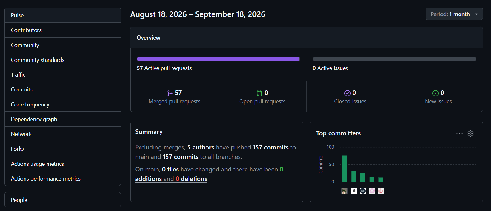
    <br/><i>Imagen 1. Insights de la Primera Entrega (AV1)</i>
</p>

<br>

**Segunda Entrega (TB1)**


<p align="center">
  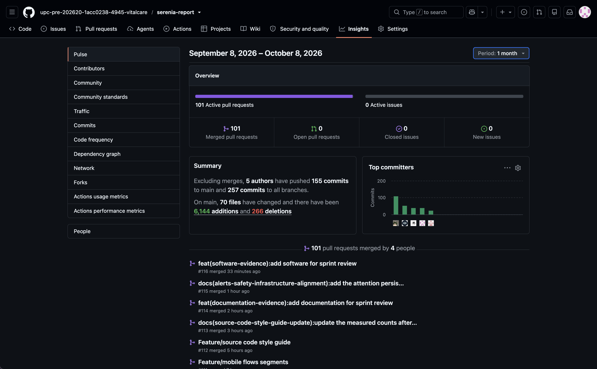
    <br/><i>Imagen 2. Insights de la Segunda Entrega (TB1)</i>
</p>

<div style="page-break-after: always;"></div>

# Contenido

## Tabla de Contenidos

- [Registro de Versiones del Informe](#registro-de-versiones-del-informe)
- [Project Report Collaboration Insights](#project-report-collaboration-insights)
- [Contenido](#contenido)
  - [Tabla de Contenidos](#tabla-de-contenidos)
- [Student Outcome](#student-outcome)
- [Objetivos SMART](#objetivos-smart)
- [Capítulo I: Presentación](#capítulo-i-presentación)
  - [1.1. Startup Profile](#11-startup-profile)
    - [1.1.1. Descripción de la Startup](#111-descripción-de-la-startup)
    - [1.1.2. Perfiles de integrantes del equipo](#112-perfiles-de-integrantes-del-equipo)
  - [1.2. Solution Profile](#12-solution-profile)
    - [1.2.1. Antecedentes y problemática](#121-antecedentes-y-problemática)
    - [1.2.2. Lean UX Process](#122-lean-ux-process)
      - [1.2.2.1. Lean UX Problem Statements](#1221-lean-ux-problem-statements)
      - [1.2.2.2. Lean UX Assumptions](#1222-lean-ux-assumptions)
      - [1.2.2.3. Lean UX Hypothesis Statements](#1223-lean-ux-hypothesis-statements)
      - [1.2.2.4. Lean UX Canvas](#1224-lean-ux-canvas)
  - [1.3. Segmentos objetivo](#13-segmentos-objetivo)
- [Capítulo II: Requirements Development and Software Solution Design](#capítulo-ii-requirements-development-and-software-solution-design)
  - [2.1. Competidores](#21-competidores)
    - [2.1.1. Análisis competitivo](#211-análisis-competitivo)
    - [2.1.2. Estrategias y tácticas frente a competidores](#212-estrategias-y-tácticas-frente-a-competidores)
  - [2.2. Entrevistas](#22-entrevistas)
    - [2.2.1. Diseño de entrevistas](#221-diseño-de-entrevistas)
    - [2.2.2. Registro de entrevistas](#222-registro-de-entrevistas)
    - [2.2.3. Análisis de entrevistas](#223-análisis-de-entrevistas)
  - [2.3. Needfinding](#23-needfinding)
    - [2.3.1. User Personas](#231-user-personas)
    - [2.3.2. User Task Matrix](#232-user-task-matrix)
    - [2.3.3. User Journey Mapping](#233-user-journey-mapping)
    - [2.3.4. Empathy Mapping](#234-empathy-mapping)
    - [2.3.5. Big Picture EventStorming](#235-big-picture-eventstorming)
    - [2.3.6. Ubiquitous Language](#236-ubiquitous-language)
  - [2.4. Requirements specification](#24-requirements-specification)
    - [2.4.1. User Stories](#241-user-stories)
    - [2.4.2. Impact Mapping](#242-impact-mapping)
    - [2.4.3. Product Backlog](#243-product-backlog)
  - [2.5. Strategic-Level Domain-Driven Design](#25-strategic-level-domain-driven-design)
    - [2.5.1. EventStorming](#251-eventstorming)
      - [2.5.1.1. Candidate Context Discovery](#2511-candidate-context-discovery)
      - [2.5.1.2. Domain Message Flows Modeling](#2512-domain-message-flows-modeling)
      - [2.5.1.3. Bounded Context Canvases](#2513-bounded-context-canvases)
    - [2.5.2. Context Mapping](#252-context-mapping)
    - [2.5.3. Software Architecture](#253-software-architecture)
      - [2.5.3.1. Software Architecture Context Level Diagrams](#2531-software-architecture-context-level-diagrams)
      - [2.5.3.2. Software Architecture Container Level Diagrams](#2532-software-architecture-container-level-diagrams)
      - [2.5.3.3. Software Architecture Deployment Diagrams](#2533-software-architecture-deployment-diagrams)
  - [2.6. Tactical-Level Domain-Driven Design](#26-tactical-level-domain-driven-design)
    - [2.6.1. Bounded Context: Identity \& Access Context](#261-bounded-context-identity--access-context)
      - [2.6.1.1. Domain Layer](#2611-domain-layer)
      - [2.6.1.2. Interface Layer](#2612-interface-layer)
      - [2.6.1.3. Application Layer](#2613-application-layer)
      - [2.6.1.4 Infrastructure Layer](#2614-infrastructure-layer)
      - [2.6.1.5. Bounded Context Software Architecture Component Level Diagrams](#2615-bounded-context-software-architecture-component-level-diagrams)
      - [2.6.1.6. Bounded Context Software Architecture Code Level Diagrams](#2616-bounded-context-software-architecture-code-level-diagrams)
        - [2.6.1.6.1. Bounded Context Domain Layer Class Diagrams](#26161-bounded-context-domain-layer-class-diagrams)
        - [2.6.1.6.2. Bounded Context Database Design Diagram](#26162-bounded-context-database-design-diagram)
    - [2.6.2. Bounded Context: Care Circle](#262-bounded-context-care-circle)
      - [2.6.2.1. Domain Layer](#2621-domain-layer)
      - [2.6.2.2. Interface Layer](#2622-interface-layer)
      - [2.6.2.3. Application Layer](#2623-application-layer)
      - [2.6.2.4 Infrastructure Layer](#2624-infrastructure-layer)
      - [2.6.2.5. Bounded Context Software Architecture Component Level Diagrams](#2625-bounded-context-software-architecture-component-level-diagrams)
      - [2.6.2.6. Bounded Context Software Architecture Code Level Diagrams](#2626-bounded-context-software-architecture-code-level-diagrams)
        - [2.6.2.6.1. Bounded Context Domain Layer Class Diagrams](#26261-bounded-context-domain-layer-class-diagrams)
        - [2.6.2.6.2. Bounded Context Database Design Diagram](#26262-bounded-context-database-design-diagram)
    - [2.6.3. Bounded Context: Daily Check-in](#263-bounded-context-daily-check-in)
      - [2.6.3.1. Domain Layer](#2631-domain-layer)
      - [2.6.3.2. Interface Layer](#2632-interface-layer)
      - [2.6.3.3. Application Layer](#2633-application-layer)
      - [2.6.3.4 Infrastructure Layer](#2634-infrastructure-layer)
      - [2.6.3.5. Bounded Context Software Architecture Component Level Diagrams](#2635-bounded-context-software-architecture-component-level-diagrams)
      - [2.6.3.6. Bounded Context Software Architecture Code Level Diagrams](#2636-bounded-context-software-architecture-code-level-diagrams)
        - [2.6.3.6.1. Bounded Context Domain Layer Class Diagrams](#26361-bounded-context-domain-layer-class-diagrams)
        - [2.6.3.6.2. Bounded Context Database Design Diagram](#26362-bounded-context-database-design-diagram)
    - [2.6.4. Bounded Context: Wellbeing Monitoring](#264-bounded-context-wellbeing-monitoring)
      - [2.6.4.1. Domain Layer](#2641-domain-layer)
      - [2.6.4.2. Interface Layer](#2642-interface-layer)
      - [2.6.4.3. Application Layer](#2643-application-layer)
      - [2.6.4.4 Infrastructure Layer](#2644-infrastructure-layer)
      - [2.6.4.5. Bounded Context Software Architecture Component Level Diagrams](#2645-bounded-context-software-architecture-component-level-diagrams)
      - [2.6.4.6. Bounded Context Software Architecture Code Level Diagrams](#2646-bounded-context-software-architecture-code-level-diagrams)
        - [2.6.4.6.1. Bounded Context Domain Layer Class Diagrams](#26461-bounded-context-domain-layer-class-diagrams)
        - [2.6.4.6.2. Bounded Context Database Design Diagram](#26462-bounded-context-database-design-diagram)
    - [2.6.5. Bounded Context: Social Companionship](#265-bounded-context-social-companionship)
      - [2.6.5.1. Domain Layer](#2651-domain-layer)
      - [2.6.5.2. Interface Layer](#2652-interface-layer)
      - [2.6.5.3. Application Layer](#2653-application-layer)
      - [2.6.5.4 Infrastructure Layer](#2654-infrastructure-layer)
      - [2.6.5.5. Bounded Context Software Architecture Component Level Diagrams](#2655-bounded-context-software-architecture-component-level-diagrams)
      - [2.6.5.6. Bounded Context Software Architecture Code Level Diagrams](#2656-bounded-context-software-architecture-code-level-diagrams)
        - [2.6.5.6.1. Bounded Context Domain Layer Class Diagrams](#26561-bounded-context-domain-layer-class-diagrams)
        - [2.6.5.6.2. Bounded Context Database Design Diagram](#26562-bounded-context-database-design-diagram)
    - [2.6.6. Bounded Context: Alerts \& Safety](#266-bounded-context-alerts--safety)
      - [2.6.6.1. Domain Layer](#2661-domain-layer)
      - [2.6.6.2. Interface Layer](#2662-interface-layer)
      - [2.6.6.3. Application Layer](#2663-application-layer)
      - [2.6.6.4 Infrastructure Layer](#2664-infrastructure-layer)
      - [2.6.6.5. Bounded Context Software Architecture Component Level Diagrams](#2665-bounded-context-software-architecture-component-level-diagrams)
      - [2.6.6.6. Bounded Context Software Architecture Code Level Diagrams](#2666-bounded-context-software-architecture-code-level-diagrams)
        - [2.6.6.6.1. Bounded Context Domain Layer Class Diagrams](#26661-bounded-context-domain-layer-class-diagrams)
        - [2.6.6.6.2. Bounded Context Database Design Diagram](#26662-bounded-context-database-design-diagram)
        - [Capítulo III: Solution UI/UX Design](#capítulo-iii-solution-uiux-design)
  - [3.1. Product design](#31-product-design)
    - [3.1.1. Style Guidelines](#311-style-guidelines)
      - [3.1.1.1. General Style Guidelines](#3111-general-style-guidelines)
    - [3.1.2. Information Architecture](#312-information-architecture)
      - [3.1.2.1. Organization Systems](#3121-organization-systems)
      - [3.1.2.2. Labelling Systems](#3122-labelling-systems)
      - [3.1.2.3. SEO Tags and Meta Tags](#3123-seo-tags-and-meta-tags)
      - [3.1.2.4. Searching Systems](#3124-searching-systems)
      - [3.1.2.5. Navigation Systems](#3125-navigation-systems)
    - [3.1.3. Landing Page UI Design](#313-landing-page-ui-design)
      - [3.1.3.1. Landing Page Wireframe](#3131-landing-page-wireframe)
      - [3.1.3.2. Landing Page Mock-up](#3132-landing-page-mock-up)
    - [3.1.4. Mobile Applications UX/UI Design](#314-mobile-applications-uxui-design)
      - [3.1.4.1. Mobile Applications Wireframes](#3141-mobile-applications-wireframes)
      - [3.1.4.2. Mobile Applications Wireflow Diagrams](#3142-mobile-applications-wireflow-diagrams)
      - [3.1.4.3. Mobile Applications Mock-ups](#3143-mobile-applications-mock-ups)
      - [3.1.4.4. Mobile Applications User Flow Diagrams](#3144-mobile-applications-user-flow-diagrams)
      - [3.1.4.5. Mobile Applications Prototyping](#3145-mobile-applications-prototyping)
- [Capítulo IV: Product Implementation & Validation](#capítulo-iv-product-implementation--validation)
  - [4. Product Implementation & Validation](#4-product-implementation--validation)
  - [4.1. Software Configuration Management](#41-software-configuration-management)
    - [4.1.1. Software Development Environment Configuration](#411-software-development-environment-configuration)
    - [4.1.2. Source Code Management](#412-source-code-management)
    - [4.1.3. Source Code Style Guide & Conventions](#413-source-code-style-guide--conventions)
    - [4.1.4. Software Deployment Configuration](#414-software-deployment-configuration)
  - [4.2. Landing Page & Mobile Application Implementation](#42-landing-page--mobile-application-implementation)
    - [4.2.1. Sprint 1](#421-sprint-1)
      - [4.2.1.1. Sprint Planning 1](#4211-sprint-planning-1)
      - [4.2.1.2. Aspect Leaders and Collaborators](#4212-aspect-leaders-and-collaborators)
      - [4.2.1.3. Sprint Backlog 1](#4213-sprint-backlog-1)
      - [4.2.1.4. Development Evidence for Sprint Review](#4214-development-evidence-for-sprint-review)
      - [4.2.1.5. Testing Suite Evidence for Sprint Review](#4215-testing-suite-evidence-for-sprint-review)
      - [4.2.1.6. Execution Evidence for Sprint Review](#4216-execution-evidence-for-sprint-review)
      - [4.2.1.7. Services Documentation Evidence for Sprint Review](#4217-services-documentation-evidence-for-sprint-review)
      - [4.2.1.8. Software Deployment Evidence for Sprint Review](#4218-software-deployment-evidence-for-sprint-review)
      - [4.2.1.9. Team Collaboration Insights during Sprint](#4219-team-collaboration-insights-during-sprint)
  - [4.3. Validation Interviews](#43-validation-interviews)
    - [4.3.1. Diseño de Entrevistas](#431-diseño-de-entrevistas)
    - [4.3.2. Registro de Entrevistas](#432-registro-de-entrevistas)
    - [4.3.3. Evaluaciones según heurísticas](#433-evaluaciones-según-heurísticas)
- [Conclusiones](#conclusiones)
  - [Conclusiones y Recomendaciones](#conclusiones-y-recomendaciones)
- [Glosario](#glosario)
- [Bibliografía](#bibliografía)
- [Anexos](#anexos)

<br>

<div style="page-break-after: always;"></div>

# Student Outcome

El curso contribuye al cumplimiento del Student Outcome ABET:

**ABET – EAC - Student Outcome 7**

**Criterio:** *La capacidad de adquirir y aplicar nuevos conocimientos según sea necesario, utilizando estrategias de aprendizaje apropiadas.*

En el siguiente cuadro se describe las acciones realizadas y enunciados de conclusiones por parte del grupo, que permiten sustentar el haber alcanzado el logro del ABET – EAC - Student Outcome 7.

<table>
  <tr>
    <th>Criterio específico</th>
    <th>Acciones realizadas</th>
    <th>Conclusiones</th>
  </tr>
  <tr>
      <td><b>Actualiza conceptos y conocimientos necesarios para su desarrollo profesional y en especial para su proyecto en soluciones de software.</b></td>
      <td>
            <b>Contreras Torres, Arturo Valentino</b><br>
            <u>AV1</u><br>
            Estudié Domain-Driven Design estratégico para liderar el EventStorming y las User Stories del equipo, y apliqué técnicas de entrevista para definir los segmentos objetivo y el perfil de la solución.
            <br><br>
            <u>TB1</u><br>
            <br><br>
            <b>Gallardo Morales, Carla Alejandra</b><br>
            <u>AV1</u><br>
            Aprendí y apliqué técnicas de UX Research (User Personas y User Journey Mapping) a partir del análisis de entrevistas, e incorporé prácticas ágiles al estructurar el Product Backlog priorizado.
            <br><br>
            <u>TB1</u><br>
            <br><br>
            <b>García Paredes, Victor Manuel</b><br>
            <u>AV1</u><br>
            Asimilé el proceso Lean UX para formular hipótesis validables antes de diseñar la solución, y apliqué modelado de dominio en el Big Picture EventStorming y el Context Mapping.
            <br><br>
            <u>TB1</u><br>
            <br><br>
            <b>Salinas Guzman, Brianna Cristina</b><br>
            <u>AV1</u><br>
            Incorporé el modelo C4 para documentar la arquitectura por niveles de abstracción, y apliqué técnicas de investigación en el análisis competitivo y en la problemática sustentada con fuentes.
            <br><br>
            <u>TB1</u><br>
            <br><br>
            <b>Sandoval Aiquipa, Kelber Yamir</b><br>
            <u>AV1</u><br>
            Apliqué herramientas nuevas de diseño centrado en el usuario, como el Empathy Mapping y el Impact Mapping, para traducir las necesidades detectadas en entrevistas en objetivos del producto.
            <br><br>
            <u>TB1</u><br>
            <br><br>
        </td>
        <td>
            <u>AV1</u><br>
            El equipo incorporó marcos que no conocía previamente (Lean UX, Needfinding, Domain-Driven Design, EventStorming y el modelo C4); cada integrante estudió por su cuenta la técnica asignada y la explicó al resto, convirtiendo el aprendizaje individual en conocimiento compartido. Además, sustentamos las decisiones del proyecto con técnicas de investigación como entrevistas y análisis competitivo, en lugar de basarnos en supuestos. <br><br>
            <u>TB1</u><br>
        </td>
    </tr>
      <tr>
      <td><b>Reconoce la necesidad del aprendizaje permanente para el desempeño profesional y el desarrollo de proyectos en soluciones de software.</b></td>
      <td>
            <b>Contreras Torres, Arturo Valentino</b><br>
            <u>AV1</u><br>
            Identifico la arquitectura de software como mi área de crecimiento; mi plan es profundizar en Clean Architecture y DDD aplicados a backend para sustentar decisiones técnicas con criterio propio.
            <br><br>
            <u>TB1</u><br>
            <br><br>
            <b>Gallardo Morales, Carla Alejandra</b><br>
            <u>AV1</u><br>
            Reconozco que necesito fortalecer la investigación de usuarios y la gestión de producto; mi plan es seguir formándome en UX Research y validar mis supuestos con usuarios reales en cada entregable.
            <br><br>
            <u>TB1</u><br>
            <br><br>
            <b>García Paredes, Victor Manuel</b><br>
            <u>AV1</u><br>
            Mi área de interés es el diseño e integración de sistemas; mi plan es continuar estudiando patrones de integración entre contextos para aplicarlos en los siguientes entregables.
            <br><br>
            <u>TB1</u><br>
            <br><br>
            <b>Salinas Guzman, Brianna Cristina</b><br>
            <u>AV1</u><br>
            Identifico la arquitectura de software y la infraestructura en la nube como mi área de crecimiento; mi plan es formarme en servicios cloud y documentación arquitectónica.
            <br><br>
            <u>TB1</u><br>
            <br><br>
            <b>Sandoval Aiquipa, Kelber Yamir</b><br>
            <u>AV1</u><br>
            Reconozco que las herramientas de análisis cambian constantemente; mi plan es seguir aprendiendo metodologías de descubrimiento de producto y modelado de requisitos y aplicarlas de forma continua.
            <br><br>
            <u>TB1</u><br>
            <br><br>
        </td>
        <td>
            <u>AV1</u><br>
            El entregable evidenció que lo visto en clase no basta para sostener un proyecto real: cada técnica exigió estudio adicional del responsable y aprendizaje entre pares. A partir de ello, cada integrante identificó un área concreta de crecimiento profesional y un plan de formación alineado a ella, asumiendo el aprendizaje permanente como una condición del ejercicio profesional y no como una etapa que termina con el curso. <br><br>
            <u>TB1</u><br>
        </td>
    </tr>
</table>

<div style="page-break-after: always;"></div>

# Objetivos SMART

Eh esta sección, cada integrante del equipo formula un plan de dos objetivos SMART orientados a su desarrollo profesional una vez finalizada la carrera. Estos objetivos reflejan de manera clara y medible las metas de crecimiento profesional continuo que cada miembro se propone alcanzar tras su graduación.

**Contreras Torres, Arturo Valentino**

<u> *Objetivo SMART 1:* </u> <br>
Conseguir un puesto remoto como Desarrollador de Software en una empresa extranjera dentro de los 12 meses posteriores a mi egreso, dedicando al menos 8 horas semanales en fortalecer mi portafolio y postular activamente a vacantes internacionales, con el fin de expandir mis conocimientos en arquitecturas de software y ganar experiencia profesional en un contexto global.

<u> *Objetivo SMART 2:* </u> <br>
Ser admitido en una maestría de Arquitectura de Software dentro de los 2 años posteriores a mi egreso, cumpliendo con los requisitos de admisión durante el primer año, con el fin de fortalecer mi perfil profesional y acceder a posiciones de mayor responsabilidad técnica.

**Gallardo Morales, Carla Alejandra**

<u> *Objetivo SMART 1:* </u> <br>
Obtener mi título universitario y conseguir, dentro de los 2 años posteriores a mi graduación, una oportunidad laboral en una empresa extranjera como desarrolladora backend, fortaleciendo continuamente mis conocimientos mediante cursos de actualización y proyectos personales relacionados con tecnologías como .NET, Azure, Python y desarrollo de software, con el propósito de adquirir experiencia y posteriormente postular a empresas tecnológicas internacionales como IBM, Google o Microsoft.

<u> *Objetivo SMART 2:* </u> <br>
Conseguir, durante los 2 años posteriores a mi graduación, una beca para realizar una maestría en el extranjero, priorizando universidades ubicadas en centros tecnológicos como Seattle, Estados Unidos, y completar dicha formación para ampliar mis conocimientos en desarrollo de software y tecnologías emergentes, fortalecer mi perfil profesional y acceder posteriormente a oportunidades laborales en empresas tecnológicas internacionales.


**García Paredes, Victor Manuel**

<u> *Objetivo SMART 1:* </u> <br>
Obtener al menos una certificación profesional reconocida en la nube (por ejemplo, AWS Certified Developer o Microsoft Azure Fundamentals) dentro del primer año posterior a mi egreso, dedicando al menos 5 horas semanales a su preparación, con el fin de fortalecer mis competencias técnicas y aumentar mi competitividad en el mercado laboral.

<u> *Objetivo SMART 2:* </u> <br>
Conseguir un empleo remoto como desarrollador de software dentro de los 12 meses posteriores a mi egreso, que me permita trabajar desde al menos 2 países distintos durante mi primer año en el puesto, con el fin de combinar mi pasión por la programación con mi interés por conocer el mundo.

<u> *Objetivo SMART 3:* </u> <br>
Fundar mi propia empresa o startup de software dentro de los 3 años posteriores a mi egreso, validando un modelo de negocio y consiguiendo al menos 1 cliente o usuario piloto en ese periodo, con el fin de aplicar de forma independiente los conocimientos técnicos y de gestión adquiridos en la carrera.

**Salinas Guzman, Brianna Cristina**

<u> *Objetivo SMART 1:* </u> <br>

Conseguir un puesto remoto como Desarrolladora de Software con especialización en ciberseguridad en una empresa internacional dentro de los 12 meses posteriores a mi egreso, obteniendo al menos una certificación reconocida en el área (por ejemplo, CompTIA Security+ o similar) durante ese periodo y dedicando 6 horas semanales a su preparación, con el fin de posicionarme en un área de alta demanda y acceder a oportunidades laborales remotas.

<u> *Objetivo SMART 2:* </u> <br>

Fundar mi propia startup de desarrollo de software orientada a resolver problemas del mercado peruano dentro de los 3 años posteriores a mi egreso, completando un plan de negocio validado durante el primer año y consiguiendo al menos 3 clientes o usuarios piloto en el segundo año de operación, con el fin de impulsar el desarrollo tecnológico local y consolidar mi propio proyecto empresarial.

**Sandoval Aiquipa, Kelber Yamir**

<u> *Objetivo SMART 1:* </u> <br>
Conseguir un puesto como Desarrollador Backend en una empresa del sector tecnológico dentro de los 12 meses posteriores a mi egreso, dedicando 6 horas semanales a perfeccionar mis habilidades en frameworks como Spring Boot y en el diseño de arquitecturas basadas en Domain-Driven Design (DDD), con el fin de especializarme en la construcción de sistemas robustos y escalables.

<u> *Objetivo SMART 2:* </u> <br>
Asumir un rol de liderazgo técnico o gestión de proyectos (como Tech Lead o Scrum Master) dentro de los 3 primeros años de mi carrera profesional, aprovechando la capacidad de resolución de conflictos y gestión de personal adquirida supervisando equipos de ventas y atención al cliente, y obteniendo una certificación oficial en metodologías ágiles durante los primeros 18 meses.

<br>

<div style="page-break-after: always;"></div>

# Capítulo I: Presentación
## 1.1. Startup Profile
### 1.1.1. Descripción de la Startup

Vivir lejos de un padre o una madre mayor genera una tensión particular: la necesidad de saber que están bien sin querer invadir su día a día con llamadas constantes. Esta dinámica se ha vuelto cada vez más común en el Perú, donde, según el INEI, 1 de cada 4 hogares liderados por adultos mayores en Lima es unipersonal. Muchos de estos adultos mayores optan por no contar cuando algo no anda bien, para no generar preocupación en sus familias, lo que termina alejando a ambas partes justo cuando más necesitan estar conectadas.

VitalCare nace para sanar esta desconexión apostando por tecnología que acompaña, no que vigila. Nuestro primer producto, Serenia, permite al adulto mayor compartir como se siente con un solo toque desde su dispositivo, sin necesidad de dar largas explicaciones. Mientras tanto, la familia recibe actualizaciones sobre su bienestar en tiempo real, sin tener que preguntar todo el tiempo.

El corazón de Serenia es que cada interacción se sienta como una charla genuina y no como un chequeo médico. Incluye preguntas ligeras, un espacio para grabar anécdotas y alertas familiares que solo suenan cuando de verdad hacen falta. Queremos devolver la naturalidad al cuidado a distancia: dándole tranquilidad a la familia y respetando siempre la autonomía del adulto mayor.

## Misión

Dar a los adultos mayores que viven solos una forma simple y natural de comunicar su día a día, y a sus familias, la tranquilidad de saber cómo están. Reducimos la ansiedad de la distancia conectándolos desde el afecto, sin caer en el monitoreo invasivo.

## Visión

Ser la plataforma de compañía digital que transforme cómo las familias de Latinoamérica se cuidan a distancia. Queremos fortalecer el vínculo emocional por encima del reporte clínico, logrando que ningún adulto mayor enfrente la soledad en silencio.

## Valores

- **Cercanía:** <br>
  Diseñamos cada interacción con un lenguaje cálido y humano. Cuidar no debe sentirse como una obligación ni leerse como un historial médico.

- **Autonomía:** <br>
  El adulto mayor decide qué y cuándo compartir. Respetamos su independencia y evitamos que se sienta incapaz de gestionar su vida.

- **Confianza:** <br>
  Más que vigilancia constante, ofrecemos información honesta y alertas oportunas para darle verdadera tranquilidad a ambas partes.
  
- **Conexión emocional:** <br>
  Celebramos lo bueno de la rutina. Fomentamos espacios como "cuéntame algo" para registrar pequeñas victorias y reforzar el cariño diario, no solo para alertar sobre problemas.

### 1.1.2. Perfiles de integrantes del equipo

<table>
  <tr>
    <td rowspan="3" align="center">
      
    </td>
    <td><b>Nombre:</b> Arturo Valentino Contreras Torres</td>
  </tr>
  <tr>
    <td><b>Código:</b> u202414802</td>
  </tr>
  <tr>
    <td>
      <b>Descripción:</b><br/>
      Soy <b>Arturo Valentino Contreras Torres</b>, tengo 19 años y estudio Ingeniería de Software en la UPC, actualmente en el 6to ciclo. Me gusta aprender y aplicar tecnologías innovadoras para resolver problemas complejos y desarrollar soluciones eficientes. Me apasiona participar en concursos de programación, donde profundizo en programación competitiva y en la creación de nuevas ideas. Tengo conocimiento en frameworks como Vue, Angular y Spring Boot, y disfruto trabajar en equipo bajo metodologías ágiles. También me interesan Clean Architecture, Domain-Driven Design y otras prácticas que ayudan a escribir mejor código.
      <br/>
    </td>
  </tr>

  <tr>
    <td rowspan="3" align="center">
      
    </td>
    <td><b>Nombre:</b> Gallardo Morales, Carla Alejandra</td>
  </tr>
  <tr>
    <td><b>Código:</b> u202414970</td>
  </tr>
  <tr>
    <td>
      <b>Descripción:</b><br/>
      Soy <b>Carla Alejandra Gallardo Morales</b>, tengo 19 años. Desde que me incorporé en la Universidad Peruana de Ciencias Aplicadas en el periodo 2024-01, es decir que ahora mismo estoy cursando el sexto ciclo de la carrera de Ing. de Software, he adquirido y desarrollado distintos conocimientos a cerca de la programación, específicamente en el lenguaje C++, JavaScript y TypeScript, además, de forma autodidacta y extracurricular, he profundizado en el lenguaje Python, lo que ha ampliado mi perspectiva sobre la lógica y resolución de problemas.
      <br/><br/>
      Dentro del equipo, mi contribución se basa en el apoyo continuo del desarrollo del frontend de nuestra aplicación móvil, asimismo ayudo en la implementación del informe de nuestro proyecto.
      <br/>
    </td>
  </tr>

  <tr>
    <td rowspan="3" align="center">
      
    </td>
    <td><b>Nombre:</b> García Paredes, Victor Manuel</td>
  </tr>
  <tr>
    <td><b>Código:</b> u202012001</td>
  </tr>
  <tr>
    <td>
      <b>Descripción:</b><br/>
      Soy <b>Victor Manuel García Paredes</b>, estudiante de la carrera de Ingeniería de Software en la Universidad Peruana de Ciencias Aplicadas (UPC), con sólidos conocimientos en desarrollo de aplicaciones, estructuras de datos y programación orientada a objetos. Tengo experiencia en el uso de C++, así como en la gestión de proyectos mediante herramientas como Git y GitHub para el control de versiones. También tengo conocimientos básicos de Python, MSSQL, MongoDB, JavaScript y TypeScript. Me caracterizo por ser una persona responsable, con iniciativa para el aprendizaje autónomo, y con habilidades para el trabajo en equipo y la comunicación efectiva de ideas.
      <br/>
    </td>
  </tr>

  <tr>
    <td rowspan="3" align="center">
      
    </td>
    <td><b>Nombre:</b> Salinas Guzman, Brianna Cristina</td>
  </tr>
  <tr>
    <td><b>Código:</b> u202410239</td>
  </tr>
  <tr>
    <td>
      <b>Descripción:</b><br/>
      Soy <b>Brianna Cristina Salinas Guzmán</b>, tengo 19 años y estudio Ingeniería de Software en la Universidad Peruana de Ciencias Aplicadas (UPC), actualmente en el 6to ciclo. Tengo experiencia en desarrollo backend con Spring Boot y Express.js, aplicando Domain-Driven Design (bounded contexts, autenticación JWT, integración con APIs externas), así como en frontend con Angular, React y Vue. Me interesa profundizar en el desarrollo de aplicaciones móviles, tanto nativas como multiplataforma, y disfruto trabajar bajo metodologías ágiles y buenas prácticas de arquitectura de software.
      <br/>
    </td>
  </tr>

  <tr>
    <td rowspan="3" align="center">
      
    </td>
    <td><b>Nombre:</b> Sandoval Aiquipa, Kelber Yamir</td>
  </tr>
  
  <tr>
    <td><b>Código:</b> u202418645</td>
  </tr>
  <tr>
    <td>
      <b>Descripción:</b><br/>
      Soy <b>Kelber Yamir Sandoval Aiquipa</b>, estudiante de la carrera de Ingeniería de Software en la Universidad Peruana de Ciencias Aplicadas (UPC), cursando actualmente el 6to ciclo. Cuento con experiencia en programación orientada a objetos, estructuras de datos y desarrollo backend utilizando Spring Boot y bases de datos relacionales y no relacionales. Me apasiona el diseño de software bajo el enfoque de Domain-Driven Design y el desarrollo de aplicaciones móviles enfocadas en resolver necesidades reales con alto impacto en la experiencia de usuario. En el equipo, aporto en la definición de la lógica de negocio, arquitectura del software y en el aseguramiento de buenas prácticas colaborativas con Git y GitHub.
      <br/>
    </td>
  </tr>
</table>

<br>

## 1.2. Solution Profile

Serenia es una solución con dos interfaces: una dirigida al adulto mayor que vive solo y otra dirigida al familiar a distancia. Ambos comparten un mismo objetivo: sustituir la llamada telefónica diaria motivada por la ansiedad con una forma de comunicación más simple, natural y menos invasiva del bienestar cotidiano.

Del lado del adulto mayor, la aplicación inicia el contacto de forma proactiva: a una hora determinada del día, le pregunta cómo se encuentra mediante una interacción de un solo toque, alternando preguntas ligeras y variables (no siempre preguntas comunes como "¿cómo estás?", "¿qué haces?", sino también "¿jugaste bingo hoy con tus amigos?" o "¿qué tal te pareció el partido de hoy?") para que la experiencia se sienta como una conversación real y no como un control constante. Además, cuenta con un espacio de "cuéntame algo" donde puede grabar un audio corto sobre su día, con recordatorios de contacto social más allá de los médicos, con la posibilidad de indicar que ese día no desea que le pregunten nada, con un modo simplificado para jornadas de menor energía, y con un botón de auxilio siempre visible para emergencias.

Del lado del familiar, la aplicación ofrece un panel de estado diario que muestra si el adulto mayor completó su check-in y cómo se sintió, sin necesidad de llamar para averiguarlo. Las alertas solo se activan cuando algo se sale de lo habitual, evitando que el familiar revise la aplicación de forma ansiosa durante todo el día. La aplicación también sugiere acciones suaves cuando el adulto mayor reporta sentirse "no tan bien" varios días seguidos y registra pequeñas victorias además de alertas.

El diferenciador central de Serenia frente a otras soluciones de monitoreo es su enfoque en la compañía por encima de la vigilancia: el lenguaje y las interacciones evitan el tono clínico o de "reporte", priorizando el vínculo emocional cotidiano entre adulto mayor y su familia, sin descuidar la seguridad ante situaciones de emergencia.

### 1.2.1. Antecedentes y problemática

## The 5W's y 2H's

### Who (¿Quién?)

Los afectados son, por un lado, los adultos mayores que viven solos (sin convivir con hijos o familiares) y, por otro, sus familiares directos que residen en otra vivienda o ciudad y que ejercen un rol de cuidado a distancia.

### What (¿Qué?)

Existe una desconexión de cuidado entre ambas partes: los familiares viven en un estado constante de incertidumbre sobre el bienestar del adulto mayor, mientras que el adulto mayor tiende a ocultar cuando tuvo un mal día, un malestar o un momento de soledad, para no "molestar" a la familia. El resultado es que ambas partes terminan cuidándose a medias, sin un canal simple y natural para comunicar y monitorear el bienestar diario.

### Where (¿Dónde?)

El problema se ubica principalmente en hogares peruanos donde el adulto mayor vive de manera unipersonal (solo), mientras que los familiares a cargo residen en otro hogar, distrito o ciudad, lo que impide la supervisión presencial cotidiana.

### When (¿Cuándo?)

Es un problema de naturaleza diaria y recurrente, no puntual: la incertidumbre y las llamadas por ansiedad ocurren todos los días, y se agrava progresivamente a medida que crece la proporción de adultos mayores que viven solos.

### Why (¿Por qué?)

Según la Agencia Andina (2025), citando datos del Instituto Nacional de Estadística e Informática (INEI), en Lima Metropolitana el 25,3% de los hogares jefaturados por adultos mayores (60 años a más) son unipersonales (es decir, compuestos únicamente por la persona mayor), cifra que aumentó 2,3 puntos porcentuales respecto al mismo periodo del año anterior (Andina, 2025). Esta tendencia se ha mantenido creciente: según cifras más recientes del INEI correspondientes al tercer trimestre de 2025, reportadas por Infobae (2025), a nivel nacional el 26,9% de los hogares con jefatura de una persona adulta mayor ya son unipersonales, frente al 24,5% registrado dos años antes (Infobae, 2025). Esta creciente proporción de adultos mayores que viven solos explica por qué los familiares terminan llamando todos los días por ansiedad (no porque haya pasado algo puntual) y por qué el adulto mayor evita reportar molestias por no sentirse una carga. No existe hoy un canal intermedio entre "no comunicarse" y "llamar todos los días" que permita transmitir bienestar de forma ligera, sin fricción y sin depender de una llamada telefónica. La literatura reciente coincide con este diagnóstico: quienes viven solos tienen menos acceso inmediato a cuidadores informales y pueden depender más del apoyo tecnológico para mantener su seguridad, su independencia y su conexión social (Xu et al., 2026). La Imagen 2 muestra la distribución de estos hogares según su área de residencia y el sexo de la persona que los encabeza.

<br>
<p align="center">
  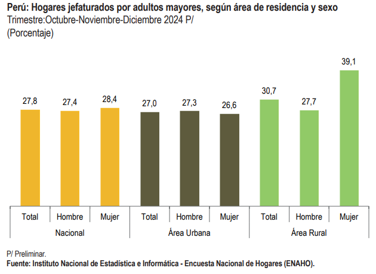
</p>
<p align="center"><sub>Imagen 2. Hogares jefaturados por adultos mayores, según área de residencia y sexo. Tomado de <em>Informe Técnico: Situación de la Población Adulta Mayor</em>, por Instituto Nacional de Estadística e Informática [INEI], 2025, p. 3 (https://m.inei.gob.pe/media/MenuRecursivo/boletines/informe-tecnico_adultomayor.pdf).</sub></p>

### How (¿Cómo?)

Se propone Serenia, una solución compuesta por dos aplicaciones móviles conectadas: una dirigida al adulto mayor y otra dirigida al familiar a distancia. La app del adulto mayor inicia proactivamente un check-in diario de un solo toque con preguntas variables y ligeras (no solo "¿cómo estás?"), ofrece un espacio opcional de "cuéntame algo" (mensajes de audio cortos), recordatorios de contacto social, control sobre su propia sensibilidad, un modo simplificado y un botón de auxilio siempre visible. La app del familiar ofrece un panel de estado diario, alertas solo ante señales fuera de lo habitual, sugerencias suaves de acción, registro de pequeñas victorias, coordinación entre varios familiares y notas compartidas. El diferenciador central es que la propuesta busca sentirse como compañía con respaldo y no como una herramienta de vigilancia o monitoreo clínico.


### How much (¿Cuánto?)

El costo de no resolver este problema no es solo emocional, sino también económico y de salud mental para quienes ejercen el rol de cuidado a distancia: el Banco Interamericano de Desarrollo (BID, 2024), en una encuesta aplicada en 25 países de América Latina y el Caribe, encontró que el 31% de los cuidadores no remunerados de personas mayores reporta síntomas de depresión y que el 44% ha tenido que dejar su empleo para poder cuidar (Banco Interamericano de Desarrollo [BID], 2024). Esto evidencia que, sin una herramienta que aligere la carga de supervisión constante, el desgaste recae de forma directa sobre la salud mental y la estabilidad laboral del familiar cuidador. Para el AV1, el alcance se limita al análisis del problema, la propuesta de valor y el diseño de la solución (sin desarrollo de código todavía), enfocado en las dos aplicaciones descritas: la app nativa para el adulto mayor y la app cross-platform para el familiar.

### 1.2.2. Lean UX Process

Esta sección desarrolla el Lean UX Process aplicado al dominio del problema de Serenia, siguiendo la metodología de Lean UX (Gothelf & Seiden, 2021). Se parte de un Problem Statement único para todo el proyecto, se derivan los Assumptions organizados según los cinco tipos propuestos por Lean UX, se construyen los Hypothesis Statements correspondientes a cada Feature Assumption, y finalmente se consolida todo en un Lean UX Canvas.

#### 1.2.2.1. Lean UX Problem Statements

El estado actual de **la comunicación entre adultos mayores que viven solos y sus familiares a distancia** se ha enfocado principalmente en **llamadas telefónicas reactivas motivadas por la ansiedad, y en aplicaciones de monitoreo de salud con un enfoque clínico y de vigilancia constante**.

Lo que los productos o servicios existentes no logran resolver es **una forma de comunicación cotidiana, ligera y bidireccional que transmita bienestar emocional sin invadir la autonomía del adulto mayor ni generar una carga de vigilancia sobre el familiar**.

Nuestro producto resolverá esta brecha **ofreciendo un check-in diario de un solo toque para el adulto mayor, con preguntas variables y un tono de compañía (no clínico), y un panel de estado para el familiar que solo emite alertas cuando algo se sale de lo habitual**.

Nuestro enfoque inicial será **adultos mayores de 60 años a más que viven solos en zonas urbanas del Perú, y sus familiares directos de 25 a 59 años que residen en una ciudad o distrito distinto**.

Sabremos que hemos tenido éxito cuando veamos **una alta tasa de check-ins diarios completados por el adulto mayor, una reducción en la frecuencia de llamadas motivadas por ansiedad por parte del familiar, y un uso recurrente del panel de estado sin necesidad de soporte o intervención externa**.

#### 1.2.2.2. Lean UX Assumptions

**Business Assumptions**
- Existe un mercado desatendido de soluciones de comunicación familiar a distancia que no dependen de dispositivos médicos ni wearables costosos.
- Un modelo freemium (funciones básicas gratuitas, funciones familiares avanzadas de pago) es viable como estrategia de monetización, dado el bajo costo de adquisición vía recomendación familiar (boca a boca).
- VitalCare puede posicionarse como alternativa a las apps de monitoreo de salud, diferenciándose por su enfoque emocional y no clínico.

**Business Outcome Assumptions**
- El aumento en la cantidad de check-ins completados por semana indicará que la solución se está adoptando como hábito.
- La reducción en el costo de soporte/atención al cliente (menos consultas del tipo "¿cómo sé si está bien mi familiar?") indicará que el panel de estado cumple su función sin fricción.
- El incremento en el número de familiares que se registran a partir de una recomendación de otro usuario validará el boca a boca como canal de adquisición.

**User Assumptions**
- El adulto mayor que vive solo tiene acceso a un smartphone táctil y sabe realizar interacciones simples (tocar un botón, grabar un audio).
- El familiar a distancia revisa su smartphone varias veces al día y está dispuesto a instalar una aplicación adicional para conocer el bienestar de su familiar.
- Ambos segmentos desconfían de soluciones que se sientan "médicas" o de vigilancia constante.

**User Outcome and Benefit Assumptions**
- El adulto mayor obtiene una forma de expresar cómo se siente sin tener que iniciar una llamada ni dar explicaciones extensas.
- El familiar obtiene tranquilidad diaria sin tener que llamar constantemente ni sentir que está invadiendo la rutina del adulto mayor.
- Ambos segmentos fortalecen su vínculo emocional a través de interacciones ligeras (como "cuéntame algo"), en lugar de limitarse a reportes de estado.

**Feature Assumptions**
- Un check-in diario de un solo toque con preguntas variables reducirá la fricción de comunicación para el adulto mayor.
- Un espacio de "cuéntame algo" (audio corto) permitirá capturar momentos cotidianos que fortalezcan el vínculo familiar.
- Un panel de estado con alertas inteligentes (solo ante anomalías) evitará que el familiar revise la aplicación de forma ansiosa.
- Un botón de auxilio siempre visible cubrirá el escenario de emergencia sin necesidad de vigilancia constante.

#### 1.2.2.3. Lean UX Hypothesis Statements

1. **Check-in diario de un toque**: Creemos que lograremos *una alta tasa de adopción diaria del check-in* si *los adultos mayores que viven solos en zonas urbanas del Perú* logran *comunicar su estado de ánimo sin esfuerzo ni necesidad de dar explicaciones extensas* con *un check-in de un solo toque con preguntas ligeras y variables*.
2. **"Cuéntame algo"**: Creemos que lograremos *un mayor vínculo emocional percibido entre ambos segmentos* si *los adultos mayores y sus familiares a distancia* logran *compartir momentos cotidianos más allá de reportes de bienestar* con *un espacio de grabación de audio corto llamado "cuéntame algo"*.
3. **Panel de estado con alertas inteligentes**: Creemos que lograremos *una reducción en la frecuencia de llamadas motivadas por ansiedad* si *los familiares a distancia* logran *conocer el estado de bienestar de su familiar sin necesidad de preguntar constantemente* con *un panel de estado diario que solo emite alertas cuando se detecta una anomalía*.
4. **Botón de auxilio**: Creemos que lograremos *mayor confianza en la solución como respaldo ante emergencias* si *los adultos mayores que viven solos* logran *solicitar ayuda de forma inmediata en caso de urgencia* con *un botón de auxilio siempre visible y de fácil acceso*.

La evidencia reciente respalda la dirección de estas hipótesis, aunque no las valida. En un ensayo controlado aleatorizado con 68 adultos mayores que completaron el estudio y viven en la comunidad en Japón, el uso de un robot social redujo la soledad más que en el grupo de control (Murayama & Takase, 2025). Se trata de un dispositivo distinto a Serenia, pero sugiere que una compañía digital puede reducir la soledad.

<br>

#### 1.2.2.4. Lean UX Canvas

El Lean UX Canvas consolida el Business Problem, los Business Outcomes, los Users, los User Outcomes & Benefits, las Solutions y las Hypotheses desarrolladas en las subsecciones anteriores, junto con la identificación de la asunción de mayor riesgo (Segmento 1 adoptando el check-in diario como hábito) y el experimento de menor esfuerzo para validarla. La Imagen 3 presenta el canvas completo.

<p align="center">
  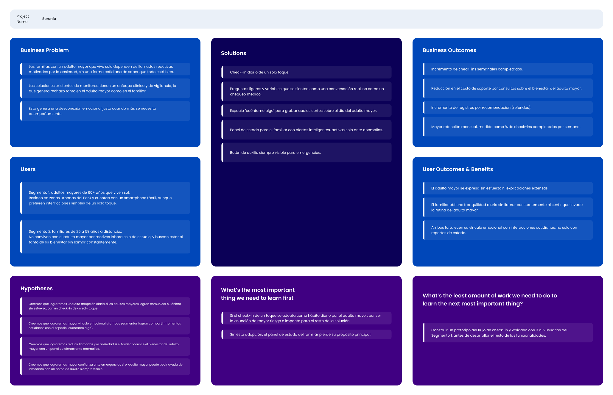
    <br/><i>Imagen 3. Lean UX Canvas.</i>
</p>

URL del archivo en Figma: https://www.figma.com/design/MtWwz8GxmrY0eR7eyc2UC0/Lean-UX-Canvas--Serenia-?node-id=0-1

<br>

## 1.3. Segmentos objetivo

Serenia conecta a dos perfiles de usuarios clave, definidos a partir del problema que resolvemos y respaldados por la realidad demográfica peruana.

#### Segmento 1: Adultos mayores que viven solos

- **Perfil:** Personas de 60 años a más, residentes en zonas urbanas del Perú, que viven solas y cuentan con un teléfono celular.

- **Sustento:** Aunque se suele pensar que la tecnología es una barrera, las cifras dicen lo contrario. En este grupo etario, el uso de celular llega al 97,7%, y la penetración de internet en áreas urbanas alcanza el 56,8% (INEI, 2025b). Además, el 25,3% de los hogares limeños con jefatura adulta mayor son unipersonales (INEI, 2025a). Esto confirma un escenario claro: existe un grupo numeroso de adultos mayores viviendo sin compañía permanente, pero que ya tienen en sus manos el dispositivo necesario para aprovechar una interacción sencilla, de un solo toque, como la que propone Serenia.

#### Segmento 2: Familiares a distancia

- **Perfil:** Hijos, hijas o parientes cercanos de 25 a 59 años que no conviven con el adulto mayor (ya sea por migración a otra ciudad o por vivir en distritos distintos) y buscan saber de ellos sin recurrir a llamadas constantes.

- **Sustento:** Lima concentra el 45,4% de los migrantes internos del país por motivos laborales o educativos (Carrasco Freitas, 2026), evidenciando una alta proporción de familias separadas geográficamente. Para acortar esta distancia, la tecnología es el puente ideal: el 95,4% de hogares peruanos ya cuenta con un smartphone (OSIPTEL, 2026), con una adopción que bordea el 95% en los adultos jóvenes y de mediana edad. Así, este segmento combina perfectamente la necesidad emocional de estar presentes con la fluidez tecnológica para integrar la app en su rutina diaria.

<br>

<div style="page-break-after: always;"></div>

# Capítulo II: Requirements Development and Software Solution Design
## 2.1. Competidores

### 2.1.1. Análisis competitivo

Esta sección tiene como objetivo profundizar en el conocimiento de los competidores, contrastando la percepción inicial con un análisis más detallado. Para ello, se desarrolla el siguiente Landscape:

<table>
  <tr>
    <th colspan="6" align="center">Competitive analysis landscape</th>
  </tr>
  <tr>
    <td colspan="2"><b>¿Por qué llevar a cabo este análisis?</b></td>
    <td colspan="4">
      Comparar las soluciones que ya existen en el mercado para el cuidado y bienestar de adultos mayores, con el fin de identificar por qué Serenia es una mejor opción: cómo se diferencia de cada una y cómo resuelve el problema de la desconexión entre el adulto mayor y su familia de una forma que ellas no logran.
    </td>
  </tr>
  <tr>
    <td colspan="2" align="center"><i>Competidor</i></td>
    <td align="center">
      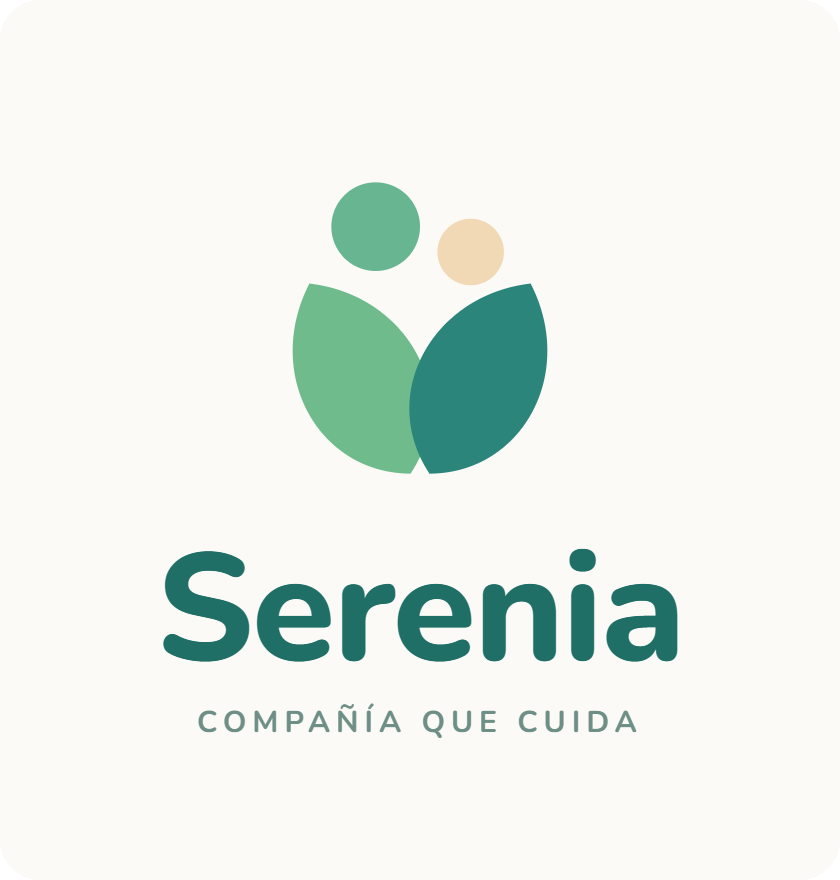<br/>
      <b>Serenia</b>
    </td>
    <td align="center">
      <br/>
      <b>Snug Safety</b>
    </td>
    <td align="center">
      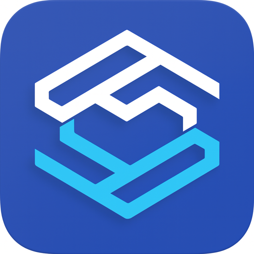<br/>
      <b>Caring Village</b>
    </td>
    <td align="center">
      <br/>
      <b>Papa</b>
    </td>
  </tr>

  <tr>
    <td rowspan="2" align="center"><b>Perfil</b></td>
    <td><b>Overview</b></td>
    <td>App móvil para el adulto mayor y sus seres queridos, con check-ins diarios ligeros iniciados por la app y un panel de estado tranquilo para la familia, priorizando el vínculo emocional sobre el monitoreo clínico.</td>
    <td>App 100% móvil (sin hardware) de check-in diario de un solo toque para personas que viven solas; si el usuario no responde, notifica automáticamente a sus contactos de emergencia.</td>
    <td>App móvil (iOS/Android) + web de coordinación del cuidado familiar: centraliza calendarios, tareas, medicación y mensajería entre varios cuidadores, con un asistente de IA ("Julia").</td>
    <td>Plataforma de acompañamiento a domicilio que conecta adultos mayores con "Papa Pals" (acompañantes verificados) para visitas de compañía, tareas del hogar y transporte, sin brindar cuidado médico.</td>
  </tr>
  <tr>
    <td><b>Ventaja competitiva</b><br/>¿Qué valor ofrece a los clientes?</td>
    <td>Comunicación bidireccional simple y de tono humano (no clínico), sin necesidad de comprar hardware adicional, pensada para el contexto de hogares peruanos con adultos mayores que viven solos.</td>
    <td>Protocolo de respuesta automática ante la falta de check-in (sin que el usuario deba pedir ayuda activamente), con un nivel gratuito genuino.</td>
    <td>Combina coordinación operativa (tareas, calendarios, documentos) con orientación de IA 24/7 en un solo "sistema de registro" para todo el equipo de cuidado.</td>
    <td>Compañía humana real y presencial (no solo digital), con costo cero para el usuario final al estar cubierta por seguros o beneficios laborales.</td>
  </tr>

  <tr>
    <td rowspan="2" align="center"><b>Perfil de<br/>Marketing</b></td>
    <td><b>Mercado objetivo</b></td>
    <td>Familias peruanas urbanas con adultos mayores que viven solos y familiares que residen en otro distrito o ciudad.</td>
    <td>Adultos mayores que viven de forma independiente en EE. UU., y adultos jóvenes/familias preocupadas por parientes que viven solos.</td>
    <td>Cuidadores familiares de adultos mayores o personas con enfermedades crónicas, especialmente equipos de cuidado distribuidos/a distancia.</td>
    <td>Miembros de planes Medicare Advantage o beneficios de empleadores en EE. UU.</td>
  </tr>
  <tr>
    <td><b>Estrategias de marketing</b></td>
    <td>Contenido dirigido a hijos/nietos cuidadores en redes sociales, alianzas con clínicas geriátricas o seguros locales, y boca a boca familiar.</td>
    <td>Cobertura de medios (AARP, The New Yorker), boca a boca y alto volumen de reseñas positivas; posicionamiento como servicio "genuinamente gratuito".</td>
    <td>Testimonios de usuarios y respaldo de profesionales de enfermería; posicionamiento como "la solución de cuidado más completa"; marketing directo al consumidor vía su plataforma web.</td>
    <td>Partnerships B2B con aseguradoras y empleadores como canal principal; baja publicidad directa al consumidor.</td>
  </tr>

  <tr>
    <td rowspan="3" align="center"><b>Perfil de<br/>Producto</b></td>
    <td><b>Productos & Servicios</b></td>
    <td>App nativa (adulto mayor) + app cross-platform (familiar): check-in diario, mensajes de audio, alertas selectivas, coordinación entre familiares.</td>
    <td>Check-in de un toque, notificación a contactos de emergencia, modo vacaciones, check-in telefónico alternativo, notas de perfil médico.</td>
    <td>Calendarios compartidos, delegación de tareas, mensajería segura, recordatorios de medicación, almacenamiento seguro de documentos, diario de bienestar, asistente de IA 24/7.</td>
    <td>Servicio de acompañamiento humano a domicilio, coordinado vía app/plataforma.</td>
  </tr>
  <tr>
    <td><b>Precios & Costos</b></td>
    <td>Modelo propuesto: freemium (funciones básicas gratuitas; funciones familiares avanzadas bajo suscripción mensual accesible).</td>
    <td>Plan gratuito con alertas de texto ilimitadas; Snug Dispatch USD 12.50/mes o USD 149.99/año con despachador profesional.</td>
    <td>Plan gratuito (1 "village", 2 miembros); Circle USD 14.99/mes (2 villages, 5 miembros); Village USD 24.99/mes (5 villages, 50 miembros).</td>
    <td>Gratuito para el usuario final (cubierto por seguros/beneficios); el cuidado de compañía tradicional cuesta USD 20–40/hora como referencia.</td>
  </tr>
  <tr>
    <td><b>Canales de distribución</b><br/>(Web y/o Móvil)</td>
    <td>Apps móviles (Android nativo + cross-platform), sin hardware adicional requerido.</td>
    <td>App móvil (iOS/Android) únicamente, sin wearables ni hardware requerido.</td>
    <td>App móvil (iOS/Android) + plataforma web, modelo directo al consumidor.</td>
    <td>Plataforma web y móvil, con acceso mediado por aseguradoras y empleadores (B2B2C, no venta directa al público).</td>
  </tr>

  <tr>
    <td rowspan="5" align="center"><b>Análisis<br/>SWOT</b></td>
    <td colspan="5">
      Serenia y competidores
    </td>
  </tr>
  <tr>
    <td><b>Fortalezas</b></td>
    <td>No requiere hardware adicional; lenguaje cercano no clínico como diferenciador emocional; enfocado en el contexto e idioma local (Perú).</td>
    <td>Interfaz simple; soporte humano real (EE. UU.); +30 millones de check-ins completados desde 2016; +2400 reseñas 5 estrellas; cobertura mediática (AARP, The New Yorker); nivel gratuito genuino.</td>
    <td>Todo en un solo lugar ("system of record" único); asistente de IA para orientación 24/7; accesible entre generaciones sin requerir conocimientos técnicos; respaldo de profesionales de salud.</td>
    <td>Sin compromisos ni contratos a largo plazo; disponible en los 50 estados de EE. UU.; costo cero para el usuario final vía seguros; acompañantes verificados con antecedentes revisados.</td>
  </tr>
  <tr>
    <td><b>Debilidades</b></td>
    <td>Sin marca ni base de usuarios instalada; sin canal B2B con aseguradoras; depende de que ambos extremos (adulto mayor y familiar) usen la app de forma consistente.</td>
    <td>Depende de que el usuario recuerde hacer el check-in diario; el nivel gratuito solo da alertas de texto (la respuesta profesional requiere pago); sin opción wearable para quienes no pueden usar smartphone.</td>
    <td>No sustituye a clínicos, abogados ni servicios de emergencia (se declara explícitamente); el plan gratuito es muy limitado (solo 2 miembros); el enfoque en coordinación de tareas puede sentirse más "de gestión" que de compañía emocional cercana.</td>
    <td>No puede brindar cuidado médico ni personal (baño, movilidad); los "Pals" no cuentan con certificación formal de cuidado; acceso público limitado, depende de tener el seguro o beneficio laboral adecuado.</td>
  </tr>
  <tr>
    <td><b>Oportunidades</b></td>
    <td>Mercado peruano/latinoamericano de cuidado de adultos mayores aún sin un jugador digital dominante enfocado en el vínculo emocional; posibles alianzas con clínicas geriátricas o EPS locales; creciente proporción de adultos mayores viviendo solos (Andina, 2025) amplía el mercado objetivo.</td>
    <td>Creciente población de adultos mayores viviendo solos en EE. UU. que busca alternativas económicas a sistemas de monitoreo costosos; posible expansión internacional de su modelo freemium.</td>
    <td>Creciente número de cuidadores a distancia que necesitan centralizar información dispersa entre correos y documentos; posible expansión a mercados donde no existe una app equivalente.</td>
    <td>Expansión de coberturas de seguros de salud (Medicare Advantage y similares) que incluyan beneficios de compañía; crecimiento general de la tendencia de "aging in place".</td>
  </tr>
  <tr>
    <td><b>Amenazas</b></td>
    <td>Entrada de jugadores como Snug Safety o Caring Village a mercados emergentes; baja disposición a pagar suscripciones en el segmento peruano; resistencia tecnológica del adulto mayor; sustitutos informales y gratuitos (grupos de WhatsApp familiares).</td>
    <td>Aparición de apps similares gratuitas; dependencia total de que el usuario mantenga el hábito diario de check-in; competidores con mayor financiamiento.</td>
    <td>Alta competencia en el nicho de apps de coordinación de cuidado familiar en EE. UU.; depende de que todos los miembros de la familia adopten la plataforma para que funcione.</td>
    <td>Dependencia total de contratos B2B con aseguradoras y empleadores (si se cancelan, se pierde el canal de acceso); competencia de otras plataformas de cuidado tipo gig.</td>
  </tr>
</table>

<br>


### 2.1.2. Estrategias y tácticas frente a competidores

A partir del análisis competitivo y el FODA desarrollado, se plantean las siguientes estrategias y tácticas preliminares que Serenia aplicará para afrontar las fortalezas de la competencia, aprovechar sus debilidades, y responder al contexto de oportunidades y amenazas del entorno.

<table>
  <tr>
    <th colspan="2" align="center">Matriz de estrategias (TOWS): Serenia frente a la competencia</th>
  </tr>
  <tr>
    <td width="25%"><b>Fortalezas + Oportunidades (FO)</b><br/>Usar las fortalezas propias para capitalizar oportunidades del entorno</td>
    <td>
      Aprovechar el lenguaje cercano y no clínico de Serenia, junto con su bajo costo de entrada (no requiere comprar hardware ni pagar planes B2B), para capturar el mercado peruano y latinoamericano que Snug Safety, Caring Village y Papa aún no atienden, ya que las tres soluciones están diseñadas y comercializadas principalmente para EE. UU. Esta ventana se refuerza con la creciente proporción de adultos mayores que viven solos en Lima Metropolitana (Andina, 2025), lo que amplía el mercado objetivo antes de que un jugador extranjero localice su oferta.
    </td>
  </tr>
  <tr>
    <td><b>Fortalezas + Amenazas (FA)</b><br/>Usar las fortalezas propias para neutralizar amenazas externas</td>
    <td>
      Frente a la amenaza de que jugadores como Snug Safety o Caring Village ingresen a mercados emergentes, Serenia debe afianzar su ventaja de contexto local (idioma, sensibilidad cultural, alianzas con clínicas geriátricas o EPS peruanas) antes de que estas empresas adapten su oferta a la región. Frente a la resistencia tecnológica del adulto mayor, se mantiene la interacción de un solo toque en el check-in diario como barrera de simplicidad, replicando el principio de check-in ultra simple que hace fuerte a Snug Safety, pero con un enfoque emocional y no solo de seguridad/emergencia.
    </td>
  </tr>
  <tr>
    <td><b>Debilidades + Oportunidades (DO)</b><br/>Corregir debilidades propias apoyándose en oportunidades del entorno</td>
    <td>
      Para compensar la falta de marca instalada y de un canal B2B (a diferencia de Papa, que accede a usuarios mediante seguros y beneficios laborales), Serenia puede buscar alianzas tempranas con EPS, clínicas geriátricas o municipios peruanos que permitan escalar sin depender únicamente de la adquisición directa al consumidor. Asimismo, se debe aprovechar el vacío de mercado identificado para posicionarse antes de que surja un competidor local equivalente.
    </td>
  </tr>
  <tr>
    <td><b>Debilidades + Amenazas (DA)</b><br/>Minimizar debilidades propias y evitar el impacto de amenazas externas</td>
    <td>
      Dado que Serenia depende de que ambos extremos (adulto mayor y familiar) adopten la app de forma consistente, y que existe baja disposición a pagar suscripciones en el segmento peruano, se debe ofrecer un modelo freemium con fricción mínima de onboarding, siguiendo el ejemplo del nivel gratuito genuino de Snug Safety y evitando planes con límites muy restrictivos como el de Caring Village (solo 2 miembros en su plan gratuito). Esto también reduce el riesgo de que sustitutos informales y gratuitos, como los grupos familiares de WhatsApp, sigan siendo la opción por defecto.
    </td>
  </tr>
</table>

<br>

#### Tácticas específicas frente a cada competidor

Frente a **Snug Safety**, cuya fortaleza es el check-in diario simple y gratuito con gran base de usuarios en EE. UU., Serenia diferencia su propuesta enfocándose en el vínculo emocional (preguntas variables, mensajes de audio "cuéntame algo") y no solo en la señal de seguridad/emergencia, además de dirigirse a un mercado (Perú) donde Snug Safety no tiene presencia ni soporte en español.

Frente a **Caring Village**, cuya fortaleza es centralizar toda la coordinación del cuidado familiar en un solo lugar con apoyo de IA, Serenia se posiciona como una alternativa más ligera y cercana emocionalmente, sin la complejidad de gestión de tareas/calendarios que puede sentirse corporativa, aprovechando además que su plan gratuito es muy limitado (solo 2 miembros).

Frente a **Papa**, cuya fortaleza es la compañía humana presencial, Serenia posiciona su espacio de "cuéntame algo" y el check-in emocional diario como un complemento cotidiano entre visitas físicas esporádicas, no como un sustituto, aprovechando además que Papa depende de contratos con aseguradoras y empleadores estadounidenses y no tiene presencia en el mercado peruano.

<br>

## 2.2. Entrevistas

### 2.2.1. Diseño de entrevistas

Para conocer mejor a nuestros dos segmentos, se diseñaron dos guías de entrevista: una para adultos mayores que viven solos y otra para familiares a distancia. Las preguntas van de lo general (datos personales, rutina) a lo más específico (vínculo familiar, tecnología, frustraciones), buscando entender tanto hechos concretos como sentimientos y motivaciones de cada entrevistado.

#### Segmento 1: Adultos mayores que viven solos

1. ¿Cuál es su nombre, edad y distrito de residencia?
2. ¿Vive solo/a? ¿Desde hace cuánto tiempo?
3. ¿Cuál es su estado civil? ¿Tiene hijos u otros familiares cercanos?
4. ¿A qué se dedica o se dedicaba usted?
5. ¿Cómo es un día normal para usted?
6. ¿Con qué frecuencia sale de casa y para qué?
7. ¿Con qué frecuencia habla con sus familiares que no viven con usted?
8. Cuando tiene un mal día, ¿se lo cuenta a su familia? ¿Por qué?
9. ¿Qué celular usa: táctil o de botones?
10. ¿Qué aplicaciones usa más seguido?
11. ¿Alguna vez sintió que no quiere "molestar" a su familia contándole algo suyo?
12. ¿Qué le frustra o incomoda de usar aplicaciones o el celular?

#### Segmento 2: Familiares a distancia

1. ¿Cuál es su nombre, edad y distrito de residencia?
2. ¿Cuál es su estado civil y con quién vive actualmente?
3. ¿A qué se dedica actualmente?
4. ¿Quién es su familiar adulto mayor que vive solo y hace cuánto no conviven?
5. ¿Con qué frecuencia se comunica con él/ella y por qué medio?
6. ¿Alguna vez sintió ansiedad por no saber cómo estaba? Cuénteme.
7. ¿Qué es lo que más le preocupa sobre su bienestar?
8. ¿Coordina con otros familiares para comunicarse con él/ella?
9. ¿Qué smartphone usa y qué apps usa con más frecuencia?
10. ¿Ha usado alguna app de monitoreo de salud o bienestar familiar?
11. Si pudiera ver diariamente cómo está su familiar sin llamarlo, ¿qué información le gustaría ver?
12. ¿Qué le generaría desconfianza en una app así?

<br>

### 2.2.2. Registro de entrevistas

Para cada segmento se registraron entre 3 y 5 entrevistas. Todas las entrevistas se editarán en un único video, por lo que el campo "Timing en el video" indica el momento exacto (inicio-fin) en que se ubica cada una dentro de dicho video consolidado.

<br>

#### Segmento 1: Adultos mayores que viven solos

<div align="center">

##### Entrevista 1


<br>

<table align="center">
  <tr><th>Campo</th><th>Detalle</th></tr>
  <tr><td><b>Nombres y apellidos</b></td><td>Yrma Huamán Jiménez</td></tr>
  <tr><td><b>Edad</b></td><td>61 años</td></tr>
  <tr><td><b>Distrito</b></td><td>Tarapoto, San Martín</td></tr>
  <tr><td><b>Timing en el video</b></td><td><i>00:03</i></td></tr>
  <tr><td><b>URL del video</b></td><td><i> <a href="https://upcedupe-my.sharepoint.com/:v:/g/personal/u202414970_upc_edu_pe/IQCGnQ62jYHXR64Bx3zDMu5VAS2WHslQx9PQog9g6PNzP0o?e=xnrkLf&nav=eyJyZWZlcnJhbEluZm8iOnsicmVmZXJyYWxBcHAiOiJTdHJlYW1XZWJBcHAiLCJyZWZlcnJhbFZpZXciOiJTaGFyZURpYWxvZy1MaW5rIiwicmVmZXJyYWxBcHBQbGF0Zm9ybSI6IldlYiIsInJlZmVycmFsTW9kZSI6InZpZXcifX0%3D">Enlace de entrevistas</a></i></td></tr>
</table>

**Resumen:**

</div>

Yrma vive sola hace 6 años en Tarapoto, desde que sus dos hijas (abogada y administradora) se mudaron a Lima por estudios y luego trabajo. Es profesora jubilada, con una rutina tranquila centrada en el hogar (cocina, televisión, revisar el celular por las tardes) y sale de casa solo 2-3 veces por semana para el mercado. Habla con sus hijas casi a diario por WhatsApp, llamada o mensaje, aunque a veces pasan 2-3 días. Un patrón clave: cuando tiene un mal día, prefiere no contarlo para no preocupar a sus hijas ni sentir que es una carga para ellas, sabiendo que están lejos y "solo van a poder preocuparse". En tecnología, usa un smartphone táctil (Samsung) que le regalaron sus hijas; sus apps más usadas son WhatsApp, Facebook (fotos y noticias) y Messenger. Como frustración, menciona dificultad con funciones nuevas y que el celular "se traba". Por eso evita llamar a sus hijas para no interrumpirlas en su trabajo, reforzando el mismo patrón de no querer molestar.

<br>

<div align="center">

##### Entrevista 2


<br>

<table align="center">
  <tr><th>Campo</th><th>Detalle</th></tr>
  <tr><td><b>Nombres y apellidos</b></td><td><i>Yolanda Bardalez Hernandez vda. de Gallardo</i></td></tr>
  <tr><td><b>Edad</b></td><td><i>74 años</i></td></tr>
  <tr><td><b>Distrito</b></td><td><i>Chorrillos</i></td></tr>
  <tr><td><b>Timing en el video</b></td><td><i>08:34</i></td></tr>
  <tr><td><b>URL del video</b></td><td><i> <a href="https://upcedupe-my.sharepoint.com/:v:/g/personal/u202414970_upc_edu_pe/IQCGnQ62jYHXR64Bx3zDMu5VAS2WHslQx9PQog9g6PNzP0o?e=xnrkLf&nav=eyJyZWZlcnJhbEluZm8iOnsicmVmZXJyYWxBcHAiOiJTdHJlYW1XZWJBcHAiLCJyZWZlcnJhbFZpZXciOiJTaGFyZURpYWxvZy1MaW5rIiwicmVmZXJyYWxBcHBQbGF0Zm9ybSI6IldlYiIsInJlZmVycmFsTW9kZSI6InZpZXcifX0%3D">Enlace de entrevistas</a></i></td></tr>
</table>

**Resumen:**

</div>

Yolanda vive sola desde hace 13 años. Tiene tres hijos y nueve nietos, quienes mantienen una relación cercana con ella. Su rutina diaria consiste principalmente en realizar las compras en el mercado y encargarse de los quehaceres del hogar. Nos comenta que la mayoría de las tardes sus nietos la visitan para almorzar después de salir de la escuela.
Yolanda no suele salir diariamente; sin embargo, cada vez que sus hijos o nietos la invitan a comer o a realizar alguna actividad fuera de casa, acepta y disfruta de compartir con ellos.
En cuanto al uso de la tecnología, Yolanda utiliza principalmente su celular para realizar llamadas y comunicarse con sus hijos mediante WhatsApp. Asimismo, utiliza diariamente aplicaciones como YouTube y Facebook para entretenerse. Sin embargo, uno de sus principales motivos de frustración surge cuando no sabe cómo utilizar alguna función de su celular y necesita recurrir a las personas que se encuentran a su alrededor para solucionar el problema.
Además, menciona que en muchas ocasiones prefiere no comunicar ciertos problemas, tanto relacionados con el uso del celular como situaciones personales, por miedo a molestar a los demás o pensar que no recibirá ayuda, especialmente debido a que sus familiares viven lejos. 

<br>


<div align="center">

##### Entrevista 3


<br>

<table align="center">
  <tr><th>Campo</th><th>Detalle</th></tr>
  <tr><td><b>Nombres y apellidos</b></td><td><i>Eva Martinez Torres</i></td></tr>
  <tr><td><b>Edad</b></td><td><i>67 años</i></td></tr>
  <tr><td><b>Distrito</b></td><td><i>Chanchamayo - Junín</i></td></tr>
  <tr><td><b>Timing en el video</b></td><td><i>13:05</i></td></tr>
  <tr><td><b>URL del video</b></td><td><i> <a href="https://upcedupe-my.sharepoint.com/:v:/g/personal/u202414970_upc_edu_pe/IQCGnQ62jYHXR64Bx3zDMu5VAS2WHslQx9PQog9g6PNzP0o?e=xnrkLf&nav=eyJyZWZlcnJhbEluZm8iOnsicmVmZXJyYWxBcHAiOiJTdHJlYW1XZWJBcHAiLCJyZWZlcnJhbFZpZXciOiJTaGFyZURpYWxvZy1MaW5rIiwicmVmZXJyYWxBcHBQbGF0Zm9ybSI6IldlYiIsInJlZmVycmFsTW9kZSI6InZpZXcifX0%3D">Enlace de entrevistas</a></i></td></tr>
</table>

**Resumen:**

</div>

Eva Martínez Torres tiene 67 años y reside en el distrito de Chanchamayo, provincia de Junín. Es casada y tiene 2 hijas, aunque vive sola desde hace 16 años; anteriormente tenía un negocio de ropa deportiva que cerró por la pandemia. Su rutina diaria incluye limpieza del hogar, compras y preparación de comidas, y ocasionalmente trabaja como costurera, saliendo con frecuencia para hacer compras o reunirse con sus amigas. Mantiene comunicación frecuente con sus hijas, aunque el contacto con el resto de la familia le resulta un poco más complicado; la mayoría de las veces comparte con su familia cuando tiene un mal día, pero procura no saturarlos con sus problemas y trata de resolverlos por su cuenta primero. En cuanto a tecnología, cuenta con un celular táctil y usa Facebook, TikTok y WhatsApp, señalando como principal molestia la lentitud ocasional de estas aplicaciones.

<br>

#### Segmento 2: Familiares a distancia

<div align="center">

##### Entrevista 1


<br>

<table align="center">
  <tr><th>Campo</th><th>Detalle</th></tr>
  <tr><td><b>Nombres y apellidos</b></td><td><i>Isabel Maria del Carmen Morales Reyna</i></td></tr>
  <tr><td><b>Edad</b></td><td><i>60 años </i></td></tr>
  <tr><td><b>Distrito</b></td><td><i>La Molina</i></td></tr>
  <tr><td><b>Timing en el video</b></td><td><i>20:22</i></td></tr>
  <tr><td><b>URL del video</b></td><td><i> <a href="https://upcedupe-my.sharepoint.com/:v:/g/personal/u202414970_upc_edu_pe/IQCGnQ62jYHXR64Bx3zDMu5VAS2WHslQx9PQog9g6PNzP0o?e=xnrkLf&nav=eyJyZWZlcnJhbEluZm8iOnsicmVmZXJyYWxBcHAiOiJTdHJlYW1XZWJBcHAiLCJyZWZlcnJhbFZpZXciOiJTaGFyZURpYWxvZy1MaW5rIiwicmVmZXJyYWxBcHBQbGF0Zm9ybSI6IldlYiIsInJlZmVycmFsTW9kZSI6InZpZXcifX0%3D">Enlace de entrevistas</a></i></td></tr>
</table>

**Resumen:**

</div>

Isabel nos comenta que es hija de un adulto mayor de 89 años, quien vive solo desde hace aproximadamente 40 años por decisión propia. La comunicación entre ambos es casi escasa debido a la distancia entre sus hogares y, principalmente, a que su padre presenta un 95 % de discapacidad visual y no utiliza el celular, ya que se le dificulta manejarlo. Por ello, su principal medio de comunicación es la presencialidad.
Isabel expresa su preocupación por el bienestar de su padre cuando se encuentra solo, debido a que, por su avanzada edad y condición visual, podría sufrir alguna caída o presentar algún problema relacionado con su salud sin contar con alguien que pueda asistirlo inmediatamente. Por esta razón, le gustaría que nuestra aplicación cuente con cámaras que le permitan monitorear a su padre a distancia, así como conocer determinadas actividades, por ejemplo, si ha abierto la puerta o si ha dormido a sus horas.
Asimismo, considera importante que la aplicación sea de fácil uso y accesible, tomando en cuenta la condición visual de su padre. También manifestó su interés en que la solución incluya una sección de juegos mentales y noticias informativas dirigidas a los adultos mayores, con el objetivo de mantenerlos activos y entretenidos.
Isabel nos comentó que nunca ha utilizado una aplicación enfocada en salud o bienestar familiar; sin embargo, estaría dispuesta a probar nuestra solución, ya que considera que existen pocos proyectos que se preocupen específicamente por el bienestar y cuidado de los adultos mayores.

<br>

<div align="center">

##### Entrevista 2


<br>

<table align="center">
  <tr><th>Campo</th><th>Detalle</th></tr>
  <tr><td><b>Nombres y apellidos</b></td><td><i>Enrique Isaias Guzmán Miranda</i></td></tr>
  <tr><td><b>Edad</b></td><td><i>74 años</i></td></tr>
  <tr><td><b>Distrito</b></td><td><i>Mollendo - Arequipa</i></td></tr>
  <tr><td><b>Timing en el video</b></td><td><i>46:55</i></td></tr>
  <tr><td><b>URL del video</b></td><td><i> <a href="https://upcedupe-my.sharepoint.com/:v:/g/personal/u202414970_upc_edu_pe/IQCGnQ62jYHXR64Bx3zDMu5VAS2WHslQx9PQog9g6PNzP0o?e=xnrkLf&nav=eyJyZWZlcnJhbEluZm8iOnsicmVmZXJyYWxBcHAiOiJTdHJlYW1XZWJBcHAiLCJyZWZlcnJhbFZpZXciOiJTaGFyZURpYWxvZy1MaW5rIiwicmVmZXJyYWxBcHBQbGF0Zm9ybSI6IldlYiIsInJlZmVycmFsTW9kZSI6InZpZXcifX0%3D">Enlace de entrevistas</a></i></td></tr>
</table>

**Resumen:**

</div>

Enrique Guzmán Miranda es un adulto mayor jubilado que actualmente continúa realizando actividades laborales de manera independiente y por horas. Vive con su esposa, quien continúa trabajando como gerente de una empresa. Enrique nos comenta que su madre tiene 96 años y vive sola desde el fallecimiento de su esposo, ya que siempre ha preferido permanecer en su propia casa a pesar de que sus hijos intentaron que viviera con alguno de ellos. Debido al deterioro propio de la edad, actualmente necesita asistencia permanente y cuenta con cuidadoras durante el día y la noche. Enrique la visita casi interdiariamente y se encarga de llevarle alimentos, realizar compras y atender sus necesidades, mientras que una de sus hermanas vive al lado y puede atender cualquier emergencia. Además, la familia utiliza cámaras de vigilancia las 24 horas para supervisar su bienestar y el trato que recibe de las cuidadoras. Actualmente, su madre tiene dificultades para caminar, utiliza una silla de ruedas y presenta una pérdida considerable de audición, aunque se encuentra estable de salud y recibe visitas médicas periódicas. Las cuidadoras registran diariamente su temperatura, pulso, presión y cualquier anomalía en un cuaderno de bitácora que los familiares revisan durante sus visitas. Enrique considera que una aplicación de monitoreo podría ser de mucha ayuda para conocer el estado de su madre y recibir información sin depender exclusivamente de llamadas o visitas; sin embargo, desconfía de que una aplicación pueda realizar diagnósticos médicos adecuados, ya que un error podría ocasionar una medicación incorrecta y empeorar su estado de salud. Por ello, considera especialmente importantes funciones como el monitoreo de signos vitales, registro de información, alertas de emergencia y supervisión del bienestar del adulto mayor.

<br>

<div align="center">

##### Entrevista 3

*

<br>

<table align="center">
  <tr><th>Campo</th><th>Detalle</th></tr>
  <tr><td><b>Nombres y apellidos</b></td><td><i>José Cámara</i></td></tr>
  <tr><td><b>Edad</b></td><td><i>20 años</i></td></tr>
  <tr><td><b>Distrito</b></td><td><i>Surco</i></td></tr>
  <tr><td><b>Timing en el video</b></td><td><i>42:33</i></td></tr>
  <tr><td><b>URL del video</b></td><td><i> <a href="https://upcedupe-my.sharepoint.com/:v:/g/personal/u202414970_upc_edu_pe/IQCGnQ62jYHXR64Bx3zDMu5VAS2WHslQx9PQog9g6PNzP0o?e=xnrkLf&nav=eyJyZWZlcnJhbEluZm8iOnsicmVmZXJyYWxBcHAiOiJTdHJlYW1XZWJBcHAiLCJyZWZlcnJhbFZpZXciOiJTaGFyZURpYWxvZy1MaW5rIiwicmVmZXJyYWxBcHBQbGF0Zm9ybSI6IldlYiIsInJlZmVycmFsTW9kZSI6InZpZXcifX0%3D">Enlace de entrevistas</a></i></td></tr>
</table>

**Resumen:**

</div>

José es un joven soltero que reside con su padre y dos hermanos menores. Su rutina diaria es bastante pesada, ya que estudia en la universidad por las mañanas y trabaja como supervisor de turno en el área de ventas y atención al cliente durante las tardes. Su familiar adulto mayor es su abuela materna, con quien dejó de convivir hace aproximadamente cuatro años. Él intenta comunicarse con ella diariamente llamándola a su celular antes de entrar a su turno de trabajo. Sin embargo, debido al ritmo acelerado de su día, a veces se le pasa. José experimenta ansiedad y angustia cuando su abuela no contesta el teléfono rápidamente, preocupándose de que haya sufrido una caída o un problema de salud y él no pueda asistirla por estar trabajando. Además, menciona que no tiene una coordinación clara con su padre sobre quién se comunica con ella, asumiendo a veces que la otra persona ya lo hizo. Utiliza un dispositivo Android y sus aplicaciones principales son WhatsApp, Spotify y las herramientas de la universidad. Nunca ha utilizado aplicaciones de monitoreo de salud familiar porque las considera invasivas. Le gustaría contar con una herramienta que le permita confirmar que su abuela se levantó bien, que está de buen ánimo o poder escuchar un audio suyo, brindándole paz mental sin estresarla. Le genera desconfianza que una aplicación sea difícil de usar para ella o que parezca un reporte médico que invada su privacidad.

<br>


<div align="center">

##### Entrevista 4


<br>

<table align="center">
  <tr><th>Campo</th><th>Detalle</th></tr>
  <tr><td><b>Nombres y apellidos</b></td><td><i>Kevin</i></td></tr>
  <tr><td><b>Edad</b></td><td><i>27 años</i></td></tr>
  <tr><td><b>Distrito</b></td><td><i>San Juan de Miraflores</i></td></tr>
  <tr><td><b>Timing en el video</b></td><td><i>35:53</i></td></tr>
  <tr><td><b>URL del video</b></td><td><i> <a href="https://upcedupe-my.sharepoint.com/:v:/g/personal/u202414970_upc_edu_pe/IQCGnQ62jYHXR64Bx3zDMu5VAS2WHslQx9PQog9g6PNzP0o?e=xnrkLf&nav=eyJyZWZlcnJhbEluZm8iOnsicmVmZXJyYWxBcHAiOiJTdHJlYW1XZWJBcHAiLCJyZWZlcnJhbFZpZXciOiJTaGFyZURpYWxvZy1MaW5rIiwicmVmZXJyYWxBcHBQbGF0Zm9ybSI6IldlYiIsInJlZmVycmFsTW9kZSI6InZpZXcifX0%3D">Enlace de entrevistas</a></i></td></tr>
</table>

**Resumen:**

</div>

Kevin está comprometido y vive con su novia y su hijo recién nacido. Trabaja como contador en una empresa corporativa, cumpliendo un horario de oficina que en ocasiones se extiende hasta más tarde. Su familiar adulto mayor es su padre, quien vive solo en otra provincia desde hace casi 10 años tras separarse la familia por temas de salud de la madre. La comunicación entre ellos se da casi todos los días a través de WhatsApp, pero las llamadas telefónicas suelen limitarse a los fines de semana. Kevin siente preocupación durante las tardes en el trabajo, imaginando si su padre pudo haber sufrido una caída o ser víctima de la delincuencia sin tener a nadie cerca para auxiliarlo. Coordina ocasionalmente con su hermana, que también vive lejos, pero a veces asumen de forma incorrecta que el otro ya se comunicó. Utiliza un celular Xiaomi con sistema Android y frecuenta aplicaciones como WhatsApp, el correo laboral, LinkedIn y aplicaciones bancarias. Anteriormente, intentó usar Google Maps para compartir la ubicación, pero a su padre no le gustó la experiencia porque se sentía vigilado o espiado. A Kevin le gustaría una solución que le confirme, mediante datos puntuales, que su padre inició bien el día y que todo está en orden, permitiéndole trabajar tranquilo. Su principal motivo de desconfianza hacia una nueva aplicación es que requiera demasiados datos médicos o personales, o que posea una interfaz compleja que termine estresando a su padre, quien no es muy intuitivo con la tecnología.

<br>

### 2.2.3. Análisis de entrevistas

#### Segmento 1: Adultos mayores que viven solos

A partir de las tres entrevistas realizadas a adultos mayores que viven solos, se identificaron características comunes relacionadas con su situación familiar, rutina diaria, comunicación con sus familiares y uso de tecnología. Estos aspectos permiten reconocer patrones importantes para la construcción del arquetipo del segmento.

#### Características objetivas

| Característica | Resultado | Porcentaje |
|---|---:|---:|
| Viven solos | 3 de 3 entrevistadas | 100 % |
| Tienen hijos | 3 de 3 entrevistadas | 100 % |
| Mantienen comunicación con sus familiares | 3 de 3 entrevistadas | 100 % |
| Utilizan smartphone | 3 de 3 entrevistadas | 100 % |
| Utilizan WhatsApp | 3 de 3 entrevistadas | 100 % |
| Realizan actividades del hogar | 3 de 3 entrevistadas | 100 % |
| Presentan dificultades ocasionales con el uso del celular | 3 de 3 entrevistadas | 100 % |

Las tres entrevistadas viven solas, aunque mantienen algún nivel de contacto con sus familiares. Yrma vive sola desde hace 6 años, Yolanda desde hace 13 años y Eva desde hace 16 años. A pesar de esta situación, las tres mantienen comunicación con sus hijos o familiares mediante llamadas, WhatsApp o mensajes.

En cuanto a su rutina, las entrevistadas realizan principalmente actividades relacionadas con el hogar, como cocinar, limpiar y realizar compras. Eva, además, realiza ocasionalmente trabajos de costura y sale para reunirse con sus amigas, mientras que Yolanda suele recibir la visita de sus nietos y salir cuando sus familiares la invitan.

Respecto al uso de tecnología, las tres cuentan con un celular táctil y utilizan WhatsApp como uno de sus principales medios de comunicación. También utilizan otras aplicaciones como Facebook, Messenger, YouTube y TikTok. Sin embargo, las tres mencionan dificultades cuando se enfrentan a funciones nuevas, problemas de rendimiento o situaciones que no saben resolver por sí mismas.

#### Características subjetivas

Uno de los patrones más importantes encontrados es el temor a molestar o preocupar a sus familiares. En las tres entrevistas aparece, aunque con diferentes matices, la tendencia a intentar resolver los problemas por cuenta propia antes de comunicarlos.

Yrma menciona que cuando tiene un mal día prefiere no contarles a sus hijas para no preocuparlas, especialmente porque se encuentran lejos. Yolanda también señala que en algunas ocasiones evita comunicar problemas personales por miedo a molestar a los demás o pensar que no recibirá ayuda. Por su parte, Eva suele compartir sus problemas con su familia, pero procura no saturarlos y primero intenta resolverlos por sí misma.

Esto permite identificar que 3 de 3 entrevistadas (100 %) presentan algún nivel de reserva al momento de comunicar sus problemas o necesidades, principalmente para no convertirse en una carga para sus familiares.

Otro aspecto común es la necesidad de sentirse acompañadas y mantener el vínculo familiar, a pesar de vivir solas. Las tres valoran la comunicación con sus hijos o familiares y encuentran en el celular una herramienta importante para mantenerse conectadas.

Finalmente, existe una dificultad tecnológica recurrente. Las entrevistadas utilizan el celular para comunicarse y entretenerse, pero no siempre se sienten seguras utilizando nuevas funciones. Yrma menciona que el celular puede trabarse y que evita llamar para no interrumpir a sus hijas, Yolanda necesita pedir ayuda cuando no sabe utilizar alguna función, y Eva señala como molestia la lentitud ocasional de algunas aplicaciones.

#### Principales patrones identificados

| Patrón identificado | Entrevistas relacionadas | Porcentaje |
|---|---|---:|
| Vive sola | Yrma, Yolanda, Eva | 100 % |
| Mantiene comunicación con familiares | Yrma, Yolanda, Eva | 100 % |
| Usa WhatsApp | Yrma, Yolanda, Eva | 100 % |
| Presenta dificultades con algunas funciones del celular | Yrma, Yolanda, Eva | 100 % |
| Evita comunicar algunos problemas para no molestar | Yrma, Yolanda, Eva | 100 % |
| Busca mantener una relación cercana con su familia | Yrma, Yolanda, Eva | 100 % |

#### Segmento 2: Familiares a distancia

A partir de las cuatro entrevistas realizadas a familiares de adultos mayores que viven separados de ellos, se identificaron características comunes relacionadas con la distancia, la preocupación por el bienestar del adulto mayor, la comunicación familiar y la necesidad de contar con información sobre su estado sin invadir su privacidad. Estos aspectos permiten reconocer patrones relevantes para la construcción del arquetipo del segmento.

#### Características objetivas

| Característica | Resultado | Porcentaje |
|---|---:|---:|
| Tienen un familiar adulto mayor que vive separado de ellos | 4 de 4 entrevistados | 100 % |
| Mantienen comunicación con el adulto mayor | 4 de 4 entrevistados | 100 % |
| Utilizan WhatsApp u otros medios digitales para comunicarse | 4 de 4 entrevistados | 100 % |
| Se preocupan por el bienestar del adulto mayor cuando no pueden contactarlo | 4 de 4 entrevistados | 100 % |
| Han experimentado dificultades para coordinar el cuidado o comunicación con otros familiares | 2 de 4 entrevistados | 50 % |
| Consideran útil recibir información sobre el estado del adulto mayor a distancia | 4 de 4 entrevistados | 100 % |
| Presentan preocupación por la privacidad o sensación de vigilancia | 2 de 4 entrevistados | 50 % |

Los cuatro entrevistados tienen un familiar adulto mayor que vive separado de ellos. Isabel tiene un padre de 89 años que vive solo, Enrique tiene una madre de 96 años, José tiene una abuela con quien dejó de convivir hace aproximadamente cuatro años y Kevin tiene un padre que vive solo en otra provincia desde hace casi diez años.

A pesar de la distancia, todos mantienen algún tipo de comunicación con el adulto mayor. WhatsApp y las llamadas telefónicas son los principales medios utilizados. Sin embargo, la frecuencia y facilidad de comunicación varían según la situación de cada familia. Por ejemplo, José intenta llamar diariamente a su abuela antes de entrar a trabajar, mientras que Kevin se comunica con su padre principalmente mediante WhatsApp y realiza llamadas durante los fines de semana.

Un aspecto común es que la distancia dificulta conocer directamente cómo se encuentra el adulto mayor. Los cuatro entrevistados expresaron preocupación ante la posibilidad de que ocurra una emergencia, una caída o algún problema de salud cuando ellos no se encuentran cerca.

#### Características subjetivas

La principal característica identificada en este segmento es la preocupación constante por el bienestar del adulto mayor. Los familiares quieren saber que la persona se encuentra bien, pero no siempre pueden visitarla o comunicarse con ella durante el día.

José, por ejemplo, experimenta ansiedad cuando su abuela no contesta rápidamente el teléfono, ya que piensa que pudo haber sufrido una caída o algún problema de salud. De manera similar, Kevin se preocupa durante su jornada laboral por la posibilidad de que su padre haya sufrido una caída o algún incidente mientras se encuentra solo.

Esto permite identificar que 4 de 4 entrevistados (100 %) presentan preocupación por no poder verificar directamente el estado del adulto mayor.

Otro patrón importante es la necesidad de recibir información puntual sin tener que realizar constantemente llamadas o visitas. Isabel considera útil poder conocer determinadas actividades de su padre, mientras que Enrique considera que una aplicación podría permitir a la familia conocer el estado de su madre sin depender exclusivamente de visitas o llamadas. José y Kevin también buscan una forma sencilla de confirmar que sus familiares iniciaron bien el día y que todo se encuentra en orden.

Asimismo, se identifica una preocupación por no invadir la privacidad del adulto mayor. José considera invasivas las aplicaciones de monitoreo y busca una solución que permita acompañar a su abuela sin estresarla. Kevin también menciona que su padre tuvo una mala experiencia con Google Maps porque sentía que estaba siendo vigilado. Por ello, 2 de 4 entrevistados (50 %) expresan directamente preocupación por la sensación de vigilancia o invasión de privacidad.

Finalmente, también aparece la necesidad de contar con una solución simple y accesible. Isabel señala que la aplicación debería ser fácil de utilizar y considerar la condición visual de su padre. José y Kevin también consideran importante que la interfaz no sea complicada para el adulto mayor, ya que esto podría generar rechazo o estrés.

#### Principales patrones identificados

| Patrón identificado | Entrevistas relacionadas | Porcentaje |
|---|---|---:|
| Se preocupa por el bienestar del adulto mayor | Isabel, Enrique, José, Kevin | 100 % |
| Mantiene comunicación a distancia | Isabel, Enrique, José, Kevin | 100 % |
| Busca confirmar que el adulto mayor se encuentra bien | Isabel, Enrique, José, Kevin | 100 % |
| Considera útil recibir información a distancia | Isabel, Enrique, José, Kevin | 100 % |
| Busca reducir la dependencia de llamadas o visitas | Isabel, Enrique, José, Kevin | 100 % |
| Presenta preocupación por la privacidad o sensación de vigilancia | José, Kevin | 50 % |
| Considera importante una interfaz sencilla | Isabel, José, Kevin | 75 % |
| Presenta problemas de coordinación con otros familiares | José, Kevin | 50 % |

<br>

## 2.3. Needfinding
### 2.3.1. User Personas

En esta sección se presentan los user personas construidos a partir del análisis de las entrevistas de los adultos mayores y sus familiares a distancia. Estos artefactos sintetizan patrones de comportamiento, necesidades, motivaciones y frustraciones identificadas durante la investigación, permitiendo representar de manera clara a los segmentos clave de nuestro proyecto. La Imagen 4 presenta el user persona del primer segmento y la Imagen 5, el del segundo.

### Segmento 1 - Adultos mayores que viven solos

<div align="center">
  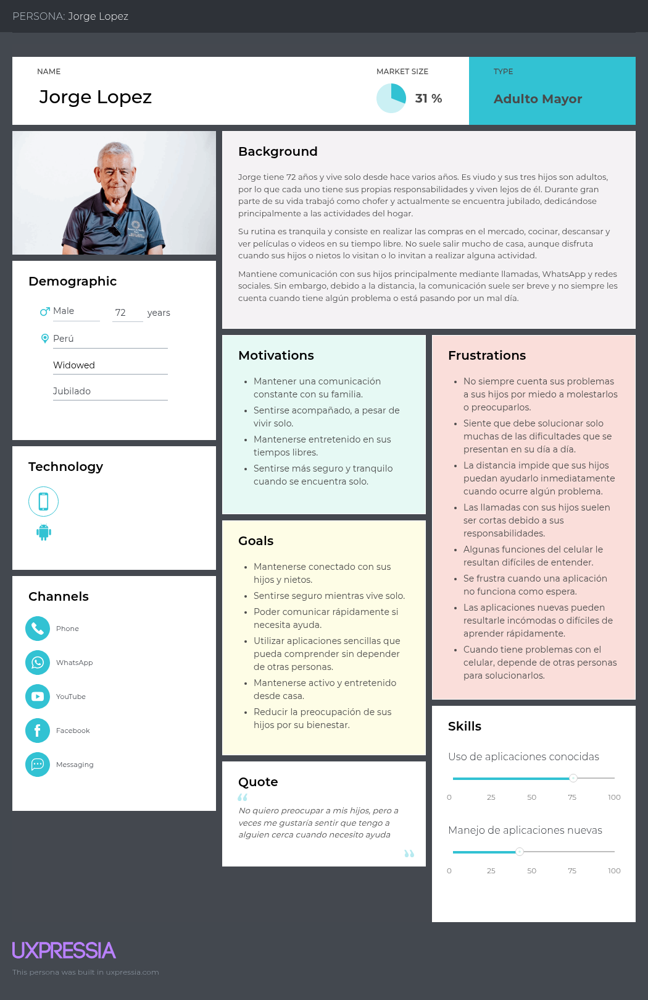
  <br/><i>Imagen 4. User Persona - Primer Segmento.</i>
</div>

### Segmento 2 - Familiares a distancia

<div align="center">
  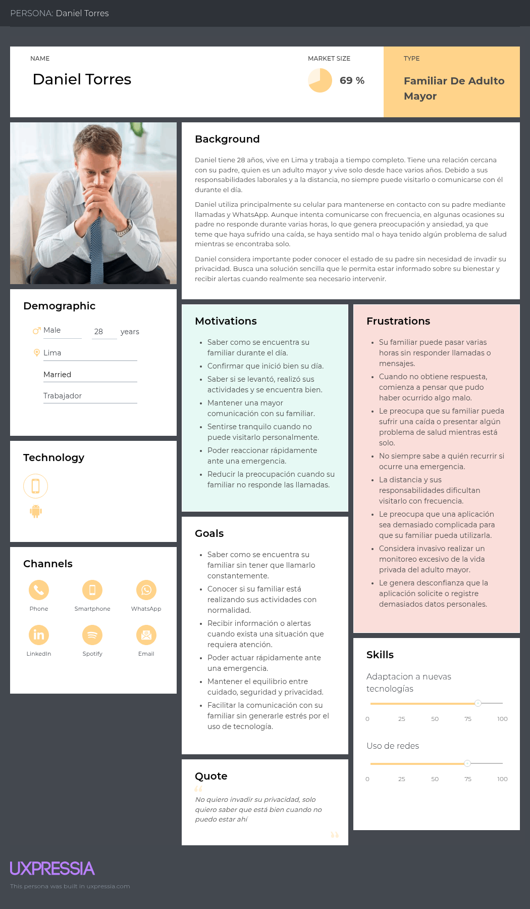
  <br/><i>Imagen 5. User Persona - Segundo Segmento.</i>
</div>

<br>

### 2.3.2. User Task Matrix

En esta sección se concentran las tareas principales que los User Personas deben realizar para cumplir sus objetivos diarios de comunicación, cuidado y bienestar de manera natural y poco invasiva. Para este análisis, hemos considerado a nuestros dos segmentos principales: el Adulto Mayor y el Familiar a distancia.

<br>

#### Segmento 1: Adultos mayores que viven solos

| Tarea | Frecuencia | Importancia |
| :--- | :--- | :--- |
| Reportar su estado de bienestar o responder al check-in diario | Often | High |
| Solicitar ayuda inmediata mediante el botón de auxilio | Rarely | High |
| Grabar y compartir anécdotas, quejas o mensajes de voz | Sometimes | High |
| Atender recordatorios para mantener contacto social con amistades | Sometimes | Medium |
| Ajustar su nivel de interacción (modo simplificado / sin preguntas hoy) | Occasionally | High |
| Revisar recordatorios ligeros sobre rutinas (comidas, salidas) | Often | Medium |

<br>

#### Segmento 2: Familiares a distancia

| Tarea | Frecuencia | Importancia |
| :--- | :--- | :--- |
| Revisar el panel de estado diario (el check-in) del adulto mayor | Often | High |
| Recibir y gestionar alertas ante inactividad o respuestas inusuales | Occasionally | High |
| Escuchar las anécdotas o audios compartidos por el adulto mayor | Sometimes | High |
| Coordinar turnos de llamadas o atención con otros familiares | Sometimes | Medium |
| Registrar notas compartidas de contexto (ej. próximas citas médicas) | Occasionally | Medium |
| Recibir sugerencias de acción o ver los refuerzos positivos del día | Often | Medium |

<br>

**Análisis de Tareas**

Al analizar la matriz, se observa que las tareas con mayor frecuencia e importancia para ambos arquetipos giran en torno al estado diario: el adulto mayor reportando su bienestar (Often/High) y el familiar revisándolo para tener paz mental (Often/High). 

La principal diferencia radica en la naturaleza de su interacción; el adulto mayor se enfoca en la autogestión y en compartir vivencias bajo sus propios términos (ajustar privacidad, grabar audios), mientras que el familiar asume un rol de consumo de información, monitoreo sutil y coordinación logística con otros parientes. La coincidencia más crítica es el alto nivel de importancia que ambos le otorgan tanto al manejo de emergencias (alertas/botón de auxilio) como a la conexión emocional real (compartir y escuchar anécdotas), demostrando que la solución debe equilibrar la seguridad física con la salud mental.

<br>

### 2.3.3. User Journey Mapping

En esta sección se detallan los User Journey Maps en su versión "As-Is", uno por cada segmento de usuario definido. El objetivo de estos mapas es ilustrar el proceso de extremo a extremo que realizan actualmente los usuarios para intentar resolver su necesidad, evidenciando los puntos de dolor, las frustraciones y las ineficiencias que experimentan antes de la implementación de nuestra solución propuesta.

A continuación, se presentan los diagramas que resumen la situación actual de los usuarios: la Imagen 6 corresponde al primer segmento y la Imagen 7, al segundo.

### Segmento 1 - Adultos mayores que viven solos

<div align="center">

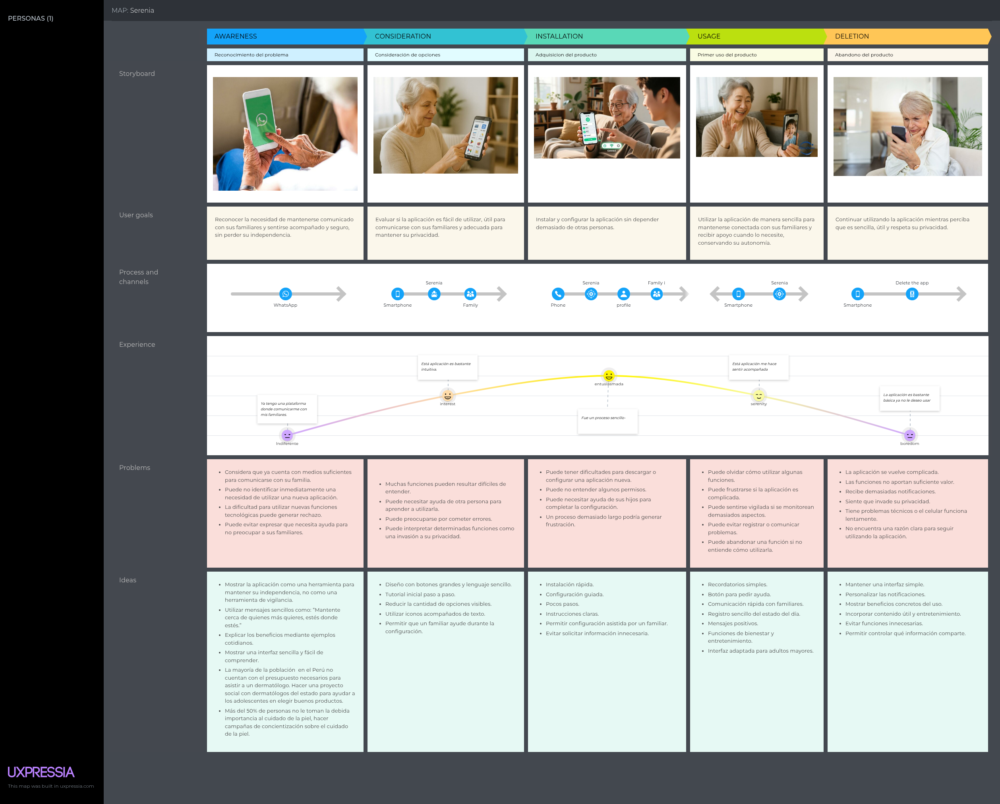
  <br/><i>Imagen 6. User Journey Mapping - Primer Segmento.</i>

</div>


### Segmento 2 - Familiares a distancia

<div align="center">

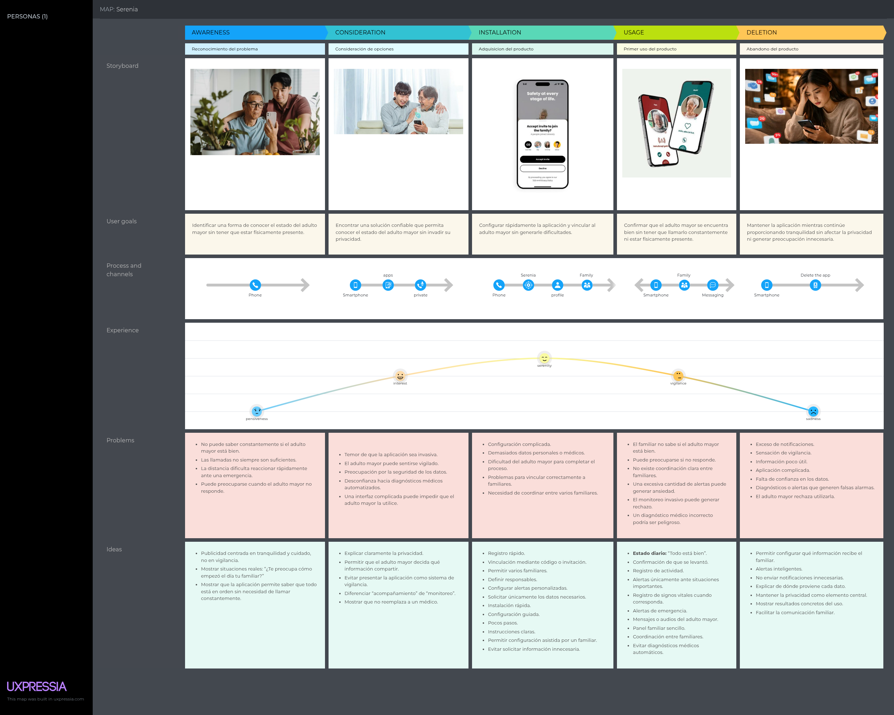
  <br/><i>Imagen 7. User Journey Mapping - Segundo Segmento.</i>

</div>

<br>

### 2.3.4. Empathy Mapping

En esta sección, el equipo resume el proceso de elaboración de los *Empathy Maps* realizados en UXPressia para cada uno de nuestros *User Personas*. Durante sesiones colaborativas, nos centramos en empatizar profundamente con nuestros dos actores principales: el adulto mayor que vive solo y su familiar a distancia. Para lograrlo, respondimos preguntas clave sobre su entorno, sus preocupaciones (Pains) y aquello que aliviaría sus frustraciones y los convencería de que nuestra aplicación es la alternativa correcta para mantener su vínculo (Gains).

A continuación, se presentan las capturas de los mapas resultantes elaborados en la herramienta indicada: la Imagen 8 corresponde al primer segmento y la Imagen 9, al segundo.

### Segmento 1 - Adultos mayores que viven solos

<div align="center">

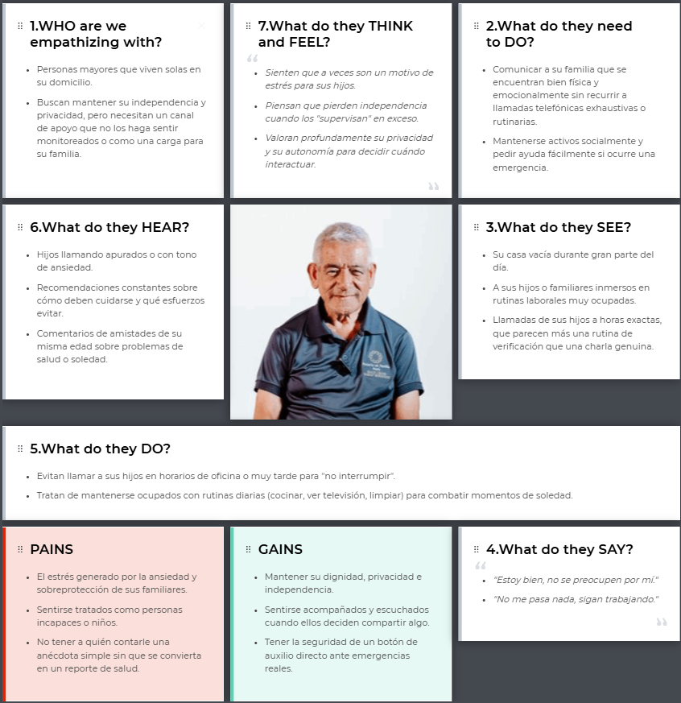
  <br/><i>Imagen 8. Empathy Map - Primer Segmento.</i>

</div>


### Segmento 2 - Familiares a distancia

<div align="center">

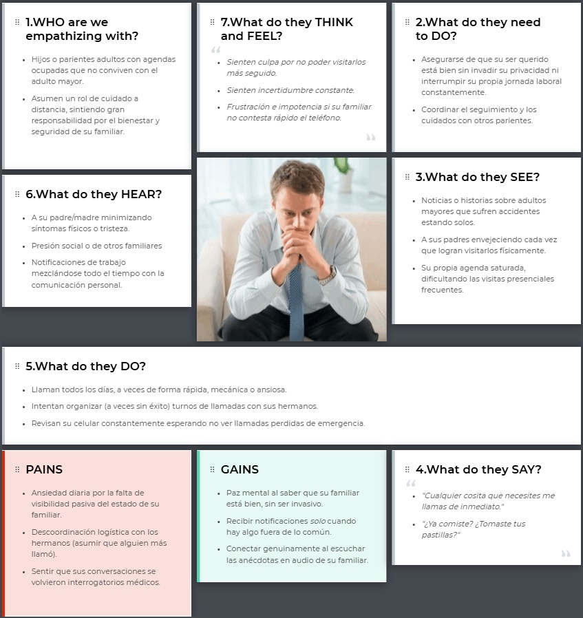
  <br/><i>Imagen 9. Empathy Map - Segundo Segmento.</i>

</div>

<br>


### 2.3.5. Big Picture EventStorming

El equipo realizó una sesión colaborativa de *Big Picture EventStorming* en Miro, con el objetivo de explorar de forma visual el dominio completo de Serenia: desde la vinculación entre el adulto mayor y su familiar, pasando por el check-in diario y su interpretación, hasta el manejo de emergencias y la compañía social. Se identificaron 45 eventos de dominio, redactados en pasado y en inglés siguiendo la convención de nomenclatura adoptada por el equipo, y se ordenaron cronológicamente para cada uno de los procesos identificados. La Imagen 10 muestra el tablero resultante de la sesión.

<br>


URL del tablero en Miro: [https://miro.com/app/board/uXjVHmgj4G8=/](https://miro.com/app/board/uXjVHmgj4G8=/)

<div align="center">

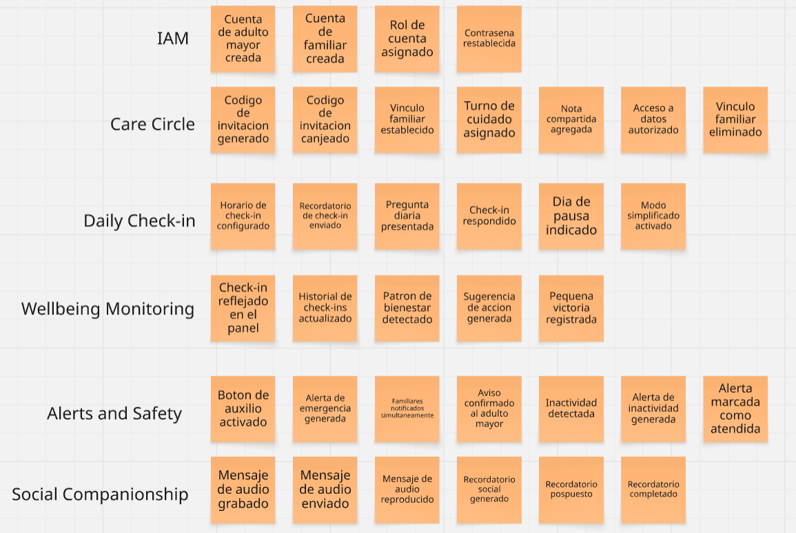
  <br/><i>Imagen 10. Big Picture EventStorming del dominio de Serenia.</i>

</div>

**Procesos clave identificados:**

- Alta y vínculo: la creación de cuentas y el establecimiento del vínculo familiar son el punto de partida obligatorio antes de que cualquier otro proceso pueda ocurrir.
- Check-in diario: el ritual central del lado del adulto mayor, con eventos que reflejan tanto su ejecución habitual como sus excepciones (pausa del día, modo simplificado, check-in no respondido).
- Interpretación de bienestar: un conjunto de eventos de lectura que traducen los check-ins en información útil para el familiar, sin decidir por sí solos si algo es urgente.
- Alertas y seguridad: los eventos más críticos del dominio, tanto por activación directa (botón de auxilio) como por detección pasiva (inactividad).
- Compañía social: eventos desligados de cualquier fin de monitoreo, centrados en el vínculo emocional (audios, recordatorios sociales).

<br>

**Oportunidades y problemas expuestos durante la sesión:**

- Se evidenció que "Relatives Notified Simultaneously" y "Inactivity Alert Generated" comparten el mismo mecanismo de notificación aunque se disparan por causas distintas (activación directa vs. detección pasiva), lo que se debe resolver con cuidado en el diseño técnico para no duplicar lógica.
- Se identificó que la autorización de acceso a los datos de un adulto mayor específico depende del vínculo familiar vigente, por lo que cualquier eliminación de vínculo debe revocar ese acceso de forma inmediata.
- Los eventos se organizaron visualmente en las agrupaciones que el equipo identificó durante la sesión, las cuales se retoman y detallan formalmente como *bounded contexts* en la sección 2.5.1.1 Candidate Context Discover.

<br>

### 2.3.6. Ubiquitous Language

A continuación, se presenta el glosario de términos del dominio del negocio manejados por el equipo, con el fin de mantener una comunicación clara y sin ambigüedades entre todos los miembros del equipo y los stakeholders del proyecto.

<div align="center">

| Término (en inglés) | Definición |
|---|---|
| **Older Adult** (Adulto Mayor) | Persona de edad avanzada que vive sola o pasa la mayor parte del día sin compañía, y que constituye el usuario principal receptor del cuidado y la compañía brindada a través de la aplicación. |
| **Distant Caregiver** (Cuidador a Distancia) | Familiar (hijo, hija, nieto, etc.) que, por motivos de trabajo, distancia geográfica u otras responsabilidades, no puede acompañar físicamente al adulto mayor de forma constante, pero desea mantenerse informado de su bienestar y sentirse presente en su día a día. |
| **Family Circle** (Círculo Familiar) | Conjunto de familiares y cuidadores vinculados a un mismo adulto mayor dentro de la aplicación, quienes comparten la responsabilidad de su cuidado, bienestar y compañía. |
| **Daily Check-in** (Chequeo Diario) | Acción cotidiana mediante la cual el adulto mayor confirma que se encuentra bien, permitiendo a su círculo familiar conocer su estado sin necesidad de una llamada o visita. |
| **Wellbeing Status** (Estado de Bienestar) | Indicador que resume la condición general del adulto mayor en un momento dado (por ejemplo, "bien", "necesita atención" o "sin respuesta"), calculado a partir de sus check-ins diarios y su actividad reciente en la aplicación. |
| **Emergency Alert** (Alerta de Emergencia) | Notificación urgente enviada al círculo familiar cuando el adulto mayor solicita ayuda inmediata o cuando se detecta una ausencia prolongada de actividad que sugiere una posible situación de riesgo. |
| **Social Isolation** (Aislamiento Social) | Situación en la que el adulto mayor carece de contacto frecuente con familiares u otras personas, lo cual incrementa su vulnerabilidad emocional y física, y constituye el problema central que la solución busca mitigar. |
| **Companionship** (Compañía / Acompañamiento) | Sensación de cercanía afectiva y apoyo emocional que se busca generar en el adulto mayor a través de la interacción frecuente con su familia, aun cuando esta no pueda estar físicamente presente. |
| **Voice Message** (Mensaje de Voz/Audio) | Forma de comunicación asíncrona basada en grabaciones de audio, utilizada entre el adulto mayor y su círculo familiar como una alternativa más cercana y accesible que el texto escrito. |
| **Social Contact Reminder** (Recordatorio de Contacto Social) | Aviso programado que motiva al familiar a comunicarse con el adulto mayor, o a este último a interactuar con su círculo familiar, con el fin de mantener una frecuencia de contacto saludable. |
| **Caregiver Coordination** (Coordinación entre Cuidadores) | Proceso mediante el cual los distintos familiares de un mismo círculo se organizan y distribuyen responsabilidades de acompañamiento y supervisión del adulto mayor, evitando la sobrecarga de un solo cuidador. |
| **Peace of Mind** (Tranquilidad) | Estado emocional de calma y confianza que experimenta el familiar cuidador al saber, gracias a la aplicación, que el adulto mayor se encuentra bien, aun estando distante. |
| **Family Bond** (Vínculo Familiar) | Relación afectiva y de cercanía entre el adulto mayor y sus familiares, que la solución busca fortalecer y mantener vigente a pesar de la distancia física. |
| **Autonomy** (Autonomía) | Capacidad del adulto mayor de realizar por sí mismo sus actividades diarias e interactuar con la aplicación sin depender por completo de terceros, respetando su independencia y dignidad. |
| **Invitation Code** (Código de Invitación) | Código que un familiar genera para invitar a otro miembro de la familia a integrarse al círculo familiar de un adulto mayor, estableciendo así el vínculo entre ambas cuentas. |
| **Care Shift** (Turno de Cuidado) | Periodo de tiempo durante el cual un familiar específico asume la responsabilidad principal de estar atento al bienestar del adulto mayor dentro del círculo familiar. |
| **Shared Note** (Nota Compartida) | Anotación breve que un familiar deja disponible para el resto del círculo familiar, con el fin de mantener informados a los demás cuidadores sobre alguna situación particular del adulto mayor. |
| **Simplified Mode** (Modo Simplificado) | Configuración de la interacción del check-in diario pensada para adultos mayores con menor familiaridad tecnológica, que reduce la cantidad de pasos y la complejidad visual necesarios para completar el chequeo. |
| **Pause Day** (Día de Pausa) | Indicación que el adulto mayor puede registrar para señalar, de forma anticipada, que no completará su check-in en una fecha determinada (por ejemplo, por un viaje o una visita familiar), evitando así una alerta innecesaria. |
| **Help Button** (Botón de Ayuda) | Elemento de la aplicación que el adulto mayor puede activar de forma directa e inmediata para solicitar auxilio ante una emergencia, sin depender de la detección pasiva de inactividad. |
| **Inactivity Alert** (Alerta de Inactividad) | Aviso generado automáticamente cuando la aplicación detecta una ausencia prolongada de actividad por parte del adulto mayor, sin que este haya activado el botón de ayuda, y que sugiere una posible situación de riesgo. |
| **Small Win** (Pequeño Logro) | Registro de un avance o comportamiento positivo del adulto mayor (por ejemplo, una racha de check-ins completados) que la aplicación destaca para reforzar su bienestar y motivación. |
| **Wellbeing Trend** (Tendencia de Bienestar) | Lectura de la evolución del estado de bienestar del adulto mayor a lo largo del tiempo, construida a partir del historial de check-ins, que permite al familiar identificar mejoras o retrocesos sostenidos. |
| **Action Suggestion** (Sugerencia de Acción) | Recomendación que la aplicación entrega al familiar a partir de los patrones de bienestar detectados, orientada a motivarlo a tomar una acción concreta de acompañamiento hacia el adulto mayor. |

</div>

<br>

## 2.4. Requirements specification

### 2.4.1. User Stories

En esta sección se presentan los requisitos identificados para Serenia a partir del análisis realizado en las etapas previas de investigación, organizados en Epics y User Stories que reflejan las necesidades del adulto mayor que vive solo, su familiar a distancia y los demás usuarios del producto.

<table>
  <tr>
    <th style="width: 20%;">Epic ID</th>
    <th style="width: 80%;">Nombre del Epic</th>
  </tr>
  <tr>
    <td style="text-align: center;"><strong>EP01</strong></td>
    <td style="text-align: center;">Gestión de Identidad y Vínculo Familiar</td>
  </tr>
  <tr>
    <td style="text-align: center;"><strong>EP02</strong></td>
    <td style="text-align: center;">Check-in Diario y Autonomía del Usuario</td>
  </tr>
  <tr>
    <td style="text-align: center;"><strong>EP03</strong></td>
    <td style="text-align: center;">Mensajería Multimedia Asíncrona</td>
  </tr>
  <tr>
    <td style="text-align: center;"><strong>EP04</strong></td>
    <td style="text-align: center;">Recordatorios de Contacto Social</td>
  </tr>
  <tr>
    <td style="text-align: center;"><strong>EP05</strong></td>
    <td style="text-align: center;">Alertas de Emergencia</td>
  </tr>
  <tr>
    <td style="text-align: center;"><strong>EP06</strong></td>
    <td style="text-align: center;">Panel de Estado y Alertas de Bienestar</td>
  </tr>
  <tr>
    <td style="text-align: center;"><strong>EP07</strong></td>
    <td style="text-align: center;">Coordinación entre Cuidadores Familiares</td>
  </tr>
  <tr>
    <td style="text-align: center;"><strong>EP08</strong></td>
    <td style="text-align: center;">Experiencia Web, Landing Page</td>
  </tr>
  <tr>
    <td style="text-align: center;"><strong>EP09</strong></td>
    <td style="text-align: center;">Calidad y Accesibilidad de la Experiencia</td>
  </tr>
  <tr>
    <td style="text-align: center;"><strong>EP10</strong></td>
    <td style="text-align: center;">Servicios REST</td>
  </tr>
</table>

<br>

<table>
  <tr>
    <th style="width: 20%;">Story ID</th>
    <th style="width: 25%;">User</th>
    <th style="width: 20%;">Priority</th>
    <th style="width: 35%;">Epic</th>
  </tr>
  <tr>
    <td style="text-align: center;"><strong>US01</strong></td>
    <td style="text-align: center;">Adulto mayor que vive solo</td>
    <td style="text-align: center;">High</td>
    <td style="text-align: center;">EP01 – Gestión de Identidad y Vínculo Familiar</td>
  </tr>
  <tr>
    <th>Title</th>
    <td colspan="3"><strong>Registro de cuenta de usuario</strong></td>
  </tr>
  <tr>
    <th colspan="4" style="text-align: center;">Description</th>
  </tr>
  <tr>
    <td colspan="4">Como adulto mayor que vive solo, quiero registrarme en la aplicación con mis datos básicos para acceder al check-in diario y mantenerme comunicado con mi familia.</td>
  </tr>
  <tr>
    <th colspan="4" style="text-align: center;">Acceptance Criteria</th>
  </tr>
  <tr>
    <td colspan="4"><strong>Escenario 1: Registro exitoso</strong><br>- <strong>Dado que</strong> el usuario ingresa a la aplicación por primera vez<br>- <strong>Cuando</strong> completa el formulario de registro con datos válidos y lo confirma<br>- <strong>Entonces</strong> el sistema crea la cuenta<br>- <strong>Y</strong> habilita el acceso a la pantalla principal<br><br><strong>Escenario 2: Datos incompletos o inválidos</strong><br>- <strong>Dado que</strong> el usuario completa el formulario de registro<br>- <strong>Cuando</strong> intenta confirmarlo con campos obligatorios vacíos o con formato incorrecto<br>- <strong>Entonces</strong> el sistema rechaza el registro<br>- <strong>Y</strong> indica los campos que requieren corrección</td>
  </tr>
</table>

<br>

<table>
  <tr>
    <th style="width: 20%;">Story ID</th>
    <th style="width: 25%;">User</th>
    <th style="width: 20%;">Priority</th>
    <th style="width: 35%;">Epic</th>
  </tr>
  <tr>
    <td style="text-align: center;"><strong>US02</strong></td>
    <td style="text-align: center;">Familiar a distancia</td>
    <td style="text-align: center;">High</td>
    <td style="text-align: center;">EP01 – Gestión de Identidad y Vínculo Familiar</td>
  </tr>
  <tr>
    <th>Title</th>
    <td colspan="3"><strong>Vinculación familiar por código de invitación</strong></td>
  </tr>
  <tr>
    <th colspan="4" style="text-align: center;">Description</th>
  </tr>
  <tr>
    <td colspan="4">Como familiar a distancia, quiero vincular mi cuenta con la de mi adulto mayor mediante un código de invitación para acceder a su panel de estado y recibir sus alertas.</td>
  </tr>
  <tr>
    <th colspan="4" style="text-align: center;">Acceptance Criteria</th>
  </tr>
  <tr>
    <td colspan="4"><strong>Escenario 1: Vinculación exitosa</strong><br>- <strong>Dado que</strong> el familiar dispone del código de invitación generado por el adulto mayor<br>- <strong>Cuando</strong> ingresa el código y confirma la solicitud<br>- <strong>Entonces</strong> el sistema registra el vínculo familiar<br>- <strong>Y</strong> habilita el acceso al panel de estado del adulto mayor<br><br><strong>Escenario 2: Código inválido o expirado</strong><br>- <strong>Dado que</strong> el familiar ingresa un código de invitación<br>- <strong>Cuando</strong> el código no corresponde a ningún adulto mayor o ya fue utilizado<br>- <strong>Entonces</strong> el sistema rechaza la vinculación<br>- <strong>Y</strong> informa que el código no es válido</td>
  </tr>
</table>

<br>

<table>
  <tr>
    <th style="width: 20%;">Story ID</th>
    <th style="width: 25%;">User</th>
    <th style="width: 20%;">Priority</th>
    <th style="width: 35%;">Epic</th>
  </tr>
  <tr>
    <td style="text-align: center;"><strong>US03</strong></td>
    <td style="text-align: center;">Adulto mayor que vive solo</td>
    <td style="text-align: center;">High</td>
    <td style="text-align: center;">EP02 – Check-in Diario y Autonomía del Usuario</td>
  </tr>
  <tr>
    <th>Title</th>
    <td colspan="3"><strong>Registro de respuesta del check-in diario</strong></td>
  </tr>
  <tr>
    <th colspan="4" style="text-align: center;">Description</th>
  </tr>
  <tr>
    <td colspan="4">Como adulto mayor que vive solo, quiero responder con un solo toque la pregunta diaria sobre cómo me siento para comunicar mi bienestar sin depender de una llamada telefónica.</td>
  </tr>
  <tr>
    <th colspan="4" style="text-align: center;">Acceptance Criteria</th>
  </tr>
  <tr>
    <td colspan="4"><strong>Escenario 1: Check-in respondido</strong><br>- <strong>Dado que</strong> el sistema presenta la pregunta del check-in del día<br>- <strong>Cuando</strong> el usuario selecciona una de las respuestas disponibles<br>- <strong>Entonces</strong> el sistema registra la respuesta con su fecha y hora<br>- <strong>Y</strong> la pone a disposición de los familiares vinculados<br><br><strong>Escenario 2: Check-in no respondido</strong><br>- <strong>Dado que</strong> el sistema presentó la pregunta del check-in del día<br>- <strong>Cuando</strong> transcurre el tiempo límite a partir del horario configurado sin recibir respuesta<br>- <strong>Entonces</strong> el sistema marca el check-in del día como no respondido</td>
  </tr>
</table>

<br>

<table>
  <tr>
    <th style="width: 20%;">Story ID</th>
    <th style="width: 25%;">User</th>
    <th style="width: 20%;">Priority</th>
    <th style="width: 35%;">Epic</th>
  </tr>
  <tr>
    <td style="text-align: center;"><strong>US04</strong></td>
    <td style="text-align: center;">Adulto mayor que vive solo</td>
    <td style="text-align: center;">High</td>
    <td style="text-align: center;">EP02 – Check-in Diario y Autonomía del Usuario</td>
  </tr>
  <tr>
    <th>Title</th>
    <td colspan="3"><strong>Notificación programada del check-in diario</strong></td>
  </tr>
  <tr>
    <th colspan="4" style="text-align: center;">Description</th>
  </tr>
  <tr>
    <td colspan="4">Como adulto mayor que vive solo, quiero recibir una notificación en el horario habitual para responder mi check-in sin tener que recordar abrir la aplicación.</td>
  </tr>
  <tr>
    <th colspan="4" style="text-align: center;">Acceptance Criteria</th>
  </tr>
  <tr>
    <td colspan="4"><strong>Escenario 1: Notificación enviada</strong><br>- <strong>Dado que</strong> se alcanza el horario configurado para el check-in del usuario<br>- <strong>Cuando</strong> el sistema verifica que el check-in del día sigue pendiente<br>- <strong>Entonces</strong> el sistema envía una notificación invitando a responderlo<br><br><strong>Escenario 2: Check-in ya respondido</strong><br>- <strong>Dado que</strong> el usuario respondió su check-in antes del horario configurado<br>- <strong>Cuando</strong> se alcanza dicho horario<br>- <strong>Entonces</strong> el sistema omite el envío de la notificación<br><br><strong>Escenario 3: Preguntas pausadas</strong><br>- <strong>Dado que</strong> el usuario activó la pausa de preguntas para el día en curso<br>- <strong>Cuando</strong> se alcanza el horario configurado<br>- <strong>Entonces</strong> el sistema omite el envío de la notificación</td>
  </tr>
</table>

<br>

<table>
  <tr>
    <th style="width: 20%;">Story ID</th>
    <th style="width: 25%;">User</th>
    <th style="width: 20%;">Priority</th>
    <th style="width: 35%;">Epic</th>
  </tr>
  <tr>
    <td style="text-align: center;"><strong>US05</strong></td>
    <td style="text-align: center;">Adulto mayor que vive solo</td>
    <td style="text-align: center;">Medium</td>
    <td style="text-align: center;">EP02 – Check-in Diario y Autonomía del Usuario</td>
  </tr>
  <tr>
    <th>Title</th>
    <td colspan="3"><strong>Configuración del horario del check-in</strong></td>
  </tr>
  <tr>
    <th colspan="4" style="text-align: center;">Description</th>
  </tr>
  <tr>
    <td colspan="4">Como adulto mayor que vive solo, quiero definir a qué hora del día se me consulta cómo me siento para que el check-in se ajuste a mi rutina.</td>
  </tr>
  <tr>
    <th colspan="4" style="text-align: center;">Acceptance Criteria</th>
  </tr>
  <tr>
    <td colspan="4"><strong>Escenario 1: Horario actualizado</strong><br>- <strong>Dado que</strong> el usuario accede a la configuración de su check-in<br>- <strong>Cuando</strong> selecciona un nuevo horario dentro del rango permitido y lo confirma<br>- <strong>Entonces</strong> el sistema guarda el horario<br>- <strong>Y</strong> lo aplica a partir del siguiente check-in<br><br><strong>Escenario 2: Horario fuera del rango permitido</strong><br>- <strong>Dado que</strong> el usuario selecciona un horario fuera del rango permitido por la aplicación<br>- <strong>Cuando</strong> confirma el cambio<br>- <strong>Entonces</strong> el sistema rechaza la configuración<br>- <strong>Y</strong> informa el rango de horarios válido</td>
  </tr>
</table>

<br>

<table>
  <tr>
    <th style="width: 20%;">Story ID</th>
    <th style="width: 25%;">User</th>
    <th style="width: 20%;">Priority</th>
    <th style="width: 35%;">Epic</th>
  </tr>
  <tr>
    <td style="text-align: center;"><strong>US06</strong></td>
    <td style="text-align: center;">Adulto mayor que vive solo</td>
    <td style="text-align: center;">Low</td>
    <td style="text-align: center;">EP02 – Check-in Diario y Autonomía del Usuario</td>
  </tr>
  <tr>
    <th>Title</th>
    <td colspan="3"><strong>Rotación de preguntas del check-in</strong></td>
  </tr>
  <tr>
    <th colspan="4" style="text-align: center;">Description</th>
  </tr>
  <tr>
    <td colspan="4">Como adulto mayor que vive solo, quiero que las preguntas del check-in varíen entre días para que la interacción se perciba como una conversación y no como un control repetitivo.</td>
  </tr>
  <tr>
    <th colspan="4" style="text-align: center;">Acceptance Criteria</th>
  </tr>
  <tr>
    <td colspan="4"><strong>Escenario 1: Pregunta distinta a la del día anterior</strong><br>- <strong>Dado que</strong> el usuario recibe el check-in de un nuevo día<br>- <strong>Cuando</strong> el sistema selecciona la pregunta a presentar<br>- <strong>Entonces</strong> el sistema presenta una pregunta distinta a la del día inmediatamente anterior<br><br><strong>Escenario 2: Rotación dentro del conjunto disponible</strong><br>- <strong>Dado que</strong> existe un conjunto de preguntas configuradas para el check-in<br>- <strong>Cuando</strong> el sistema construye el check-in del día<br>- <strong>Entonces</strong> el sistema evita repetir una pregunta utilizada recientemente dentro de ese conjunto</td>
  </tr>
</table>

<br>

<table>
  <tr>
    <th style="width: 20%;">Story ID</th>
    <th style="width: 25%;">User</th>
    <th style="width: 20%;">Priority</th>
    <th style="width: 35%;">Epic</th>
  </tr>
  <tr>
    <td style="text-align: center;"><strong>US07</strong></td>
    <td style="text-align: center;">Adulto mayor que vive solo</td>
    <td style="text-align: center;">Medium</td>
    <td style="text-align: center;">EP02 – Check-in Diario y Autonomía del Usuario</td>
  </tr>
  <tr>
    <th>Title</th>
    <td colspan="3"><strong>Pausa diaria de preguntas</strong></td>
  </tr>
  <tr>
    <th colspan="4" style="text-align: center;">Description</th>
  </tr>
  <tr>
    <td colspan="4">Como adulto mayor que vive solo, quiero indicar que hoy no deseo recibir preguntas para conservar el control sobre mi propia disposición a comunicarme.</td>
  </tr>
  <tr>
    <th colspan="4" style="text-align: center;">Acceptance Criteria</th>
  </tr>
  <tr>
    <td colspan="4"><strong>Escenario 1: Pausa activada</strong><br>- <strong>Dado que</strong> el usuario decide no recibir preguntas durante el día en curso<br>- <strong>Cuando</strong> activa la opción de pausar las preguntas<br>- <strong>Entonces</strong> el sistema omite el check-in del día<br>- <strong>Y</strong> informa a los familiares vinculados que el usuario optó por no participar hoy<br><br><strong>Escenario 2: Reanudación automática</strong><br>- <strong>Dado que</strong> el usuario activó la pausa de preguntas para el día en curso<br>- <strong>Cuando</strong> inicia un nuevo día<br>- <strong>Entonces</strong> el sistema reanuda el envío del check-in diario</td>
  </tr>
</table>

<br>

<table>
  <tr>
    <th style="width: 20%;">Story ID</th>
    <th style="width: 25%;">User</th>
    <th style="width: 20%;">Priority</th>
    <th style="width: 35%;">Epic</th>
  </tr>
  <tr>
    <td style="text-align: center;"><strong>US08</strong></td>
    <td style="text-align: center;">Adulto mayor que vive solo</td>
    <td style="text-align: center;">Medium</td>
    <td style="text-align: center;">EP02 – Check-in Diario y Autonomía del Usuario</td>
  </tr>
  <tr>
    <th>Title</th>
    <td colspan="3"><strong>Modo simplificado de interfaz</strong></td>
  </tr>
  <tr>
    <th colspan="4" style="text-align: center;">Description</th>
  </tr>
  <tr>
    <td colspan="4">Como adulto mayor que vive solo, quiero activar un modo con menos opciones en pantalla para interactuar de forma mínima en los días de menor energía.</td>
  </tr>
  <tr>
    <th colspan="4" style="text-align: center;">Acceptance Criteria</th>
  </tr>
  <tr>
    <td colspan="4"><strong>Escenario 1: Modo simplificado activado</strong><br>- <strong>Dado que</strong> el usuario accede a la configuración de su cuenta<br>- <strong>Cuando</strong> activa la opción de modo simplificado<br>- <strong>Entonces</strong> el sistema reduce las funcionalidades visibles a las necesarias para completar el check-in diario<br><br><strong>Escenario 2: Modo simplificado desactivado</strong><br>- <strong>Dado que</strong> el usuario tiene activado el modo simplificado<br>- <strong>Cuando</strong> selecciona desactivarlo<br>- <strong>Entonces</strong> el sistema restablece el conjunto completo de funcionalidades disponibles</td>
  </tr>
</table>

<br>

<table>
  <tr>
    <th style="width: 20%;">Story ID</th>
    <th style="width: 25%;">User</th>
    <th style="width: 20%;">Priority</th>
    <th style="width: 35%;">Epic</th>
  </tr>
  <tr>
    <td style="text-align: center;"><strong>US09</strong></td>
    <td style="text-align: center;">Adulto mayor que vive solo</td>
    <td style="text-align: center;">Medium</td>
    <td style="text-align: center;">EP03 – Mensajería Multimedia Asíncrona</td>
  </tr>
  <tr>
    <th>Title</th>
    <td colspan="3"><strong>Grabación y envío de mensaje de audio</strong></td>
  </tr>
  <tr>
    <th colspan="4" style="text-align: center;">Description</th>
  </tr>
  <tr>
    <td colspan="4">Como adulto mayor que vive solo, quiero grabar un audio breve sobre mi día para compartir un mensaje personal con mi familia sin depender de una llamada.</td>
  </tr>
  <tr>
    <th colspan="4" style="text-align: center;">Acceptance Criteria</th>
  </tr>
  <tr>
    <td colspan="4"><strong>Escenario 1: Audio enviado</strong><br>- <strong>Dado que</strong> el usuario graba un audio en el espacio de mensajes personales<br>- <strong>Cuando</strong> confirma el envío<br>- <strong>Entonces</strong> el sistema almacena el audio<br>- <strong>Y</strong> lo pone a disposición de los familiares vinculados<br><br><strong>Escenario 2: Grabación cancelada</strong><br>- <strong>Dado que</strong> el usuario se encuentra grabando un audio<br>- <strong>Cuando</strong> cancela la grabación antes de confirmarla<br>- <strong>Entonces</strong> el sistema descarta el audio<br>- <strong>Y</strong> no lo comparte con los familiares vinculados</td>
  </tr>
</table>

<br>

<table>
  <tr>
    <th style="width: 20%;">Story ID</th>
    <th style="width: 25%;">User</th>
    <th style="width: 20%;">Priority</th>
    <th style="width: 35%;">Epic</th>
  </tr>
  <tr>
    <td style="text-align: center;"><strong>US10</strong></td>
    <td style="text-align: center;">Familiar a distancia</td>
    <td style="text-align: center;">Medium</td>
    <td style="text-align: center;">EP03 – Mensajería Multimedia Asíncrona</td>
  </tr>
  <tr>
    <th>Title</th>
    <td colspan="3"><strong>Reproducción de mensajes de audio recibidos</strong></td>
  </tr>
  <tr>
    <th colspan="4" style="text-align: center;">Description</th>
  </tr>
  <tr>
    <td colspan="4">Como familiar a distancia, quiero reproducir los audios que comparte mi adulto mayor para conocer cómo estuvo su día de una forma más cercana que un indicador de estado.</td>
  </tr>
  <tr>
    <th colspan="4" style="text-align: center;">Acceptance Criteria</th>
  </tr>
  <tr>
    <td colspan="4"><strong>Escenario 1: Reproducción exitosa</strong><br>- <strong>Dado que</strong> el adulto mayor vinculado compartió un audio<br>- <strong>Cuando</strong> el familiar accede a la sección de mensajes de audio y selecciona uno<br>- <strong>Entonces</strong> el sistema reproduce el audio seleccionado<br><br><strong>Escenario 2: Sin audios disponibles</strong><br>- <strong>Dado que</strong> el adulto mayor vinculado no ha compartido audios<br>- <strong>Cuando</strong> el familiar accede a la sección de mensajes de audio<br>- <strong>Entonces</strong> el sistema informa que aún no hay audios disponibles</td>
  </tr>
</table>

<br>

<table>
  <tr>
    <th style="width: 20%;">Story ID</th>
    <th style="width: 25%;">User</th>
    <th style="width: 20%;">Priority</th>
    <th style="width: 35%;">Epic</th>
  </tr>
  <tr>
    <td style="text-align: center;"><strong>US11</strong></td>
    <td style="text-align: center;">Adulto mayor que vive solo</td>
    <td style="text-align: center;">Low</td>
    <td style="text-align: center;">EP04 – Recordatorios de Contacto Social</td>
  </tr>
  <tr>
    <th>Title</th>
    <td colspan="3"><strong>Notificación de recordatorio de contacto social</strong></td>
  </tr>
  <tr>
    <th colspan="4" style="text-align: center;">Description</th>
  </tr>
  <tr>
    <td colspan="4">Como adulto mayor que vive solo, quiero recibir recordatorios para contactar a una amistad o asistir a una actividad social para mantener mi vida social activa y no solo mi seguridad física.</td>
  </tr>
  <tr>
    <th colspan="4" style="text-align: center;">Acceptance Criteria</th>
  </tr>
  <tr>
    <td colspan="4"><strong>Escenario 1: Recordatorio presentado</strong><br>- <strong>Dado que</strong> existe un recordatorio de contacto social programado para el día en curso<br>- <strong>Cuando</strong> se alcanza la hora programada<br>- <strong>Entonces</strong> el sistema presenta el recordatorio al usuario<br><br><strong>Escenario 2: Recordatorio completado</strong><br>- <strong>Dado que</strong> el sistema presentó un recordatorio de contacto social<br>- <strong>Cuando</strong> el usuario indica que ya lo realizó<br>- <strong>Entonces</strong> el sistema marca el recordatorio como completado<br>- <strong>Y</strong> no vuelve a presentarlo durante el día</td>
  </tr>
</table>

<br>

<table>
  <tr>
    <th style="width: 20%;">Story ID</th>
    <th style="width: 25%;">User</th>
    <th style="width: 20%;">Priority</th>
    <th style="width: 35%;">Epic</th>
  </tr>
  <tr>
    <td style="text-align: center;"><strong>US12</strong></td>
    <td style="text-align: center;">Adulto mayor que vive solo</td>
    <td style="text-align: center;">Low</td>
    <td style="text-align: center;">EP04 – Recordatorios de Contacto Social</td>
  </tr>
  <tr>
    <th>Title</th>
    <td colspan="3"><strong>Postergación de recordatorio de contacto social</strong></td>
  </tr>
  <tr>
    <th colspan="4" style="text-align: center;">Description</th>
  </tr>
  <tr>
    <td colspan="4">Como adulto mayor que vive solo, quiero posponer un recordatorio en lugar de descartarlo para no percibir como una falta el no poder atenderlo en ese momento.</td>
  </tr>
  <tr>
    <th colspan="4" style="text-align: center;">Acceptance Criteria</th>
  </tr>
  <tr>
    <td colspan="4"><strong>Escenario 1: Recordatorio pospuesto</strong><br>- <strong>Dado que</strong> el sistema presenta un recordatorio de contacto social<br>- <strong>Cuando</strong> el usuario selecciona posponerlo<br>- <strong>Entonces</strong> el sistema lo reprograma para un momento posterior del mismo día<br><br><strong>Escenario 2: Recordatorio pospuesto sin atender</strong><br>- <strong>Dado que</strong> un recordatorio fue pospuesto dentro del día en curso<br>- <strong>Cuando</strong> finaliza el día sin que el usuario interactúe con él<br>- <strong>Entonces</strong> el sistema lo marca como no completado</td>
  </tr>
</table>

<br>

<table>
  <tr>
    <th style="width: 20%;">Story ID</th>
    <th style="width: 25%;">User</th>
    <th style="width: 20%;">Priority</th>
    <th style="width: 35%;">Epic</th>
  </tr>
  <tr>
    <td style="text-align: center;"><strong>US13</strong></td>
    <td style="text-align: center;">Adulto mayor que vive solo</td>
    <td style="text-align: center;">High</td>
    <td style="text-align: center;">EP05 – Alertas de Emergencia</td>
  </tr>
  <tr>
    <th>Title</th>
    <td colspan="3"><strong>Activación del botón de auxilio</strong></td>
  </tr>
  <tr>
    <th colspan="4" style="text-align: center;">Description</th>
  </tr>
  <tr>
    <td colspan="4">Como adulto mayor que vive solo, quiero solicitar ayuda de forma inmediata ante una emergencia para contar con el respaldo de mi familia en cualquier momento del día.</td>
  </tr>
  <tr>
    <th colspan="4" style="text-align: center;">Acceptance Criteria</th>
  </tr>
  <tr>
    <td colspan="4"><strong>Escenario 1: Auxilio activado</strong><br>- <strong>Dado que</strong> el usuario se encuentra en una situación de emergencia<br>- <strong>Cuando</strong> activa el botón de auxilio<br>- <strong>Entonces</strong> el sistema registra la activación<br>- <strong>Y</strong> notifica de inmediato a los familiares vinculados<br><br><strong>Escenario 2: Confirmación al usuario</strong><br>- <strong>Dado que</strong> el usuario activó el botón de auxilio<br>- <strong>Cuando</strong> el sistema completa el envío de la alerta<br>- <strong>Entonces</strong> el sistema confirma al usuario que su familia fue notificada<br><br><strong>Escenario 3: Sin familiares vinculados</strong><br>- <strong>Dado que</strong> el usuario activó el botón de auxilio<br>- <strong>Cuando</strong> el sistema verifica que no tiene familiares vinculados<br>- <strong>Entonces</strong> el sistema no puede entregar la alerta<br>- <strong>Y</strong> informa al usuario que su alerta no pudo ser enviada</td>
  </tr>
</table>

<br>

<table>
  <tr>
    <th style="width: 20%;">Story ID</th>
    <th style="width: 25%;">User</th>
    <th style="width: 20%;">Priority</th>
    <th style="width: 35%;">Epic</th>
  </tr>
  <tr>
    <td style="text-align: center;"><strong>US14</strong></td>
    <td style="text-align: center;">Familiar a distancia</td>
    <td style="text-align: center;">High</td>
    <td style="text-align: center;">EP05 – Alertas de Emergencia</td>
  </tr>
  <tr>
    <th>Title</th>
    <td colspan="3"><strong>Recepción de alerta de emergencia</strong></td>
  </tr>
  <tr>
    <th colspan="4" style="text-align: center;">Description</th>
  </tr>
  <tr>
    <td colspan="4">Como familiar a distancia, quiero recibir una alerta inmediata cuando mi adulto mayor activa el botón de auxilio para poder actuar sin demora.</td>
  </tr>
  <tr>
    <th colspan="4" style="text-align: center;">Acceptance Criteria</th>
  </tr>
  <tr>
    <td colspan="4"><strong>Escenario 1: Alerta recibida</strong><br>- <strong>Dado que</strong> el adulto mayor vinculado activa el botón de auxilio<br>- <strong>Cuando</strong> el sistema procesa la activación<br>- <strong>Entonces</strong> el sistema notifica al familiar<br>- <strong>Y</strong> incluye la fecha y hora de la activación<br><br><strong>Escenario 2: Notificación a múltiples familiares</strong><br>- <strong>Dado que</strong> el adulto mayor tiene más de un familiar vinculado<br>- <strong>Cuando</strong> se registra una alerta de emergencia<br>- <strong>Entonces</strong> el sistema notifica a todos los familiares vinculados de forma simultánea</td>
  </tr>
</table>

<br>

<table>
  <tr>
    <th style="width: 20%;">Story ID</th>
    <th style="width: 25%;">User</th>
    <th style="width: 20%;">Priority</th>
    <th style="width: 35%;">Epic</th>
  </tr>
  <tr>
    <td style="text-align: center;"><strong>US15</strong></td>
    <td style="text-align: center;">Familiar a distancia</td>
    <td style="text-align: center;">High</td>
    <td style="text-align: center;">EP06 – Panel de Estado y Alertas de Bienestar</td>
  </tr>
  <tr>
    <th>Title</th>
    <td colspan="3"><strong>Consulta del panel de estado diario</strong></td>
  </tr>
  <tr>
    <th colspan="4" style="text-align: center;">Description</th>
  </tr>
  <tr>
    <td colspan="4">Como familiar a distancia, quiero consultar el estado diario de mi adulto mayor para saber si completó su check-in y cómo se sintió sin necesidad de llamarlo.</td>
  </tr>
  <tr>
    <th colspan="4" style="text-align: center;">Acceptance Criteria</th>
  </tr>
  <tr>
    <td colspan="4"><strong>Escenario 1: Check-in disponible</strong><br>- <strong>Dado que</strong> el adulto mayor vinculado respondió su check-in del día<br>- <strong>Cuando</strong> el familiar accede al panel de estado<br>- <strong>Entonces</strong> el sistema muestra la respuesta registrada junto con su fecha y hora<br><br><strong>Escenario 2: Check-in pendiente</strong><br>- <strong>Dado que</strong> el adulto mayor vinculado no ha respondido su check-in del día<br>- <strong>Cuando</strong> el familiar accede al panel de estado<br>- <strong>Entonces</strong> el sistema indica que el check-in del día se encuentra pendiente</td>
  </tr>
</table>

<br>

<table>
  <tr>
    <th style="width: 20%;">Story ID</th>
    <th style="width: 25%;">User</th>
    <th style="width: 20%;">Priority</th>
    <th style="width: 35%;">Epic</th>
  </tr>
  <tr>
    <td style="text-align: center;"><strong>US16</strong></td>
    <td style="text-align: center;">Familiar a distancia</td>
    <td style="text-align: center;">High</td>
    <td style="text-align: center;">EP06 – Panel de Estado y Alertas de Bienestar</td>
  </tr>
  <tr>
    <th>Title</th>
    <td colspan="3"><strong>Alerta por inactividad del check-in</strong></td>
  </tr>
  <tr>
    <th colspan="4" style="text-align: center;">Description</th>
  </tr>
  <tr>
    <td colspan="4">Como familiar a distancia, quiero recibir una alerta únicamente cuando algo se sale de lo habitual para no tener que revisar la aplicación durante todo el día.</td>
  </tr>
  <tr>
    <th colspan="4" style="text-align: center;">Acceptance Criteria</th>
  </tr>
  <tr>
    <td colspan="4"><strong>Escenario 1: Check-in no respondido</strong><br>- <strong>Dado que</strong> el adulto mayor vinculado no respondió su check-in dentro del tiempo límite a partir de su horario configurado<br>- <strong>Cuando</strong> el sistema evalúa el estado del día<br>- <strong>Entonces</strong> el sistema genera una alerta de inactividad para el familiar<br><br><strong>Escenario 2: Respuesta dentro de lo habitual</strong><br>- <strong>Dado que</strong> el adulto mayor vinculado respondió su check-in dentro de un rango considerado habitual<br>- <strong>Cuando</strong> el sistema procesa la respuesta<br>- <strong>Entonces</strong> el sistema no genera ninguna alerta<br><br><strong>Escenario 3: Preguntas pausadas por el usuario</strong><br>- <strong>Dado que</strong> el adulto mayor vinculado activó la pausa de preguntas para el día en curso<br>- <strong>Cuando</strong> finaliza el día sin un check-in registrado<br>- <strong>Entonces</strong> el sistema no genera una alerta de inactividad</td>
  </tr>
</table>

<br>

<table>
  <tr>
    <th style="width: 20%;">Story ID</th>
    <th style="width: 25%;">User</th>
    <th style="width: 20%;">Priority</th>
    <th style="width: 35%;">Epic</th>
  </tr>
  <tr>
    <td style="text-align: center;"><strong>US17</strong></td>
    <td style="text-align: center;">Familiar a distancia</td>
    <td style="text-align: center;">Medium</td>
    <td style="text-align: center;">EP06 – Panel de Estado y Alertas de Bienestar</td>
  </tr>
  <tr>
    <th>Title</th>
    <td colspan="3"><strong>Historial de check-ins del adulto mayor</strong></td>
  </tr>
  <tr>
    <th colspan="4" style="text-align: center;">Description</th>
  </tr>
  <tr>
    <td colspan="4">Como familiar a distancia, quiero consultar los check-ins de días anteriores para identificar patrones y no limitarme al estado del día en curso.</td>
  </tr>
  <tr>
    <th colspan="4" style="text-align: center;">Acceptance Criteria</th>
  </tr>
  <tr>
    <td colspan="4"><strong>Escenario 1: Historial disponible</strong><br>- <strong>Dado que</strong> el adulto mayor vinculado cuenta con check-ins registrados en días anteriores<br>- <strong>Cuando</strong> el familiar accede al historial<br>- <strong>Entonces</strong> el sistema muestra las respuestas ordenadas por fecha<br><br><strong>Escenario 2: Sin registros previos</strong><br>- <strong>Dado que</strong> el adulto mayor vinculado no cuenta con check-ins previos<br>- <strong>Cuando</strong> el familiar accede al historial<br>- <strong>Entonces</strong> el sistema informa que aún no existen registros disponibles</td>
  </tr>
</table>

<br>

<table>
  <tr>
    <th style="width: 20%;">Story ID</th>
    <th style="width: 25%;">User</th>
    <th style="width: 20%;">Priority</th>
    <th style="width: 35%;">Epic</th>
  </tr>
  <tr>
    <td style="text-align: center;"><strong>US18</strong></td>
    <td style="text-align: center;">Familiar a distancia</td>
    <td style="text-align: center;">Low</td>
    <td style="text-align: center;">EP06 – Panel de Estado y Alertas de Bienestar</td>
  </tr>
  <tr>
    <th>Title</th>
    <td colspan="3"><strong>Sugerencia de acción por patrón de malestar</strong></td>
  </tr>
  <tr>
    <th colspan="4" style="text-align: center;">Description</th>
  </tr>
  <tr>
    <td colspan="4">Como familiar a distancia, quiero recibir una sugerencia cuando mi adulto mayor reporta malestar durante varios días seguidos para saber cuándo es oportuno llamarlo o visitarlo.</td>
  </tr>
  <tr>
    <th colspan="4" style="text-align: center;">Acceptance Criteria</th>
  </tr>
  <tr>
    <td colspan="4"><strong>Escenario 1: Patrón detectado</strong><br>- <strong>Dado que</strong> el adulto mayor vinculado reporta malestar durante varios días consecutivos<br>- <strong>Cuando</strong> el sistema evalúa sus respuestas recientes<br>- <strong>Entonces</strong> el sistema genera una sugerencia de acción para el familiar<br><br><strong>Escenario 2: Sin patrón sostenido</strong><br>- <strong>Dado que</strong> el adulto mayor vinculado no presenta un patrón sostenido de malestar<br>- <strong>Cuando</strong> el sistema evalúa sus respuestas recientes<br>- <strong>Entonces</strong> el sistema no genera ninguna sugerencia</td>
  </tr>
</table>

<br>

<table>
  <tr>
    <th style="width: 20%;">Story ID</th>
    <th style="width: 25%;">User</th>
    <th style="width: 20%;">Priority</th>
    <th style="width: 35%;">Epic</th>
  </tr>
  <tr>
    <td style="text-align: center;"><strong>US19</strong></td>
    <td style="text-align: center;">Familiar a distancia</td>
    <td style="text-align: center;">Low</td>
    <td style="text-align: center;">EP06 – Panel de Estado y Alertas de Bienestar</td>
  </tr>
  <tr>
    <th>Title</th>
    <td colspan="3"><strong>Registro de pequeñas victorias</strong></td>
  </tr>
  <tr>
    <th colspan="4" style="text-align: center;">Description</th>
  </tr>
  <tr>
    <td colspan="4">Como familiar a distancia, quiero visualizar los días buenos y las actividades positivas de mi adulto mayor para reforzar lo positivo y no recibir únicamente alertas.</td>
  </tr>
  <tr>
    <th colspan="4" style="text-align: center;">Acceptance Criteria</th>
  </tr>
  <tr>
    <td colspan="4"><strong>Escenario 1: Victorias disponibles</strong><br>- <strong>Dado que</strong> el adulto mayor vinculado reportó actividades positivas en sus check-ins recientes<br>- <strong>Cuando</strong> el familiar accede al registro de pequeñas victorias<br>- <strong>Entonces</strong> el sistema muestra dichas actividades junto con su fecha<br><br><strong>Escenario 2: Sin victorias registradas</strong><br>- <strong>Dado que</strong> no existen actividades positivas registradas en el período reciente<br>- <strong>Cuando</strong> el familiar accede al registro de pequeñas victorias<br>- <strong>Entonces</strong> el sistema informa que no hay registros en el período</td>
  </tr>
</table>

<br>

<table>
  <tr>
    <th style="width: 20%;">Story ID</th>
    <th style="width: 25%;">User</th>
    <th style="width: 20%;">Priority</th>
    <th style="width: 35%;">Epic</th>
  </tr>
  <tr>
    <td style="text-align: center;"><strong>US20</strong></td>
    <td style="text-align: center;">Familiar a distancia</td>
    <td style="text-align: center;">Medium</td>
    <td style="text-align: center;">EP07 – Coordinación entre Cuidadores Familiares</td>
  </tr>
  <tr>
    <th>Title</th>
    <td colspan="3"><strong>Asignación de turnos de atención</strong></td>
  </tr>
  <tr>
    <th colspan="4" style="text-align: center;">Description</th>
  </tr>
  <tr>
    <td colspan="4">Como familiar a distancia, quiero asignarme turnos de atención junto a los demás familiares para evitar que todos asuman que otra persona ya se comunicó con el adulto mayor.</td>
  </tr>
  <tr>
    <th colspan="4" style="text-align: center;">Acceptance Criteria</th>
  </tr>
  <tr>
    <td colspan="4"><strong>Escenario 1: Turno asignado</strong><br>- <strong>Dado que</strong> existen varios familiares vinculados al mismo adulto mayor<br>- <strong>Cuando</strong> un familiar se asigna un turno de atención para una fecha determinada<br>- <strong>Entonces</strong> el sistema registra el turno<br>- <strong>Y</strong> lo hace visible para todos los familiares vinculados<br><br><strong>Escenario 2: Turno ya asignado</strong><br>- <strong>Dado que</strong> una fecha ya cuenta con un turno de atención asignado<br>- <strong>Cuando</strong> otro familiar intenta asignarse el mismo turno<br>- <strong>Entonces</strong> el sistema rechaza la asignación<br>- <strong>Y</strong> informa que la fecha ya se encuentra cubierta</td>
  </tr>
</table>

<br>

<table>
  <tr>
    <th style="width: 20%;">Story ID</th>
    <th style="width: 25%;">User</th>
    <th style="width: 20%;">Priority</th>
    <th style="width: 35%;">Epic</th>
  </tr>
  <tr>
    <td style="text-align: center;"><strong>US21</strong></td>
    <td style="text-align: center;">Familiar a distancia</td>
    <td style="text-align: center;">Medium</td>
    <td style="text-align: center;">EP07 – Coordinación entre Cuidadores Familiares</td>
  </tr>
  <tr>
    <th>Title</th>
    <td colspan="3"><strong>Consulta del turno de atención vigente</strong></td>
  </tr>
  <tr>
    <th colspan="4" style="text-align: center;">Description</th>
  </tr>
  <tr>
    <td colspan="4">Como familiar a distancia, quiero consultar quién tiene asignado el turno del día para saber si me corresponde a mí hacer seguimiento o ya está cubierto.</td>
  </tr>
  <tr>
    <th colspan="4" style="text-align: center;">Acceptance Criteria</th>
  </tr>
  <tr>
    <td colspan="4"><strong>Escenario 1: Turno vigente asignado</strong><br>- <strong>Dado que</strong> existe un turno de atención asignado para el día en curso<br>- <strong>Cuando</strong> el familiar consulta la coordinación de turnos<br>- <strong>Entonces</strong> el sistema muestra al familiar responsable de esa fecha<br><br><strong>Escenario 2: Día sin asignar</strong><br>- <strong>Dado que</strong> no existe un turno de atención asignado para el día en curso<br>- <strong>Cuando</strong> el familiar consulta la coordinación de turnos<br>- <strong>Entonces</strong> el sistema indica que la fecha se encuentra sin asignar</td>
  </tr>
</table>

<br>

<table>
  <tr>
    <th style="width: 20%;">Story ID</th>
    <th style="width: 25%;">User</th>
    <th style="width: 20%;">Priority</th>
    <th style="width: 35%;">Epic</th>
  </tr>
  <tr>
    <td style="text-align: center;"><strong>US22</strong></td>
    <td style="text-align: center;">Familiar a distancia</td>
    <td style="text-align: center;">Low</td>
    <td style="text-align: center;">EP07 – Coordinación entre Cuidadores Familiares</td>
  </tr>
  <tr>
    <th>Title</th>
    <td colspan="3"><strong>Notas compartidas entre familiares</strong></td>
  </tr>
  <tr>
    <th colspan="4" style="text-align: center;">Description</th>
  </tr>
  <tr>
    <td colspan="4">Como familiar a distancia, quiero registrar notas compartidas con información relevante para que el contexto no se pierda entre los distintos familiares.</td>
  </tr>
  <tr>
    <th colspan="4" style="text-align: center;">Acceptance Criteria</th>
  </tr>
  <tr>
    <td colspan="4"><strong>Escenario 1: Nota registrada</strong><br>- <strong>Dado que</strong> el familiar dispone de información relevante sobre el adulto mayor<br>- <strong>Cuando</strong> registra una nota compartida<br>- <strong>Entonces</strong> el sistema la almacena<br>- <strong>Y</strong> la hace visible para todos los familiares vinculados<br><br><strong>Escenario 2: Nota editada</strong><br>- <strong>Dado que</strong> existe una nota compartida registrada previamente<br>- <strong>Cuando</strong> el familiar que la creó modifica su contenido<br>- <strong>Entonces</strong> el sistema actualiza la nota para todos los familiares vinculados</td>
  </tr>
</table>

<br>

<table>
  <tr>
    <th style="width: 20%;">Story ID</th>
    <th style="width: 25%;">User</th>
    <th style="width: 20%;">Priority</th>
    <th style="width: 35%;">Epic</th>
  </tr>
  <tr>
    <td style="text-align: center;"><strong>US23</strong></td>
    <td style="text-align: center;">Visitante del sitio web</td>
    <td style="text-align: center;">High</td>
    <td style="text-align: center;">EP08 – Experiencia Web, Landing Page</td>
  </tr>
  <tr>
    <th>Title</th>
    <td colspan="3"><strong>Propuesta de valor en la landing page</strong></td>
  </tr>
  <tr>
    <th colspan="4" style="text-align: center;">Description</th>
  </tr>
  <tr>
    <td colspan="4">Como visitante del sitio web, quiero identificar qué ofrece Serenia y qué problema resuelve para evaluar si corresponde a la necesidad de mi familia.</td>
  </tr>
  <tr>
    <th colspan="4" style="text-align: center;">Acceptance Criteria</th>
  </tr>
  <tr>
    <td colspan="4"><strong>Escenario 1: Propuesta de valor presentada</strong><br>- <strong>Dado que</strong> el visitante accede a la landing page<br>- <strong>Cuando</strong> el sistema carga el contenido<br>- <strong>Entonces</strong> el sistema presenta la propuesta de valor principal junto con las funcionalidades de check-in diario, panel de estado familiar y botón de auxilio<br><br><strong>Escenario 2: Diferenciador comunicado</strong><br>- <strong>Dado que</strong> el visitante recorre la landing page<br>- <strong>Cuando</strong> consulta la sección de propuesta de valor<br>- <strong>Entonces</strong> el sistema comunica el enfoque de acompañamiento y vínculo emocional por encima del monitoreo clínico</td>
  </tr>
</table>

<br>

<table>
  <tr>
    <th style="width: 20%;">Story ID</th>
    <th style="width: 25%;">User</th>
    <th style="width: 20%;">Priority</th>
    <th style="width: 35%;">Epic</th>
  </tr>
  <tr>
    <td style="text-align: center;"><strong>US24</strong></td>
    <td style="text-align: center;">Visitante del sitio web</td>
    <td style="text-align: center;">Medium</td>
    <td style="text-align: center;">EP08 – Experiencia Web, Landing Page</td>
  </tr>
  <tr>
    <th>Title</th>
    <td colspan="3"><strong>Presentación del modelo de dos aplicaciones</strong></td>
  </tr>
  <tr>
    <th colspan="4" style="text-align: center;">Description</th>
  </tr>
  <tr>
    <td colspan="4">Como visitante del sitio web, quiero entender cómo operan de forma conectada la aplicación del adulto mayor y la del familiar para saber qué implica adoptar Serenia.</td>
  </tr>
  <tr>
    <th colspan="4" style="text-align: center;">Acceptance Criteria</th>
  </tr>
  <tr>
    <td colspan="4"><strong>Escenario 1: Flujo de uso presentado</strong><br>- <strong>Dado que</strong> el visitante accede a la sección de funcionamiento<br>- <strong>Cuando</strong> el sistema carga el contenido<br>- <strong>Entonces</strong> el sistema presenta el flujo de uso de ambas aplicaciones y la forma en que se vinculan<br><br><strong>Escenario 2: Distinción por segmento</strong><br>- <strong>Dado que</strong> el visitante consulta la sección de funcionamiento<br>- <strong>Cuando</strong> compara ambas aplicaciones<br>- <strong>Entonces</strong> el sistema distingue las funcionalidades correspondientes al adulto mayor de las del familiar</td>
  </tr>
</table>

<br>

<table>
  <tr>
    <th style="width: 20%;">Story ID</th>
    <th style="width: 25%;">User</th>
    <th style="width: 20%;">Priority</th>
    <th style="width: 35%;">Epic</th>
  </tr>
  <tr>
    <td style="text-align: center;"><strong>US25</strong></td>
    <td style="text-align: center;">Visitante del sitio web</td>
    <td style="text-align: center;">Medium</td>
    <td style="text-align: center;">EP08 – Experiencia Web, Landing Page</td>
  </tr>
  <tr>
    <th>Title</th>
    <td colspan="3"><strong>Navegación y diseño responsive del sitio</strong></td>
  </tr>
  <tr>
    <th colspan="4" style="text-align: center;">Description</th>
  </tr>
  <tr>
    <td colspan="4">Como visitante del sitio web, quiero recorrer las secciones de la landing page desde cualquier dispositivo para consultar el contenido que me interesa sin dificultad.</td>
  </tr>
  <tr>
    <th colspan="4" style="text-align: center;">Acceptance Criteria</th>
  </tr>
  <tr>
    <td colspan="4"><strong>Escenario 1: Navegación entre secciones</strong><br>- <strong>Dado que</strong> el visitante accede a la landing page<br>- <strong>Cuando</strong> selecciona una sección del menú de navegación<br>- <strong>Entonces</strong> el sistema desplaza la vista hacia la sección correspondiente<br><br><strong>Escenario 2: Visualización en dispositivos móviles</strong><br>- <strong>Dado que</strong> el visitante accede a la landing page desde un dispositivo móvil<br>- <strong>Cuando</strong> el sistema carga el contenido<br>- <strong>Entonces</strong> el sistema adapta la disposición del contenido y del menú al tamaño de la pantalla</td>
  </tr>
</table>

<br>

<table>
  <tr>
    <th style="width: 20%;">Story ID</th>
    <th style="width: 25%;">User</th>
    <th style="width: 20%;">Priority</th>
    <th style="width: 35%;">Epic</th>
  </tr>
  <tr>
    <td style="text-align: center;"><strong>US26</strong></td>
    <td style="text-align: center;">Visitante del sitio web</td>
    <td style="text-align: center;">Low</td>
    <td style="text-align: center;">EP08 – Experiencia Web, Landing Page</td>
  </tr>
  <tr>
    <th>Title</th>
    <td colspan="3"><strong>Sección institucional de la startup</strong></td>
  </tr>
  <tr>
    <th colspan="4" style="text-align: center;">Description</th>
  </tr>
  <tr>
    <td colspan="4">Como visitante del sitio web, quiero conocer quiénes están detrás de Serenia para confiar en un producto al que le proporcionaré información sobre mi familia.</td>
  </tr>
  <tr>
    <th colspan="4" style="text-align: center;">Acceptance Criteria</th>
  </tr>
  <tr>
    <td colspan="4"><strong>Escenario 1: Información institucional disponible</strong><br>- <strong>Dado que</strong> el visitante accede a la sección institucional<br>- <strong>Cuando</strong> el sistema carga el contenido<br>- <strong>Entonces</strong> el sistema presenta la misión, la visión y al equipo de VitalCare</td>
  </tr>
</table>

<br>

<table>
  <tr>
    <th style="width: 20%;">Story ID</th>
    <th style="width: 25%;">User</th>
    <th style="width: 20%;">Priority</th>
    <th style="width: 35%;">Epic</th>
  </tr>
  <tr>
    <td style="text-align: center;"><strong>US27</strong></td>
    <td style="text-align: center;">Familiar a distancia</td>
    <td style="text-align: center;">Medium</td>
    <td style="text-align: center;">EP03 – Mensajería Multimedia Asíncrona</td>
  </tr>
  <tr>
    <th>Title</th>
    <td colspan="3"><strong>Envío de fotografía al adulto mayor</strong></td>
  </tr>
  <tr>
    <th colspan="4" style="text-align: center;">Description</th>
  </tr>
  <tr>
    <td colspan="4">Como familiar a distancia, quiero compartir una fotografía con mi adulto mayor para hacerle sentir presente en mi día a día sin depender de una llamada.</td>
  </tr>
  <tr>
    <th colspan="4" style="text-align: center;">Acceptance Criteria</th>
  </tr>
  <tr>
    <td colspan="4"><strong>Escenario 1: Fotografía enviada</strong><br>- <strong>Dado que</strong> el familiar selecciona una fotografía para compartir con su adulto mayor vinculado<br>- <strong>Cuando</strong> confirma el envío<br>- <strong>Entonces</strong> el sistema almacena la fotografía<br>- <strong>Y</strong> la pone a disposición del adulto mayor<br><br><strong>Escenario 2: Envío cancelado</strong><br>- <strong>Dado que</strong> el familiar seleccionó una fotografía para compartir<br>- <strong>Cuando</strong> cancela el envío antes de confirmarlo<br>- <strong>Entonces</strong> el sistema descarta la fotografía<br>- <strong>Y</strong> no la comparte con el adulto mayor</td>
  </tr>
</table>

<br>

<table>
  <tr>
    <th style="width: 20%;">Story ID</th>
    <th style="width: 25%;">User</th>
    <th style="width: 20%;">Priority</th>
    <th style="width: 35%;">Epic</th>
  </tr>
  <tr>
    <td style="text-align: center;"><strong>US28</strong></td>
    <td style="text-align: center;">Familiar a distancia</td>
    <td style="text-align: center;">High</td>
    <td style="text-align: center;">EP01 – Gestión de Identidad y Vínculo Familiar</td>
  </tr>
  <tr>
    <th>Title</th>
    <td colspan="3"><strong>Registro de cuenta del familiar a distancia</strong></td>
  </tr>
  <tr>
    <th colspan="4" style="text-align: center;">Description</th>
  </tr>
  <tr>
    <td colspan="4">Como familiar a distancia, quiero registrarme en la aplicación con mis datos básicos para vincularme con mi adulto mayor y consultar su estado sin depender de una llamada.</td>
  </tr>
  <tr>
    <th colspan="4" style="text-align: center;">Acceptance Criteria</th>
  </tr>
  <tr>
    <td colspan="4"><strong>Escenario 1: Registro exitoso</strong><br>- <strong>Dado que</strong> el familiar ingresa a la aplicación por primera vez<br>- <strong>Cuando</strong> completa el formulario de registro con datos válidos y lo confirma<br>- <strong>Entonces</strong> el sistema crea la cuenta<br>- <strong>Y</strong> habilita el acceso a la pantalla principal<br><br><strong>Escenario 2: Datos incompletos o inválidos</strong><br>- <strong>Dado que</strong> el familiar completa el formulario de registro<br>- <strong>Cuando</strong> intenta confirmarlo con campos obligatorios vacíos o con formato incorrecto<br>- <strong>Entonces</strong> el sistema rechaza el registro<br>- <strong>Y</strong> indica los campos que requieren corrección</td>
  </tr>
</table>

<br>

<table>
  <tr>
    <th style="width: 20%;">Story ID</th>
    <th style="width: 25%;">User</th>
    <th style="width: 20%;">Priority</th>
    <th style="width: 35%;">Epic</th>
  </tr>
  <tr>
    <td style="text-align: center;"><strong>US29</strong></td>
    <td style="text-align: center;">Adulto mayor que vive solo / Familiar a distancia</td>
    <td style="text-align: center;">High</td>
    <td style="text-align: center;">EP01 – Gestión de Identidad y Vínculo Familiar</td>
  </tr>
  <tr>
    <th>Title</th>
    <td colspan="3"><strong>Inicio de sesión</strong></td>
  </tr>
  <tr>
    <th colspan="4" style="text-align: center;">Description</th>
  </tr>
  <tr>
    <td colspan="4">Como usuario de la plataforma, quiero iniciar sesión con mis credenciales para acceder a mi información y a las funcionalidades que me corresponden.</td>
  </tr>
  <tr>
    <th colspan="4" style="text-align: center;">Acceptance Criteria</th>
  </tr>
  <tr>
    <td colspan="4"><strong>Escenario 1: Inicio de sesión exitoso</strong><br>- <strong>Dado que</strong> el usuario cuenta con una cuenta registrada<br>- <strong>Cuando</strong> ingresa sus credenciales válidas y confirma<br>- <strong>Entonces</strong> el sistema inicia la sesión<br>- <strong>Y</strong> habilita el acceso a la pantalla principal<br><br><strong>Escenario 2: Credenciales incorrectas</strong><br>- <strong>Dado que</strong> el usuario ingresa sus credenciales en el formulario de inicio de sesión<br>- <strong>Cuando</strong> las credenciales no corresponden a ninguna cuenta registrada<br>- <strong>Entonces</strong> el sistema rechaza el inicio de sesión<br>- <strong>Y</strong> informa que las credenciales no son correctas</td>
  </tr>
</table>

<br>

<table>
  <tr>
    <th style="width: 20%;">Story ID</th>
    <th style="width: 25%;">User</th>
    <th style="width: 20%;">Priority</th>
    <th style="width: 35%;">Epic</th>
  </tr>
  <tr>
    <td style="text-align: center;"><strong>US30</strong></td>
    <td style="text-align: center;">Adulto mayor que vive solo / Familiar a distancia</td>
    <td style="text-align: center;">Medium</td>
    <td style="text-align: center;">EP01 – Gestión de Identidad y Vínculo Familiar</td>
  </tr>
  <tr>
    <th>Title</th>
    <td colspan="3"><strong>Cierre de sesión</strong></td>
  </tr>
  <tr>
    <th colspan="4" style="text-align: center;">Description</th>
  </tr>
  <tr>
    <td colspan="4">Como usuario de la plataforma, quiero cerrar mi sesión para proteger mi información cuando comparto o dejo de usar mi dispositivo.</td>
  </tr>
  <tr>
    <th colspan="4" style="text-align: center;">Acceptance Criteria</th>
  </tr>
  <tr>
    <td colspan="4"><strong>Escenario 1: Sesión cerrada</strong><br>- <strong>Dado que</strong> el usuario tiene una sesión activa<br>- <strong>Cuando</strong> selecciona la opción de cerrar sesión desde el menú de usuario<br>- <strong>Entonces</strong> el sistema cierra la sesión<br>- <strong>Y</strong> presenta la pantalla de inicio de sesión<br><br><strong>Escenario 2: Acceso tras el cierre de sesión</strong><br>- <strong>Dado que</strong> el usuario cerró su sesión<br>- <strong>Cuando</strong> intenta acceder a una pantalla que requiere autenticación<br>- <strong>Entonces</strong> el sistema solicita iniciar sesión nuevamente</td>
  </tr>
</table>

<br>

<table>
  <tr>
    <th style="width: 20%;">Story ID</th>
    <th style="width: 25%;">User</th>
    <th style="width: 20%;">Priority</th>
    <th style="width: 35%;">Epic</th>
  </tr>
  <tr>
    <td style="text-align: center;"><strong>US31</strong></td>
    <td style="text-align: center;">Adulto mayor que vive solo / Familiar a distancia</td>
    <td style="text-align: center;">Low</td>
    <td style="text-align: center;">EP01 – Gestión de Identidad y Vínculo Familiar</td>
  </tr>
  <tr>
    <th>Title</th>
    <td colspan="3"><strong>Edición de datos de perfil y foto</strong></td>
  </tr>
  <tr>
    <th colspan="4" style="text-align: center;">Description</th>
  </tr>
  <tr>
    <td colspan="4">Como usuario de la plataforma, quiero actualizar mis datos de perfil y mi foto para que mi familia me identifique y mi información se mantenga vigente.</td>
  </tr>
  <tr>
    <th colspan="4" style="text-align: center;">Acceptance Criteria</th>
  </tr>
  <tr>
    <td colspan="4"><strong>Escenario 1: Datos de perfil actualizados</strong><br>- <strong>Dado que</strong> el usuario accede a la pantalla de su perfil<br>- <strong>Cuando</strong> modifica sus datos con valores válidos y confirma<br>- <strong>Entonces</strong> el sistema guarda los cambios<br>- <strong>Y</strong> muestra la información actualizada<br><br><strong>Escenario 2: Datos de perfil inválidos</strong><br>- <strong>Dado que</strong> el usuario modifica sus datos de perfil<br>- <strong>Cuando</strong> intenta confirmar con campos obligatorios vacíos o con formato incorrecto<br>- <strong>Entonces</strong> el sistema rechaza la actualización<br>- <strong>Y</strong> indica los campos que requieren corrección<br><br><strong>Escenario 3: Foto de perfil actualizada</strong><br>- <strong>Dado que</strong> el usuario selecciona una nueva foto de perfil<br>- <strong>Cuando</strong> confirma el cambio<br>- <strong>Entonces</strong> el sistema reemplaza la foto anterior<br>- <strong>Y</strong> la muestra en el perfil del usuario</td>
  </tr>
</table>

<br>

<table>
  <tr>
    <th style="width: 20%;">Story ID</th>
    <th style="width: 25%;">User</th>
    <th style="width: 20%;">Priority</th>
    <th style="width: 35%;">Epic</th>
  </tr>
  <tr>
    <td style="text-align: center;"><strong>US32</strong></td>
    <td style="text-align: center;">Adulto mayor que vive solo / Familiar a distancia</td>
    <td style="text-align: center;">Medium</td>
    <td style="text-align: center;">EP01 – Gestión de Identidad y Vínculo Familiar</td>
  </tr>
  <tr>
    <th>Title</th>
    <td colspan="3"><strong>Cambio de contraseña</strong></td>
  </tr>
  <tr>
    <th colspan="4" style="text-align: center;">Description</th>
  </tr>
  <tr>
    <td colspan="4">Como usuario de la plataforma, quiero cambiar mi contraseña desde la configuración de seguridad para mantener protegida mi cuenta y los datos de mi familia.</td>
  </tr>
  <tr>
    <th colspan="4" style="text-align: center;">Acceptance Criteria</th>
  </tr>
  <tr>
    <td colspan="4"><strong>Escenario 1: Contraseña actualizada</strong><br>- <strong>Dado que</strong> el usuario accede a la configuración de seguridad<br>- <strong>Cuando</strong> ingresa su contraseña actual correcta y una nueva contraseña válida, y confirma<br>- <strong>Entonces</strong> el sistema actualiza la contraseña<br>- <strong>Y</strong> informa que el cambio fue exitoso<br><br><strong>Escenario 2: Contraseña actual incorrecta</strong><br>- <strong>Dado que</strong> el usuario intenta cambiar su contraseña<br>- <strong>Cuando</strong> la contraseña actual ingresada no coincide con la registrada<br>- <strong>Entonces</strong> el sistema rechaza el cambio<br>- <strong>Y</strong> mantiene la contraseña vigente</td>
  </tr>
</table>

<br>

<table>
  <tr>
    <th style="width: 20%;">Story ID</th>
    <th style="width: 25%;">User</th>
    <th style="width: 20%;">Priority</th>
    <th style="width: 35%;">Epic</th>
  </tr>
  <tr>
    <td style="text-align: center;"><strong>US33</strong></td>
    <td style="text-align: center;">Adulto mayor que vive solo / Familiar a distancia</td>
    <td style="text-align: center;">Medium</td>
    <td style="text-align: center;">EP01 – Gestión de Identidad y Vínculo Familiar</td>
  </tr>
  <tr>
    <th>Title</th>
    <td colspan="3"><strong>Revocación de vínculo familiar</strong></td>
  </tr>
  <tr>
    <th colspan="4" style="text-align: center;">Description</th>
  </tr>
  <tr>
    <td colspan="4">Como usuario de la plataforma, quiero revocar un vínculo familiar existente para controlar quién tiene acceso a la información de bienestar del adulto mayor.</td>
  </tr>
  <tr>
    <th colspan="4" style="text-align: center;">Acceptance Criteria</th>
  </tr>
  <tr>
    <td colspan="4"><strong>Escenario 1: Vínculo revocado</strong><br>- <strong>Dado que</strong> existe un vínculo familiar activo entre un adulto mayor y un familiar<br>- <strong>Cuando</strong> el usuario selecciona revocarlo desde la lista de familiares vinculados y confirma<br>- <strong>Entonces</strong> el sistema elimina el vínculo<br>- <strong>Y</strong> el familiar deja de recibir alertas del adulto mayor<br><br><strong>Escenario 2: Acceso tras la revocación</strong><br>- <strong>Dado que</strong> el vínculo familiar fue revocado<br>- <strong>Cuando</strong> el familiar intenta acceder al panel de estado del adulto mayor<br>- <strong>Entonces</strong> el sistema deniega el acceso a la información solicitada</td>
  </tr>
</table>

<br>

<table>
  <tr>
    <th style="width: 20%;">Story ID</th>
    <th style="width: 25%;">User</th>
    <th style="width: 20%;">Priority</th>
    <th style="width: 35%;">Epic</th>
  </tr>
  <tr>
    <td style="text-align: center;"><strong>US34</strong></td>
    <td style="text-align: center;">Adulto mayor que vive solo</td>
    <td style="text-align: center;">Low</td>
    <td style="text-align: center;">EP04 – Recordatorios de Contacto Social</td>
  </tr>
  <tr>
    <th>Title</th>
    <td colspan="3"><strong>Programación de recordatorio de contacto social</strong></td>
  </tr>
  <tr>
    <th colspan="4" style="text-align: center;">Description</th>
  </tr>
  <tr>
    <td colspan="4">Como adulto mayor que vive solo, quiero programar un recordatorio para contactar a una amistad o asistir a una actividad para no olvidar mis compromisos sociales.</td>
  </tr>
  <tr>
    <th colspan="4" style="text-align: center;">Acceptance Criteria</th>
  </tr>
  <tr>
    <td colspan="4"><strong>Escenario 1: Recordatorio programado</strong><br>- <strong>Dado que</strong> el usuario accede a la configuración de recordatorios<br>- <strong>Cuando</strong> ingresa la descripción, la fecha y la hora del recordatorio y confirma<br>- <strong>Entonces</strong> el sistema registra el recordatorio<br>- <strong>Y</strong> lo presentará al alcanzarse la hora programada<br><br><strong>Escenario 2: Datos incompletos o inválidos</strong><br>- <strong>Dado que</strong> el usuario está programando un recordatorio<br>- <strong>Cuando</strong> intenta confirmarlo sin descripción o con una fecha y hora ya transcurridas<br>- <strong>Entonces</strong> el sistema rechaza la programación<br>- <strong>Y</strong> indica los campos que requieren corrección</td>
  </tr>
</table>

<br>

<table>
  <tr>
    <th style="width: 20%;">Story ID</th>
    <th style="width: 25%;">User</th>
    <th style="width: 20%;">Priority</th>
    <th style="width: 35%;">Epic</th>
  </tr>
  <tr>
    <td style="text-align: center;"><strong>US35</strong></td>
    <td style="text-align: center;">Adulto mayor que vive solo</td>
    <td style="text-align: center;">Low</td>
    <td style="text-align: center;">EP04 – Recordatorios de Contacto Social</td>
  </tr>
  <tr>
    <th>Title</th>
    <td colspan="3"><strong>Cancelación de recordatorio de contacto social</strong></td>
  </tr>
  <tr>
    <th colspan="4" style="text-align: center;">Description</th>
  </tr>
  <tr>
    <td colspan="4">Como adulto mayor que vive solo, quiero cancelar un recordatorio que ya no necesito para que la aplicación no me lo vuelva a presentar.</td>
  </tr>
  <tr>
    <th colspan="4" style="text-align: center;">Acceptance Criteria</th>
  </tr>
  <tr>
    <td colspan="4"><strong>Escenario 1: Recordatorio programado cancelado</strong><br>- <strong>Dado que</strong> existe un recordatorio de contacto social programado<br>- <strong>Cuando</strong> el usuario selecciona cancelarlo<br>- <strong>Entonces</strong> el sistema marca el recordatorio como cancelado<br>- <strong>Y</strong> no lo presenta al alcanzarse la hora programada<br><br><strong>Escenario 2: Recordatorio presentado cancelado</strong><br>- <strong>Dado que</strong> el sistema presentó un recordatorio de contacto social<br>- <strong>Cuando</strong> el usuario selecciona cancelarlo<br>- <strong>Entonces</strong> el sistema marca el recordatorio como cancelado<br>- <strong>Y</strong> no vuelve a presentarlo durante el día</td>
  </tr>
</table>

<br>

<table>
  <tr>
    <th style="width: 20%;">Story ID</th>
    <th style="width: 25%;">User</th>
    <th style="width: 20%;">Priority</th>
    <th style="width: 35%;">Epic</th>
  </tr>
  <tr>
    <td style="text-align: center;"><strong>US36</strong></td>
    <td style="text-align: center;">Familiar a distancia</td>
    <td style="text-align: center;">Medium</td>
    <td style="text-align: center;">EP07 – Coordinación entre Cuidadores Familiares</td>
  </tr>
  <tr>
    <th>Title</th>
    <td colspan="3"><strong>Reasignación de turnos de atención</strong></td>
  </tr>
  <tr>
    <th colspan="4" style="text-align: center;">Description</th>
  </tr>
  <tr>
    <td colspan="4">Como familiar a distancia, quiero reasignar un turno de atención ya asignado para cubrir imprevistos sin dejar al adulto mayor sin seguimiento ese día.</td>
  </tr>
  <tr>
    <th colspan="4" style="text-align: center;">Acceptance Criteria</th>
  </tr>
  <tr>
    <td colspan="4"><strong>Escenario 1: Turno reasignado</strong><br>- <strong>Dado que</strong> existe un turno de atención asignado a un familiar para una fecha determinada<br>- <strong>Cuando</strong> se reasigna dicho turno a otro familiar vinculado y se confirma<br>- <strong>Entonces</strong> el sistema actualiza al responsable del turno<br>- <strong>Y</strong> lo hace visible para todos los familiares vinculados<br><br><strong>Escenario 2: Fecha sin turno asignado</strong><br>- <strong>Dado que</strong> una fecha no cuenta con un turno de atención asignado<br>- <strong>Cuando</strong> el familiar intenta reasignar el turno de esa fecha<br>- <strong>Entonces</strong> el sistema rechaza la reasignación<br>- <strong>Y</strong> informa que no existe un turno asignado para esa fecha</td>
  </tr>
</table>

<br>

<table>
  <tr>
    <th style="width: 20%;">Story ID</th>
    <th style="width: 25%;">User</th>
    <th style="width: 20%;">Priority</th>
    <th style="width: 35%;">Epic</th>
  </tr>
  <tr>
    <td style="text-align: center;"><strong>US37</strong></td>
    <td style="text-align: center;">Familiar a distancia</td>
    <td style="text-align: center;">Low</td>
    <td style="text-align: center;">EP06 – Panel de Estado y Alertas de Bienestar</td>
  </tr>
  <tr>
    <th>Title</th>
    <td colspan="3"><strong>Descarte de sugerencias de bienestar</strong></td>
  </tr>
  <tr>
    <th colspan="4" style="text-align: center;">Description</th>
  </tr>
  <tr>
    <td colspan="4">Como familiar a distancia, quiero descartar una sugerencia de acción que ya atendí o que no considero necesaria para mantener visibles solo las sugerencias vigentes.</td>
  </tr>
  <tr>
    <th colspan="4" style="text-align: center;">Acceptance Criteria</th>
  </tr>
  <tr>
    <td colspan="4"><strong>Escenario 1: Sugerencia descartada</strong><br>- <strong>Dado que</strong> existe una sugerencia de acción activa para el familiar<br>- <strong>Cuando</strong> el familiar selecciona descartarla<br>- <strong>Entonces</strong> el sistema marca la sugerencia como descartada<br>- <strong>Y</strong> deja de mostrarla entre las sugerencias activas<br><br><strong>Escenario 2: Registros conservados</strong><br>- <strong>Dado que</strong> el familiar descartó una sugerencia de acción<br>- <strong>Cuando</strong> consulta el historial de check-ins del adulto mayor<br>- <strong>Entonces</strong> el sistema conserva todas las respuestas registradas sin modificación</td>
  </tr>
</table>

<br>

<table>
  <tr>
    <th style="width: 20%;">Story ID</th>
    <th style="width: 25%;">User</th>
    <th style="width: 20%;">Priority</th>
    <th style="width: 35%;">Epic</th>
  </tr>
  <tr>
    <td style="text-align: center;"><strong>US38</strong></td>
    <td style="text-align: center;">Familiar a distancia</td>
    <td style="text-align: center;">Medium</td>
    <td style="text-align: center;">EP05 – Alertas de Emergencia</td>
  </tr>
  <tr>
    <th>Title</th>
    <td colspan="3"><strong>Reconocimiento de alertas</strong></td>
  </tr>
  <tr>
    <th colspan="4" style="text-align: center;">Description</th>
  </tr>
  <tr>
    <td colspan="4">Como familiar a distancia, quiero indicar que estoy atendiendo una alerta para que los demás familiares sepan que alguien ya está actuando.</td>
  </tr>
  <tr>
    <th colspan="4" style="text-align: center;">Acceptance Criteria</th>
  </tr>
  <tr>
    <td colspan="4"><strong>Escenario 1: Alerta de emergencia reconocida</strong><br>- <strong>Dado que</strong> existe una alerta de emergencia pendiente de un adulto mayor vinculado<br>- <strong>Cuando</strong> el familiar indica que la está atendiendo<br>- <strong>Entonces</strong> el sistema registra el reconocimiento con su fecha y hora<br>- <strong>Y</strong> lo hace visible para todos los familiares vinculados<br><br><strong>Escenario 2: Alerta de inactividad reconocida</strong><br>- <strong>Dado que</strong> existe una alerta de inactividad pendiente de un adulto mayor vinculado<br>- <strong>Cuando</strong> el familiar indica que la está atendiendo<br>- <strong>Entonces</strong> el sistema registra el reconocimiento con su fecha y hora<br>- <strong>Y</strong> lo hace visible para todos los familiares vinculados</td>
  </tr>
</table>

<br>

<table>
  <tr>
    <th style="width: 20%;">Story ID</th>
    <th style="width: 25%;">User</th>
    <th style="width: 20%;">Priority</th>
    <th style="width: 35%;">Epic</th>
  </tr>
  <tr>
    <td style="text-align: center;"><strong>US39</strong></td>
    <td style="text-align: center;">Familiar a distancia</td>
    <td style="text-align: center;">Medium</td>
    <td style="text-align: center;">EP05 – Alertas de Emergencia</td>
  </tr>
  <tr>
    <th>Title</th>
    <td colspan="3"><strong>Resolución de alertas</strong></td>
  </tr>
  <tr>
    <th colspan="4" style="text-align: center;">Description</th>
  </tr>
  <tr>
    <td colspan="4">Como familiar a distancia, quiero marcar una alerta como resuelta una vez atendida para mantener actualizado el historial de alertas y saber cuáles siguen pendientes.</td>
  </tr>
  <tr>
    <th colspan="4" style="text-align: center;">Acceptance Criteria</th>
  </tr>
  <tr>
    <td colspan="4"><strong>Escenario 1: Alerta de emergencia resuelta</strong><br>- <strong>Dado que</strong> existe una alerta de emergencia reconocida por un familiar<br>- <strong>Cuando</strong> el familiar la marca como resuelta<br>- <strong>Entonces</strong> el sistema registra la resolución con su fecha y hora<br>- <strong>Y</strong> la muestra como resuelta a todos los familiares vinculados<br><br><strong>Escenario 2: Alerta de inactividad resuelta</strong><br>- <strong>Dado que</strong> existe una alerta de inactividad reconocida por un familiar<br>- <strong>Cuando</strong> el familiar la marca como resuelta<br>- <strong>Entonces</strong> el sistema registra la resolución con su fecha y hora<br>- <strong>Y</strong> la muestra como resuelta a todos los familiares vinculados</td>
  </tr>
</table>

<br>

<table>
  <tr>
    <th style="width: 20%;">Story ID</th>
    <th style="width: 25%;">User</th>
    <th style="width: 20%;">Priority</th>
    <th style="width: 35%;">Epic</th>
  </tr>
  <tr>
    <td style="text-align: center;"><strong>US40</strong></td>
    <td style="text-align: center;">Adulto mayor que vive solo</td>
    <td style="text-align: center;">High</td>
    <td style="text-align: center;">EP01 – Gestión de Identidad y Vínculo Familiar</td>
  </tr>
  <tr>
    <th>Title</th>
    <td colspan="3"><strong>Generación de código de invitación</strong></td>
  </tr>
  <tr>
    <th colspan="4" style="text-align: center;">Description</th>
  </tr>
  <tr>
    <td colspan="4">Como adulto mayor que vive solo, quiero generar un código de invitación para compartirlo con mis familiares y decidir quiénes pueden vincularse a mi cuenta.</td>
  </tr>
  <tr>
    <th colspan="4" style="text-align: center;">Acceptance Criteria</th>
  </tr>
  <tr>
    <td colspan="4"><strong>Escenario 1: Código generado</strong><br>- <strong>Dado que</strong> el usuario accede a la sección de su círculo familiar<br>- <strong>Cuando</strong> solicita generar un código de invitación<br>- <strong>Entonces</strong> el sistema genera un código único<br>- <strong>Y</strong> lo muestra para que el usuario lo comparta con su familiar<br><br><strong>Escenario 2: Código expirado</strong><br>- <strong>Dado que</strong> el sistema generó un código de invitación<br>- <strong>Cuando</strong> transcurre su tiempo de vigencia sin que sea utilizado<br>- <strong>Entonces</strong> el sistema marca el código como expirado<br>- <strong>Y</strong> no permite vincular ninguna cuenta con él</td>
  </tr>
</table>

<br>

<table>
  <tr>
    <th style="width: 20%;">Story ID</th>
    <th style="width: 25%;">User</th>
    <th style="width: 20%;">Priority</th>
    <th style="width: 35%;">Epic</th>
  </tr>
  <tr>
    <td style="text-align: center;"><strong>US41</strong></td>
    <td style="text-align: center;">Adulto mayor que vive solo</td>
    <td style="text-align: center;">Medium</td>
    <td style="text-align: center;">EP03 – Mensajería Multimedia Asíncrona</td>
  </tr>
  <tr>
    <th>Title</th>
    <td colspan="3"><strong>Visualización de fotografías recibidas</strong></td>
  </tr>
  <tr>
    <th colspan="4" style="text-align: center;">Description</th>
  </tr>
  <tr>
    <td colspan="4">Como adulto mayor que vive solo, quiero ver las fotografías que me comparten mis familiares para sentirlos presentes en mi día a día.</td>
  </tr>
  <tr>
    <th colspan="4" style="text-align: center;">Acceptance Criteria</th>
  </tr>
  <tr>
    <td colspan="4"><strong>Escenario 1: Visualización exitosa</strong><br>- <strong>Dado que</strong> un familiar vinculado compartió una fotografía<br>- <strong>Cuando</strong> el usuario accede a la galería de fotografías y selecciona una<br>- <strong>Entonces</strong> el sistema muestra la fotografía seleccionada<br><br><strong>Escenario 2: Sin fotografías disponibles</strong><br>- <strong>Dado que</strong> ningún familiar vinculado ha compartido fotografías<br>- <strong>Cuando</strong> el usuario accede a la galería de fotografías<br>- <strong>Entonces</strong> el sistema informa que aún no hay fotografías disponibles</td>
  </tr>
</table>

<br>

<table>
  <tr>
    <th style="width: 20%;">Story ID</th>
    <th style="width: 25%;">User</th>
    <th style="width: 20%;">Priority</th>
    <th style="width: 35%;">Epic</th>
  </tr>
  <tr>
    <td style="text-align: center;"><strong>US42</strong></td>
    <td style="text-align: center;">Familiar a distancia</td>
    <td style="text-align: center;">Medium</td>
    <td style="text-align: center;">EP05 – Alertas de Emergencia</td>
  </tr>
  <tr>
    <th>Title</th>
    <td colspan="3"><strong>Consulta del historial de alertas</strong></td>
  </tr>
  <tr>
    <th colspan="4" style="text-align: center;">Description</th>
  </tr>
  <tr>
    <td colspan="4">Como familiar a distancia, quiero consultar las alertas de emergencia e inactividad de mi adulto mayor junto con su estado para saber qué ocurrió y cuáles siguen pendientes.</td>
  </tr>
  <tr>
    <th colspan="4" style="text-align: center;">Acceptance Criteria</th>
  </tr>
  <tr>
    <td colspan="4"><strong>Escenario 1: Historial disponible</strong><br>- <strong>Dado que</strong> el adulto mayor vinculado cuenta con alertas registradas<br>- <strong>Cuando</strong> el familiar accede a la vista de alertas<br>- <strong>Entonces</strong> el sistema muestra las alertas ordenadas por fecha<br>- <strong>Y</strong> indica su tipo y su estado (pendiente, reconocida o resuelta)<br><br><strong>Escenario 2: Sin alertas registradas</strong><br>- <strong>Dado que</strong> el adulto mayor vinculado no cuenta con alertas registradas<br>- <strong>Cuando</strong> el familiar accede a la vista de alertas<br>- <strong>Entonces</strong> el sistema informa que aún no existen alertas</td>
  </tr>
</table>

<br>

<table>
  <tr>
    <th style="width: 20%;">Story ID</th>
    <th style="width: 25%;">User</th>
    <th style="width: 20%;">Priority</th>
    <th style="width: 35%;">Epic</th>
  </tr>
  <tr>
    <td style="text-align: center;"><strong>NF01</strong></td>
    <td style="text-align: center;">Adulto mayor que vive solo</td>
    <td style="text-align: center;">High</td>
    <td style="text-align: center;">EP09 – Calidad y Accesibilidad de la Experiencia</td>
  </tr>
  <tr>
    <th>Title</th>
    <td colspan="3"><strong>Accesibilidad visual y táctil de la interfaz</strong></td>
  </tr>
  <tr>
    <th colspan="4" style="text-align: center;">Description</th>
  </tr>
  <tr>
    <td colspan="4">Como adulto mayor con posibles limitaciones visuales o motrices, quiero una interfaz con texto amplio, buen contraste y controles fáciles de accionar para utilizar la aplicación sin dificultad.</td>
  </tr>
  <tr>
    <th colspan="4" style="text-align: center;">Acceptance Criteria</th>
  </tr>
  <tr>
    <td colspan="4"><strong>Escenario 1: Legibilidad del contenido</strong><br>- <strong>Dado que</strong> el usuario accede a cualquier pantalla de la aplicación<br>- <strong>Cuando</strong> el sistema presenta el contenido<br>- <strong>Entonces</strong> el texto y los controles resultan suficientemente amplios y claros para leerse y accionarse sin esfuerzo<br><br><strong>Escenario 2: Contraste adecuado</strong><br>- <strong>Dado que</strong> el usuario visualiza cualquier pantalla de la aplicación<br>- <strong>Cuando</strong> el sistema aplica su estilo visual<br>- <strong>Entonces</strong> los colores mantienen un contraste que permite distinguir el contenido con facilidad</td>
  </tr>
</table>

<br>

<table>
  <tr>
    <th style="width: 20%;">Story ID</th>
    <th style="width: 25%;">User</th>
    <th style="width: 20%;">Priority</th>
    <th style="width: 35%;">Epic</th>
  </tr>
  <tr>
    <td style="text-align: center;"><strong>NF02</strong></td>
    <td style="text-align: center;">Adulto mayor que vive solo</td>
    <td style="text-align: center;">High</td>
    <td style="text-align: center;">EP09 – Calidad y Accesibilidad de la Experiencia</td>
  </tr>
  <tr>
    <th>Title</th>
    <td colspan="3"><strong>Latencia de entrega de alertas de emergencia</strong></td>
  </tr>
  <tr>
    <th colspan="4" style="text-align: center;">Description</th>
  </tr>
  <tr>
    <td colspan="4">Como adulto mayor que vive solo, quiero que la alerta de auxilio se entregue y confirme con rapidez para tener certeza de que mi familia será notificada sin demora.</td>
  </tr>
  <tr>
    <th colspan="4" style="text-align: center;">Acceptance Criteria</th>
  </tr>
  <tr>
    <td colspan="4"><strong>Escenario 1: Entrega inmediata de la alerta</strong><br>- <strong>Dado que</strong> el usuario activa el botón de auxilio con conexión disponible<br>- <strong>Cuando</strong> el sistema procesa la activación<br>- <strong>Entonces</strong> la notificación alcanza a los familiares vinculados de forma prácticamente inmediata</td>
  </tr>
</table>

<br>

<table>
  <tr>
    <th style="width: 20%;">Story ID</th>
    <th style="width: 25%;">User</th>
    <th style="width: 20%;">Priority</th>
    <th style="width: 35%;">Epic</th>
  </tr>
  <tr>
    <td style="text-align: center;"><strong>NF03</strong></td>
    <td style="text-align: center;">Adulto mayor que vive solo / Familiar a distancia</td>
    <td style="text-align: center;">High</td>
    <td style="text-align: center;">EP09 – Calidad y Accesibilidad de la Experiencia</td>
  </tr>
  <tr>
    <th>Title</th>
    <td colspan="3"><strong>Control de acceso a los datos de bienestar</strong></td>
  </tr>
  <tr>
    <th colspan="4" style="text-align: center;">Description</th>
  </tr>
  <tr>
    <td colspan="4">Como usuario de la plataforma, quiero que mi información personal y de bienestar permanezca protegida para confiar en el resguardo de datos sensibles sobre mi familia.</td>
  </tr>
  <tr>
    <th colspan="4" style="text-align: center;">Acceptance Criteria</th>
  </tr>
  <tr>
    <td colspan="4"><strong>Escenario 1: Acceso no autorizado denegado</strong><br>- <strong>Dado que</strong> un familiar intenta acceder al panel de estado de un adulto mayor<br>- <strong>Cuando</strong> el sistema verifica que no existe un vínculo con esa cuenta<br>- <strong>Entonces</strong> el sistema deniega el acceso a la información solicitada</td>
  </tr>
</table>

<br>

<table>
  <tr>
    <th style="width: 20%;">Story ID</th>
    <th style="width: 25%;">User</th>
    <th style="width: 20%;">Priority</th>
    <th style="width: 35%;">Epic</th>
  </tr>
  <tr>
    <td style="text-align: center;"><strong>NF04</strong></td>
    <td style="text-align: center;">Adulto mayor que vive solo</td>
    <td style="text-align: center;">Medium</td>
    <td style="text-align: center;">EP09 – Calidad y Accesibilidad de la Experiencia</td>
  </tr>
  <tr>
    <th>Title</th>
    <td colspan="3"><strong>Usabilidad sin experiencia tecnológica previa</strong></td>
  </tr>
  <tr>
    <th colspan="4" style="text-align: center;">Description</th>
  </tr>
  <tr>
    <td colspan="4">Como adulto mayor con poca experiencia en aplicaciones móviles, quiero completar las tareas principales en pocos pasos y sin instrucciones externas para no depender de la ayuda de terceros.</td>
  </tr>
  <tr>
    <th colspan="4" style="text-align: center;">Acceptance Criteria</th>
  </tr>
  <tr>
    <td colspan="4"><strong>Escenario 1: Tarea principal completada de forma autónoma</strong><br>- <strong>Dado que</strong> un usuario sin experiencia previa accede a la aplicación por primera vez<br>- <strong>Cuando</strong> intenta completar una tarea principal como el check-in diario<br>- <strong>Entonces</strong> el usuario la completa siguiendo únicamente las indicaciones presentes en la interfaz</td>
  </tr>
</table>

<br>

<table>
  <tr>
    <th style="width: 20%;">Story ID</th>
    <th style="width: 25%;">User</th>
    <th style="width: 20%;">Priority</th>
    <th style="width: 35%;">Epic</th>
  </tr>
  <tr>
    <td style="text-align: center;"><strong>TS01</strong></td>
    <td style="text-align: center;">Developer</td>
    <td style="text-align: center;">High</td>
    <td style="text-align: center;">EP10 – Servicios REST</td>
  </tr>
  <tr>
    <th>Title</th>
    <td colspan="3"><strong>Gestión de usuarios del sistema</strong></td>
  </tr>
  <tr>
    <th colspan="4" style="text-align: center;">Description</th>
  </tr>
  <tr>
    <td colspan="4">Como developer, quiero consumir los endpoints de users para registrar y gestionar las cuentas de los usuarios de Serenia.</td>
  </tr>
  <tr>
    <th colspan="4" style="text-align: center;">Acceptance Criteria</th>
  </tr>
  <tr>
    <td colspan="4"><strong>Escenario 1: Registro de usuario exitoso</strong><br>- <strong>Dado que</strong> el developer envía una solicitud POST a /users con los datos requeridos válidos<br>- <strong>Cuando</strong> el servidor procesa la solicitud<br>- <strong>Entonces</strong> retorna 201 Created con el objeto del usuario creado<br><br><strong>Escenario 2: Datos inválidos en el registro</strong><br>- <strong>Dado que</strong> el developer envía una solicitud POST a /users con campos requeridos faltantes o mal formateados<br>- <strong>Cuando</strong> el servidor valida la solicitud<br>- <strong>Entonces</strong> retorna 400 Bad Request con el detalle de validación<br><br><strong>Escenario 3: Obtener usuario por ID exitoso</strong><br>- <strong>Dado que</strong> el developer envía una solicitud GET a /users/{id} con un ID existente<br>- <strong>Cuando</strong> el servidor busca el recurso<br>- <strong>Entonces</strong> retorna 200 OK con el objeto del usuario correspondiente<br><br><strong>Escenario 4: Usuario no encontrado</strong><br>- <strong>Dado que</strong> el developer envía una solicitud GET a /users/{id} con un ID inexistente<br>- <strong>Cuando</strong> el servidor busca el recurso<br>- <strong>Entonces</strong> retorna 404 Not Found</td>
  </tr>
</table>

<br>

<table>
  <tr>
    <th style="width: 20%;">Story ID</th>
    <th style="width: 25%;">User</th>
    <th style="width: 20%;">Priority</th>
    <th style="width: 35%;">Epic</th>
  </tr>
  <tr>
    <td style="text-align: center;"><strong>TS02</strong></td>
    <td style="text-align: center;">Developer</td>
    <td style="text-align: center;">High</td>
    <td style="text-align: center;">EP10 – Servicios REST</td>
  </tr>
  <tr>
    <th>Title</th>
    <td colspan="3"><strong>Gestión de sesiones de autenticación</strong></td>
  </tr>
  <tr>
    <th colspan="4" style="text-align: center;">Description</th>
  </tr>
  <tr>
    <td colspan="4">Como developer, quiero consumir el endpoint de sessions para autenticar usuarios y gestionar el acceso a la aplicación.</td>
  </tr>
  <tr>
    <th colspan="4" style="text-align: center;">Acceptance Criteria</th>
  </tr>
  <tr>
    <td colspan="4"><strong>Escenario 1: Inicio de sesión exitoso</strong><br>- <strong>Dado que</strong> el developer envía una solicitud POST a /sessions con credenciales válidas<br>- <strong>Cuando</strong> el servidor autentica las credenciales<br>- <strong>Entonces</strong> retorna 200 OK con el token de sesión y los datos del usuario autenticado<br><br><strong>Escenario 2: Credenciales incorrectas</strong><br>- <strong>Dado que</strong> el developer envía una solicitud POST a /sessions con credenciales inválidas<br>- <strong>Cuando</strong> el servidor valida las credenciales<br>- <strong>Entonces</strong> retorna 401 Unauthorized<br><br><strong>Escenario 3: Campos requeridos faltantes</strong><br>- <strong>Dado que</strong> el developer envía una solicitud POST a /sessions sin los campos requeridos<br>- <strong>Cuando</strong> el servidor valida la solicitud<br>- <strong>Entonces</strong> retorna 400 Bad Request con el detalle de validación</td>
  </tr>
</table>

<br>

<table>
  <tr>
    <th style="width: 20%;">Story ID</th>
    <th style="width: 25%;">User</th>
    <th style="width: 20%;">Priority</th>
    <th style="width: 35%;">Epic</th>
  </tr>
  <tr>
    <td style="text-align: center;"><strong>TS03</strong></td>
    <td style="text-align: center;">Developer</td>
    <td style="text-align: center;">High</td>
    <td style="text-align: center;">EP10 – Servicios REST</td>
  </tr>
  <tr>
    <th>Title</th>
    <td colspan="3"><strong>Gestión de vínculos familiares</strong></td>
  </tr>
  <tr>
    <th colspan="4" style="text-align: center;">Description</th>
  </tr>
  <tr>
    <td colspan="4">Como developer, quiero consumir los endpoints de family_links para vincular la cuenta de un familiar con la de un adulto mayor mediante un código de invitación.</td>
  </tr>
  <tr>
    <th colspan="4" style="text-align: center;">Acceptance Criteria</th>
  </tr>
  <tr>
    <td colspan="4"><strong>Escenario 1: Vinculación exitosa</strong><br>- <strong>Dado que</strong> el developer envía una solicitud POST a /family_links con un código de invitación válido<br>- <strong>Cuando</strong> el servidor procesa la solicitud<br>- <strong>Entonces</strong> retorna 201 Created con el vínculo familiar creado<br><br><strong>Escenario 2: Código de invitación inexistente</strong><br>- <strong>Dado que</strong> el developer envía una solicitud POST a /family_links con un código que no corresponde a ningún adulto mayor<br>- <strong>Cuando</strong> el servidor valida el código<br>- <strong>Entonces</strong> retorna 404 Not Found<br><br><strong>Escenario 3: Código utilizado o expirado</strong><br>- <strong>Dado que</strong> el developer envía una solicitud POST a /family_links con un código ya utilizado o expirado<br>- <strong>Cuando</strong> el servidor valida el código<br>- <strong>Entonces</strong> retorna 409 Conflict<br><br><strong>Escenario 4: Obtener vínculos de un usuario exitoso</strong><br>- <strong>Dado que</strong> el developer envía una solicitud GET a /family_links con un ID de usuario válido<br>- <strong>Cuando</strong> el servidor busca los registros<br>- <strong>Entonces</strong> retorna 200 OK con la lista de vínculos familiares del usuario</td>
  </tr>
</table>

<br>

<table>
  <tr>
    <th style="width: 20%;">Story ID</th>
    <th style="width: 25%;">User</th>
    <th style="width: 20%;">Priority</th>
    <th style="width: 35%;">Epic</th>
  </tr>
  <tr>
    <td style="text-align: center;"><strong>TS04</strong></td>
    <td style="text-align: center;">Developer</td>
    <td style="text-align: center;">High</td>
    <td style="text-align: center;">EP10 – Servicios REST</td>
  </tr>
  <tr>
    <th>Title</th>
    <td colspan="3"><strong>Gestión de check-ins diarios</strong></td>
  </tr>
  <tr>
    <th colspan="4" style="text-align: center;">Description</th>
  </tr>
  <tr>
    <td colspan="4">Como developer, quiero consumir los endpoints de check_ins para registrar y consultar las respuestas diarias del adulto mayor.</td>
  </tr>
  <tr>
    <th colspan="4" style="text-align: center;">Acceptance Criteria</th>
  </tr>
  <tr>
    <td colspan="4"><strong>Escenario 1: Registro de check-in exitoso</strong><br>- <strong>Dado que</strong> el developer envía una solicitud POST a /check_ins con los datos requeridos válidos<br>- <strong>Cuando</strong> el servidor procesa la solicitud<br>- <strong>Entonces</strong> retorna 201 Created con el check-in registrado<br><br><strong>Escenario 2: Check-in duplicado en el mismo día</strong><br>- <strong>Dado que</strong> el developer envía una solicitud POST a /check_ins para un adulto mayor que ya registró su check-in del día<br>- <strong>Cuando</strong> el servidor valida la solicitud<br>- <strong>Entonces</strong> retorna 409 Conflict<br><br><strong>Escenario 3: Obtener historial de check-ins exitoso</strong><br>- <strong>Dado que</strong> el developer envía una solicitud GET a /check_ins con un ID de adulto mayor válido<br>- <strong>Cuando</strong> el servidor busca los registros<br>- <strong>Entonces</strong> retorna 200 OK con la lista de check-ins ordenados por fecha<br><br><strong>Escenario 4: Datos inválidos</strong><br>- <strong>Dado que</strong> el developer envía una solicitud POST a /check_ins con campos requeridos faltantes<br>- <strong>Cuando</strong> el servidor valida la solicitud<br>- <strong>Entonces</strong> retorna 400 Bad Request con el detalle de validación</td>
  </tr>
</table>

<br>

<table>
  <tr>
    <th style="width: 20%;">Story ID</th>
    <th style="width: 25%;">User</th>
    <th style="width: 20%;">Priority</th>
    <th style="width: 35%;">Epic</th>
  </tr>
  <tr>
    <td style="text-align: center;"><strong>TS05</strong></td>
    <td style="text-align: center;">Developer</td>
    <td style="text-align: center;">Medium</td>
    <td style="text-align: center;">EP10 – Servicios REST</td>
  </tr>
  <tr>
    <th>Title</th>
    <td colspan="3"><strong>Gestión de preferencias del usuario</strong></td>
  </tr>
  <tr>
    <th colspan="4" style="text-align: center;">Description</th>
  </tr>
  <tr>
    <td colspan="4">Como developer, quiero consumir los endpoints de user_preferences para gestionar el horario del check-in, la pausa diaria de preguntas y el modo simplificado.</td>
  </tr>
  <tr>
    <th colspan="4" style="text-align: center;">Acceptance Criteria</th>
  </tr>
  <tr>
    <td colspan="4"><strong>Escenario 1: Actualización de preferencias exitosa</strong><br>- <strong>Dado que</strong> el developer envía una solicitud PUT a /user_preferences/{id} con los datos actualizados<br>- <strong>Cuando</strong> el servidor procesa la actualización<br>- <strong>Entonces</strong> retorna 200 OK con las preferencias actualizadas<br><br><strong>Escenario 2: Obtener preferencias exitoso</strong><br>- <strong>Dado que</strong> el developer envía una solicitud GET a /user_preferences con un ID de usuario válido<br>- <strong>Cuando</strong> el servidor busca el registro<br>- <strong>Entonces</strong> retorna 200 OK con las preferencias configuradas<br><br><strong>Escenario 3: Horario fuera del rango permitido</strong><br>- <strong>Dado que</strong> el developer envía una solicitud PUT a /user_preferences/{id} con un horario fuera del rango permitido<br>- <strong>Cuando</strong> el servidor valida la solicitud<br>- <strong>Entonces</strong> retorna 400 Bad Request con el detalle de validación</td>
  </tr>
</table>

<br>

<table>
  <tr>
    <th style="width: 20%;">Story ID</th>
    <th style="width: 25%;">User</th>
    <th style="width: 20%;">Priority</th>
    <th style="width: 35%;">Epic</th>
  </tr>
  <tr>
    <td style="text-align: center;"><strong>TS06</strong></td>
    <td style="text-align: center;">Developer</td>
    <td style="text-align: center;">Medium</td>
    <td style="text-align: center;">EP10 – Servicios REST</td>
  </tr>
  <tr>
    <th>Title</th>
    <td colspan="3"><strong>Gestión de mensajes de audio</strong></td>
  </tr>
  <tr>
    <th colspan="4" style="text-align: center;">Description</th>
  </tr>
  <tr>
    <td colspan="4">Como developer, quiero consumir los endpoints de audio_messages para subir y recuperar los audios compartidos por el adulto mayor.</td>
  </tr>
  <tr>
    <th colspan="4" style="text-align: center;">Acceptance Criteria</th>
  </tr>
  <tr>
    <td colspan="4"><strong>Escenario 1: Subida de audio exitosa</strong><br>- <strong>Dado que</strong> el developer envía una solicitud POST a /audio_messages con un archivo de audio válido<br>- <strong>Cuando</strong> el servidor procesa la solicitud<br>- <strong>Entonces</strong> retorna 201 Created con el mensaje de audio registrado y su URL de acceso<br><br><strong>Escenario 2: Formato de archivo no soportado</strong><br>- <strong>Dado que</strong> el developer envía una solicitud POST a /audio_messages con un archivo en un formato no soportado<br>- <strong>Cuando</strong> el servidor valida el archivo<br>- <strong>Entonces</strong> retorna 415 Unsupported Media Type<br><br><strong>Escenario 3: Obtener audios exitoso</strong><br>- <strong>Dado que</strong> el developer envía una solicitud GET a /audio_messages con un ID de adulto mayor válido<br>- <strong>Cuando</strong> el servidor busca los registros<br>- <strong>Entonces</strong> retorna 200 OK con la lista de audios ordenados por fecha<br><br><strong>Escenario 4: Audio no encontrado</strong><br>- <strong>Dado que</strong> el developer envía una solicitud GET a /audio_messages/{id} con un ID inexistente<br>- <strong>Cuando</strong> el servidor busca el recurso<br>- <strong>Entonces</strong> retorna 404 Not Found</td>
  </tr>
</table>

<br>

<table>
  <tr>
    <th style="width: 20%;">Story ID</th>
    <th style="width: 25%;">User</th>
    <th style="width: 20%;">Priority</th>
    <th style="width: 35%;">Epic</th>
  </tr>
  <tr>
    <td style="text-align: center;"><strong>TS07</strong></td>
    <td style="text-align: center;">Developer</td>
    <td style="text-align: center;">Low</td>
    <td style="text-align: center;">EP10 – Servicios REST</td>
  </tr>
  <tr>
    <th>Title</th>
    <td colspan="3"><strong>Gestión de recordatorios de contacto social</strong></td>
  </tr>
  <tr>
    <th colspan="4" style="text-align: center;">Description</th>
  </tr>
  <tr>
    <td colspan="4">Como developer, quiero consumir los endpoints de social_reminders para registrar, consultar y actualizar el estado de los recordatorios del adulto mayor.</td>
  </tr>
  <tr>
    <th colspan="4" style="text-align: center;">Acceptance Criteria</th>
  </tr>
  <tr>
    <td colspan="4"><strong>Escenario 1: Registro de recordatorio exitoso</strong><br>- <strong>Dado que</strong> el developer envía una solicitud POST a /social_reminders con los datos requeridos válidos<br>- <strong>Cuando</strong> el servidor procesa la solicitud<br>- <strong>Entonces</strong> retorna 201 Created con el recordatorio registrado<br><br><strong>Escenario 2: Obtener recordatorios exitoso</strong><br>- <strong>Dado que</strong> el developer envía una solicitud GET a /social_reminders con un ID de adulto mayor válido<br>- <strong>Cuando</strong> el servidor busca los registros<br>- <strong>Entonces</strong> retorna 200 OK con la lista de recordatorios programados<br><br><strong>Escenario 3: Actualizar estado de recordatorio exitoso</strong><br>- <strong>Dado que</strong> el developer envía una solicitud PUT a /social_reminders/{id} actualizando su estado a completado o pospuesto<br>- <strong>Cuando</strong> el servidor procesa la actualización<br>- <strong>Entonces</strong> retorna 200 OK con el recordatorio actualizado<br><br><strong>Escenario 4: Recordatorio no encontrado</strong><br>- <strong>Dado que</strong> el developer envía una solicitud PUT a /social_reminders/{id} con un ID inexistente<br>- <strong>Cuando</strong> el servidor busca el recurso<br>- <strong>Entonces</strong> retorna 404 Not Found</td>
  </tr>
</table>

<br>

<table>
  <tr>
    <th style="width: 20%;">Story ID</th>
    <th style="width: 25%;">User</th>
    <th style="width: 20%;">Priority</th>
    <th style="width: 35%;">Epic</th>
  </tr>
  <tr>
    <td style="text-align: center;"><strong>TS08</strong></td>
    <td style="text-align: center;">Developer</td>
    <td style="text-align: center;">High</td>
    <td style="text-align: center;">EP10 – Servicios REST</td>
  </tr>
  <tr>
    <th>Title</th>
    <td colspan="3"><strong>Gestión de alertas de emergencia</strong></td>
  </tr>
  <tr>
    <th colspan="4" style="text-align: center;">Description</th>
  </tr>
  <tr>
    <td colspan="4">Como developer, quiero consumir los endpoints de emergency_alerts para registrar la activación del botón de auxilio y notificar a los familiares vinculados.</td>
  </tr>
  <tr>
    <th colspan="4" style="text-align: center;">Acceptance Criteria</th>
  </tr>
  <tr>
    <td colspan="4"><strong>Escenario 1: Registro de alerta exitoso</strong><br>- <strong>Dado que</strong> el developer envía una solicitud POST a /emergency_alerts con los datos requeridos válidos<br>- <strong>Cuando</strong> el servidor procesa la solicitud<br>- <strong>Entonces</strong> retorna 201 Created con la alerta registrada<br>- <strong>Y</strong> notifica a los familiares vinculados<br><br><strong>Escenario 2: Adulto mayor sin familiares vinculados</strong><br>- <strong>Dado que</strong> el developer envía una solicitud POST a /emergency_alerts para un adulto mayor sin vínculos familiares registrados<br>- <strong>Cuando</strong> el servidor procesa la solicitud<br>- <strong>Entonces</strong> retorna 422 Unprocessable Entity<br><br><strong>Escenario 3: Obtener alertas exitoso</strong><br>- <strong>Dado que</strong> el developer envía una solicitud GET a /emergency_alerts con un ID de adulto mayor válido<br>- <strong>Cuando</strong> el servidor busca los registros<br>- <strong>Entonces</strong> retorna 200 OK con la lista de alertas y su fecha y hora de activación</td>
  </tr>
</table>

<br>

<table>
  <tr>
    <th style="width: 20%;">Story ID</th>
    <th style="width: 25%;">User</th>
    <th style="width: 20%;">Priority</th>
    <th style="width: 35%;">Epic</th>
  </tr>
  <tr>
    <td style="text-align: center;"><strong>TS09</strong></td>
    <td style="text-align: center;">Developer</td>
    <td style="text-align: center;">High</td>
    <td style="text-align: center;">EP10 – Servicios REST</td>
  </tr>
  <tr>
    <th>Title</th>
    <td colspan="3"><strong>Gestión del panel de estado</strong></td>
  </tr>
  <tr>
    <th colspan="4" style="text-align: center;">Description</th>
  </tr>
  <tr>
    <td colspan="4">Como developer, quiero consumir los endpoints de status_summaries para exponer al familiar el estado diario del adulto mayor vinculado.</td>
  </tr>
  <tr>
    <th colspan="4" style="text-align: center;">Acceptance Criteria</th>
  </tr>
  <tr>
    <td colspan="4"><strong>Escenario 1: Obtener estado del día exitoso</strong><br>- <strong>Dado que</strong> el developer envía una solicitud GET a /status_summaries/{elderly_id} con un familiar vinculado autenticado<br>- <strong>Cuando</strong> el servidor busca el registro<br>- <strong>Entonces</strong> retorna 200 OK con el estado del día y la hora del último check-in<br><br><strong>Escenario 2: Familiar no vinculado</strong><br>- <strong>Dado que</strong> el developer envía una solicitud GET a /status_summaries/{elderly_id} con un familiar que no está vinculado a esa cuenta<br>- <strong>Cuando</strong> el servidor valida la autorización<br>- <strong>Entonces</strong> retorna 403 Forbidden<br><br><strong>Escenario 3: Adulto mayor no encontrado</strong><br>- <strong>Dado que</strong> el developer envía una solicitud GET a /status_summaries/{elderly_id} con un ID inexistente<br>- <strong>Cuando</strong> el servidor busca el recurso<br>- <strong>Entonces</strong> retorna 404 Not Found</td>
  </tr>
</table>

<br>

<table>
  <tr>
    <th style="width: 20%;">Story ID</th>
    <th style="width: 25%;">User</th>
    <th style="width: 20%;">Priority</th>
    <th style="width: 35%;">Epic</th>
  </tr>
  <tr>
    <td style="text-align: center;"><strong>TS10</strong></td>
    <td style="text-align: center;">Developer</td>
    <td style="text-align: center;">Medium</td>
    <td style="text-align: center;">EP10 – Servicios REST</td>
  </tr>
  <tr>
    <th>Title</th>
    <td colspan="3"><strong>Gestión de alertas de inactividad</strong></td>
  </tr>
  <tr>
    <th colspan="4" style="text-align: center;">Description</th>
  </tr>
  <tr>
    <td colspan="4">Como developer, quiero consumir los endpoints de inactivity_alerts para consultar y actualizar las alertas generadas cuando el adulto mayor no responde su check-in.</td>
  </tr>
  <tr>
    <th colspan="4" style="text-align: center;">Acceptance Criteria</th>
  </tr>
  <tr>
    <td colspan="4"><strong>Escenario 1: Obtener alertas exitoso</strong><br>- <strong>Dado que</strong> el developer envía una solicitud GET a /inactivity_alerts con un ID de adulto mayor válido<br>- <strong>Cuando</strong> el servidor busca los registros<br>- <strong>Entonces</strong> retorna 200 OK con la lista de alertas generadas<br><br><strong>Escenario 2: Sin alertas registradas</strong><br>- <strong>Dado que</strong> el developer envía una solicitud GET a /inactivity_alerts para un adulto mayor sin alertas generadas<br>- <strong>Cuando</strong> el servidor busca los registros<br>- <strong>Entonces</strong> retorna 200 OK con una lista vacía<br><br><strong>Escenario 3: Marcar alerta como atendida exitoso</strong><br>- <strong>Dado que</strong> el developer envía una solicitud PUT a /inactivity_alerts/{id} actualizando su estado a atendida<br>- <strong>Cuando</strong> el servidor procesa la actualización<br>- <strong>Entonces</strong> retorna 200 OK con la alerta actualizada</td>
  </tr>
</table>

<br>

<table>
  <tr>
    <th style="width: 20%;">Story ID</th>
    <th style="width: 25%;">User</th>
    <th style="width: 20%;">Priority</th>
    <th style="width: 35%;">Epic</th>
  </tr>
  <tr>
    <td style="text-align: center;"><strong>TS11</strong></td>
    <td style="text-align: center;">Developer</td>
    <td style="text-align: center;">Medium</td>
    <td style="text-align: center;">EP10 – Servicios REST</td>
  </tr>
  <tr>
    <th>Title</th>
    <td colspan="3"><strong>Gestión de turnos de atención</strong></td>
  </tr>
  <tr>
    <th colspan="4" style="text-align: center;">Description</th>
  </tr>
  <tr>
    <td colspan="4">Como developer, quiero consumir los endpoints de care_shifts para asignar y consultar los turnos de atención entre familiares.</td>
  </tr>
  <tr>
    <th colspan="4" style="text-align: center;">Acceptance Criteria</th>
  </tr>
  <tr>
    <td colspan="4"><strong>Escenario 1: Asignación de turno exitosa</strong><br>- <strong>Dado que</strong> el developer envía una solicitud POST a /care_shifts con los datos requeridos válidos<br>- <strong>Cuando</strong> el servidor procesa la solicitud<br>- <strong>Entonces</strong> retorna 201 Created con el turno asignado<br><br><strong>Escenario 2: Turno ya asignado para esa fecha</strong><br>- <strong>Dado que</strong> el developer envía una solicitud POST a /care_shifts para una fecha que ya cuenta con un turno asignado<br>- <strong>Cuando</strong> el servidor valida la solicitud<br>- <strong>Entonces</strong> retorna 409 Conflict<br><br><strong>Escenario 3: Obtener turnos exitoso</strong><br>- <strong>Dado que</strong> el developer envía una solicitud GET a /care_shifts con un ID de adulto mayor válido<br>- <strong>Cuando</strong> el servidor busca los registros<br>- <strong>Entonces</strong> retorna 200 OK con la lista de turnos asignados y sus responsables<br><br><strong>Escenario 4: Datos inválidos</strong><br>- <strong>Dado que</strong> el developer envía una solicitud POST a /care_shifts con campos requeridos faltantes<br>- <strong>Cuando</strong> el servidor valida la solicitud<br>- <strong>Entonces</strong> retorna 400 Bad Request con el detalle de validación</td>
  </tr>
</table>

<br>

<table>
  <tr>
    <th style="width: 20%;">Story ID</th>
    <th style="width: 25%;">User</th>
    <th style="width: 20%;">Priority</th>
    <th style="width: 35%;">Epic</th>
  </tr>
  <tr>
    <td style="text-align: center;"><strong>TS12</strong></td>
    <td style="text-align: center;">Developer</td>
    <td style="text-align: center;">Low</td>
    <td style="text-align: center;">EP10 – Servicios REST</td>
  </tr>
  <tr>
    <th>Title</th>
    <td colspan="3"><strong>Gestión de notas compartidas</strong></td>
  </tr>
  <tr>
    <th colspan="4" style="text-align: center;">Description</th>
  </tr>
  <tr>
    <td colspan="4">Como developer, quiero consumir los endpoints de shared_notes para registrar, consultar y editar las notas compartidas entre familiares.</td>
  </tr>
  <tr>
    <th colspan="4" style="text-align: center;">Acceptance Criteria</th>
  </tr>
  <tr>
    <td colspan="4"><strong>Escenario 1: Registro de nota exitoso</strong><br>- <strong>Dado que</strong> el developer envía una solicitud POST a /shared_notes con los datos requeridos válidos<br>- <strong>Cuando</strong> el servidor procesa la solicitud<br>- <strong>Entonces</strong> retorna 201 Created con la nota creada<br><br><strong>Escenario 2: Obtener notas compartidas exitoso</strong><br>- <strong>Dado que</strong> el developer envía una solicitud GET a /shared_notes con un ID de adulto mayor válido<br>- <strong>Cuando</strong> el servidor busca los registros<br>- <strong>Entonces</strong> retorna 200 OK con la lista de notas compartidas<br><br><strong>Escenario 3: Edición de nota exitosa</strong><br>- <strong>Dado que</strong> el developer envía una solicitud PUT a /shared_notes/{id} con los datos actualizados<br>- <strong>Cuando</strong> el servidor procesa la actualización<br>- <strong>Entonces</strong> retorna 200 OK con la nota actualizada<br><br><strong>Escenario 4: Nota no encontrada</strong><br>- <strong>Dado que</strong> el developer envía una solicitud PUT a /shared_notes/{id} con un ID inexistente<br>- <strong>Cuando</strong> el servidor busca el recurso<br>- <strong>Entonces</strong> retorna 404 Not Found</td>
  </tr>
</table>

<br>

<table>
  <tr>
    <th style="width: 20%;">Story ID</th>
    <th style="width: 25%;">User</th>
    <th style="width: 20%;">Priority</th>
    <th style="width: 35%;">Epic</th>
  </tr>
  <tr>
    <td style="text-align: center;"><strong>TS13</strong></td>
    <td style="text-align: center;">Developer</td>
    <td style="text-align: center;">Low</td>
    <td style="text-align: center;">EP10 – Servicios REST</td>
  </tr>
  <tr>
    <th>Title</th>
    <td colspan="3"><strong>Gestión de indicadores de bienestar</strong></td>
  </tr>
  <tr>
    <th colspan="4" style="text-align: center;">Description</th>
  </tr>
  <tr>
    <td colspan="4">Como developer, quiero consumir los endpoints de wellbeing_insights para exponer las sugerencias de acción y el registro de pequeñas victorias del adulto mayor.</td>
  </tr>
  <tr>
    <th colspan="4" style="text-align: center;">Acceptance Criteria</th>
  </tr>
  <tr>
    <td colspan="4"><strong>Escenario 1: Obtener sugerencias exitoso</strong><br>- <strong>Dado que</strong> el developer envía una solicitud GET a /wellbeing_insights/suggestions con un ID de adulto mayor válido<br>- <strong>Cuando</strong> el servidor evalúa las respuestas recientes<br>- <strong>Entonces</strong> retorna 200 OK con la lista de sugerencias activas<br><br><strong>Escenario 2: Obtener pequeñas victorias exitoso</strong><br>- <strong>Dado que</strong> el developer envía una solicitud GET a /wellbeing_insights/wins con un ID de adulto mayor válido<br>- <strong>Cuando</strong> el servidor busca los registros<br>- <strong>Entonces</strong> retorna 200 OK con la lista de actividades positivas del período<br><br><strong>Escenario 3: Sin datos suficientes</strong><br>- <strong>Dado que</strong> el developer envía una solicitud GET a /wellbeing_insights/suggestions para un adulto mayor sin respuestas suficientes<br>- <strong>Cuando</strong> el servidor evalúa los datos<br>- <strong>Entonces</strong> retorna 200 OK con una lista vacía</td>
  </tr>
</table>

#### Spike Stories

**SP01 - Spike: Investigar la Integración de Firebase Cloud Messaging para Notificaciones Push en la Plataforma Serenia**

<u>Contexto</u>

La plataforma Serenia consta de una aplicación móvil nativa Android construida con Kotlin y Jetpack Compose dirigida al adulto mayor, una aplicación móvil multiplataforma construida con Flutter y Dart dirigida al familiar, y un backend Spring Boot con Java para servicios web RESTful, desplegado sobre Azure App Service con una base de datos MySQL Flexible Server.

El equipo requiere un mecanismo de notificaciones push para tres funcionalidades críticas del producto: el recordatorio programado del check-in diario (US04), la alerta de emergencia generada por el botón de auxilio (US13 y US14) y la alerta por inactividad del check-in (US16). La necesidad surge porque estas funcionalidades no pueden depender de que el usuario tenga la aplicación abierta, y el consumo periódico de la API desde el cliente resulta inviable en términos de batería y consumo de datos para un uso diario sostenido.

<u>Spike Story</u> <br>
Como equipo de desarrollo (Android, Flutter y backend), quiero investigar y prototipar la integración de Firebase Cloud Messaging en la aplicación Android con Kotlin, la aplicación Flutter y el backend Spring Boot de la plataforma Serenia, para que podamos entender las implicaciones técnicas, los riesgos potenciales y el esfuerzo requerido para implementar las notificaciones de check-in, inactividad y emergencia.

<u>Criterios de Aceptación</u>

1. Revisión de documentación de Firebase Cloud Messaging
- Dado que el equipo necesita comprender las capacidades de FCM para el envío de notificaciones a dispositivos móviles,
- Cuando el desarrollador revisa la documentación oficial de Firebase Cloud Messaging,
- Entonces el desarrollador identifica y documenta el tipo de mensaje más adecuado (notification message, data message o mensaje combinado) para cada caso de uso de Serenia en un informe compartido.

2. Evaluación de compatibilidad con la aplicación Android
- Dado que la aplicación del adulto mayor está construida con Kotlin y Jetpack Compose,
- Cuando el desarrollador evalúa la integración del SDK de Firebase para Android,
- Entonces el desarrollador documenta los requisitos de integración.

3. Evaluación de compatibilidad con la aplicación Flutter
- Dado que la aplicación del familiar está construida con Flutter y Dart,
- Cuando el desarrollador evalúa la integración del paquete firebase_messaging,
- Entonces el desarrollador documenta los requisitos de integración en el informe.

4. Evaluación de compatibilidad del backend
- Dado que el backend está construido con Spring Boot y Java sobre Azure App Service,
- Cuando el desarrollador evalúa la integración del Firebase Admin SDK para Java,
- Entonces el desarrollador documenta los requisitos de integración en el informe.

5. Análisis de gestión de tokens de dispositivo
- Dado que cada instalación de la aplicación genera un token de registro que puede rotar,
- Cuando el desarrollador analiza el ciclo de vida de los tokens y su almacenamiento en el backend,
- Entonces el desarrollador documenta la estrategia de registro, actualización y depuración de tokens inválidos en el informe.

6. Identificación de implicaciones de seguridad y privacidad
- Dado que las notificaciones de Serenia transportan información sensible sobre el bienestar de una persona,
- Cuando el desarrollador analiza los riesgos asociados (contenido visible en la pantalla de bloqueo, resguardo de credenciales de servicio, envío dirigido únicamente a familiares vinculados),
- Entonces el desarrollador incluye un resumen de riesgos y sus medidas de mitigación en el informe.

7. Evaluación de latencia de entrega para el caso de emergencia
- Dado que la alerta de auxilio debe alcanzar al familiar de forma prácticamente inmediata según NF02,
- Cuando el desarrollador mide el tiempo transcurrido entre el disparo desde el backend y la recepción en el dispositivo del familiar,
- Entonces el desarrollador documenta los tiempos observados y cualquier limitación identificada en el informe.

8. Identificación de dependencias y costos
- Dado que el proyecto se despliega sobre Azure con crédito estudiantil limitado,
- Cuando el desarrollador investiga las configuraciones y los límites del plan gratuito de Firebase,
- Entonces el desarrollador lista las dependencias requeridas y señala cualquier costo asociado en el informe.

9. Prototipo de la integración de FCM
- Dado que es necesario validar la viabilidad técnica de Firebase Cloud Messaging,
- Cuando el desarrollador construye un proof-of-concept mínimo que envía una notificación desde un endpoint de Spring Boot y la recibe en la aplicación Android y en la aplicación Flutter,
- Entonces el PoC es funcional, está registrado en una rama del repositorio y se referencia en el informe.

10. Estimación de esfuerzo
- Dado que el equipo necesita dimensionar la implementación completa,
- Cuando el desarrollador desglosa la integración en tareas de Android, Flutter y backend a partir de los hallazgos del Spike,
- Entonces el desarrollador proporciona una estimación aproximada en puntos de historia para las historias US04, US13, US14 y US16 en el informe.

11. Documentación y difusión de hallazgos
- Dado que el Spike está completo,
- Cuando el desarrollador compila todos los hallazgos en un informe compartido,
- Entonces el informe incluye ventajas, desventajas, enfoque recomendado y cualquier bloqueador, y es revisado en una reunión de equipo o sesión de refinamiento.

<u>Definition of Done (DoD)</u>
- El código del PoC está registrado en una rama del repositorio.
- El informe se comparte y revisa en una reunión de equipo o sesión de refinamiento del backlog.
- Los hallazgos se utilizan para crear o refinar historias de implementación en el backlog.
- El Spike está limitado a 8-16 horas y se completa dentro del sprint.

<br>

**SP02 - Spike: Investigar la Grabación, Almacenamiento y Reproducción de Mensajes de Audio en la Plataforma Serenia**

<u>Contexto</u>

La plataforma Serenia contempla una funcionalidad de mensajería de audio asíncrona que permite al adulto mayor grabar un mensaje breve desde la aplicación Android construida con Kotlin y Jetpack Compose, y al familiar reproducirlo desde la aplicación Flutter. El backend Spring Boot con Java expone los servicios RESTful correspondientes y se despliega sobre Azure App Service con una base de datos MySQL Flexible Server.

Esta funcionalidad, descrita en las historias US09, US10 y TS06, introduce el manejo de archivos binarios, lo cual no forma parte de las operaciones CRUD habituales del resto del sistema. El equipo debe resolver decisiones que afectan directamente al diagrama de despliegue y al diseño de la infraestructura: el formato y códec de grabación, el mecanismo de subida hacia el backend, la ubicación física del archivo (sistema de archivos del App Service frente a Azure Blob Storage) y el mecanismo de reproducción desde la aplicación Flutter.

<u>Spike Story</u> <br>
Como equipo de desarrollo (Android, Flutter y backend), quiero investigar y prototipar la grabación, subida, almacenamiento y reproducción de mensajes de audio en la plataforma Serenia, para que podamos determinar el enfoque de almacenamiento más adecuado y estimar el esfuerzo requerido para implementar la funcionalidad de mensajería de audio.

<u>Criterios de Aceptación</u>

1. Evaluación de alternativas de grabación en Android
- Dado que la aplicación del adulto mayor está construida con Kotlin y Jetpack Compose,
- Cuando el desarrollador evalúa las APIs de grabación disponibles y los formatos y códecs soportados,
- Entonces el desarrollador documenta la configuración recomendada de formato, códec, tasa de bits y canales, junto con el tamaño estimado por minuto de audio, en un informe compartido.

2. Análisis de gestión de permisos de micrófono
- Dado que la grabación requiere el permiso de micrófono en tiempo de ejecución,
- Cuando el desarrollador analiza el flujo de solicitud de permisos y los escenarios de denegación,
- Entonces el desarrollador documenta el flujo recomendado, considerando la simplicidad requerida por el perfil de usuario adulto mayor, en el informe.

3. Evaluación del mecanismo de subida al backend
- Dado que el backend está construido con Spring Boot y Java,
- Cuando el desarrollador evalúa la recepción de archivos mediante solicitudes multipart en endpoints de Spring MVC,
- Entonces el desarrollador documenta la configuración requerida, incluyendo los límites de tamaño de archivo y la validación de tipo de contenido, en el informe.

4. Comparación de alternativas de almacenamiento
- Dado que el archivo de audio debe persistir de forma accesible para la aplicación del familiar,
- Cuando el desarrollador compara el almacenamiento en el sistema de archivos del App Service frente a Azure Blob Storage,
- Entonces el desarrollador documenta las ventajas, desventajas, implicaciones de costo y el impacto de cada alternativa sobre el diagrama de despliegue en el informe.

5. Evaluación de reproducción desde la aplicación Flutter
- Dado que la aplicación del familiar está construida con Flutter y Dart,
- Cuando el desarrollador evalúa los paquetes de reproducción de audio disponibles y el soporte de reproducción por streaming,
- Entonces el desarrollador documenta el paquete recomendado y los requisitos que debe cumplir el endpoint del backend para permitir el desplazamiento dentro del audio en el informe.

6. Identificación de implicaciones de seguridad y privacidad
- Dado que los mensajes de audio contienen información personal del adulto mayor,
- Cuando el desarrollador analiza los riesgos de acceso no autorizado a los archivos almacenados,
- Entonces el desarrollador documenta la estrategia de control de acceso, alineada con el criterio establecido en NF03, en el informe.

7. Identificación de dependencias y costos
- Dado que el proyecto se despliega sobre Azure con crédito estudiantil limitado,
- Cuando el desarrollador estima el volumen de almacenamiento y el tráfico de salida generados por un uso académico de la funcionalidad,
- Entonces el desarrollador lista las dependencias requeridas y el costo estimado de cada alternativa de almacenamiento en el informe.

8. Prototipo del flujo completo de audio
- Dado que es necesario validar la viabilidad técnica del flujo de extremo a extremo,
- Cuando el desarrollador construye un proof-of-concept mínimo que graba un audio en la aplicación Android, lo sube mediante un endpoint de Spring Boot y lo reproduce desde la aplicación Flutter,
- Entonces el PoC es funcional, está registrado en una rama del repositorio y se referencia en el informe.

9. Estimación de esfuerzo
- Dado que el equipo necesita dimensionar la implementación completa,
- Cuando el desarrollador desglosa la funcionalidad en tareas de Android, Flutter y backend a partir de los hallazgos del Spike,
- Entonces el desarrollador proporciona una estimación aproximada en puntos de historia para las historias US09, US10 y TS06 en el informe.

10. Documentación y difusión de hallazgos
- Dado que el Spike está completo,
- Cuando el desarrollador compila todos los hallazgos en un informe compartido,
- Entonces el informe incluye la alternativa de almacenamiento recomendada con su justificación, y es revisado en una reunión de equipo o sesión de refinamiento.

<u>Definition of Done (DoD)</u>
- El código del PoC está registrado en una rama del repositorio.
- El informe se comparte y revisa en una reunión de equipo o sesión de refinamiento del backlog.
- La alternativa de almacenamiento seleccionada se refleja en el diagrama de despliegue del proyecto.
- El Spike está limitado a 8-16 horas y se completa dentro del sprint.

<br>

### 2.4.2. Impact Mapping

En esta sección se presenta el Impact Mapping de Serenia, una herramienta visual que nos permite alinear las funcionalidades del producto con los objetivos estratégicos del negocio y las necesidades de nuestros usuarios. Este mapa asegura que cada User Story desarrollada contribuya directamente a generar un cambio de comportamiento positivo (Impact) en nuestros segmentos (Actors) para alcanzar una meta medible (Business Goal). La Imagen 11, al final de esta sección, muestra el mapa completo.

**Business Goal (Meta de Negocio SMART):**
Alcanzar 1,000 usuarios activos mensuales en los primeros 6 meses tras el lanzamiento en Lima Metropolitana, logrando una tasa de retención del 70% mediante el uso continuo del check-in diario.

#### Desglose del Impact Mapping

**Actor 1: Adulto mayor que vive solo (Segmento 1)**
*   **Impacto (¿Cómo queremos que cambie su comportamiento?):** Comunicar bienestar diario sin perder independencia.
    *   **Deliverables (Entregables):** Check-in diario de un toque, Modo simplificado de interfaz.
    *   **User Stories Relacionadas:** US03, US04, US06, US08, NF01.
*   **Impacto:** Compartir su día a día a su propio ritmo.
    *   **Deliverables:** Mensajería de audio asíncrona.
    *   **User Stories Relacionadas:** US09.
*   **Impacto:** Sentir seguridad física ante crisis reales.
    *   **Deliverables:** Botón de auxilio.
    *   **User Stories Relacionadas:** US13, NF02.

**Actor 2: Familiar a distancia (Segmento 2)**
*   **Impacto (¿Cómo queremos que cambie su comportamiento?):** Reducir ansiedad comprobando estado pasivamente.
    *   **Deliverables:** Panel de estado diario, Alertas inteligentes.
    *   **User Stories Relacionadas:** US15, US17, US19, US16, US18.
*   **Impacto:** Mejorar logística y evitar duplicidad de esfuerzos.
    *   **Deliverables:** Asignación de turnos, Notas compartidas.
    *   **User Stories Relacionadas:** US20, US21, US22.

<br>

<div align="center">

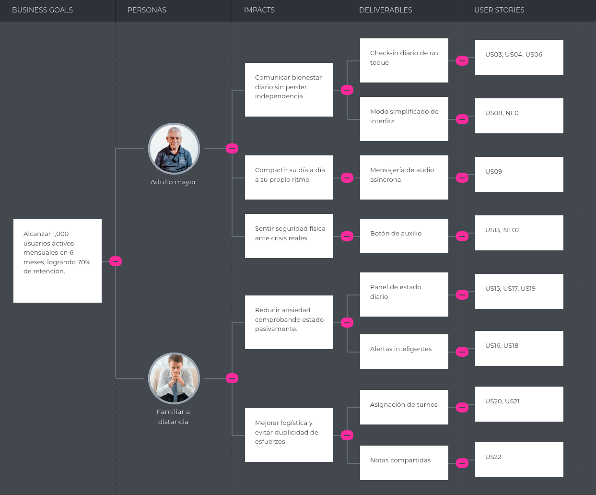
  <br/><i>Imagen 11. Diagrama de Impact Mapping.</i>

</div>

<br>

### 2.4.3. Product Backlog

La siguiente tabla ordena las 46 historias del Product Backlog y asigna cada una a un sprint. La Imagen 12 muestra el mismo backlog en Trello, donde el equipo lo gestiona.

| Orden | User Story Id | Título | Story Points (1 / 2 / 3 / 5 / 8) | Sprint |
|---:|---|---|---:|---|
| 1 | US04 | Notificación programada del check-in diario | 5 | Sprint 1 |
| 2 | US09 | Grabación y envío de mensaje de audio | 5 | Sprint 1 |
| 3 | US13 | Activación del botón de auxilio | 5 | Sprint 1 |
| 4 | US14 | Recepción de alerta de emergencia | 5 | Sprint 1 |
| 5 | NF01 | Accesibilidad visual y táctil de la interfaz | 5 | Sprint 1 |
| 6 | TS01 | Gestión de usuarios del sistema | 5 | Sprint 1 |
| 7 | TS02 | Gestión de sesiones de autenticación | 5 | Sprint 1 |
| 8 | TS03 | Gestión de vínculos familiares | 5 | Sprint 1 |
| 9 | TS04 | Gestión de check-ins diarios | 5 | Sprint 1 |
| 10 | US01 | Registro de cuenta de usuario | 3 | Sprint 1 |
| 11 | US02 | Vinculación familiar por código de invitación | 3 | Sprint 1 |
| 12 | US10 | Reproducción de mensajes de audio recibidos | 3 | Sprint 1 |
| 13 | US15 | Consulta del estado diario | 3 | Sprint 1 |
| 14 | NF02 | Latencia de entrega de alertas de emergencia | 3 | Sprint 1 |
| 15 | TS05 | Gestión de preferencias del usuario | 3 | Sprint 1 |
| 16 | US23 | Propuesta de valor en la landing page | 1 | Sprint 1 |
| 17 | US16 | Alerta por inactividad del check-in | 5 | Sprint 2 |
| 18 | US18 | Sugerencia de acción por patrón de malestar | 5 | Sprint 2 |
| 19 | US20 | Asignación de turnos de atención | 5 | Sprint 2 |
| 20 | NF03 | Control de acceso a los datos de bienestar | 5 | Sprint 2 |
| 21 | TS06 | Gestión de mensajes de audio | 5 | Sprint 2 |
| 22 | TS08 | Gestión de alertas de emergencia | 5 | Sprint 2 |
| 23 | TS09 | Gestión del panel de estado | 5 | Sprint 2 |
| 24 | TS10 | Gestión de alertas de inactividad | 5 | Sprint 2 |
| 25 | TS11 | Gestión de turnos de atención | 5 | Sprint 2 |
| 26 | TS13 | Gestión de indicadores de bienestar | 5 | Sprint 2 |
| 27 | US06 | Rotación de preguntas del check-in | 3 | Sprint 2 |
| 28 | US08 | Modo simplificado de interfaz | 3 | Sprint 2 |
| 29 | US17 | Historial de check-ins del adulto mayor | 3 | Sprint 2 |
| 30 | NF04 | Usabilidad sin experiencia tecnológica previa | 3 | Sprint 2 |
| 31 | TS07 | Gestión de recordatorios de contacto social | 3 | Sprint 2 |
| 32 | TS12 | Gestión de notas compartidas | 3 | Sprint 2 |
| 33 | US25 | Navegación y diseño responsive del sitio | 3 | Sprint 2 |
| 34 | US03 | Registro de respuesta del check-in diario | 2 | Sprint 2 |
| 35 | US05 | Configuración del horario del check-in | 2 | Sprint 2 |
| 36 | US07 | Pausa diaria de preguntas | 2 | Sprint 2 |
| 37 | US21 | Consulta del turno de atención vigente | 2 | Sprint 2 |
| 38 | US11 | Notificación de recordatorio de contacto social | 3 | Sprint 3 |
| 39 | US22 | Notas compartidas entre familiares | 3 | Sprint 3 |
| 40 | US12 | Postergación de recordatorio de contacto social | 2 | Sprint 3 |
| 41 | US19 | Registro de pequeñas victorias | 2 | Sprint 3 |
| 42 | US24 | Presentación del modelo de dos aplicaciones | 1 | Sprint 3 |
| 43 | US26 | Sección institucional de la startup | 1 | Sprint 3 |
| 44 | US27 | Envío de fotografía al adulto mayor | 2 | Sprint 3 |
| 45| SP01 | Integración de Firebase Cloud Messaging | 5 | Sprint 3 |
| 46 | SP02 | Grabación, almacenamiento y reproducción de audio | 5 | Sprint 3 || 47 | US28 | Registro de cuenta del familiar a distancia | 2 | Sprint 3 |
| 48 | US29 | Inicio de sesión | 2 | Sprint 3 |
| 49 | US30 | Cierre de sesión | 1 | Sprint 3 |
| 50 | US31 | Edición de datos de perfil y foto | 3 | Sprint 3 |
| 51 | US32 | Cambio de contraseña | 2 | Sprint 3 |
| 52 | US33 | Revocación de vínculo familiar | 2 | Sprint 3 |
| 53 | US34 | Programación de recordatorio de contacto social | 3 | Sprint 3 |
| 54 | US35 | Cancelación de recordatorio de contacto social | 1 | Sprint 3 |
| 55 | US36 | Reasignación de turnos de atención | 3 | Sprint 3 |
| 56 | US37 | Descarte de sugerencias de bienestar | 1 | Sprint 3 |
| 57 | US38 | Reconocimiento de alertas | 2 | Sprint 3 |
| 58 | US39 | Resolución de alertas | 2 | Sprint 3 |
| 59 | US40 | Generación de código de invitación | 3 | Sprint 3 |
| 60 | US41 | Visualización de fotografías recibidas | 2 | Sprint 3 |
| 61 | US42 | Consulta del historial de alertas | 2 | Sprint 3 |


<br>

<div align="center">

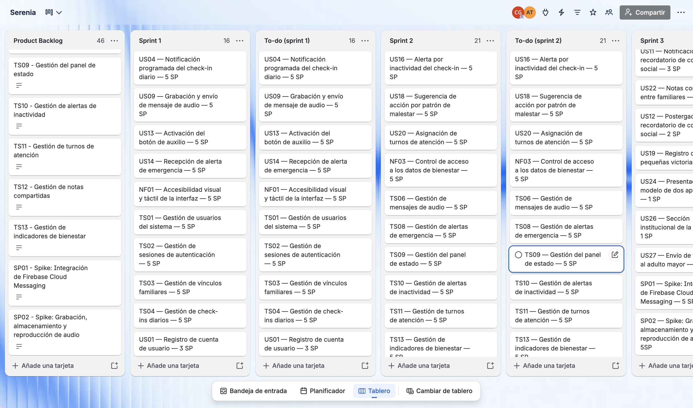
  <br/><i>Imagen 12. Captura de Product Backlog en Trello.</i>

</div>
<br>

**URL:** https://trello.com/invite/b/6aa8e6d78ed225cd21e9e93c/ATTI46cbaeeceb1072274d9c62399714ddaeF68A89AE/serenia

<br>

## 2.5. Strategic-Level Domain-Driven Design
### 2.5.1. EventStorming

Antes de presentar los bounded contexts candidatos, esta sección muestra el camino que llevó hasta ellos. El equipo aplicó el proceso de EventStorming en diez pasos: Unstructured Exploration, Timelines, Pain Points, Pivotal Points, Commands, Policies, Read Models, External Systems, Aggregates y Bounded Contexts. Cada paso agrega una capa de información sobre el mismo modelo sin reemplazar la anterior, de modo que el último paso conserva todo lo trabajado en los nueve primeros. Las capturas provienen del tablero de Miro *Event Storming Process - 10 steps*, donde cada paso se conserva como una copia acumulada del anterior. Este enfoque de Domain-Driven Design tiene respaldo en la literatura: según una revisión sistemática reciente, facilita la descomposición de sistemas y requiere la participación de ingenieros, arquitectos y expertos del dominio (Özkan et al., 2025). Si alguna captura no se aprecia con claridad, el tablero completo puede consultarse en Miro.

<br>

URL del tablero en Miro: [https://miro.com/app/board/uXjVHlaGmGg=/?share_link_id=423095184184](https://miro.com/app/board/uXjVHlaGmGg=/?share_link_id=423095184184)

<br>

**Paso 1. Unstructured Exploration.** El punto de partida fueron los eventos de dominio de Serenia, levantados a partir del Big Picture EventStorming (sección 2.3.5), redactados en pasado y sin ningún orden, tal como surgen en una lluvia de ideas. La Imagen 13 muestra ese estado inicial: en este paso no se busca todavía una estructura, solo poner sobre el muro todo lo que ocurre en el dominio.

<br>
<div align="center">
  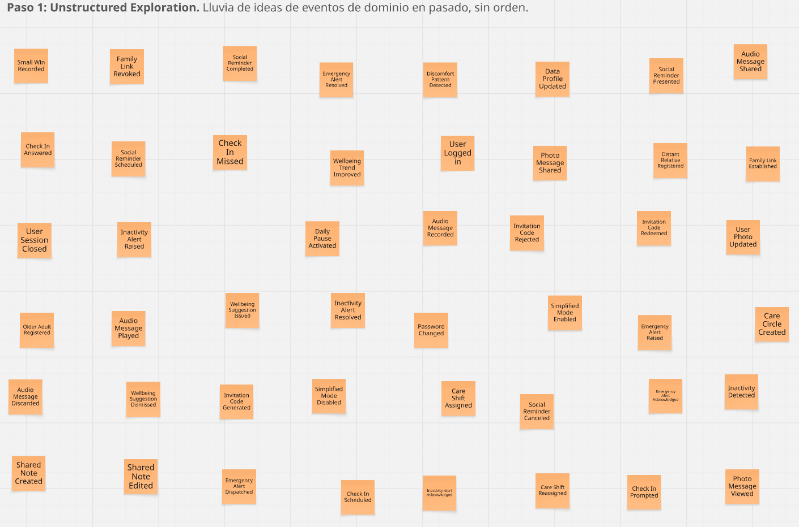
  <br/><i>Imagen 13. Paso 1 del EventStorming: Unstructured Exploration.</i>
</div>

<br>

**Paso 2. Timelines.** Los eventos se ordenaron en el tiempo y se agruparon por proceso: alta y acceso del usuario, círculo de cuidado y vínculo familiar, check-in diario, interpretación de bienestar, alertas y seguridad, y acompañamiento social. Las flechas de la Imagen 14 indican la secuencia entre eventos y las bifurcaciones, como el código de invitación que puede ser canjeado o rechazado.

<br>
<div align="center">
  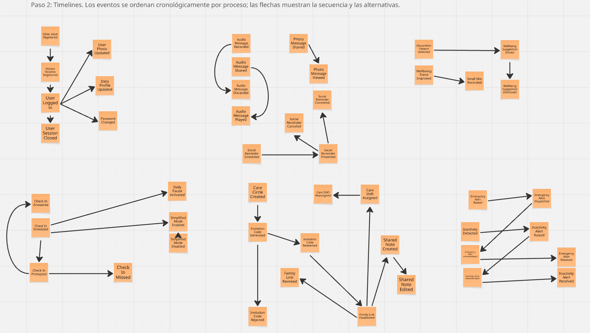
  <br/><i>Imagen 14. Paso 2 del EventStorming: Timelines.</i>
</div>

<br>

**Paso 3. Pain Points.** Sobre la línea de tiempo se marcaron con stickies rosados las dudas que el dominio todavía no resuelve. El equipo no las inventó para este paso: se tomaron diez de las Open Questions de los Bounded Context Canvases (sección 2.5.1.3) y se ubicaron junto al evento al que afectan, como se ve en la Imagen 15. Entre ellas están la vigencia del código de invitación, quién puede revocar un vínculo familiar, cuántos días configuran un patrón de malestar, la duración de la ventana de inactividad y si la alerta llega a todos los familiares vinculados.

<br>
<div align="center">
  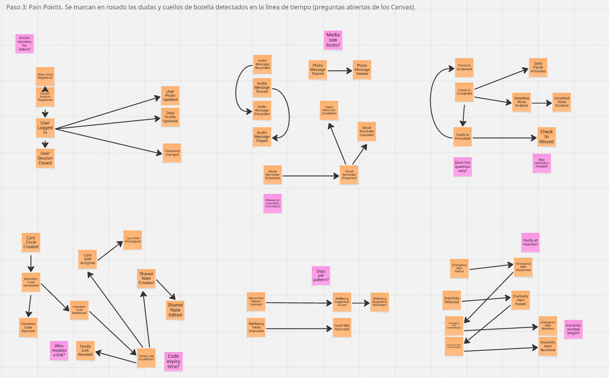
  <br/><i>Imagen 15. Paso 3 del EventStorming: Pain Points.</i>
</div>

<br>

**Paso 4. Pivotal Points.** Las barras verticales de la Imagen 16 marcan los eventos que cambian la fase del negocio, es decir, aquellos a partir de los cuales el sistema pasa a operar de otra manera. Fueron seis: Older Adult Registered (el usuario existe), Family Link Established (ya hay a quién notificar), Check In Answered y Check In Missed (la bifurcación entre bienestar confirmado y ausencia de respuesta), Discomfort Pattern Detected (el malestar deja de ser puntual y pasa a ser sostenido) y Emergency Alert Raised (la situación deja de ser rutinaria).

<br>
<div align="center">
  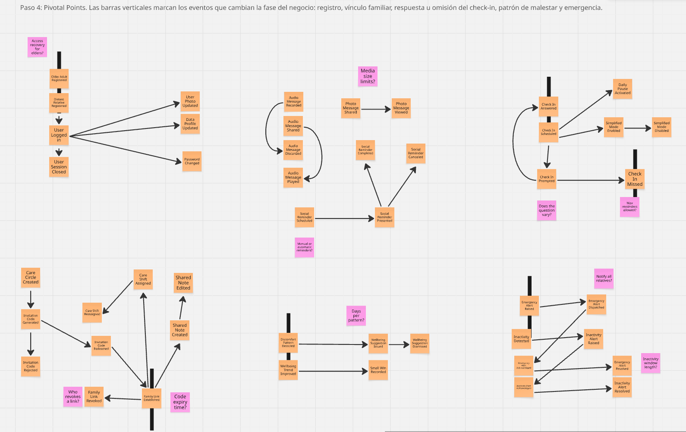
  <br/><i>Imagen 16. Paso 4 del EventStorming: Pivotal Points.</i>
</div>

<br>

**Paso 5. Commands.** Para cada evento se identificó el comando que lo provoca, redactado en imperativo (por ejemplo, Register Older Adult o Trigger Emergency Alert), y el actor que lo ejecuta: Older Adult, Distant Relative o el propio sistema, como ocurre con Prompt Check In. La Imagen 17 muestra los 45 comandos, en azul, con sus actores en amarillo claro. Desde este paso se retiran las flechas de la línea de tiempo para no saturar el muro.

<br>
<div align="center">
  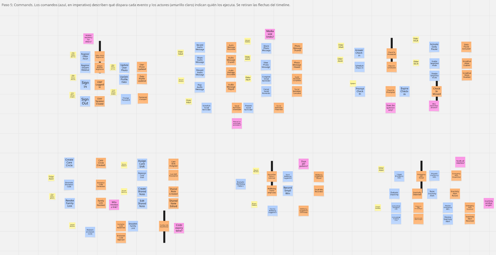
  <br/><i>Imagen 17. Paso 5 del EventStorming: Commands.</i>
</div>

<br>

**Paso 6. Policies.** Las policies, en violeta, son reglas de la forma "cuando ocurre X, entonces se ejecuta Y": reaccionan a un evento y disparan un comando. El equipo identificó diez. Por ejemplo, si el check-in no fue respondido y no hay una pausa activa, se evalúa la inactividad; si se detecta un patrón de malestar, se emite una sugerencia de bienestar; y si se levanta una alerta de emergencia y hay familiares vinculados, se despacha la alerta. La Imagen 18 conecta con una flecha tres de estas policies con el comando que activan (Create Care Circle, Evaluate Wellbeing Pattern y Evaluate Inactivity). Las tres cruzan de un contexto a otro, lo que anticipa las relaciones que luego se formalizan en el Context Map (sección 2.5.2).

<br>
<div align="center">
  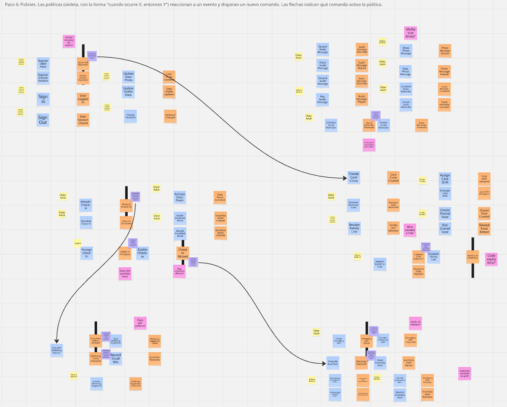
  <br/><i>Imagen 18. Paso 6 del EventStorming: Policies.</i>
</div>

<br>

**Paso 7. Read Models.** Los read models, en verde claro, representan la información o la vista que el actor necesita tener delante para decidir y ejecutar un comando. Se identificaron 24, entre ellos Registration Form View, Daily Check-in View, Family Members View, Help Button View y Alerts View, que se observan en la Imagen 19 ubicados junto al comando que alimentan.

<br>
<div align="center">
  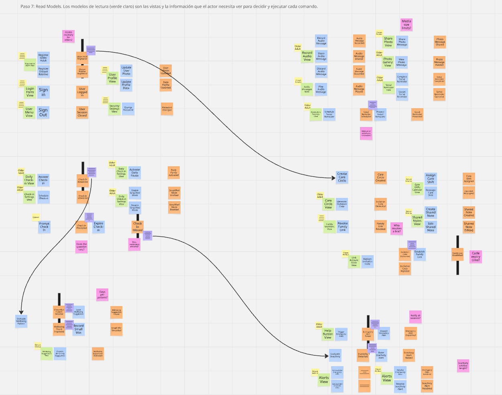
  <br/><i>Imagen 19. Paso 7 del EventStorming: Read Models.</i>
</div>

<br>

**Paso 8. External Systems.** Los sistemas externos, en rojo, son servicios que están fuera del dominio y con los que este necesita interactuar. El único identificado hasta ahora es el Push Notification Provider, que entrega la notificación push al dispositivo del familiar cuando se despacha una alerta, por lo que la Imagen 20 lo ubica junto al evento Emergency Alert Dispatched. Es el mismo proveedor que el Context Map aísla mediante una Anti-Corruption Layer (sección 2.5.2).

<br>
<div align="center">
  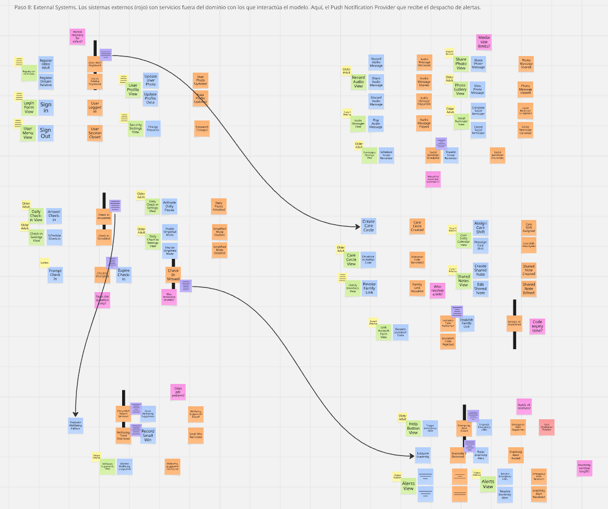
  <br/><i>Imagen 20. Paso 8 del EventStorming: External Systems.</i>
</div>

<br>

**Paso 9. Aggregates.** Los aggregates, en amarillo intenso, agrupan los comandos y eventos que modifican un mismo concepto del dominio y protegen sus reglas de consistencia. Aparecen doce en la Imagen 21: User, Care Circle, Care Shift, Shared Note, Check In, Check In Preferences, Wellbeing Insight, Emergency Alert, Inactivity Alert, Audio Message, Photo Message y Social Reminder.

<br>
<div align="center">
  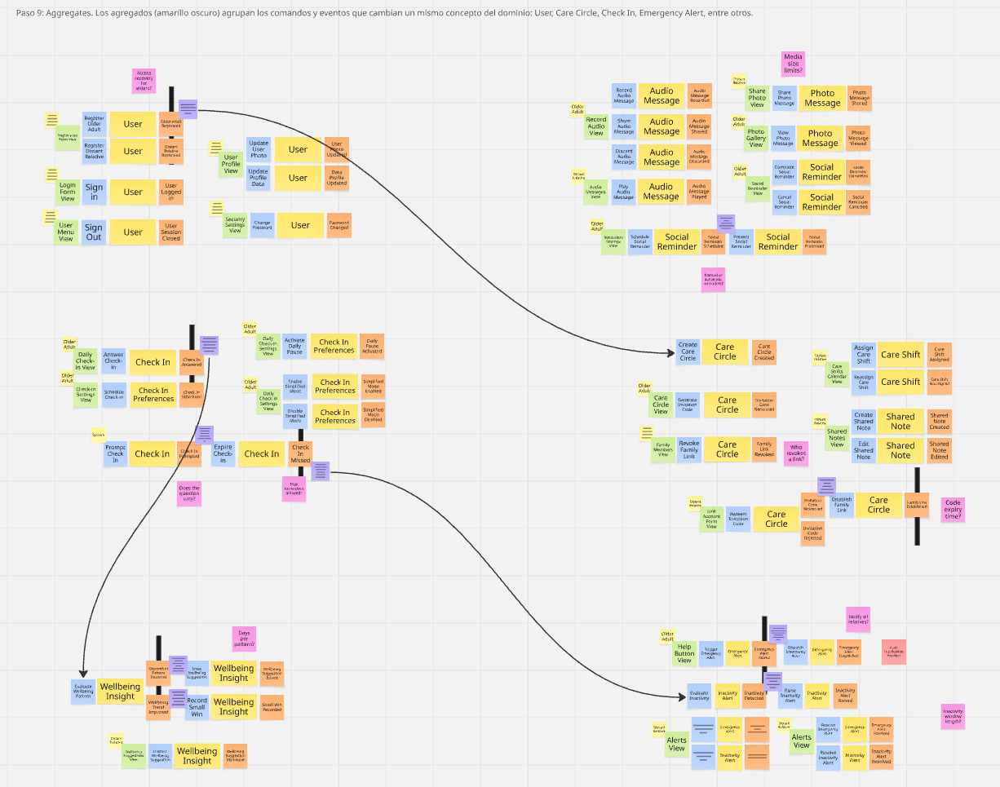
  <br/><i>Imagen 21. Paso 9 del EventStorming: Aggregates.</i>
</div>

<br>

**Paso 10. Bounded Contexts.** Finalmente, los aggregates, comandos y eventos que comparten lenguaje y reglas se encerraron en elipses, como muestra la Imagen 22. El resultado son seis bounded contexts: Identity & Access, Care Circle, Daily Check-in, Wellbeing Monitoring, Alerts & Safety y Social Companionship. Las flechas de las policies que cruzan de una elipse a otra indican dónde los contextos deben colaborar. La sección siguiente explica cada uno de ellos y el criterio con el que se clasificó según su aporte de valor.

<br>
<div align="center">
  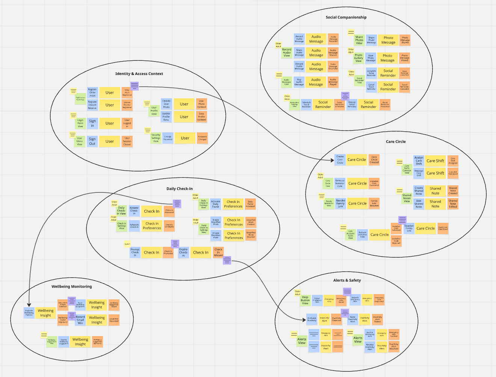
  <br/><i>Imagen 22. Paso 10 del EventStorming: Bounded Contexts.</i>
</div>

<br>

#### 2.5.1.1. Candidate Context Discovery

A partir del dominio modelado en los pasos anteriores, el equipo desarrolló una sesión de Candidate Context Discovery con el fin de identificar los bounded contexts de Serenia, que corresponde al paso 10 del proceso. La sesión se realizó en Miro sobre el muro de eventos de dominio previamente levantados y tuvo una duración aproximada de 1 hora y media.

La técnica aplicada fue start-with-value. En lugar de descomponer el timeline de forma secuencial, el equipo partió de la pregunta sobre qué partes del dominio concentran el mayor valor para el negocio, entendiendo por valor aquello que sostiene directamente la propuesta diferencial de Serenia: reemplazar la común llamada telefónica por un acompañamiento emocional sostenido y verificable a distancia.

<br>

El proceso se desarrolló en tres momentos:


**Identificación del core.** El equipo recorrió el muro marcando los eventos sin los cuales la propuesta de valor de Serenia deja de existir. De este recorrido surgieron tres núcleos: los eventos de registro y respuesta del check-in diario, que son el mecanismo por el cual el adulto mayor comunica su estado sin sentirse vigilado; los eventos de interpretación de patrones de bienestar, que convierten esas respuestas en información valiosa para el familiar a distancia; y los eventos de alerta ante emergencia o inactividad prolongada, que son la garantía de tranquilidad que el familiar a distancia está comprando. Estos tres núcleos se delimitaron primero, por ser los que concentran la lógica de negocio propia del producto.

**Delimitación del contexto habilitador.** Un segundo recorrido identificó los eventos que no generan valor por sí mismos pero sin los cuales el core no puede operar: los de creación del círculo de cuidado y vinculación familiar. Sin un vínculo establecido no hay a quién notificar ni con quién compartir el estado del adulto mayor. Este conjunto se delimitó como un contexto propio y no se absorbió dentro del core, ya que administra la estructura de la relación familiar (sobre quién está vinculado, quién tiene un turno de cuidado asignado y qué notas se comparten) y no la interpretación del bienestar.

**Separación de lo genérico y lo complementario.** Finalmente, el equipo aisló los eventos que no aportan diferenciación competitiva. Por un lado, los de identidad, autenticación y gestión de perfil, que son resolubles con mecanismos estándar y cuyas reglas no cambian con el negocio de Serenia. Por otro lado, los de mensajería de audio, imágenes y recordatorios sociales, que enriquecen la experiencia de acompañamiento pero no producen ninguna señal que el sistema evalúe ni disparan ningún flujo de alerta.

El resultado de la sesión fueron seis bounded contexts candidatos, clasificados según su aporte de valor y presentados en las Imágenes 23 a 28:

<br>


### Daily Check-in - Core <br>
Es el mecanismo primario por el cual Serenia genera valor diferencial: convierte una interacción emocional cotidiana en una señal estructurada, sin que el adulto mayor sienta que está siendo monitoreado clínicamente. Sin este contexto no existe el dato que el resto del sistema necesita para funcionar. La Imagen 23 muestra los eventos, comandos y aggregates que lo componen.

<br>
<div align="center">
  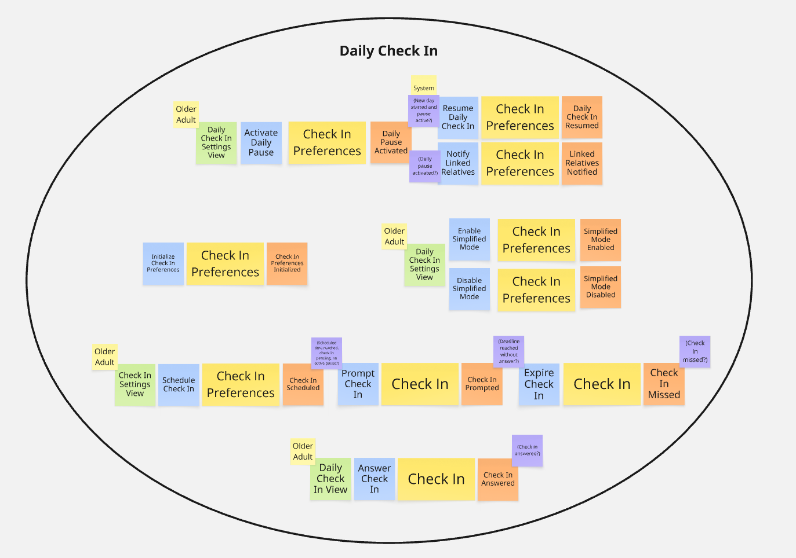
  <br/><i>Imagen 23. Daily Check-in - Bounded Context Core identificado en el Candidate Context Discovery.</i>
</div> <br>

### Wellbeing Monitoring - Core <br>
Es el contexto que interpreta las señales del check-in y las convierte en información para la familia a distancia. Concentra la lógica del negocio más distintiva de Serenia: distinguir un mal día puntual de un patrón de deterioro sostenido, evitando tanto la falsa alarma como la negligencia. La Imagen 24 muestra los elementos que lo componen.

<br>
<div align="center">
  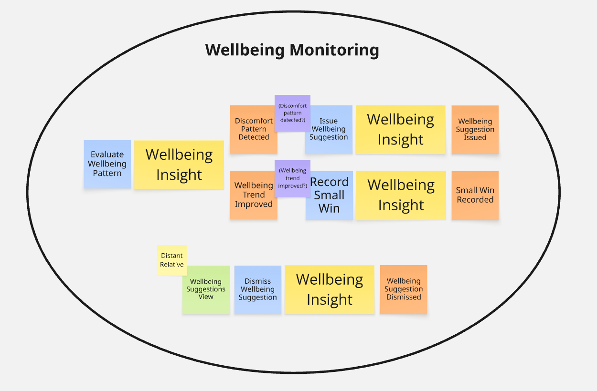
  <br/><i>Imagen 24. Wellbeing Monitoring - Bounded Context Core identificado en el Candidate Context Discovery.</i>
</div> <br>

### Alerts & Safety - Core <br>
Es la garantía de tranquilidad que sostiene la decisión de compra del familiar a distancia. Sin una respuesta confiable ante inactividad o emergencia, el resto de la propuesta de valor pierde sustento, porque el familiar seguiría necesitando de llamar por su cuenta ante cualquier duda. La Imagen 25 muestra los elementos que lo componen.

<br>
<div align="center">
  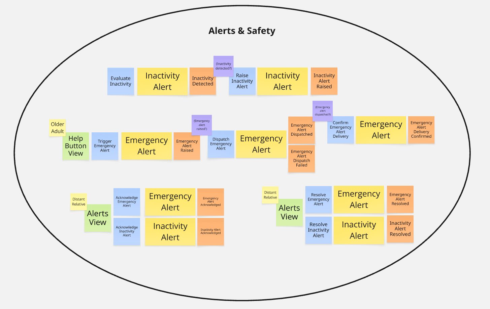
  <br/><i>Imagen 25. Alerts & Safety - Bounded Context Core identificado en el Candidate Context Discovery.</i>
</div> <br>

### Care Circle - Supporting <br>
No genera valor por sí solo, pero es indispensable para que el core opere: sin un vínculo familiar establecido no hay a quién notificar ni con quién compartir el estado del adulto mayor. Se mantiene separado del core porque administra estructura de relación (vínculos, turnos, notas compartidas), no interpretación de bienestar. La Imagen 26 muestra los elementos que lo componen.

<br>
<div align="center">
  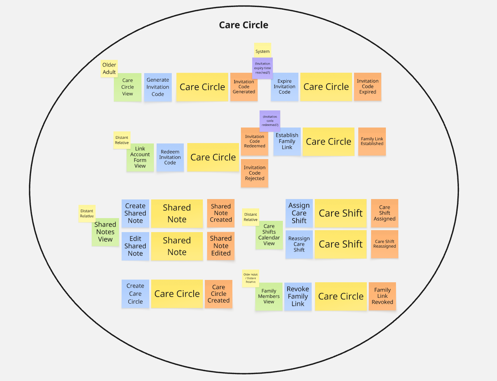
  <br/><i>Imagen 26. Care Circle - Bounded Context Supporting identificado en el Candidate Context Discovery.</i>
</div> <br>

### Social Companionship - Supporting <br>
Complementa la experiencia de acompañamiento con mensajería de audio, fotos y recordatorios sociales, pero ninguno de sus eventos produce una señal que el sistema evalúe ni deriva en alerta. Aporta valor percibido, no valor operativo. La Imagen 27 muestra los elementos que lo componen.

<br>
<div align="center">
  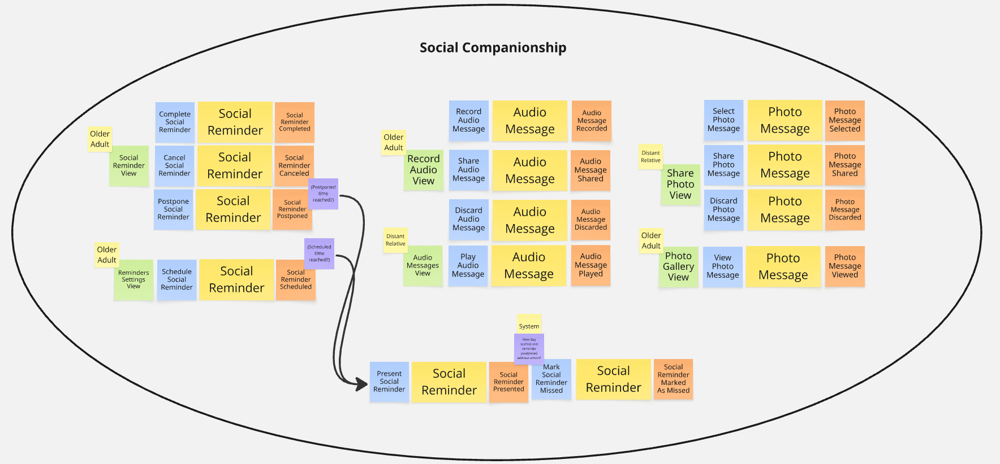
  <br/><i>Imagen 27. Social Companionship - Bounded Context Supporting identificado en el Candidate Context Discovery.</i>
</div> <br>

### Identity & Access - Generic <br>
Resuelve un problema estándar (registro, autenticación, gestión de sesión) con reglas de negocio genéricas que no cambian por ser Serenia. Es indispensable para que exista cualquier otro contexto, pero no distingue a Serenia de ninguna otra aplicación. La Imagen 28 muestra los elementos que lo componen.

<br>
<div align="center">
  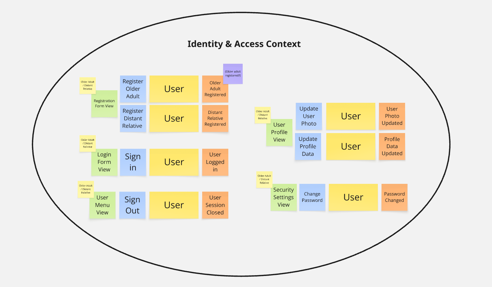
  <br/><i>Imagen 28. Identity & Access - Bounded Context Generic identificado en el Candidate Context Discovery.</i>
</div> <br>

Al finalizar, el equipo aplicó una verificación del lenguaje ubicuo sobre cada frontera, comprobando que ningún término tuviera dos significados dentro de un mismo contexto. Esta revisión confirmó, por ejemplo, la separación entre Daily Check-in y Wellbeing Monitoring. Otra discusión del equipo fue la frontera entre Daily Check-in y Social Companionship, por compartir ambos la dimensión emocional de la interacción; se resolvió mantenerlas separadas sobre la base de que únicamente el check-in produce una señal que el sistema evalúa, mientras que el acompañamiento social no está sujeto a ninguna evaluación.

## EventStorming Serenia

La Imagen 29 reúne los seis bounded contexts en un solo tablero y muestra cómo se relacionan entre sí.

<br>
<div align="center">
  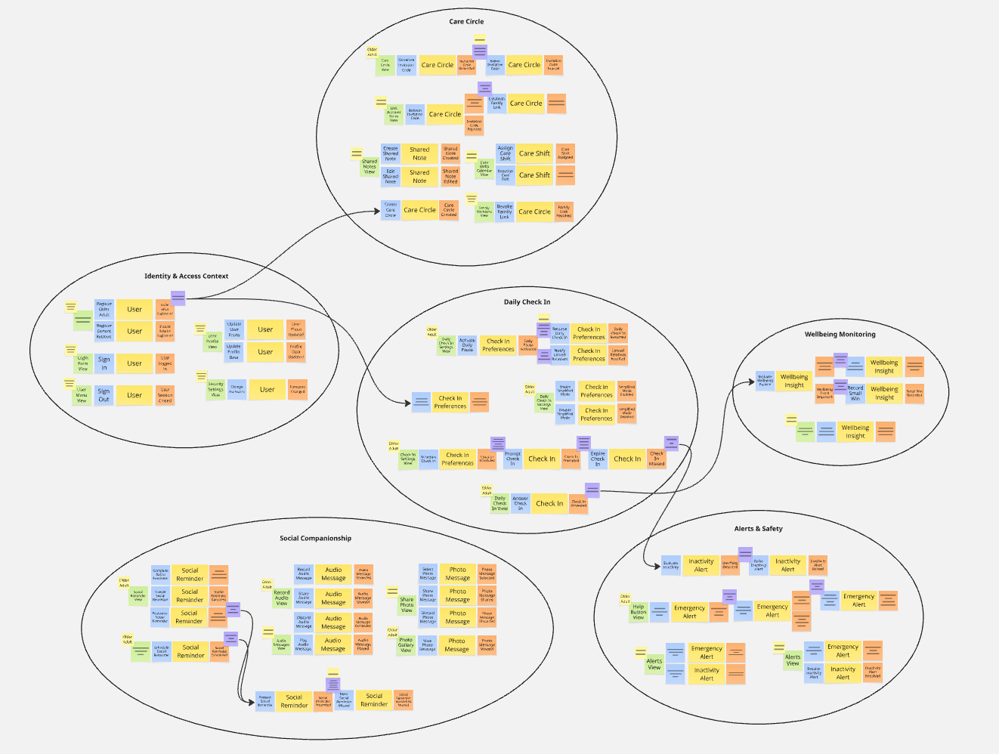
  <br/><i>Imagen 29. Candidate Context Discovery completo del dominio de Serenia.</i>
</div>

<br>

#### 2.5.1.2. Domain Message Flows Modeling

Una vez delimitados los bounded contexts candidatos, el equipo desarrolló una sesión de Domain Message Flows Modeling con el fin de visualizar cómo deben colaborar dichos contextos para resolver los casos de negocio que enfrentan los usuarios del sistema. Mientras que la sesión anterior respondió dónde trazar las fronteras, esta buscó responder qué mensajes deben cruzarlas.

La técnica aplicada fue Domain Storytelling, empleando la herramienta Egon.io. La notación representa cada escenario mediante actores, objetos de trabajo y actividades numeradas que se leen como oraciones completas, lo que permite validar el flujo con lenguaje natural del dominio. El equipo introdujo una variante deliberada sobre la notación clásica: además de los actores humanos, cada bounded context fue modelado como un actor de tipo sistema. De esta forma, toda flecha que va de un contexto a otro constituye un mensaje de dominio explícito, y el diagrama evidencia directamente la colaboración entre fronteras en lugar de tratar al sistema como una caja negra.

La selección de escenarios no buscó cobertura funcional completa, sino aquellos casos en los que más de un bounded context debe intervenir para resolver una necesidad del usuario. Bajo ese criterio se modelaron tres domain stories, cada una correspondiente a un escenario de camino feliz. Los casos de rechazo y las variantes excepcionales quedaron fuera del alcance, ya que en Domain Storytelling cada variación constituye una historia independiente y no una ramificación del mismo diagrama.

<br>

**Domain Story 1: Registro y vinculación familiar**

Este escenario resuelve el caso en que un adulto mayor se registra en Serenia y habilita a un familiar a distancia para acceder a su estado. Es la historia que da origen a toda relación posterior en el sistema: sin un vínculo familiar establecido, ningún otro flujo puede ejecutarse. La Imagen 30 presenta el diagrama de esta historia.

<br>

<div align="center">
  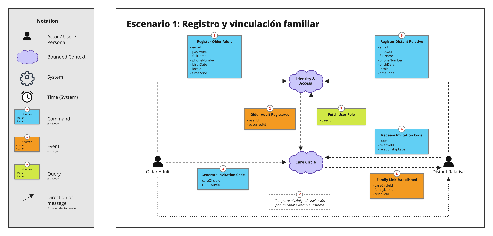
  <br/><i>Imagen 30. Domain Story 1 - Registro y vinculación familiar.</i>
</div>

<br>

El adulto mayor crea su cuenta en Identity & Access (1), el cual comunica la identidad registrada a Care Circle (2). Care Circle genera entonces un código de invitación y lo entrega al adulto mayor (3), quien se lo transmite al familiar a distancia por un medio ajeno al sistema (4). El familiar crea su propia cuenta en Identity & Access (5), ingresa el código de invitación en Care Circle (6) y recibe la confirmación del vínculo familiar establecido (7).

<br>

**Domain Story 2: Check-in diario y consulta del estado**

Este escenario representa la operación cotidiana de Serenia y el caso de uso que sostiene su propuesta de valor: el adulto mayor comunica su bienestar sin necesidad de una llamada, y el familiar a distancia lo verifica sin necesidad de interrumpirlo. La Imagen 31 presenta el diagrama de esta historia.

<br>

<div align="center">
  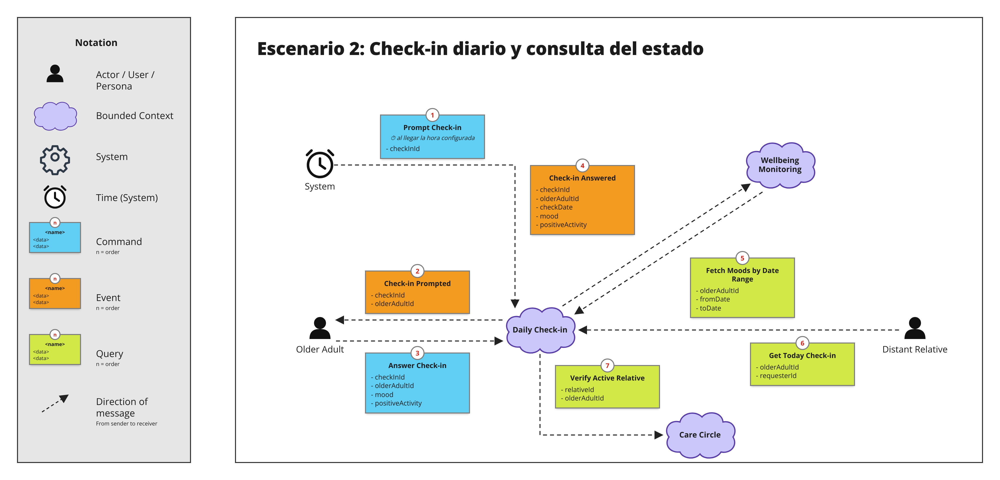
  <br/><i>Imagen 31. Domain Story 2 - Check-in diario y consulta del estado.</i>
</div>
<br>

Daily Check-in envía la pregunta diaria al adulto mayor (1), quien responde el check-in (2). Daily Check-in comunica entonces el check-in registrado a Wellbeing Monitoring (3), que lo incorpora al historial del adulto mayor. Posteriormente, el familiar a distancia consulta el resumen de estado (4) y Wellbeing Monitoring se lo muestra (5).

<br>

**Domain Story 3: Detección de un patrón de malestar**

Este escenario resuelve el caso en que el adulto mayor reporta malestar durante varios días consecutivos sin que ello constituya una emergencia. Es el flujo que distingue a Serenia de una aplicación de alertas reactivas, ya que actúa sobre una tendencia y no sobre un evento aislado. La Imagen 32 presenta el diagrama de esta historia.

<br>

<div align="center">
  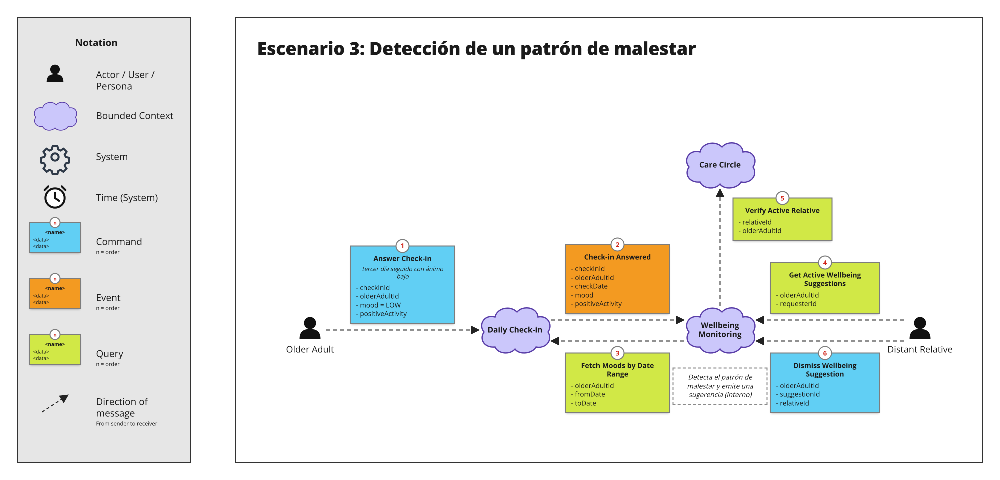
  <br/><i>Imagen 32. Domain Story 3 - Detección de un patrón de malestar.</i>
</div>
<br>

Wellbeing Monitoring evalúa el historial de check-ins del adulto mayor (1) y, al identificar un patrón sostenido de malestar, lo comunica a Alerts and Safety (2). Este último clasifica la alerta de bienestar según su severidad (3), envía una sugerencia de acción al familiar a distancia (4) y registra la confirmación de atención por parte de este (5).

<br>

El modelado de los flujos de mensajes permitió comprobar que la descomposición propuesta resiste la ejecución de los casos de negocio reales de Serenia. Las tres historias muestran una cadena de colaboración coherente: Care Circle origina el vínculo familiar del que dependen todas las comunicaciones posteriores, Daily Check-in captura la señal diaria, Wellbeing Monitoring la acumula e interpreta, y Alerts and Safety actúa únicamente cuando esa interpretación lo amerita. Cada contexto recibe lo que necesita para cumplir su responsabilidad y ninguno requiere asumir la de otro, lo que confirma que las fronteras trazadas son operativas y no solo conceptuales.

Adicionalmente, los diagramas identificaron con precisión los tres puntos de integración del sistema (identidad registrada, check-in registrado y patrón de malestar detectado), que constituyen el insumo directo para definir los patrones de relación entre contextos.

<br>

#### 2.5.1.3. Bounded Context Canvases

Con los bounded contexts identificados y sus flujos de colaboración visualizados, el equipo procedió a diseñar cada uno de ellos mediante la técnica del Bounded Context Canvas. A diferencia de las secciones anteriores, cuyo propósito fue descubrir y validar las fronteras, esta busca definir el contrato de diseño de cada contexto: su razón de existir, las reglas de negocio que encapsula, los mensajes que expone y las dependencias que mantiene con los demás.

Los contextos se presentan por orden de importancia, iniciando por los clasificados como Core, continuando con los Supporting y cerrando con el Generic.

<table> <tr><th colspan="2">Bounded Context Canvas 1: Daily Check-in</th></tr> <tr><td><b>Purpose</b></td><td>Permitir que el adulto mayor comunique su bienestar cotidiano mediante una interacción de un solo toque, sin necesidad de una llamada telefónica ni de dar explicaciones extensas, preservando su autonomía y evitando que la interacción se perciba como vigilancia clínica.</td></tr> <tr><td><b>Strategic Classification</b></td><td><b>Domain:</b> Core, es el mecanismo primario de generación de valor.<br><b>Business Model:</b> Engagement Creator, el adulto mayor no paga por esta funcionalidad, pero su uso sostenido es la condición de todo lo demás.<br><b>Evolution:</b> Custom Built, existen check-ins en otras soluciones, pero Serenia los diferencia por su tono no clínico y su variabilidad.</td></tr> <tr><td><b>Domain Roles</b></td><td>Execution context, ejecuta el ciclo diario de captura de respuesta. No interpreta ni acumula: esa responsabilidad corresponde a Wellbeing Monitoring.</td></tr> <tr><td><b>Inbound Communication</b></td><td>Check-in response (Command): Older Adult, interacción directa de UI<br>Pausa de preguntas activada (Command): Older Adult, interacción directa de UI<br>Family link established (Event): Care Circle, Published Language</td></tr> <tr><td><b>Outbound Communication</b></td><td>Daily question (Event): Older Adult, interacción directa de UI<br>Registered check-in (Event): Wellbeing Monitoring, Customer/Supplier<br>Unanswered check-in (Event): Alerts and Safety, Customer/Supplier</td></tr> <tr><td><b>Ubiquitous Language</b></td><td><b>Check-in:</b> respuesta diaria del adulto mayor sobre su estado.<br><b>Daily Question:</b> estímulo variable que inicia el check-in.<br><b>Time Limit Window:</b> plazo desde el horario configurado dentro del cual se espera la respuesta.<br><b>Daily Pause:</b> suspensión voluntaria del check-in por el día en curso.</td></tr> <tr><td><b>Business Decisions</b></td><td>El check-in se responde con un solo toque, sin formularios ni campos adicionales (US03).<br>El adulto mayor puede activar la pausa de preguntas para el día en curso; en ese caso no se evalúa la ausencia de respuesta (US16).<br>La pregunta diaria es variable y de tono de compañía, no clínico.</td></tr> <tr><td><b>Assumptions</b></td><td>El adulto mayor dispone de un smartphone táctil y puede realizar interacciones simples sin asistencia.<br>El horario de la pregunta diaria es configurable por el adulto mayor.</td></tr> <tr><td><b>Verification Metrics</b></td><td>Tasa de check-ins diarios completados.<br>Frecuencia de uso de la pausa de preguntas.<br>Tiempo promedio entre el envío de la pregunta y la respuesta.</td></tr> <tr><td><b>Open Questions</b></td><td>¿La pregunta diaria varía en contenido o únicamente en horario de aparición?<br>¿Existe un número máximo de recordatorios si el adulto mayor abre la aplicación pero no responde?</td></tr> </table>

<br>

<table> <tr><th colspan="2">Bounded Context Canvas 2: Wellbeing Monitoring</th></tr> <tr><td><b>Purpose</b></td><td>Convertir las respuestas diarias del adulto mayor en información significativa para el familiar a distancia, distinguiendo un mal día puntual de un patrón sostenido de deterioro, de modo que el familiar conozca su estado sin necesidad de interrumpirlo.</td></tr> <tr><td><b>Strategic Classification</b></td><td><b>Domain:</b> Core, concentra la lógica de negocio más distintiva de Serenia.<br><b>Business Model:</b> Revenue Generator, el panel de estado y el historial constituyen el núcleo de las funciones familiares del modelo freemium.<br><b>Evolution:</b> Custom Built, la interpretación emocional no clínica de patrones no tiene equivalente estandarizado.</td></tr> <tr><td><b>Domain Roles</b></td><td>Analysis context, recibe señales, las acumula y las interpreta para producir información derivada. No ejecuta acciones sobre el usuario.</td></tr> <tr><td><b>Inbound Communication</b></td><td>Registered check-in (Event): Daily Check-in, Customer/Supplier<br>Status summary request (Query): Distant Relative, interacción directa de UI<br>Check-in history request (Query): Distant Relative, interacción directa de UI<br>Family link established (Event): Care Circle, Published Language</td></tr> <tr><td><b>Outbound Communication</b></td><td>Status summary (Query response): Distant Relative, interacción directa de UI<br>Discomfort pattern detected (Event): Alerts and Safety, Customer/Supplier</td></tr> <tr><td><b>Ubiquitous Language</b></td><td><b>Check-in History:</b> secuencia ordenada de respuestas del adulto mayor.<br><b>Status Summary:</b> vista del día en curso que consulta el familiar.<br><b>Discomfort Pattern:</b> tendencia sostenida de respuestas negativas en días consecutivos.<br><b>Small Win:</b> actividad positiva registrada en un check-in.</td></tr> <tr><td><b>Business Decisions</b></td><td>Un patrón de malestar requiere varios días consecutivos de reporte negativo; una respuesta aislada no lo constituye (US18).<br>El historial se presenta ordenado por fecha y no se limita al día en curso (US17).<br>Se registran también las actividades positivas, de modo que el familiar no reciba únicamente señales negativas (US19).</td></tr> <tr><td><b>Assumptions</b></td><td>El familiar revisa el panel de estado con frecuencia suficiente como para que la consulta bajo demanda sea adecuada y no se requiera notificación activa.<br>La información de vinculación familiar se encuentra disponible localmente por propagación desde Care Circle.</td></tr> <tr><td><b>Verification Metrics</b></td><td>Frecuencia de consulta del panel de estado por familiar.<br>Proporción de patrones detectados que derivan en atención efectiva del familiar.<br>Reducción de llamadas motivadas por ansiedad reportadas por los usuarios.</td></tr> <tr><td><b>Open Questions</b></td><td>¿Cuántos días consecutivos configuran un patrón de malestar?<br>¿El umbral es fijo o se ajusta al comportamiento habitual de cada adulto mayor?</td></tr> </table>

<br>

<table> <tr><th colspan="2">Bounded Context Canvas 3: Alerts and Safety</th></tr> <tr><td><b>Purpose</b></td><td>Garantizar que el familiar a distancia sea informado cuando la situación del adulto mayor lo amerite, ya sea por ausencia prolongada de respuesta, por un patrón de malestar sostenido o por una emergencia declarada, de modo que no necesite verificar por su cuenta ante cada duda.</td></tr> <tr><td><b>Strategic Classification</b></td><td><b>Domain:</b> Core, es la garantía de tranquilidad que sostiene la decisión de adopción del familiar.<br><b>Business Model:</b> Revenue Generator, las alertas selectivas forman parte de las funciones familiares de pago.<br><b>Evolution:</b> Product, existen soluciones de alerta de emergencia en el mercado, aunque sin la selectividad que Serenia propone.</td></tr> <tr><td><b>Domain Roles</b></td><td>Execution context con rol de notificación, aplica reglas de escalamiento y decide a quién y cuándo notificar.</td></tr> <tr><td><b>Inbound Communication</b></td><td>Unanswered check-in (Event): Daily Check-in, Customer/Supplier<br>Discomfort pattern detected (Event): Wellbeing Monitoring, Customer/Supplier<br>Emergency alert triggered (Command): Older Adult, interacción directa de UI<br>Alert attention confirmed (Command): Distant Relative, interacción directa de UI<br>Family link established (Event): Care Circle, Published Language</td></tr> <tr><td><b>Outbound Communication</b></td><td>Action suggestion (Event): Distant Relative, interacción directa de UI<br>Inactivity alert (Event): Distant Relative, interacción directa de UI<br>Emergency alert (Event): Distant Relative, interacción directa de UI<br>Contact reminder (Event): Older Adult, interacción directa de UI</td></tr> <tr><td><b>Ubiquitous Language</b></td><td><b>Inactivity Alert:</b> notificación generada por ausencia de check-in dentro del plazo.<br><b>Emergency Alert:</b> notificación iniciada explícitamente por el adulto mayor.<br><b>Inactivity Window:</b> plazo que transcurre antes de escalar una ausencia de respuesta.<br><b>Suggested Action:</b> recomendación dirigida al familiar ante un patrón de malestar.<br><b>Severity:</b> nivel asignado a una alerta según su origen y urgencia.</td></tr> <tr><td><b>Business Decisions</b></td><td>La alerta de inactividad se genera solo si el check-in no fue respondido dentro del tiempo límite y la pausa de preguntas no está activa (US16).<br>Una alerta de emergencia dirigida a un adulto mayor sin familiares vinculados no puede procesarse (TS08).<br>La alerta escala a emergencia únicamente tras vencer la ventana de inactividad sin respuesta al recordatorio de contacto.</td></tr> <tr><td><b>Assumptions</b></td><td>El familiar tiene las notificaciones habilitadas en su dispositivo.<br>La lista de familiares vinculados se encuentra disponible localmente por propagación desde Care Circle, sin requerir consulta síncrona.</td></tr> <tr><td><b>Verification Metrics</b></td><td>Proporción de alertas confirmadas como atendidas por el familiar.<br>Tasa de falsos positivos reportados.<br>Tiempo entre la generación de la alerta y su atención.</td></tr> <tr><td><b>Open Questions</b></td><td>¿Cuál es la duración de la ventana de inactividad y es configurable por el familiar?<br>¿Todos los familiares vinculados reciben la alerta simultáneamente o se respeta el turno de atención vigente?</td></tr> </table>

<br>

<table> <tr><th colspan="2">Bounded Context Canvas 4: Care Circle</th></tr> <tr><td><b>Purpose</b></td><td>Establecer y administrar la relación entre el adulto mayor y sus familiares a distancia, determinando quiénes están vinculados a él, quién asume el turno de atención y qué información comparten entre sí, de modo que los demás contextos sepan a quién corresponde informar.</td></tr> <tr><td><b>Strategic Classification</b></td><td><b>Domain:</b> Supporting, no genera valor por sí solo, pero ningún contexto Core puede operar sin él.<br><b>Business Model:</b> Engagement Creator, la coordinación entre familiares incrementa el uso pero no se cobra de forma directa.<br><b>Evolution:</b> Custom Built, la estructura del círculo de cuidado responde a la dinámica familiar específica que Serenia atiende.</td></tr> <tr><td><b>Domain Roles</b></td><td>Registry context, mantiene y publica la estructura de relaciones. No interpreta información de bienestar ni emite alertas.</td></tr> <tr><td><b>Inbound Communication</b></td><td>Registered identity (Event): Identity &amp; Access, Shared Kernel<br>Invitation code entered (Command): Distant Relative, interacción directa de UI<br>Care shift assigned (Command): Distant Relative, interacción directa de UI<br>Shared note added (Command): Distant Relative, interacción directa de UI</td></tr> <tr><td><b>Outbound Communication</b></td><td>Invitation code (Event): Older Adult, interacción directa de UI<br>Family link established (Event): Daily Check-in, Wellbeing Monitoring, Alerts and Safety y Social Companionship, Published Language<br>Care shift confirmation (Event): Distant Relative, interacción directa de UI</td></tr> <tr><td><b>Ubiquitous Language</b></td><td><b>Care Circle:</b> conjunto de familiares vinculados a un adulto mayor.<br><b>Family Link:</b> relación establecida entre la cuenta de un familiar y la de un adulto mayor.<br><b>Invitation Code:</b> credencial de un solo uso generada por el adulto mayor para habilitar un vínculo.<br><b>Care Shift:</b> responsabilidad de seguimiento asignada a un familiar para una fecha determinada.</td></tr> <tr><td><b>Business Decisions</b></td><td>El código de invitación es generado por el adulto mayor y corresponde a un solo uso; un código ya utilizado o expirado no permite vinculación (US02).<br>Una fecha admite un único turno de atención asignado; un segundo intento sobre la misma fecha se rechaza (US20).<br>Un adulto mayor puede tener varios familiares vinculados simultáneamente.</td></tr> <tr><td><b>Assumptions</b></td><td>La transmisión del código de invitación del adulto mayor al familiar ocurre por un canal externo al sistema.<br>El adulto mayor es siempre quien origina el vínculo, nunca el familiar.</td></tr> <tr><td><b>Verification Metrics</b></td><td>Proporción de códigos de invitación generados que derivan en un vínculo efectivo.<br>Número promedio de familiares vinculados por adulto mayor.<br>Frecuencia de uso de la asignación de turnos.</td></tr> <tr><td><b>Open Questions</b></td><td>¿El código de invitación tiene un plazo de expiración definido?<br>¿Puede un vínculo familiar ser revocado y por quién?</td></tr> </table>

<br>

<table> <tr><th colspan="2">Bounded Context Canvas 5: Social Companionship</th></tr> <tr><td><b>Purpose</b></td><td>Enriquecer la relación entre el adulto mayor y su familia mediante intercambios afectivos ligeros (mensajes de audio, fotografías y recordatorios sociales) que refuercen el sentido de compañía más allá de la verificación de bienestar.</td></tr> <tr><td><b>Strategic Classification</b></td><td><b>Domain:</b> Supporting, aporta valor percibido pero no valor operativo; ninguna de sus interacciones produce señal evaluable.<br><b>Business Model:</b> Engagement Creator, incrementa la frecuencia de uso sin constituir en sí mismo una fuente de ingreso.<br><b>Evolution:</b> Product, la mensajería multimedia es una capacidad ampliamente disponible en el mercado.</td></tr> <tr><td><b>Domain Roles</b></td><td>Communication context, transporta contenido entre personas sin interpretarlo ni evaluarlo.</td></tr> <tr><td><b>Inbound Communication</b></td><td>Audio message sent (Command): Distant Relative y Older Adult, interacción directa de UI<br>Photo shared (Command): Distant Relative, interacción directa de UI<br>Family link established (Event): Care Circle, Published Language</td></tr> <tr><td><b>Outbound Communication</b></td><td>Message delivered (Event): Older Adult y Distant Relative, interacción directa de UI<br>Social reminder (Event): Older Adult, interacción directa de UI</td></tr> <tr><td><b>Ubiquitous Language</b></td><td><b>Audio Message:</b> grabación de voz enviada entre miembros del círculo de cuidado.<br><b>Social Reminder:</b> aviso de una fecha o evento familiar relevante.<br><b>Reaction:</b> respuesta breve a un mensaje recibido.</td></tr> <tr><td><b>Business Decisions</b></td><td>Solo pueden intercambiar mensajes los miembros de un mismo círculo de cuidado.<br>Ningún contenido intercambiado en este contexto se evalúa, interpreta ni deriva en alerta.</td></tr> <tr><td><b>Assumptions</b></td><td>El adulto mayor sabe grabar y reproducir un mensaje de audio sin asistencia.<br>El volumen de contenido multimedia no requiere políticas de retención específicas en esta etapa.</td></tr> <tr><td><b>Verification Metrics</b></td><td>Frecuencia de mensajes intercambiados por círculo de cuidado.<br>Proporción de mensajes recibidos que obtienen respuesta o reacción.</td></tr> <tr><td><b>Open Questions</b></td><td>¿Existe un límite de duración o tamaño para los mensajes de audio y las fotografías?<br>¿Los recordatorios sociales son creados manualmente por el familiar o se derivan de fechas registradas en el perfil?</td></tr> </table>

<br>

<table> <tr><th colspan="2">Bounded Context Canvas 6: Identity & Access</th></tr> <tr><td><b>Purpose</b></td><td>Administrar el registro, la autenticación y la sesión de los usuarios de Serenia, garantizando que cada persona acceda únicamente a la información que le corresponde según su rol y sus vínculos establecidos.</td></tr> <tr><td><b>Strategic Classification</b></td><td><b>Domain:</b> Generic, resuelve un problema estándar cuyas reglas no cambian por tratarse de Serenia.<br><b>Business Model:</b> Compliance Enforcer, protege los datos de los usuarios y la responsabilidad legal del producto.<br><b>Evolution:</b> Commodity, existen soluciones altamente estandarizadas para esta capacidad.</td></tr> <tr><td><b>Domain Roles</b></td><td>Gatekeeper context, valida credenciales y autoriza accesos. No participa en ninguna regla de negocio del dominio de cuidado.</td></tr> <tr><td><b>Inbound Communication</b></td><td>Account creation (Command): Older Adult y Distant Relative, interacción directa de UI<br>Session request (Command): Older Adult y Distant Relative, interacción directa de UI<br>Profile update (Command): Older Adult y Distant Relative, interacción directa de UI</td></tr> <tr><td><b>Outbound Communication</b></td><td>Registered identity (Event): Care Circle, Published Language<br>Session token (Query response): Older Adult y Distant Relative, interacción directa de UI</td></tr> <tr><td><b>Ubiquitous Language</b></td><td><b>Account:</b> registro de un usuario en el sistema.<br><b>Session:</b> periodo de acceso autenticado.<br><b>Profile:</b> datos personales asociados a una cuenta.<br><b>Role:</b> tipo de usuario, adulto mayor o familiar a distancia.</td></tr> <tr><td><b>Business Decisions</b></td><td>El registro se rechaza si existen campos obligatorios vacíos o con formato incorrecto (US01).<br>Una solicitud de sesión con credenciales inválidas se rechaza sin revelar cuál de los campos es incorrecto (TS02).<br>El rol del usuario se define en el momento del registro y determina la aplicación a la que accede.</td></tr> <tr><td><b>Assumptions</b></td><td>El registro no requiere verificación mediante código enviado por correo electrónico o mensaje de texto en esta etapa del producto.<br>Un usuario mantiene un único rol durante toda la vida de su cuenta.</td></tr> <tr><td><b>Verification Metrics</b></td><td>Tasa de registros completados respecto de los iniciados.<br>Proporción de intentos de sesión fallidos.<br>Frecuencia de solicitudes de recuperación de acceso.</td></tr> <tr><td><b>Open Questions</b></td><td>¿Se contempla incorporar verificación de identidad en una fase posterior del producto?<br>¿Cómo se gestiona la recuperación de acceso para un adulto mayor con baja familiaridad digital?</td></tr> </table>

<br>

La elaboración de los seis canvases permitió pasar de una descripción de los bounded contexts a una definición formal de su contrato de diseño. Al exigir que cada contexto declarara explícitamente las reglas de negocio que encapsula y los mensajes que expone, el ejercicio hizo evidente que ninguna regla del dominio quedó sin un contexto responsable y que ningún contexto aplica reglas que correspondan a otro.

<br>

### 2.5.2. Context Mapping

A partir de los 6 bounded contexts identificados (IAM, Care Circle, Daily Check-in, Wellbeing Monitoring, Alerts and Safety, Social Companionship), el equipo elaboró un Context Map para visualizar y explicar las relaciones estructurales entre ellos. La primera versión, presentada en la entrega anterior, se actualizó después de detallar las capas de cada bounded context (sección 2.6), porque allí se precisó cómo se comunican realmente los contextos. La Imagen 33 muestra el Context Map resultante.

<div align="center">

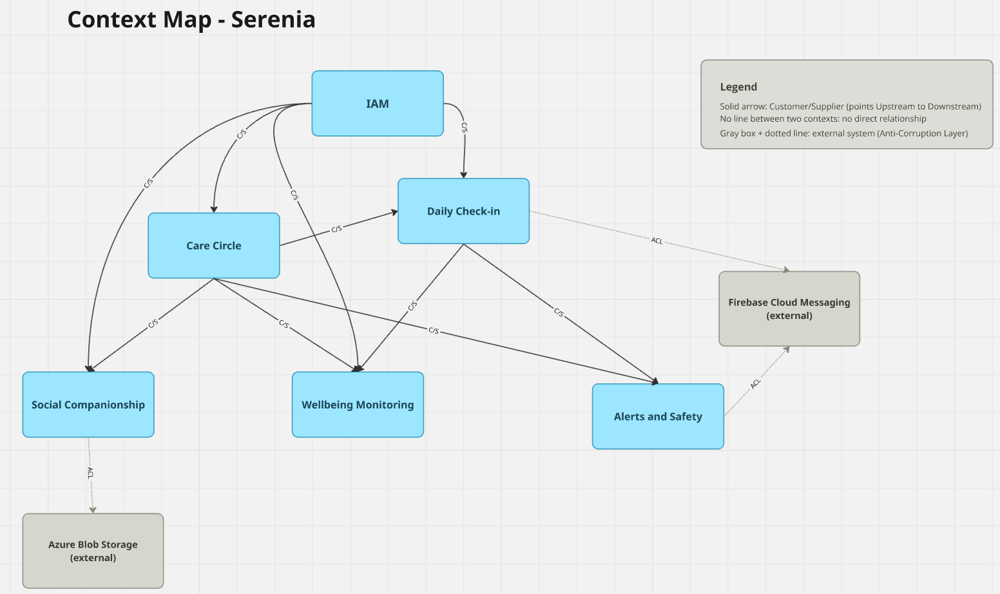
  <br/><i>Imagen 33. Context Mapping Diagram.</i>
</div>

**URL del tablero en Miro:** https://miro.com/app/board/uXjVHm8lGW8=/?share_link_id=454089766644

<br>

**Cómo se comunican los contextos:**

Cada relación del mapa corresponde a un mecanismo concreto, definido en las capas Application e Interface de la sección 2.6. El contexto upstream publica un contrato, que puede ser una fachada (`ContextFacade`) que responde con tipos primitivos o un evento de dominio, y el contexto downstream lo consume a través de una clase `External...Service` de su capa Application, que traduce la respuesta a sus propios tipos.

| Upstream | Downstream | Mecanismo |
| --- | --- | --- |
| IAM | Care Circle | Evento `OlderAdultRegistered`, que crea el círculo del adulto mayor, y fachada `IamContextFacade`, que entrega el rol y la zona horaria |
| IAM | Daily Check-in | Evento `OlderAdultRegistered`, que inicializa las preferencias del check-in, y fachada `IamContextFacade`, que entrega la zona horaria |
| IAM | Wellbeing Monitoring | Fachada `IamContextFacade`, que entrega la zona horaria del adulto mayor |
| IAM | Social Companionship | Fachada `IamContextFacade`, que entrega la zona horaria del adulto mayor |
| Care Circle | Daily Check-in | Fachada `CareCircleContextFacade`, que verifica que un familiar esté vinculado al adulto mayor |
| Care Circle | Wellbeing Monitoring | Fachada `CareCircleContextFacade`, que verifica el vínculo del familiar |
| Care Circle | Social Companionship | Fachada `CareCircleContextFacade`, que resuelve el círculo, los destinatarios y el acceso de cada usuario |
| Care Circle | Alerts and Safety | Fachada `CareCircleContextFacade`, que entrega los familiares vinculados a quienes se dirige la alerta |
| Daily Check-in | Wellbeing Monitoring | Evento `CheckInAnswered` y fachada `DailyCheckInContextFacade`, que entrega los estados de ánimo de los días anteriores |
| Daily Check-in | Alerts and Safety | Evento `CheckInMissed`, que inicia la evaluación de inactividad |

IAM no se relaciona con Alerts and Safety, porque esta solo necesita conocer a los familiares vinculados, que obtiene de Care Circle. Wellbeing Monitoring y Alerts and Safety tampoco se relacionan: el patrón de malestar detectado se resuelve dentro de Wellbeing Monitoring, que emite la sugerencia dirigida al familiar, por lo que no necesita pasar por Alerts and Safety.

**Sistemas externos:**

- **Firebase Cloud Messaging (Push Notification Provider):** Daily Check-in y Alerts and Safety dependen de un servicio de notificaciones push de terceros para llevar los recordatorios del check-in y las alertas de emergencia al dispositivo del usuario. El proveedor previsto es Firebase Cloud Messaging (FCM), cuya integración con la aplicación móvil y el backend se investiga y se prototipa en el spike SP01 del Product Backlog (Sprint 3).
- **Azure Blob Storage (Cloud Storage Provider):** Social Companionship guarda en un almacenamiento en la nube los archivos de audio y de foto que intercambian el adulto mayor y su familia. El backend lo implementa con un contenedor privado de Azure Blob Storage, al que accede mediante una abstracción de almacenamiento definida en su capa Application.

**Discusión de alternativas consideradas:**

- *¿Qué pasaría si IAM compartiera su modelo de cuenta (Account ID y Role) con los demás contextos mediante un Shared Kernel?* Era la solución de la primera versión del mapa, y se descartó al detallar las capas: cada contexto necesita solo datos puntuales de IAM, como el rol, la zona horaria o si la cuenta está activa, y IAM los expone mediante una fachada que responde con tipos primitivos. Compartir el modelo haría que cualquier cambio en IAM afectara a los otros cinco contextos al mismo tiempo, mientras que con la fachada cada consumidor traduce la respuesta a sus propios tipos y solo depende del contrato.
- *¿Qué pasaría si Wellbeing Monitoring y Alerts and Safety compartieran directamente su lógica de detección de anomalías?* Se evaluó, pero se decidió mantenerlos separados: Wellbeing Monitoring interpreta tendencias de bienestar (no urgentes), mientras que Alerts and Safety reacciona a emergencias y a la ausencia de respuesta, que requieren atención inmediata. Fusionarlos mezclaría dos responsabilidades con niveles de criticidad distintos.
- *¿Qué pasaría si creáramos un shared service para reducir la duplicación entre Care Circle y los contextos que consultan el vínculo familiar (Daily Check-in, Wellbeing Monitoring, Alerts and Safety y Social Companionship)?* Se descartó por ahora: como los cuatro consumen el mismo dato (autorización de vínculo) de la misma forma, no hay duplicación de lógica que justifique un servicio nuevo, ya que cada uno simplemente consulta a Care Circle como su proveedor (**Customer/Supplier**).
- *¿Qué pasaría si Daily Check-in, Alerts and Safety y Social Companionship adoptaran directamente el modelo de los proveedores externos (Conformist), en vez de traducirlo?* Se descartó: el modelo de un proveedor externo (tokens de dispositivo y formato de payload propio de cada plataforma en el caso del push, claves y contenedores en el caso del almacenamiento) es un detalle de infraestructura que no debería filtrarse al dominio, y adoptarlo tal cual dejaría a los contextos acoplados a las decisiones de ese proveedor. Por eso se optó por una **Anti-Corruption Layer (ACL)** que traduce el modelo externo antes de que entre al dominio.

**Patrones aplicados:**
- **Customer/Supplier:** es el patrón de todas las relaciones entre contextos internos. IAM, Care Circle y Daily Check-in actúan como proveedores y publican el contrato que los demás consumen, ya que todo el sistema lo construye el mismo equipo y puede coordinar los cambios entre contextos.
- **Anti-Corruption Layer (ACL):** Daily Check-in y Alerts and Safety con Firebase Cloud Messaging, y Social Companionship con Azure Blob Storage. Cada contexto traduce hacia y desde el modelo externo antes de operar con sus propios conceptos, lo que además facilita cambiar de proveedor sin afectar la lógica de negocio.
- **Shared Kernel:** no se aplicó, por las razones expuestas en la primera alternativa.
- **Conformist:** no se aplicó: se decidió no adoptar el modelo de los proveedores externos tal cual, precisamente para poder aislar el dominio.

<br>

### 2.5.3. Software Architecture

#### 2.5.3.1. Software Architecture Context Level Diagrams

En esta sección se presenta el *System Context Diagram*, primer nivel del C4 Model, elaborado en Structurizr. Este diagrama muestra al sistema Serenia como una única caja central, rodeada de los usuarios y de los sistemas externos con los que interactúa, sin entrar en detalles internos de la solución. La Imagen 34 presenta el diagrama.

<br>
<div align="center">

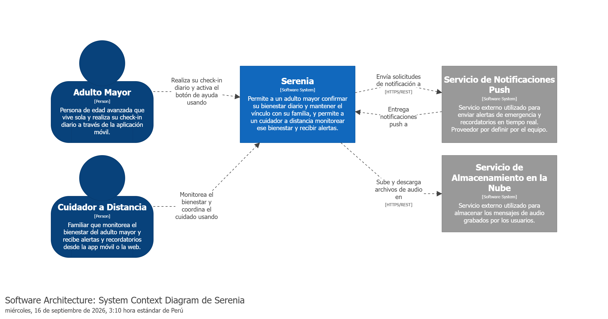
  <br/><i>Imagen 34. System Context Diagram de Serenia.</i>

</div>

<br>

Como se observa en el diagrama, el sistema Serenia interactúa con dos tipos de usuario: el **Adulto Mayor**, quien realiza el check-in diario y puede activar el botón de ayuda ante una emergencia, y el **Cuidador a Distancia**, quien recibe alertas, revisa el estado de bienestar y coordina el cuidado junto al resto del círculo familiar desde la aplicación móvil o la landing page web. Asimismo, Serenia depende de sistemas externos para su funcionamiento: un servicio de notificaciones push para el envío de alertas y recordatorios en tiempo real (proveedor aún por definir por el equipo), y un servicio de almacenamiento en la nube para los mensajes de audio grabados por los usuarios.

<br>

#### 2.5.3.2. Software Architecture Container Level Diagrams

En esta sección se presenta el *Container Diagram*, segundo nivel del C4 Model, el cual descompone al sistema Serenia en los grandes bloques tecnológicos (aplicaciones, servicios y almacenes de datos) que lo conforman, indicando la tecnología empleada en cada uno y la forma en que se comunican entre sí. La Imagen 35 presenta el diagrama.


<br>
<div align="center">

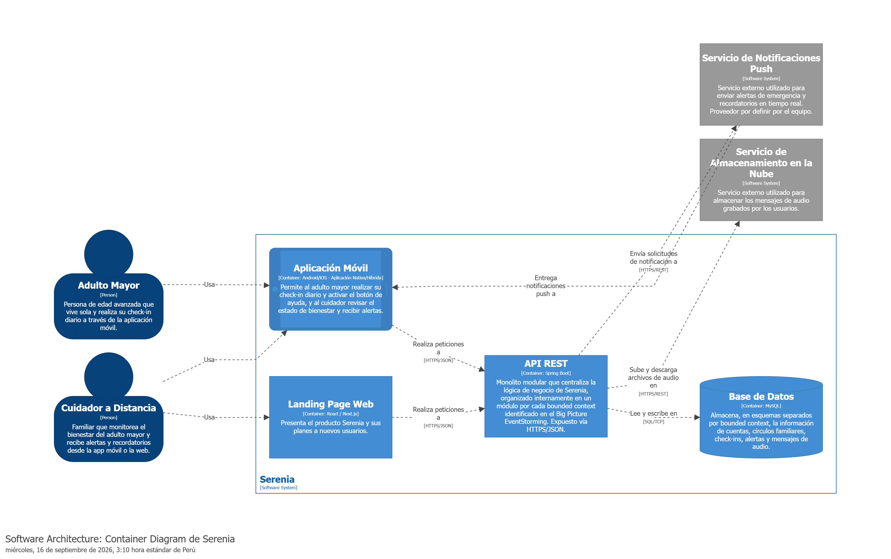
  <br/><i>Imagen 35. Container Diagram de Serenia.</i>

</div><br>

El diagrama evidencia los principales contenedores de la solución: la **aplicación móvil** (consumida por el adulto mayor y el cuidador a distancia), la **landing page web** (donde se presenta el producto y sus planes a nuevos usuarios), la **API REST** desarrollada en **Spring Boot**, implementada como un **monolito modular**, organizado internamente en un módulo por cada bounded context identificado en el Big Picture EventStorming (IAM, Care Circle, Daily Check-in, Wellbeing Monitoring, Alerts and Safety y Social Companionship), la **base de datos MySQL** donde se persiste, en esquemas separados por bounded context, la información de cuentas, círculos familiares, check-ins y alertas, y el **servicio de notificaciones push** (proveedor aún por definir por el equipo), encargado de entregar en tiempo real las alertas de emergencia y los recordatorios sociales. Todos los contenedores de cliente (móvil y web) se comunican con la API REST mediante peticiones HTTPS/JSON. La composición interna de dicho monolito por módulos se detalla más adelante en los *Component Level Diagrams* de cada bounded context. Una revisión sistemática reciente identifica como motivos de adopción del monolito modular el despliegue simplificado, la mantenibilidad y la menor sobrecarga de orquestación, y advierte de la dificultad de definir correctamente los bounded contexts (Al-Qora'n & Al-Said Ahmad, 2025).

Como evidencia complementaria de esta organización modular, se presenta a continuación, en la Imagen 36, el diagrama de componentes interno del contenedor API REST, elaborado también en Structurizr, que muestra los módulos correspondientes a cada bounded context y sus relaciones de dependencia:

<br>

<div align="center">

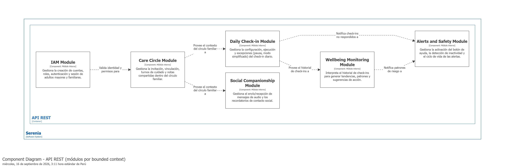
  <br/><i>Imagen 36. Component Diagram del contenedor API REST, organizado por bounded context.</i>

</div>

Como se observa, el módulo **IAM** valida la identidad y los permisos que consume el módulo **Care Circle**, el cual a su vez provee el contexto del círculo familiar tanto al módulo **Daily Check-in** como al módulo **Social Companionship**. El módulo **Daily Check-in** provee el historial de check-ins al módulo **Wellbeing Monitoring** y notifica directamente al módulo **Alerts and Safety** los check-ins no respondidos, mientras que **Wellbeing Monitoring** notifica a **Alerts and Safety** los patrones de riesgo detectados. Esta descomposición interna se retomará y detallará individualmente por cada bounded context.

<br>

#### 2.5.3.3. Software Architecture Deployment Diagrams

En esta sección se presenta el *Deployment Diagram*, el cual muestra la distribución física del sistema, destacando cómo los contenedores de software descritos en la sección anterior se despliegan sobre el hardware y los entornos correspondientes. Este diagrama visualiza los dispositivos, servidores, redes y demás nodos físicos que alojan el software, así como las relaciones y dependencias entre ellos. La Imagen 37 presenta el diagrama.

<br>
<div align="center">

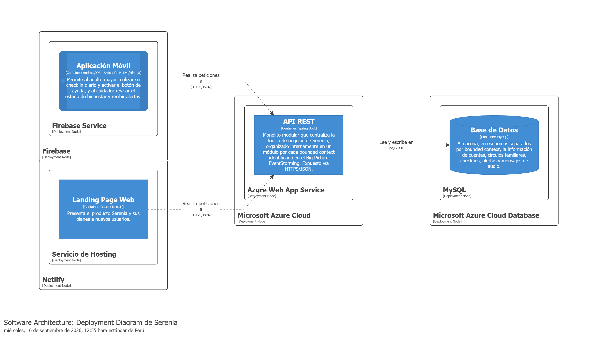
  <br/><i>Imagen 37. Deployment Diagram de Serenia.</i>

</div>
<br>

Como se observa en el diagrama, cada uno de los containers de Serenia se despliega sobre un proveedor de infraestructura distinto. La **Aplicación Móvil** se distribuye y se prueba en los dispositivos Android/iOS del adulto mayor y del cuidador a distancia a través de **Firebase**, específicamente mediante **Firebase App Distribution**, lo que permite instalar y validar la aplicación en distintos dispositivos de prueba antes de su lanzamiento. La **Landing Page Web**, al ser un sitio estático, se aloja en **Netlify**, como servicio de hosting/CDN independiente del backend. La **API REST**, correspondiente al monolito modular desarrollado en Spring Boot, se despliega en **Microsoft Azure**, específicamente en un **Azure Web App Service**, mientras que la **Base de Datos MySQL** se aloja en **Microsoft Azure Cloud**, dentro del mismo proveedor cloud que la API, lo que favorece una comunicación de baja latencia entre ambos containers. La Aplicación Móvil y la Landing Page Web realizan peticiones a la API REST vía HTTPS/JSON, y esta a su vez lee y escribe información en la base de datos utilizando el protocolo SQL/TCP.

<br>

## 2.6. Tactical-Level Domain-Driven Design
### 2.6.1. Bounded Context: Identity & Access Context

El bounded context Identity & Access concentra todo lo relacionado con la identidad de las personas que usan Serenia: el registro diferenciado de adultos mayores y familiares a distancia, el inicio y cierre de sesión, la actualización de los datos de perfil y el cambio de contraseña. Es un contexto genérico: sus reglas son estándar y no se derivan del negocio del cuidado, pero ningún otro contexto puede operar sin él, ya que toda acción del sistema se atribuye a un usuario autenticado y a un rol determinado.

Su modelo se organiza en dos aggregates. `User` garantiza la consistencia de la cuenta: credenciales, datos de perfil, rol y estado. `Session` representa cada acceso autenticado desde un dispositivo y se modela de forma independiente porque su número crece con cada inicio de sesión; mantenerla dentro de `User` obligaría a cargar todo el historial de accesos cada vez que se modifica la cuenta. Ambos aggregates se relacionan por identidad: una sesión conserva el `UserId` de su dueño, no una referencia al objeto.

El contexto es upstream del resto del sistema. Al registrarse un adulto mayor publica el evento `OlderAdultRegistered`, a partir del cual Care Circle crea su círculo de cuidado y Daily Check-in inicializa sus preferencias. Además, expone la fachada `IamContextFacade`, mediante la cual los demás contextos consultan el rol, el nombre o la zona horaria de un usuario sin depender de su modelo interno.

#### 2.6.1.1. Domain Layer

En esta capa se representan las reglas de negocio propias de la identidad de un usuario, sin dependencia de frameworks de persistencia, red ni interfaz. Los aggregates extienden la clase base `AggregateRoot` del shared kernel, que acumula los eventos de dominio registrados durante una operación para que la capa Application los publique después de persistir.

**Sub-capa Model: Aggregates**

`User` (Aggregate Root): representa la cuenta de una persona en Serenia, sea adulto mayor o familiar a distancia. Controla la validez de sus credenciales, sus datos de perfil y el estado de la cuenta.

| Atributo | Tipo | Visibilidad | Descripción |
| --- | --- | --- | --- |
| id | UserId | private | Identificador único de la cuenta. |
| email | EmailAddress | private | Correo electrónico único con el que el usuario inicia sesión. |
| passwordHash | PasswordHash | private | Representación cifrada de la contraseña; nunca almacena el valor en claro. |
| role | UserRole | private | Rol asignado en el registro; es inmutable y determina la aplicación a la que accede el usuario. |
| fullName | PersonName | private | Nombre completo del usuario. |
| phoneNumber | PhoneNumber | private | Número de contacto, opcional. |
| birthDate | LocalDate | private | Fecha de nacimiento, opcional; no puede ser posterior a la fecha actual. |
| photoUrl | String | private | Ubicación de la fotografía de perfil, opcional. |
| locale | LocaleCode | private | Idioma y región de la interfaz. |
| timeZone | ZoneId | private | Zona horaria del usuario; los demás contextos la usan para determinar el inicio y el fin de su día. |
| status | AccountStatus | private | Estado de la cuenta: activa, suspendida o eliminada. |
| createdAt | Instant | private | Instante de creación de la cuenta, en UTC. |
| updatedAt | Instant | private | Instante de la última modificación, en UTC. |

| Método | Visibilidad | Descripción |
| --- | --- | --- |
| registerOlderAdult(email, passwordHash, fullName, phoneNumber, birthDate, locale, timeZone) | public (static) | Factory que crea una cuenta activa con rol de adulto mayor y registra el evento `OlderAdultRegistered`. |
| registerDistantRelative(email, passwordHash, fullName, phoneNumber, birthDate, locale, timeZone) | public (static) | Factory que crea una cuenta activa con rol de familiar a distancia y registra el evento `DistantRelativeRegistered`. |
| updateProfileData(fullName, phoneNumber, birthDate, locale, timeZone) | public | Actualiza los datos personales de la cuenta y registra el evento `ProfileDataUpdated`. |
| updatePhoto(photoUrl) | public | Reemplaza la fotografía de perfil y registra el evento `UserPhotoUpdated`. |
| changePassword(newPasswordHash, preservedSessionId) | public | Sustituye la contraseña cifrada y registra el evento `PasswordChanged`, indicando la sesión desde la que se realizó el cambio. |
| isActive() | public | Indica si la cuenta se encuentra en estado activo. |
| isOlderAdult() | public | Indica si la cuenta tiene rol de adulto mayor. |
| ensureActive() | private | Impide modificar una cuenta suspendida o eliminada; lo invocan todos los métodos que alteran el estado. |

`Session` (Aggregate Root): representa un periodo de acceso autenticado de un usuario desde un dispositivo. Su identificador se genera antes que el token, porque viaja dentro de él.

| Atributo | Tipo | Visibilidad | Descripción |
| --- | --- | --- | --- |
| id | SessionId | private | Identificador único de la sesión. |
| userId | UserId | private | Referencia por identidad a la cuenta dueña de la sesión. |
| tokenHash | TokenHash | private | Representación cifrada del token entregado al cliente. |
| deviceInfo | DeviceInfo | private | Descripción del dispositivo desde el que se inició la sesión, opcional. |
| issuedAt | Instant | private | Instante de emisión del token, en UTC. |
| expiresAt | Instant | private | Instante en que el token deja de ser válido, en UTC. |
| revokedAt | Instant | private | Instante del cierre o revocación de la sesión; es nulo mientras siga abierta. |

| Método | Visibilidad | Descripción |
| --- | --- | --- |
| open(sessionId, userId, tokenHash, deviceInfo, issuedAt, expiresAt) | public (static) | Factory que abre una sesión, valida que la expiración sea posterior a la emisión y registra el evento `UserLoggedIn`. |
| close(closedAt) | public | Cierra la sesión por decisión del usuario y registra el evento `UserSessionClosed`; si ya estaba cerrada, no realiza cambios. |
| revoke(revokedAt) | public | Marca la sesión como revocada por una acción de seguridad; si ya estaba cerrada, no realiza cambios. |
| belongsTo(userId) | public | Indica si la sesión pertenece al usuario indicado; impide cerrar sesiones ajenas. |
| matchesToken(tokenHash) | public | Compara el hash del token presentado con el almacenado. |
| isExpired(referenceTime) | public | Indica si el token ya superó su instante de expiración. |
| isActive(referenceTime) | public | Indica si la sesión sigue vigente: no cerrada ni revocada, y no expirada. |

**Sub-capa Model: Entities**

Ninguno de los dos aggregates contiene entities internas; sus partes se modelan como value objects.

**Sub-capa Model: Value Objects**

Se implementan como records inmutables que validan su contenido al construirse. Los límites de longitud coinciden con las columnas de la base de datos.

| Nombre | Atributos | Descripción |
| --- | --- | --- |
| UserId | value: UUID | Identidad inmutable de una cuenta. |
| SessionId | value: UUID | Identidad inmutable de una sesión. |
| EmailAddress | value: String | Correo con formato válido y máximo 160 caracteres; se normaliza a minúsculas para que la unicidad no dependa de mayúsculas. |
| PasswordHash | value: String | Contraseña cifrada con BCrypt; impide que el dominio maneje texto plano. |
| TokenHash | value: String | Hash SHA-256 del token de sesión, de 64 caracteres hexadecimales. |
| PersonName | value: String | Nombre completo obligatorio, de máximo 120 caracteres. |
| PhoneNumber | value: String | Número telefónico en formato E.164 (por ejemplo, +51987654321), de máximo 20 caracteres. |
| LocaleCode | value: String | Código de idioma y región de la interfaz, de máximo 10 caracteres. |
| DeviceInfo | value: String | Descripción del dispositivo asociado a una sesión, de máximo 200 caracteres. |

**Sub-capa Model: Enumerations**

| Nombre | Valores | Descripción |
| --- | --- | --- |
| UserRole | OLDER_ADULT, DISTANT_RELATIVE | Rol del usuario, definido en el registro e inmutable. |
| AccountStatus | ACTIVE, SUSPENDED, DELETED | Estado del ciclo de vida de la cuenta. |

**Sub-capa Model: Commands**

| Nombre | Atributos | Descripción |
| --- | --- | --- |
| RegisterOlderAdultCommand | email, password, fullName, phoneNumber, birthDate, locale, timeZone | Intención de crear una cuenta con rol de adulto mayor. |
| RegisterDistantRelativeCommand | email, password, fullName, phoneNumber, birthDate, locale, timeZone | Intención de crear una cuenta con rol de familiar a distancia. |
| SignInCommand | email, password, deviceInfo | Intención de autenticar a un usuario y abrir una sesión. |
| SignOutCommand | sessionId, userId | Intención de cerrar una sesión vigente del usuario solicitante. |
| UpdateUserPhotoCommand | userId, photoUrl | Intención de actualizar la fotografía de perfil. |
| UpdateProfileDataCommand | userId, fullName, phoneNumber, birthDate, locale, timeZone | Intención de actualizar los datos personales del perfil. |
| ChangePasswordCommand | userId, sessionId, currentPassword, newPassword | Intención de reemplazar la contraseña, previa verificación de la contraseña actual. |
| RevokeSessionsCommand | userId, preservedSessionId | Intención de revocar las sesiones vigentes del usuario distintas a la que realizó el cambio de contraseña. |

**Sub-capa Model: Queries**

| Nombre | Atributos | Descripción |
| --- | --- | --- |
| GetUserByIdQuery | userId | Consulta de una cuenta por su identificador. |
| GetActiveSessionByIdQuery | sessionId | Consulta de una sesión que siga vigente; la utiliza el filtro de autorización en cada petición. |

**Sub-capa Model: Events**

| Nombre | Atributos | Descripción |
| --- | --- | --- |
| OlderAdultRegistered | userId, occurredAt | Se creó una cuenta con rol de adulto mayor. Lo consumen Care Circle y Daily Check-in. |
| DistantRelativeRegistered | userId, occurredAt | Se creó una cuenta con rol de familiar a distancia. |
| UserLoggedIn | userId, sessionId, occurredAt | Un usuario se autenticó correctamente y abrió una sesión. |
| UserSessionClosed | userId, sessionId, occurredAt | Un usuario cerró su sesión de forma explícita. |
| UserPhotoUpdated | userId, occurredAt | Se actualizó la fotografía de perfil de un usuario. |
| ProfileDataUpdated | userId, occurredAt | Se actualizaron los datos personales de un usuario. |
| PasswordChanged | userId, preservedSessionId, occurredAt | Se modificó la contraseña de una cuenta desde la sesión indicada. |
| SessionsRevoked | userId, revokedSessionIds, occurredAt | Se revocaron las demás sesiones vigentes de un usuario tras el cambio de su contraseña. |

**Sub-capa Repositories**

| Tipo | Nombre | Métodos principales | Descripción |
| --- | --- | --- | --- |
| Interface | UserRepository | save(user), findById(userId), findByEmail(email), existsByEmail(email) | Contrato de persistencia del aggregate `User`. Se implementa en Infrastructure. |
| Interface | SessionRepository | save(session), saveAll(sessions), findById(sessionId), findActiveByUserId(userId, referenceTime) | Contrato de persistencia del aggregate `Session`. Se implementa en Infrastructure. |

**Sub-capa Services**

| Tipo | Nombre | Métodos principales | Descripción |
| --- | --- | --- | --- |
| Interface | UserCommandService | handle(RegisterOlderAdultCommand), handle(RegisterDistantRelativeCommand), handle(UpdateUserPhotoCommand), handle(UpdateProfileDataCommand), handle(ChangePasswordCommand) | Contrato de las operaciones de escritura sobre las cuentas. |
| Interface | UserQueryService | handle(GetUserByIdQuery) | Contrato de las operaciones de lectura sobre las cuentas. |
| Interface | SessionCommandService | handle(SignInCommand), handle(SignOutCommand), handle(RevokeSessionsCommand) | Contrato de las operaciones de autenticación, cierre y revocación de sesiones. |
| Interface | SessionQueryService | handle(GetActiveSessionByIdQuery) | Contrato de la lectura de sesiones vigentes. |

#### 2.6.1.2. Interface Layer

Clases que exponen el bounded context hacia el exterior y traducen las peticiones entrantes al lenguaje del dominio.

**Sub-capa REST: Controllers**

| Nombre | Endpoints | Descripción |
| --- | --- | --- |
| UsersController | POST /api/v1/users, GET /api/v1/users/{userId}, PUT /api/v1/users/{userId}/profile, PUT /api/v1/users/{userId}/photo, PUT /api/v1/users/{userId}/password | Punto de entrada del registro, la consulta y la gestión del perfil. El registro es público y elige el comando según el rol recibido. Las operaciones de modificación solo proceden cuando `{userId}` coincide con el usuario autenticado; en caso contrario responde 403 Forbidden. |
| SessionsController | POST /api/v1/sessions, DELETE /api/v1/sessions/{sessionId} | Punto de entrada de la autenticación, que responde con el token emitido, y del cierre de sesión. |

**Sub-capa REST: Resources**

| Nombre | Atributos | Descripción |
| --- | --- | --- |
| RegisterUserResource | email, password, role, fullName, phoneNumber, birthDate, locale, timeZone | Datos de entrada del registro, incluido el rol solicitado. |
| UserResource | id, email, role, fullName, phoneNumber, birthDate, photoUrl, locale, timeZone, status | Representación pública de una cuenta, sin datos sensibles. |
| SignInResource | email, password, deviceInfo | Credenciales enviadas para solicitar una sesión. |
| AuthenticatedUserResource | sessionId, token, expiresAt, user | Token de sesión emitido junto con los datos del usuario autenticado. |
| UpdateProfileDataResource | fullName, phoneNumber, birthDate, locale, timeZone | Datos de entrada para actualizar los datos personales. |
| UpdateUserPhotoResource | photoUrl | Datos de entrada para actualizar la fotografía de perfil. |
| ChangePasswordResource | currentPassword, newPassword | Datos de entrada para el cambio de contraseña. |

**Sub-capa REST: Transform**

| Nombre | Descripción |
| --- | --- |
| UserResourceFromEntityAssembler | Convierte el aggregate `User` en su representación REST. |
| AuthenticatedUserResourceFromEntityAssembler | Combina el usuario, la sesión abierta y el token emitido en un único recurso de respuesta. |
| RegisterOlderAdultCommandFromResourceAssembler | Convierte la petición de registro en el comando de adulto mayor. |
| RegisterDistantRelativeCommandFromResourceAssembler | Convierte la petición de registro en el comando de familiar a distancia. |
| SignInCommandFromResourceAssembler | Convierte las credenciales recibidas en el comando de autenticación. |
| UpdateProfileDataCommandFromResourceAssembler | Convierte la petición de datos personales en su comando. |
| UpdateUserPhotoCommandFromResourceAssembler | Convierte la petición de fotografía en su comando. |
| ChangePasswordCommandFromResourceAssembler | Combina la petición con el usuario y la sesión autenticados para construir el comando de cambio de contraseña. |

**Sub-capa ACL**

| Tipo | Nombre | Métodos principales | Descripción |
| --- | --- | --- | --- |
| Interface | IamContextFacade | existsActiveUserById(userId): boolean, fetchUserRoleById(userId): Optional\<String\>, fetchFullNameById(userId): Optional\<String\>, fetchTimeZoneById(userId): Optional\<String\> | Contrato que el contexto ofrece a los demás. Care Circle lo usa para validar que quien canjea un código es un familiar a distancia; Daily Check-in, Wellbeing Monitoring y Social Companionship, para obtener la zona horaria del adulto mayor; los contextos con vistas compartidas, para mostrar nombres. Recibe y devuelve tipos primitivos (`UUID`, `String`) para no exponer clases del dominio. |

#### 2.6.1.3. Application Layer

Clases que orquestan los flujos del contexto, coordinando los aggregates, los repositorios y los servicios técnicos de seguridad.

**Sub-capa Internal: CommandServices (Command Handlers)**

| Nombre | Responsabilidad principal | Relación con otros elementos |
| --- | --- | --- |
| UserCommandServiceImpl | Registra cuentas: verifica que el correo no exista, cifra la contraseña e invoca la factory del rol correspondiente. Actualiza los datos personales y la fotografía. En el cambio de contraseña verifica primero la contraseña actual y rechaza el cambio si no coincide. Tras persistir, publica los eventos acumulados por el aggregate. | Implementa `UserCommandService`; usa `UserRepository`, `HashingService` y `DomainEventPublisher`. |
| SessionCommandServiceImpl | En el inicio de sesión busca la cuenta por correo, verifica que esté activa y valida la contraseña; si el correo no existe o la contraseña es incorrecta, devuelve el mismo error para no revelar qué correos están registrados. Luego genera el `SessionId`, emite el token con ese identificador, almacena solo su hash y abre la `Session`. En el cierre de sesión verifica que la sesión pertenezca al solicitante y la cierra. En la revocación cierra las sesiones vigentes del usuario excepto la indicada y publica un único evento `SessionsRevoked` con las sesiones afectadas. | Implementa `SessionCommandService`; usa `UserRepository`, `SessionRepository`, `HashingService`, `TokenService` y `DomainEventPublisher`. |

**Sub-capa Internal: QueryServices**

| Nombre | Responsabilidad principal | Relación con otros elementos |
| --- | --- | --- |
| UserQueryServiceImpl | Resuelve la consulta de una cuenta por su identificador sin modificar el estado. | Implementa `UserQueryService`; usa `UserRepository`. |
| SessionQueryServiceImpl | Devuelve una sesión solo si sigue vigente en el instante de la consulta. | Implementa `SessionQueryService`; usa `SessionRepository`. |

**Sub-capa Internal: Event Handlers**

| Nombre | Responsabilidad principal | Relación con otros elementos |
| --- | --- | --- |
| PasswordChangedEventHandler | Solicita la revocación de las demás sesiones del usuario tras el cambio de contraseña, de modo que un dispositivo con la contraseña anterior pierde el acceso. Se ejecuta de forma síncrona dentro de la misma transacción del cambio. | Escucha `PasswordChanged`; envía `RevokeSessionsCommand`. |

El evento `OlderAdultRegistered` no tiene handlers en este contexto: lo consumen Care Circle y Daily Check-in.

**Sub-capa Internal: Outbound Services**

| Tipo | Nombre | Métodos principales | Descripción |
| --- | --- | --- | --- |
| Interface | HashingService | encode(rawPassword), matches(rawPassword, passwordHash) | Abstracción del cifrado y la verificación de contraseñas. |
| Interface | TokenService | generateToken(userId, sessionId, role, expiresAt), validateToken(token), extractSessionId(token), hash(token) | Abstracción de la emisión, validación y cifrado de los tokens de sesión. |
| Interface | DomainEventPublisher | publish(events) | Abstracción para publicar los eventos de dominio hacia los demás contextos. |

**Sub-capa ACL**

| Nombre | Responsabilidad principal | Relación con otros elementos |
| --- | --- | --- |
| IamContextFacadeImpl | Resuelve las consultas de otros contextos a partir de la cuenta solicitada y las devuelve en tipos primitivos. | Implementa `IamContextFacade`; usa `UserQueryService`. |

#### 2.6.1.4. Infrastructure Layer

Clases que resuelven el acceso a la base de datos MySQL y a los mecanismos técnicos de seguridad, implementando las abstracciones definidas en las capas Domain y Application.

**Sub-capa Persistence: JPA Entities**

| Nombre | Responsabilidad principal | Relación con otros elementos |
| --- | --- | --- |
| UserPersistenceEntity | Representa una fila de la tabla `users`: los identificadores UUID se almacenan como `BINARY(16)`, los enums como texto y los instantes como `DATETIME(6)` en UTC. | Usada por `UserJpaRepository` y `UserPersistenceMapper`. |
| SessionPersistenceEntity | Representa una fila de la tabla `sessions`. | Usada por `SessionJpaRepository` y `SessionPersistenceMapper`. |

**Sub-capa Persistence: JPA Repositories**

| Nombre | Responsabilidad principal | Relación con otros elementos |
| --- | --- | --- |
| UserJpaRepository | Interfaz de Spring Data JPA con las consultas `existsByEmail` y `findByEmail`, resueltas sobre el índice único de `email`. | Extiende `JpaRepository`; usada por `UserRepositoryImpl`. |
| SessionJpaRepository | Interfaz de Spring Data JPA con la consulta de sesiones no revocadas y no expiradas de un usuario. | Extiende `JpaRepository`; usada por `SessionRepositoryImpl`. |

**Sub-capa Persistence: Repositories**

| Nombre | Responsabilidad principal | Relación con otros elementos |
| --- | --- | --- |
| UserRepositoryImpl | Persiste y recupera el aggregate `User`. Si dos registros simultáneos usan el mismo correo, traduce la violación del índice único en una excepción de dominio. | Implementa `UserRepository`; usa `UserJpaRepository` y `UserPersistenceMapper`. |
| SessionRepositoryImpl | Persiste y recupera el aggregate `Session`. | Implementa `SessionRepository`; usa `SessionJpaRepository` y `SessionPersistenceMapper`. |

**Sub-capa Persistence: Mappers**

| Nombre | Responsabilidad principal | Relación con otros elementos |
| --- | --- | --- |
| UserPersistenceMapper | Traduce entre el aggregate `User` y `UserPersistenceEntity`, evitando que el modelo de persistencia se filtre al dominio. | Usado por `UserRepositoryImpl`. |
| SessionPersistenceMapper | Traduce entre el aggregate `Session` y `SessionPersistenceEntity`. | Usado por `SessionRepositoryImpl`. |

**Sub-capa Security: Services**

| Nombre | Responsabilidad principal | Relación con otros elementos |
| --- | --- | --- |
| BCryptHashingServiceImpl | Cifra las contraseñas y verifica credenciales mediante BCrypt. | Implementa `HashingService`. |
| JwtTokenServiceImpl | Emite tokens JWT firmados con la clave `JWT_SECRET`, con el identificador del usuario, el de la sesión, el rol y la expiración. Calcula el hash del token con SHA-256, ya que se verifica en cada petición y el token tiene suficiente entropía como para no requerir un algoritmo lento como BCrypt. | Implementa `TokenService`. |

**Sub-capa Security: Authorization**

| Nombre | Responsabilidad principal | Relación con otros elementos |
| --- | --- | --- |
| BearerAuthorizationRequestFilter | En cada petición extrae el token del encabezado `Authorization`, valida su firma y expiración, obtiene el identificador de la sesión y comprueba que siga vigente y que el hash coincida. Si la sesión fue cerrada o revocada, la petición se rechaza con 401 Unauthorized. Si es válida, registra el usuario y su rol en el contexto de seguridad sin cargar la cuenta completa. | Usa `TokenService` y `SessionQueryService`. |
| WebSecurityConfiguration | Configura Spring Security sin estado de servidor, deja públicas las rutas de registro, inicio de sesión y documentación, exige autenticación en el resto y registra el filtro de autorización. | Registra `BearerAuthorizationRequestFilter`. |

**Sub-capa Messaging: Publishers**

| Nombre | Responsabilidad principal | Relación con otros elementos |
| --- | --- | --- |
| SpringDomainEventPublisher | Publica los eventos de dominio dentro del monolito modular mediante el `ApplicationEventPublisher` de Spring, sin un message broker externo. | Implementa `DomainEventPublisher`. |

#### 2.6.1.5. Bounded Context Software Architecture Component Level Diagrams

En esta sección se presenta el Component Diagram de C4 Model correspondiente al bounded context Identity & Access, elaborado con la herramienta Structurizr (Imagen 38). El diagrama descompone el módulo de identidad dentro del container API REST y muestra cómo sus componentes se distribuyen entre las cuatro capas del diseño táctico, respetando la regla de dependencia unidireccional hacia el dominio.

El flujo de entrada llega desde la Aplicación Móvil hacia los dos componentes de la capa Interface: `UsersController`, que atiende el registro, la consulta de cuentas y las operaciones de perfil, y `SessionsController`, que atiende la autenticación y el cierre de sesión. Ambos delegan en la capa Application, donde `UserCommandService` resuelve las operaciones de escritura y `UserQueryService` las de lectura.

En el centro del diagrama se ubica el aggregate `User`, junto con la entidad `Session` que contiene, los Commands y Queries que expresan las intenciones del contexto y los Domain Events que se publican al completarse cada operación. Alrededor del aggregate se muestran las abstracciones que el dominio declara y que ninguna capa superior implementa: `IUserRepository`, `IPasswordHashingService`, `ITokenService` e `IDomainEventPublisher`.

La capa Infrastructure aparece en el extremo opuesto, con las implementaciones concretas de esas abstracciones: `UserRepository`, que persiste el aggregate sobre las tablas `users` y `sessions` apoyándose en `UserPersistenceMapper`; `BCryptPasswordHashingService`, encargado del cifrado y la verificación de credenciales; `JwtTokenService`, que emite los tokens de sesión y calcula su hash; y `DomainEventPublisherAdapter`, que publica los eventos de dominio dentro del monolito modular para que otros módulos reaccionen a ellos. Las flechas evidencian que las dependencias apuntan siempre hacia el dominio y que ningún componente de Interface accede directamente a la base de datos.

<div align="center">

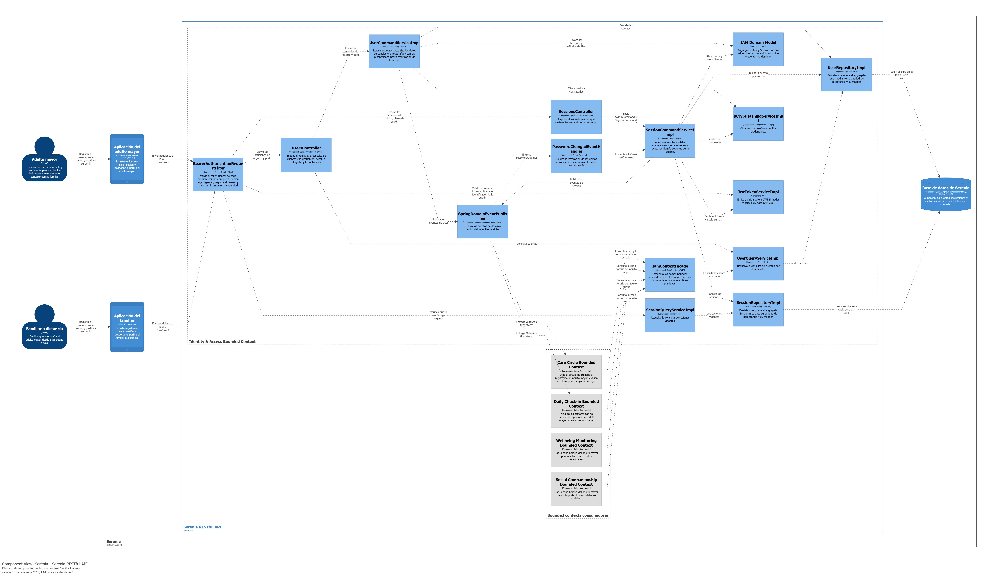
  <br/><i>Imagen 38. Component Diagram del Bounded Context Identity and Access.</i>

</div>

#### 2.6.1.6. Bounded Context Software Architecture Code Level Diagrams

En esta sección se presentan los diagramas de mayor nivel de detalle sobre la implementación del bounded context Identity & Access. Se incluye el diagrama de clases de la capa Domain y el diagrama de diseño de base de datos correspondiente a las tablas que dan persistencia al aggregate.

##### 2.6.1.6.1. Bounded Context Domain Layer Class Diagrams

El diagrama de clases representa la capa Domain del bounded context Identity & Access, elaborado con la herramienta UML correspondiente (Imagen 39). En él se muestran las clases, interfaces y enumeraciones del dominio junto con sus atributos, métodos y el scope de cada miembro.

El elemento central es `User`, el aggregate root del contexto. Sus atributos son privados y solo se modifican a través de sus métodos públicos, lo que garantiza que ninguna regla de identidad pueda vulnerarse desde fuera del aggregate. `User` mantiene una relación de composición con `Session`, con multiplicidad 1 a 0..*: una cuenta puede tener varias sesiones a lo largo del tiempo y ninguna sesión existe de forma independiente de la cuenta que la originó. Por ello, la apertura y la revocación de sesiones se realizan mediante los métodos `openSession` y `closeSession` del aggregate, y no sobre la entidad directamente.

Los value objects aparecen relacionados con `User` y con `Session` por composición, cada uno con multiplicidad 1, salvo aquellos que corresponden a datos opcionales de la cuenta. Estos tipos encapsulan las validaciones de formato y evitan la obsesión por primitivos: el dominio nunca maneja un correo, una contraseña o un token como cadenas simples. Las enumeraciones `UserRole` y `AccountStatus` se asocian también a `User` con multiplicidad 1, y expresan respectivamente el rol inmutable definido en el registro y el estado del ciclo de vida de la cuenta.

El diagrama incluye además los Commands y Queries que expresan las intenciones de escritura y lectura del contexto, y los Domain Events que el aggregate registra al completarse cada operación. Finalmente se muestran las abstracciones declaradas por el dominio: `IUserRepository`, que define el contrato de persistencia del aggregate; `IUserCommandService` e `IUserQueryService`, que definen las operaciones de escritura y lectura; e `IPasswordHashingService`, `ITokenService` e `IDomainEventPublisher`, que aíslan al dominio de los mecanismos técnicos de cifrado, emisión de tokens y publicación de eventos. Ninguna de estas interfaces depende de las capas superiores, de modo que las dependencias apuntan siempre hacia el dominio.

<div align="center">

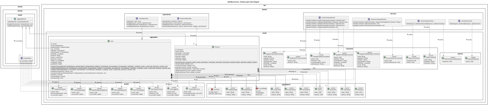
  <br/><i>Imagen 39. Domain Layer Class Diagram del Bounded Context Identity and Access.</i>

</div>

<br>

##### 2.6.1.6.2. Bounded Context Database Design Diagram

El diagrama de base de datos (Imagen 40) presenta los objetos que permiten la persistencia del bounded context Identity & Access sobre el motor MySQL. El contexto se materializa en dos tablas, `users` y `sessions`, que corresponden respectivamente al aggregate root `User` y a la entidad `Session` que este contiene.

**Tabla `users`**

| Columna | Tipo | Constraints | Descripción |
| --- | --- | --- | --- |
| id | uuid | PK | Identificador único de la cuenta. |
| email | varchar(160) | NOT NULL, UNIQUE | Correo electrónico con el que el usuario inicia sesión. |
| password_hash | varchar(255) | NOT NULL | Contraseña cifrada de la cuenta. |
| role | user_role | NOT NULL | Rol del usuario: adulto mayor o familiar a distancia. |
| full_name | varchar(120) | NOT NULL | Nombre completo del usuario. |
| phone_number | varchar(20) | - | Número de contacto del usuario. |
| birth_date | date | - | Fecha de nacimiento del usuario. |
| photo_url | varchar(500) | - | Ubicación de la fotografía de perfil del usuario. |
| locale | varchar(10) | NOT NULL, DEFAULT 'es_419' | Idioma y región de la interfaz. |
| status | account_status | NOT NULL, DEFAULT 'ACTIVE' | Estado de la cuenta: activa, suspendida o eliminada. |
| created_at | timestamp | NOT NULL | Fecha y hora de creación de la cuenta. |
| updated_at | timestamp | NOT NULL | Fecha y hora de la última modificación. |

La tabla incluye un índice único sobre `email`, que garantiza a nivel de base de datos la regla de unicidad de cuentas, y un índice sobre `role`, que optimiza las consultas que filtran usuarios según el tipo de aplicación a la que acceden.

**Tabla `sessions`**

| Columna | Tipo | Constraints | Descripción |
| --- | --- | --- | --- |
| id | uuid | PK | Identificador único de la sesión. |
| user_id | uuid | NOT NULL, FK → users.id | Cuenta a la que pertenece la sesión. |
| token_hash | varchar(255) | NOT NULL | Token de sesión cifrado entregado al cliente. |
| device_info | varchar(200) | - | Descripción del dispositivo desde el que se inició la sesión. |
| issued_at | timestamp | NOT NULL | Fecha y hora de emisión del token. |
| expires_at | timestamp | NOT NULL | Fecha y hora en que el token deja de ser válido. |
| revoked_at | timestamp | - | Fecha y hora del cierre de sesión, si este ocurrió. |

La tabla cuenta con un índice sobre `user_id`, que soporta la consulta de las sesiones vigentes de una cuenta.

**Relación entre tablas**

Existe una relación de uno a muchos entre `users` y `sessions`: una cuenta puede tener cero o varias sesiones registradas, mientras que toda sesión pertenece obligatoriamente a una única cuenta. Esta relación se implementa mediante la clave foránea `sessions.user_id`, que referencia a `users.id` y que refleja en la base de datos la composición definida en el modelo de dominio entre el aggregate `User` y la entidad `Session`.

<div align="center">

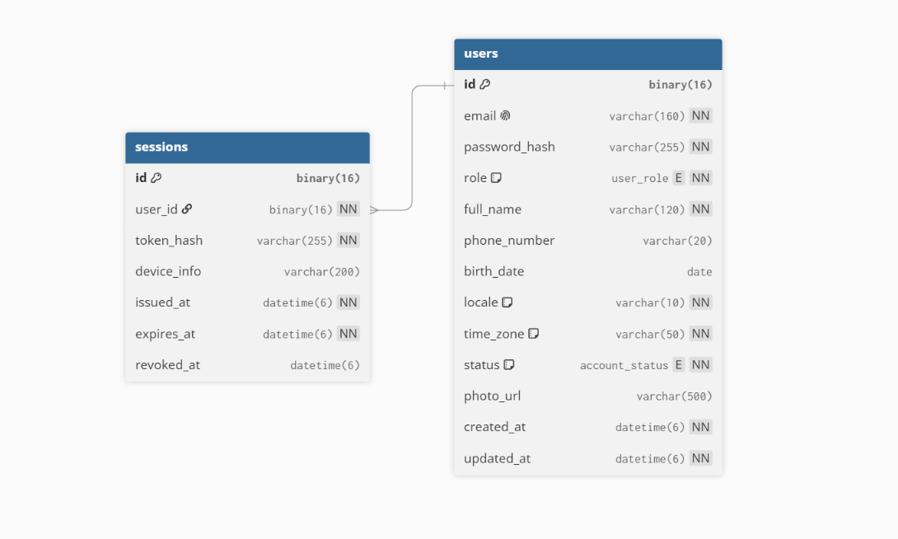
  <br/><i>Imagen 40. Database Design Diagram del Bounded Context Identity and Access.</i>

</div>

<br>

### 2.6.2. Bounded Context: Care Circle

El bounded context Care Circle gestiona la red de apoyo de cada adulto mayor: qué familiares lo acompañan, cómo se incorporan y cómo se coordinan entre ellos. Cubre la generación y el canje de códigos de invitación, el establecimiento y la revocación de vínculos familiares, la asignación de turnos de atención y las notas compartidas. Es un contexto de soporte del que depende el resto del sistema: a través de él se determina qué familiares pueden consultar la información de un adulto mayor y a quiénes deben dirigirse sus alertas.

Su modelo se organiza en tres aggregates. `CareCircle` reúne los códigos de invitación y los vínculos familiares, porque las reglas que los relacionan deben verificarse de forma conjunta: un código se canjea una sola vez y un familiar no puede tener dos vínculos activos con el mismo círculo. La cantidad de códigos y vínculos por círculo es pequeña, acotada por el tamaño de la familia, por lo que cargarlos juntos no representa un costo relevante. `CareShift` y `SharedNote` son independientes: un turno o una nota se modifican sin afectar a los vínculos, y separarlos evita que dos familiares que editan al mismo tiempo compitan por el mismo aggregate. Ambos referencian al círculo por su identificador.

Cada adulto mayor tiene exactamente un círculo, que se crea al completarse su registro en Identity & Access. El contexto consulta a Identity & Access el rol de quien canjea un código y la zona horaria del adulto mayor, y expone la fachada `CareCircleContextFacade` para que los demás contextos verifiquen vínculos y obtengan los familiares activos.

#### 2.6.2.1. Domain Layer

En esta capa se representan las reglas de formación y coordinación de la red de apoyo, sin dependencia de frameworks de persistencia, red ni interfaz. Toda operación sobre un círculo exige que quien la solicita sea el adulto mayor dueño o un familiar con vínculo activo.

**Sub-capa Model: Aggregates**

`CareCircle` (Aggregate Root): representa la red de apoyo de un adulto mayor. Controla la emisión y el canje de códigos de invitación y el ciclo de vida de los vínculos familiares.

| Atributo | Tipo | Visibilidad | Descripción |
| --- | --- | --- | --- |
| id | CareCircleId | private | Identificador único del círculo. |
| olderAdultId | OlderAdultId | private | Adulto mayor dueño del círculo; cada adulto mayor tiene un único círculo. |
| invitationCodes | List\<InvitationCode\> | private | Códigos de invitación generados para el círculo. |
| familyLinks | List\<FamilyLink\> | private | Vínculos familiares del círculo, activos o revocados. |
| createdAt | Instant | private | Instante de creación del círculo, en UTC. |

| Método | Visibilidad | Descripción |
| --- | --- | --- |
| create(olderAdultId, createdAt) | public (static) | Factory que crea el círculo de un adulto mayor y registra el evento `CareCircleCreated`. |
| generateInvitationCode(requesterId, code, createdAt, expiresAt) | public | Genera un código pendiente; solo el adulto mayor dueño puede solicitarlo. Registra el evento `InvitationCodeGenerated`. |
| expireInvitationCode(invitationCodeId, referenceTime) | public | Marca como expirado un código pendiente cuya vigencia terminó y registra el evento `InvitationCodeExpired`. |
| redeemInvitationCode(code, relativeId, relationshipLabel, redeemedAt) | public | Marca el código como usado por el familiar. Rechaza el canje si el código ya fue usado, si su vigencia terminó aunque aún no haya sido marcado como expirado, o si el familiar ya tiene un vínculo activo con el círculo. Registra el evento `InvitationCodeRedeemed`. |
| establishFamilyLink(relativeId, relationshipLabel, linkedAt) | public | Crea un vínculo activo con el familiar; si existe un vínculo revocado previo, lo reactiva en lugar de crear otro. Registra el evento `FamilyLinkEstablished`. |
| revokeFamilyLink(familyLinkId, requesterId, revokedAt) | public | Revoca un vínculo activo. El adulto mayor puede revocar cualquier vínculo de su círculo; un familiar, solo el propio. Registra el evento `FamilyLinkRevoked`. |
| hasAccess(userId) | public | Indica si el usuario es el adulto mayor dueño o un familiar con vínculo activo. |
| isActiveRelative(relativeId) | public | Indica si el familiar tiene un vínculo activo con el círculo. |
| activeFamilyLinks() | public | Devuelve los vínculos activos del círculo. |

`CareShift` (Aggregate Root): representa la responsabilidad de un familiar sobre el seguimiento del adulto mayor en una fecha determinada.

| Atributo | Tipo | Visibilidad | Descripción |
| --- | --- | --- | --- |
| id | CareShiftId | private | Identificador único del turno. |
| careCircleId | CareCircleId | private | Referencia por identidad al círculo del turno. |
| relativeId | RelativeId | private | Familiar responsable del turno. |
| shiftDate | LocalDate | private | Fecha del turno, expresada en la zona horaria del adulto mayor. |
| createdAt | Instant | private | Instante de creación del turno, en UTC. |
| updatedAt | Instant | private | Instante de la última modificación, en UTC. |

| Método | Visibilidad | Descripción |
| --- | --- | --- |
| assign(careCircleId, relativeId, shiftDate, today, createdAt) | public (static) | Factory que asigna el turno a un familiar; rechaza fechas anteriores al día actual del adulto mayor. Registra el evento `CareShiftAssigned`. |
| reassignTo(newRelativeId, today, updatedAt) | public | Cambia el responsable del turno; rechaza turnos de fechas pasadas y reasignaciones al mismo familiar. Permite cubrir los turnos de un familiar cuyo vínculo fue revocado. Registra el evento `CareShiftReassigned`. |
| isAssignedTo(relativeId) | public | Indica si el turno está asignado al familiar indicado. |

`SharedNote` (Aggregate Root): representa una nota con información relevante sobre el adulto mayor, visible para todos los familiares del círculo.

| Atributo | Tipo | Visibilidad | Descripción |
| --- | --- | --- | --- |
| id | SharedNoteId | private | Identificador único de la nota. |
| careCircleId | CareCircleId | private | Referencia por identidad al círculo de la nota. |
| authorId | RelativeId | private | Familiar que creó la nota. |
| content | NoteContent | private | Contenido de la nota. |
| createdAt | Instant | private | Instante de creación de la nota, en UTC. |
| updatedAt | Instant | private | Instante de la última edición, en UTC. |

| Método | Visibilidad | Descripción |
| --- | --- | --- |
| create(careCircleId, authorId, content, createdAt) | public (static) | Factory que registra una nueva nota y el evento `SharedNoteCreated`. |
| edit(editorId, content, updatedAt) | public | Reemplaza el contenido de la nota; solo el autor puede editarla. Registra el evento `SharedNoteEdited`. |
| isAuthoredBy(relativeId) | public | Indica si la nota fue creada por el familiar indicado. |

**Sub-capa Model: Entities**

`InvitationCode`: representa un código temporal que permite a un familiar incorporarse al círculo. Pertenece al aggregate `CareCircle` y no se manipula fuera de él.

| Atributo | Tipo | Visibilidad | Descripción |
| --- | --- | --- | --- |
| id | InvitationCodeId | private | Identificador único del código. |
| code | InvitationCodeValue | private | Valor que el adulto mayor comparte con su familiar. |
| status | InvitationStatus | private | Estado del código: pendiente, usado o expirado. |
| createdAt | Instant | private | Instante de generación, en UTC. |
| expiresAt | Instant | private | Instante en que termina la vigencia del código, en UTC. |
| usedAt | Instant | private | Instante del canje; es nulo mientras el código no se haya usado. |
| usedBy | RelativeId | private | Familiar que canjeó el código; es nulo mientras no se haya usado. |

| Método | Visibilidad | Descripción |
| --- | --- | --- |
| isRedeemableAt(referenceTime) | public | Indica si el código está pendiente y su vigencia no terminó en el instante indicado. |
| markAsUsed(relativeId, usedAt) | public | Registra el canje del código por el familiar. |
| isDueForExpiration(referenceTime) | public | Indica si el código sigue pendiente pero su vigencia ya terminó. |
| expire() | public | Marca el código como expirado. |

`FamilyLink`: representa la autorización de un familiar para acompañar al adulto mayor. Pertenece al aggregate `CareCircle` y no se manipula fuera de él.

| Atributo | Tipo | Visibilidad | Descripción |
| --- | --- | --- | --- |
| id | FamilyLinkId | private | Identificador único del vínculo. |
| relativeId | RelativeId | private | Familiar vinculado. |
| relationshipLabel | RelationshipLabel | private | Parentesco declarado por el familiar, opcional. |
| status | LinkStatus | private | Estado del vínculo: activo o revocado. |
| linkedAt | Instant | private | Instante en que el vínculo se estableció o se reactivó por última vez, en UTC. |
| revokedAt | Instant | private | Instante de la revocación; es nulo mientras el vínculo esté activo. |

| Método | Visibilidad | Descripción |
| --- | --- | --- |
| revoke(revokedAt) | public | Marca el vínculo como revocado. |
| reactivate(relationshipLabel, linkedAt) | public | Vuelve a activar un vínculo revocado. |
| isActive() | public | Indica si el vínculo se encuentra activo. |

**Sub-capa Model: Value Objects**

Se implementan como records inmutables que validan su contenido al construirse. Los límites de longitud coinciden con las columnas de la base de datos.

| Nombre | Atributos | Descripción |
| --- | --- | --- |
| CareCircleId, InvitationCodeId, FamilyLinkId, CareShiftId, SharedNoteId | value: UUID | Identidades inmutables de los aggregates y entities del contexto. |
| OlderAdultId | value: UUID | Referencia por identidad a una cuenta de adulto mayor de Identity & Access. |
| RelativeId | value: UUID | Referencia por identidad a una cuenta de familiar a distancia de Identity & Access. |
| InvitationCodeValue | value: String | Código de 8 caracteres en mayúsculas, tomados de un alfabeto sin caracteres ambiguos (sin 0, O, 1, I ni L) para que pueda dictarse por teléfono sin errores. |
| RelationshipLabel | value: String | Parentesco declarado por el familiar, por ejemplo "hija", de máximo 60 caracteres. |
| NoteContent | value: String | Contenido de una nota; no puede estar vacío ni superar los 65 535 bytes de la columna TEXT. |

**Sub-capa Model: Enumerations**

| Nombre | Valores | Descripción |
| --- | --- | --- |
| InvitationStatus | PENDING, USED, EXPIRED | Estado del ciclo de vida de un código de invitación. |
| LinkStatus | ACTIVE, REVOKED | Estado de un vínculo familiar. |

**Sub-capa Model: Commands**

| Nombre | Atributos | Descripción |
| --- | --- | --- |
| CreateCareCircleCommand | olderAdultId | Intención de crear el círculo de un adulto mayor recién registrado. |
| GenerateInvitationCodeCommand | careCircleId, requesterId | Intención del adulto mayor de generar un código para invitar a un familiar. |
| ExpireInvitationCodeCommand | careCircleId, invitationCodeId | Intención de marcar como expirado un código cuya vigencia terminó. |
| RedeemInvitationCodeCommand | code, relativeId, relationshipLabel | Intención de un familiar de incorporarse a un círculo mediante un código. |
| EstablishFamilyLinkCommand | careCircleId, relativeId, relationshipLabel | Intención de registrar el vínculo de un familiar tras el canje de su código. |
| RevokeFamilyLinkCommand | careCircleId, familyLinkId, requesterId | Intención de retirar el acceso de un familiar al círculo. |
| AssignCareShiftCommand | careCircleId, relativeId, shiftDate | Intención de un familiar de asignarse el turno de una fecha. |
| ReassignCareShiftCommand | careShiftId, newRelativeId, requesterId | Intención de cambiar el responsable de un turno existente. |
| CreateSharedNoteCommand | careCircleId, authorId, content | Intención de registrar una nota compartida. |
| EditSharedNoteCommand | sharedNoteId, editorId, content | Intención de modificar el contenido de una nota existente. |

**Sub-capa Model: Queries**

| Nombre | Atributos | Descripción |
| --- | --- | --- |
| GetCareCircleByIdQuery | careCircleId, requesterId | Consulta de un círculo por su identificador. |
| GetCareCircleByOlderAdultIdQuery | olderAdultId | Consulta del círculo de un adulto mayor. |
| GetPendingInvitationCodesByCareCircleIdQuery | careCircleId, requesterId | Consulta de los códigos de invitación vigentes de un círculo. |
| GetDueInvitationCodesQuery | referenceTime | Consulta de los códigos pendientes cuya vigencia ya terminó. |
| GetActiveFamilyLinksByCareCircleIdQuery | careCircleId, requesterId | Consulta de los familiares con vínculo activo en un círculo. |
| GetActiveFamilyLinksByRelativeIdQuery | relativeId | Consulta de los círculos a los que un familiar está vinculado. |
| GetCareShiftsByDateRangeQuery | careCircleId, requesterId, fromDate, toDate | Consulta de los turnos de un círculo en un rango de fechas; con un rango de un solo día devuelve el turno vigente. |
| GetSharedNotesByCareCircleIdQuery | careCircleId, requesterId | Consulta de las notas compartidas de un círculo, de la más reciente a la más antigua. |

**Sub-capa Model: Events**

| Nombre | Atributos | Descripción |
| --- | --- | --- |
| CareCircleCreated | careCircleId, olderAdultId, occurredAt | Se creó el círculo de cuidado de un adulto mayor. |
| InvitationCodeGenerated | careCircleId, invitationCodeId, expiresAt, occurredAt | Se generó un código de invitación. |
| InvitationCodeExpired | careCircleId, invitationCodeId, occurredAt | Un código terminó su vigencia sin ser canjeado. |
| InvitationCodeRedeemed | careCircleId, invitationCodeId, relativeId, relationshipLabel, occurredAt | Un familiar canjeó un código válido. |
| FamilyLinkEstablished | careCircleId, familyLinkId, relativeId, occurredAt | Un familiar quedó vinculado al círculo. |
| FamilyLinkRevoked | careCircleId, familyLinkId, relativeId, occurredAt | Se retiró el acceso de un familiar al círculo. |
| CareShiftAssigned | careShiftId, careCircleId, relativeId, shiftDate, occurredAt | Se asignó un turno de atención. |
| CareShiftReassigned | careShiftId, previousRelativeId, newRelativeId, occurredAt | Se cambió el responsable de un turno. |
| SharedNoteCreated | sharedNoteId, careCircleId, authorId, occurredAt | Se registró una nota compartida. |
| SharedNoteEdited | sharedNoteId, occurredAt | Se modificó una nota compartida. |

**Sub-capa Repositories**

| Tipo | Nombre | Métodos principales | Descripción |
| --- | --- | --- | --- |
| Interface | CareCircleRepository | save(careCircle), findById(careCircleId), findByOlderAdultId(olderAdultId), findByInvitationCode(code), findAllByActiveRelativeId(relativeId), findDueInvitationCodes(referenceTime) | Contrato de persistencia del aggregate `CareCircle` junto con sus códigos y vínculos. Se implementa en Infrastructure. |
| Interface | CareShiftRepository | save(careShift), findById(careShiftId), existsByCareCircleIdAndShiftDate(careCircleId, shiftDate), findAllByCareCircleIdAndShiftDateBetween(careCircleId, fromDate, toDate) | Contrato de persistencia del aggregate `CareShift`. Se implementa en Infrastructure. |
| Interface | SharedNoteRepository | save(sharedNote), findById(sharedNoteId), findAllByCareCircleId(careCircleId) | Contrato de persistencia del aggregate `SharedNote`. Se implementa en Infrastructure. |

**Sub-capa Services**

| Tipo | Nombre | Métodos principales | Descripción |
| --- | --- | --- | --- |
| Interface | CareCircleCommandService | handle(CreateCareCircleCommand), handle(GenerateInvitationCodeCommand), handle(ExpireInvitationCodeCommand), handle(RedeemInvitationCodeCommand), handle(EstablishFamilyLinkCommand), handle(RevokeFamilyLinkCommand) | Contrato de las operaciones de escritura sobre los círculos, sus códigos y sus vínculos. |
| Interface | CareCircleQueryService | handle(GetCareCircleByIdQuery), handle(GetCareCircleByOlderAdultIdQuery), handle(GetPendingInvitationCodesByCareCircleIdQuery), handle(GetDueInvitationCodesQuery), handle(GetActiveFamilyLinksByCareCircleIdQuery), handle(GetActiveFamilyLinksByRelativeIdQuery) | Contrato de las operaciones de lectura sobre los círculos. |
| Interface | CareShiftCommandService | handle(AssignCareShiftCommand), handle(ReassignCareShiftCommand) | Contrato de las operaciones de escritura sobre los turnos. |
| Interface | CareShiftQueryService | handle(GetCareShiftsByDateRangeQuery) | Contrato de la lectura del calendario de turnos. |
| Interface | SharedNoteCommandService | handle(CreateSharedNoteCommand), handle(EditSharedNoteCommand) | Contrato de las operaciones de escritura sobre las notas. |
| Interface | SharedNoteQueryService | handle(GetSharedNotesByCareCircleIdQuery) | Contrato de la lectura de notas compartidas. |

#### 2.6.2.2. Interface Layer

Clases que exponen el bounded context hacia el exterior y traducen las peticiones entrantes al lenguaje del dominio.

**Sub-capa REST: Controllers**

| Nombre | Endpoints | Descripción |
| --- | --- | --- |
| CareCirclesController | GET /api/v1/care-circles/{careCircleId}, GET /api/v1/care-circles?olderAdultId={olderAdultId} | Punto de entrada de la consulta de círculos. No expone la creación, porque el círculo se crea automáticamente con el registro del adulto mayor. |
| InvitationCodesController | POST /api/v1/care-circles/{careCircleId}/invitation-codes, GET /api/v1/care-circles/{careCircleId}/invitation-codes | Punto de entrada de la generación de códigos por parte del adulto mayor y de la consulta de los códigos vigentes. |
| FamilyLinksController | POST /api/v1/family-links, GET /api/v1/family-links?relativeId={relativeId}, GET /api/v1/care-circles/{careCircleId}/family-links, DELETE /api/v1/care-circles/{careCircleId}/family-links/{familyLinkId} | Punto de entrada del canje de códigos, que responde 404 Not Found si el código no existe y 409 Conflict si ya fue usado o expiró; de la consulta de los círculos de un familiar; de la lista de familiares de un círculo; y de la revocación de vínculos. |
| CareShiftsController | POST /api/v1/care-circles/{careCircleId}/care-shifts, GET /api/v1/care-circles/{careCircleId}/care-shifts?from={fromDate}&to={toDate}, PUT /api/v1/care-circles/{careCircleId}/care-shifts/{careShiftId} | Punto de entrada de la asignación de turnos, que responde 409 Conflict si la fecha ya está cubierta; de la consulta del calendario; y de la reasignación. |
| SharedNotesController | POST /api/v1/care-circles/{careCircleId}/shared-notes, GET /api/v1/care-circles/{careCircleId}/shared-notes, PUT /api/v1/care-circles/{careCircleId}/shared-notes/{sharedNoteId} | Punto de entrada de la creación, consulta y edición de notas; la edición responde 403 Forbidden si el solicitante no es el autor. |

Los endpoints bajo `/care-circles/{careCircleId}` responden 403 Forbidden cuando el usuario autenticado no es el adulto mayor dueño ni un familiar con vínculo activo.

**Sub-capa REST: Resources**

| Nombre | Atributos | Descripción |
| --- | --- | --- |
| CareCircleResource | id, olderAdultId, createdAt | Representación de un círculo de cuidado. |
| InvitationCodeResource | id, code, status, expiresAt | Representación de un código de invitación y su vigencia. |
| RedeemInvitationCodeResource | code, relationshipLabel | Datos de entrada para canjear un código. |
| FamilyLinkResource | id, careCircleId, relativeId, relationshipLabel, status, linkedAt | Representación de un vínculo familiar. |
| AssignCareShiftResource | shiftDate | Datos de entrada para asignarse un turno. |
| ReassignCareShiftResource | relativeId | Datos de entrada para cambiar el responsable de un turno. |
| CareShiftResource | id, careCircleId, relativeId, shiftDate | Representación de un turno de atención. |
| CreateSharedNoteResource | content | Datos de entrada para registrar una nota. |
| EditSharedNoteResource | content | Datos de entrada para editar una nota. |
| SharedNoteResource | id, careCircleId, authorId, content, createdAt, updatedAt | Representación de una nota compartida. |

**Sub-capa REST: Transform**

| Nombre | Descripción |
| --- | --- |
| CareCircleResourceFromEntityAssembler | Convierte el aggregate `CareCircle` en su representación REST. |
| InvitationCodeResourceFromEntityAssembler | Convierte la entidad `InvitationCode` en su representación REST. |
| FamilyLinkResourceFromEntityAssembler | Convierte la entidad `FamilyLink` en su representación REST. |
| CareShiftResourceFromEntityAssembler | Convierte el aggregate `CareShift` en su representación REST. |
| SharedNoteResourceFromEntityAssembler | Convierte el aggregate `SharedNote` en su representación REST. |
| RedeemInvitationCodeCommandFromResourceAssembler | Combina la petición con el familiar autenticado para construir el comando de canje. |
| AssignCareShiftCommandFromResourceAssembler | Combina la petición con el círculo y el familiar autenticado para construir el comando de asignación. |
| ReassignCareShiftCommandFromResourceAssembler | Combina la petición con el turno y el solicitante para construir el comando de reasignación. |
| CreateSharedNoteCommandFromResourceAssembler | Combina la petición con el círculo y el autor para construir el comando de creación de nota. |
| EditSharedNoteCommandFromResourceAssembler | Combina la petición con la nota y el editor para construir el comando de edición. |

**Sub-capa Scheduling: Jobs**

| Nombre | Descripción |
| --- | --- |
| InvitationCodeExpirationScheduler | Tarea periódica que consulta los códigos vencidos con `GetDueInvitationCodesQuery` y envía un `ExpireInvitationCodeCommand` por cada uno. |

**Sub-capa ACL**

| Tipo | Nombre | Métodos principales | Descripción |
| --- | --- | --- | --- |
| Interface | CareCircleContextFacade | fetchCareCircleIdByOlderAdultId(olderAdultId): Optional\<UUID\>, fetchOlderAdultIdByCareCircleId(careCircleId): Optional\<UUID\>, fetchActiveRelativeIdsByOlderAdultId(olderAdultId): List\<UUID\>, isActiveRelativeOf(relativeId, olderAdultId): boolean, hasAccessToCareCircle(userId, careCircleId): boolean | Contrato que el contexto ofrece a los demás. Alerts and Safety lo usa para determinar a qué familiares notificar; Daily Check-in, Wellbeing Monitoring y Alerts and Safety, para verificar que un familiar esté vinculado antes de mostrar información; Social Companionship, para resolver los destinatarios de los mensajes. Recibe y devuelve tipos primitivos para no exponer clases del dominio. |

#### 2.6.2.3. Application Layer

Clases que orquestan los flujos del contexto, coordinando los aggregates, los repositorios, los servicios de otros contextos y la publicación de eventos de dominio.

**Sub-capa Internal: CommandServices (Command Handlers)**

| Nombre | Responsabilidad principal | Relación con otros elementos |
| --- | --- | --- |
| CareCircleCommandServiceImpl | Crea el círculo sin duplicarlo si el adulto mayor ya tiene uno. Genera códigos solicitando un valor nuevo hasta obtener uno que no exista y fija su expiración según la vigencia configurada. En el canje busca el círculo por código, verifica que el solicitante sea un familiar a distancia con cuenta activa e invoca al aggregate. Además, expira códigos vencidos y establece y revoca vínculos. Tras persistir, publica los eventos acumulados. | Implementa `CareCircleCommandService`; usa `CareCircleRepository`, `InvitationCodeGenerator`, `ExternalIamService` y `DomainEventPublisher`. |
| CareShiftCommandServiceImpl | Verifica que el solicitante tenga acceso al círculo y que el responsable tenga un vínculo activo; calcula el día actual en la zona horaria del adulto mayor; comprueba que la fecha no esté cubierta e invoca al aggregate. | Implementa `CareShiftCommandService`; usa `CareShiftRepository`, `CareCircleRepository`, `ExternalIamService` y `DomainEventPublisher`. |
| SharedNoteCommandServiceImpl | Verifica que el autor sea un familiar con vínculo activo antes de registrar una nota y delega en el aggregate la verificación de autoría al editarla. | Implementa `SharedNoteCommandService`; usa `SharedNoteRepository`, `CareCircleRepository` y `DomainEventPublisher`. |

**Sub-capa Internal: QueryServices**

| Nombre | Responsabilidad principal | Relación con otros elementos |
| --- | --- | --- |
| CareCircleQueryServiceImpl | Resuelve las consultas de círculos, códigos vigentes, códigos vencidos y vínculos activos, previa verificación de acceso del solicitante cuando la consulta proviene de un usuario. | Implementa `CareCircleQueryService`; usa `CareCircleRepository`. |
| CareShiftQueryServiceImpl | Resuelve la consulta del calendario de turnos de un círculo, previa verificación de acceso. | Implementa `CareShiftQueryService`; usa `CareShiftRepository` y `CareCircleRepository`. |
| SharedNoteQueryServiceImpl | Resuelve la consulta de notas compartidas de un círculo, previa verificación de acceso. | Implementa `SharedNoteQueryService`; usa `SharedNoteRepository` y `CareCircleRepository`. |

**Sub-capa Internal: Event Handlers**

| Nombre | Responsabilidad principal | Relación con otros elementos |
| --- | --- | --- |
| OlderAdultRegisteredEventHandler | Crea el círculo de cuidado de un adulto mayor recién registrado. Se ejecuta de forma síncrona dentro de la transacción del registro, de modo que no exista un adulto mayor sin círculo. | Escucha `OlderAdultRegistered` de Identity & Access; envía `CreateCareCircleCommand`. |
| InvitationCodeRedeemedEventHandler | Establece el vínculo familiar tras el canje de un código. Se ejecuta en la misma transacción del canje, de modo que el consumo del código y la creación del vínculo ocurran juntos. | Escucha `InvitationCodeRedeemed`; envía `EstablishFamilyLinkCommand`. |

**Sub-capa Internal: Outbound Services**

| Tipo | Nombre | Métodos principales | Descripción |
| --- | --- | --- | --- |
| Interface | InvitationCodeGenerator | generate(): InvitationCodeValue | Abstracción de la generación aleatoria de códigos de invitación. |
| Class | ExternalIamService | fetchUserRole(userId), isActiveUser(userId), fetchTimeZone(userId) | Consume `IamContextFacade` y traduce sus respuestas a tipos del contexto, como `ZoneId`. |

**Sub-capa ACL**

| Nombre | Responsabilidad principal | Relación con otros elementos |
| --- | --- | --- |
| CareCircleContextFacadeImpl | Resuelve las consultas de otros contextos sobre círculos y vínculos y las devuelve en tipos primitivos. | Implementa `CareCircleContextFacade`; usa `CareCircleRepository`. |

#### 2.6.2.4. Infrastructure Layer

Clases que resuelven el acceso a la base de datos MySQL y la generación de códigos, implementando las abstracciones definidas en las capas Domain y Application.

**Sub-capa Persistence: JPA Entities**

| Nombre | Responsabilidad principal | Relación con otros elementos |
| --- | --- | --- |
| CareCirclePersistenceEntity | Representa una fila de la tabla `care_circles` y contiene las colecciones de códigos y vínculos, que se persisten en cascada junto con el círculo. | Usada por `CareCircleJpaRepository` y `CareCirclePersistenceMapper`. |
| InvitationCodePersistenceEntity | Representa una fila de la tabla `invitation_codes`. | Contenida en `CareCirclePersistenceEntity`. |
| FamilyLinkPersistenceEntity | Representa una fila de la tabla `family_links`. | Contenida en `CareCirclePersistenceEntity`. |
| CareShiftPersistenceEntity | Representa una fila de la tabla `care_shifts`. | Usada por `CareShiftJpaRepository` y `CareShiftPersistenceMapper`. |
| SharedNotePersistenceEntity | Representa una fila de la tabla `shared_notes`. | Usada por `SharedNoteJpaRepository` y `SharedNotePersistenceMapper`. |

**Sub-capa Persistence: JPA Repositories**

| Nombre | Responsabilidad principal | Relación con otros elementos |
| --- | --- | --- |
| CareCircleJpaRepository | Interfaz de Spring Data JPA con las consultas por adulto mayor y por código, resueltas sobre los índices únicos de `older_adult_id` y `code`, además de las consultas por familiar activo y de códigos vencidos, esta última resuelta sobre el índice `(status, expires_at)`. | Extiende `JpaRepository`; usada por `CareCircleRepositoryImpl`. |
| CareShiftJpaRepository | Interfaz de Spring Data JPA con las consultas por círculo y rango de fechas, resueltas sobre el índice único `(care_circle_id, shift_date)`. | Extiende `JpaRepository`; usada por `CareShiftRepositoryImpl`. |
| SharedNoteJpaRepository | Interfaz de Spring Data JPA con la consulta de notas por círculo ordenadas por fecha, resuelta sobre el índice `(care_circle_id, created_at)`. | Extiende `JpaRepository`; usada por `SharedNoteRepositoryImpl`. |

**Sub-capa Persistence: Repositories**

| Nombre | Responsabilidad principal | Relación con otros elementos |
| --- | --- | --- |
| CareCircleRepositoryImpl | Persiste y recupera el aggregate `CareCircle` junto con sus códigos y vínculos. | Implementa `CareCircleRepository`; usa `CareCircleJpaRepository` y `CareCirclePersistenceMapper`. |
| CareShiftRepositoryImpl | Persiste y recupera el aggregate `CareShift`. Si dos familiares se asignan la misma fecha de forma simultánea, traduce la violación del índice único en una excepción de dominio. | Implementa `CareShiftRepository`; usa `CareShiftJpaRepository` y `CareShiftPersistenceMapper`. |
| SharedNoteRepositoryImpl | Persiste y recupera el aggregate `SharedNote`. | Implementa `SharedNoteRepository`; usa `SharedNoteJpaRepository` y `SharedNotePersistenceMapper`. |

**Sub-capa Persistence: Mappers**

| Nombre | Responsabilidad principal | Relación con otros elementos |
| --- | --- | --- |
| CareCirclePersistenceMapper | Traduce entre el aggregate `CareCircle`, con sus códigos y vínculos, y sus entidades de persistencia. | Usado por `CareCircleRepositoryImpl`. |
| CareShiftPersistenceMapper | Traduce entre el aggregate `CareShift` y `CareShiftPersistenceEntity`. | Usado por `CareShiftRepositoryImpl`. |
| SharedNotePersistenceMapper | Traduce entre el aggregate `SharedNote` y `SharedNotePersistenceEntity`. | Usado por `SharedNoteRepositoryImpl`. |

**Sub-capa Services**

| Nombre | Responsabilidad principal | Relación con otros elementos |
| --- | --- | --- |
| SecureRandomInvitationCodeGenerator | Genera códigos con `SecureRandom`, un generador criptográficamente seguro, para que no puedan predecirse. | Implementa `InvitationCodeGenerator`. |

#### 2.6.2.5. Bounded Context Software Architecture Component Level Diagrams

En esta sección se presenta el Component Diagram de C4 Model correspondiente al bounded context Care Circle, elaborado en Structurizr (Imagen 41). El diagrama detalla la arquitectura interna del módulo dentro del container API REST, organizada en las cuatro capas del diseño táctico: los *Controllers* (`CareCirclesController`, `InvitationCodesController`, `FamilyLinksController`, `CareShiftsController` y `SharedNotesController`) como puntos de entrada REST, junto con el scheduler `InvitationCodeExpirationScheduler`; los *Resources* y *Assemblers* para la transformación de datos; los servicios de aplicación de comando y de consulta (`CareCircleCommandService`, `CareCircleQueryService`, `CareShiftCommandService`, `CareShiftQueryService`, `SharedNoteCommandService` y `SharedNoteQueryService`); y el acceso a datos mediante los tres repositorios definidos en el dominio (`CareCircleRepository`, `CareShiftRepository` y `SharedNoteRepository`), implementados en Infrastructure sobre MySQL.

En el centro del diagrama se ubican los aggregates `CareCircle`, `CareShift` y `SharedNote`, junto con los Commands, Queries y Domain Events del contexto. La capa Application incluye además los event handlers `OlderAdultRegisteredEventHandler`, que crea el círculo cuando Identity & Access registra a un adulto mayor, e `InvitationCodeRedeemedEventHandler`, que establece el vínculo familiar tras el canje de un código. El contexto consulta a Identity & Access mediante `ExternalIamService` y expone la fachada `CareCircleContextFacade`, que los demás módulos del monolito usan para verificar vínculos y obtener los familiares activos. Las flechas evidencian que las dependencias apuntan siempre hacia el dominio y que ningún componente de Interface accede directamente a la base de datos.

<div align="center">


  <br/><i>Imagen 41. Component Diagram del Bounded Context Care Circle.</i>

</div>

<br>

#### 2.6.2.6. Bounded Context Software Architecture Code Level Diagrams

##### 2.6.2.6.1. Bounded Context Domain Layer Class Diagrams

El siguiente diagrama de clases UML (Imagen 42) representa el bounded context Care Circle organizado en sus cuatro capas: Interface, Application, Domain e Infrastructure. Acatando el EventStorming, en la capa de dominio se visualizan los tres Aggregate Roots principales: `CareCircle`, `CareShift` y `SharedNote`. El aggregate `CareCircle` contiene las entidades `InvitationCode` y `FamilyLink`, mientras que `CareShift` y `SharedNote` son independientes y referencian al círculo por su identificador. Junto a ellos se agrupan los value objects, las enumeraciones, los commands, las queries y los eventos de dominio.

El dominio declara además las interfaces de los servicios de aplicación (`CareCircleCommandService`, `CareShiftCommandService`, `SharedNoteCommandService` y sus servicios de consulta) y de los repositorios (`CareCircleRepository`, `CareShiftRepository` y `SharedNoteRepository`). Estas interfaces orquestan la lógica y son implementadas por las capas externas: la capa Application aporta los servicios `Impl`, los event handlers y la implementación de la fachada `CareCircleContextFacade`, y la capa Infrastructure aporta los repositorios, los mappers, las entidades JPA y el generador de códigos de invitación. Por su parte, la capa Interface expone los controladores REST y el scheduler de expiración de códigos. Las dependencias apuntan siempre hacia el dominio, sin que ninguna capa superior acceda directamente a la persistencia.

<div align="center">

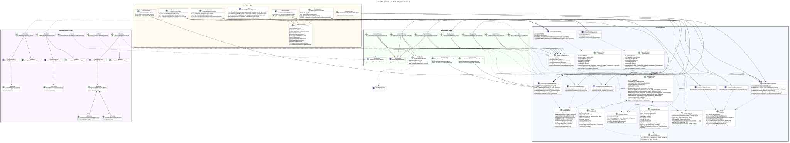
  <br/><i>Imagen 42. Domain Layer Class Diagram del Bounded Context Care Circle.</i>

</div>

<br>

##### 2.6.2.6.2. Bounded Context Database Design Diagram

El diagrama de base de datos presenta los objetos que permiten la persistencia del bounded context **Care Circle** sobre el motor MySQL. El contexto se materializa en cinco tablas: `care_circles`, `invitation_codes`, `family_links`, `care_shifts` y `shared_notes`. Las tres primeras sostienen el aggregate `CareCircle` junto con sus códigos de invitación y vínculos familiares, y las dos últimas corresponden a los aggregates independientes `CareShift` y `SharedNote`. Los identificadores se almacenan como `BINARY(16)` y las fechas en UTC con `DATETIME(6)`.

**Tabla care_circles**

| Columna | Tipo | Constraints | Descripción |
|---|---|---|---|
| id | binary(16) | PK | Identificador único del círculo de cuidado. |
| older_adult_id | binary(16) | NOT NULL, UNIQUE, FK → users.id | Adulto mayor dueño del círculo. |
| created_at | datetime(6) | NOT NULL | Fecha y hora de creación del círculo, en UTC. |

Esta tabla es el punto de entrada del contexto: representa la red de apoyo de un adulto mayor. La restricción `UNIQUE` sobre `older_adult_id` garantiza que cada adulto mayor tenga exactamente un círculo, que se crea al completarse su registro en Identity & Access.

**Tabla invitation_codes**

| Columna | Tipo | Constraints | Descripción |
|---|---|---|---|
| id | binary(16) | PK | Identificador único del código de invitación. |
| care_circle_id | binary(16) | NOT NULL, FK → care_circles.id | Círculo al que da acceso el código. |
| code | varchar(12) | NOT NULL, UNIQUE | Valor que el adulto mayor comparte con su familiar. |
| status | invitation_status | NOT NULL, DEFAULT 'PENDING' | Estado del código: pendiente, usado o expirado. |
| created_at | datetime(6) | NOT NULL | Fecha y hora de generación del código, en UTC. |
| expires_at | datetime(6) | NOT NULL | Fecha y hora en que termina la vigencia del código, en UTC. |
| used_at | datetime(6) | - | Momento en que fue canjeado. Nulo mientras no se haya usado. |
| used_by_user_id | binary(16) | FK → users.id | Familiar que canjeó el código. Nulo mientras no se haya usado. |

Esta tabla registra los códigos temporales con los que un familiar se incorpora al círculo. La restricción `UNIQUE` sobre `code` impide que dos códigos compartan el mismo valor. Incluye dos índices: `(care_circle_id, status)`, para consultar los códigos vigentes de un círculo, y `(status, expires_at)`, para que la tarea periódica encuentre los códigos pendientes cuya vigencia ya terminó.

**Tabla family_links**

| Columna | Tipo | Constraints | Descripción |
|---|---|---|---|
| id | binary(16) | PK | Identificador único del vínculo familiar. |
| care_circle_id | binary(16) | NOT NULL, FK → care_circles.id | Círculo al que pertenece el vínculo. |
| relative_id | binary(16) | NOT NULL, FK → users.id | Familiar vinculado. |
| relationship_label | varchar(60) | - | Parentesco declarado por el familiar, por ejemplo "hija". Opcional. |
| status | link_status | NOT NULL, DEFAULT 'ACTIVE' | Estado del vínculo: activo o revocado. |
| linked_at | datetime(6) | NOT NULL | Momento en que el vínculo se estableció o se reactivó por última vez, en UTC. |
| revoked_at | datetime(6) | - | Momento de la revocación. Nulo mientras el vínculo esté activo. |

Esta tabla registra la autorización de cada familiar para acompañar al adulto mayor. El índice único sobre `(care_circle_id, relative_id)` garantiza que un familiar tenga un solo vínculo con cada círculo; si el vínculo se revoca y luego se restablece, se reactiva la misma fila en lugar de crear otra.

**Tabla care_shifts**

| Columna | Tipo | Constraints | Descripción |
|---|---|---|---|
| id | binary(16) | PK | Identificador único del turno. |
| care_circle_id | binary(16) | NOT NULL, FK → care_circles.id | Círculo al que pertenece el turno. |
| relative_id | binary(16) | NOT NULL, FK → users.id | Familiar responsable del turno. |
| shift_date | date | NOT NULL | Fecha del turno, expresada en la zona horaria del adulto mayor. |
| created_at | datetime(6) | NOT NULL | Fecha y hora de creación del turno, en UTC. |
| updated_at | datetime(6) | NOT NULL | Fecha y hora de la última modificación, en UTC. |

Esta tabla registra qué familiar es responsable del seguimiento del adulto mayor en cada fecha. El índice único sobre `(care_circle_id, shift_date)` permite un solo turno por círculo y fecha, por lo que si dos familiares intentan asignarse el mismo día de forma simultánea, la base de datos rechaza al segundo.

**Tabla shared_notes**

| Columna | Tipo | Constraints | Descripción |
|---|---|---|---|
| id | binary(16) | PK | Identificador único de la nota. |
| care_circle_id | binary(16) | NOT NULL, FK → care_circles.id | Círculo al que pertenece la nota. |
| author_id | binary(16) | NOT NULL, FK → users.id | Familiar que creó la nota. |
| content | text | NOT NULL | Contenido de la nota. |
| created_at | datetime(6) | NOT NULL | Fecha y hora de creación de la nota, en UTC. |
| updated_at | datetime(6) | NOT NULL | Fecha y hora de la última edición, en UTC. |

Esta tabla almacena las notas con información relevante sobre el adulto mayor, visibles para todos los familiares del círculo. Incluye un índice sobre `(care_circle_id, created_at)` para optimizar la consulta de las notas de un círculo, de la más reciente a la más antigua.

**Relaciones entre tablas**

La tabla `care_circles` es el eje del contexto: `invitation_codes`, `family_links`, `care_shifts` y `shared_notes` la referencian mediante `care_circle_id`, de modo que todo código, vínculo, turno o nota existe dentro de un círculo concreto. Entre `care_circles` y las otras cuatro tablas la relación es de uno a muchos. Las columnas `older_adult_id`, `used_by_user_id`, `relative_id` y `author_id` referencian a `users`, que pertenece al bounded context Identity & Access y actúa como referencia externa en este contexto. La relación entre `care_circles` y `users` a través de `older_adult_id` es de uno a uno, porque cada adulto mayor tiene un único círculo. Las tablas `invitation_codes` y `family_links` forman parte del mismo aggregate `CareCircle`, mientras que `care_shifts` y `shared_notes` son independientes entre sí y solo comparten la referencia al círculo.

<br>

<div align="center">

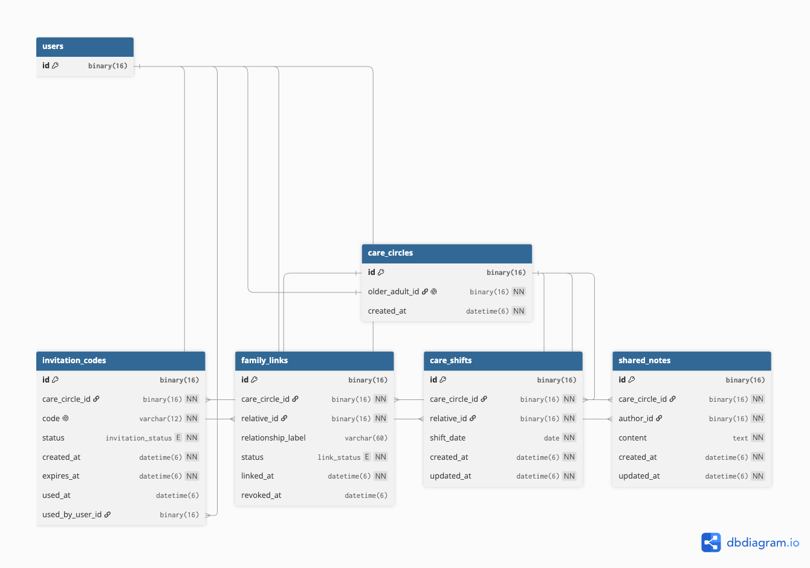
  <br/><i>Imagen 43. Database Design Diagram del Bounded Context Care Circle.</i>
</div>

### 2.6.3. Bounded Context: Daily Check-in

El bounded context Daily Check-in es el principal mecanismo de contacto diario entre Serenia y el adulto mayor. Gestiona el ciclo de vida del check-in de cada día: su apertura con una pregunta distinta a las recientes, el aviso dentro de la aplicación al llegar el horario configurado, el registro de la respuesta y el cierre del día como no respondido u omitido. También administra las preferencias que el adulto mayor controla sobre esta interacción: el horario del check-in, la pausa diaria de preguntas y el modo simplificado de la interfaz. Es un contexto core: concentra la propuesta de valor de Serenia, que reemplaza la llamada de control por una pregunta breve y respetuosa de la autonomía del usuario.

Su modelo se organiza en dos aggregates. `CheckInPreferences` reúne la configuración del adulto mayor y su pausa diaria, ya que ambas determinan cuándo y si debe presentarse la pregunta. `CheckIn` representa la interacción de un día concreto y controla sus transiciones de estado. Las preguntas forman un catálogo de solo lectura, `CheckInQuestion`, del cual se elige la pregunta de cada día.

El contexto consume de Identity & Access la zona horaria del adulto mayor, necesaria para determinar su día en curso, y de Care Circle la verificación de vínculos, necesaria para que los familiares consulten el estado diario. Publica los eventos `CheckInAnswered` y `CheckInMissed`, a partir de los cuales Wellbeing Monitoring evalúa patrones de bienestar y Alerts and Safety genera alertas de inactividad.

#### 2.6.3.1. Domain Layer

En esta capa se representan las reglas que gobiernan la interacción diaria con el adulto mayor, sin dependencia de frameworks de persistencia, red ni interfaz. Las fechas de check-in se expresan en la zona horaria del adulto mayor y los instantes, en UTC.

**Sub-capa Model: Aggregates**

`CheckInPreferences` (Aggregate Root): representa la configuración del check-in diario de un adulto mayor. Controla el horario, el plazo de respuesta, el modo simplificado y la pausa de preguntas, que el adulto mayor puede activar y desactivar durante el día.

| Atributo | Tipo | Visibilidad | Descripción |
| --- | --- | --- | --- |
| id | CheckInPreferencesId | private | Identificador único de las preferencias. |
| olderAdultId | OlderAdultId | private | Adulto mayor al que pertenecen las preferencias; cada adulto mayor tiene una única configuración. |
| reminderTime | ReminderTime | private | Hora local en la que se presenta la pregunta del día; por defecto, las 10:00. |
| timeLimit | TimeLimit | private | Plazo para responder a partir de la hora configurada; por defecto, 180 minutos. |
| simplifiedMode | boolean | private | Indica si la interfaz se muestra en modo simplificado. |
| latestPause | QuestionPause | private | Pausa más reciente del adulto mayor; es nula si nunca pausó las preguntas o si reactivó la última. |
| updatedAt | Instant | private | Instante de la última modificación, en UTC. |

| Método | Visibilidad | Descripción |
| --- | --- | --- |
| initialize(olderAdultId, updatedAt) | public (static) | Factory que crea las preferencias con la hora y el plazo predeterminados y registra el evento `CheckInPreferencesInitialized`. |
| schedule(reminderTime, updatedAt) | public | Cambia la hora del check-in; el nuevo horario se aplica a partir del siguiente check-in. Registra el evento `CheckInScheduled`. |
| activateDailyPause(today, createdAt) | public | Pausa las preguntas del día en curso; rechaza la operación si ya están pausadas. Registra el evento `DailyPauseActivated`. |
| resumeToday(today, resumedAt) | public | Reactiva las preguntas del día en curso y registra el evento `DailyCheckInResumed`. |
| resumeAfterPausedDay(today) | public | Si el día anterior terminó con las preguntas pausadas, registra el evento `DailyCheckInResumed`; en caso contrario no realiza cambios. |
| enableSimplifiedMode(updatedAt) | public | Activa el modo simplificado y registra el evento `SimplifiedModeEnabled`, siempre que no estuviera activo. |
| disableSimplifiedMode(updatedAt) | public | Desactiva el modo simplificado y registra el evento `SimplifiedModeDisabled`, siempre que estuviera activo. |
| isPausedOn(date) | public | Indica si las preguntas están pausadas en la fecha indicada. |
| windowFor(checkDate, timeZone) | public | Calcula los instantes de presentación y de vencimiento del check-in de una fecha, según la hora configurada, el plazo y la zona horaria del adulto mayor. |

`CheckIn` (Aggregate Root): representa la interacción de un día concreto con el adulto mayor. Controla las transiciones entre pendiente, respondido, no respondido y omitido.

| Atributo | Tipo | Visibilidad | Descripción |
| --- | --- | --- | --- |
| id | CheckInId | private | Identificador único del check-in. |
| olderAdultId | OlderAdultId | private | Adulto mayor al que corresponde el check-in. |
| questionId | CheckInQuestionId | private | Pregunta presentada ese día. |
| checkDate | LocalDate | private | Fecha del check-in en la zona horaria del adulto mayor; existe un único check-in por fecha. |
| window | CheckInWindow | private | Instantes de presentación y de vencimiento del check-in. |
| promptedAt | Instant | private | Instante en que se avisó al adulto mayor; es nulo mientras no se haya avisado. |
| mood | MoodLevel | private | Estado de ánimo informado; es nulo mientras no haya respuesta. |
| positiveActivity | PositiveActivity | private | Actividad positiva informada junto con la respuesta, opcional. |
| status | CheckInStatus | private | Estado del check-in. |
| answeredAt | Instant | private | Instante de la respuesta; es nulo mientras no haya respuesta. |

| Método | Visibilidad | Descripción |
| --- | --- | --- |
| open(olderAdultId, questionId, checkDate, window) | public (static) | Factory que abre el check-in pendiente de una fecha y registra el evento `CheckInOpened`. |
| prompt(promptedAt) | public | Registra el aviso del check-in; solo procede si está pendiente y aún no fue avisado. Registra el evento `CheckInPrompted`. |
| answer(mood, positiveActivity, answeredAt) | public | Registra la respuesta; solo procede si el check-in está pendiente y su plazo no venció. Puede responderse antes del horario configurado. Registra el evento `CheckInAnswered`. |
| extendDeadline(newDeadlineAt) | public | Otorga un nuevo plazo a un check-in pendiente; el nuevo vencimiento debe ser posterior al actual. |
| expire(referenceTime) | public | Marca como no respondido un check-in pendiente cuyo plazo venció y registra el evento `CheckInMissed`. |
| skip(skippedAt) | public | Marca como omitido un check-in pendiente cuyo día terminó con las preguntas pausadas y registra el evento `CheckInSkipped`. |
| isPending() | public | Indica si el check-in sigue pendiente. |

**Sub-capa Model: Entities**

`QuestionPause`: representa la decisión del adulto mayor de no recibir preguntas en una fecha. Pertenece al aggregate `CheckInPreferences`, que solo carga la pausa más reciente; las de días anteriores se conservan en la base de datos como historial.

| Atributo | Tipo | Visibilidad | Descripción |
| --- | --- | --- | --- |
| id | QuestionPauseId | private | Identificador único de la pausa. |
| pausedDate | LocalDate | private | Fecha pausada, en la zona horaria del adulto mayor. |
| createdAt | Instant | private | Instante en que se activó la pausa, en UTC. |

| Método | Visibilidad | Descripción |
| --- | --- | --- |
| appliesTo(date) | public | Indica si la pausa corresponde a la fecha indicada. |

`CheckInQuestion`: representa una pregunta del catálogo que puede presentarse en un check-in. Es una entidad de catálogo de solo lectura: se carga al iniciar la aplicación, no forma parte de ningún aggregate y se consulta mediante su propio repositorio.

| Atributo | Tipo | Visibilidad | Descripción |
| --- | --- | --- | --- |
| id | CheckInQuestionId | private | Identificador único de la pregunta. |
| text | QuestionText | private | Texto de la pregunta presentado al adulto mayor. |
| tone | String | private | Tono de la pregunta, por ejemplo cálido o reflexivo, opcional. |
| active | boolean | private | Indica si la pregunta forma parte de la rotación. |

| Método | Visibilidad | Descripción |
| --- | --- | --- |
| isActive() | public | Indica si la pregunta puede seleccionarse para un check-in. |

**Sub-capa Model: Value Objects**

Se implementan como records inmutables que validan su contenido al construirse. Los límites de longitud coinciden con las columnas de la base de datos.

| Nombre | Atributos | Descripción |
| --- | --- | --- |
| CheckInPreferencesId, CheckInId, CheckInQuestionId, QuestionPauseId | value: UUID | Identidades inmutables de los aggregates y entities del contexto. |
| OlderAdultId | value: UUID | Referencia por identidad a una cuenta de adulto mayor de Identity & Access. |
| ReminderTime | value: LocalTime | Hora del check-in, entre las 06:00 y las 20:00; con el plazo predeterminado, el último check-in posible vence a las 23:00 del mismo día. |
| TimeLimit | minutes: int | Plazo de respuesta en minutos; debe ser mayor que cero. |
| CheckInWindow | scheduledFor: Instant, deadlineAt: Instant | Ventana del check-in; el vencimiento debe ser posterior a la presentación. |
| PositiveActivity | value: String | Actividad positiva informada por el adulto mayor, de máximo 200 caracteres. |
| QuestionText | value: String | Texto de una pregunta, obligatorio y de máximo 200 caracteres. |

**Sub-capa Model: Enumerations**

| Nombre | Valores | Descripción |
| --- | --- | --- |
| CheckInStatus | PENDING, ANSWERED, MISSED, SKIPPED | Estado del check-in: pendiente, respondido, no respondido u omitido por pausa. |
| MoodLevel | VERY_LOW, LOW, NEUTRAL, GOOD, VERY_GOOD | Escala de estado de ánimo que el adulto mayor selecciona con un solo toque. |

**Sub-capa Model: Domain Services**

| Nombre | Métodos principales | Descripción |
| --- | --- | --- |
| QuestionSelectionService | select(activeQuestions, recentQuestionIds): CheckInQuestionId | Elige la pregunta del día priorizando las que nunca se usaron y, entre las usadas, la que se presentó hace más tiempo. Así ninguna pregunta se repite antes de recorrer el conjunto activo y la pregunta siempre difiere de la del día anterior. |

**Sub-capa Model: Commands**

| Nombre | Atributos | Descripción |
| --- | --- | --- |
| InitializeCheckInPreferencesCommand | olderAdultId | Intención de crear las preferencias de un adulto mayor recién registrado. |
| ScheduleCheckInCommand | olderAdultId, reminderTime | Intención de cambiar la hora del check-in. |
| ActivateDailyPauseCommand | olderAdultId | Intención de pausar las preguntas del día en curso. |
| ResumeDailyCheckInCommand | olderAdultId | Intención de reactivar las preguntas, por decisión del adulto mayor o por el inicio de un nuevo día tras un día pausado. |
| EnableSimplifiedModeCommand | olderAdultId | Intención de activar el modo simplificado. |
| DisableSimplifiedModeCommand | olderAdultId | Intención de desactivar el modo simplificado. |
| OpenCheckInCommand | olderAdultId | Intención de abrir el check-in del día en curso de un adulto mayor; si ya existe, no realiza cambios. |
| PromptCheckInCommand | checkInId | Intención de avisar al adulto mayor que su check-in sigue pendiente. |
| AnswerCheckInCommand | checkInId, olderAdultId, mood, positiveActivity | Intención del adulto mayor de responder su check-in. |
| ExpireCheckInCommand | checkInId | Intención de cerrar un check-in pendiente cuyo plazo venció. |

**Sub-capa Model: Queries**

| Nombre | Atributos | Descripción |
| --- | --- | --- |
| GetCheckInPreferencesByOlderAdultIdQuery | olderAdultId, requesterId | Consulta de las preferencias de un adulto mayor. |
| GetAllCheckInPreferencesQuery | — | Consulta de las preferencias de todos los adultos mayores; la usa la apertura diaria. |
| GetTodayCheckInQuery | olderAdultId, requesterId | Consulta del check-in del día en curso y de si las preguntas están pausadas; la usan el adulto mayor para responder y el familiar para conocer su estado. |
| GetCheckInHistoryQuery | olderAdultId, requesterId, fromDate, toDate | Consulta de los check-ins de un rango de fechas, ordenados por fecha. |
| GetCheckInsDueForPromptQuery | referenceTime | Consulta de los check-ins pendientes, aún no avisados, cuyo horario ya llegó. |
| GetCheckInsPastDeadlineQuery | referenceTime | Consulta de los check-ins pendientes cuyo plazo venció. |
| GetCheckInQuestionByIdQuery | questionId | Consulta del texto de una pregunta del catálogo. |

**Sub-capa Model: Events**

| Nombre | Atributos | Descripción |
| --- | --- | --- |
| CheckInPreferencesInitialized | olderAdultId, occurredAt | Se crearon las preferencias de un adulto mayor. |
| CheckInScheduled | olderAdultId, reminderTime, occurredAt | Se cambió la hora del check-in. |
| DailyPauseActivated | olderAdultId, pausedDate, occurredAt | El adulto mayor pausó las preguntas del día. |
| DailyCheckInResumed | olderAdultId, resumedDate, occurredAt | Las preguntas se reactivaron, por decisión del adulto mayor o por el inicio de un nuevo día. |
| SimplifiedModeEnabled | olderAdultId, occurredAt | Se activó el modo simplificado. |
| SimplifiedModeDisabled | olderAdultId, occurredAt | Se desactivó el modo simplificado. |
| CheckInOpened | checkInId, olderAdultId, checkDate, occurredAt | Se abrió el check-in de un día. |
| CheckInPrompted | checkInId, olderAdultId, occurredAt | Se avisó al adulto mayor que su check-in está disponible. |
| CheckInAnswered | checkInId, olderAdultId, checkDate, mood, positiveActivity, occurredAt | El adulto mayor respondió su check-in. Lo consume Wellbeing Monitoring. |
| CheckInMissed | checkInId, olderAdultId, checkDate, occurredAt | El plazo venció sin respuesta. Lo consume Alerts and Safety. |
| CheckInSkipped | checkInId, olderAdultId, checkDate, occurredAt | El día terminó con las preguntas pausadas, por lo que no se genera una alerta de inactividad. |

**Sub-capa Repositories**

| Tipo | Nombre | Métodos principales | Descripción |
| --- | --- | --- | --- |
| Interface | CheckInPreferencesRepository | save(preferences), findByOlderAdultId(olderAdultId), findAll() | Contrato de persistencia del aggregate `CheckInPreferences` junto con su pausa más reciente. Se implementa en Infrastructure. |
| Interface | CheckInRepository | save(checkIn), findById(checkInId), findByOlderAdultIdAndCheckDate(olderAdultId, checkDate), existsByOlderAdultIdAndCheckDate(olderAdultId, checkDate), findAllByOlderAdultIdAndCheckDateBetween(olderAdultId, fromDate, toDate), findAllPendingDueForPrompt(referenceTime), findAllPendingPastDeadline(referenceTime), findRecentQuestionIds(olderAdultId, limit) | Contrato de persistencia del aggregate `CheckIn`. Se implementa en Infrastructure. |
| Interface | CheckInQuestionRepository | findById(questionId), findAllActive(), saveAll(questions), count() | Contrato de consulta del catálogo de preguntas; `saveAll` solo se usa en la carga inicial. Se implementa en Infrastructure. |

**Sub-capa Services**

| Tipo | Nombre | Métodos principales | Descripción |
| --- | --- | --- | --- |
| Interface | CheckInPreferencesCommandService | handle(InitializeCheckInPreferencesCommand), handle(ScheduleCheckInCommand), handle(ActivateDailyPauseCommand), handle(ResumeDailyCheckInCommand), handle(EnableSimplifiedModeCommand), handle(DisableSimplifiedModeCommand) | Contrato de las operaciones de escritura sobre las preferencias. |
| Interface | CheckInPreferencesQueryService | handle(GetCheckInPreferencesByOlderAdultIdQuery), handle(GetAllCheckInPreferencesQuery) | Contrato de la lectura de preferencias. |
| Interface | CheckInCommandService | handle(OpenCheckInCommand), handle(PromptCheckInCommand), handle(AnswerCheckInCommand), handle(ExpireCheckInCommand) | Contrato de las operaciones de escritura sobre los check-ins. |
| Interface | CheckInQueryService | handle(GetTodayCheckInQuery), handle(GetCheckInHistoryQuery), handle(GetCheckInsDueForPromptQuery), handle(GetCheckInsPastDeadlineQuery) | Contrato de la lectura de check-ins. |
| Interface | CheckInQuestionQueryService | handle(GetCheckInQuestionByIdQuery) | Contrato de la lectura del catálogo de preguntas. |

#### 2.6.3.2. Interface Layer

Clases que exponen el bounded context hacia el exterior y traducen las peticiones entrantes al lenguaje del dominio.

**Sub-capa REST: Controllers**

| Nombre | Endpoints | Descripción |
| --- | --- | --- |
| CheckInsController | GET /api/v1/check-ins/today?olderAdultId={olderAdultId}, GET /api/v1/check-ins?olderAdultId={olderAdultId}&from={fromDate}&to={toDate}, POST /api/v1/check-ins/{checkInId}/answer | Punto de entrada de la consulta del check-in del día, del historial y del registro de la respuesta. La respuesta responde 409 Conflict si el check-in ya no está pendiente o su plazo venció. |
| CheckInPreferencesController | GET /api/v1/check-in-preferences?olderAdultId={olderAdultId}, PUT /api/v1/check-in-preferences/{preferencesId}/reminder-time, POST /api/v1/check-in-preferences/{preferencesId}/daily-pause, DELETE /api/v1/check-in-preferences/{preferencesId}/daily-pause, PUT /api/v1/check-in-preferences/{preferencesId}/simplified-mode | Punto de entrada de la consulta y modificación de las preferencias. El cambio de hora responde 400 Bad Request con el rango válido si la hora está fuera de él. La pausa se activa con POST y se desactiva con DELETE; ambas responden 409 Conflict si las preguntas ya estaban en el estado solicitado. |

Las consultas de check-ins solo proceden para el propio adulto mayor o para un familiar con vínculo activo; las preferencias y la respuesta, solo para el propio adulto mayor. En otro caso se responde 403 Forbidden.

**Sub-capa REST: Resources**

| Nombre | Atributos | Descripción |
| --- | --- | --- |
| CheckInResource | id, olderAdultId, checkDate, questionText, scheduledFor, deadlineAt, status, paused, mood, positiveActivity, answeredAt | Representación de un check-in junto con el texto de su pregunta y la indicación de si las preguntas están pausadas, con la que el familiar sabe que el adulto mayor optó por no participar. |
| AnswerCheckInResource | mood, positiveActivity | Datos de entrada de la respuesta del adulto mayor. |
| CheckInPreferencesResource | id, olderAdultId, reminderTime, timeLimitMinutes, simplifiedMode, pausedToday | Representación de las preferencias del check-in. |
| ScheduleCheckInResource | reminderTime | Datos de entrada para cambiar la hora del check-in. |
| UpdateSimplifiedModeResource | enabled | Datos de entrada para activar o desactivar el modo simplificado. |

**Sub-capa REST: Transform**

| Nombre | Descripción |
| --- | --- |
| CheckInResourceFromEntityAssembler | Combina el aggregate `CheckIn` con el texto de su pregunta y el estado de la pausa en su representación REST. |
| CheckInPreferencesResourceFromEntityAssembler | Convierte el aggregate `CheckInPreferences` en su representación REST. |
| AnswerCheckInCommandFromResourceAssembler | Combina la respuesta con el check-in y el adulto mayor autenticado para construir el comando. |
| ScheduleCheckInCommandFromResourceAssembler | Convierte la petición de cambio de hora en su comando. |
| SimplifiedModeCommandFromResourceAssembler | Convierte la petición en el comando de activación o de desactivación, según el valor recibido. |

**Sub-capa Scheduling: Jobs**

| Nombre | Descripción |
| --- | --- |
| CheckInLifecycleScheduler | Tareas periódicas del ciclo del check-in. Cada hora consulta las preferencias con `GetAllCheckInPreferencesQuery` y envía un `OpenCheckInCommand` por adulto mayor, frecuencia suficiente porque el horario más temprano permitido es a las 06:00. Cada minuto consulta los check-ins por avisar y los vencidos, y envía un `PromptCheckInCommand` o un `ExpireCheckInCommand` por cada uno. |

**Sub-capa ACL**

| Tipo | Nombre | Métodos principales | Descripción |
| --- | --- | --- | --- |
| Interface | DailyCheckInContextFacade | fetchMoodsByDateRange(olderAdultId, fromDate, toDate): Map\<LocalDate, String\> | Contrato que el contexto ofrece a los demás. Wellbeing Monitoring lo usa para obtener los estados de ánimo de varios días consecutivos al evaluar patrones. Devuelve tipos estándar de Java para no exponer clases del dominio. |

#### 2.6.3.3. Application Layer

Clases que orquestan los flujos del contexto, coordinando los aggregates, los repositorios, el servicio de selección de preguntas y los servicios de otros contextos.

**Sub-capa Internal: CommandServices (Command Handlers)**

| Nombre | Responsabilidad principal | Relación con otros elementos |
| --- | --- | --- |
| CheckInPreferencesCommandServiceImpl | Crea las preferencias sin duplicarlas si el adulto mayor ya tiene una configuración, cambia la hora y gestiona el modo simplificado. Activa la pausa del día en curso, calculado en la zona horaria del adulto mayor. Al reactivar las preguntas: si el día en curso está pausado, levanta la pausa y, si el plazo del check-in ya venció, le otorga un nuevo plazo de la misma duración desde la reactivación, sin superar el fin del día local; si no está pausado pero el día anterior terminó pausado, registra la reanudación por el inicio del nuevo día; en otro caso rechaza la operación. Es la única operación que modifica ambos aggregates en una misma transacción, porque la decisión del adulto mayor debe surtir efecto de inmediato. Tras persistir, publica los eventos acumulados. | Implementa `CheckInPreferencesCommandService`; usa `CheckInPreferencesRepository`, `CheckInRepository`, `ExternalIamService` y `DomainEventPublisher`. |
| CheckInCommandServiceImpl | Abre el check-in del día en curso del adulto mayor si aún no existe: elige la pregunta con `QuestionSelectionService`, calcula la ventana con sus preferencias y, si el día anterior terminó pausado, envía `ResumeDailyCheckInCommand`. Avisa un check-in pendiente solo si sus preguntas no están pausadas; si se reactivan después del horario, el aviso se envía en la siguiente ejecución. Registra respuestas verificando que provengan del propio adulto mayor. Al vencer el plazo, marca el check-in como no respondido; si las preguntas están pausadas, lo deja pendiente y lo marca como omitido recién cuando termina el día local. | Implementa `CheckInCommandService`; usa `CheckInRepository`, `CheckInPreferencesRepository`, `CheckInQuestionRepository`, `QuestionSelectionService`, `ExternalIamService` y `DomainEventPublisher`. |

**Sub-capa Internal: QueryServices**

| Nombre | Responsabilidad principal | Relación con otros elementos |
| --- | --- | --- |
| CheckInPreferencesQueryServiceImpl | Resuelve la consulta de preferencias del propio adulto mayor y la de todas las preferencias para la apertura diaria. | Implementa `CheckInPreferencesQueryService`; usa `CheckInPreferencesRepository`. |
| CheckInQueryServiceImpl | Resuelve el check-in del día, calculado en la zona horaria del adulto mayor, junto con el estado de la pausa, y el historial, previa verificación de que el solicitante sea el adulto mayor o un familiar con vínculo activo. También resuelve los check-ins por avisar y los vencidos para las tareas periódicas. | Implementa `CheckInQueryService`; usa `CheckInRepository`, `CheckInPreferencesRepository`, `ExternalIamService` y `ExternalCareCircleService`. |
| CheckInQuestionQueryServiceImpl | Resuelve la consulta de una pregunta del catálogo. | Implementa `CheckInQuestionQueryService`; usa `CheckInQuestionRepository`. |

**Sub-capa Internal: Event Handlers**

| Nombre | Responsabilidad principal | Relación con otros elementos |
| --- | --- | --- |
| OlderAdultRegisteredEventHandler | Crea las preferencias del check-in de un adulto mayor recién registrado. Se ejecuta de forma síncrona dentro de la transacción del registro. | Escucha `OlderAdultRegistered` de Identity & Access; envía `InitializeCheckInPreferencesCommand`. |
| ApplicationReadyEventHandler | Carga el catálogo inicial de preguntas al iniciar la aplicación, solo si el catálogo está vacío. | Escucha el evento de arranque de Spring; usa `CheckInQuestionRepository`. |

**Sub-capa Internal: Outbound Services**

| Tipo | Nombre | Métodos principales | Descripción |
| --- | --- | --- | --- |
| Class | ExternalIamService | fetchTimeZone(olderAdultId) | Consume `IamContextFacade` y devuelve la zona horaria del adulto mayor como `ZoneId`. |
| Class | ExternalCareCircleService | isActiveRelativeOf(relativeId, olderAdultId) | Consume `CareCircleContextFacade` para verificar que un familiar esté vinculado al adulto mayor. |

**Sub-capa ACL**

| Nombre | Responsabilidad principal | Relación con otros elementos |
| --- | --- | --- |
| DailyCheckInContextFacadeImpl | Resuelve los estados de ánimo de un rango de fechas a partir de los check-ins respondidos. | Implementa `DailyCheckInContextFacade`; usa `CheckInRepository`. |

#### 2.6.3.4. Infrastructure Layer

Clases que resuelven el acceso a la base de datos MySQL, implementando las abstracciones definidas en la capa Domain.

**Sub-capa Persistence: JPA Entities**

| Nombre | Responsabilidad principal | Relación con otros elementos |
| --- | --- | --- |
| CheckInPreferencesPersistenceEntity | Representa una fila de la tabla `check_in_preferences`. | Usada por `CheckInPreferencesJpaRepository` y `CheckInPreferencesPersistenceMapper`. |
| QuestionPausePersistenceEntity | Representa una fila de la tabla `question_pauses`. | Usada por `QuestionPauseJpaRepository` y `CheckInPreferencesPersistenceMapper`. |
| CheckInPersistenceEntity | Representa una fila de la tabla `check_ins`. | Usada por `CheckInJpaRepository` y `CheckInPersistenceMapper`. |
| CheckInQuestionPersistenceEntity | Representa una fila de la tabla `check_in_questions`. | Usada por `CheckInQuestionJpaRepository` y `CheckInQuestionPersistenceMapper`. |

**Sub-capa Persistence: JPA Repositories**

| Nombre | Responsabilidad principal | Relación con otros elementos |
| --- | --- | --- |
| CheckInPreferencesJpaRepository | Interfaz de Spring Data JPA con la consulta por adulto mayor, resuelta sobre el índice único de `older_adult_id`. | Extiende `JpaRepository`; usada por `CheckInPreferencesRepositoryImpl`. |
| QuestionPauseJpaRepository | Interfaz de Spring Data JPA con la consulta de la pausa más reciente de un adulto mayor, resuelta sobre el índice único `(older_adult_id, paused_date)`. | Extiende `JpaRepository`; usada por `CheckInPreferencesRepositoryImpl`. |
| CheckInJpaRepository | Interfaz de Spring Data JPA. Las consultas por adulto mayor y fecha o rango de fechas usan el índice único `(older_adult_id, check_date)`. Las de check-ins por avisar o vencidos usan el índice `(status, deadline_at)`; como cada adulto mayor tiene a lo sumo un check-in pendiente, el conjunto que recorren es pequeño. | Extiende `JpaRepository`; usada por `CheckInRepositoryImpl`. |
| CheckInQuestionJpaRepository | Interfaz de Spring Data JPA con la consulta de preguntas activas. | Extiende `JpaRepository`; usada por `CheckInQuestionRepositoryImpl`. |

**Sub-capa Persistence: Repositories**

| Nombre | Responsabilidad principal | Relación con otros elementos |
| --- | --- | --- |
| CheckInPreferencesRepositoryImpl | Persiste y recupera el aggregate `CheckInPreferences`, componiéndolo con su pausa más reciente. Inserta una fila en `question_pauses` al activarse la pausa y la elimina cuando el adulto mayor reactiva las preguntas el mismo día. | Implementa `CheckInPreferencesRepository`; usa `CheckInPreferencesJpaRepository`, `QuestionPauseJpaRepository` y `CheckInPreferencesPersistenceMapper`. |
| CheckInRepositoryImpl | Persiste y recupera el aggregate `CheckIn`. Si dos ejecuciones intentan abrir el mismo día, traduce la violación del índice único en una excepción de dominio, de modo que la apertura sea idempotente. | Implementa `CheckInRepository`; usa `CheckInJpaRepository` y `CheckInPersistenceMapper`. |
| CheckInQuestionRepositoryImpl | Recupera el catálogo de preguntas y lo persiste durante la carga inicial. | Implementa `CheckInQuestionRepository`; usa `CheckInQuestionJpaRepository` y `CheckInQuestionPersistenceMapper`. |

**Sub-capa Persistence: Mappers**

| Nombre | Responsabilidad principal | Relación con otros elementos |
| --- | --- | --- |
| CheckInPreferencesPersistenceMapper | Traduce entre el aggregate `CheckInPreferences`, con su pausa más reciente, y sus entidades de persistencia. | Usado por `CheckInPreferencesRepositoryImpl`. |
| CheckInPersistenceMapper | Traduce entre el aggregate `CheckIn` y `CheckInPersistenceEntity`. | Usado por `CheckInRepositoryImpl`. |
| CheckInQuestionPersistenceMapper | Traduce entre la entidad `CheckInQuestion` y `CheckInQuestionPersistenceEntity`. | Usado por `CheckInQuestionRepositoryImpl`. |

#### 2.6.3.5. Bounded Context Software Architecture Component Level Diagrams

Este diagrama C4 (Imagen 44) muestra al Adulto Mayor interactuando con los *Controllers* (`CheckInsController`, `PreferencesController`), quienes delegan en los *Services* y *Repositories* definidos por la arquitectura limpia. Se destacan las conexiones con la Base de Datos.

<div align="center">

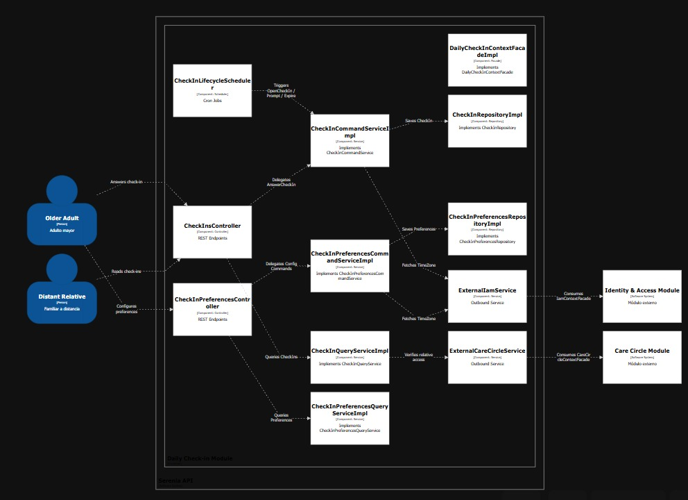
  <br/><i>Imagen 44. Component Diagram del Bounded Context Daily Check-in.</i>

</div>

<br>

#### 2.6.3.6. Bounded Context Software Architecture Code Level Diagrams

##### 2.6.3.6.1. Bounded Context Domain Layer Class Diagrams

El diagrama UML (Imagen 45) consolida los requisitos tácticos obtenidos del EventStorming. Presenta a `CheckIn` y `CheckInPreferences` como los dos Aggregate Roots, acompañados de sus respectivas interfaces de persistencia y comandos de usuario/sistema.

<div align="center">

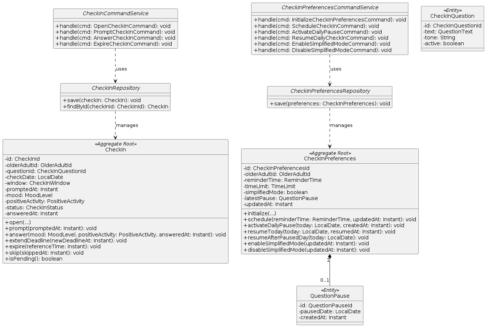
  <br/><i>Imagen 45. Domain Layer Class Diagram del Bounded Context Daily Check-in.</i>

</div>

<br>

##### 2.6.3.6.2. Bounded Context Database Design Diagram

El diseño de base de datos transaccional para Daily Check-in (Imagen 46) incluye las siguientes tablas referenciando al contexto de Identidad:
- **check_in_questions:** Catálogo base de preguntas rotativas.
- **check_in_schedules:** Horario de recordatorio y flag de modo simplificado por usuario.
- **check_ins:** Tabla que materializa el agregado `CheckIn`, registrando la pregunta, el estado (`PENDING`, `ANSWERED`, `MISSED`) y el nivel de ánimo.
- **question_pauses:** Historial de días en los que el usuario eligió voluntariamente no interactuar.

<div align="center">

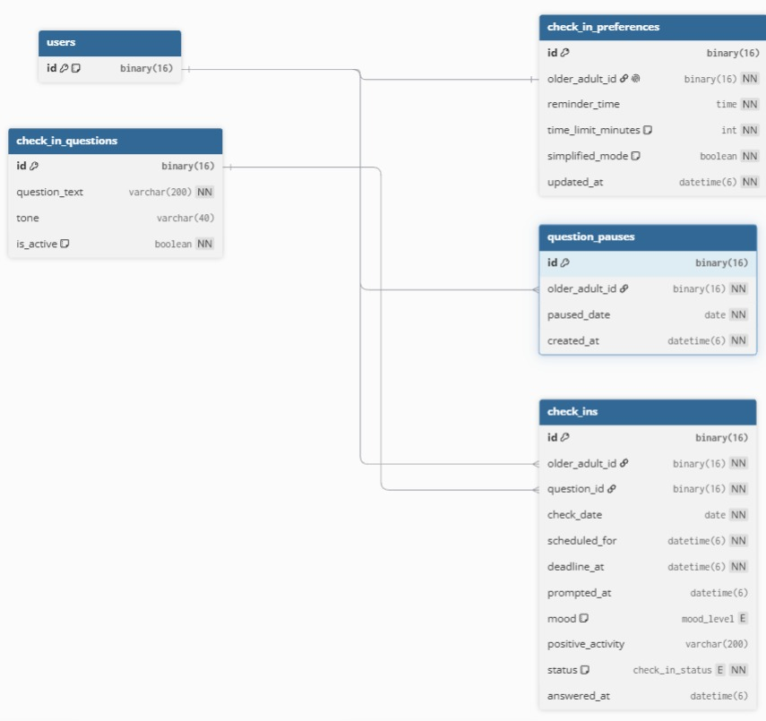
  <br/><i>Imagen 46. Database Design Diagram del Bounded Context Daily Check-in.</i>

</div>

### 2.6.4. Bounded Context: Wellbeing Monitoring

El bounded context Wellbeing Monitoring interpreta las respuestas del check-in diario para que el familiar a distancia sepa cuándo conviene actuar y qué vale la pena celebrar. Evalúa cada check-in respondido junto con los días anteriores para detectar un malestar sostenido, emite una sugerencia de acción cuando lo detecta y registra pequeñas victorias cuando el adulto mayor tiene un buen día o comparte una actividad positiva. También permite a los familiares descartar las sugerencias que ya atendieron. Es un contexto de soporte: no recolecta datos propios, sino que transforma los datos de Daily Check-in en información útil para el familiar.

Su modelo se organiza en un único aggregate, `WellbeingInsight`, que reúne la interpretación del bienestar de un adulto mayor: los patrones de malestar, las sugerencias y las pequeñas victorias. Su identidad es la del adulto mayor y no requiere una tabla propia. Como el historial crece con cada día evaluado, el aggregate carga solo los elementos que intervienen en sus reglas: el patrón de malestar más reciente, para decidir si una racha continúa o comienza, y las sugerencias activas, para que un patrón no genere más de una sugerencia.

El contexto reacciona al evento `CheckInAnswered` de Daily Check-in, del cual obtiene el estado de ánimo y la actividad del día, y consulta a ese mismo contexto los estados de ánimo de los días anteriores. Consulta a Care Circle la verificación de vínculos, para que solo los familiares vinculados vean y descarten sugerencias, y a Identity & Access la zona horaria del adulto mayor, para resolver los periodos consultados.

#### 2.6.4.1. Domain Layer

En esta capa se representan las reglas que convierten las respuestas diarias en señales de bienestar, sin dependencia de frameworks de persistencia, red ni interfaz.

**Sub-capa Model: Aggregates**

`WellbeingInsight` (Aggregate Root): representa la interpretación del bienestar de un adulto mayor. Controla la detección de patrones de malestar, la emisión y el descarte de sugerencias y el registro de pequeñas victorias.

| Atributo | Tipo | Visibilidad | Descripción |
| --- | --- | --- | --- |
| olderAdultId | OlderAdultId | private | Adulto mayor al que corresponde la interpretación; es la identidad del aggregate. |
| latestDiscomfortPattern | WellbeingPattern | private | Patrón de malestar más reciente; es nulo si nunca se detectó uno. |
| activeSuggestions | List\<WellbeingSuggestion\> | private | Sugerencias vigentes, aún no descartadas. |
| newSmallWins | List\<SmallWin\> | private | Pequeñas victorias registradas en la operación en curso; las anteriores no se cargan porque ninguna regla depende de ellas. |

| Método | Visibilidad | Descripción |
| --- | --- | --- |
| evaluate(checkInId, checkDate, mood, positiveActivity, recentMoods, evaluatedAt) | public | Evalúa el día respondido junto con los anteriores. Si se completan tres días consecutivos de malestar, detecta un patrón y registra el evento `DiscomfortPatternDetected`; si la racha ya tenía un patrón, lo extiende sin detectar uno nuevo. Si el día muestra bienestar positivo, registra el evento `WellbeingTrendImproved`. |
| issueSuggestion(patternId, message, issuedAt) | public | Emite una sugerencia de acción para un patrón; rechaza una segunda sugerencia para el mismo patrón. Registra el evento `WellbeingSuggestionIssued`. |
| recordSmallWin(checkInId, description, recordedAt) | public | Registra una pequeña victoria asociada a un check-in y el evento `SmallWinRecorded`. |
| dismissSuggestion(suggestionId, relativeId, dismissedAt) | public | Descarta una sugerencia activa para todos los familiares y registra el evento `WellbeingSuggestionDismissed`. |
| discomfortStreakEndingOn(date, recentMoods) | private | Cuenta los días consecutivos con ánimo bajo o muy bajo que terminan en la fecha indicada; un día sin respuesta interrumpe la racha. |
| isPositiveDay(mood, positiveActivity) | private | Indica si el día muestra bienestar positivo: ánimo bueno o muy bueno, o una actividad positiva informada. |

**Sub-capa Model: Entities**

`WellbeingPattern`: representa un periodo sostenido de malestar del adulto mayor. Pertenece al aggregate `WellbeingInsight`.

| Atributo | Tipo | Visibilidad | Descripción |
| --- | --- | --- | --- |
| id | WellbeingPatternId | private | Identificador único del patrón. |
| type | PatternType | private | Tipo de patrón detectado. |
| consecutiveDays | int | private | Cantidad de días consecutivos que sostienen el patrón. |
| startDate | LocalDate | private | Primer día del patrón, en la zona horaria del adulto mayor. |
| endDate | LocalDate | private | Último día del patrón, en la zona horaria del adulto mayor. |
| detectedAt | Instant | private | Instante en que se detectó el patrón, en UTC. |

| Método | Visibilidad | Descripción |
| --- | --- | --- |
| extendTo(endDate) | public | Prolonga el patrón cuando la racha continúa al día siguiente y actualiza la cantidad de días. |
| continuesOn(date) | public | Indica si la fecha indicada es el día siguiente al último día del patrón. |

`WellbeingSuggestion`: representa una recomendación dirigida a los familiares, como llamar o visitar al adulto mayor, emitida a partir de un patrón de malestar. Pertenece al aggregate `WellbeingInsight`.

| Atributo | Tipo | Visibilidad | Descripción |
| --- | --- | --- | --- |
| id | WellbeingSuggestionId | private | Identificador único de la sugerencia. |
| patternId | WellbeingPatternId | private | Patrón que originó la sugerencia. |
| message | SuggestionMessage | private | Texto de la recomendación. |
| status | SuggestionStatus | private | Estado de la sugerencia: activa o descartada. |
| issuedAt | Instant | private | Instante de emisión, en UTC. |
| dismissedBy | RelativeId | private | Familiar que descartó la sugerencia; es nulo mientras esté activa. |
| dismissedAt | Instant | private | Instante del descarte; es nulo mientras esté activa. |

| Método | Visibilidad | Descripción |
| --- | --- | --- |
| dismiss(relativeId, dismissedAt) | public | Marca la sugerencia como descartada. |
| isActive() | public | Indica si la sugerencia sigue vigente. |

`SmallWin`: representa un buen día o una actividad positiva del adulto mayor, que se muestra a los familiares para reforzar lo positivo. Pertenece al aggregate `WellbeingInsight`.

| Atributo | Tipo | Visibilidad | Descripción |
| --- | --- | --- | --- |
| id | SmallWinId | private | Identificador único de la pequeña victoria. |
| checkInId | CheckInId | private | Check-in del cual proviene; cada check-in genera a lo sumo una pequeña victoria. |
| description | SmallWinDescription | private | Actividad positiva informada o, si no la hubo, una descripción del buen día. |
| recordedAt | Instant | private | Instante del registro, en UTC. |

**Sub-capa Model: Value Objects**

Se implementan como records inmutables que validan su contenido al construirse. Los límites de longitud coinciden con las columnas de la base de datos.

| Nombre | Atributos | Descripción |
| --- | --- | --- |
| WellbeingPatternId, WellbeingSuggestionId, SmallWinId | value: UUID | Identidades inmutables de las entities del contexto. |
| OlderAdultId | value: UUID | Referencia por identidad a una cuenta de adulto mayor de Identity & Access. |
| RelativeId | value: UUID | Referencia por identidad a una cuenta de familiar a distancia de Identity & Access. |
| CheckInId | value: UUID | Referencia por identidad a un check-in de Daily Check-in. |
| SuggestionMessage | value: String | Texto de la sugerencia, obligatorio y de máximo 300 caracteres. |
| SmallWinDescription | value: String | Descripción de la pequeña victoria, obligatoria y de máximo 200 caracteres. |

**Sub-capa Model: Enumerations**

| Nombre | Valores | Descripción |
| --- | --- | --- |
| MoodLevel | VERY_LOW, LOW, NEUTRAL, GOOD, VERY_GOOD | Estado de ánimo informado en un check-in, traducido desde los valores que publica Daily Check-in. |
| PatternType | SUSTAINED_DISCOMFORT | Tipo de patrón detectado en el historial del adulto mayor. |
| SuggestionStatus | ACTIVE, DISMISSED | Estado de una sugerencia. |

**Sub-capa Model: Commands**

| Nombre | Atributos | Descripción |
| --- | --- | --- |
| EvaluateWellbeingPatternCommand | olderAdultId, checkInId, checkDate, mood, positiveActivity | Intención de evaluar el bienestar a partir de un check-in respondido. |
| IssueWellbeingSuggestionCommand | olderAdultId, patternId | Intención de emitir una sugerencia de acción a partir de un patrón de malestar. |
| RecordSmallWinCommand | olderAdultId, checkInId, positiveActivity | Intención de registrar una pequeña victoria a partir de un día positivo. |
| DismissWellbeingSuggestionCommand | olderAdultId, suggestionId, relativeId | Intención de un familiar de descartar una sugerencia. |

**Sub-capa Model: Queries**

| Nombre | Atributos | Descripción |
| --- | --- | --- |
| GetActiveWellbeingSuggestionsQuery | olderAdultId, requesterId | Consulta de las sugerencias vigentes de un adulto mayor. |
| GetSmallWinsByPeriodQuery | olderAdultId, requesterId, fromDate, toDate | Consulta de las pequeñas victorias de un periodo, ordenadas por fecha. |

**Sub-capa Model: Events**

| Nombre | Atributos | Descripción |
| --- | --- | --- |
| DiscomfortPatternDetected | olderAdultId, patternId, consecutiveDays, startDate, endDate, occurredAt | Se detectó un malestar sostenido durante varios días consecutivos. |
| WellbeingTrendImproved | olderAdultId, checkInId, checkDate, positiveActivity, occurredAt | El día evaluado mostró bienestar positivo. |
| WellbeingSuggestionIssued | olderAdultId, suggestionId, patternId, occurredAt | Se emitió una sugerencia de acción para los familiares. |
| SmallWinRecorded | olderAdultId, smallWinId, checkInId, occurredAt | Se registró una pequeña victoria. |
| WellbeingSuggestionDismissed | olderAdultId, suggestionId, relativeId, occurredAt | Un familiar descartó una sugerencia. |

**Sub-capa Repositories**

| Tipo | Nombre | Métodos principales | Descripción |
| --- | --- | --- | --- |
| Interface | WellbeingInsightRepository | findByOlderAdultId(olderAdultId), save(insight), findActiveSuggestionsByOlderAdultId(olderAdultId), findSmallWinsByOlderAdultIdBetween(olderAdultId, from, to) | Contrato de persistencia del aggregate `WellbeingInsight` y de las consultas de sugerencias y pequeñas victorias. Se implementa en Infrastructure. |

**Sub-capa Services**

| Tipo | Nombre | Métodos principales | Descripción |
| --- | --- | --- | --- |
| Interface | WellbeingInsightCommandService | handle(EvaluateWellbeingPatternCommand), handle(IssueWellbeingSuggestionCommand), handle(RecordSmallWinCommand), handle(DismissWellbeingSuggestionCommand) | Contrato de las operaciones de escritura del contexto. |
| Interface | WellbeingInsightQueryService | handle(GetActiveWellbeingSuggestionsQuery), handle(GetSmallWinsByPeriodQuery) | Contrato de las operaciones de lectura del contexto. |

#### 2.6.4.2. Interface Layer

Clases que exponen el bounded context hacia el exterior y traducen las peticiones entrantes al lenguaje del dominio.

**Sub-capa REST: Controllers**

| Nombre | Endpoints | Descripción |
| --- | --- | --- |
| WellbeingSuggestionsController | GET /api/v1/wellbeing-suggestions?olderAdultId={olderAdultId}, POST /api/v1/wellbeing-suggestions/{suggestionId}/dismiss | Punto de entrada de la consulta de sugerencias vigentes y de su descarte. El descarte responde 409 Conflict si la sugerencia ya no está activa. Ambas operaciones están reservadas a familiares con vínculo activo. |
| SmallWinsController | GET /api/v1/small-wins?olderAdultId={olderAdultId}&from={fromDate}&to={toDate} | Punto de entrada de la consulta de pequeñas victorias de un periodo, disponible para el adulto mayor y para sus familiares vinculados. |

Las operaciones responden 403 Forbidden cuando el usuario autenticado no tiene el acceso indicado.

**Sub-capa REST: Resources**

| Nombre | Atributos | Descripción |
| --- | --- | --- |
| WellbeingSuggestionResource | id, olderAdultId, patternId, message, status, issuedAt | Representación de una sugerencia de acción. |
| SmallWinResource | id, olderAdultId, checkInId, description, recordedAt | Representación de una pequeña victoria. |

**Sub-capa REST: Transform**

| Nombre | Descripción |
| --- | --- |
| WellbeingSuggestionResourceFromEntityAssembler | Convierte la entidad `WellbeingSuggestion` en su representación REST. |
| SmallWinResourceFromEntityAssembler | Convierte la entidad `SmallWin` en su representación REST. |

#### 2.6.4.3. Application Layer

Clases que orquestan los flujos del contexto, coordinando el aggregate, su repositorio y los servicios de otros contextos.

**Sub-capa Internal: CommandServices (Command Handlers)**

| Nombre | Responsabilidad principal | Relación con otros elementos |
| --- | --- | --- |
| WellbeingInsightCommandServiceImpl | Para evaluar un check-in, obtiene los estados de ánimo de los siete días previos e invoca al aggregate. Para emitir una sugerencia, redacta el mensaje con la cantidad de días del patrón. Para registrar una pequeña victoria, usa la actividad positiva informada o, si no la hubo, una descripción del buen día. Para descartar una sugerencia, verifica que el familiar tenga un vínculo activo con el adulto mayor. Tras persistir, publica los eventos acumulados. | Implementa `WellbeingInsightCommandService`; usa `WellbeingInsightRepository`, `ExternalDailyCheckInService`, `ExternalCareCircleService` y `DomainEventPublisher`. |

**Sub-capa Internal: QueryServices**

| Nombre | Responsabilidad principal | Relación con otros elementos |
| --- | --- | --- |
| WellbeingInsightQueryServiceImpl | Resuelve las sugerencias vigentes y las pequeñas victorias de un periodo, convirtiendo las fechas a instantes según la zona horaria del adulto mayor, previa verificación de acceso del solicitante. | Implementa `WellbeingInsightQueryService`; usa `WellbeingInsightRepository`, `ExternalIamService` y `ExternalCareCircleService`. |

**Sub-capa Internal: Event Handlers**

| Nombre | Responsabilidad principal | Relación con otros elementos |
| --- | --- | --- |
| CheckInAnsweredEventHandler | Inicia la evaluación del bienestar cuando el adulto mayor responde su check-in. Se ejecuta en una transacción propia, después de confirmarse la respuesta, de modo que una falla en la evaluación no impida registrar el check-in. | Escucha `CheckInAnswered` de Daily Check-in; envía `EvaluateWellbeingPatternCommand`. |
| DiscomfortPatternDetectedEventHandler | Emite la sugerencia de acción correspondiente al patrón detectado, en la misma transacción de la evaluación. | Escucha `DiscomfortPatternDetected`; envía `IssueWellbeingSuggestionCommand`. |
| WellbeingTrendImprovedEventHandler | Registra la pequeña victoria del día positivo, en la misma transacción de la evaluación. | Escucha `WellbeingTrendImproved`; envía `RecordSmallWinCommand`. |

**Sub-capa Internal: Outbound Services**

| Tipo | Nombre | Métodos principales | Descripción |
| --- | --- | --- | --- |
| Class | ExternalDailyCheckInService | fetchMoods(olderAdultId, fromDate, toDate) | Consume `DailyCheckInContextFacade` y traduce los estados de ánimo a `MoodLevel`. |
| Class | ExternalCareCircleService | isActiveRelativeOf(relativeId, olderAdultId) | Consume `CareCircleContextFacade` para verificar que un familiar esté vinculado al adulto mayor. |
| Class | ExternalIamService | fetchTimeZone(olderAdultId) | Consume `IamContextFacade` y devuelve la zona horaria del adulto mayor como `ZoneId`. |

#### 2.6.4.4. Infrastructure Layer

Clases que resuelven el acceso a la base de datos MySQL, implementando las abstracciones definidas en la capa Domain.

**Sub-capa Persistence: JPA Entities**

| Nombre | Responsabilidad principal | Relación con otros elementos |
| --- | --- | --- |
| WellbeingPatternPersistenceEntity | Representa una fila de la tabla `wellbeing_patterns`. | Usada por `WellbeingPatternJpaRepository` y `WellbeingInsightPersistenceMapper`. |
| WellbeingSuggestionPersistenceEntity | Representa una fila de la tabla `wellbeing_suggestions`. | Usada por `WellbeingSuggestionJpaRepository` y `WellbeingInsightPersistenceMapper`. |
| SmallWinPersistenceEntity | Representa una fila de la tabla `small_wins`. | Usada por `SmallWinJpaRepository` y `WellbeingInsightPersistenceMapper`. |

**Sub-capa Persistence: JPA Repositories**

| Nombre | Responsabilidad principal | Relación con otros elementos |
| --- | --- | --- |
| WellbeingPatternJpaRepository | Interfaz de Spring Data JPA con la consulta del patrón más reciente de un adulto mayor, resuelta sobre el índice `(older_adult_id, detected_at)`. | Extiende `JpaRepository`; usada por `WellbeingInsightRepositoryImpl`. |
| WellbeingSuggestionJpaRepository | Interfaz de Spring Data JPA con la consulta de sugerencias activas, resuelta sobre el índice `(older_adult_id, status)`. | Extiende `JpaRepository`; usada por `WellbeingInsightRepositoryImpl`. |
| SmallWinJpaRepository | Interfaz de Spring Data JPA con la consulta de pequeñas victorias por periodo, resuelta sobre el índice `(older_adult_id, recorded_at)`. | Extiende `JpaRepository`; usada por `WellbeingInsightRepositoryImpl`. |

**Sub-capa Persistence: Repositories**

| Nombre | Responsabilidad principal | Relación con otros elementos |
| --- | --- | --- |
| WellbeingInsightRepositoryImpl | Compone el aggregate `WellbeingInsight` a partir de su patrón más reciente y sus sugerencias activas, y persiste sus cambios en las tres tablas. Si un mismo check-in se evalúa dos veces, el índice único de `small_wins.check_in_id` impide duplicar la pequeña victoria. | Implementa `WellbeingInsightRepository`; usa `WellbeingPatternJpaRepository`, `WellbeingSuggestionJpaRepository`, `SmallWinJpaRepository` y `WellbeingInsightPersistenceMapper`. |

**Sub-capa Persistence: Mappers**

| Nombre | Responsabilidad principal | Relación con otros elementos |
| --- | --- | --- |
| WellbeingInsightPersistenceMapper | Traduce entre el aggregate `WellbeingInsight`, con sus patrones, sugerencias y pequeñas victorias, y sus entidades de persistencia. | Usado por `WellbeingInsightRepositoryImpl`. |

#### 2.6.4.5. Bounded Context Software Architecture Component Level Diagrams

En esta sección se presenta el Component Diagram de C4 Model correspondiente al bounded context Wellbeing Monitoring, elaborado con la herramienta Structurizr (Imagen 47). El diagrama muestra la descomposición interna del bounded context en sus clases principales, agrupadas según su rol dentro de la arquitectura: los cuatro *Controllers* (`WellbeingEntriesController`, `WellbeingPatternsController`, `SmallWinsController`, `StatusSummariesController`) como puntos de entrada de las peticiones REST; los *Resources* (`WellbeingEntryResource`, `WellbeingPatternResource`, `SmallWinResource`, `RecordSmallWinResource`, `StatusSummaryResource`) que estructuran los datos expuestos por la API; los *Assemblers*, encargados de transformar entre resources, commands y los cuatro aggregates del dominio (`WellbeingEntry`, `WellbeingPattern`, `SmallWin`, `StatusSummary`); los *Commands* (`RecordWellbeingEntryCommand`, `DetectWellbeingPatternCommand`, `RecordSmallWinCommand`, `GenerateStatusSummaryCommand`) y *Queries* que representan las intenciones de escritura y lectura del bounded context; los servicios `WellbeingCommandService` y `WellbeingQueryService`, que implementan dichas operaciones e implementan a su vez las interfaces `IWellbeingCommandService` e `IWellbeingQueryService`; y finalmente los cuatro repositorios (`IWellbeingEntryRepository`, `IWellbeingPatternRepository`, `ISmallWinRepository`, `IStatusSummaryRepository`), cada uno implementado por su respectiva clase de Infrastructure, que gestionan la persistencia de cada aggregate. Se incluye además `CheckInAnsweredConsumer`, componente que escucha el evento `CheckInAnswered` publicado por el bounded context Daily Check-in para desencadenar el registro de una nueva entrada de bienestar, la detección de patrones y la generación del resumen diario.

<br>
<div align="center">

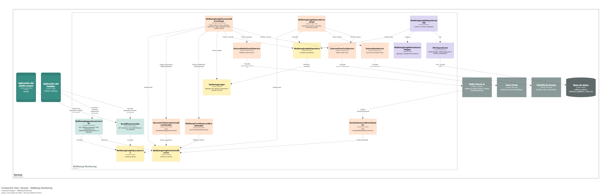
  <br/><i>Imagen 47. Component Diagram del Bounded Context Wellbeing Monitoring.</i>

</div>

<br>

#### 2.6.4.6. Bounded Context Software Architecture Code Level Diagrams

##### 2.6.4.6.1. Bounded Context Domain Layer Class Diagrams

Diagrama de clases de la capa Domain: en la Imagen 48 se muestran las clases del dominio Wellbeing Monitoring, compuesto por cuatro aggregate roots independientes (`WellbeingEntry`, `WellbeingPattern`, `SmallWin`, `StatusSummary`, alineados 1 a 1 con las tablas del diseño de base de datos oficial), los Commands y Queries asociados a cada uno, y las interfaces `IWellbeingCommandService`, `IWellbeingQueryService` e `IWellbeingEntryRepository`/`IWellbeingPatternRepository`/`ISmallWinRepository`/`IStatusSummaryRepository` con sus respectivas implementaciones. El diagrama fue elaborado en PlantUML.

<br>
<div align="center">

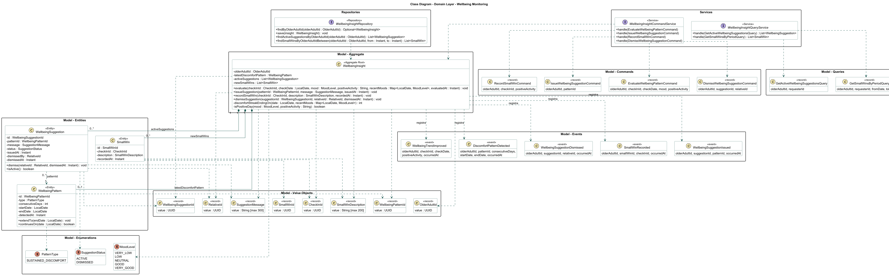
  <br/><i>Imagen 48. Class Diagram del Bounded Context Wellbeing Monitoring.</i>

</div>

<br>

##### 2.6.4.6.2. Bounded Context Database Design Diagram

Diagrama de base de datos: en la Imagen 49 se muestra el diseño de las tablas correspondientes al Bounded Context Wellbeing Monitoring, compuesto por `wellbeing_entries` (registro de estado de ánimo asociado a cada check-in), `status_summaries` (resumen diario del estado del adulto mayor), `small_wins` (historial de pequeños logros registrados) y `wellbeing_patterns` (patrones de malestar sostenido o mejora detectados en el historial de check-ins), relacionadas mediante llaves foráneas hacia `users` (Identity & Access) y `check_ins` (Daily Check-in). Los nombres de las columnas siguen la convención de nomenclatura del equipo, prefijando cada campo con el código de 3 letras de su tabla (`wbe`, `sts`, `smw`, `wbp`).

**Tabla `wellbeing_entries`:**

| Nombre | Descripción |
|---|---|
| wbe_id | Identificador único del registro, clave primaria de la tabla (prefijo `wbe` de `wellbeing_entries`). |
| wbe_older_adult_id | Llave foránea hacia `users.id`; identifica al adulto mayor al que pertenece el registro de estado de ánimo. |
| wbe_check_in_id | Llave foránea hacia `check_ins.id`; identifica el check-in del cual se derivó este registro de estado de ánimo. |
| wbe_mood | Nivel de ánimo reportado en el check-in (VERY_LOW, LOW, NEUTRAL, GOOD, VERY_GOOD). |
| wbe_mood_score | Puntaje numérico asociado al nivel de ánimo reportado. |
| wbe_recorded_at | Fecha y hora en que se registró el estado de ánimo. |

**Tabla `status_summaries`:**

| Nombre | Descripción |
|---|---|
| sts_id | Identificador único del registro, clave primaria de la tabla (prefijo `sts` de `status_summaries`). |
| sts_older_adult_id | Llave foránea hacia `users.id`; identifica al adulto mayor al que pertenece el resumen diario. |
| sts_summary_date | Fecha a la que corresponde el resumen de estado. |
| sts_mood | Estado de ánimo predominante del día resumido. |
| sts_has_answered | Indica si el adulto mayor respondió su check-in ese día. |
| sts_highlight | Dato destacado del día, mostrado al cuidador a distancia. |
| sts_generated_at | Fecha y hora en que se generó el resumen. |

**Tabla `small_wins`:**

| Nombre | Descripción |
|---|---|
| smw_id | Identificador único del registro, clave primaria de la tabla (prefijo `smw` de `small_wins`). |
| smw_older_adult_id | Llave foránea hacia `users.id`; identifica al adulto mayor al que pertenece el pequeño logro registrado. |
| smw_check_in_id | Llave foránea hacia `check_ins.id`; identifica el check-in del cual se derivó el pequeño logro, cuando aplica. |
| smw_description | Descripción del pequeño logro, generada a partir de una mejora detectada en el patrón de bienestar. |
| smw_recorded_at | Fecha y hora en que se registró el pequeño logro. |

**Tabla `wellbeing_patterns`:**

| Nombre | Descripción |
|---|---|
| wbp_id | Identificador único del registro, clave primaria de la tabla (prefijo `wbp` de `wellbeing_patterns`). |
| wbp_older_adult_id | Llave foránea hacia `users.id`; identifica al adulto mayor al que pertenece el patrón detectado. |
| wbp_type | Tipo de patrón detectado en el historial de check-ins (SUSTAINED_DISCOMFORT, IMPROVEMENT). |
| wbp_consecutive_days | Cantidad de días consecutivos que sostienen el patrón detectado. |
| wbp_start_date | Fecha de inicio del periodo en que se detectó el patrón. |
| wbp_end_date | Fecha de fin del periodo en que se detectó el patrón. |
| wbp_detected_at | Fecha y hora en que se detectó el patrón. |

<br>
<div align="center">

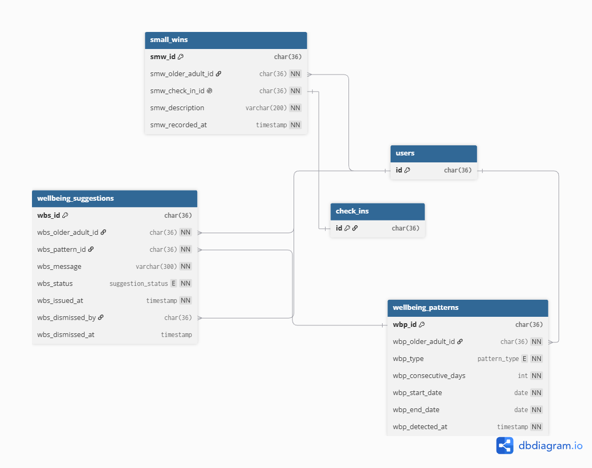
  <br/><i>Imagen 49. Database Design Diagram del Bounded Context Wellbeing Monitoring.</i>

</div>

<br>


### 2.6.5. Bounded Context: Social Companionship

El bounded context Social Companionship sostiene el vínculo emocional entre el adulto mayor y su familia, sin fines de monitoreo. Cubre el intercambio de mensajes multimedia asíncronos: el adulto mayor graba audios breves sobre su día para sus familiares, y los familiares le comparten fotografías de su vida cotidiana. También gestiona los recordatorios de contacto social con los que el adulto mayor mantiene activa su vida social, como llamar a una amistad o asistir a una actividad, que puede completar, posponer o cancelar. Es un contexto de soporte: complementa el check-in diario con una dimensión de compañía que va más allá de la seguridad física.

Su modelo se organiza en tres aggregates. `AudioMessage` y `PhotoMessage` representan los mensajes de cada tipo; ambos se persisten en la misma tabla, diferenciados por su tipo, y se modelan por separado porque su origen y sus destinatarios difieren: el audio va del adulto mayor a todos sus familiares vinculados y la fotografía, de un familiar al adulto mayor. Ambos se crean primero como borrador, mientras el remitente revisa el contenido, y solo llegan a sus destinatarios al compartirse. `SocialReminder` representa un recordatorio programado por el adulto mayor y controla su presentación, postergación y cierre.

El contexto consulta a Care Circle el círculo y los familiares vinculados del adulto mayor, para resolver los destinatarios de cada mensaje y verificar el acceso, y a Identity & Access la zona horaria del adulto mayor, para interpretar los horarios de los recordatorios. Los archivos de audio y fotografía se almacenan fuera de la base de datos y solo se entregan a través de la API, previa verificación de acceso.

#### 2.6.5.1. Domain Layer

En esta capa se representan las reglas de intercambio de mensajes y de gestión de recordatorios sociales, sin dependencia de frameworks de persistencia, red ni interfaz.

**Sub-capa Model: Aggregates**

`AudioMessage` (Aggregate Root): representa un mensaje de voz que el adulto mayor graba para sus familiares. Controla su paso de borrador a compartido y registra su reproducción por cada familiar.

| Atributo | Tipo | Visibilidad | Descripción |
| --- | --- | --- | --- |
| id | AudioMessageId | private | Identificador único del mensaje. |
| careCircleId | CareCircleId | private | Círculo de cuidado en el que se comparte el mensaje. |
| senderId | OlderAdultId | private | Adulto mayor que grabó el mensaje. |
| mediaKey | MediaKey | private | Clave del archivo de audio en el almacenamiento. |
| duration | AudioDuration | private | Duración del audio. |
| status | MessageStatus | private | Estado del mensaje: borrador o compartido. |
| createdAt | Instant | private | Instante de la grabación, en UTC. |
| sentAt | Instant | private | Instante en que se compartió; es nulo mientras sea borrador. |
| receipts | List\<MessageReceipt\> | private | Registro de reproducción por cada familiar destinatario. |

| Método | Visibilidad | Descripción |
| --- | --- | --- |
| record(careCircleId, senderId, mediaKey, duration, recordedAt) | public (static) | Factory que crea el mensaje como borrador a partir del audio grabado y registra el evento `AudioMessageRecorded`. |
| share(recipientIds, sharedAt) | public | Comparte el borrador con los familiares vinculados, crea un registro de recepción por cada uno y registra el evento `AudioMessageShared`. Rechaza la operación si el mensaje ya fue compartido o si no hay destinatarios. |
| discard(discardedAt) | public | Descarta el borrador antes de compartirlo y registra el evento `AudioMessageDiscarded`. Rechaza la operación si el mensaje ya fue compartido. |
| play(relativeId, playedAt) | public | Registra la primera reproducción del audio por un familiar destinatario y el evento `AudioMessagePlayed`; las reproducciones siguientes no cambian el estado. |
| isRecipient(userId) | public | Indica si el usuario es destinatario del mensaje. |

`PhotoMessage` (Aggregate Root): representa una fotografía que un familiar comparte con el adulto mayor. Controla su paso de borrador a compartida y registra su visualización.

| Atributo | Tipo | Visibilidad | Descripción |
| --- | --- | --- | --- |
| id | PhotoMessageId | private | Identificador único del mensaje. |
| careCircleId | CareCircleId | private | Círculo de cuidado en el que se comparte la fotografía. |
| senderId | RelativeId | private | Familiar que compartió la fotografía. |
| mediaKey | MediaKey | private | Clave del archivo de imagen en el almacenamiento. |
| status | MessageStatus | private | Estado del mensaje: borrador o compartido. |
| createdAt | Instant | private | Instante de la selección, en UTC. |
| sentAt | Instant | private | Instante en que se compartió; es nulo mientras sea borrador. |
| receipt | MessageReceipt | private | Registro de visualización del adulto mayor. |

| Método | Visibilidad | Descripción |
| --- | --- | --- |
| select(careCircleId, senderId, mediaKey, selectedAt) | public (static) | Factory que crea el mensaje como borrador a partir de la fotografía seleccionada y registra el evento `PhotoMessageSelected`. |
| share(olderAdultId, sharedAt) | public | Comparte el borrador con el adulto mayor del círculo, crea su registro de recepción y registra el evento `PhotoMessageShared`. Rechaza la operación si la fotografía ya fue compartida. |
| discard(discardedAt) | public | Descarta el borrador antes de compartirlo y registra el evento `PhotoMessageDiscarded`. Rechaza la operación si la fotografía ya fue compartida. |
| view(olderAdultId, viewedAt) | public | Registra la primera visualización de la fotografía por el adulto mayor y el evento `PhotoMessageViewed`; las visualizaciones siguientes no cambian el estado. |
| isRecipient(userId) | public | Indica si el usuario es el destinatario de la fotografía. |

`SocialReminder` (Aggregate Root): representa un recordatorio de contacto social programado por el adulto mayor. Controla su presentación, postergación, completado, cancelación y cierre como no completado.

| Atributo | Tipo | Visibilidad | Descripción |
| --- | --- | --- | --- |
| id | SocialReminderId | private | Identificador único del recordatorio. |
| olderAdultId | OlderAdultId | private | Adulto mayor que programó el recordatorio. |
| title | ReminderTitle | private | Título del recordatorio. |
| description | ReminderDescription | private | Descripción del recordatorio, opcional. |
| remindAt | Instant | private | Instante en que debe presentarse el recordatorio, en UTC; se actualiza al posponerlo. |
| status | ReminderStatus | private | Estado del recordatorio. |
| completedAt | Instant | private | Instante en que se completó; es nulo mientras no se haya completado. |
| createdAt | Instant | private | Instante de creación, en UTC. |
| updatedAt | Instant | private | Instante de la última modificación, en UTC. |

| Método | Visibilidad | Descripción |
| --- | --- | --- |
| schedule(olderAdultId, title, description, remindAt, scheduledAt) | public (static) | Factory que programa el recordatorio; rechaza instantes ya transcurridos. Registra el evento `SocialReminderScheduled`. |
| present(presentedAt) | public | Presenta el recordatorio al adulto mayor cuando llega su hora; solo procede si está programado o pospuesto. Registra el evento `SocialReminderPresented`. |
| postpone(postponedAt, endOfDay) | public | Posterga el recordatorio presentado 60 minutos, dentro del mismo día local; rechaza la operación si ya no queda tiempo en el día. Registra el evento `SocialReminderPostponed`. |
| complete(completedAt) | public | Marca el recordatorio como completado para que no vuelva a presentarse y registra el evento `SocialReminderCompleted`. |
| cancel(canceledAt) | public | Cancela un recordatorio programado, presentado o pospuesto para que no vuelva a presentarse y registra el evento `SocialReminderCanceled`. |
| markAsMissed(markedAt) | public | Cierra como no completado un recordatorio presentado o pospuesto cuyo día terminó sin que el adulto mayor lo completara ni lo cancelara. Registra el evento `SocialReminderMarkedAsMissed`. |
| isAwaitingAction() | public | Indica si el recordatorio está presentado o pospuesto. |

**Sub-capa Model: Entities**

`MessageReceipt`: representa la recepción de un mensaje por un destinatario y el momento en que lo abrió. Pertenece a los aggregates `AudioMessage` y `PhotoMessage`.

| Atributo | Tipo | Visibilidad | Descripción |
| --- | --- | --- | --- |
| recipientId | UserId | private | Destinatario del mensaje; junto con el mensaje, identifica el registro. |
| openedAt | Instant | private | Instante en que el destinatario reprodujo el audio o vio la fotografía; es nulo mientras no lo haya abierto. |

| Método | Visibilidad | Descripción |
| --- | --- | --- |
| markAsOpened(openedAt) | public | Registra la primera apertura del mensaje por el destinatario. |
| isOpened() | public | Indica si el destinatario ya abrió el mensaje. |

**Sub-capa Model: Value Objects**

Se implementan como records inmutables que validan su contenido al construirse. Los límites de longitud coinciden con las columnas de la base de datos.

| Nombre | Atributos | Descripción |
| --- | --- | --- |
| AudioMessageId, PhotoMessageId, SocialReminderId | value: UUID | Identidades inmutables de los aggregates del contexto. |
| CareCircleId | value: UUID | Referencia por identidad a un círculo de Care Circle. |
| OlderAdultId, RelativeId, UserId | value: UUID | Referencias por identidad a cuentas de Identity & Access, según el rol que cumplen en el mensaje. |
| MediaKey | value: String | Clave del archivo en el almacenamiento, de máximo 500 caracteres; no es una URL pública. |
| MediaFile | content: byte[], contentType: String | Archivo recibido para almacenar. Solo admite audio en formato AAC (`audio/mp4`) e imágenes JPEG o PNG, dentro del tamaño máximo configurado. |
| AudioDuration | seconds: int | Duración del audio, entre 1 y 180 segundos. |
| ReminderTitle | value: String | Título del recordatorio, obligatorio y de máximo 120 caracteres. |
| ReminderDescription | value: String | Descripción del recordatorio, de máximo 300 caracteres. |

**Sub-capa Model: Enumerations**

| Nombre | Valores | Descripción |
| --- | --- | --- |
| MessageType | AUDIO, PHOTO | Tipo de mensaje; distingue ambos aggregates en la persistencia. |
| MessageStatus | DRAFT, SHARED | Estado de un mensaje: borrador en revisión o compartido con sus destinatarios. |
| ReminderStatus | SCHEDULED, PRESENTED, POSTPONED, COMPLETED, CANCELED, MISSED | Estado del ciclo de vida de un recordatorio social. |

**Sub-capa Model: Commands**

| Nombre | Atributos | Descripción |
| --- | --- | --- |
| RecordAudioMessageCommand | senderId, audioFile, durationSeconds | Intención del adulto mayor de guardar un audio grabado como borrador. |
| ShareAudioMessageCommand | audioMessageId, senderId | Intención de compartir el audio con los familiares vinculados. |
| DiscardAudioMessageCommand | audioMessageId, senderId | Intención de descartar un audio antes de compartirlo. |
| PlayAudioMessageCommand | audioMessageId, relativeId | Intención de un familiar de reproducir un audio recibido. |
| SelectPhotoMessageCommand | careCircleId, senderId, photoFile | Intención de un familiar de cargar una fotografía como borrador. |
| SharePhotoMessageCommand | photoMessageId, senderId | Intención de compartir la fotografía con el adulto mayor. |
| DiscardPhotoMessageCommand | photoMessageId, senderId | Intención de descartar una fotografía antes de compartirla. |
| ViewPhotoMessageCommand | photoMessageId, olderAdultId | Intención del adulto mayor de ver una fotografía recibida. |
| ScheduleSocialReminderCommand | olderAdultId, title, description, remindAt | Intención de programar un recordatorio en una fecha y hora locales. |
| PresentSocialReminderCommand | socialReminderId | Intención de presentar un recordatorio cuya hora llegó. |
| PostponeSocialReminderCommand | socialReminderId, olderAdultId | Intención de posponer un recordatorio presentado. |
| CompleteSocialReminderCommand | socialReminderId, olderAdultId | Intención de marcar un recordatorio como realizado. |
| CancelSocialReminderCommand | socialReminderId, olderAdultId | Intención de cancelar un recordatorio que ya no se necesita. |
| MarkSocialReminderMissedCommand | socialReminderId | Intención de cerrar como no completado un recordatorio cuyo día terminó sin acción del adulto mayor. |

**Sub-capa Model: Queries**

| Nombre | Atributos | Descripción |
| --- | --- | --- |
| GetSharedAudioMessagesByCareCircleIdQuery | careCircleId, requesterId | Consulta de los audios compartidos de un círculo, del más reciente al más antiguo. |
| GetAudioMessageMediaQuery | audioMessageId, requesterId | Consulta del archivo de un audio para su reproducción. |
| GetSharedPhotoMessagesByCareCircleIdQuery | careCircleId, requesterId | Consulta de las fotografías compartidas de un círculo, de la más reciente a la más antigua. |
| GetPhotoMessageMediaQuery | photoMessageId, requesterId | Consulta del archivo de una fotografía para su visualización. |
| GetActiveSocialRemindersQuery | olderAdultId, requesterId | Consulta de los recordatorios programados, presentados o pospuestos de un adulto mayor. |
| GetSocialRemindersDueForPresentationQuery | referenceTime | Consulta de los recordatorios programados o pospuestos cuya hora ya llegó. |
| GetSocialRemindersAwaitingActionQuery | referenceTime | Consulta de los recordatorios presentados o pospuestos anteriores al instante indicado, candidatos a cerrarse como no completados. |

**Sub-capa Model: Events**

| Nombre | Atributos | Descripción |
| --- | --- | --- |
| AudioMessageRecorded | audioMessageId, senderId, occurredAt | El adulto mayor grabó un audio, que quedó como borrador. |
| AudioMessageShared | audioMessageId, careCircleId, recipientIds, occurredAt | El audio se compartió con los familiares vinculados. |
| AudioMessageDiscarded | audioMessageId, senderId, occurredAt | El adulto mayor descartó un audio antes de compartirlo. |
| AudioMessagePlayed | audioMessageId, relativeId, occurredAt | Un familiar reprodujo el audio por primera vez. |
| PhotoMessageSelected | photoMessageId, senderId, occurredAt | Un familiar cargó una fotografía, que quedó como borrador. |
| PhotoMessageShared | photoMessageId, careCircleId, olderAdultId, occurredAt | La fotografía se compartió con el adulto mayor. |
| PhotoMessageDiscarded | photoMessageId, senderId, occurredAt | El familiar descartó una fotografía antes de compartirla. |
| PhotoMessageViewed | photoMessageId, olderAdultId, occurredAt | El adulto mayor vio la fotografía por primera vez. |
| SocialReminderScheduled | socialReminderId, olderAdultId, remindAt, occurredAt | Se programó un recordatorio social. |
| SocialReminderPresented | socialReminderId, olderAdultId, occurredAt | Se presentó un recordatorio al adulto mayor. |
| SocialReminderPostponed | socialReminderId, olderAdultId, remindAt, occurredAt | El adulto mayor pospuso un recordatorio para más tarde el mismo día. |
| SocialReminderCompleted | socialReminderId, olderAdultId, occurredAt | El adulto mayor indicó que realizó la actividad del recordatorio. |
| SocialReminderCanceled | socialReminderId, olderAdultId, occurredAt | El adulto mayor canceló un recordatorio. |
| SocialReminderMarkedAsMissed | socialReminderId, olderAdultId, occurredAt | El día del recordatorio terminó sin que se completara. |

**Sub-capa Repositories**

| Tipo | Nombre | Métodos principales | Descripción |
| --- | --- | --- | --- |
| Interface | AudioMessageRepository | save(audioMessage), findById(audioMessageId), delete(audioMessage), findAllSharedByCareCircleId(careCircleId) | Contrato de persistencia del aggregate `AudioMessage` junto con sus registros de recepción. Se implementa en Infrastructure. |
| Interface | PhotoMessageRepository | save(photoMessage), findById(photoMessageId), delete(photoMessage), findAllSharedByCareCircleId(careCircleId) | Contrato de persistencia del aggregate `PhotoMessage` junto con su registro de recepción. Se implementa en Infrastructure. |
| Interface | SocialReminderRepository | save(socialReminder), findById(socialReminderId), findActiveByOlderAdultId(olderAdultId), findAllDueForPresentation(referenceTime), findAllAwaitingActionBefore(referenceTime) | Contrato de persistencia del aggregate `SocialReminder`. Se implementa en Infrastructure. |

**Sub-capa Services**

| Tipo | Nombre | Métodos principales | Descripción |
| --- | --- | --- | --- |
| Interface | AudioMessageCommandService | handle(RecordAudioMessageCommand), handle(ShareAudioMessageCommand), handle(DiscardAudioMessageCommand), handle(PlayAudioMessageCommand) | Contrato de las operaciones de escritura sobre los mensajes de audio. |
| Interface | AudioMessageQueryService | handle(GetSharedAudioMessagesByCareCircleIdQuery), handle(GetAudioMessageMediaQuery) | Contrato de la lectura de mensajes de audio. |
| Interface | PhotoMessageCommandService | handle(SelectPhotoMessageCommand), handle(SharePhotoMessageCommand), handle(DiscardPhotoMessageCommand), handle(ViewPhotoMessageCommand) | Contrato de las operaciones de escritura sobre los mensajes de fotografía. |
| Interface | PhotoMessageQueryService | handle(GetSharedPhotoMessagesByCareCircleIdQuery), handle(GetPhotoMessageMediaQuery) | Contrato de la lectura de mensajes de fotografía. |
| Interface | SocialReminderCommandService | handle(ScheduleSocialReminderCommand), handle(PresentSocialReminderCommand), handle(PostponeSocialReminderCommand), handle(CompleteSocialReminderCommand), handle(CancelSocialReminderCommand), handle(MarkSocialReminderMissedCommand) | Contrato de las operaciones de escritura sobre los recordatorios sociales. |
| Interface | SocialReminderQueryService | handle(GetActiveSocialRemindersQuery), handle(GetSocialRemindersDueForPresentationQuery), handle(GetSocialRemindersAwaitingActionQuery) | Contrato de la lectura de recordatorios sociales. |

#### 2.6.5.2. Interface Layer

Clases que exponen el bounded context hacia el exterior y traducen las peticiones entrantes al lenguaje del dominio.

**Sub-capa REST: Controllers**

| Nombre | Endpoints | Descripción |
| --- | --- | --- |
| AudioMessagesController | POST /api/v1/care-circles/{careCircleId}/audio-messages, POST /api/v1/care-circles/{careCircleId}/audio-messages/{audioMessageId}/share, DELETE /api/v1/care-circles/{careCircleId}/audio-messages/{audioMessageId}, GET /api/v1/care-circles/{careCircleId}/audio-messages, GET /api/v1/care-circles/{careCircleId}/audio-messages/{audioMessageId}/media, POST /api/v1/care-circles/{careCircleId}/audio-messages/{audioMessageId}/play | Punto de entrada de la grabación, el envío y el descarte de audios por el adulto mayor, y de su consulta y reproducción por los familiares. La grabación recibe el archivo como `multipart/form-data` y responde 415 Unsupported Media Type si el formato no está admitido. El archivo se entrega con soporte de solicitudes por rango, de modo que el reproductor pueda desplazarse dentro del audio. |
| PhotoMessagesController | POST /api/v1/care-circles/{careCircleId}/photo-messages, POST /api/v1/care-circles/{careCircleId}/photo-messages/{photoMessageId}/share, DELETE /api/v1/care-circles/{careCircleId}/photo-messages/{photoMessageId}, GET /api/v1/care-circles/{careCircleId}/photo-messages, GET /api/v1/care-circles/{careCircleId}/photo-messages/{photoMessageId}/media, POST /api/v1/care-circles/{careCircleId}/photo-messages/{photoMessageId}/view | Punto de entrada de la carga, el envío y el descarte de fotografías por los familiares, y de la galería y visualización por el adulto mayor. La carga recibe el archivo como `multipart/form-data` y responde 415 Unsupported Media Type si el formato no está admitido. |
| SocialRemindersController | POST /api/v1/social-reminders, GET /api/v1/social-reminders?olderAdultId={olderAdultId}, POST /api/v1/social-reminders/{socialReminderId}/postpone, POST /api/v1/social-reminders/{socialReminderId}/complete, POST /api/v1/social-reminders/{socialReminderId}/cancel | Punto de entrada de la programación y gestión de recordatorios por el propio adulto mayor. La programación responde 400 Bad Request si falta el título o la fecha y hora ya transcurrió; las demás operaciones responden 409 Conflict si el estado del recordatorio no admite la acción. |

Los endpoints de mensajes responden 403 Forbidden cuando el usuario autenticado no pertenece al círculo, o cuando intenta reproducir o ver un mensaje del que no es destinatario. El envío y el descarte solo proceden para el remitente del borrador.

**Sub-capa REST: Resources**

| Nombre | Atributos | Descripción |
| --- | --- | --- |
| RecordAudioMessageResource | file, durationSeconds | Datos de entrada de la grabación, recibidos como formulario multiparte. |
| AudioMessageResource | id, careCircleId, senderId, status, durationSeconds, mediaUrl, createdAt, sentAt, played | Representación de un mensaje de audio. `mediaUrl` apunta al endpoint protegido del archivo y `played` indica si el solicitante ya lo reprodujo. |
| SelectPhotoMessageResource | file | Datos de entrada de la carga de una fotografía, recibidos como formulario multiparte. |
| PhotoMessageResource | id, careCircleId, senderId, status, mediaUrl, createdAt, sentAt, viewed | Representación de un mensaje de fotografía; `viewed` indica si el adulto mayor ya la vio. |
| ScheduleSocialReminderResource | title, description, remindAt | Datos de entrada para programar un recordatorio en fecha y hora locales. |
| SocialReminderResource | id, olderAdultId, title, description, remindAt, status, completedAt | Representación de un recordatorio social. |

**Sub-capa REST: Transform**

| Nombre | Descripción |
| --- | --- |
| AudioMessageResourceFromEntityAssembler | Convierte el aggregate `AudioMessage` en su representación REST según el solicitante. |
| PhotoMessageResourceFromEntityAssembler | Convierte el aggregate `PhotoMessage` en su representación REST. |
| SocialReminderResourceFromEntityAssembler | Convierte el aggregate `SocialReminder` en su representación REST, expresando la hora en la zona horaria del adulto mayor. |
| RecordAudioMessageCommandFromResourceAssembler | Combina el archivo recibido con el adulto mayor autenticado para construir el comando de grabación. |
| SelectPhotoMessageCommandFromResourceAssembler | Combina el archivo recibido con el círculo y el familiar autenticado para construir el comando de selección. |
| ScheduleSocialReminderCommandFromResourceAssembler | Combina la petición con el adulto mayor autenticado para construir el comando de programación. |

**Sub-capa Scheduling: Jobs**

| Nombre | Descripción |
| --- | --- |
| SocialReminderScheduler | Tareas periódicas de los recordatorios. Cada minuto consulta los recordatorios cuya hora llegó y envía un `PresentSocialReminderCommand` por cada uno. Cada hora consulta los recordatorios presentados o pospuestos y envía un `MarkSocialReminderMissedCommand` por cada uno. |

#### 2.6.5.3. Application Layer

Clases que orquestan los flujos del contexto, coordinando los aggregates, los repositorios, el almacenamiento de archivos y los servicios de otros contextos.

**Sub-capa Internal: CommandServices (Command Handlers)**

| Nombre | Responsabilidad principal | Relación con otros elementos |
| --- | --- | --- |
| AudioMessageCommandServiceImpl | Al grabar, obtiene el círculo del adulto mayor, almacena el archivo y crea el borrador. Al compartir, obtiene los familiares con vínculo activo como destinatarios. Al descartar, elimina el registro y luego el archivo, una vez confirmada la eliminación. Registra la reproducción verificando que el familiar sea destinatario. Tras persistir, publica los eventos acumulados. | Implementa `AudioMessageCommandService`; usa `AudioMessageRepository`, `MediaStorageService`, `ExternalCareCircleService` y `DomainEventPublisher`. |
| PhotoMessageCommandServiceImpl | Al seleccionar, verifica que el familiar tenga un vínculo activo con el círculo, almacena el archivo y crea el borrador. Al compartir, obtiene el adulto mayor del círculo como destinatario. Al descartar, elimina el registro y luego el archivo. Registra la visualización verificando que el solicitante sea el adulto mayor destinatario. Tras persistir, publica los eventos acumulados. | Implementa `PhotoMessageCommandService`; usa `PhotoMessageRepository`, `MediaStorageService`, `ExternalCareCircleService` y `DomainEventPublisher`. |
| SocialReminderCommandServiceImpl | Al programar, interpreta la fecha y hora en la zona horaria del adulto mayor. Presenta los recordatorios cuya hora llegó y posterga los presentados dentro del día local. Gestiona el completado y la cancelación verificando que provengan del propio adulto mayor. Al cerrar un recordatorio como no completado, solo actúa si su día local ya terminó; en otro caso no realiza cambios. Tras persistir, publica los eventos acumulados. | Implementa `SocialReminderCommandService`; usa `SocialReminderRepository`, `ExternalIamService` y `DomainEventPublisher`. |

**Sub-capa Internal: QueryServices**

| Nombre | Responsabilidad principal | Relación con otros elementos |
| --- | --- | --- |
| AudioMessageQueryServiceImpl | Resuelve los audios compartidos de un círculo, previa verificación de acceso, y entrega el archivo de un audio solo a su remitente o a sus destinatarios. | Implementa `AudioMessageQueryService`; usa `AudioMessageRepository`, `MediaStorageService` y `ExternalCareCircleService`. |
| PhotoMessageQueryServiceImpl | Resuelve las fotografías compartidas de un círculo, previa verificación de acceso, y entrega el archivo de una fotografía solo a su remitente o a su destinatario. | Implementa `PhotoMessageQueryService`; usa `PhotoMessageRepository`, `MediaStorageService` y `ExternalCareCircleService`. |
| SocialReminderQueryServiceImpl | Resuelve los recordatorios activos del propio adulto mayor y los recordatorios por presentar o por cerrar para las tareas periódicas. | Implementa `SocialReminderQueryService`; usa `SocialReminderRepository`. |

**Sub-capa Internal: Event Handlers**

Las policies de este contexto dependen del paso del tiempo y las ejecuta `SocialReminderScheduler`; el contexto no consume eventos de otros contextos.

**Sub-capa Internal: Outbound Services**

| Tipo | Nombre | Métodos principales | Descripción |
| --- | --- | --- | --- |
| Interface | MediaStorageService | store(mediaFile): MediaKey, load(mediaKey), delete(mediaKey) | Abstracción del almacenamiento de archivos de audio e imagen. |
| Class | ExternalCareCircleService | fetchCareCircleId(olderAdultId), fetchOlderAdultId(careCircleId), fetchActiveRelativeIds(olderAdultId), hasAccessToCareCircle(userId, careCircleId) | Consume `CareCircleContextFacade` para resolver círculos, destinatarios y permisos de acceso. |
| Class | ExternalIamService | fetchTimeZone(olderAdultId) | Consume `IamContextFacade` y devuelve la zona horaria del adulto mayor como `ZoneId`. |

#### 2.6.5.4. Infrastructure Layer

Clases que resuelven el acceso a la base de datos MySQL y al almacenamiento de archivos, implementando las abstracciones definidas en las capas Domain y Application.

**Sub-capa Persistence: JPA Entities**

| Nombre | Responsabilidad principal | Relación con otros elementos |
| --- | --- | --- |
| CompanionMessagePersistenceEntity | Representa una fila de la tabla `companion_messages`, cuyo tipo determina si corresponde a un audio o a una fotografía. Contiene la colección de registros de recepción, que se persisten en cascada junto con el mensaje. | Usada por `CompanionMessageJpaRepository` y por los mappers de mensajes. |
| MessageReceiptPersistenceEntity | Representa una fila de la tabla `message_receipts`. | Contenida en `CompanionMessagePersistenceEntity`. |
| SocialReminderPersistenceEntity | Representa una fila de la tabla `social_reminders`. | Usada por `SocialReminderJpaRepository` y `SocialReminderPersistenceMapper`. |

**Sub-capa Persistence: JPA Repositories**

| Nombre | Responsabilidad principal | Relación con otros elementos |
| --- | --- | --- |
| CompanionMessageJpaRepository | Interfaz de Spring Data JPA con las consultas por identificador y tipo, y la de mensajes compartidos de un círculo por tipo ordenados por fecha de envío, resuelta sobre el índice `(care_circle_id, type, sent_at)`. | Extiende `JpaRepository`; usada por `AudioMessageRepositoryImpl` y `PhotoMessageRepositoryImpl`. |
| SocialReminderJpaRepository | Interfaz de Spring Data JPA con la consulta de recordatorios activos de un adulto mayor, resuelta sobre el índice `(older_adult_id, remind_at)`, y las de recordatorios por presentar o por cerrar, resueltas sobre el índice `(status, remind_at)`. | Extiende `JpaRepository`; usada por `SocialReminderRepositoryImpl`. |

**Sub-capa Persistence: Repositories**

| Nombre | Responsabilidad principal | Relación con otros elementos |
| --- | --- | --- |
| AudioMessageRepositoryImpl | Persiste, recupera y elimina el aggregate `AudioMessage` sobre las filas de tipo AUDIO. | Implementa `AudioMessageRepository`; usa `CompanionMessageJpaRepository` y `AudioMessagePersistenceMapper`. |
| PhotoMessageRepositoryImpl | Persiste, recupera y elimina el aggregate `PhotoMessage` sobre las filas de tipo PHOTO. | Implementa `PhotoMessageRepository`; usa `CompanionMessageJpaRepository` y `PhotoMessagePersistenceMapper`. |
| SocialReminderRepositoryImpl | Persiste y recupera el aggregate `SocialReminder`. | Implementa `SocialReminderRepository`; usa `SocialReminderJpaRepository` y `SocialReminderPersistenceMapper`. |

**Sub-capa Persistence: Mappers**

| Nombre | Responsabilidad principal | Relación con otros elementos |
| --- | --- | --- |
| AudioMessagePersistenceMapper | Traduce entre el aggregate `AudioMessage`, con sus registros de recepción, y sus entidades de persistencia. | Usado por `AudioMessageRepositoryImpl`. |
| PhotoMessagePersistenceMapper | Traduce entre el aggregate `PhotoMessage`, con su registro de recepción, y sus entidades de persistencia. | Usado por `PhotoMessageRepositoryImpl`. |
| SocialReminderPersistenceMapper | Traduce entre el aggregate `SocialReminder` y `SocialReminderPersistenceEntity`. | Usado por `SocialReminderRepositoryImpl`. |

**Sub-capa Storage: Services**

| Nombre | Responsabilidad principal | Relación con otros elementos |
| --- | --- | --- |
| AzureBlobMediaStorageService | Almacena los archivos en un contenedor privado de Azure Blob Storage, identificados por una clave aleatoria. Los archivos no tienen acceso público y solo se obtienen a través de la API, después de verificar el acceso del solicitante. | Implementa `MediaStorageService`. |

#### 2.6.5.5. Bounded Context Software Architecture Component Level Diagrams

En esta sección se presenta el Component Diagram de C4 Model correspondiente al bounded context Social Companionship, elaborado en Structurizr (Imagen 50). El diagrama detalla la arquitectura interna del módulo dentro del container API REST, organizada en las cuatro capas del diseño táctico: los *Controllers* (`AudioMessagesController`, `PhotoMessagesController` y `SocialRemindersController`) como puntos de entrada REST; los *Resources* y *Assemblers* para la transformación de datos; los servicios de aplicación de comando y de consulta, uno por cada aggregate; y el acceso a datos mediante los tres repositorios definidos en el dominio (`AudioMessageRepository`, `PhotoMessageRepository` y `SocialReminderRepository`), implementados en Infrastructure.

En el centro del diagrama se ubican los aggregates `AudioMessage`, `PhotoMessage` y `SocialReminder`, junto con los Commands, Queries y Domain Events del contexto. Los servicios de aplicación se apoyan en abstracciones salientes: `MediaStorageService`, implementado sobre Azure Blob Storage para guardar los archivos de audio e imagen; `ExternalCareCircleService`, que consulta a Care Circle los destinatarios y los permisos de acceso; y `ExternalIamService`, que consulta a Identity & Access la zona horaria del adulto mayor. El scheduler `SocialReminderScheduler` presenta los recordatorios cuya hora llegó y cierra como no completados los vencidos, y `DomainEventPublisherAdapter` publica los eventos de dominio dentro del monolito modular. Las flechas evidencian que las dependencias apuntan siempre hacia el dominio y que ningún componente de Interface accede directamente a la base de datos.

<div align="center">


  <br/><i>Imagen 50. Component Level Diagram del Bounded Context Social Companionship.</i>

</div>
<br>

#### 2.6.5.6. Bounded Context Software Architecture Code Level Diagrams

En esta sección se presentan los diagramas de mayor nivel de detalle sobre la implementación del bounded context Social Companionship. Se incluye el diagrama de clases de la capa Domain y el diagrama de diseño de base de datos correspondiente a las tablas que dan persistencia al aggregate.
<br>


##### 2.6.5.6.1. Bounded Context Domain Layer Class Diagrams

El siguiente diagrama de clases UML (Imagen 51) representa el bounded context Social Companionship organizado en sus cuatro capas: Interface, Application, Domain e Infrastructure. Acatando el EventStorming, en la capa de dominio se visualizan los tres Aggregate Roots principales: `AudioMessage`, `PhotoMessage` y `SocialReminder`. Los dos primeros contienen la entidad `MessageReceipt`, que registra la recepción de cada mensaje por su destinatario, mientras que `SocialReminder` controla el ciclo de vida del recordatorio. Junto a ellos se agrupan los value objects, las enumeraciones, los commands, las queries y los eventos de dominio.

El dominio declara además las interfaces de los servicios de aplicación (`AudioMessageCommandService`, `PhotoMessageCommandService`, `SocialReminderCommandService` y sus servicios de consulta) y de los repositorios (`AudioMessageRepository`, `PhotoMessageRepository` y `SocialReminderRepository`). Estas interfaces orquestan la lógica y son implementadas por las capas externas: la capa Application aporta los servicios `Impl` y los servicios salientes `MediaStorageService`, `ExternalCareCircleService` y `ExternalIamService`, y la capa Infrastructure aporta los repositorios, los mappers, las entidades JPA y `AzureBlobMediaStorageService` para el almacenamiento de archivos. Por su parte, la capa Interface expone los controladores REST y el scheduler `SocialReminderScheduler`.

<div align="center">

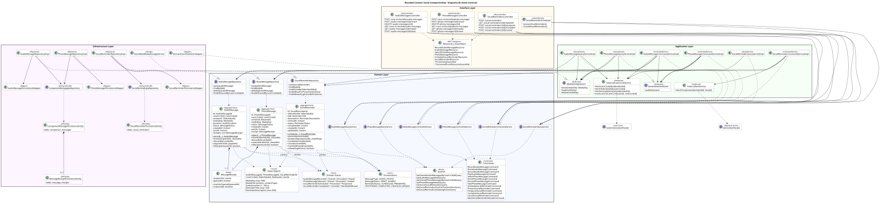
<br/><i>Imagen 51. Bounded Context Domain Layer Class Diagram</i>

</div>
<br>

##### 2.6.5.6.2. Bounded Context Database Design Diagram

El diagrama de base de datos presenta los objetos que permiten la persistencia del bounded context **Social Companionship** sobre el motor MySQL. El contexto se materializa en tres tablas: `companion_messages`, `message_receipts` y `social_reminders`. Las dos primeras sostienen el intercambio de mensajes multimedia, y la tercera, los recordatorios de contacto social. Los identificadores se almacenan como `BINARY(16)` y las fechas en UTC con `DATETIME(6)`.

**Tabla companion_messages**

| Columna | Tipo | Constraints | Descripción |
|---|---|---|---|
| id | binary(16) | PK | Identificador único del mensaje. |
| care_circle_id | binary(16) | NOT NULL, FK → care_circles.id | Círculo de cuidado en el que se comparte el mensaje. |
| sender_id | binary(16) | NOT NULL, FK → users.id | Usuario que envía el mensaje. |
| type | message_type | NOT NULL | Tipo de mensaje: AUDIO o PHOTO. |
| media_url | varchar(500) | NOT NULL | Referencia al archivo de audio o imagen. |
| duration_seconds | int | - | Duración del audio en segundos. Solo aplica cuando type = AUDIO. |
| sent_at | datetime(6) | NOT NULL | Fecha y hora en que se envió el mensaje, en UTC. |

Esta tabla almacena en una sola estructura los mensajes de audio y de fotografía, diferenciados por la columna `type`. Un audio va del adulto mayor a todos los familiares activos del círculo, y una fotografía va de un familiar al adulto mayor. La columna `duration_seconds` solo se llena para los audios. Incluye un índice compuesto sobre `(care_circle_id, type, sent_at)` para optimizar la consulta de los mensajes de un círculo por tipo y por fecha de envío.

**Tabla message_receipts**

| Columna | Tipo | Constraints | Descripción |
|---|---|---|---|
| message_id | binary(16) | PK (compuesta), NOT NULL, FK → companion_messages.id | Mensaje recibido. |
| recipient_id | binary(16) | PK (compuesta), NOT NULL, FK → users.id | Destinatario del mensaje. |
| opened_at | datetime(6) | - | Momento en que el destinatario reprodujo el audio o vio la fotografía. Nulo mientras no lo haya abierto. |

Esta tabla registra la recepción de cada mensaje por cada destinatario. Se crea una fila por destinatario en el momento de enviar el mensaje, y `opened_at` se completa la primera vez que el destinatario lo abre. Su llave primaria es compuesta por `(message_id, recipient_id)`, lo que impide registrar dos veces al mismo destinatario para un mismo mensaje.

**Tabla social_reminders**

| Columna | Tipo | Constraints | Descripción |
|---|---|---|---|
| id | binary(16) | PK | Identificador único del recordatorio. |
| older_adult_id | binary(16) | NOT NULL, FK → users.id | Adulto mayor que programó el recordatorio. |
| title | varchar(120) | NOT NULL | Título del recordatorio. |
| description | varchar(300) | - | Descripción opcional del recordatorio. |
| remind_at | datetime(6) | NOT NULL | Instante en que debe presentarse el recordatorio, en UTC. |
| status | reminder_status | NOT NULL, DEFAULT 'SCHEDULED' | Estado del recordatorio: programado, presentado, pospuesto, completado, cancelado o no completado. |
| completed_at | datetime(6) | - | Momento en que se completó. Nulo mientras no se haya completado. |
| created_at | datetime(6) | NOT NULL | Fecha y hora de creación, en UTC. |
| updated_at | datetime(6) | NOT NULL | Fecha y hora de la última modificación, en UTC. |

Esta tabla gestiona el ciclo de vida del recordatorio desde su programación hasta su cierre. Los valores posibles de `status` son SCHEDULED, PRESENTED, POSTPONED, COMPLETED, CANCELED y MISSED. Incluye dos índices: `(older_adult_id, remind_at)`, para consultar los recordatorios de un adulto mayor, y `(status, remind_at)`, para que las tareas periódicas encuentren los recordatorios por presentar o por cerrar.

**Relaciones entre tablas**

La tabla `companion_messages` referencia a `care_circles`, que pertenece al bounded context Care Circle y actúa como punto de entrada contextual: todo mensaje existe dentro de un círculo de cuidado concreto. Las columnas `sender_id`, `recipient_id` y `older_adult_id` referencian a `users`, que pertenece al bounded context Identity & Access y actúa como referencia externa en este contexto. La tabla `message_receipts` depende de `companion_messages`, de modo que cada mensaje tiene una fila por destinatario. La tabla `social_reminders` es independiente de las otras dos, ya que representa un flujo de dominio distinto dentro del mismo bounded context.


<div align="center">

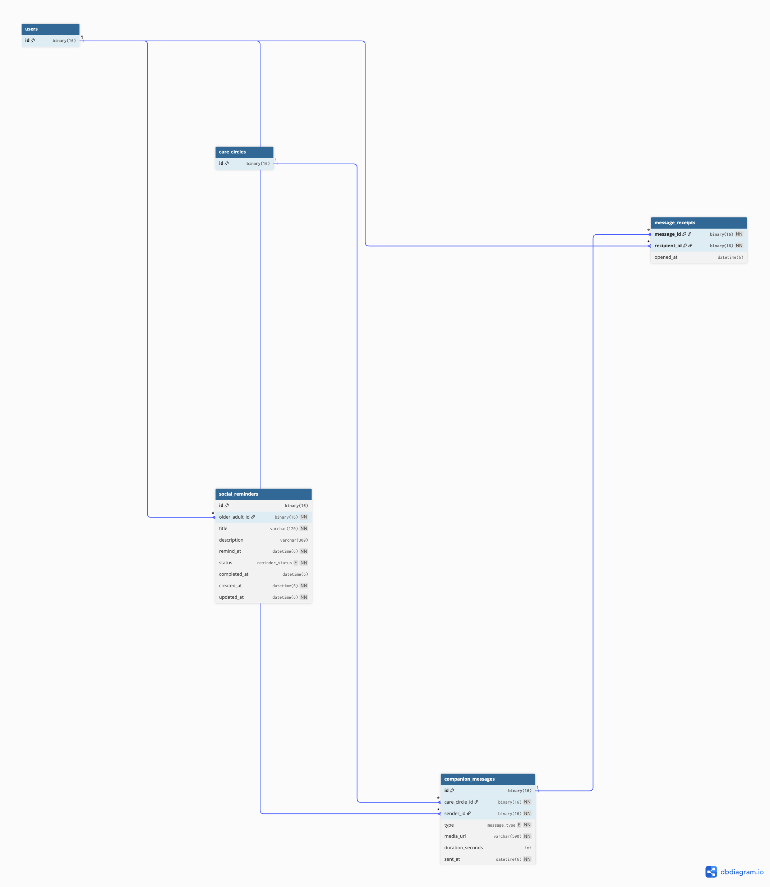
  <br/><i>Imagen 52. Database Design Diagram del Bounded Context Social Companionship.</i>

</div>

<br>

### 2.6.6. Bounded Context: Alerts & Safety

El bounded context Alerts and Safety garantiza que los familiares a distancia se enteren cuando la situación del adulto mayor requiere su intervención. Gestiona dos tipos de alerta: la de emergencia, que el adulto mayor activa con el botón de auxilio, y la de inactividad, que se genera cuando no responde su check-in dentro del plazo. Para ambas registra quién la reconoce y quién la resuelve, de modo que todos los familiares sepan si alguien ya está actuando. Es un contexto core: concentra la función de seguridad de Serenia, de la que depende la confianza de las familias en el producto.

Su modelo se organiza en dos aggregates: `EmergencyAlert` e `InactivityAlert`. Ambos se persisten en la misma tabla, diferenciados por su tipo, y comparten el ciclo de reconocimiento y resolución por parte de los familiares. Se modelan por separado porque sus ciclos de vida difieren: la emergencia se despacha a los familiares y confirma su entrega al adulto mayor, mientras que la inactividad se origina en un check-in no respondido y queda disponible directamente en la vista de alertas.

El contexto reacciona al evento `CheckInMissed` de Daily Check-in para evaluar la inactividad y consulta a Care Circle los familiares activos del adulto mayor, tanto para despachar las emergencias como para verificar que solo los familiares vinculados consulten y atiendan las alertas. Las notificaciones se registran dentro de la aplicación y se muestran en el apartado de alertas de cada familiar.

#### 2.6.6.1. Domain Layer

En esta capa se representan las reglas de generación, despacho y atención de alertas, sin dependencia de frameworks de persistencia, red ni interfaz.

**Sub-capa Model: Aggregates**

`EmergencyAlert` (Aggregate Root): representa una solicitud de ayuda inmediata del adulto mayor. Controla su despacho a los familiares vinculados, la confirmación de entrega y su atención.

| Atributo | Tipo | Visibilidad | Descripción |
| --- | --- | --- | --- |
| id | AlertId | private | Identificador único de la alerta. |
| olderAdultId | OlderAdultId | private | Adulto mayor que activó el botón de auxilio. |
| status | AlertStatus | private | Estado de la alerta. |
| triggeredAt | Instant | private | Instante de la activación, en UTC. |
| resolvedAt | Instant | private | Instante de la resolución; es nulo mientras la alerta no se haya resuelto. |
| notifications | List\<AlertNotification\> | private | Notificaciones registradas para cada familiar vinculado al momento del despacho. |
| attentions | List\<AlertAttention\> | private | Reconocimiento y resolución registrados por los familiares. |

| Método | Visibilidad | Descripción |
| --- | --- | --- |
| trigger(olderAdultId, triggeredAt) | public (static) | Factory que registra la activación del botón de auxilio y el evento `EmergencyAlertRaised`. |
| dispatch(relativeIds, dispatchedAt) | public | Registra una notificación para cada familiar vinculado y registra el evento `EmergencyAlertDispatched`. Si no hay familiares vinculados, marca el despacho como fallido y registra el evento `EmergencyAlertDispatchFailed`. |
| confirmDelivery(confirmedAt) | public | Marca las notificaciones como entregadas, de modo que la alerta queda visible para cada familiar, y registra el evento `EmergencyAlertDeliveryConfirmed`. Solo procede si la alerta fue despachada. |
| acknowledge(relativeId, acknowledgedAt) | public | Registra que un familiar está atendiendo la emergencia y el evento `EmergencyAlertAcknowledged`. Solo procede si la alerta fue despachada y aún no ha sido reconocida. |
| resolve(relativeId, resolutionNote, resolvedAt) | public | Marca como resuelta una emergencia previamente reconocida, guarda la nota de resolución y registra el evento `EmergencyAlertResolved`. |
| isDeliveryConfirmed() | public | Indica si la entrega fue confirmada; con ello se informa al adulto mayor que su familia fue notificada. |
| isOpen() | public | Indica si la alerta aún no ha sido resuelta. |

`InactivityAlert` (Aggregate Root): representa la falta de respuesta del adulto mayor a su check-in dentro del plazo. Se asocia al check-in que la originó y controla su atención.

| Atributo | Tipo | Visibilidad | Descripción |
| --- | --- | --- | --- |
| id | AlertId | private | Identificador único de la alerta. |
| olderAdultId | OlderAdultId | private | Adulto mayor que no respondió su check-in. |
| checkInId | CheckInId | private | Check-in no respondido que originó la alerta; cada check-in genera a lo sumo una alerta. |
| status | AlertStatus | private | Estado de la alerta. |
| triggeredAt | Instant | private | Instante en que se generó la alerta, en UTC. |
| resolvedAt | Instant | private | Instante de la resolución; es nulo mientras la alerta no se haya resuelto. |
| attentions | List\<AlertAttention\> | private | Reconocimiento y resolución registrados por los familiares. |

| Método | Visibilidad | Descripción |
| --- | --- | --- |
| evaluate(alreadyRaisedForCheckIn, activeRelativeCount) | public (static) | Determina si un check-in no respondido constituye inactividad que debe alertarse: el check-in no debe tener una alerta previa y el adulto mayor debe tener al menos un familiar vinculado a quien informar. |
| raise(olderAdultId, checkInId, raisedAt) | public (static) | Factory que genera la alerta de inactividad y registra el evento `InactivityAlertRaised`. |
| acknowledge(relativeId, acknowledgedAt) | public | Registra que un familiar está atendiendo la alerta y el evento `InactivityAlertAcknowledged`. Solo procede si la alerta aún no ha sido reconocida. |
| resolve(relativeId, resolutionNote, resolvedAt) | public | Marca como resuelta una alerta previamente reconocida, guarda la nota de resolución y registra el evento `InactivityAlertResolved`. |
| isOpen() | public | Indica si la alerta aún no ha sido resuelta. |

**Sub-capa Model: Entities**

`AlertNotification`: representa el aviso de una alerta de emergencia dirigido a un familiar vinculado. Pertenece al aggregate `EmergencyAlert`.

| Atributo | Tipo | Visibilidad | Descripción |
| --- | --- | --- | --- |
| id | AlertNotificationId | private | Identificador único de la notificación. |
| relativeId | RelativeId | private | Familiar al que se dirige la notificación; existe una por familiar y alerta. |
| status | DeliveryStatus | private | Estado de la notificación: enviada o entregada. |
| sentAt | Instant | private | Instante del registro de la notificación, en UTC. |
| deliveredAt | Instant | private | Instante en que la notificación quedó disponible para el familiar; es nulo mientras no se confirme. |

| Método | Visibilidad | Descripción |
| --- | --- | --- |
| markAsDelivered(deliveredAt) | public | Marca la notificación como entregada. |

`AlertAttention`: representa una acción de un familiar sobre una alerta, ya sea su reconocimiento o su resolución. Pertenece a los aggregates `EmergencyAlert` e `InactivityAlert`.

| Atributo | Tipo | Visibilidad | Descripción |
| --- | --- | --- | --- |
| id | AlertAttentionId | private | Identificador único de la acción. |
| relativeId | RelativeId | private | Familiar que realizó la acción. |
| action | AttentionAction | private | Acción realizada; cada alerta admite un único reconocimiento y una única resolución. |
| actedAt | Instant | private | Instante de la acción, en UTC. |
| resolutionNote | ResolutionNote | private | Nota que describe cómo se resolvió la alerta, opcional y solo para la resolución. |

**Sub-capa Model: Value Objects**

Se implementan como records inmutables que validan su contenido al construirse. Los límites de longitud coinciden con las columnas de la base de datos.

| Nombre | Atributos | Descripción |
| --- | --- | --- |
| AlertId, AlertNotificationId, AlertAttentionId | value: UUID | Identidades inmutables de los aggregates y entities del contexto. |
| OlderAdultId | value: UUID | Referencia por identidad a una cuenta de adulto mayor de Identity & Access. |
| RelativeId | value: UUID | Referencia por identidad a una cuenta de familiar a distancia de Identity & Access. |
| CheckInId | value: UUID | Referencia por identidad a un check-in de Daily Check-in. |
| ResolutionNote | value: String | Nota de resolución, de máximo 300 caracteres. |

**Sub-capa Model: Enumerations**

| Nombre | Valores | Descripción |
| --- | --- | --- |
| AlertType | EMERGENCY, INACTIVITY | Tipo de alerta; distingue ambos aggregates en la persistencia. |
| AlertStatus | RAISED, DISPATCHED, DISPATCH_FAILED, ACKNOWLEDGED, RESOLVED | Estado de la alerta. Una emergencia pasa por RAISED, DISPATCHED o DISPATCH_FAILED, ACKNOWLEDGED y RESOLVED; una inactividad, por RAISED, ACKNOWLEDGED y RESOLVED. |
| DeliveryStatus | SENT, DELIVERED | Estado de una notificación de emergencia. |
| AttentionAction | ACKNOWLEDGED, RESOLVED | Acción de un familiar sobre una alerta. |

**Sub-capa Model: Commands**

| Nombre | Atributos | Descripción |
| --- | --- | --- |
| EvaluateInactivityCommand | olderAdultId, checkInId, checkDate | Intención de evaluar si un check-in no respondido debe generar una alerta. |
| RaiseInactivityAlertCommand | olderAdultId, checkInId | Intención de generar una alerta de inactividad. |
| TriggerEmergencyAlertCommand | olderAdultId | Intención del adulto mayor de solicitar ayuda inmediata. |
| DispatchEmergencyAlertCommand | alertId | Intención de notificar una emergencia a los familiares vinculados. |
| ConfirmEmergencyAlertDeliveryCommand | alertId | Intención de confirmar que la emergencia quedó disponible para los familiares. |
| AcknowledgeEmergencyAlertCommand | alertId, relativeId | Intención de un familiar de indicar que está atendiendo una emergencia. |
| AcknowledgeInactivityAlertCommand | alertId, relativeId | Intención de un familiar de indicar que está atendiendo una alerta de inactividad. |
| ResolveEmergencyAlertCommand | alertId, relativeId, resolutionNote | Intención de un familiar de marcar una emergencia como resuelta. |
| ResolveInactivityAlertCommand | alertId, relativeId, resolutionNote | Intención de un familiar de marcar una alerta de inactividad como resuelta. |

**Sub-capa Model: Queries**

| Nombre | Atributos | Descripción |
| --- | --- | --- |
| GetAlertsByOlderAdultIdQuery | olderAdultId, requesterId | Consulta del historial de alertas de un adulto mayor, de ambos tipos, ordenadas de la más reciente a la más antigua. |
| GetAlertByIdQuery | alertId, requesterId | Consulta del detalle de una alerta. |

**Sub-capa Model: Events**

| Nombre | Atributos | Descripción |
| --- | --- | --- |
| InactivityDetected | olderAdultId, checkInId, checkDate, occurredAt | Un check-in no respondido constituye inactividad que debe alertarse. |
| InactivityAlertRaised | alertId, olderAdultId, checkInId, occurredAt | Se generó una alerta de inactividad. |
| EmergencyAlertRaised | alertId, olderAdultId, occurredAt | El adulto mayor activó el botón de auxilio. |
| EmergencyAlertDispatched | alertId, olderAdultId, relativeIds, occurredAt | La emergencia se notificó a todos los familiares vinculados. |
| EmergencyAlertDispatchFailed | alertId, olderAdultId, occurredAt | La emergencia no pudo notificarse porque el adulto mayor no tiene familiares vinculados. |
| EmergencyAlertDeliveryConfirmed | alertId, olderAdultId, occurredAt | La emergencia quedó disponible para los familiares y se confirmó al adulto mayor. |
| EmergencyAlertAcknowledged | alertId, relativeId, occurredAt | Un familiar indicó que está atendiendo la emergencia. |
| InactivityAlertAcknowledged | alertId, relativeId, occurredAt | Un familiar indicó que está atendiendo la alerta de inactividad. |
| EmergencyAlertResolved | alertId, relativeId, occurredAt | Un familiar marcó la emergencia como resuelta. |
| InactivityAlertResolved | alertId, relativeId, occurredAt | Un familiar marcó la alerta de inactividad como resuelta. |

**Sub-capa Repositories**

| Tipo | Nombre | Métodos principales | Descripción |
| --- | --- | --- | --- |
| Interface | EmergencyAlertRepository | save(alert), findById(alertId), findAllByOlderAdultId(olderAdultId) | Contrato de persistencia del aggregate `EmergencyAlert` junto con sus notificaciones y acciones de atención. Se implementa en Infrastructure. |
| Interface | InactivityAlertRepository | save(alert), findById(alertId), existsByCheckInId(checkInId), findAllByOlderAdultId(olderAdultId) | Contrato de persistencia del aggregate `InactivityAlert` junto con sus acciones de atención. Se implementa en Infrastructure. |

**Sub-capa Services**

| Tipo | Nombre | Métodos principales | Descripción |
| --- | --- | --- | --- |
| Interface | EmergencyAlertCommandService | handle(TriggerEmergencyAlertCommand), handle(DispatchEmergencyAlertCommand), handle(ConfirmEmergencyAlertDeliveryCommand), handle(AcknowledgeEmergencyAlertCommand), handle(ResolveEmergencyAlertCommand) | Contrato de las operaciones de escritura sobre las alertas de emergencia. |
| Interface | InactivityAlertCommandService | handle(EvaluateInactivityCommand), handle(RaiseInactivityAlertCommand), handle(AcknowledgeInactivityAlertCommand), handle(ResolveInactivityAlertCommand) | Contrato de las operaciones de escritura sobre las alertas de inactividad. |
| Interface | AlertQueryService | handle(GetAlertsByOlderAdultIdQuery), handle(GetAlertByIdQuery) | Contrato de la lectura de alertas de ambos tipos. |

#### 2.6.6.2. Interface Layer

Clases que exponen el bounded context hacia el exterior y traducen las peticiones entrantes al lenguaje del dominio.

**Sub-capa REST: Controllers**

| Nombre | Endpoints | Descripción |
| --- | --- | --- |
| EmergencyAlertsController | POST /api/v1/emergency-alerts, POST /api/v1/emergency-alerts/{alertId}/acknowledge, POST /api/v1/emergency-alerts/{alertId}/resolve | Punto de entrada de la activación del botón de auxilio, reservada al propio adulto mayor, y de la atención de emergencias por parte de los familiares. La activación responde 201 Created con el estado final de la alerta, que indica si la familia fue notificada o si el despacho falló. |
| InactivityAlertsController | POST /api/v1/inactivity-alerts/{alertId}/acknowledge, POST /api/v1/inactivity-alerts/{alertId}/resolve | Punto de entrada de la atención de alertas de inactividad por parte de los familiares. |
| AlertsController | GET /api/v1/alerts?olderAdultId={olderAdultId}, GET /api/v1/alerts/{alertId} | Punto de entrada de la vista de alertas, con su tipo y estado, para el adulto mayor y sus familiares vinculados. |

El reconocimiento y la resolución responden 409 Conflict cuando la alerta no admite la acción en su estado actual, por ejemplo si ya fue reconocida o si se intenta resolver sin un reconocimiento previo. Las operaciones responden 403 Forbidden cuando el usuario autenticado no es el adulto mayor ni un familiar con vínculo activo.

**Sub-capa REST: Resources**

| Nombre | Atributos | Descripción |
| --- | --- | --- |
| AlertResource | id, olderAdultId, type, status, checkInId, triggeredAt, deliveryConfirmed, acknowledgedBy, acknowledgedAt, resolvedBy, resolvedAt, resolutionNote | Representación de una alerta de cualquier tipo, con su estado de atención. |
| ResolveAlertResource | resolutionNote | Datos de entrada para resolver una alerta. |

**Sub-capa REST: Transform**

| Nombre | Descripción |
| --- | --- |
| AlertResourceFromEntityAssembler | Convierte los aggregates `EmergencyAlert` e `InactivityAlert` en su representación REST común. |
| ResolveEmergencyAlertCommandFromResourceAssembler | Combina la petición con la alerta y el familiar autenticado para construir el comando de resolución de emergencia. |
| ResolveInactivityAlertCommandFromResourceAssembler | Combina la petición con la alerta y el familiar autenticado para construir el comando de resolución de inactividad. |

#### 2.6.6.3. Application Layer

Clases que orquestan los flujos del contexto, coordinando los aggregates, los repositorios y los servicios de otros contextos.

**Sub-capa Internal: CommandServices (Command Handlers)**

| Nombre | Responsabilidad principal | Relación con otros elementos |
| --- | --- | --- |
| EmergencyAlertCommandServiceImpl | Registra la emergencia verificando que la solicite el propio adulto mayor. En el despacho obtiene los familiares con vínculo activo e invoca al aggregate; en la confirmación marca la entrega. En el reconocimiento y la resolución verifica que el familiar tenga un vínculo activo con el adulto mayor. Tras persistir, publica los eventos acumulados. | Implementa `EmergencyAlertCommandService`; usa `EmergencyAlertRepository`, `ExternalCareCircleService` y `DomainEventPublisher`. |
| InactivityAlertCommandServiceImpl | Evalúa la inactividad consultando si el check-in ya tiene una alerta y cuántos familiares vinculados tiene el adulto mayor; cuando corresponde, publica el evento `InactivityDetected`. Genera la alerta y gestiona su reconocimiento y resolución, verificando que el familiar tenga un vínculo activo. Tras persistir, publica los eventos acumulados. | Implementa `InactivityAlertCommandService`; usa `InactivityAlertRepository`, `ExternalCareCircleService` y `DomainEventPublisher`. |

**Sub-capa Internal: QueryServices**

| Nombre | Responsabilidad principal | Relación con otros elementos |
| --- | --- | --- |
| AlertQueryServiceImpl | Resuelve el historial y el detalle de alertas, combinando ambos tipos ordenados por fecha, previa verificación de que el solicitante sea el adulto mayor o un familiar con vínculo activo. | Implementa `AlertQueryService`; usa `EmergencyAlertRepository`, `InactivityAlertRepository` y `ExternalCareCircleService`. |

**Sub-capa Internal: Event Handlers**

| Nombre | Responsabilidad principal | Relación con otros elementos |
| --- | --- | --- |
| CheckInMissedEventHandler | Inicia la evaluación de inactividad cuando un check-in vence sin respuesta. Se ejecuta en una transacción propia, después de confirmarse el cierre del check-in, de modo que una falla en este contexto no afecte a Daily Check-in. | Escucha `CheckInMissed` de Daily Check-in; envía `EvaluateInactivityCommand`. |
| InactivityDetectedEventHandler | Genera la alerta de inactividad en la misma transacción de la evaluación. | Escucha `InactivityDetected`; envía `RaiseInactivityAlertCommand`. |
| EmergencyAlertRaisedEventHandler | Despacha la emergencia a los familiares. Se ejecuta en el mismo hilo, pero en una transacción propia posterior al registro de la alerta, de modo que la emergencia queda registrada aunque el despacho falle y la respuesta al adulto mayor ya refleja el resultado. | Escucha `EmergencyAlertRaised`; envía `DispatchEmergencyAlertCommand`. |
| EmergencyAlertDispatchedEventHandler | Confirma la entrega de la emergencia en la misma transacción del despacho. | Escucha `EmergencyAlertDispatched`; envía `ConfirmEmergencyAlertDeliveryCommand`. |

**Sub-capa Internal: Outbound Services**

| Tipo | Nombre | Métodos principales | Descripción |
| --- | --- | --- | --- |
| Class | ExternalCareCircleService | fetchActiveRelativeIds(olderAdultId), isActiveRelativeOf(relativeId, olderAdultId) | Consume `CareCircleContextFacade` para obtener los familiares vinculados y verificar vínculos. |

#### 2.6.6.4. Infrastructure Layer

Clases que resuelven el acceso a la base de datos MySQL, implementando las abstracciones definidas en la capa Domain.

**Sub-capa Persistence: JPA Entities**

| Nombre | Responsabilidad principal | Relación con otros elementos |
| --- | --- | --- |
| AlertPersistenceEntity | Representa una fila de la tabla `alerts`, cuyo tipo determina si corresponde a una emergencia o a una inactividad. Contiene las colecciones de notificaciones y acciones de atención, que se persisten en cascada junto con la alerta. | Usada por `AlertJpaRepository` y por los mappers del contexto. |
| AlertNotificationPersistenceEntity | Representa una fila de la tabla `alert_notifications`. | Contenida en `AlertPersistenceEntity`. |
| AlertAttentionPersistenceEntity | Representa una fila de la tabla `alert_attentions`. | Contenida en `AlertPersistenceEntity`. |

**Sub-capa Persistence: JPA Repositories**

| Nombre | Responsabilidad principal | Relación con otros elementos |
| --- | --- | --- |
| AlertJpaRepository | Interfaz de Spring Data JPA con las consultas por identificador y tipo, por adulto mayor y tipo ordenadas por fecha, resueltas sobre el índice `(older_adult_id, triggered_at)`, y la verificación por check-in, resuelta sobre el índice único de `check_in_id`. | Extiende `JpaRepository`; usada por `EmergencyAlertRepositoryImpl` e `InactivityAlertRepositoryImpl`. |

**Sub-capa Persistence: Repositories**

| Nombre | Responsabilidad principal | Relación con otros elementos |
| --- | --- | --- |
| EmergencyAlertRepositoryImpl | Persiste y recupera el aggregate `EmergencyAlert` sobre las filas de tipo EMERGENCY. Si dos familiares reconocen la misma alerta de forma simultánea, traduce la violación del índice único `(alert_id, action)` en una excepción de dominio. | Implementa `EmergencyAlertRepository`; usa `AlertJpaRepository` y `EmergencyAlertPersistenceMapper`. |
| InactivityAlertRepositoryImpl | Persiste y recupera el aggregate `InactivityAlert` sobre las filas de tipo INACTIVITY. Si un mismo check-in se evalúa dos veces, el índice único de `check_in_id` impide duplicar la alerta. | Implementa `InactivityAlertRepository`; usa `AlertJpaRepository` y `InactivityAlertPersistenceMapper`. |

**Sub-capa Persistence: Mappers**

| Nombre | Responsabilidad principal | Relación con otros elementos |
| --- | --- | --- |
| EmergencyAlertPersistenceMapper | Traduce entre el aggregate `EmergencyAlert`, con sus notificaciones y acciones de atención, y sus entidades de persistencia. | Usado por `EmergencyAlertRepositoryImpl`. |
| InactivityAlertPersistenceMapper | Traduce entre el aggregate `InactivityAlert`, con sus acciones de atención, y sus entidades de persistencia. | Usado por `InactivityAlertRepositoryImpl`. |
| AlertAttentionPersistenceMapper | Traduce las acciones de atención entre el aggregate y `AlertAttentionPersistenceEntity`, común a ambos tipos de alerta. Solo agrega las acciones que la fila aún no tiene y nunca modifica ni elimina las existentes, de modo que la acción simultánea de otro familiar choca con el índice único en lugar de perderse. | Usado por `EmergencyAlertPersistenceMapper` e `InactivityAlertPersistenceMapper`. |

#### 2.6.6.5. Bounded Context Software Architecture Component Level Diagrams

En esta sección se presenta el Component Diagram de C4 Model correspondiente al bounded context Alerts and Safety, elaborado con la herramienta Structurizr (Imagen 53). El diagrama muestra la descomposición interna del bounded context en sus componentes, agrupados según su rol dentro de la arquitectura: los *Controllers* `EmergencyAlertsController`, `InactivityAlertsController` y `AlertsController` como puntos de entrada de las peticiones REST; los *Resources* `AlertResource` y `ResolveAlertResource`, que estructuran los datos expuestos por la API; los *Assemblers*, que transforman entre resources, commands y los aggregates `EmergencyAlert` e `InactivityAlert`; los servicios de aplicación `EmergencyAlertCommandServiceImpl` e `InactivityAlertCommandServiceImpl`, que atienden las operaciones de escritura, y `AlertQueryServiceImpl`, que atiende la lectura del historial y del detalle de las alertas; y los repositorios `EmergencyAlertRepositoryImpl` e `InactivityAlertRepositoryImpl`, que se apoyan en `AlertJpaRepository` y en los *Persistence Mappers* para persistir ambos aggregates en MySQL. Se incluyen además cuatro *Event Handlers* que encadenan el flujo de las alertas: `CheckInMissedEventHandler`, que escucha el evento `CheckInMissed` publicado por Daily Check-in para iniciar la evaluación de inactividad; `InactivityDetectedEventHandler`, que genera la alerta de inactividad; `EmergencyAlertRaisedEventHandler`, que despacha la emergencia a los familiares; y `EmergencyAlertDispatchedEventHandler`, que confirma su entrega. Finalmente, `ExternalCareCircleService` actúa como capa anticorrupción: consulta a Care Circle, a través de `CareCircleContextFacade`, los familiares con vínculo activo, sin que Alerts and Safety dependa del modelo interno de ese contexto.

<br>

<div align="center">

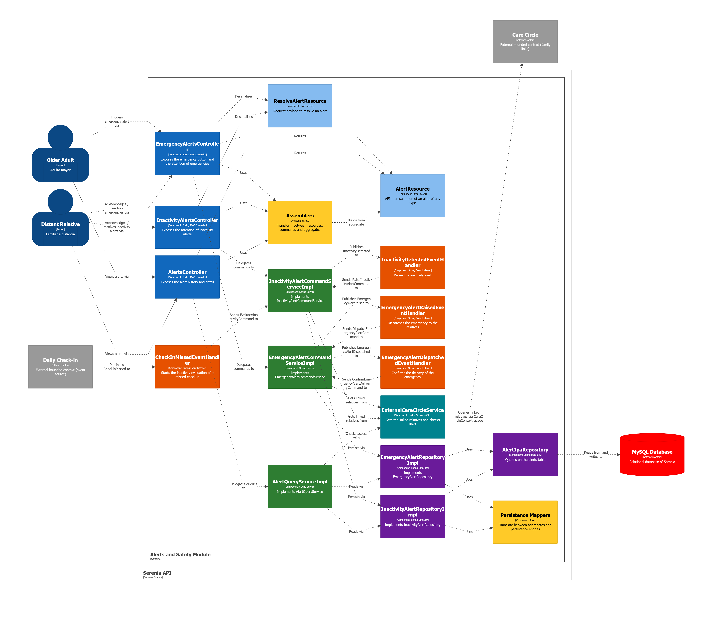
  <br/><i>Imagen 53. Component Diagram del Bounded Context Alerts and Safety.</i>

</div>

<br>

#### 2.6.6.6. Bounded Context Software Architecture Code Level Diagrams

<br>

##### 2.6.6.6.1. Bounded Context Domain Layer Class Diagrams

Diagrama de clases de la capa Domain: en la Imagen 54 se muestran las clases del dominio Alerts and Safety. Los aggregate roots son `EmergencyAlert` e `InactivityAlert`, que comparten la clase base `Alert`. Ambos registran la atención de los familiares mediante la entity `AlertAttention`, y `EmergencyAlert` contiene además la entity `AlertNotification`, que representa el aviso dirigido a cada familiar vinculado. Las enumeraciones `AlertType`, `AlertStatus`, `DeliveryStatus` y `AttentionAction` expresan el tipo y el estado de cada alerta. También se muestran las interfaces de dominio: `EmergencyAlertRepository` e `InactivityAlertRepository` para la persistencia, `EmergencyAlertCommandService` e `InactivityAlertCommandService` para las operaciones de escritura, con los Commands que reciben, y `AlertQueryService` para la lectura del historial y del detalle de las alertas de ambos tipos.

<br>
<div align="center">

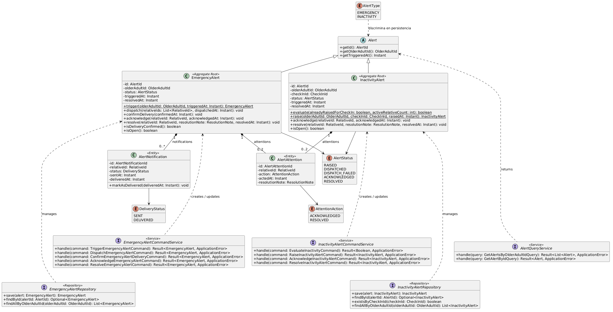
  <br/><i>Imagen 54. Domain Layer Class Diagram del Bounded Context Alerts and Safety.</i>

</div>

<br>

##### 2.6.6.6.2. Bounded Context Database Design Diagram

El diagrama de base de datos (Imagen 55) presenta las tablas que permiten la persistencia del bounded context **Alerts and Safety** sobre el motor MySQL 8, a partir del esquema consolidado por el equipo. Los identificadores son UUID almacenados como `BINARY(16)` y las fechas se guardan en UTC con `DATETIME(6)`. El contexto se materializa en tres tablas: `alerts`, que guarda las alertas de ambos aggregates (`EmergencyAlert` e `InactivityAlert`) diferenciadas por la columna `type`; `alert_notifications`, que registra el aviso de una emergencia a cada familiar vinculado; y `alert_attentions`, que registra el reconocimiento y la resolución que realizan los familiares. Las claves foráneas hacia `users` (Identity & Access) y `check_ins` (Daily Check-in) apuntan a tablas de otros bounded contexts.

**Tabla alerts**

| Columna | Tipo | Constraints | Descripción |
|---|---|---|---|
| id | binary(16) | PK | Identificador único de la alerta. |
| older_adult_id | binary(16) | NOT NULL, FK → users.id | Adulto mayor al que corresponde la alerta. |
| type | alert_type | NOT NULL | Tipo de alerta: EMERGENCY o INACTIVITY. |
| status | alert_status | NOT NULL, DEFAULT 'RAISED' | Estado de la alerta: RAISED, DISPATCHED, DISPATCH_FAILED, ACKNOWLEDGED o RESOLVED. |
| check_in_id | binary(16) | UNIQUE, FK → check_ins.id | Check-in no respondido que originó la alerta. Solo se completa en las alertas de tipo INACTIVITY. |
| triggered_at | datetime(6) | NOT NULL | Instante en que se generó la alerta, en UTC. |
| resolved_at | datetime(6) | - | Instante de la resolución. Nulo mientras la alerta no se haya resuelto. |

Esta tabla almacena las alertas de emergencia y de inactividad en una misma estructura, ya que ambas comparten el ciclo de reconocimiento y resolución por parte de los familiares. El índice único sobre `check_in_id` garantiza que un check-in genere a lo sumo una alerta. Incluye un índice sobre `(older_adult_id, triggered_at)` para consultar el historial de alertas de un adulto mayor ordenado por fecha.

**Tabla alert_notifications**

| Columna | Tipo | Constraints | Descripción |
|---|---|---|---|
| id | binary(16) | PK | Identificador único de la notificación. |
| alert_id | binary(16) | NOT NULL, FK → alerts.id | Alerta de emergencia a la que pertenece la notificación. |
| relative_id | binary(16) | NOT NULL, FK → users.id | Familiar al que se dirige la notificación. |
| status | delivery_status | NOT NULL | Estado de la notificación: SENT o DELIVERED. |
| sent_at | datetime(6) | NOT NULL | Instante del envío de la notificación, en UTC. |
| delivered_at | datetime(6) | - | Instante en que la notificación quedó disponible para el familiar. Nulo mientras no se confirme. |

Esta tabla registra el despacho de una emergencia a cada familiar con vínculo activo. Un índice único sobre `(alert_id, relative_id)` asegura que exista una sola notificación por familiar y alerta.

**Tabla alert_attentions**

| Columna | Tipo | Constraints | Descripción |
|---|---|---|---|
| id | binary(16) | PK | Identificador único de la acción de atención. |
| alert_id | binary(16) | NOT NULL, FK → alerts.id | Alerta sobre la que actúa el familiar. |
| relative_id | binary(16) | NOT NULL, FK → users.id | Familiar que realizó la acción. |
| action | attention_action | NOT NULL | Acción realizada: ACKNOWLEDGED o RESOLVED. |
| acted_at | datetime(6) | NOT NULL | Instante de la acción, en UTC. |
| resolution_note | varchar(300) | - | Nota que describe cómo se resolvió la alerta. Opcional y solo para la resolución. |

Esta tabla deja constancia de qué familiar reconoció una alerta y cuál la resolvió, de modo que todos los familiares sepan si alguien ya está actuando. Un índice único sobre `(alert_id, action)` permite un único reconocimiento y una única resolución por alerta, por lo que si dos familiares reconocen la misma alerta a la vez, el segundo intento se rechaza.

**Enumeraciones**

| Nombre | Valores | Descripción |
|---|---|---|
| alert_type | EMERGENCY, INACTIVITY | Tipo de alerta; distingue ambos aggregates en la tabla `alerts`. |
| alert_status | RAISED, DISPATCHED, DISPATCH_FAILED, ACKNOWLEDGED, RESOLVED | Estado de la alerta a lo largo de su ciclo de vida. |
| delivery_status | SENT, DELIVERED | Estado de entrega de una notificación de emergencia. |
| attention_action | ACKNOWLEDGED, RESOLVED | Acción de un familiar sobre una alerta. |

<br>

<div align="center">

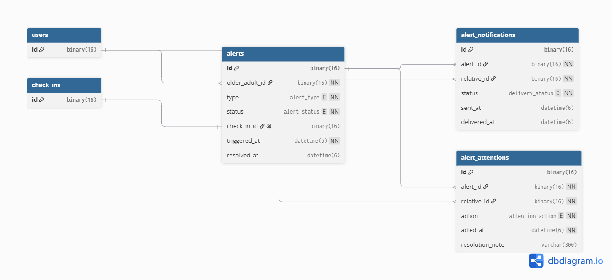
  <br/><i>Imagen 55. Database Design Diagram del Bounded Context Alerts and Safety.</i>

</div>
<br>

<div style="page-break-after: always;"></div>

# Capítulo III: Solution UI/UX Design
## 3.1. Product design

El diseño de producto de Serenia define cómo se ven, se siente y se usan sus tres piezas: la aplicación para adulto mayor, la aplicación para el familiar y la landing page. Aquí se recogen las decisiones que determinan la interacción entre las personas y el sistema: cómo se organiza la información, qué funcionalidades se muestran primero y qué lenguaje visual transmite calma y cercanía.

### 3.1.1. Style Guidelines

Las Style Guidelines son el repositorio visual común del equipo. Reúnen los activos, las fuentes, los colores y las reglas de uso que mantienen coherentes las tres piezas del producto, sin importar quién diseñe o desarrolle en cada interfaz.

#### 3.1.1.1. General Style Guidelines

Serenia cuenta con una guía de estilo visual que define su marca, tipografía, color, espaciado y tono de comunicación. La guía se basa en adaptaciones pensadas para adultos mayores y familiares.

<br>
<div align="center">
  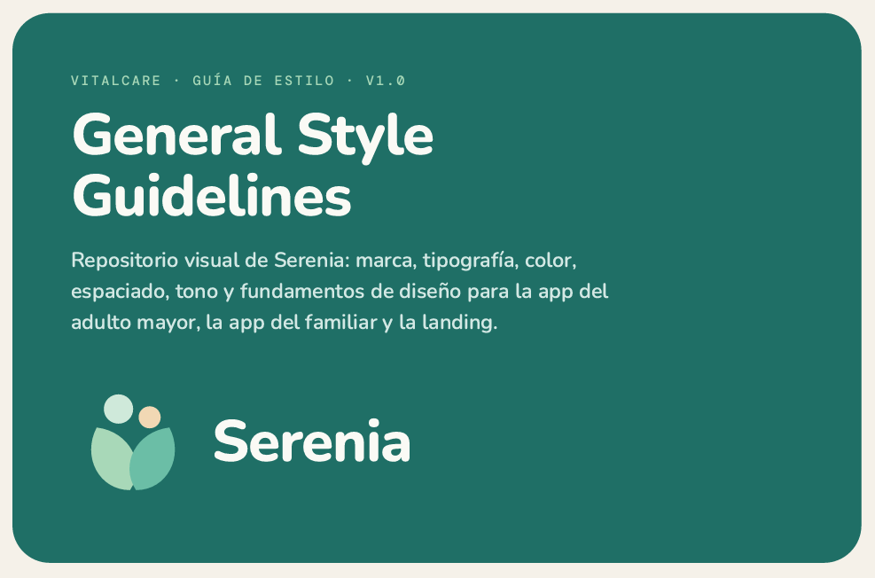
  <br/><i>Imagen X. Portada de la guía "General Style Guidelines".</i>
</div>
<br>

**Branding**

Serenia busca dar a los adultos mayores que viven solos una forma simple de comunicar su día a día, y a sus familias, la tranquilidad de saber cómo están sin recurrir a un monitoreo invasivo. Su personalidad es cálida, serena, cercana, respetuosa, confiable y humana, y se apoya en cuatro valores: cercanía, autonomía, confianza y conexión emocional.

El isotipo aplica la ley de cierre de la Gestalt: las hojas rodean dos circulos de distinto tamaño, que representan al adulto mayor y a su familiar bajo un mismo cuidado. El logo tiene variantes horizontal, vertical con eslogan, sobre fondo oscuro y de ícono de app, para adaptarse a cada soporte.

<br>
<div align="center">
  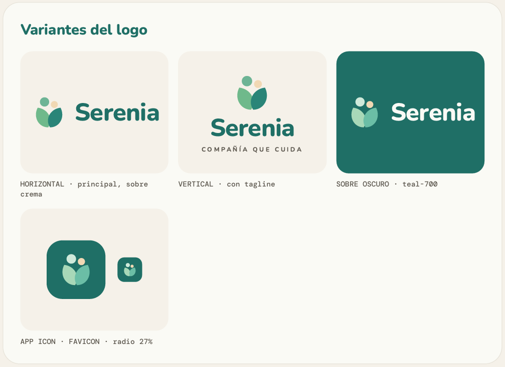
  <br/><i>Imagen X. Variantes del logo de Serenia.</i>
</div>
<br>

<br>
<div align="center">
  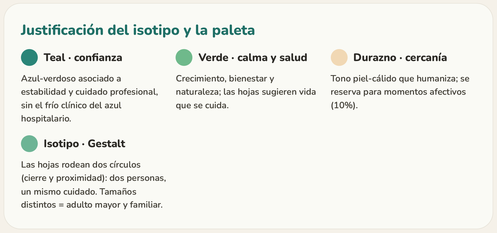
  <br/><i>Imagen X. Justificación del isotipo y la paleta.</i>
</div>
<br>

**Typography**

La fuente principal es Nunito (pesos 400, 600, 700 y 800). Sus terminales redondeadas repiten la suavidad de las hojas del isotipo y ofrece buena legibilidad de números y tildes en español. La fuente secundaria es DM Mono, reservada para etiquetas, marcas de tiempo y tokens. Nunca se usa en texto corrido ni en la app del adulto mayor.
 
Definimos dos escalas dentro de un mismo sistema. La del familiar y la web usa un cuerpo de 16 px. La del adulto mayor usa un cuerpo de 20 sp, con un mínimo de 18 sp y sin textos de apoyo menores a 16 sp. Con esto respondemos a la pérdida de sensibilidad visual propia de la edad. Además, mantenemos alineación a la izquierda, interlineado de 1.4 a 1.5 y un máximo de tres niveles de jerarquía por pantalla.

<br>
<div align="center">
  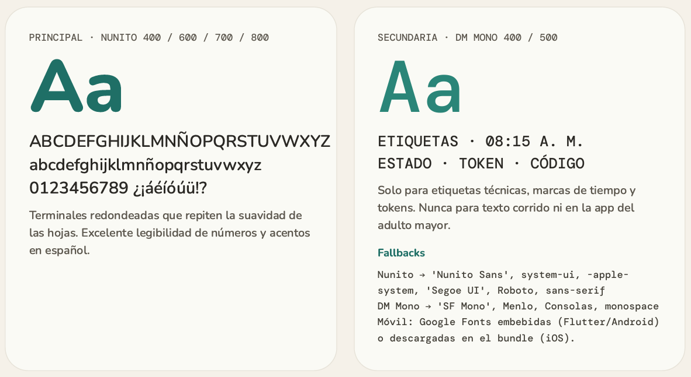
  <br/><i>Imagen X. Familias tipográficas de Serenia.</i>
</div>
<br>

<br>
<div align="center">
  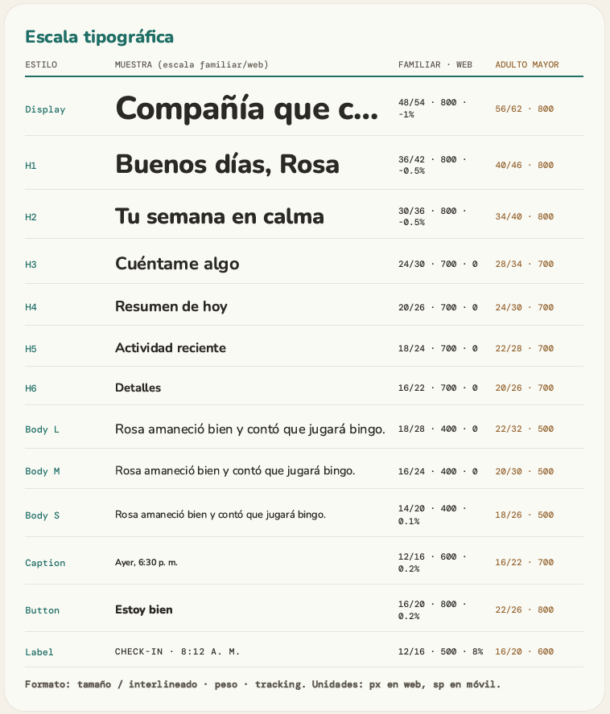
  <br/><i>Imagen X. Escala tipográfica para la app del familiar y la app del adulto mayor.</i>
</div>
<br>

**Colors**

La paleta parte de cuatro familias con escalas tonales de 50 a 900: teal (primario, para botones y títulos), verde hoja (secundario, para estados positivos), durazno (acento, para momentos afectivos) y neutros cálidos (fondos, texto y bordes). Seguimos la proporción 60-30-10: 60 % crema y superficies, 30 % teal y 10 % durazno y verde.
 
Cada color responde a una intención emocional. El teal transmite confianza sin el frío clínico del azul hospitalario, el verde evoca calma y bienestar, y el durazno aporta cercanía. Para los estados definimos cuatro colores semánticos: éxito, alerta (ámbar), auxilio o error (coral) e información. Elegimos ámbar y coral desaturados, y evitamos el rojo puro, para que las alertas llamen la atención sin generar pánico. Además, ningún estado se comunica solo con color: siempre se acompaña de texto o ícono.
 
En accesibilidad, el texto principal (neutro-800 sobre crema) alcanza un contraste de 12.9:1, nivel AAA. Los colores que no cumplen para texto, como verde-500 (2.1:1) y durazno-300 (1.2:1) sobre crema, se limitan a usos decorativos. También definimos un modo de alto contraste (fondo blanco, texto negro, 21:1) que se activa desde Ajustes.

<br>
<div align="center">
  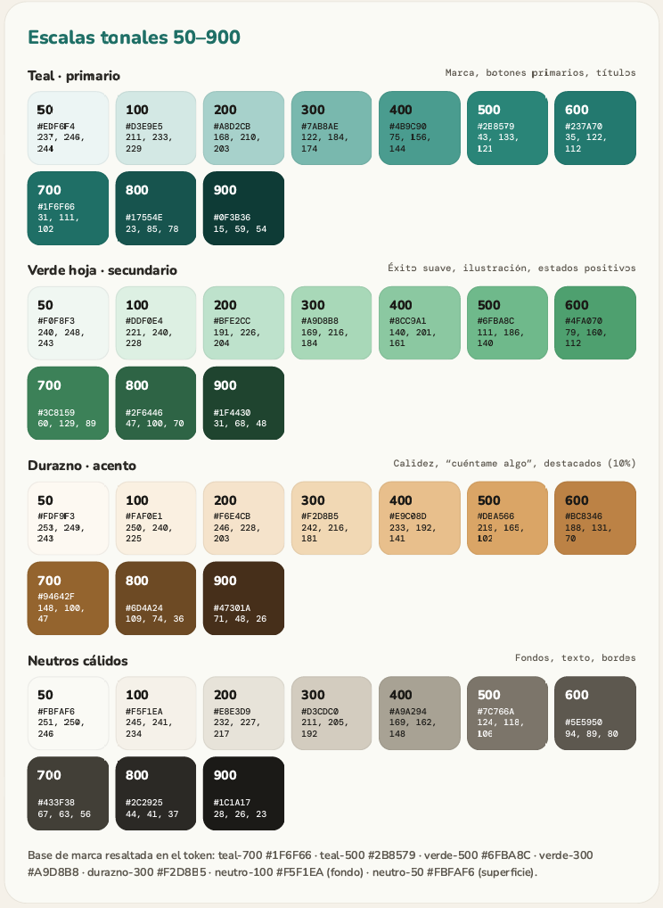
  <br/><i>Imagen X. Escalas tonales de la paleta de Serenia.</i>
</div>
<br>

<br>
<div align="center">
  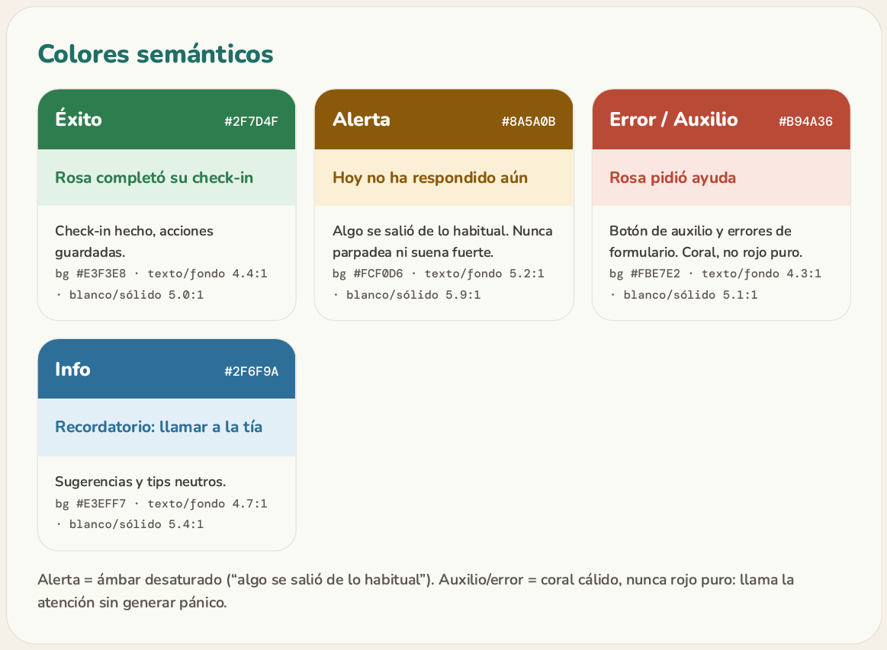
  <br/><i>Imagen X. Colores semánticos.</i>
</div>
<br>

<br>
<div align="center">
  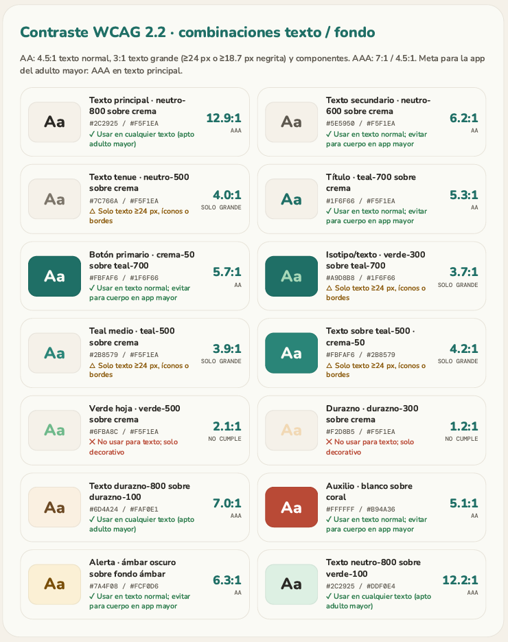
  <br/><i>Imagen X. Combinaciones de contraste según WCAG 2.2.</i>
</div>
<br>

**Spacing y layout**

El espaciado sigue una base de 4 y 8 px, con valores desde 4 px (separación ícono-texto) hasta 64 px (secciones de la landing). Los radios de borde van de 12 a 36 px, y las esquinas muy redondeadas reproducen la suavidad de las hojas.
 
Las áreas táctiles se dimensionaron según la ley de Fitts: 48 dp en la app del familiar, 56 a 64 dp en la del adulto mayor y 72 dp en el botón de auxilio, para reducir errores por temblor o poca precisión motriz. El botón de auxilio siempre está visible y separado del de check-in.

<br>
<div align="center">
  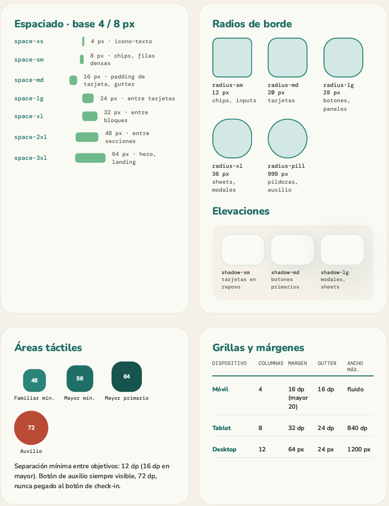
  <br/><i>Imagen X. Espaciado, radios de borde y áreas táctiles.</i>
</div>
<br>

**Tono de comunicación y lenguaje**

Definimos la voz de Serenia con las cuatro dimensiones del tono de voz propuestas por Moran (2016):
 
- **Divertido / Serio:** ligeramente hacia lo divertido, con preguntas como "¿jugaste bingo?", pero con seriedad total en situaciones de emergencia.
- **Formal / Casual:** casual y cercano, como un familiar. Evitamos el lenguaje administrativo.
- **Respetuoso / Irreverente:** siempre respetuoso. El adulto mayor nunca es infantilizado ni tratado como paciente.
- **Entusiasta / Sereno:** sereno, en coherencia con el nombre de la marca. Celebra sin exclamaciones excesivas y alerta sin dramatismo.
Usamos un español peruano cercano, con tuteo afectuoso hacia el adulto mayor y frases cortas en segunda persona. Evitamos términos como "paciente", "monitoreo" o "vigilar", y preferimos "cómo amaneciste", "cuéntame" o "tranquilidad". Por ejemplo, ante una ausencia de respuesta el mensaje al familiar es "Mamá aún no responde hoy. Quizá una llamadita le alegre la mañana", en lugar de "ALERTA: paciente sin actividad por 6 horas".

<br>
<div align="center">
  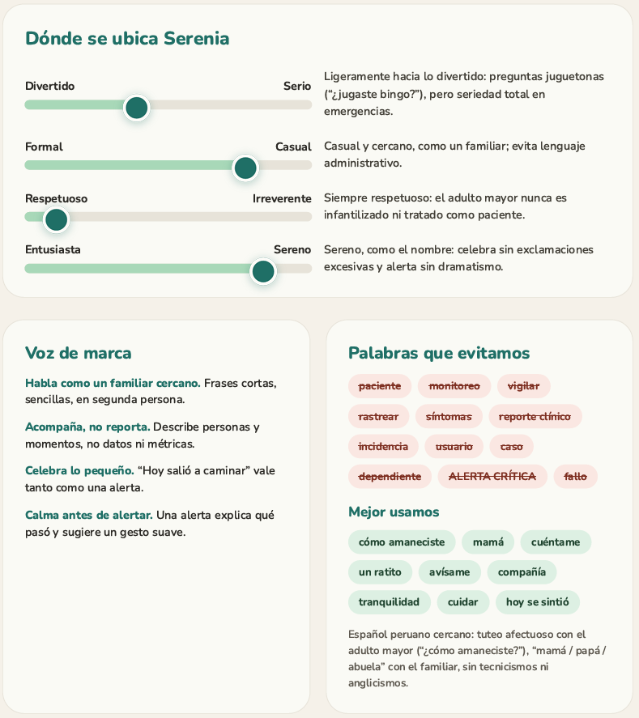
  <br/><i>Imagen X. Posición de Serenia en las dimensiones de tono.</i>
</div>
<br>

<br>
<div align="center">
  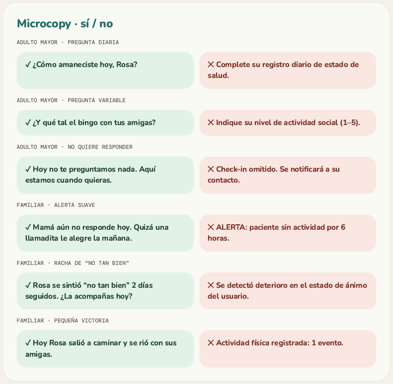
  <br/><i>Imagen X. Ejemplos de microcopy.</i>
</div>
<br>

**Principios de diseño aplicados**

Las decisiones anteriores se sustentan en los siguientes principios:
 
- **Ley de Fitts:** botones grandes para reducir errores de precisión.
- **Ley de Hick:** el check-in ofrece solo tres respuestas de un toque, para disminuir la carga cognitiva.
- **Gestalt:** los botones de respuesta se agrupan y se separan del botón de auxilio, y los elementos del mismo rol comparten radio y tipografía.
- **Heurísticas de Nielsen:** lenguaje cotidiano, reconocimiento antes que recuerdo (botones con texto e ícono) y control del usuario mediante la opción "hoy no me preguntes".

<br>
<div align="center">
  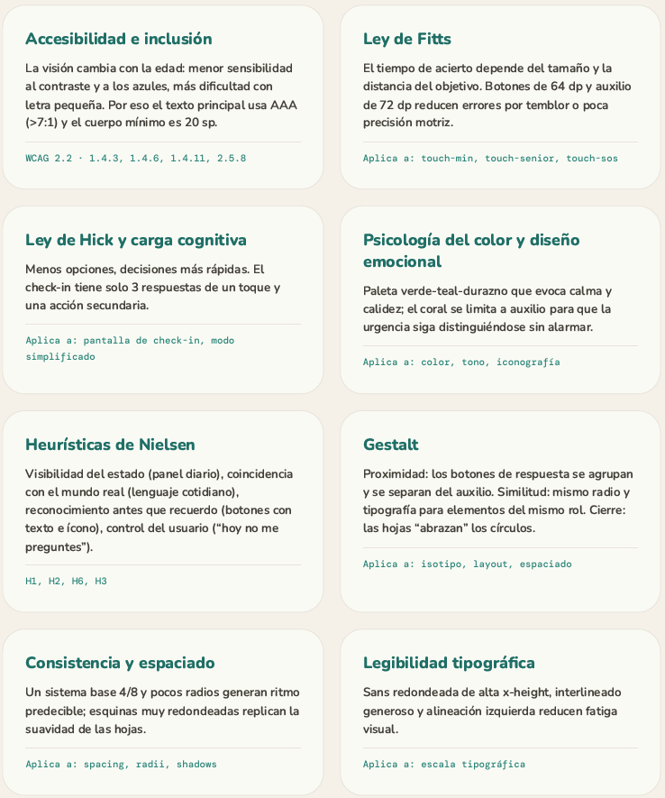
  <br/><i>Imagen X. Referencias adoptadas y adaptaciones realizadas.</i>
</div>
<br>

### 3.1.2. Information Architecture
#### 3.1.2.1. Organization Systems

Un sistema de organización define cómo se agrupa y se ordena la información dentro de un producto para que el usuario encuentre lo que necesita sin esfuerzo. Esta sección responde dos preguntas por cada grupo de información de Serenia: con qué estructura se presenta (jerárquica, secuencial o matricial) y con qué esquema se categoriza su contenido (alfabético, cronológico, por tópicos o según la audiencia). El equipo no aplicó una única regla a todo el producto: eligió, para cada grupo, la combinación más simple posible. El criterio parte de los user personas (sección 2.3.1): el adulto mayor tiene baja tolerancia a la carga cognitiva y necesita pocas decisiones, mientras que el familiar a distancia acumula un historial que necesita recorrer en el tiempo.

<br>

**Criterios para elegir la estructura**

| Estructura | Cuándo se aplica | Ejemplo en Serenia |
| --- | --- | --- |
| Jerárquica | El usuario parte de una vista general y baja al detalle de un elemento | Resumen de estado del adulto mayor que abre el detalle de su check-in |
| Secuencial | La tarea tiene pasos ordenados que se completan de a uno | Check-in diario, con un paso por pantalla |
| Matricial | El mismo conjunto de elementos se consulta desde más de una dimensión a la vez | Alertas filtradas por tipo y estado |

<br>

**Aplicación móvil del adulto mayor**

La estructura se mantiene en un máximo de dos niveles desde la pantalla de inicio, en coherencia con los principios de la sección 3.1.2.5 (Navigation Systems). La aplicación tiene cuatro destinos en una barra inferior (Inicio, Recordar, Familia y Cuenta), que forman el primer nivel. El botón de ayuda no pertenece a ninguna de estas estructuras: está siempre a la vista en la pantalla de inicio, para que el adulto mayor pueda pedir auxilio sin tener que buscarlo.

<br>

| Grupo de información | Estructura | Cómo se organiza | Justificación |
| --- | --- | --- | --- |
| Pantalla de inicio | Jerárquica de un solo nivel | Tres acciones al mismo nivel: responder el check-in del día con un toque, elegir "Hoy no quiero responder" y activar el botón de ayuda; debajo, la barra con los cuatro destinos | Las acciones del día están a la vista y el resto de la aplicación queda a un toque de distancia |
| Check-in diario | Secuencial | Un paso por pantalla: la pregunta del día con tres opciones de respuesta y la confirmación de que la familia sabrá cómo está; si el usuario elige no responder, una pantalla le confirma la pausa del día | Cada pantalla pide una sola decisión; el modo simplificado reduce aún más los pasos |
| Recordatorios (destino Recordar) | Jerárquica de un solo nivel | Lista de recordatorios ordenados por fecha y hora, cada uno con las acciones "Listo", "Más tarde" y descartar a un toque | Las acciones se resuelven en la misma lista, sin añadir un segundo nivel |
| Familia (fotos, audios y círculo) | Jerárquica de dos niveles | La pantalla Familia muestra las fotos que envió la familia y ofrece dos accesos: grabar un audio para la familia y Mi círculo, donde están el código de invitación (que se puede copiar o renovar) y la lista de quienes acompañan al usuario | Reúne en un solo destino todo lo que tiene que ver con la familia y mantiene la profundidad máxima de dos niveles |
| Cuenta (horario del check-in, modo simplificado, perfil, contraseña y cierre de sesión) | Jerárquica de dos niveles | Lista corta de ajustes; el perfil abre su propia pantalla para editar los datos y el cierre de sesión pide confirmación | Se consultan pocas veces, por lo que no compiten con las acciones del inicio |

<br>

**Aplicación móvil del familiar a distancia**

Esta aplicación concentra más contenido, por lo que combina las tres estructuras. Los cinco destinos de la barra de navegación inferior (Inicio, Historial, Alertas, Círculo y Mensajes) son el primer nivel de la jerarquía, y cada uno organiza su contenido con la estructura que mejor se ajusta a su uso.

<br>

| Grupo de información | Estructura | Cómo se organiza | Justificación |
| --- | --- | --- | --- |
| Inicio | Jerárquica | Tarjeta de resumen del día que abre el detalle del check-in | Responde de un vistazo si el adulto mayor está bien y permite profundizar solo si hace falta |
| Historial de check-ins y pequeños logros | Matricial | Registro ordenado en el tiempo, combinable con filtros por rango de fechas, estado de ánimo y estado de respuesta | El mismo historial se consulta por fecha, por ánimo o por respuestas perdidas |
| Alertas | Matricial | Alertas combinables por tipo (emergencia o inactividad) y estado de atención (pendiente, reconocida o resuelta), con una insignia que indica las pendientes | Lo urgente debe poder aislarse rápidamente entre muchas alertas |
| Círculo | Jerárquica | Tres pestañas internas: integrantes (desde donde se puede revocar un vínculo), turnos de atención y notas compartidas | Agrupa en un solo destino todo lo que sirve para coordinarse con los demás familiares |
| Turnos de atención | Matricial | Calendario con los días en un eje y el familiar asignado en el otro; los turnos se asignan y se reasignan, y cada fecha admite un único turno | Evita que dos familiares se asignen el mismo día, permite cubrir imprevistos y muestra quién cubre cada fecha |
| Mensajes | Jerárquica | Lista de mensajes de audio, fotos y texto, y recordatorios sociales; al elegir uno se abre su detalle, con filtro por tipo | Reúne el contenido afectivo en un solo destino, separado de lo operativo |
| Cuenta y ajustes (perfil y foto, contraseña y cierre de sesión) | Jerárquica de dos niveles | Se accede desde el ícono de la esquina superior de Inicio, fuera de la barra inferior; cada ajuste abre su propio detalle | Se consultan pocas veces, por lo que no justifican un destino de la barra (sección 3.1.2.5) |

<br>

**Landing page web**

| Grupo de información | Estructura | Cómo se organiza | Justificación |
| --- | --- | --- | --- |
| Recorrido de la página | Secuencial | Barra superior, portada con la propuesta de valor, Qué es Serenia, Cómo funciona, Para quién, Funciones, Planes, llamado final a la descarga y pie de página, en ese orden (ver wireframe en la sección 3.1.3.1) | Quien llega por primera vez necesita entender primero la propuesta y cómo funciona antes de elegir un plan y descargar |
| Menú de navegación | Jerárquica de un solo nivel | Cuatro enlaces de ancla (Cómo funciona, Para quién, Funciones y Planes) y el botón "Probar gratis", que desplazan la página hasta su sección | Permite saltar a una sección sin recorrer toda la página |

<br>

**Esquemas de categorización**

La estructura define la forma en que se presenta cada grupo; el esquema de categorización define el criterio con el que se agrupa y se ordena su contenido. El equipo empleó los cuatro esquemas, cada uno en los lugares donde ayuda al usuario a cumplir su meta.

<br>

| Esquema | Dónde se aplica | Justificación | Dónde no se aplica |
| --- | --- | --- | --- |
| Cronológico | Historial de check-ins, alertas, mensajes, notas compartidas y pequeños logros, del más reciente al más antiguo; recordatorios del adulto mayor y turnos de atención por fecha | El valor de estos datos está en su evolución en el tiempo, y coincide con el orden por defecto definido en la sección 3.1.2.4 (Searching Systems) | Pantalla de inicio y landing page, que presentan una vista actual y no un registro |
| Por tópicos | Los cinco destinos de la barra del familiar, los cuatro destinos de la barra del adulto mayor, las pestañas del Círculo y las secciones de la landing page | Cada tópico corresponde a una meta del usuario: saber, revisar, responder, coordinarse y acompañar | Dentro de cada destino de la aplicación del adulto mayor, donde agrupar por tópicos añadiría niveles |
| Según audiencia | La separación en dos aplicaciones, una por tipo de usuario, y la sección Para quién de la landing page, con una tarjeta por perfil | El rol se define en el registro y determina la aplicación a la que accede la persona, de modo que cada una solo ve lo que necesita | Dentro de cada aplicación, que ya atiende a un único perfil |
| Alfabético | Lista de integrantes del círculo familiar, ordenada por nombre | Es el único grupo en el que el usuario busca a una persona concreta por su nombre | Historial, alertas y mensajes, donde ordenar por letra rompería la secuencia en el tiempo |

<br>

**Alternativas descartadas**

- **Un menú único con selección de rol:** se descartó porque el rol queda fijado al registrarse y determina la aplicación; mostrar a cada usuario opciones del otro perfil solo agregaría ruido.
- **Ordenar el historial por tópicos en lugar de por tiempo:** se descartó porque el familiar busca ver cómo ha cambiado el bienestar, y eso solo se aprecia en orden cronológico.
- **Estructura matricial en la aplicación del adulto mayor:** se descartó porque exige que el usuario combine criterios, una carga que este perfil no debe asumir.

Las etiquetas que nombran cada grupo se definen en la sección 3.1.2.2 (Labelling Systems), y la forma en que el usuario se desplaza entre ellos se detalla en la sección 3.1.2.5 (Navigation Systems).

<br>

#### 3.1.2.2. Labelling Systems
El sistema de etiquetado de Serenia fue diseñado para garantizar claridad, coherencia y simplicidad en la comunicación de todos los elementos dentro de la experiencia digital. Las etiquetas, títulos y botones fueron redactados en un lenguaje cotidiano y cercano, con el mínimo número de palabras posible, de modo que los usuarios comprendan fácilmente las acciones que pueden realizar, reduciendo la carga cognitiva y reforzando la identidad de la marca.

**Labeling System Landing Page**

En la interfaz web se utilizan etiquetas sencillas y universales que guían la exploración inicial del visitante: Cómo funciona, Para quién, Funciones y Planes, ubicadas en la barra de navegación del encabezado principal. Estas se acompañan con botones de contraste como "Probar gratis" y "Descarga la app", redactados con verbos directos que invitan a la acción. El encabezado incluye además el selector de idioma ES/EN mediante i18n, y el título principal "Bienestar hoy, siempre contigo" comunica de forma breve la propuesta de valor de Serenia.

navigation bar:

- **Español:**


- **Inglés:**


Los títulos de cada sección siguen el mismo criterio: frases cortas, en tono cálido, que anticipan el contenido del bloque, como "Tres pasos, cada día. Nada más.", "Una app, dos formas de estar cerca." y "Acompaña sin invadir.". En la sección de precios, los planes se etiquetan como Básico (Gratis) y Familia (14 días gratis), de modo que el costo sea evidente desde el primer vistazo.

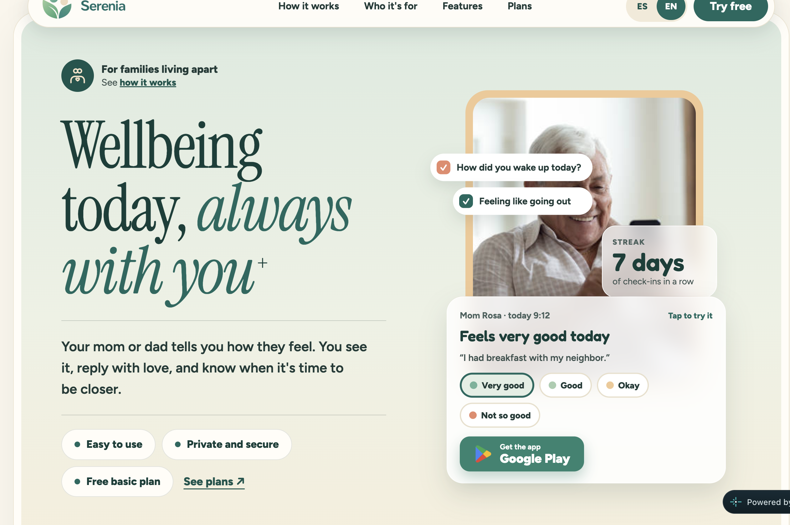


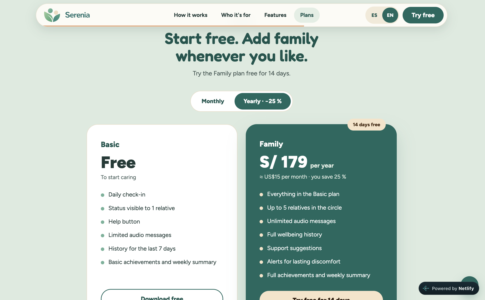


Luego, se mantiene una paleta de colores basada en verdes profundos sobre fondos crema, con acentos en café, que genera armonía visual y transmite calma y cercanía.

**Labeling System App - Registro e inicio**

En la versión móvil, el recorrido inicial usa etiquetas de una o dos palabras con verbos de acción: "Empezar", "Ya tengo cuenta", "Iniciar sesión", "Crear cuenta", "Continuar" y "Entrar a Serenia". Las pantallas se titulan con frases cortas y conversacionales, como "Qué bueno verte de nuevo", "Solo necesitamos tres datos." y "Elige tu plan". Para personalizar la experiencia, la pregunta "¿Quién eres?" ofrece dos opciones redactadas desde la identidad del usuario: "Soy familiar" y "Soy adulto mayor", cada una acompañada de una frase breve que explica su propósito.

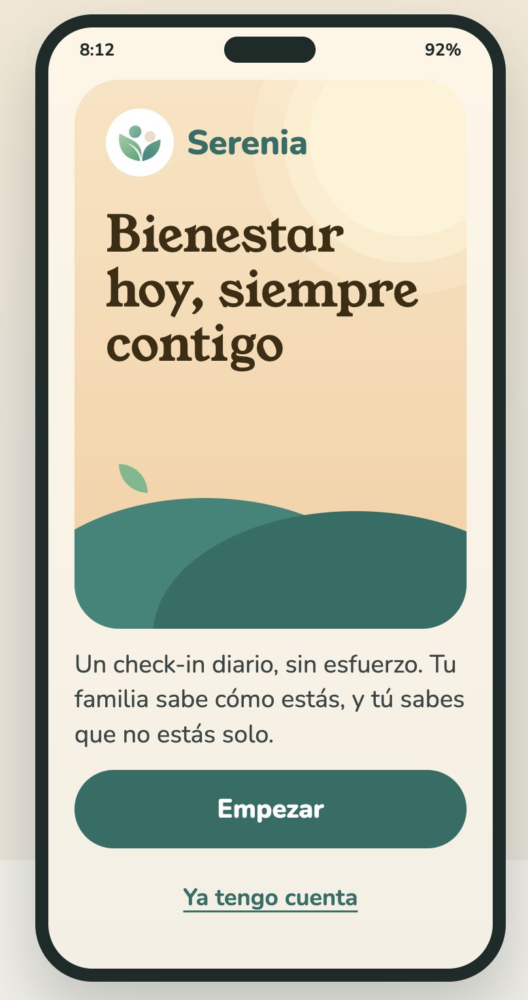


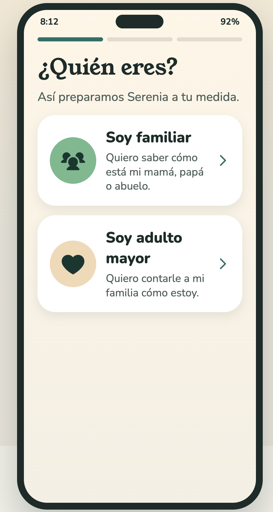


**Labeling System App para Adultos Mayores**

En la vista del adulto mayor, las etiquetas se redactan en primera persona y con el menor número de palabras posible, de modo que el usuario sienta la app como propia: "Mi cuenta", "Mi pregunta", "Mi ayuda" y "Mi teléfono". La pantalla principal saluda por el nombre ("Buenos días, Rosa") y plantea una sola pregunta, "¿Cómo amaneciste hoy?", con tres opciones directas: Muy bien, Más o menos y No tan bien. Además, se ofrecen salidas sin presión como "Cuéntame algo" y "Hoy no quiero responder", y la acción final se expresa con claridad: "Enviar a mi familia". El lenguaje es afectuoso, evita términos técnicos y se complementa con un modo simplificado que muestra solo lo esencial: cómo está el usuario y pedir ayuda.

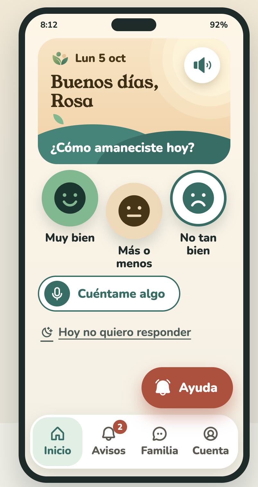


Cuando el usuario necesita apoyo, la etiqueta "Ayuda" abre una confirmación en lenguaje claro: "¿Quieres que avisemos a tu familia?", con las respuestas "Sí, avisar" y "No, ya estoy bien".

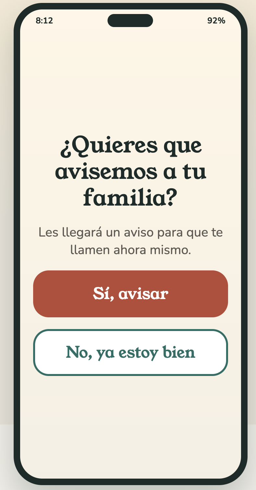

**Labeling System App para Familiares a distancia**

En la vista del familiar se mantiene la coherencia estructural con la versión del adulto mayor, pero las etiquetas se redactan en tercera persona y mencionan a la persona cuidada, lo que da contexto inmediato: "¿Cómo amaneció Mamá Rosa hoy?", "Círculo de Mamá Rosa" y "Para Mamá Rosa". Las secciones principales son Inicio, Historial, Alertas, Círculo y Mensajes, y las acciones se expresan con verbos simples: Llamar, Mensaje, Responderle, "Llamar ahora" y "Programar recordatorio". Las sugerencias usan un tono suave, como "Un gesto suave" y "Un gesto sugerido", en línea con la propuesta de acompañar sin alarmar.

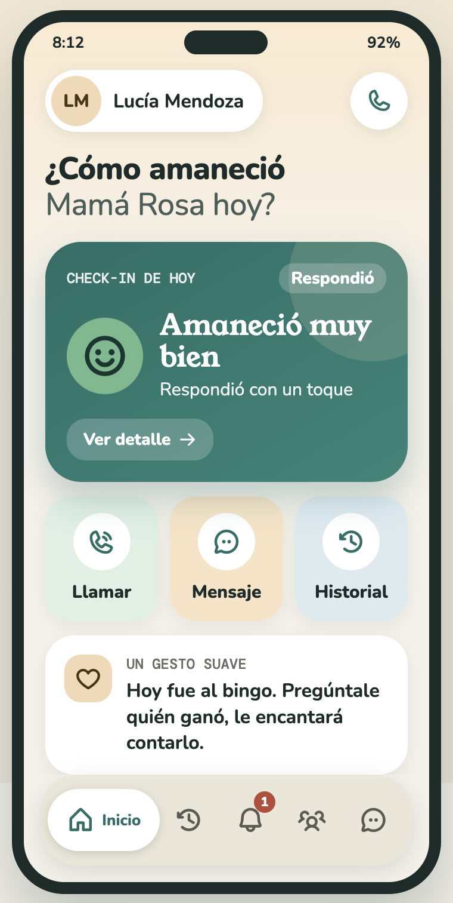


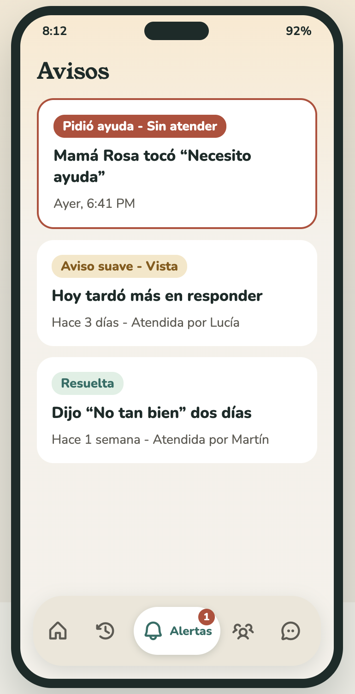


**Iconografía estándar**

En este apartado se consideran los íconos completamente intuitivos para el usuario, que se adaptan a una acción o funcionalidad específica: casa para Inicio, campana para Avisos y Alertas, burbuja de chat para Familia y Mensajes, reloj con flecha para Historial, grupo de personas para Círculo, micrófono para Audio y usuario para Cuenta. Todos pertenecen a un mismo set de íconos (Phosphor) para mantener un estilo uniforme, y siempre se acompañan de una etiqueta de texto, para no depender únicamente del símbolo, algo especialmente importante en adultos mayores.

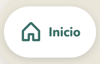
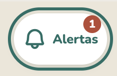

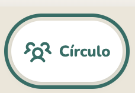


**Elementos de interacción activa**

Son los elementos con los que el usuario interactúa más seguido, como la navigation bar del móvil. La versión del adulto mayor se limita a cuatro pestañas (Inicio, Avisos, Familia y Cuenta) para reducir la carga cognitiva, mientras que la del familiar cuenta con cinco (Inicio, Historial, Alertas, Círculo y Mensajes) para cubrir el seguimiento del círculo de cuidado. La pestaña activa se resalta con color para indicar la ubicación del usuario.

navigation bar adulto mayor:

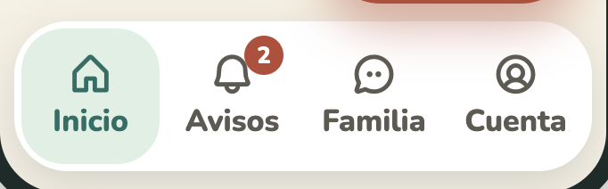


navigation bar familiar:

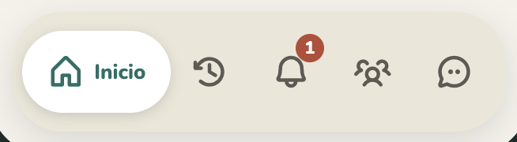
<!-- 📷 IMAGEN 13 -->

**Elementos de validación**

Íconos y mensajes que informan al usuario el resultado de una acción, siempre con un tono tranquilizador. Por ejemplo, tras pedir ayuda, la app confirma "Ya avisamos a Lucía y a Martín." y agrega "Tranquila, Rosa. Te van a llamar en un momento."; al vincular a la familia, muestra "Lucía y Rosa ya están conectadas"; y al unirse a la lista de espera, "¡Listo, ya estás en la lista!". Ante errores, el mensaje explica cómo corregirlo, como "Escribe un correo válido para avisarte.".

icons:

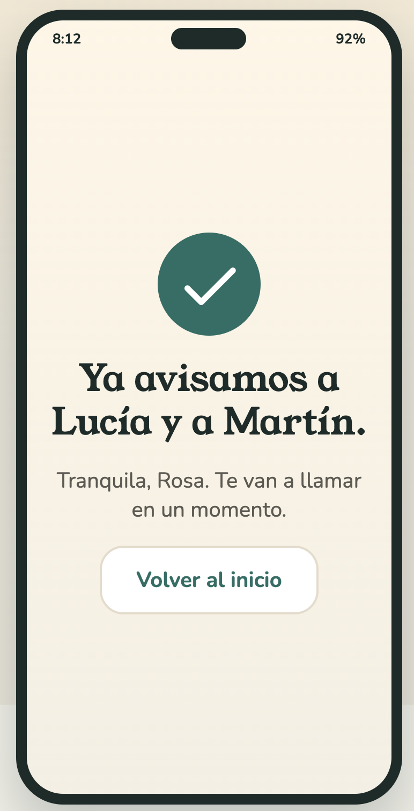


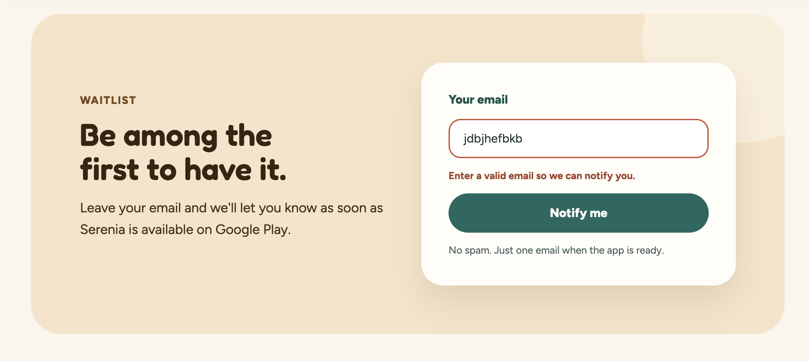


#### 3.1.2.3. SEO Tags and Meta Tags

#### 3.1.2.4. Searching Systems

Un sistema de búsqueda permite al usuario encontrar información escribiendo una consulta o acotando un conjunto de resultados mediante filtros, en lugar de recorrer la estructura de navegación. En arquitectura de información, su inclusión se justifica cuando el volumen de contenido es suficientemente grande o cuando el usuario sabe de antemano qué busca; en caso contrario, agrega complejidad sin aportar valor. Por ello, el equipo no incorporó un buscador global en Serenia, sino que decidió, producto por producto, dónde la búsqueda es necesaria y dónde resulta contraproducente.

<br>

**Criterio de decisión**
Serenia atiende a dos perfiles con necesidades opuestas. El adulto mayor interactúa con pocas acciones, a diario y con baja tolerancia a la carga cognitiva y a la escritura en pantalla, por lo que cualquier campo de búsqueda sería una barrera. El familiar a distancia, en cambio, acumula con el tiempo un historial de check-ins, notas, mensajes y alertas que sí necesita consultar de forma puntual. El equipo aplicó la búsqueda únicamente en el segundo caso.

<br>

| Producto | ¿Incluye sistema de búsqueda? | Justificación |
| --- | --- | --- |
| Aplicación móvil del adulto mayor | No | Su flujo se reduce al check-in diario, el botón de ayuda y la recepción de mensajes. El contenido es mínimo y se resuelve con navegación directa; un buscador añadiría escritura y confusión a un usuario que no la necesita. |
| Aplicación móvil del familiar a distancia | Sí, acotada por sección | Acumula historial de check-ins, notas compartidas, mensajes de audio, fotos y alertas que crecen cada día. Se ofrecen filtros y búsqueda por texto dentro de cada sección, no un buscador global. |
| Landing page web | No | Presenta el producto y sus planes en pocas páginas, cubiertas por el menú de navegación. El descubrimiento de la landing ocurre en buscadores externos, tratado en la sección 3.1.2.3 (SEO Tags and Meta Tags). |

<br>

**Zonas de búsqueda en la aplicación del familiar a distancia**

Cada sección de contenido define su propia zona de búsqueda, de modo que el usuario siempre sabe en qué conjunto de información está buscando.

<br>

| Zona | Contenido buscable | Tipo de búsqueda | Filtros disponibles | Orden por defecto |
| --- | --- | --- | --- | --- |
| Historial de check-ins | Check-ins del adulto mayor con su estado de ánimo y nota | Solo filtros, sin texto libre | Rango de fechas, nivel de ánimo (muy bajo, bajo, neutral, bueno, muy bueno), estado (respondido, perdido) | Más reciente primero |
| Alertas | Alertas de inactividad, bienestar y emergencia | Solo filtros, sin texto libre | Tipo de alerta, severidad (baja, media, alta, crítica), estado (abierta, notificada, atendida, cerrada), rango de fechas | Más reciente primero |
| Notas compartidas | Notas escritas por los integrantes del círculo familiar | Texto libre sobre el contenido de la nota | Autor, rango de fechas | Más reciente primero |
| Mensajes | Mensajes de audio, fotos y texto entre el adulto mayor y su círculo | Solo filtros, sin texto libre | Tipo de mensaje (audio, foto, texto), remitente, rango de fechas | Más reciente primero |
| Pequeños logros | Pequeños logros registrados por el sistema | Solo filtros, sin texto libre | Rango de fechas | Más reciente primero |

<br>

La búsqueda por texto libre se reserva a las notas compartidas, que es el único contenido redactado libremente por los usuarios. El resto de las secciones contiene datos estructurados (estados, tipos, severidades), para los cuales un filtro es más rápido y menos propenso a errores que escribir una consulta.

<br>

**Presentación de resultados**

Los resultados se muestran como una lista cronológica en la misma pantalla de la sección, sin cambiar de pantalla al buscar. Los filtros aplicados quedan visibles en la parte superior como etiquetas que se pueden quitar de una en una, junto con el total de resultados encontrados (por ejemplo, "12 resultados") y un acceso de un solo toque para limpiar todos los filtros. Cada elemento del listado muestra la información mínima para identificarlo y abre su detalle al seleccionarlo. Los filtros por rango de fechas ofrecen atajos predefinidos (hoy, últimos 7 días, últimos 30 días) para evitar el ingreso manual de fechas.

<br>

| Zona | Cómo se muestra cada resultado | Información visible en el listado | Al seleccionarlo |
| --- | --- | --- | --- |
| Historial de check-ins | Tarjeta con indicador de color según el nivel de ánimo | Fecha y hora, nivel de ánimo, estado (respondido o perdido) y primera línea de la nota, si existe | Abre el detalle del check-in con la pregunta formulada y la nota completa |
| Alertas | Tarjeta con indicador de color según la severidad | Tipo de alerta, severidad, estado y fecha y hora en que se activó | Abre el detalle de la alerta y su registro de atención |
| Notas compartidas | Tarjeta de texto con el término buscado resaltado | Autor, fecha y extracto de la nota con la coincidencia resaltada | Abre la nota completa |
| Mensajes | Tarjeta con ícono según el tipo de mensaje | Remitente, tipo (audio, foto o texto), fecha y hora, y duración si es audio o miniatura si es foto | Reproduce el audio, amplía la foto o abre el texto |
| Pequeños logros | Tarjeta con la descripción del logro | Descripción y fecha en que se registró | Abre el check-in que originó el logro, cuando aplica |

<br>

**Resultados vacíos**

Cuando una combinación de filtros no produce resultados, la sección lo comunica con un mensaje en lenguaje cotidiano y propone la acción siguiente (por ejemplo, ampliar el rango de fechas o limpiar los filtros), en lugar de mostrar una pantalla vacía.

<br>

**Criterios de accesibilidad**

Aunque el sistema de búsqueda solo se expone al familiar a distancia, el equipo mantiene los mismos criterios de legibilidad que en el resto de la aplicación: tamaño de texto adaptable, objetivos táctiles amplios en los controles de filtro y contraste suficiente en los filtros activos.

<br>


#### 3.1.2.5. Navigation Systems

Un sistema de navegación define las acciones y técnicas que guían al usuario a través del producto: cómo se desplaza entre pantallas, cómo sabe en qué punto se encuentra y cómo regresa o avanza hacia su meta sin perderse. Para Serenia, el equipo diseñó la navegación de cada producto según las capacidades y metas de su usuario principal. El adulto mayor necesita avanzar con la menor cantidad de decisiones posible; el familiar a distancia necesita llegar rápido a información distinta según la urgencia; y el visitante de la landing page necesita entender la propuesta y llegar a probar la aplicación. Las dos aplicaciones móviles comparten el mismo estilo de barra de navegación inferior, pero con destinos distintos, de modo que cada usuario encuentra solo lo que le corresponde.

<br>

**Principios de navegación**

Todos los productos comparten cuatro criterios: pocas opciones visibles a la vez, etiquetas coherentes con las definidas, una profundidad máxima de dos niveles desde la pantalla principal y una forma siempre disponible de volver o salir.

<br>

| Producto | Tipo de navegación principal | Elementos de apoyo |
| --- | --- | --- |
| Aplicación móvil del adulto mayor | Barra de navegación inferior con cuatro destinos | Botón de ayuda visible en la pantalla de inicio, flecha de retorno en pantallas secundarias, flujos lineales por pasos |
| Aplicación móvil del familiar a distancia | Barra de navegación inferior con cinco destinos | Acceso al perfil desde la pantalla de inicio, navegación local por sección, enlaces contextuales y notificaciones push con acceso directo |
| Landing page web | Barra de navegación superior fija con anclas a secciones | Selector de idioma, botón "Probar gratis" repetido, menú adaptado a móvil, pie de página |

### Aplicación móvil del adulto mayor.
La navegación se mantiene lo más simple posible, ya que cada opción adicional es una decisión más para un usuario con baja familiaridad tecnológica. Por eso la aplicación usa una barra de navegación inferior con solo cuatro destinos, flotante y ubicada al alcance del pulgar. La pestaña activa se resalta con una píldora blanca que muestra el ícono y su nombre, mientras que las demás muestran solo el ícono, de modo que el usuario siempre sabe en qué sección está.

<br>

<div align="center">

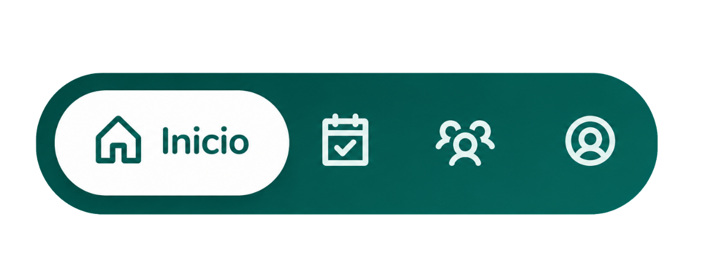
  <br/><i>Imagen X. Barra de navegación inferior de la aplicación móvil del adulto mayor.</i>

</div>

<br>

| Destino | Contenido | Meta del usuario que atiende |
| --- | --- | --- |
| Inicio | Saludo, pregunta del día "¿Cómo amaneciste hoy?" con tres opciones de estado de ánimo, la opción "Hoy no quiero responder" y el botón de ayuda | Responder su check-in y pedir ayuda si la necesita |
| Recordar | Lista de recordatorios con las acciones Listo, Más tarde y descartar, y la creación de nuevos recordatorios | Acordarse de llamar a una persona o de asistir a una actividad |
| Familia | Fotos que le enviaron sus familiares, grabación de un audio para su familia, y acceso a su círculo y a su código de invitación | Sentirse cerca de su familia y gestionar quién está vinculado |
| Cuenta | Datos personales, hora de la pregunta diaria, modo simplificado y cambio de contraseña | Ajustar la aplicación a sus necesidades |

<br>

| Elemento | Descripción |
| --- | --- |
| Pantalla de inicio | Presenta la pregunta del día con tres opciones grandes y una alternativa para omitirla. Es el punto de partida y de retorno de la aplicación. |
| Botón de ayuda | Botón flotante de gran tamaño en la pantalla de inicio. Al tocarlo, la aplicación envía la alerta a la familia y muestra una pantalla de confirmación. Si el envío falla, informa el problema y ofrece reintentar. |
| Flujo del check-in | Recorrido corto: pregunta del día, elección del estado de ánimo y pantalla de agradecimiento. Cada pantalla muestra una sola decisión. Si el adulto mayor prefiere no responder, la aplicación registra una pausa del día y no genera alerta. |
| Modo simplificado | Se activa desde Cuenta y muestra solo lo esencial: cómo está el usuario y el botón de ayuda. |
| Retorno | Las pantallas secundarias incluyen un botón "Atrás". Al terminar una acción, la aplicación regresa al inicio y muestra una confirmación. |

<br>

### Aplicación móvil del familiar a distancia.
Esta aplicación concentra más contenido, por lo que emplea una barra de navegación inferior con cinco destinos, con el mismo estilo flotante en verde oscuro de la aplicación del adulto mayor. La pestaña activa se resalta con una píldora blanca que incluye el ícono y la etiqueta, para que el usuario siempre sepa dónde está.

<br>

<div align="center">

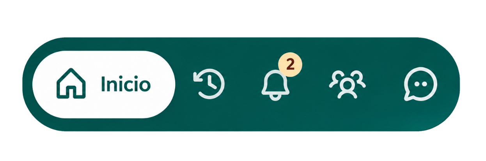
  <br/><i>Imagen X. Barra de navegación inferior de la aplicación móvil del familiar a distancia.</i>

</div>

<br>

| Destino | Contenido | Meta del usuario que atiende |
| --- | --- | --- |
| Inicio | Resumen de cómo amaneció el adulto mayor, con la tarjeta del check-in del día, accesos rápidos a Historial, Alertas y Mensajes, y el turno de atención del día | Saber de un vistazo si su familiar está bien |
| Historial | Registro de check-ins con filtros por estado de ánimo (Todos, Muy bien, Más o menos, No tan bien) | Revisar cómo ha evolucionado el bienestar |
| Alertas | Alertas de emergencia y de inactividad, con su estado de atención | Responder con rapidez ante una situación de riesgo |
| Círculo | Integrantes del círculo familiar, turnos de atención, notas compartidas y la opción de quitar el vínculo | Coordinarse con los demás familiares |
| Mensajes | Audios que graba el adulto mayor y envío de fotos | Mantener el vínculo afectivo con el adulto mayor |

<br>

El perfil y los ajustes de la cuenta no ocupan un destino de la barra: se acceden desde la etiqueta con el nombre del usuario en la parte superior de la pantalla de inicio, ya que se consultan con poca frecuencia. La pestaña Alertas muestra una insignia numérica cuando existen alertas sin atender, de modo que lo urgente se perciba sin tener que entrar a la sección.

Dentro de cada destino, la navegación local se resuelve con filtros o bloques visibles en la parte superior, como los filtros de Historial y los accesos a Turnos de atención y Notas compartidas dentro de Círculo. Además, la aplicación ofrece enlaces contextuales que permiten saltar entre contenidos relacionados sin pasar por la barra:

<br>

| Desde | Hacia | Cómo se accede |
| --- | --- | --- |
| Tarjeta de check-in en Inicio | Detalle del check-in | Toque sobre la tarjeta |
| Accesos rápidos en Inicio | Historial, Alertas o Mensajes | Toque sobre el acceso rápido |
| Lista de alertas | Detalle de la alerta con su seguimiento | Toque sobre la alerta |
| Notificación push | Detalle de la alerta correspondiente | Toque sobre la notificación, que abre directamente la pantalla destino |

<br>

**Landing page web**

La landing page tiene un propósito de conversión: que el visitante comprenda la propuesta de Serenia y llegue a probar la aplicación. Se organiza como una página de desplazamiento continuo, con una barra de navegación superior fija que permanece visible mientras se recorre el contenido.

<br>

| Elemento | Descripción |
| --- | --- |
| Barra de navegación superior | Contiene el logotipo (que devuelve al inicio) y cuatro enlaces de ancla a las secciones de la página: Cómo funciona, Para quién, Funciones y Planes. Permanece fija al desplazarse. |
| Selector de idioma | Control ES / EN ubicado en la barra, que permite al visitante alternar entre español e inglés sin salir de la página. El idioma activo se resalta. |
| Botón "Probar gratis" | Botón destacado en el extremo derecho de la barra, repetido en la portada, que lleva a la sección de Planes. Al final de la página, un llamado a la acción redirige a las tiendas de aplicaciones. |
| Desplazamiento a secciones | Al seleccionar un enlace de la barra, la página se desplaza suavemente hasta la sección correspondiente, y el enlace de la sección visible se resalta. |
| Adaptación a móvil | En pantallas pequeñas, la barra conserva el logotipo, el selector de idioma y el botón "Probar gratis" en la fila superior, y los enlaces de sección pasan a una fila desplazable horizontalmente debajo de ella. |
| Pie de página | Reúne el contacto, los términos de uso y la política de privacidad, y repite los enlaces principales. |
| Regreso al inicio | Un botón flotante permite volver al inicio de la página tras recorrer varias secciones. |

<br>

<div align="center">


  <br/><i>Imagen X. Barra de navegación superior de la landing page.</i>

</div>

<br>

**Recorridos principales**

Las técnicas anteriores se combinan para que cada usuario llegue a su meta en la menor cantidad de pasos posible.

<br>

| Usuario | Meta | Recorrido |
| --- | --- | --- |
| Adulto mayor | Responder su check-in del día | Inicio → Elegir cómo amaneció → Pantalla de agradecimiento |
| Adulto mayor | Pedir ayuda | Inicio → Botón de ayuda → Alerta enviada |
| Adulto mayor | Enviar un audio a su familia | Familia → Grabar un audio para mi familia → Hablar → Enviar a mi familia |
| Adulto mayor | Crear un recordatorio | Recordar → Nuevo recordatorio → Guardar |
| Familiar a distancia | Saber cómo está su familiar | Inicio → Tarjeta del check-in del día |
| Familiar a distancia | Atender una alerta | Notificación push → Detalle de la alerta → Estoy atendiendo esta alerta |
| Familiar a distancia | Escuchar un audio del adulto mayor | Mensajes → Audio → Reproducir |
| Visitante | Probar la aplicación | Landing page → Botón "Probar gratis" → Planes → Descarga en la tienda de aplicaciones |

<br>

### 3.1.3. Landing Page UI Design
#### 3.1.3.1. Landing Page Wireframe

El wireframe define la estructura y la jerarquía de contenido de la landing page antes de aplicar color, tipografía e identidad visual. Se elaboró en baja fidelidad para versión de escritorio y versión móvil, priorizando el orden de las secciones, la ubicación de los llamados a la acción y la legibilidad en pantallas pequeñas. La página se organiza en las siguientes secciones:

<br>

| Orden | Sección | Propósito | Contenido principal |
| --- | --- | --- | --- |
| 1 | Navbar| Orientar y ofrecer acceso permanente a las secciones y a la acción principal | Logotipo, enlaces Cómo funciona, Para quién, Funciones y Planes, selector de idioma ES / EN y botón "Probar gratis" |
| 2 | Hero | Comunicar la propuesta de valor en pocos segundos | Titular, descripción breve, botones "Probar gratis" y "Ver cómo funciona", y una vista previa de la aplicación |
| 3 | Qué es Serenia | Explicar la idea del producto | Texto breve sobre el acompañamiento emocional a distancia |
| 4 | Cómo funciona | Mostrar el funcionamiento en pocos pasos | Tres pasos: check-in diario, la familia lo ve y aviso a tiempo |
| 5 | Para quién | Identificar a los dos tipos de usuario | Una tarjeta para el adulto mayor y otra para el familiar a distancia |
| 6 | Funciones | Presentar las funciones principales | Seis tarjetas: check-in diario, modo simplificado, mensajes de audio, círculo de cuidado, sugerencias a tiempo y pequeños logros con botón de ayuda |
| 7 | Planes | Presentar el modelo freemium y facilitar la decisión | Plan Básico gratuito y plan(es) de suscripción, con botón de acción en cada uno |
| 8 | Llamado final a la descarga | Cerrar con una invitación a actuar | Mensaje de cierre y botones de las tiendas de aplicaciones |
| 9 | Footer | Reunir información legal y de contacto | Contacto, términos de uso y política de privacidad |

<br>

En la versión de escritorio, las secciones de Cómo funciona, Funciones y Planes se organizan en columnas, y la portada coloca el texto junto a la vista previa de la aplicación. En la versión móvil, las columnas pasan a una sola, la barra superior se compacta (logotipo, selector de idioma y botón "Probar gratis", con los enlaces de sección en una fila desplazable) y los botones se amplían para facilitar el toque.

<br>
<div align="center">

**Desktop Web Browser**

*Elaboración propia*

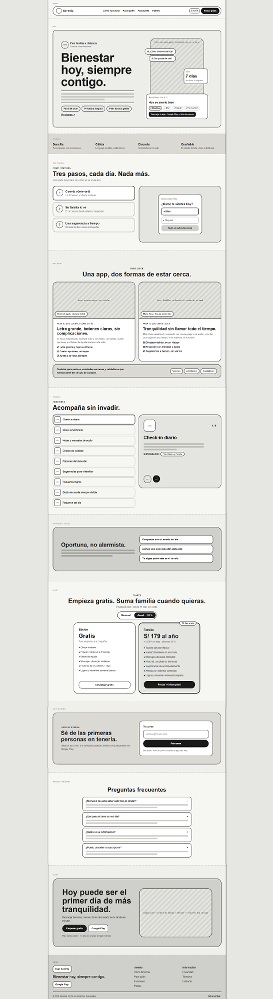

<br/><i>Imagen X. Wireframe de la landing page en versión de escritorio.</i>

<br>

**Mobile Web Browser**

*Elaboración propia*

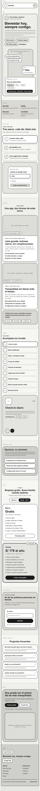

<br/><i>Imagen X. Wireframe de la landing page en versión móvil.</i>

</div>

<br>

#### 3.1.3.2. Landing Page Mock-up

El mock-up lleva el wireframe a alta fidelidad aplicando la identidad visual de Serenia. Su paleta se apoya en tonos cálidos y serenos (crema, verde salvia y durazno) y en una tipografía redondeada y legible, pensada para transmitir calma, cercanía y confianza. Los textos son de gran tamaño y con contraste suficiente, y los botones tienen áreas de toque amplias, en coherencia con la accesibilidad definida para el producto. El eslogan *"Bienestar hoy, siempre contigo"* acompaña la identidad de marca.

Los elementos clave del mock-up son:

<br>

| Elemento | Decisión de diseño |
| --- | --- |
| Portada | Titular centrado en el beneficio emocional ("Saber que están bien, sin tener que llamar"), con una vista previa de la aplicación que muestra el check-in diario y la respuesta de la familia. |
| Llamados a la acción | El botón "Probar gratis" aparece en la barra superior, en la portada y en los planes, con color de acento para distinguirse del resto de enlaces. |
| Tarjetas | Cómo funciona y Funciones usan tarjetas de esquinas redondeadas y contenido breve, para que el recorrido se lea con rapidez. |
| Planes | El plan Básico se muestra en un fondo claro y el plan de suscripción en un fondo de color de acento, para guiar la mirada hacia la opción de pago. |
| Selector de idioma | El control ES / EN resalta el idioma activo con un subrayado de color. |

<br>

La landing page publicada puede consultarse en [sereniaa.netlify.app](https://sereniaa.netlify.app/).

<br>
<div align="center">

**Desktop Web Browser**

*Elaboración propia en Figma*

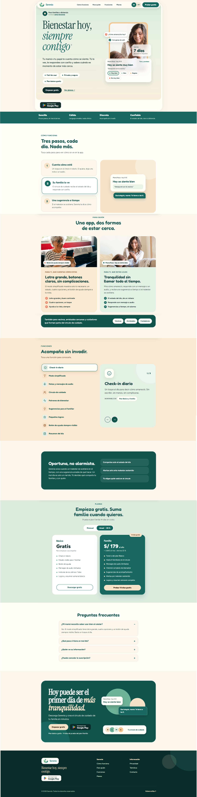

<br/><i>Imagen X. Mock-up de la landing page en versión de escritorio.</i>

<br>

**Mobile Web Browser**

*Elaboración propia en Figma*


<br/><i>Imagen X. Mock-up de la landing page en versión móvil.</i>

</div>

<br>

### 3.1.4. Mobile Applications UX/UI Design
#### 3.1.4.1. Mobile Applications Wireframes

Los wireframes de Serenia son la versión de baja fidelidad de las pantallas de las dos aplicaciones móviles del producto: la del adulto mayor y la del familiar. Se elaboraron en escala de grises, sin color, tipografías de marca ni imágenes, para concentrar la atención en la estructura de cada pantalla, la jerarquía de la información, la ubicación de los botones y la secuencia de navegación. De este modo el equipo pudo validar la distribución y el flujo antes de definir el diseño visual que se presenta en los mock-ups.

<br>


**Criterios de elaboración** 

Cada wireframe corresponde a una pantalla del prototipo y conserva sus mismos elementos y textos, representados con formas simples: bloques para tarjetas y botones, contornos para campos y chips, y una barra de navegación inferior de cuatro destinos en la aplicación del adulto mayor y de cinco en la del familiar. 

<br>

## Flujo del adulto mayor

El recorrido del adulto mayor comienza con la bienvenida, la creación de la cuenta y el inicio de sesión. Luego accede a su aplicación, organizada en cuatro secciones: Inicio, Recordar, Familia y Cuenta. Desde el inicio responde su check-in diario con un toque, puede omitirlo si prefiere no responder y dispone del botón "Ayuda" para avisar a su familia. En las demás secciones gestiona sus recordatorios, comparte fotos y audios con su familia, consulta su círculo y su código de invitación, y administra su cuenta.

<br>

<div align="center">

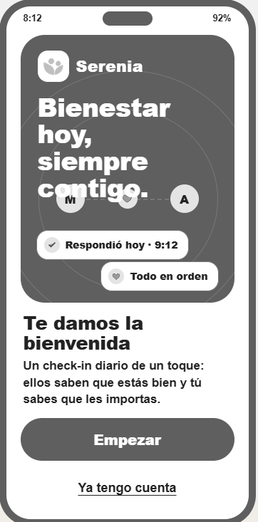

</div>

<br>

<div align="center">

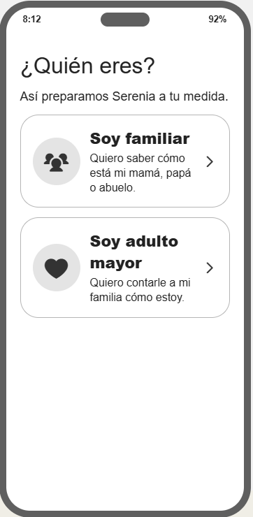

</div>

<br>

<div align="center">

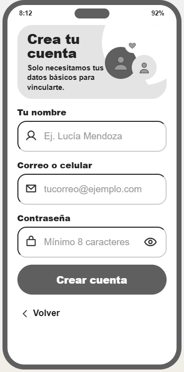

</div>

<br>

<div align="center">

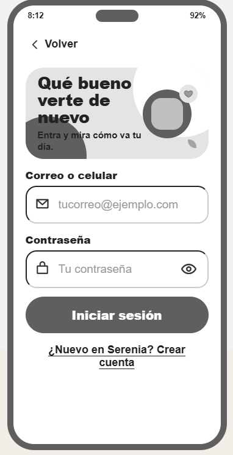

</div>

<br>

<div align="center">

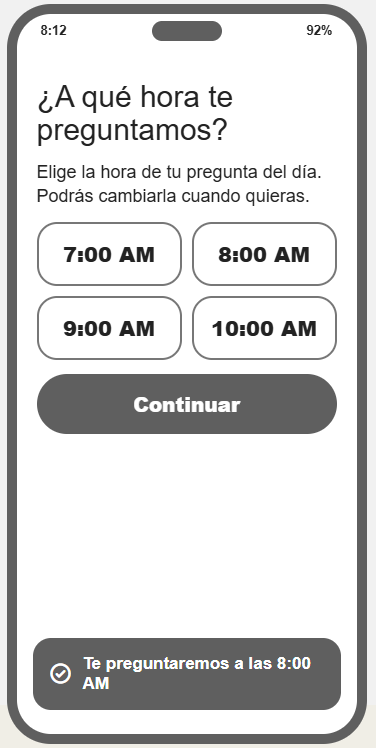

</div>

<br>

<div align="center">

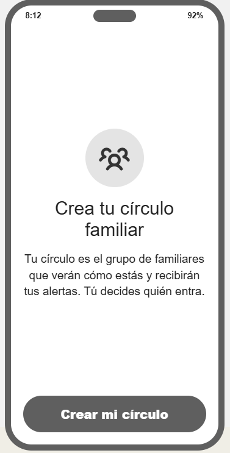

</div>

<br>

<div align="center">

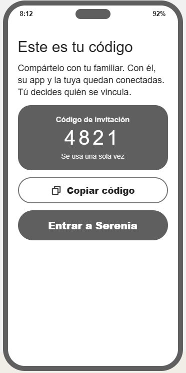

</div>

<br>

<div align="center">

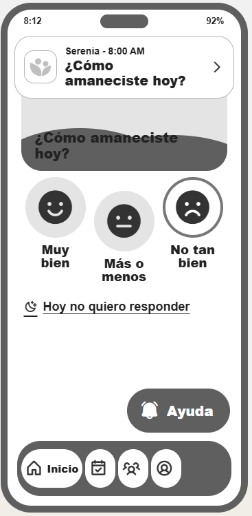

</div>

<br>

<div align="center">

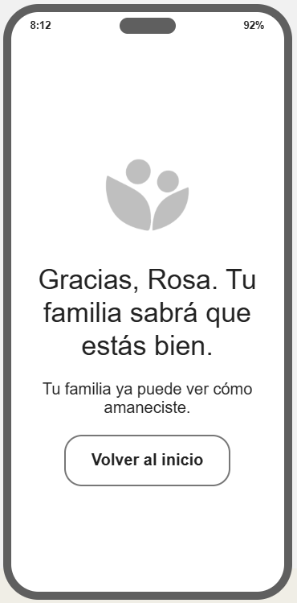

</div>

<br>

<div align="center">

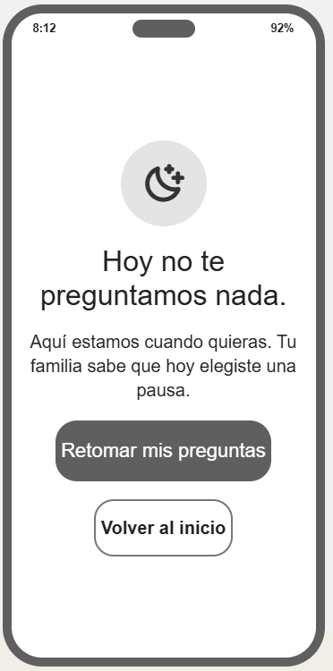

</div>

<br>

<div align="center">

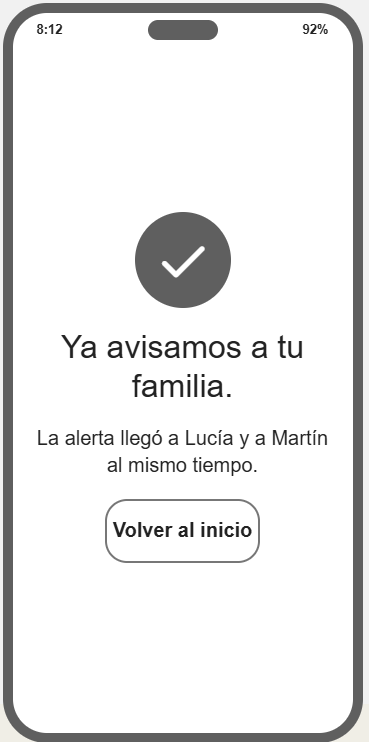

</div>

<br>

<div align="center">

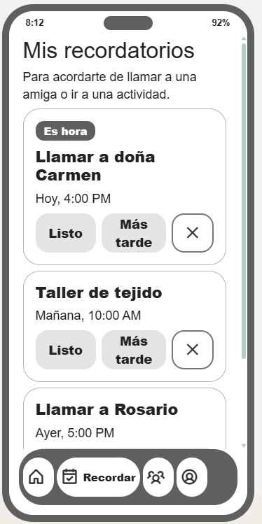

</div>

<br>

<div align="center">

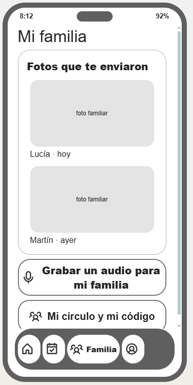

</div>

<br>

<div align="center">

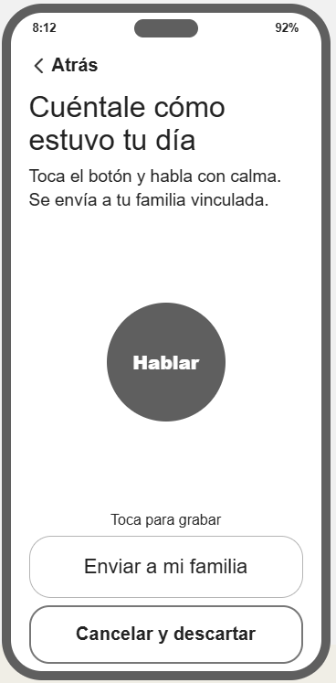

</div>

<br>

<div align="center">

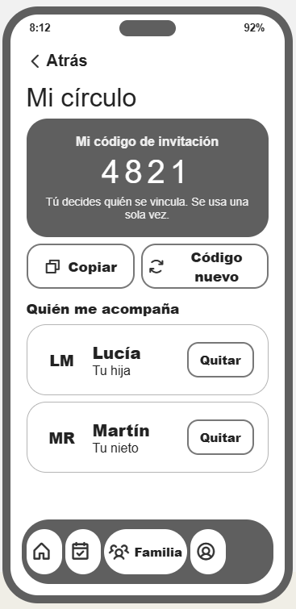

</div>

<br>

<div align="center">

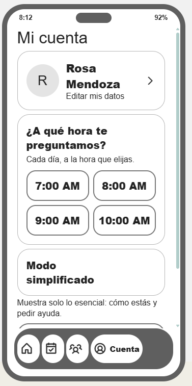

</div>

<br>

<div align="center">

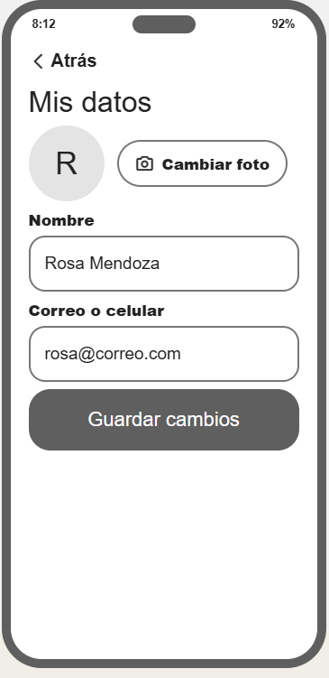

</div>

<br>

<div align="center">

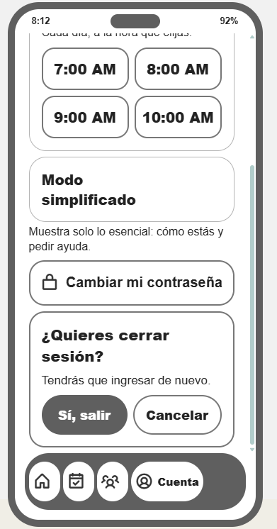

</div>

<br>


## Flujo del familiar

El recorrido del familiar comienza con la misma bienvenida, creación de cuenta e inicio de sesión. Luego accede a su aplicación, organizada en cinco secciones: Inicio, Historial, Alertas, Círculo y Mensajes. En el inicio ve cómo amaneció su adulto mayor y accede al detalle de su check-in; en Historial revisa los registros anteriores y en Alertas atiende las emergencias y las inactividades. En Círculo gestiona a los familiares vinculados, los turnos de atención y las notas compartidas, y en Mensajes reproduce los audios y envía fotos.

<br>

<div align="center">


</div>

<br>

<div align="center">


</div>

<br>

<div align="center">


</div>

<br>

<div align="center">


</div>

<br>

<div align="center">

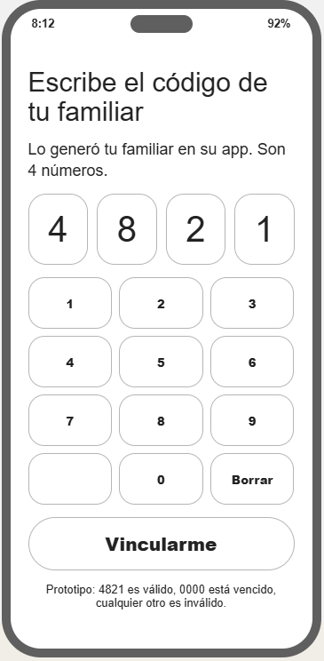

</div>

<br>

<div align="center">

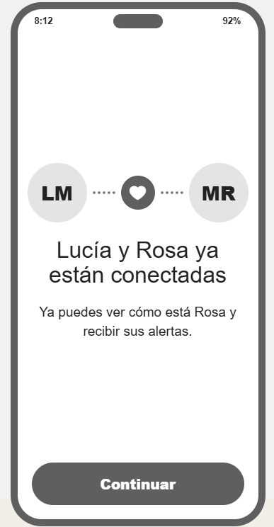

</div>

<br>

<div align="center">

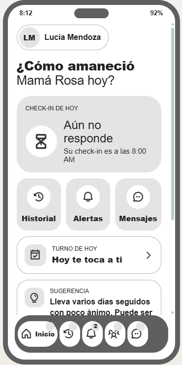

</div>

<br>

<div align="center">

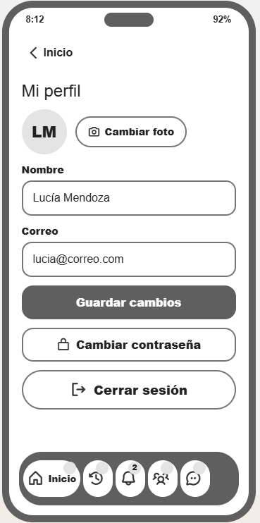

</div>

<br>

<div align="center">

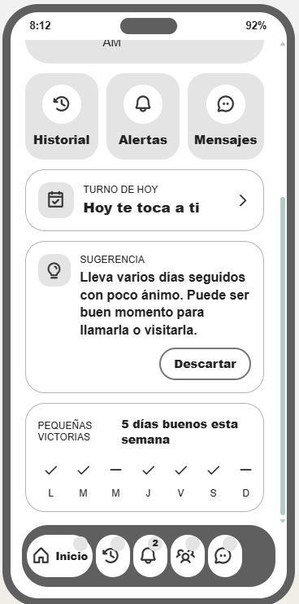

</div>

<br>

<div align="center">

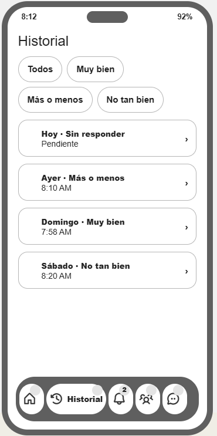

</div>

<br>

<div align="center">

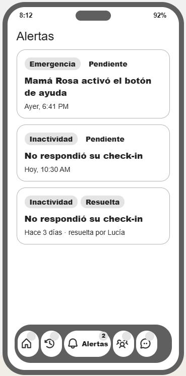

</div>

<br>

<div align="center">

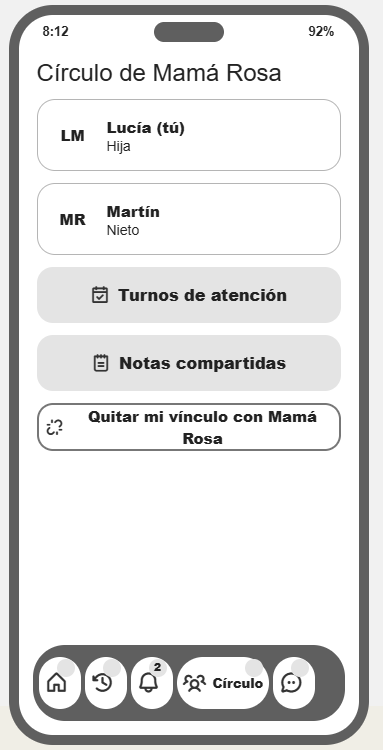

</div>

<br>

<div align="center">

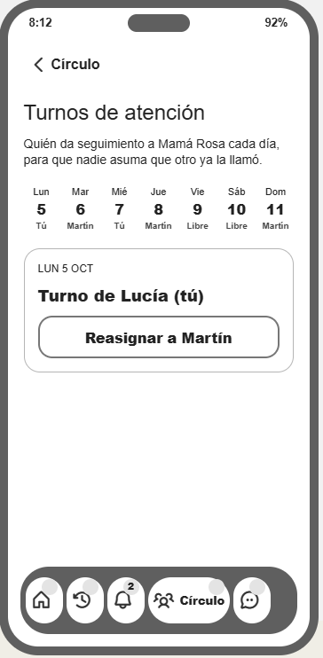

</div>

<br>

<div align="center">

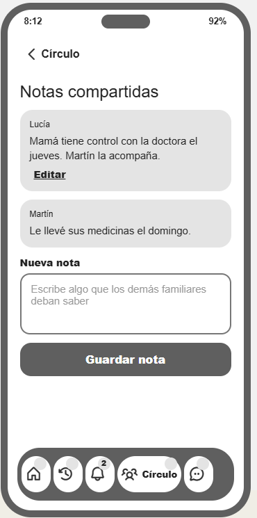

</div>

<br>

<div align="center">

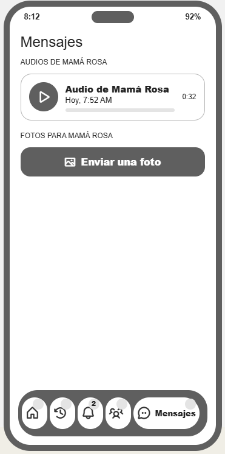

</div>

<br>

<div align="center">

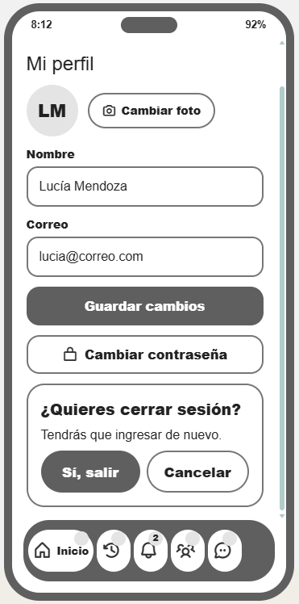

</div>

<br>

#### 3.1.4.2. Mobile Applications Wireflow Diagrams

Un wireflow combina los wireframes de las pantallas con las flechas que muestran cómo avanza el usuario de una a otra, de modo que cada paso del flujo se representa con la pantalla en el estado que el usuario ve en ese momento. En esta sección se presentan los wireflows de los user goals que el equipo consideró prioritarios para esta entrega, agrupados por segmento de usuario: el **Segmento 1** (adultos mayores que viven solos) y el **Segmento 2** (familiares a distancia), que corresponden a los user personas de la sección 2.3.1. En conjunto cubren la propuesta de valor de Serenia: que el adulto mayor cree su círculo, cuente cómo amaneció y pueda pedir ayuda, y que su familia pueda vincularse y acompañarlo a distancia. Los wireflows parten de los wireframes de la sección 3.1.4.1 y se elaboraron en Miro.

Antes de dibujarlos se definieron los pasos típicos de cada objetivo como una secuencia de acciones (task flow), tomando como base las historias de usuario del capítulo II y la organización de la información de las secciones 3.1.2.1 y 3.1.2.5. En los diagramas, la flecha verde marca el camino feliz, la flecha naranja un camino alternativo, el recuadro amarillo una decisión y la caja blanca el resultado final de cada camino. Los nombres que aparecen en las pantallas (Rosa, Lucía y Martín) son datos de ejemplo del prototipo.

**URL del tablero en Miro:** https://miro.com/app/board/uXjVEch8qjo=/?share_link_id=85197687422 (contiene los wireflows y los user flows en mayor tamaño).

**Segmento 1: adultos mayores que viven solos**

**Wireflow 1. Registro y vinculación con la familia (Segmento 1)**

**User goal:** como adulto mayor que vive solo (user persona del primer segmento, sección 2.3.1), quiero registrarme y crear mi círculo familiar para obtener el código de invitación que compartiré con mis familiares (historias US01, US05 y US40). El flujo se muestra en la Imagen X.

<div align="center">

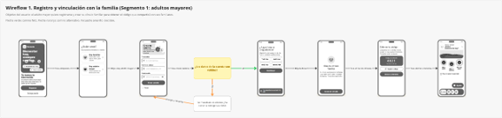
  <br/><i>Imagen X. Wireflow 1. Registro y vinculación con la familia (Segmento 1).</i>
</div>

El flujo comienza en la pantalla de bienvenida: el adulto mayor toca "Empezar" y, en "¿Quién eres?", elige "Soy adulto mayor". Luego crea su cuenta con su nombre, su correo o celular y una contraseña. La decisión del flujo es si los datos de la cuenta son válidos. Después elige la hora a la que quiere recibir la pregunta del día, crea su círculo familiar y obtiene su código de invitación, que podrá copiar y compartir.

- **Camino feliz:** los datos son válidos, por lo que la aplicación continúa con la elección de la hora, la creación del círculo, la pantalla con el código de cuatro números y, al tocar "Entrar a Serenia", el inicio de la aplicación.
- **Camino alternativo:** los datos no son válidos. Se muestran los errores en la misma pantalla y la persona corrige sus datos para volver a intentarlo.

**Wireflow 2. Check-in diario (Segmento 1)**

**User goal:** como adulto mayor que vive solo, quiero contar en un toque cómo amaneció, o dejar pasar el día sin responder si no lo deseo (historias US03 y US07). El flujo se muestra en la Imagen X.

<div align="center">

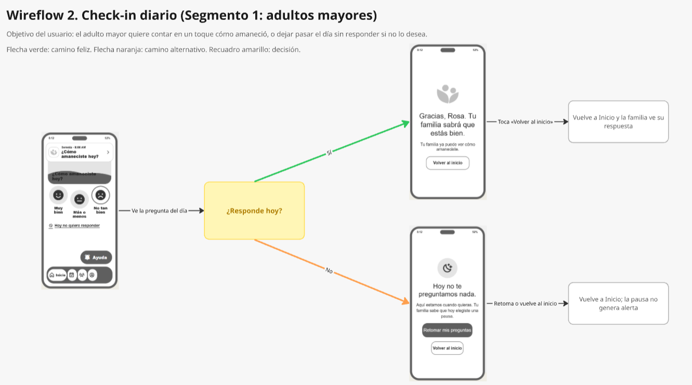
  <br/><i>Imagen X. Wireflow 2. Check-in diario (Segmento 1).</i>
</div>

El flujo comienza en la pantalla de inicio de la aplicación del adulto mayor, donde una notificación del horario configurado le pregunta "¿Cómo amaneciste hoy?" y le ofrece tres opciones: "Muy bien", "Más o menos" y "No tan bien". El único punto de decisión es si el usuario responde ese día.

- **Camino feliz:** el adulto mayor toca una de las tres opciones y la aplicación muestra la pantalla de agradecimiento, que le confirma que su familia sabrá cómo está. Desde allí vuelve al inicio con un solo botón.
- **Camino alternativo:** el adulto mayor toca "Hoy no quiero responder". La aplicación muestra una pantalla que le confirma que hoy no se le preguntará nada y que su familia sabe que eligió una pausa; desde allí puede retomar sus preguntas o volver al inicio. Esta pausa es una decisión del usuario y no genera alerta.

**Wireflow 3. Pedir ayuda (Segmento 1)**

**User goal:** como adulto mayor que vive solo, quiero pedir ayuda de inmediato y que mi familia lo sepa, sin tener que buscar a quién llamar (historias US13 y US14). El flujo cruza las dos aplicaciones: empieza en la del adulto mayor y termina en la del familiar a distancia (Imagen X).

<div align="center">

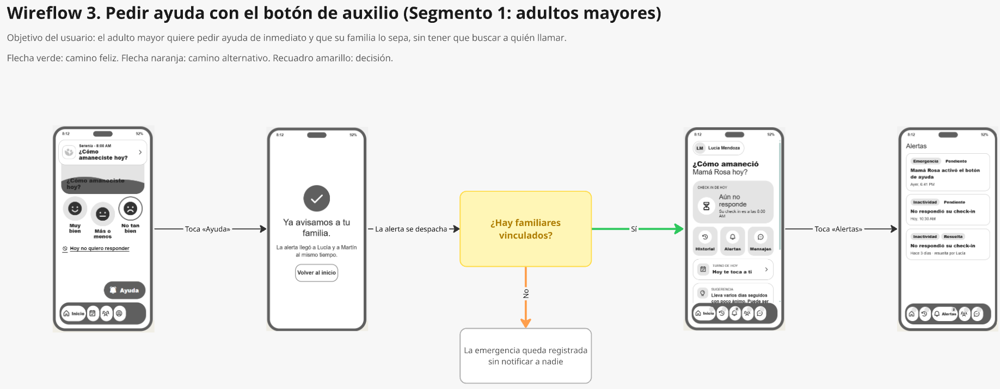
  <br/><i>Imagen X. Wireflow 3. Pedir ayuda (Segmento 1).</i>
</div>

El botón "Ayuda" está disponible en la pantalla de inicio del adulto mayor. Al tocarlo, la aplicación muestra una pantalla de confirmación ("Ya avisamos a tu familia") y el sistema despacha la alerta. La decisión del flujo es si el círculo del adulto mayor tiene familiares vinculados.

- **Camino feliz:** hay familiares vinculados, por lo que la alerta les llega a todos al mismo tiempo. El familiar abre su aplicación, donde el ícono de Alertas muestra una insignia de pendientes, y entra a Alertas, donde la emergencia aparece como pendiente.
- **Camino alternativo:** el círculo no tiene familiares vinculados. Según las reglas del bounded context Alerts and Safety (sección 2.6.6), el despacho se marca como fallido y la emergencia queda registrada sin notificar a nadie. Este camino no tiene una pantalla propia y se representa como el resultado final del flujo.

**Segmento 2: familiares a distancia**

**Wireflow 4. Registro y vinculación con el adulto mayor (Segmento 2)**

**User goal:** como familiar a distancia (user persona del segundo segmento, sección 2.3.1), quiero vincular mi cuenta con la de mi adulto mayor mediante un código de invitación, para ver cómo amaneció (historias US02 y US40). El flujo se muestra en la Imagen X.

<div align="center">

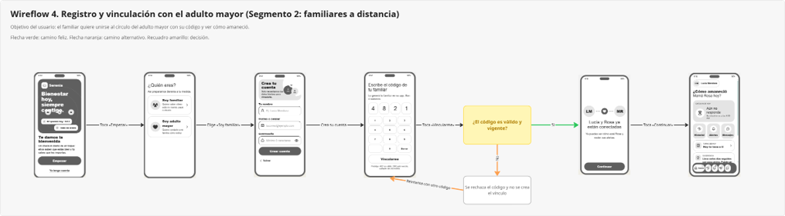
  <br/><i>Imagen X. Wireflow 4. Registro y vinculación con el adulto mayor (Segmento 2).</i>
</div>

El familiar abre Serenia, toca "Empezar", elige "Soy familiar" y crea su cuenta con su nombre, su correo o celular y una contraseña. Luego escribe en el teclado numérico el código de cuatro números que el adulto mayor generó en su propia aplicación y toca "Vincularme". La decisión del flujo es si el código es válido y vigente.

- **Camino feliz:** el código es válido, la aplicación confirma que ambos quedaron conectados y, al continuar, el familiar llega a su inicio, donde ve cómo amaneció el adulto mayor.
- **Camino alternativo:** el código es inválido o ya venció. Se rechaza el código, no se crea el vínculo y el familiar vuelve a la pantalla del código para intentarlo con otro, como establece el escenario 2 de la historia US02.

**Wireflow 5. Seguimiento del bienestar (Segmento 2)**

**User goal:** como familiar a distancia (user persona del segundo segmento, sección 2.3.1), quiero saber cómo está mi adulto mayor día a día, sin tener que llamarlo (historias US15, US17, US18 y US19). El flujo se muestra en la Imagen X.

<div align="center">

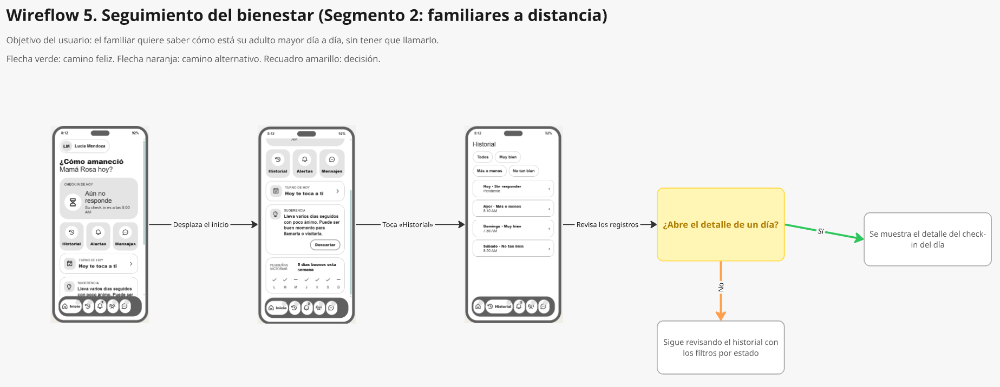
  <br/><i>Imagen X. Wireflow 5. Seguimiento del bienestar (Segmento 2).</i>
</div>

El flujo comienza en la pantalla de inicio de la aplicación del familiar, donde ve el estado del check-in de hoy. Al desplazarse por el inicio encuentra las "Pequeñas victorias" de la semana y, cuando el adulto mayor lleva varios días seguidos con poco ánimo, la sugerencia de bienestar. Luego entra a Historial, donde revisa los registros anteriores. La decisión del flujo es si abre el detalle de un día.

- **Camino feliz:** el familiar abre el detalle de un día y la aplicación muestra el check-in de esa fecha, con la respuesta del adulto mayor y la pregunta del día. Esa pantalla se presenta en el user flow correspondiente, con su mock-up.
- **Camino alternativo:** el familiar no abre ningún detalle y sigue revisando el historial con los filtros por estado ("Todos", "Muy bien", "Más o menos" y "No tan bien").

**Wireflow 6. Atender una alerta (Segmento 2)**

**User goal:** como familiar a distancia, quiero atender las alertas de mi adulto mayor y saber cuáles siguen pendientes (historias US14, US38 y US39). El flujo se muestra en la Imagen X.

<div align="center">

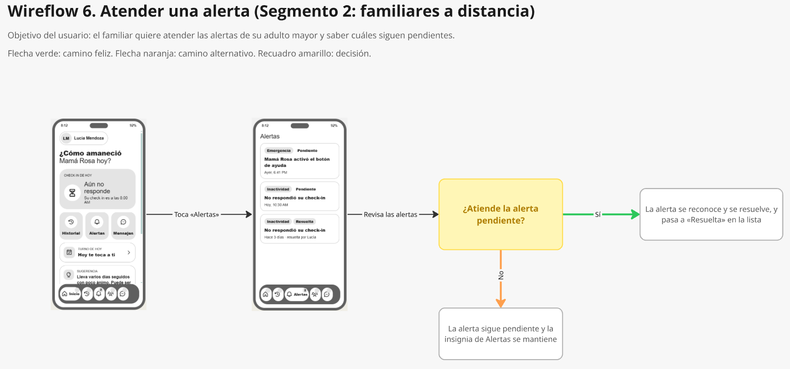
  <br/><i>Imagen X. Wireflow 6. Atender una alerta (Segmento 2).</i>
</div>

El flujo comienza en el inicio del familiar, donde el ícono de Alertas muestra una insignia con las alertas pendientes. Al tocarlo, el familiar entra a Alertas y ve la lista con los dos tipos de alerta ("Emergencia" e "Inactividad"), cada una con su estado de atención ("Pendiente" o "Resuelta"). La decisión del flujo es si atiende una alerta pendiente.

- **Camino feliz:** el familiar atiende la alerta. El sistema la reconoce y, cuando se resuelve, pasa a "Resuelta" en la lista, con el nombre de quien la resolvió.
- **Camino alternativo:** el familiar no atiende la alerta, que sigue "Pendiente", y la insignia de Alertas se mantiene hasta que alguien la atienda.

#### 3.1.4.3. Mobile Applications Mock-ups

Los mock-ups de Serenia traducen los requisitos funcionales del proyecto en pantallas de alta fidelidad. Su objetivo es validar con el equipo la jerarquía visual, la navegación y los estados de cada pantalla antes del desarrollo.

<br>

### Lineamientos de diseño

Se usó la identidad visual de Serenia, con una paleta cálida basada en verde azulado, fondos crema y acentos suaves. Los títulos van en Young Serif, el texto en Nunito y los datos puntuales en DM Mono, con íconos Phosphor. Ambas aplicaciones comparten el mismo menú inferior flotante en verde oscuro, donde la pestaña activa se resalta en blanco. La interfaz del adulto mayor prioriza textos grandes, botones amplios y una acción principal por pantalla. La del familiar prioriza un resumen rápido del estado de su ser querido, con el detalle a un toque.


### Decisiones de producto reflejadas

El acceso es solo con correo y contraseña. La vinculación se hace con un código que genera el adulto mayor y que el familiar ingresa en su aplicación. No hay planes ni precios, ni llamadas desde la aplicación, y la aplicación del adulto mayor no incluye audios que lean textos en voz alta. El único audio es el mensaje que el adulto mayor graba para su familia.

<br>

## Flujo del adulto mayor

El recorrido del adulto mayor comienza con la bienvenida, el ingreso a la cuenta y la creación de la cuenta. Luego accede a su aplicación, organizada en cuatro secciones: Inicio, Recordar, Familia y Cuenta. Desde el inicio responde su check-in diario con un toque, puede omitirlo si prefiere no responder, y dispone del botón "Ayuda" para avisar a su familia en una emergencia. En las demás secciones gestiona sus recordatorios, comparte fotos y audios con su familia, consulta su círculo y su código de invitación, y administra su cuenta.

<br>

<div align="center">

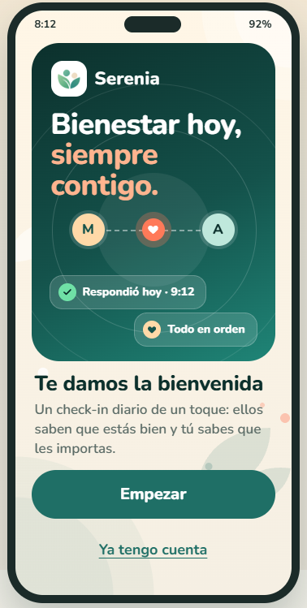

</div>

<br>

<div align="center">

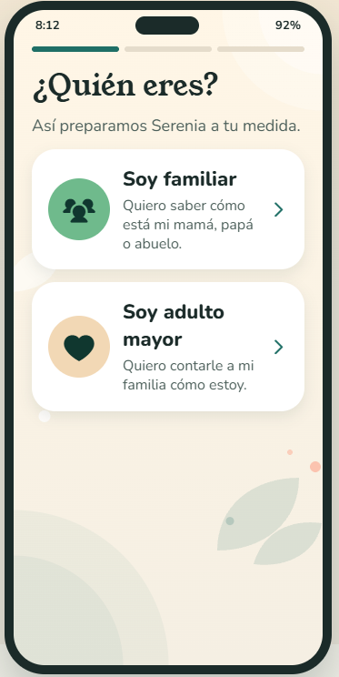

</div>

<br>

<div align="center">

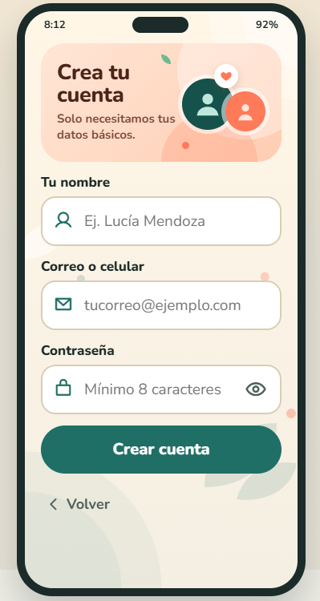

</div>

<br>

<div align="center">

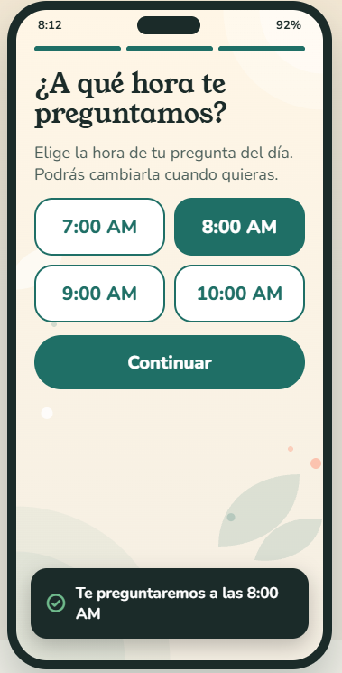

</div>

<br>

<div align="center">

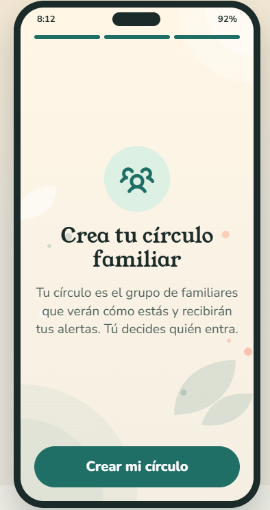

</div>

<br>

<div align="center">

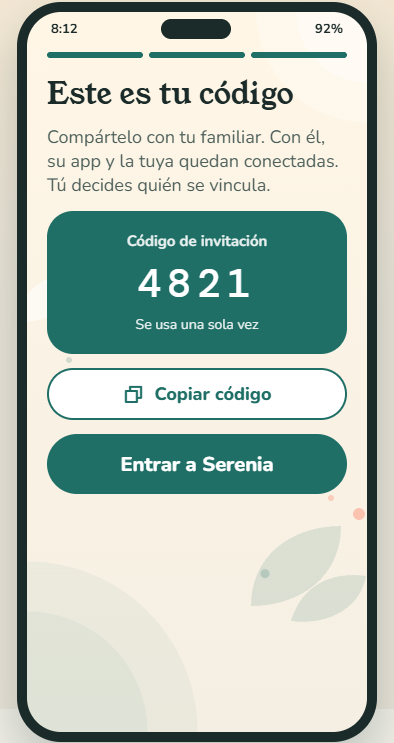

</div>

<br>

<div align="center">

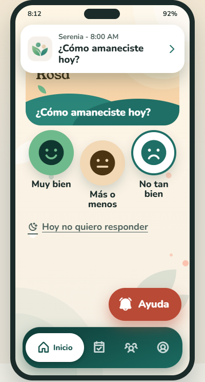

</div>

<br>

<div align="center">

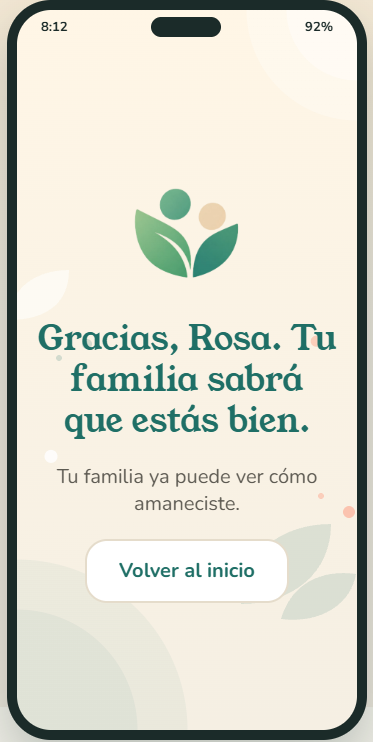

</div>

<br>

<div align="center">

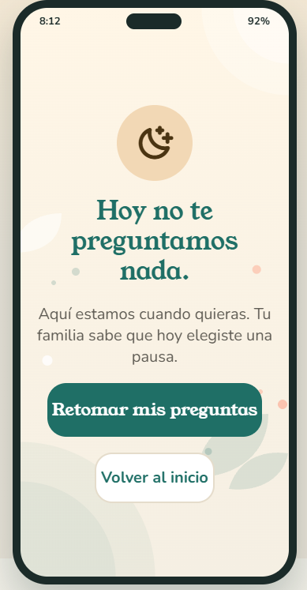

</div>

<br>

<div align="center">

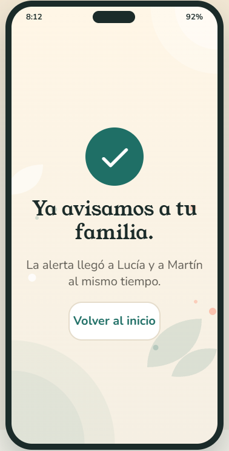

</div>

<br>

<div align="center">

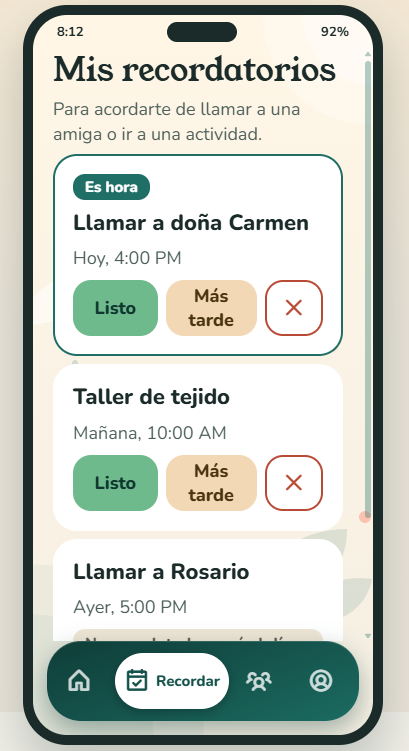

</div>

<br>

<div align="center">

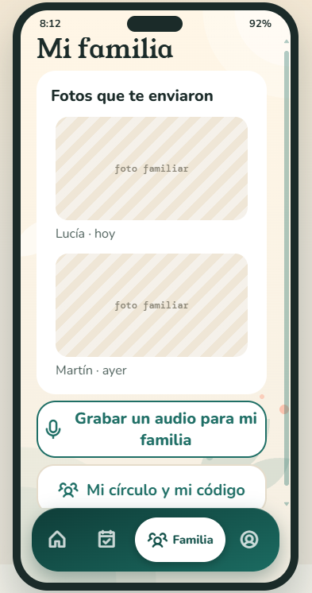

</div>

<br>

<div align="center">

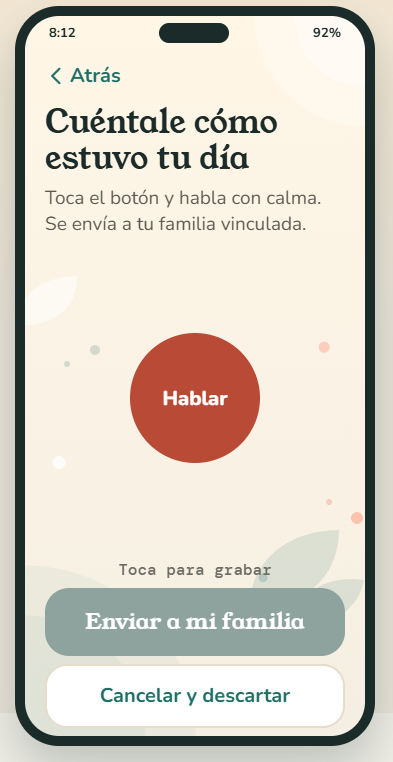

</div>

<br>

<div align="center">

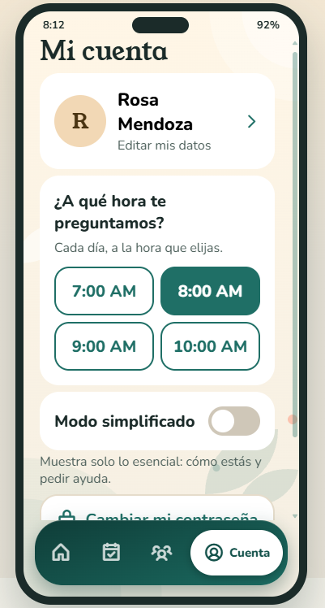

</div>

<br>

<div align="center">

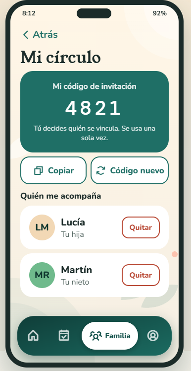

</div>

<br>

<div align="center">

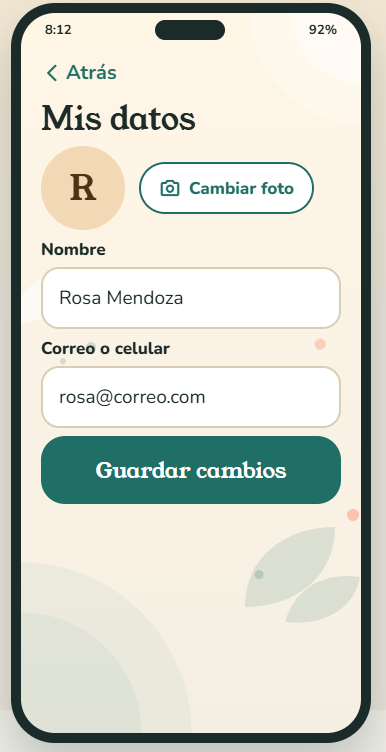

</div>

<br>

<div align="center">

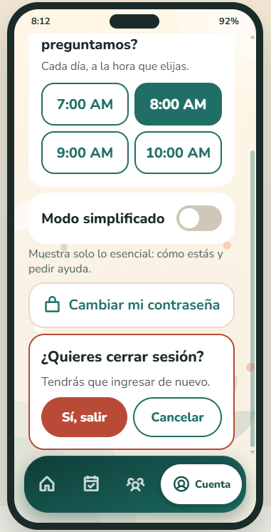

</div>

<br>

## Flujo del familiar

El recorrido del familiar comienza con la misma bienvenida, ingreso y creación de cuenta. Luego accede a su aplicación, organizada en cinco secciones: Inicio, Historial, Alertas, Círculo y Mensajes. En el inicio ve cómo amaneció su adulto mayor y accede al detalle de su check-in. En Historial revisa los registros anteriores y en Alertas atiende las emergencias y las inactividades. En Círculo gestiona a los familiares vinculados, los turnos de atención y las notas compartidas, y en Mensajes reproduce los audios y envía fotos.

<br>

<div align="center">


</div>

<br>

<div align="center">


</div>

<br>

<div align="center">


</div>

<br>

<div align="center">

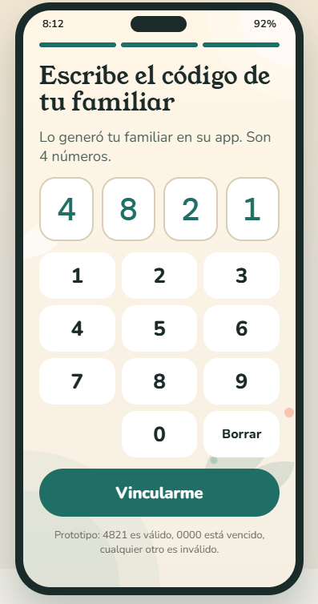

</div>

<br>

<div align="center">

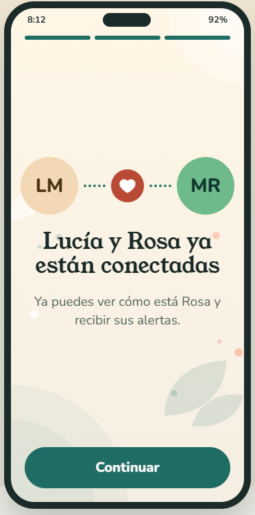

</div>

<br>

<div align="center">

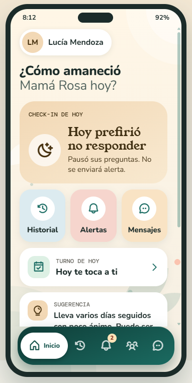

</div>

<br>

<div align="center">

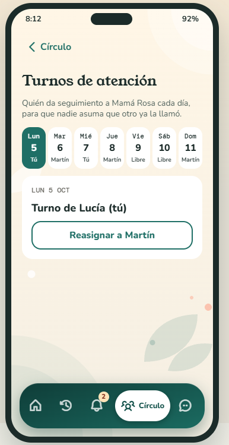

</div>

<br>

<div align="center">

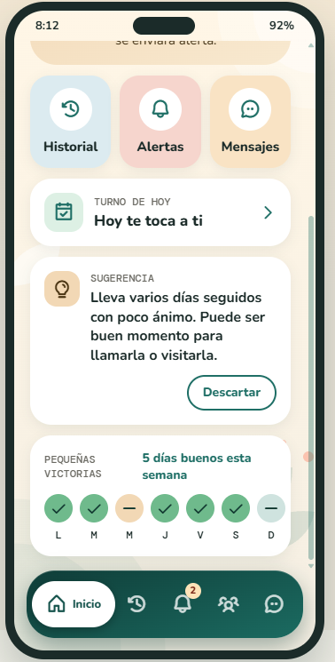

</div>

<br>

<div align="center">

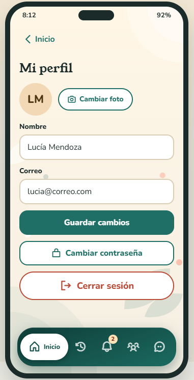

</div>

<br>

<div align="center">

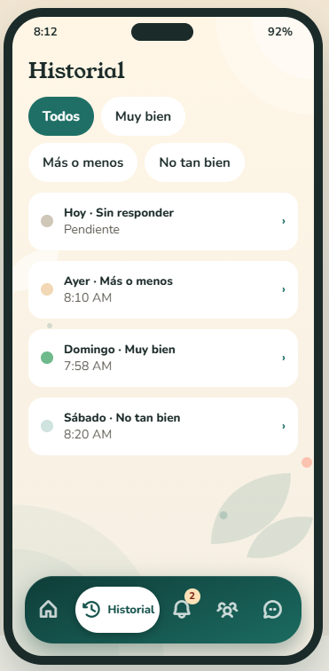

</div>

<br>

<div align="center">

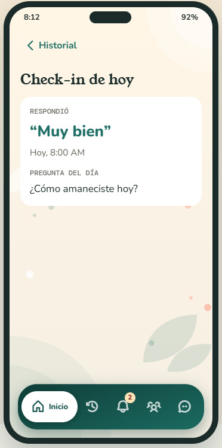

</div>

<br>

<div align="center">

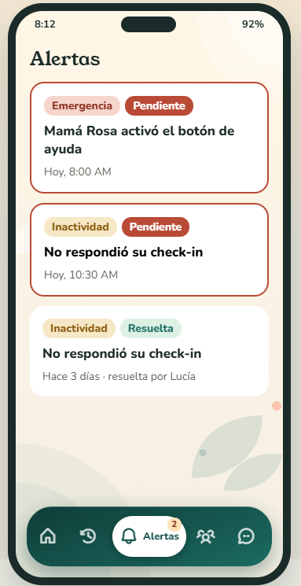

</div>

<br>

<div align="center">

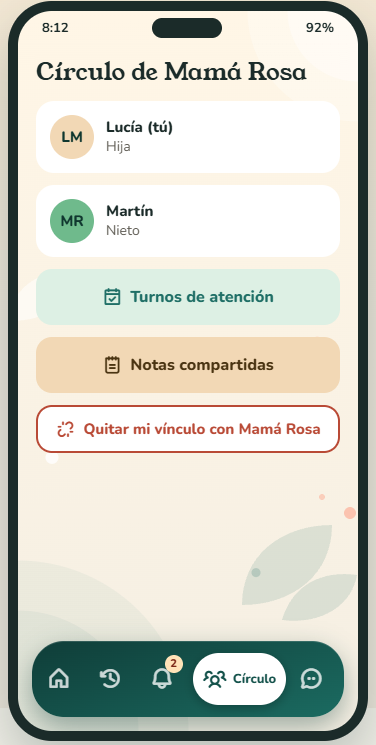

</div>

<br>

<div align="center">

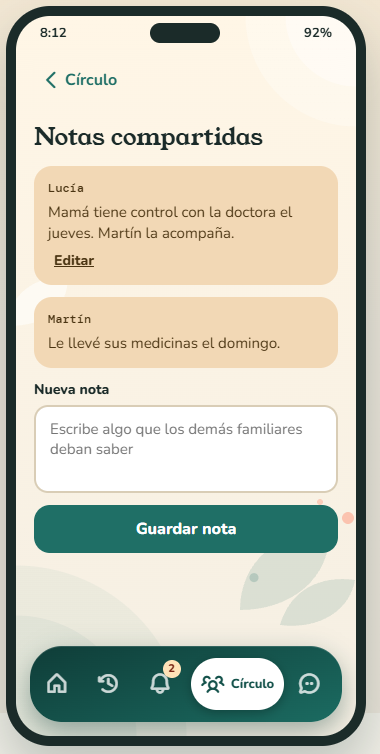

</div>

<br>

<div align="center">

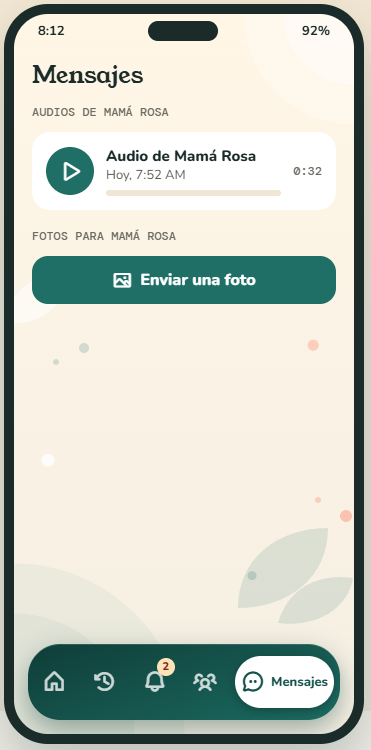

</div>

<br>

<div align="center">

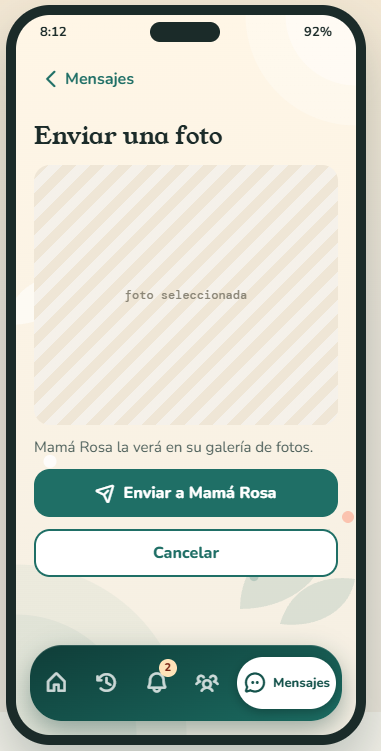

</div>

<br>

#### 3.1.4.4. Mobile Applications User Flow Diagrams

Un user flow muestra la ruta que sigue el usuario para lograr su objetivo, con las pantallas finales de la aplicación, el camino esperado (happy path) y las rutas alternativas (unhappy paths). Los user flows de esta sección se derivan de los wireflows de la sección 3.1.4.2, con la misma numeración y la misma organización por segmento: mantienen los mismos pasos, decisiones y resultados, y reemplazan los wireframes por los mock-ups de la sección 3.1.4.3, que incluyen el diseño visual definitivo. La lectura de los diagramas es la misma: flecha verde para el camino feliz, flecha naranja para el camino alternativo, recuadro amarillo para las decisiones y caja blanca para el resultado final.

**URL del tablero en Miro:** https://miro.com/app/board/uXjVEch8qjo=/?share_link_id=85197687422 (contiene los wireflows y los user flows en mayor tamaño).

**Segmento 1: adultos mayores que viven solos**

**User Flow 1. Registro y vinculación con la familia (Segmento 1)**

**User goal:** registrarse y crear su círculo familiar para obtener el código de invitación que compartirá con sus familiares. Esta ruta cumple las historias US01 (registro de cuenta de usuario), US05 (configuración del horario del check-in) y US40 (generación de código de invitación) y se muestra en la Imagen X.

<div align="center">

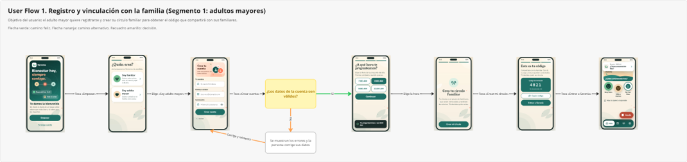
  <br/><i>Imagen X. User Flow 1. Registro y vinculación con la familia (Segmento 1).</i>
</div>

**Condiciones del flujo:** el adulto mayor crea su cuenta con los datos básicos que la aplicación pide; si algún dato no es válido, la pantalla indica el error y no avanza hasta que se corrige. Con la cuenta creada, elige la hora del día en que quiere recibir su pregunta (puede cambiarla después desde Cuenta), y la aplicación crea su círculo familiar, que desde ese momento tiene un único adulto mayor. El código de cuatro números que recibe se usa una sola vez, y es el adulto mayor quien decide con quién lo comparte; sin círculo y sin código, ninguna otra función de la aplicación tiene destinatario.

**User Flow 2. Check-in diario (Segmento 1)**

**User goal:** contar en un toque cómo amaneció, o dejar pasar el día sin responder si no lo desea. Esta ruta cumple las historias US03 (registro de respuesta del check-in) y US07 (pausa diaria de preguntas) y se muestra en la Imagen X.

<div align="center">

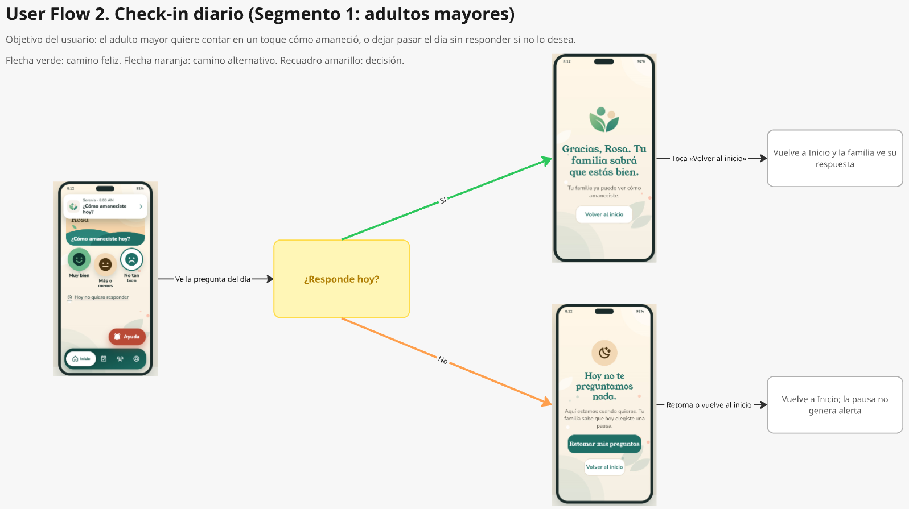
  <br/><i>Imagen X. User Flow 2. Check-in diario (Segmento 1).</i>
</div>

**Condiciones del flujo:** el check-in llega a la hora que el adulto mayor configuró, y el usuario decide si responde ese día. Si responde, la aplicación registra su estado de ánimo y lo agradece; si prefiere no hacerlo, activa la pausa del día, con lo que el sistema omite el check-in e informa a los familiares vinculados que hoy optó por no participar. En ninguno de los dos casos se genera una alerta. Si el adulto mayor no hace ninguna de las dos cosas y el plazo vence, se activa la evaluación de inactividad del bounded context Alerts and Safety (sección 2.6.6), que corresponde a otro flujo.

**User Flow 3. Pedir ayuda (Segmento 1)**

**User goal:** pedir ayuda de inmediato y que la familia lo sepa sin buscar a quién llamar. Esta ruta cumple las historias US13 (activación del botón de auxilio) y US14 (alerta inmediata al familiar) y se muestra en la Imagen X.

<div align="center">

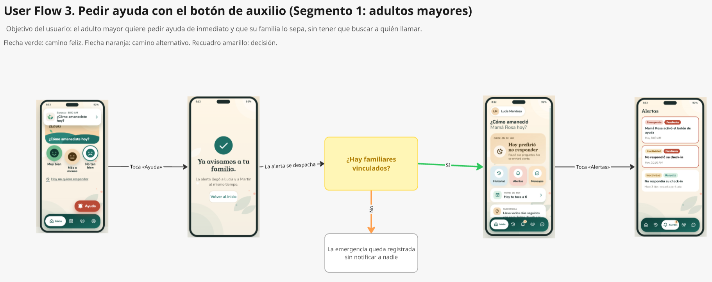
  <br/><i>Imagen X. User Flow 3. Pedir ayuda (Segmento 1).</i>
</div>

**Condiciones del flujo:** el botón "Ayuda" está siempre a la vista en la pantalla de inicio del adulto mayor, de modo que puede activarlo sin tener que buscarlo. Al activarlo, el sistema registra la emergencia y confirma al usuario que avisó a su familia. Si el círculo tiene familiares vinculados, todos reciben la alerta al mismo tiempo y la ven en la sección Alertas de su aplicación con las etiquetas "Emergencia" y "Pendiente". Si no hay familiares vinculados, la emergencia queda registrada con un despacho fallido y nadie es notificado.

**Segmento 2: familiares a distancia**

**User Flow 4. Registro y vinculación con el adulto mayor (Segmento 2)**

**User goal:** vincular su cuenta con la de su adulto mayor mediante un código de invitación, para ver cómo amaneció. Esta ruta cumple las historias US02 (vinculación familiar por código de invitación) y US40 (generación de código de invitación) y se muestra en la Imagen X.

<div align="center">

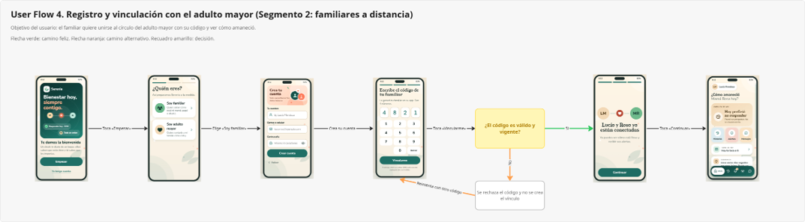
  <br/><i>Imagen X. User Flow 4. Registro y vinculación con el adulto mayor (Segmento 2).</i>
</div>

**Condiciones del flujo:** el adulto mayor genera previamente su código de invitación desde su aplicación; el código es de cuatro números y se usa una sola vez, por lo que él decide quién se vincula. El familiar crea su cuenta y escribe el código. Si es válido y vigente, el sistema registra el vínculo y habilita el acceso al panel de estado del adulto mayor. Si es inválido o ya venció, no se crea el vínculo y el familiar puede ingresar otro código.

**User Flow 5. Seguimiento del bienestar (Segmento 2)**

**User goal:** saber cómo está su adulto mayor día a día, sin tener que llamarlo. Esta ruta cumple las historias US15 (consulta del panel de estado diario), US17 (historial de check-ins), US18 (sugerencia de acción por patrón de malestar) y US19 (registro de pequeñas victorias) y se muestra en la Imagen X.

<div align="center">

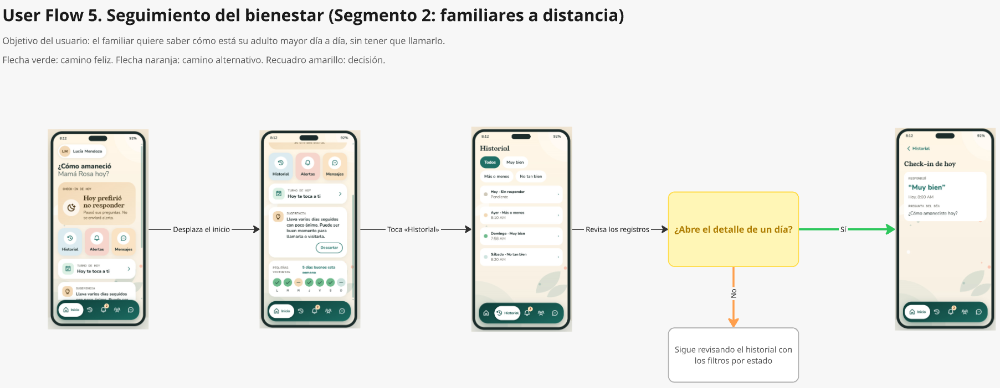
  <br/><i>Imagen X. User Flow 5. Seguimiento del bienestar (Segmento 2).</i>
</div>

**Condiciones del flujo:** el inicio del familiar muestra el check-in de hoy: si el adulto mayor respondió, aparece su estado de ánimo; si todavía no responde, aparece "Aún no responde" hasta que venza el plazo. Al desplazarse, el familiar ve las "Pequeñas victorias" de la semana y, si el adulto mayor completó tres días consecutivos de malestar, la sugerencia de bienestar, que puede descartar (historia US37). En Historial ve los registros ordenados del más reciente al más antiguo y puede filtrarlos por estado; al elegir un día se abre el detalle del check-in, con la respuesta y la pregunta de esa fecha.

**User Flow 6. Atender una alerta (Segmento 2)**

**User goal:** atender las alertas de su adulto mayor y saber cuáles siguen pendientes. Esta ruta cumple las historias US14 (alerta inmediata al familiar), US38 (reconocimiento de alertas) y US39 (resolución de alertas) y se muestra en la Imagen X.

<div align="center">

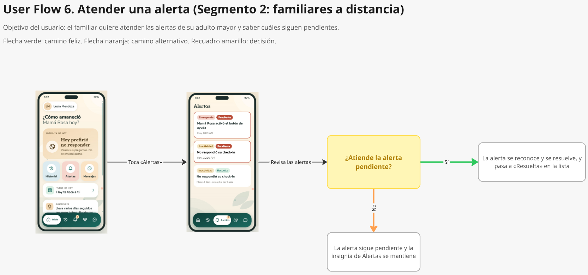
  <br/><i>Imagen X. User Flow 6. Atender una alerta (Segmento 2).</i>
</div>

**Condiciones del flujo:** la insignia del ícono de Alertas indica cuántas alertas siguen pendientes. En la lista, cada alerta muestra su tipo ("Emergencia" o "Inactividad") y su estado ("Pendiente" o "Resuelta"). Cada alerta admite un único reconocimiento y una única resolución: si dos familiares actúan al mismo tiempo, solo se aplica la primera acción, y así todos saben que alguien ya está atendiendo. Al resolverse, la alerta pasa a "Resuelta" y, si quien la resolvió lo desea, deja una nota que describe cómo se resolvió.

#### 3.1.4.5. Mobile Applications Prototyping

El prototipo interactivo de Serenia se construyó como una página navegable en Claude Artifacts. Muestra un solo teléfono en pantalla, con chips debajo para saltar entre los pasos del flujo (registro, vinculación, aplicación del adulto mayor y aplicación del familiar). Además de recorrerlo pantalla por pantalla, se puede probar la interacción entre ambas aplicaciones. Por ejemplo, la respuesta al check-in del adulto mayor se refleja en el inicio del familiar, una alerta de ayuda aparece en la lista de alertas del familiar, y un audio grabado por el adulto mayor queda disponible para su reproducción.

Enlace al prototipo: https://claude.ai/artifact/PQLMrSNqDntp1Fu4cfuvJu

Para probar la vinculación en el prototipo, el código válido es 4821 y el código expirado es 0000. Cualquier otro valor muestra el estado de código inválido.

<br>

<div align="center">


**Mobile Prototyping**


[Ver video de prototipo Mobile en Microsoft Stream]()

</div>

<br>

# Capítulo IV: Product Implementation & Validation
## 4. Product Implementation & Validation
## 4.1. Software Configuration Management
### 4.1.1. Software Development Environment Configuration
### 4.1.2. Source Code Management
El equipo utiliza GitHub como plataforma principal de control de versiones y colaboración. A continuación se indican los repositorios correspondientes a cada
producto del proyecto:

- **Informe:** https://github.com/upc-pre-202620-1acc0238-4945-vitalcare/serenia-report
- **Landing Page:** https://github.com/upc-pre-202620-1acc0238-4945-vitalcare/serenia-website
- **Platform:** https://github.com/upc-pre-202620-1acc0238-4945-vitalcare/serenia-platform

**Implementacion de Gitflow:**
El equipo implementa el modelo de ramificación GitFlow propuesto por Vincent Driessen como workflow de control de versiones. Este modelo establece una
estructura clara de ramas que permite gestionar el desarrollo de features, releases y correcciones de forma ordenada y trazable.

**Ramas principales**
- main: rama de producción. Contiene únicamente versiones estables y desplegadas del producto. Todo merge a esta rama representa una nueva versión
publicada.
- develop: rama de integración continua. Concentra el trabajo completado de cada feature branch antes de ser promovido a producción. Es la rama base
para el desarrollo del equipo.

**Feature branches**
Cada historia de usuario, tarea técnica o sección del informe requiere su propia rama de feature, creada a partir de develop y reintegrada a develop mediante
Pull Request una vez completada y revisada.

Convención de nomenclatura:

feature/<descripción-en-kebab-case>

Ejemplos aplicados durante el Sprint 1 en el repositorio del informe:
- feature/labeling-system
- feature/sprint-planning
- feature/source-code-style-guide
- feature/software-deployment-configuration
- feature/bounded-wellbeing
- feature/general-style-guidelines
- feature/product-design
- feature/new-event-storming
- feature/organization-systems
- feature/validation-interview
- feature/teams-collaboration-insights


Ejemplos aplicados durante el Sprint 1 en el repositorio del backend:

- feature/alerts-and-safety-application-layer
- feature/social-companionship
- feature/wellbeing-monitoring
- feature/daily-check-in
- feature/care-circle
- feature/identity-and-access

**Release branches**
Las ramas de release se crean a partir de develop cuando el conjunto de features planificado para una versión está completo y listo para ser estabilizado antes del despliegue a producción. Se aplica Semantic Versioning con el esquema MAJOR.MINOR.PATCH.

**Convención de nomenclatura:**
Ejemplos:
- release/v1.0.0 — primera versión estable de la Landing Page (Sprint 1)
- release/v1.1.0 — incorporacion del backend primera version (Sprint 1)
- release/v2.0.0 —  incorporacion del backend primera version (Sprint 2)

**Conventional Commits** 

El equipo aplica la especificación Conventional Commits para estandarizar los mensajes de commit, facilitando la trazabilidad del historial y la generaciónautomática de changelogs. La estructura adoptada es la siguiente:

Los tipos utilizados por el equipo son:

| Tipo | Uso |
|------|-----|
| `feat` | Implementación de una nueva funcionalidad o sección |
| `fix` | Corrección de un error en el código o documentación |
| `docs` | Cambios exclusivos en documentación del informe |
| `chore` | Tareas de configuración, setup o mantenimiento |
| `refactor` | Reestructuración de código sin cambio de funcionalidad |
| `style` | Cambios de estilos visuales o formato sin lógica |
| `test` | Adición o modificación de pruebas |

Ejemplos aplicados durante el Sprint 1:
- docs: add landing page UI design section
- feat(shared): add unsupported media type and payload too large errors
- fix(product):re-order us
- chore: ignore local tool settings


### 4.1.3. Source Code Style Guide & Conventions

Esta sección define cómo se nombran los elementos y cómo se escribe el código en cada lenguaje de la solución, con el fin de que cualquier integrante pueda leer y modificar el trabajo de otro sin esfuerzo. Aplica una regla común a todos los lenguajes: **todos los identificadores (clases, métodos, variables, tablas, columnas, archivos y pruebas) se escriben en inglés**, igual que los eventos y comandos definidos en el EventStorming (sección 2.5.1). El texto que ve el usuario final es la única excepción: se redacta en español y, en la landing page, se ofrece también en inglés.

<br>

**Lenguajes y referencias adoptadas**

| Producto | Lenguaje o formato | Convención estándar adoptada | Estado |
| --- | --- | --- | --- |
| Landing page web | HTML, CSS y JavaScript (Vite) | [Google HTML/CSS Style Guide](https://google.github.io/styleguide/htmlcssguide.html) y [Google JavaScript Style Guide](https://google.github.io/styleguide/jsguide.html) | Aplicada en la landing page |
| Web Services | Java 26 con Spring Boot | [Google Java Style Guide](https://google.github.io/styleguide/javaguide.html) en nombres y organización del código, con sangría de 4 espacios, y [Spring Boot Features](https://docs.spring.io/spring-boot/reference/features/index.html) | Aplicada en el backend |
| Aplicación móvil | Kotlin con Jetpack Compose | [Kotlin Coding Conventions](https://kotlinlang.org/docs/coding-conventions.html) y [Android Kotlin Style Guide](https://developer.android.com/kotlin/style-guide) | Aplicada en la aplicación móvil |

<br>

**Nomenclatura por capa (Web Services)**

Los nombres de las clases siguen los que el equipo definió para cada bounded context en la sección 2.6, de modo que el código y el diseño usen el mismo lenguaje ubicuo. La tabla resume el patrón que cumple el backend, con ejemplos reales de los contextos Alerts and Safety y Care Circle. El patrón se midió sobre los 557 archivos Java de `serenia-platform` al 8 de octubre de 2026, y cada categoría se cumple sin excepciones: por ejemplo, los 55 commands terminan en `Command` y los 26 servicios de aplicación terminan en `Impl`.

<br>

| Elemento | Regla | Ejemplo |
| --- | --- | --- |
| Aggregate y entidad | Clase con sustantivo en singular, en PascalCase | `Alert`, `EmergencyAlert`, `CareCircle` |
| Value object | `record` con un sustantivo que describe el dato; los identificadores llevan el sufijo `Id` y los estados son `enum` | `ResolutionNote`, `AlertId`, `AlertStatus` |
| Command | `record` con verbo en imperativo y sufijo `Command` | `TriggerEmergencyAlertCommand` |
| Query | `record` con prefijo `Get` y sufijo `Query` | `GetAlertByIdQuery` |
| Evento de dominio | `record` con un hecho en pasado, sin sufijo | `EmergencyAlertDispatched` |
| Repositorio y servicio de dominio | Interfaz sin prefijo, con el nombre del concepto | `EmergencyAlertRepository`, `AlertQueryService` |
| Implementación | Nombre de la interfaz más el sufijo `Impl` | `EmergencyAlertCommandServiceImpl`, `EmergencyAlertRepositoryImpl` |
| Manejador de eventos | Evento que atiende, más el sufijo `EventHandler` | `CheckInMissedEventHandler` |
| Servicio hacia otro contexto | Prefijo `External`, nombre del contexto y sufijo `Service` | `ExternalCareCircleService` |
| Persistencia | Sufijos `PersistenceEntity`, `JpaRepository` y `PersistenceMapper` | `AlertPersistenceEntity`, `AlertJpaRepository`, `EmergencyAlertPersistenceMapper` |
| Capa REST | Sufijos `Controller`, `Resource` (un `record`) y `Assembler`; los assemblers se nombran `<Resultado>From<Origen>Assembler` | `AlertsController`, `AlertResource`, `AlertResourceFromEntityAssembler` |
| Excepción | Sufijo `Exception`; las de cada contexto heredan de la excepción de dominio de ese contexto | `AlertAlreadyAcknowledgedException`, que hereda de `AlertsAndSafetyDomainException` |
| Métodos y variables | camelCase, con verbos para las acciones | `acknowledge`, `isOpen` |
| Constantes y valores de enumeración | MAYÚSCULAS con guion bajo | `MAX_LENGTH`, `DISPATCH_FAILED` |
| Tablas y columnas de base de datos | snake_case; tablas en plural; claves foráneas con sufijo `_id` y marcas de tiempo con sufijo `_at` | `alert_notifications`, `older_adult_id`, `triggered_at` |
| Rutas de la API | Prefijo `/api/v1`, con los recursos en plural y en kebab-case | `/api/v1/care-circles`, `/api/v1/check-in-preferences` |

<br>

**Formato y estilo del código Java**

| Aspecto | Convención aplicada |
| --- | --- |
| Sangría | 4 espacios y ninguna tabulación (ninguno de los 557 archivos usa tabulaciones) |
| Importaciones | Explícitas, sin comodines (solo 1 excepción en los 557 archivos) |
| Documentación | Javadoc en inglés en las clases (525 de 557 archivos), con enlaces `{@link}` y párrafos `<p>` para explicar las reglas de negocio |
| Objetos inmutables | `record` para commands, queries, eventos, value objects y resources (231 en total) |
| Persistencia | Entidades JPA con Lombok (`@Getter`, `@Setter` y `@NoArgsConstructor`) y tipos de columna explícitos, como `BINARY(16)` para los identificadores y `DATETIME(6)` para las fechas |
| Resultados | Los servicios de aplicación devuelven `Result<T, ApplicationError>` (por ejemplo, `Result<EmergencyAlert, ApplicationError>`) en lugar de lanzar excepciones hacia la capa REST |
| Valores ausentes | `Optional` en las consultas, en lugar de `null` |
| Mensajes de error | Claves en minúsculas separadas por puntos (`alert.resolution.note.blank`), cuyos textos están en `messages.properties` y `messages_es.properties` |
| Idioma | Identificadores, Javadoc y mensajes de commit en inglés |

<br>

**Landing page: convenciones aplicadas**

El sitio se construye con Vite, sin biblioteca de interfaz, por lo que sus convenciones se resumen en lo que el código ya cumple.

<br>

| Aspecto | Convención aplicada |
| --- | --- |
| Módulos | JavaScript con módulos ES (`import` y `export`), separados por responsabilidad: contenido y lógica en `main.js`, textos en inglés y español en `i18n.js` y plantillas en `templates.js` |
| Formato | Sangría de 2 espacios, comillas simples y ninguna tabulación |
| Declaraciones | `const` por defecto y `let` solo cuando el valor cambia; no se usa `var`; funciones flecha para la lógica |
| Nombres | camelCase para variables y funciones (`setState`); MAYÚSCULAS con guion bajo para constantes de contenido (`NAV`, `MOODS`, `FEATURES`) |
| Comentarios | Bloques con título para separar las partes del archivo (contenido, acciones, renderizado e idioma) y comentarios de una línea para explicar decisiones puntuales |
| HTML | Documento con `lang="es"`; estructura semántica con `header`, `nav`, `section` y `footer`; un solo `h1`; atributos `alt` en las imágenes y atributos `aria-` en los controles interactivos |
| Identificadores de sección | `id` en minúsculas, usados como anclas del menú: `como`, `familia`, `funciones` y `planes` |
| Internacionalización | El español es el idioma de origen y un diccionario lo traduce al inglés; el idioma elegido se recuerda en el navegador |
| SEO | Etiquetas `meta` de descripción, palabras clave y Open Graph, y datos estructurados, definidos en el encabezado de `index.html` |

<br>

**Nomenclatura y estilo de la aplicación móvil (Kotlin)**

La aplicación móvil se organiza por funcionalidad y sigue el mismo vocabulario de la landing y del backend: Home, Check-in y Alerts and Safety. Las convenciones de la tabla se midieron sobre los 29 archivos Kotlin de `serenia-app-native` al 9 de octubre de 2026, y se cumplen en todos los casos que alcanza cada regla: por ejemplo, los 3 ViewModels llevan `@HiltViewModel` y los 3 estados de pantalla son `data class`.

<br>

| Elemento | Regla | Ejemplo |
| --- | --- | --- |
| Paquetes | Base `com.vitalcare.serenia`, con una carpeta por funcionalidad que separa `domain` y `presentation`, más `core/designsystem` y `navigation` | `features/checkin/presentation/thanks` |
| Pantalla | Función `@Composable` en PascalCase con sufijo `Screen`, en un archivo propio | `HomeScreen`, `CheckInThanksScreen` |
| Estado de la pantalla | `data class` con sufijo `UiState` y valores por defecto | `HomeUiState` |
| ViewModel | Sufijo `ViewModel`, anotado con `@HiltViewModel` y con constructor `@Inject`; expone el estado como `StateFlow` de solo lectura mediante `asStateFlow()` | `HomeViewModel` |
| Navegación | Un grafo por funcionalidad con sufijo `NavGraph`, rutas tipadas con `@Serializable` y registro de cada grafo en `AppNavHost` | `CheckInNavGraph`, `AlertsAndSafetyNavGraph` |
| Dominio | Tipos propios de la funcionalidad; las constantes de un `enum` van en MAYÚSCULAS con guion bajo | `Mood.NOT_GOOD` |
| Sistema de diseño | Componentes reutilizables y tema de Material 3 en `core/designsystem`, dividido en `components`, `icon` y `theme` | `SereniaButtons`, `Theme` |

<br>

**Formato y estilo del código Kotlin**

| Aspecto | Convención aplicada |
| --- | --- |
| Sangría | 4 espacios y ninguna tabulación (ninguno de los 29 archivos usa tabulaciones) |
| Importaciones | Explícitas, sin comodines |
| Interfaz de usuario | Jetpack Compose con Material 3 (13 archivos); 34 funciones `@Composable` en 14 archivos y vistas previas con `@Preview` en 11 |
| Estado | Un `MutableStateFlow` privado dentro del ViewModel y actualizaciones con `update` y `copy` sobre el estado inmutable |
| Inyección de dependencias | Hilt, con `hilt-navigation-compose` para obtener los ViewModels en las pantallas |
| Comentarios | En inglés y de una línea, para explicar decisiones puntuales de diseño |
| Versiones | Kotlin 2.4.20, Android Gradle Plugin 9.4.1, `minSdk` 24 y `targetSdk` 37 |

<br>

### 4.1.4. Software Deployment Configuration

Esta sección explica cómo publicar cada producto de Serenia a partir de su repositorio de código, con los pasos suficientes para que otro integrante del equipo pueda repetir el despliegue. La evidencia de lo ejecutado en cada sprint, con sus capturas, se presenta en la sección 4.2.1.8 (Software Deployment Evidence for Sprint Review). Los tres productos de la solución se publican en plataformas distintas, como muestra el Deployment Diagram de la sección 2.5.3.3, que se repite en la Imagen X.

<br>

<div align="center">
  
  <br/><i>Imagen X. Deployment Diagram de Serenia.</i>
</div>

<br>

**Resumen por producto**

| Producto | Repositorio | Plataforma de despliegue | Qué se publica | Estado |
| --- | --- | --- | --- | --- |
| Landing page web | `serenia-website` | Netlify, conectado al repositorio de GitHub | La carpeta `dist`, generada con `npm run build` | Publicada en https://sereniaa.netlify.app/ |
| Web Services | `serenia-platform` | Microsoft Azure (Azure Web App Service para la API y MySQL Flexible Server para la base de datos) | Una imagen Docker de la API, que empaqueta el JAR ejecutable de Spring Boot | Desplegada en https://serenia-platform-api.azurewebsites.net |
| Aplicación móvil | `serenia-app-native` | Firebase App Distribution | Por definir | Por completar cuando el repositorio contenga el código |

Todos los repositorios pertenecen a la organización del equipo en GitHub (https://github.com/upc-pre-202620-1acc0238-4945-vitalcare). El código que se publica proviene de la rama `main`, que recibe los cambios desde `develop` mediante Pull Requests en cada entrega, según el flujo GitFlow adoptado por el equipo.

<br>

**Landing page web: despliegue en Netlify**

La landing page es un sitio estático construido con Vite, sin backend, sin variables de entorno ni servicios externos: el formulario de la lista de espera valida el correo en el propio navegador y no envía datos a ningún servidor. Por eso su despliegue consiste únicamente en construir el sitio y publicar el resultado. El sitio `sereniaa` de Netlify está conectado al repositorio `serenia-website` mediante la integración de Netlify con GitHub: cada Pull Request genera una verificación de despliegue y, al integrar cambios en la rama de producción, Netlify vuelve a construir y publicar el sitio.

<br>

*Requisitos previos*

| Requisito | Detalle |
| --- | --- |
| Node.js | Versión 20 LTS o superior. El repositorio no fija una versión; el mínimo que exige Vite 6 es la 18, y la construcción se verificó con la versión 24 y npm 11 |
| npm | El que se instala junto con Node.js |
| Git | Para clonar el repositorio |
| Cuenta de Netlify | Con acceso al sitio de Serenia |

<br>

*Pasos*

| Paso | Acción | Comando o detalle |
| --- | --- | --- |
| 1 | Clonar el repositorio y ubicarse en la rama que se va a publicar | `git clone https://github.com/upc-pre-202620-1acc0238-4945-vitalcare/serenia-website.git` y luego `cd serenia-website` |
| 2 | Instalar las dependencias exactas del archivo `package-lock.json` | `npm ci` |
| 3 | Revisar el sitio en local (opcional) | `npm run dev` abre el servidor de desarrollo |
| 4 | Construir el sitio para producción | `npm run build`, que ejecuta `vite build` y genera la carpeta `dist` |
| 5 | Comprobar el resultado de la construcción (opcional) | `npm run preview` sirve la carpeta `dist` en local |
| 6 | Publicar la carpeta `dist` completa en Netlify | Con la integración de GitHub, Netlify ejecuta `npm run build` y publica `dist` al integrar cambios en la rama de producción. También puede publicarse de forma manual, arrastrando la carpeta al panel de despliegues del sitio en Netlify o ejecutando `netlify deploy --prod --dir=dist` con la herramienta de línea de comandos de Netlify (`netlify-cli`) |
| 7 | Verificar el despliegue | Ver la tabla siguiente |

<br>

El resultado de la construcción queda en la carpeta `dist`, que se genera en el paso 4 y no se versiona en el repositorio. Su contenido es el sitio final: el `index.html`, la subcarpeta `assets` con los archivos JavaScript y CSS compilados y las imágenes, la subcarpeta `fonts`, los íconos del sitio, `robots.txt`, `sitemap.xml` y `site.webmanifest`. El despliegue en Netlify publica ese contenido.

<br>

*Verificación*

| Comprobación | Resultado |
| --- | --- |
| Construir la rama `develop` (commit `3967591`, 8 de octubre de 2026) | Genera `dist/assets/index-C64a7uLj.js` e `index-Db2Lbha2.css`, los mismos nombres que sirve el sitio publicado |
| Abrir https://sereniaa.netlify.app/ | La landing page carga con sus secciones y los enlaces del menú desplazan hasta cada una |
| Abrir `/src/main.js` y `/package.json` en el sitio | Responden con un error 404, lo que confirma que el sitio sirve únicamente el resultado de la construcción |
| Revisar las verificaciones de un Pull Request hacia `main` (por ejemplo, el PR #8 del 9 de octubre de 2026) | Netlify registra, para el proyecto `sereniaa`, las verificaciones Header rules, Redirect rules y Pages changed, con el enlace al despliegue correspondiente |
| Cambiar el idioma entre ES y EN | El texto se traduce y el idioma elegido se conserva al recargar |

<br>

**Web Services: configuración de despliegue**

La API de Serenia es un monolito modular de Spring Boot (sección 2.5.3.2) que se empaqueta como un único archivo JAR ejecutable, incluido en una imagen Docker. Según el Deployment Diagram, la imagen se ejecuta en un Azure Web App Service y la base de datos MySQL se aloja en Azure. El archivo `application.properties` define dos perfiles: `dev`, el predeterminado, para trabajar en local, y `prod`, que toma toda su configuración de variables de entorno.

<br>

*Requisitos previos*

| Requisito | Detalle |
| --- | --- |
| JDK | Versión 26, la que fija el archivo `pom.xml` |
| Maven | Incluido en el repositorio mediante el wrapper `mvnw` (`mvnw.cmd` en Windows), por lo que no requiere instalación aparte |
| Docker | Docker Desktop o Docker Engine, para construir y probar la imagen |
| Azure CLI | Para publicar la imagen y configurar el servicio desde la línea de comandos |
| MySQL | Un servidor MySQL con una base de datos ya creada, porque el perfil `prod` no la crea (`createDatabaseIfNotExist=false`); las tablas las genera Hibernate al arrancar la aplicación (`ddl-auto=update`) |
| Azure Blob Storage | Una cuenta de almacenamiento con un contenedor privado, donde la aplicación guarda los audios y las fotos de Social Companionship |
| Cuenta de Azure | Con permiso para crear el Web App Service |

<br>

*Variables de entorno de la API*

El perfil `prod` toma su configuración de las variables de la tabla siguiente. Las credenciales y las claves (`DATABASE_PASSWORD`, `JWT_SECRET` y `AZURE_STORAGE_CONNECTION_STRING`) se definen en la configuración del servicio donde se ejecuta la API y no forman parte del código ni del repositorio.

| Variable | Qué configura | Valor por defecto |
| --- | --- | --- |
| `SPRING_PROFILES_ACTIVE` | Activa el perfil de producción cuando toma el valor `prod` | `dev` |
| `DATABASE_URL` | Servidor MySQL al que se conecta la API | Ninguno (obligatoria) |
| `DATABASE_PORT` | Puerto del servidor MySQL | `3306` |
| `DATABASE_NAME` | Nombre de la base de datos | Ninguno (obligatoria) |
| `DATABASE_USER` y `DATABASE_PASSWORD` | Credenciales de la base de datos | Ninguno (obligatorias) |
| `JWT_SECRET` | Clave con la que se firman los tokens de sesión | Ninguno (obligatoria) |
| `AZURE_STORAGE_CONNECTION_STRING` | Cadena de conexión de la cuenta de Blob Storage | Ninguno (obligatoria) |
| `AZURE_STORAGE_CONTAINER` | Nombre del contenedor de archivos | `serenia-media` |
| `MEDIA_STORAGE_PROVIDER` | Proveedor de almacenamiento de archivos | `azure` en el perfil `prod` |
| `PORT` | Puerto en el que escucha la API | `8080` |

<br>

*Construcción y despliegue*

El repositorio incluye un `Dockerfile` y un `docker-compose.yml`. El `Dockerfile` tiene dos etapas: la primera compila con Maven sobre una imagen con JDK 26 (`./mvnw -DskipTests package`) y la segunda ejecuta el JAR sobre una imagen con JRE 26, con un usuario sin privilegios y el perfil `prod` activo. El `docker-compose.yml` expone el puerto 8080 y toma todos los valores de variables de entorno.

| Paso | Acción | Comando o detalle |
| --- | --- | --- |
| 1 | Clonar el repositorio y ubicarse en la rama que se va a publicar | `git clone https://github.com/upc-pre-202620-1acc0238-4945-vitalcare/serenia-platform.git` |
| 2 | Construir la imagen Docker | `docker build -t serenia-platform:1.0.0 .` |
| 3 | Probar la imagen en local | `docker compose --env-file <archivo de variables> up --build`, con las variables obligatorias de la tabla anterior y la API disponible en `http://localhost:8080` |
| 4 | Publicar la imagen en un Azure Container Registry | `az acr login`, `docker tag` y `docker push` hacia el registro de contenedores |
| 5 | Crear el Azure Web App Service para contenedores con esa imagen | Puerto 8080 y las variables de entorno de la tabla anterior, configuradas en el servicio |
| 6 | Verificar el despliegue | Ver la tabla siguiente |

La única prueba del proyecto, `SereniaPlatformApplicationTests`, levanta la aplicación completa y necesita un servidor MySQL accesible con las credenciales del perfil `dev`; por eso la construcción del JAR para el despliegue omite las pruebas con `-DskipTests`.

<br>

*Verificación*

| Comprobación | Resultado |
| --- | --- |
| Construir el proyecto con Java 26 (8 de octubre de 2026) | Se compilan los 557 archivos fuente sin errores |
| Abrir https://serenia-platform-api.azurewebsites.net/swagger-ui/index.html (9 de octubre de 2026) | Responde 200 y muestra la documentación interactiva de la API, generada por springdoc |
| Consultar `/v3/api-docs` en el servicio | Devuelve la definición OpenAPI con 56 operaciones en 17 grupos, que parten de `/api/v1` |
| Consultar un endpoint protegido sin token, por ejemplo `/api/v1/alerts` | Responde 401 Unauthorized, lo que confirma que la API exige el token JWT |

<br>

**Aplicación móvil**

El Deployment Diagram establece que la aplicación móvil se distribuye mediante Firebase App Distribution. El repositorio `serenia-app-native` contiene el proyecto Android de la aplicación, escrito en Kotlin con Jetpack Compose y construido con Gradle.

| Aspecto | Detalle |
| --- | --- |
| Repositorio | `serenia-app-native`, con las ramas `main` y `develop` y una rama `feature/<funcionalidad>` por cada funcionalidad |
| Identificador de la aplicación | `com.vitalcare.serenia`, versión 1.0 (`versionCode` 1) |
| Versiones de construcción | Android Gradle Plugin 9.4.1, Kotlin 2.4.20, `minSdk` 24 y `targetSdk` 37 |
| Construcción | Abrir el proyecto en Android Studio y ejecutarlo en un emulador o en un dispositivo; desde la línea de comandos, `./gradlew assembleDebug` genera el APK de depuración |
| Distribución | Firebase App Distribution, según el Deployment Diagram: se sube cada versión al proyecto de Firebase y se invita a los testers para instalarla |

<br>

## 4.2. Landing Page & Mobile Application Implementation
### 4.2.1. Sprint 1
#### 4.2.1.1. Sprint Planning 1
| **Sprint 1** | Sprint 1 |
|---|---|
| **Sprint Planning Background** | |
| Date | 2026-09-23 |
| Time | 16:00 PM |
| Location | Universidad Peruana de Ciencias Aplicadas - Pabellon I |
| Prepared By | Gallardo Morales, Carla Alejandra |
| Attendees (to planning meeting) | Contreras Torres, Arturo Valentino / Gallardo Morales, Carla Alejandra /Garcia Paredes, Victor Manuel / Salinas Guzman, Brianna Cristina / Sandoval Aiquipa, Kelber Yamir
| **Sprint Goal & User Stories** | |
| Sprint 1 Goal | Nuestro objetivo es presentar la propuesta de valor de Serenia. Creemos brinda confianza y seguridad a los adultos mayores y a sus familiares, los cuales buscan una plataforma en la que puedan apoyarse para tener bajo supervicion a su familiar adulto mayor que vive solo|
| Sprint 1 Velocity | 80 |
| Sum of Story Points | 64 |
#### 4.2.1.2. Aspect Leaders and Collaborators
#### 4.2.1.3. Sprint Backlog 1
#### 4.2.1.4. Development Evidence for Sprint Review
#### 4.2.1.5. Testing Suite Evidence for Sprint Review
#### 4.2.1.6. Execution Evidence for Sprint Review
#### 4.2.1.7. Services Documentation Evidence for Sprint Review
Durante el Sprint 1 el alcance del equipo estuvo centrado en el desarrollo y despliegue de la Landing Page de Serenia, correspondiente a un sitio estático informativo, y en el avance de aproximadamente el 70 % del backend de la plataforma (**Serenia Platform**). Dicho backend está construido con Spring Boot 4.0.6 y Java 26, organizado bajo Domain-Driven Design en seis bounded contexts (`iam`, `carecircle`, `dailycheckin`, `alertsandsafety`, `socialcompanionship` y `wellbeingmonitoring`), y expone una RESTful API versionada bajo el prefijo `/api/v1`.

Como parte de este avance, se documentaron con OpenAPI **56 endpoints agrupados en 17 recursos**. La especificación se genera automáticamente a partir de las anotaciones de los controladores (`@Tag`, `@Operation`, `@ApiResponses`, `@Schema`) mediante `springdoc-openapi-starter-webmvc-ui` 3.0.3, y se publica en Swagger UI. 

| Recurso | URL |
|---|---|
| Swagger UI | .. |
| Especificación OpenAPI (JSON) | .. |

### Convenciones generales de la API

- **URL base:** `colocar`.
- **Formato:** todas las peticiones y respuestas usan `application/json`, salvo la subida de audios y fotos (`multipart/form-data`) y la descarga de archivos multimedia (`/media`).
- **Autenticación:** la API es *stateless* y usa JWT. Solo `POST /api/v1/users` (registro) y `POST /api/v1/sessions` (inicio de sesión) son públicos; el resto de endpoints exige la cabecera `Authorization: Bearer <token>`, con el token obtenido al iniciar sesión (válido por 7 días). La documentación declara el esquema de seguridad `bearerAuth` (HTTP, bearer, JWT), lo que habilita el botón **Authorize** de Swagger UI.
- **Identificadores y fechas:** los identificadores son UUID. Los instantes se almacenan y devuelven en UTC (ISO-8601, p. ej. `2026-10-07T15:00:00Z`); las fechas y horas locales (`shiftDate`, `checkDate`, `remindAt`, `reminderTime`) se interpretan en la zona horaria del adulto mayor.
- **Formato de error:** toda respuesta de error devuelve un objeto con `code` (código de máquina, p. ej. `VALIDATION_ERROR`, `FORBIDDEN`, `BUSINESS_RULE_VIOLATION`, `<ENTIDAD>_NOT_FOUND`, `<ENTIDAD>_CONFLICT`), `message` (mensaje localizado según el idioma de la petición) y `details` (opcional).

```json
{
  "code": "VALIDATION_ERROR",
  "message": "<mensaje localizado>",
  "details": "<detalle del campo o de la regla incumplida>"
}
```

| Código HTTP | Significado en Serenia Platform |
|---|---|
| `400` | Datos de entrada inválidos (`VALIDATION_ERROR`) |
| `401` | Token ausente o inválido, o credenciales incorrectas |
| `403` | El usuario no tiene permiso sobre el recurso (no es el dueño, ni familiar vinculado) |
| `404` | Recurso no encontrado (`*_NOT_FOUND`) |
| `409` | Conflicto de estado (`*_CONFLICT`), p. ej. alerta ya reconocida |
| `413` / `415` | Archivo demasiado grande (máx. 10 MB) / tipo de archivo no soportado |
| `422` | Regla de negocio incumplida (`BUSINESS_RULE_VIOLATION`) |

### Relación de endpoints documentados

Los enlaces de la columna *Documentación* apuntan a la sección (tag) correspondiente de Swagger UI en el entorno local.

| Bounded context | Endpoint | Acciones implementadas | Documentación (URL local) |
|---|---|---|---|
| IAM | `/api/v1/users` | `POST` registrar usuario · `GET` obtener por id · `PUT` actualizar perfil · `PUT` actualizar foto · `PUT` cambiar contraseña | [Users](http://localhost:8080/swagger-ui/index.html#/Users) |
| IAM | `/api/v1/sessions` | `POST` iniciar sesión · `DELETE` cerrar sesión | [Sessions](http://localhost:8080/swagger-ui/index.html#/Sessions) |
| Care Circle | `/api/v1/care-circles` | `GET` por id · `GET` por adulto mayor | [Care Circles](http://localhost:8080/swagger-ui/index.html#/Care%20Circles) |
| Care Circle | `/api/v1/care-circles/{careCircleId}/invitation-codes` | `POST` generar código · `GET` códigos pendientes | [Invitation Codes](http://localhost:8080/swagger-ui/index.html#/Invitation%20Codes) |
| Care Circle | `/api/v1/family-links` y `/api/v1/care-circles/{careCircleId}/family-links` | `POST` canjear código · `GET` vínculos de un familiar · `GET` vínculos de un círculo · `DELETE` revocar vínculo | [Family Links](http://localhost:8080/swagger-ui/index.html#/Family%20Links) |
| Care Circle | `/api/v1/care-circles/{careCircleId}/care-shifts` | `POST` asignar turno · `GET` consultar turnos · `PUT` reasignar turno | [Care Shifts](http://localhost:8080/swagger-ui/index.html#/Care%20Shifts) |
| Care Circle | `/api/v1/care-circles/{careCircleId}/shared-notes` | `POST` crear nota · `GET` listar notas · `PUT` editar nota | [Shared Notes](http://localhost:8080/swagger-ui/index.html#/Shared%20Notes) |
| Daily Check-in | `/api/v1/check-ins` | `GET` check-in de hoy · `GET` historial · `POST` responder check-in | [Check-ins](http://localhost:8080/swagger-ui/index.html#/Check-ins) |
| Daily Check-in | `/api/v1/check-in-preferences` | `GET` preferencias · `PUT` hora del check-in · `POST` pausar hoy · `DELETE` reanudar hoy · `PUT` modo simplificado | [Check-in Preferences](http://localhost:8080/swagger-ui/index.html#/Check-in%20Preferences) |
| Alerts and Safety | `/api/v1/alerts` | `GET` alertas de un adulto mayor · `GET` detalle de alerta | [Alerts](http://localhost:8080/swagger-ui/index.html#/Alerts) |
| Alerts and Safety | `/api/v1/emergency-alerts` | `POST` botón de ayuda · `POST` reconocer · `POST` resolver | [Emergency Alerts](http://localhost:8080/swagger-ui/index.html#/Emergency%20Alerts) |
| Alerts and Safety | `/api/v1/inactivity-alerts` | `POST` reconocer · `POST` resolver | [Inactivity Alerts](http://localhost:8080/swagger-ui/index.html#/Inactivity%20Alerts) |
| Social Companionship | `/api/v1/care-circles/{careCircleId}/audio-messages` | `POST` grabar · `POST` compartir · `DELETE` descartar · `GET` listar · `GET` archivo · `POST` reproducir | [Audio Messages](http://localhost:8080/swagger-ui/index.html#/Audio%20Messages) |
| Social Companionship | `/api/v1/care-circles/{careCircleId}/photo-messages` | `POST` subir · `POST` compartir · `DELETE` descartar · `GET` listar · `GET` archivo · `POST` marcar como vista | [Photo Messages](http://localhost:8080/swagger-ui/index.html#/Photo%20Messages) |
| Social Companionship | `/api/v1/social-reminders` | `POST` programar · `GET` activos · `POST` posponer · `POST` completar · `POST` cancelar | [Social Reminders](http://localhost:8080/swagger-ui/index.html#/Social%20Reminders) |
| Wellbeing Monitoring | `/api/v1/small-wins` | `GET` pequeños logros por rango de fechas | [Small Wins](http://localhost:8080/swagger-ui/index.html#/Small%20Wins) |
| Wellbeing Monitoring | `/api/v1/wellbeing-suggestions` | `GET` sugerencias activas · `POST` descartar sugerencia | [Wellbeing Suggestions](http://localhost:8080/swagger-ui/index.html#/Wellbeing%20Suggestions) |

### Detalle de acciones por endpoint

En cada tabla, los parámetros marcados con `*` son obligatorios. Los *path parameters* y *query parameters* son de tipo UUID, salvo que se indique otro tipo. Salvo que se indique lo contrario, todas las acciones requieren `Authorization: Bearer <token>`.

---

#### Users — `/api/v1/users`

Registro de adultos mayores y familiares lejanos, y gestión del perfil. Las modificaciones solo proceden si `{userId}` corresponde al usuario autenticado.

| Verbo | Sintaxis de llamada | Parámetros | Response |
|---|---|---|---|
| `POST` | `/api/v1/users` (pública) | **Body** `RegisterUserRequest`: `email`*, `password`* (8–72), `role`* (`OLDER_ADULT` \| `DISTANT_RELATIVE`), `fullName`* (≤120), `phoneNumber` (E.164), `birthDate` (no futura), `locale`*, `timeZone`* | `201` `UserResponse` · `400` datos inválidos · `409` correo ya registrado |
| `GET` | `/api/v1/users/{userId}` | **Path** `userId`* | `200` `UserResponse` · `401` · `404` usuario no encontrado |
| `PUT` | `/api/v1/users/{userId}/profile` | **Path** `userId`* · **Body** `fullName`*, `phoneNumber`, `birthDate`, `locale`*, `timeZone`* | `200` `UserResponse` · `400` · `403` no es el dueño de la cuenta · `404` |
| `PUT` | `/api/v1/users/{userId}/photo` | **Path** `userId`* · **Body** `photoUrl`* | `200` `UserResponse` · `400` · `403` · `404` |
| `PUT` | `/api/v1/users/{userId}/password` | **Path** `userId`* · **Body** `currentPassword`*, `newPassword`* (8–72) | `204` sin contenido; revoca las demás sesiones activas · `400` · `403` · `404` · `422` contraseña actual incorrecta |

**Ejemplo — registrar usuario** (`POST /api/v1/users`)

```json
{
  "email": "rosa.mendez@example.com",
  "password": "secret123",
  "role": "OLDER_ADULT",
  "fullName": "Rosa Mendez Solorzano",
  "phoneNumber": "+51987654321",
  "birthDate": "1948-05-12",
  "locale": "es-PE",
  "timeZone": "America/Lima"
}
```

**Response `201 Created`:** devuelve la representación pública de la cuenta, sin datos sensibles (no incluye la contraseña). El campo `status` indica el estado de la cuenta.

```json
{
  "id": "3f2b8c9e-6a1d-4f0e-9b7a-2c5d8e1f4a6b",
  "email": "rosa.mendez@example.com",
  "role": "OLDER_ADULT",
  "fullName": "Rosa Mendez Solorzano",
  "phoneNumber": "+51987654321",
  "birthDate": "1948-05-12",
  "photoUrl": null,
  "locale": "es-PE",
  "timeZone": "America/Lima",
  "status": "ACTIVE"
}
```

---

#### Sessions — `/api/v1/sessions`

Inicio y cierre de sesión. Al iniciar sesión se abre una sesión y se emite el token JWT que se usa en el resto de la API.

| Verbo | Sintaxis de llamada | Parámetros | Response |
|---|---|---|---|
| `POST` | `/api/v1/sessions` (pública) | **Body** `SignInRequest`: `email`*, `password`*, `deviceInfo` (≤200) | `201` `AuthenticatedUserResponse` · `400` · `401` correo o contraseña inválidos · `422` cuenta no activa |
| `DELETE` | `/api/v1/sessions/{sessionId}` | **Path** `sessionId`* | `204` sesión cerrada · `401` · `403` la sesión es de otro usuario · `404` |

**Ejemplo — iniciar sesión** (`POST /api/v1/sessions`)

```json
{
  "email": "rosa.mendez@example.com",
  "password": "secret123",
  "deviceInfo": "Android 14 - Samsung A54"
}
```

**Response `201 Created`:** `sessionId` identifica la sesión abierta (se usa para cerrarla), `token` es el JWT que debe enviarse como `Bearer`, `expiresAt` indica su vencimiento en UTC y `user` es el usuario autenticado.

```json
{
  "sessionId": "9a7c1e2d-3b4f-4c5d-8e6f-7a8b9c0d1e2f",
  "token": "eyJhbGciOiJIUzI1NiJ9...",
  "expiresAt": "2026-10-14T15:30:00Z",
  "user": {
    "id": "3f2b8c9e-6a1d-4f0e-9b7a-2c5d8e1f4a6b",
    "email": "rosa.mendez@example.com",
    "role": "OLDER_ADULT",
    "fullName": "Rosa Mendez Solorzano",
    "locale": "es-PE",
    "timeZone": "America/Lima",
    "status": "ACTIVE"
  }
}
```

---

#### Care Circles — `/api/v1/care-circles`

Círculo de cuidado de un adulto mayor. Pueden consultarlo su dueño y los familiares con vínculo activo.

| Verbo | Sintaxis de llamada | Parámetros | Response |
|---|---|---|---|
| `GET` | `/api/v1/care-circles/{careCircleId}` | **Path** `careCircleId`* | `200` `CareCircleResponse` · `403` no es dueño ni familiar activo · `404` |
| `GET` | `/api/v1/care-circles?olderAdultId={olderAdultId}` | **Query** `olderAdultId`* | `200` `CareCircleResponse` · `403` · `404` |

**Response `200 OK`:**

```json
{
  "id": "6b1f0c2e-8d4a-4b7e-9f3c-1a2b3c4d5e6f",
  "olderAdultId": "3f2b8c9e-6a1d-4f0e-9b7a-2c5d8e1f4a6b",
  "createdAt": "2026-10-07T15:30:00Z"
}
```

---

#### Invitation Codes — `/api/v1/care-circles/{careCircleId}/invitation-codes`

Códigos de invitación que el adulto mayor comparte con un familiar para que se una a su círculo. Cada código vence a las 48 horas.

| Verbo | Sintaxis de llamada | Parámetros | Response |
|---|---|---|---|
| `POST` | `/api/v1/care-circles/{careCircleId}/invitation-codes` | **Path** `careCircleId`* · sin body | `201` `InvitationCodeResponse` · `403` solo el adulto mayor dueño puede generar códigos · `404` |
| `GET` | `/api/v1/care-circles/{careCircleId}/invitation-codes` | **Path** `careCircleId`* | `200` lista de `InvitationCodeResponse` canjeables · `403` · `404` |

**Response `201 Created`:** `code` es el valor que se comparte con el familiar, `status` es `PENDING` hasta que se canjea (`USED`) o vence (`EXPIRED`), y `expiresAt` indica hasta cuándo puede canjearse.

```json
{
  "id": "a1b2c3d4-e5f6-4a7b-8c9d-0e1f2a3b4c5d",
  "code": "K7M4QX2P",
  "status": "PENDING",
  "expiresAt": "2026-10-09T15:30:00Z"
}
```

---

#### Family Links — `/api/v1/family-links` y `/api/v1/care-circles/{careCircleId}/family-links`

Vínculo de un familiar con un círculo de cuidado. El adulto mayor puede revocar cualquier vínculo de su círculo; un familiar, solo el suyo.

| Verbo | Sintaxis de llamada | Parámetros | Response |
|---|---|---|---|
| `POST` | `/api/v1/family-links` | **Body** `RedeemInvitationCodeRequest`: `code`*, `relationshipLabel` (≤60) | `201` `FamilyLinkResponse` · `403` no es un familiar lejano activo · `404` código no encontrado · `409` código usado, vencido o familiar ya vinculado |
| `GET` | `/api/v1/family-links?relativeId={relativeId}` | **Query** `relativeId`* | `200` lista de `FamilyLinkResponse` activos · `403` un familiar solo consulta sus propios vínculos |
| `GET` | `/api/v1/care-circles/{careCircleId}/family-links` | **Path** `careCircleId`* | `200` lista de `FamilyLinkResponse` · `403` · `404` |
| `DELETE` | `/api/v1/care-circles/{careCircleId}/family-links/{familyLinkId}` | **Path** `careCircleId`*, `familyLinkId`* | `204` vínculo revocado · `403` · `404` · `409` ya revocado |

**Ejemplo — canjear código** (`POST /api/v1/family-links`)

```json
{
  "code": "K7M4QX2P",
  "relationshipLabel": "hija"
}
```

**Response `201 Created`:**

```json
{
  "id": "c3d4e5f6-a7b8-4c9d-8e0f-1a2b3c4d5e6f",
  "careCircleId": "6b1f0c2e-8d4a-4b7e-9f3c-1a2b3c4d5e6f",
  "relativeId": "9d8c7b6a-5f4e-4d3c-8b2a-1f0e9d8c7b6a",
  "relationshipLabel": "hija",
  "status": "ACTIVE",
  "linkedAt": "2026-10-07T16:00:00Z"
}
```

---

#### Care Shifts — `/api/v1/care-circles/{careCircleId}/care-shifts`

Turnos diarios de cuidado que se reparten los familiares del círculo.

| Verbo | Sintaxis de llamada | Parámetros | Response |
|---|---|---|---|
| `POST` | `/api/v1/care-circles/{careCircleId}/care-shifts` | **Path** `careCircleId`* · **Body** `shiftDate`* (`yyyy-MM-dd`) | `201` `CareShiftResponse` · `403` no es familiar activo · `404` · `409` fecha ya cubierta · `422` fecha anterior al día actual del adulto mayor |
| `GET` | `/api/v1/care-circles/{careCircleId}/care-shifts?from={yyyy-MM-dd}&to={yyyy-MM-dd}` | **Path** `careCircleId`* · **Query** `from`*, `to`* (ambos inclusive) | `200` lista de `CareShiftResponse` · `400` rango inválido · `403` · `404` |
| `PUT` | `/api/v1/care-circles/{careCircleId}/care-shifts/{careShiftId}` | **Path** `careCircleId`*, `careShiftId`* · **Body** `relativeId`* | `200` `CareShiftResponse` · `403` · `404` · `422` turno pasado, mismo familiar o familiar no vinculado |

**Ejemplo — asignar turno** (`POST`)

```json
{ "shiftDate": "2026-10-10" }
```

**Response `201 Created`:** el turno queda asignado al familiar autenticado.

```json
{
  "id": "e5f6a7b8-c9d0-4e1f-8a2b-3c4d5e6f7a8b",
  "careCircleId": "6b1f0c2e-8d4a-4b7e-9f3c-1a2b3c4d5e6f",
  "relativeId": "9d8c7b6a-5f4e-4d3c-8b2a-1f0e9d8c7b6a",
  "shiftDate": "2026-10-10"
}
```

---

#### Shared Notes — `/api/v1/care-circles/{careCircleId}/shared-notes`

Notas visibles para todos los familiares del círculo; solo su autor puede editarlas.

| Verbo | Sintaxis de llamada | Parámetros | Response |
|---|---|---|---|
| `POST` | `/api/v1/care-circles/{careCircleId}/shared-notes` | **Path** `careCircleId`* · **Body** `content`* | `201` `SharedNoteResponse` · `400` · `403` no es familiar activo · `404` |
| `GET` | `/api/v1/care-circles/{careCircleId}/shared-notes` | **Path** `careCircleId`* | `200` lista de `SharedNoteResponse`, de la más reciente a la más antigua · `403` · `404` |
| `PUT` | `/api/v1/care-circles/{careCircleId}/shared-notes/{sharedNoteId}` | **Path** `careCircleId`*, `sharedNoteId`* · **Body** `content`* | `200` `SharedNoteResponse` · `400` · `403` no es el autor · `404` |

**Ejemplo — crear nota** (`POST`)

```json
{ "content": "Mamá tiene cita con el cardiólogo el viernes a las 10:00." }
```

**Response `201 Created`:**

```json
{
  "id": "f6a7b8c9-d0e1-4f2a-9b3c-4d5e6f7a8b9c",
  "careCircleId": "6b1f0c2e-8d4a-4b7e-9f3c-1a2b3c4d5e6f",
  "authorId": "9d8c7b6a-5f4e-4d3c-8b2a-1f0e9d8c7b6a",
  "content": "Mamá tiene cita con el cardiólogo el viernes a las 10:00.",
  "createdAt": "2026-10-07T16:00:00Z",
  "updatedAt": "2026-10-07T16:00:00Z"
}
```

---
#### Check-ins — `/api/v1/check-ins`

Pregunta diaria de ánimo al adulto mayor. Un check-in puede estar `PENDING`, `ANSWERED`, `MISSED` o `SKIPPED`.

| Verbo | Sintaxis de llamada | Parámetros | Response |
|---|---|---|---|
| `GET` | `/api/v1/check-ins/today?olderAdultId={olderAdultId}` | **Query** `olderAdultId`* | `200` `CheckInResponse` del día actual · `403` no es el adulto mayor ni familiar activo · `404` el check-in de hoy aún no se abrió |
| `GET` | `/api/v1/check-ins?olderAdultId={olderAdultId}&from={yyyy-MM-dd}&to={yyyy-MM-dd}` | **Query** `olderAdultId`*, `from`*, `to`* (inclusive) | `200` lista de `CheckInResponse` ordenada por fecha · `400` rango inválido · `403` |
| `POST` | `/api/v1/check-ins/{checkInId}/answer` | **Path** `checkInId`* · **Body** `mood`* (`VERY_LOW`, `LOW`, `NEUTRAL`, `GOOD`, `VERY_GOOD`), `positiveActivity` (≤200) | `200` `CheckInResponse` · `400` · `403` solo el adulto mayor responde · `404` · `409` ya no está pendiente o venció el plazo |

**Ejemplo — responder check-in** (`POST /api/v1/check-ins/1c2d3e4f-5a6b-4c7d-8e9f-0a1b2c3d4e5f/answer`)

```json
{
  "mood": "GOOD",
  "positiveActivity": "Caminé en el parque"
}
```

**Response `200 OK`:** el check-in pasa a `ANSWERED` y registra el ánimo, la actividad positiva y el instante de la respuesta (`answeredAt`). `scheduledFor` y `deadlineAt` indican cuándo se presenta la pregunta y hasta cuándo puede responderse.

```json
{
  "id": "1c2d3e4f-5a6b-4c7d-8e9f-0a1b2c3d4e5f",
  "olderAdultId": "3f2b8c9e-6a1d-4f0e-9b7a-2c5d8e1f4a6b",
  "checkDate": "2026-10-08",
  "questionText": "¿Cómo se siente hoy?",
  "scheduledFor": "2026-10-08T15:00:00Z",
  "deadlineAt": "2026-10-08T18:00:00Z",
  "status": "ANSWERED",
  "paused": false,
  "mood": "GOOD",
  "positiveActivity": "Caminé en el parque",
  "answeredAt": "2026-10-08T15:20:00Z"
}
```

---

#### Check-in Preferences — `/api/v1/check-in-preferences`

Preferencias del check-in diario. Solo el adulto mayor propietario puede consultarlas y modificarlas.

| Verbo | Sintaxis de llamada | Parámetros | Response |
|---|---|---|---|
| `GET` | `/api/v1/check-in-preferences?olderAdultId={olderAdultId}` | **Query** `olderAdultId`* | `200` `CheckInPreferencesResponse` · `403` · `404` |
| `PUT` | `/api/v1/check-in-preferences/{preferencesId}/reminder-time` | **Path** `preferencesId`* · **Body** `reminderTime`* (`HH:mm`, entre 06:00 y 20:00) | `200` `CheckInPreferencesResponse`; aplica desde el siguiente check-in · `400` hora fuera de rango · `403` |
| `POST` | `/api/v1/check-in-preferences/{preferencesId}/daily-pause` | **Path** `preferencesId`* · sin body | `200` `CheckInPreferencesResponse` con `pausedToday: true` · `403` · `409` ya estaba pausado |
| `DELETE` | `/api/v1/check-in-preferences/{preferencesId}/daily-pause` | **Path** `preferencesId`* | `200` `CheckInPreferencesResponse` con `pausedToday: false` · `403` · `409` no estaba pausado |
| `PUT` | `/api/v1/check-in-preferences/{preferencesId}/simplified-mode` | **Path** `preferencesId`* · **Body** `enabled`* (boolean) | `200` `CheckInPreferencesResponse` · `403` |

**Ejemplo — cambiar hora del check-in** (`PUT .../reminder-time`)

```json
{ "reminderTime": "09:30" }
```

**Response `200 OK`:** `reminderTime` es la hora local de la pregunta diaria y `timeLimitMinutes` el tiempo (en minutos) que tiene el adulto mayor para responder desde esa hora.

```json
{
  "id": "7a8b9c0d-1e2f-4a3b-8c4d-5e6f7a8b9c0d",
  "olderAdultId": "3f2b8c9e-6a1d-4f0e-9b7a-2c5d8e1f4a6b",
  "reminderTime": "09:30:00",
  "timeLimitMinutes": 180,
  "simplifiedMode": false,
  "pausedToday": false
}
```

---

#### Alerts — `/api/v1/alerts`

Vista unificada de las alertas de un adulto mayor, de ambos tipos (`EMERGENCY` e `INACTIVITY`).

| Verbo | Sintaxis de llamada | Parámetros | Response |
|---|---|---|---|
| `GET` | `/api/v1/alerts?olderAdultId={olderAdultId}` | **Query** `olderAdultId`* | `200` lista de `AlertResponse`, de la más reciente a la más antigua · `403` no es el adulto mayor ni familiar activo |
| `GET` | `/api/v1/alerts/{alertId}` | **Path** `alertId`* | `200` `AlertResponse` · `403` · `404` |

**Response `200 OK`** (detalle de una alerta; el estado puede ser `RAISED`, `DISPATCHED`, `DISPATCH_FAILED`, `ACKNOWLEDGED` o `RESOLVED`):

```json
{
  "id": "4e5f6a7b-8c9d-4e0f-9a1b-2c3d4e5f6a7b",
  "olderAdultId": "3f2b8c9e-6a1d-4f0e-9b7a-2c5d8e1f4a6b",
  "type": "EMERGENCY",
  "status": "ACKNOWLEDGED",
  "checkInId": null,
  "triggeredAt": "2026-10-07T15:00:00Z",
  "deliveryConfirmed": true,
  "acknowledgedBy": "9d8c7b6a-5f4e-4d3c-8b2a-1f0e9d8c7b6a",
  "acknowledgedAt": "2026-10-07T15:02:00Z",
  "resolvedBy": null,
  "resolvedAt": null,
  "resolutionNote": null
}
```

---

#### Emergency Alerts — `/api/v1/emergency-alerts`

Botón de ayuda del adulto mayor y atención de la emergencia por parte de los familiares.

| Verbo | Sintaxis de llamada | Parámetros | Response |
|---|---|---|---|
| `POST` | `/api/v1/emergency-alerts` | sin body (el adulto mayor se toma del token) | `201` `AlertResponse` en su estado final: `DISPATCHED` con `deliveryConfirmed: true` si se notificó a la familia, o `DISPATCH_FAILED` si el envío falló · `403` solo el adulto mayor puede pulsar el botón |
| `POST` | `/api/v1/emergency-alerts/{alertId}/acknowledge` | **Path** `alertId`* | `200` `AlertResponse` con estado `ACKNOWLEDGED` · `403` no es familiar activo · `404` · `409` ya reconocida o no despachada |
| `POST` | `/api/v1/emergency-alerts/{alertId}/resolve` | **Path** `alertId`* · **Body** (opcional) `resolutionNote` (≤300) | `200` `AlertResponse` con estado `RESOLVED` · `400` nota demasiado larga · `403` · `404` · `409` no reconocida o ya resuelta |

**Ejemplo — resolver emergencia** (`POST /api/v1/emergency-alerts/4e5f6a7b-8c9d-4e0f-9a1b-2c3d4e5f6a7b/resolve`)

```json
{ "resolutionNote": "Llamé a mamá, estaba bien" }
```

**Response `200 OK`:**

```json
{
  "id": "4e5f6a7b-8c9d-4e0f-9a1b-2c3d4e5f6a7b",
  "olderAdultId": "3f2b8c9e-6a1d-4f0e-9b7a-2c5d8e1f4a6b",
  "type": "EMERGENCY",
  "status": "RESOLVED",
  "checkInId": null,
  "triggeredAt": "2026-10-07T15:00:00Z",
  "deliveryConfirmed": true,
  "acknowledgedBy": "9d8c7b6a-5f4e-4d3c-8b2a-1f0e9d8c7b6a",
  "acknowledgedAt": "2026-10-07T15:02:00Z",
  "resolvedBy": "9d8c7b6a-5f4e-4d3c-8b2a-1f0e9d8c7b6a",
  "resolvedAt": "2026-10-07T15:10:00Z",
  "resolutionNote": "Llamé a mamá, estaba bien"
}
```

---

#### Inactivity Alerts — `/api/v1/inactivity-alerts`

Atención de las alertas que se generan cuando el adulto mayor no responde un check-in (`checkInId` identifica el check-in perdido que originó la alerta).

| Verbo | Sintaxis de llamada | Parámetros | Response |
|---|---|---|---|
| `POST` | `/api/v1/inactivity-alerts/{alertId}/acknowledge` | **Path** `alertId`* | `200` `AlertResponse` · `403` no es familiar activo · `404` · `409` ya reconocida |
| `POST` | `/api/v1/inactivity-alerts/{alertId}/resolve` | **Path** `alertId`* · **Body** (opcional) `resolutionNote` (≤300) | `200` `AlertResponse` · `400` · `403` · `404` · `409` no reconocida o ya resuelta |

El body y el response de `resolve` son los mismos del ejemplo de Emergency Alerts, con `"type": "INACTIVITY"` y `checkInId` informado.

---

#### Audio Messages — `/api/v1/care-circles/{careCircleId}/audio-messages`

Mensajes de voz que el adulto mayor graba para sus familiares. Un audio nace como borrador (`DRAFT`) y pasa a `SHARED` al compartirse. Formato AAC (`audio/mp4`), máximo 10 MB y entre 1 y 180 segundos.

| Verbo | Sintaxis de llamada | Parámetros | Response |
|---|---|---|---|
| `POST` | `/api/v1/care-circles/{careCircleId}/audio-messages` (`multipart/form-data`) | **Path** `careCircleId`* · **Form** `file`* (AAC), `durationSeconds`* (1–180) | `201` `AudioMessageResponse` como borrador · `400` falta archivo o duración inválida · `403` · `413` supera el tamaño máximo · `415` no es AAC |
| `POST` | `/api/v1/care-circles/{careCircleId}/audio-messages/{audioMessageId}/share` | **Path** `careCircleId`*, `audioMessageId`* | `200` `AudioMessageResponse` · `403` solo el remitente · `404` · `409` ya compartido · `422` el adulto mayor no tiene familiares vinculados |
| `DELETE` | `/api/v1/care-circles/{careCircleId}/audio-messages/{audioMessageId}` | **Path** `careCircleId`*, `audioMessageId`* | `204` borrador descartado y archivo eliminado · `403` · `404` · `409` ya compartido |
| `GET` | `/api/v1/care-circles/{careCircleId}/audio-messages` | **Path** `careCircleId`* | `200` lista de `AudioMessageResponse` reproducibles por el solicitante · `403` no pertenece al círculo |
| `GET` | `/api/v1/care-circles/{careCircleId}/audio-messages/{audioMessageId}/media` | **Path** `careCircleId`*, `audioMessageId`* · **Header** `Range` (opcional) | `200` archivo de audio · `206` rango solicitado (soporta *byte-range*) · `403` · `404` |
| `POST` | `/api/v1/care-circles/{careCircleId}/audio-messages/{audioMessageId}/play` | **Path** `careCircleId`*, `audioMessageId`* | `200` `AudioMessageResponse` con `played: true`; solo cuenta la primera reproducción · `403` · `404` |

**Ejemplo — grabar audio** (`POST`, formulario multipart)

```bash
curl -X POST "http://localhost:8080/api/v1/care-circles/6b1f0c2e-8d4a-4b7e-9f3c-1a2b3c4d5e6f/audio-messages" \
  -H "Authorization: Bearer <token>" \
  -F "file=@saludo.m4a;type=audio/mp4" \
  -F "durationSeconds=42"
```

**Response `201 Created`:** el audio queda como borrador (`sentAt` es `null`) y `mediaUrl` es el endpoint protegido que sirve el archivo.

```json
{
  "id": "0a1b2c3d-4e5f-4a6b-8c7d-9e0f1a2b3c4d",
  "careCircleId": "6b1f0c2e-8d4a-4b7e-9f3c-1a2b3c4d5e6f",
  "senderId": "3f2b8c9e-6a1d-4f0e-9b7a-2c5d8e1f4a6b",
  "status": "DRAFT",
  "durationSeconds": 42,
  "mediaUrl": "/api/v1/care-circles/6b1f0c2e-8d4a-4b7e-9f3c-1a2b3c4d5e6f/audio-messages/0a1b2c3d-4e5f-4a6b-8c7d-9e0f1a2b3c4d/media",
  "createdAt": "2026-10-07T15:00:00Z",
  "sentAt": null,
  "played": false
}
```

---

#### Photo Messages — `/api/v1/care-circles/{careCircleId}/photo-messages`

Fotos que los familiares comparten con el adulto mayor. Siguen el mismo ciclo borrador → compartida que los audios. Formatos JPEG o PNG, máximo 10 MB.

| Verbo | Sintaxis de llamada | Parámetros | Response |
|---|---|---|---|
| `POST` | `/api/v1/care-circles/{careCircleId}/photo-messages` (`multipart/form-data`) | **Path** `careCircleId`* · **Form** `file`* (JPEG/PNG) | `201` `PhotoMessageResponse` como borrador · `400` falta archivo · `403` no es familiar vinculado · `413` · `415` no es JPEG ni PNG |
| `POST` | `/api/v1/care-circles/{careCircleId}/photo-messages/{photoMessageId}/share` | **Path** `careCircleId`*, `photoMessageId`* | `200` `PhotoMessageResponse` · `403` solo el remitente vinculado · `404` · `409` ya compartida |
| `DELETE` | `/api/v1/care-circles/{careCircleId}/photo-messages/{photoMessageId}` | **Path** `careCircleId`*, `photoMessageId`* | `204` borrador descartado · `403` · `404` · `409` ya compartida |
| `GET` | `/api/v1/care-circles/{careCircleId}/photo-messages` | **Path** `careCircleId`* | `200` lista de `PhotoMessageResponse` (galería del adulto mayor, o fotos enviadas por el familiar) · `403` |
| `GET` | `/api/v1/care-circles/{careCircleId}/photo-messages/{photoMessageId}/media` | **Path** `careCircleId`*, `photoMessageId`* | `200` archivo de imagen · `403` · `404` |
| `POST` | `/api/v1/care-circles/{careCircleId}/photo-messages/{photoMessageId}/view` | **Path** `careCircleId`*, `photoMessageId`* | `200` `PhotoMessageResponse` con `viewed: true`; solo cuenta la primera vista · `403` solo el destinatario · `404` |

**Response `200 OK`** (tras compartir una foto):

```json
{
  "id": "1b2c3d4e-5f6a-4b7c-8d9e-0f1a2b3c4d5e",
  "careCircleId": "6b1f0c2e-8d4a-4b7e-9f3c-1a2b3c4d5e6f",
  "senderId": "9d8c7b6a-5f4e-4d3c-8b2a-1f0e9d8c7b6a",
  "status": "SHARED",
  "mediaUrl": "/api/v1/care-circles/6b1f0c2e-8d4a-4b7e-9f3c-1a2b3c4d5e6f/photo-messages/1b2c3d4e-5f6a-4b7c-8d9e-0f1a2b3c4d5e/media",
  "createdAt": "2026-10-07T15:00:00Z",
  "sentAt": "2026-10-07T15:05:00Z",
  "viewed": false
}
```

---

#### Social Reminders — `/api/v1/social-reminders`

Recordatorios para que el adulto mayor se contacte con sus seres queridos. Estados: `SCHEDULED`, `PRESENTED`, `POSTPONED`, `COMPLETED`, `CANCELED` y `MISSED`.

| Verbo | Sintaxis de llamada | Parámetros | Response |
|---|---|---|---|
| `POST` | `/api/v1/social-reminders` | **Body** `title`* (≤120), `description` (≤300), `remindAt`* (`yyyy-MM-ddTHH:mm:ss`, hora local) | `201` `SocialReminderResponse` · `400` falta título o la fecha ya pasó · `403` solo adultos mayores |
| `GET` | `/api/v1/social-reminders?olderAdultId={olderAdultId}` | **Query** `olderAdultId`* | `200` lista de recordatorios activos (`SCHEDULED`, `PRESENTED`, `POSTPONED`) ordenados por hora · `403` |
| `POST` | `/api/v1/social-reminders/{socialReminderId}/postpone` | **Path** `socialReminderId`* | `200` `SocialReminderResponse`; pospone 60 minutos dentro del mismo día · `403` · `404` · `409` no está presentado o no queda tiempo hoy |
| `POST` | `/api/v1/social-reminders/{socialReminderId}/complete` | **Path** `socialReminderId`* | `200` `SocialReminderResponse` con estado `COMPLETED` · `403` · `404` · `409` ya cerrado |
| `POST` | `/api/v1/social-reminders/{socialReminderId}/cancel` | **Path** `socialReminderId`* | `200` `SocialReminderResponse` con estado `CANCELED` · `403` · `404` · `409` ya cerrado |

**Ejemplo — programar recordatorio** (`POST /api/v1/social-reminders`)

```json
{
  "title": "Llamar a Marta",
  "description": "Preguntarle cómo le fue en su viaje",
  "remindAt": "2026-10-08T17:30:00"
}
```

**Response `201 Created`:**

```json
{
  "id": "2c3d4e5f-6a7b-4c8d-9e0f-1a2b3c4d5e6f",
  "olderAdultId": "3f2b8c9e-6a1d-4f0e-9b7a-2c5d8e1f4a6b",
  "title": "Llamar a Marta",
  "description": "Preguntarle cómo le fue en su viaje",
  "remindAt": "2026-10-08T17:30:00",
  "status": "SCHEDULED",
  "completedAt": null
}
```

---

#### Small Wins — `/api/v1/small-wins`

Pequeños logros: buenos días o actividades positivas que el adulto mayor reporta al responder un check-in.

| Verbo | Sintaxis de llamada | Parámetros | Response |
|---|---|---|---|
| `GET` | `/api/v1/small-wins?olderAdultId={olderAdultId}&from={yyyy-MM-dd}&to={yyyy-MM-dd}` | **Query** `olderAdultId`*, `from`*, `to`* (inclusive, en la zona horaria del adulto mayor) | `200` lista de `SmallWinResponse` · `400` rango inválido · `403` no es el adulto mayor ni familiar activo |

**Response `200 OK`:**

```json
[
  {
    "id": "5e6f7a8b-9c0d-4e1f-8a2b-3c4d5e6f7a8b",
    "olderAdultId": "3f2b8c9e-6a1d-4f0e-9b7a-2c5d8e1f4a6b",
    "checkInId": "1c2d3e4f-5a6b-4c7d-8e9f-0a1b2c3d4e5f",
    "description": "Regué mis plantas",
    "recordedAt": "2026-10-08T15:20:00Z"
  }
]
```

---

#### Wellbeing Suggestions — `/api/v1/wellbeing-suggestions`

Sugerencias de acción dirigidas a los familiares cuando se detecta un patrón de malestar en el adulto mayor.

| Verbo | Sintaxis de llamada | Parámetros | Response |
|---|---|---|---|
| `GET` | `/api/v1/wellbeing-suggestions?olderAdultId={olderAdultId}` | **Query** `olderAdultId`* | `200` lista de `WellbeingSuggestionResponse` activas · `403` no es familiar activo |
| `POST` | `/api/v1/wellbeing-suggestions/{suggestionId}/dismiss?olderAdultId={olderAdultId}` | **Path** `suggestionId`* · **Query** `olderAdultId`* | `200` `WellbeingSuggestionResponse` con estado `DISMISSED`; se descarta para todos los familiares · `403` · `409` la sugerencia ya no está activa |

**Response `200 OK`:**

```json
{
  "id": "2b3c4d5e-6f7a-4b8c-9d0e-1f2a3b4c5d6e",
  "olderAdultId": "3f2b8c9e-6a1d-4f0e-9b7a-2c5d8e1f4a6b",
  "patternId": "4d5e6f7a-8b9c-4d0e-8f1a-2b3c4d5e6f7a",
  "message": "Lleva 3 días seguidos con el ánimo bajo. Puede ser un buen momento para llamarle o visitarle.",
  "status": "ACTIVE",
  "issuedAt": "2026-10-08T15:30:00Z"
}
```

### Repositorio y commits relacionados con la documentación

- **Repositorio de Web Services:** https://github.com/upc-pre-202620-1acc0238-4945-vitalcare/serenia-platform
- **Rama:** `develop`

| Commit ID | Descripción |
|---|---|
| a01dc5a | Documentación OpenAPI del contexto IAM (`Users`, `Sessions`) |
| f6009be | Documentación OpenAPI del contexto Care Circle |
| ed45b0f | Documentación OpenAPI del contexto Daily Check-in |
| df6ea7c | Documentación OpenAPI del contexto Alerts and Safety |
| 2702159| Documentación OpenAPI del contexto Social Companionship |
| 428f213| Documentación OpenAPI del contexto Wellbeing Monitoring |
#### 4.2.1.8. Software Deployment Evidence for Sprint Review
Durante el Sprint 1 el alcance del equipo en materia de despliegue abarcó los tres tipos de productos digitales de Serenia: la **Landing Page**, los **Web Services** (Serenia Platform) y el **prototipo de la aplicación móvil**. La Landing Page, correspondiente a un sitio estático informativo, fue publicada en Netlify. Para los Web Services se definió la arquitectura de despliegue sobre Microsoft Azure, se identificó la configuración necesaria del backend y se prepararon los recursos en la nube. Finalmente, el prototipo de la aplicación móvil se encuentra disponible a través del enlace documentado en la sección de Mobile Applications Prototyping.

| Producto digital | Plataforma | Estado al cierre del Sprint 1 |
|---|---|---|
| Landing Page | Netlify (integración con GitHub) | Desplegada |
| Web Services (Serenia Platform) | Azure App Service  | Desplegada |
| Prototipo de aplicación móvil | Prototipo navegable | Disponible |

---

### 1. Landing Page — Netlify

Para el despliegue de la Landing Page se utilizó Netlify como plataforma de hosting, aprovechando su integración nativa con GitHub para automatizar el despliegue continuo. La configuración establecida permite que cada merge realizado a la rama `main` del repositorio `serenia-website` dispare automáticamente un nuevo build y publicación en producción, sin intervención manual del equipo.

El proceso se llevó a cabo siguiendo los pasos detallados a continuación:

**1.1. Creación de la cuenta en Netlify**

Se creó la cuenta del equipo en Netlify y se autorizó el acceso a la organización de GitHub que aloja el repositorio.


**1.2. Vinculación del repositorio con Netlify**

Se importó el repositorio `upc-pre-202620-1acc0238-4945-vitalcare
serenia-website` como un nuevo sitio desde GitHub, configurando la rama `main` como fuente de despliegue de producción y estableciendo el pipeline de integración continua entre ambas plataformas.


**1.3. Configuración del despliegue automático (CI/CD)**

Netlify ejecuta automáticamente el proceso de build y publicación cada vez que se integra un cambio a la rama `main` mediante Pull Request. Durante el Sprint 1 se realizaron `6` Pull Requests, el último de los cuales activó el despliegue final de la versión completa de la Landing Page.

**1.4. Verificación del despliegue en producción**

Se verificó que el despliegue se encontrara en estado **Published** en el panel de Netlify, confirmando el despliegue exitoso de la Landing Page con el dominio asignado `serenia.netlify.app` y el commit `ba8f35b` como última versión publicada.


**1.6. Verificación de la Landing Page en producción**

Se comprobó que todas las secciones de la Landing Page de Serenia se visualizaran correctamente en el navegador, incluyendo el diseño responsivo y los estilos aplicados.


---

### 2. Web Services (Serenia Platform) — Azure

El backend de Serenia es una aplicación Spring Boot (Java 26) que persiste su información en MySQL y almacena los archivos multimedia (audios y fotos) en un contenedor privado de Azure. Para su despliegue se definió el uso de **Azure App Service para contenedores (Docker)** como servicio de aplicación y **Azure Database for MySQL** como base de datos administrada, siguiendo la configuración ya preparada en el perfil `prod` del proyecto, que lee todos sus parámetros desde variables de entorno.

> **Estado:** los recursos y la configuración descritos a continuación corresponden al plan de despliegue del Sprint 1. El despliegue final del servicio se encuentra pendiente y será completado por el equipo; al hacerlo, las capturas y URLs de esta sección se reemplazarán por las del entorno desplegado.

**2.1. Creación de la cuenta y el grupo de recursos en Azure**

Se creó la suscripción de Azure del equipo y un grupo de recursos (`<nombre-del-grupo-de-recursos>`) que agrupa todos los recursos de Serenia Platform.


**2.2. Provisión de Azure Database for MySQL**

Se creó una instancia de Azure Database for MySQL (Flexible Server) para el entorno de producción. Se creó previamente la base de datos `<DATABASE_NAME>`, ya que el perfil `prod` del backend no la crea automáticamente (`createDatabaseIfNotExist=false`). La conexión usa SSL (`useSSL=true`), compatible con la configuración por defecto de Azure.


**2.3. Creación de la cuenta de almacenamiento (Azure Blob Storage)**

Se creó una cuenta de almacenamiento con un contenedor privado (`serenia-media`) para los audios y fotos que comparten los usuarios. El backend se conecta mediante la cadena de conexión de la cuenta, y en producción usa Azure como proveedor de almacenamiento por defecto.


**2.4. Contenerización del backend con Docker**

Se preparó la imagen Docker del backend a partir del código del repositorio `<URL-del-repositorio-de-web-services>`, empaquetando la aplicación con Maven (`./mvnw package`) y ejecutándola sobre una imagen con JDK 26. La imagen se publica en un registro de contenedores (`<registro-de-contenedores>`).


**2.5. Creación del Azure App Service**

Se creó un App Service para contenedores con la imagen del backend como origen. El servicio expone la aplicación en el puerto indicado por la variable `PORT` (por defecto `8080`).


**2.6. Configuración de variables de entorno**

Se configuraron en el App Service las variables que consume el perfil `prod` del backend. Los valores sensibles se registran como configuración de la aplicación y no se almacenan en el repositorio.

| Variable | Propósito |
|---|---|
| `SPRING_PROFILES_ACTIVE` | `prod`; activa el perfil de producción (por defecto el proyecto usa `dev`) |
| `DATABASE_URL`, `DATABASE_PORT`, `DATABASE_NAME` | Servidor, puerto y nombre de la base de datos MySQL |
| `DATABASE_USER`, `DATABASE_PASSWORD` | Credenciales de la base de datos |
| `JWT_SECRET` | Clave de firma de los tokens JWT (obligatoria en producción) |
| `AZURE_STORAGE_CONNECTION_STRING` | Cadena de conexión de la cuenta de almacenamiento (obligatoria en producción) |
| `AZURE_STORAGE_CONTAINER` | Nombre del contenedor de medios (`serenia-media`) |
| `PORT` | Puerto de la aplicación |


**2.7. Configuración de red y acceso a la base de datos**

Se habilitó el acceso del App Service al servidor MySQL mediante las reglas de firewall de Azure Database for MySQL.


**2.8. Verificación del despliegue**

Una vez desplegado, se verifica que el servicio responda y que la documentación OpenAPI esté disponible, ya que las rutas de documentación son públicas:

| Recurso | URL |
|---|---|
| Swagger UI | `https://<nombre-del-app-service>.azurewebsites.net/swagger-ui.html` |
| Especificación OpenAPI | `https://<nombre-del-app-service>.azurewebsites.net/v3/api-docs` |
| URL base de la API | `https://<nombre-del-app-service>.azurewebsites.net/api/v1` |

Adicionalmente, se realiza una prueba de humo registrando un usuario (`POST /api/v1/users`) e iniciando sesión (`POST /api/v1/sessions`) contra el servicio desplegado.


---

### Resumen de enlaces de despliegue

| Producto | URL |
|---|---|
| Landing Page | `https://sereniaa.netlify.app/` |
| Web Services (Swagger UI) | `https://<nombre-del-app-service>.azurewebsites.net/swagger-ui.html` — *pendiente de despliegue* |
| Prototipo móvil | `https://claude.ai/artifact/PQLMrSNqDntp1Fu4cfuvJu` |

#### 4.2.1.9. Team Collaboration Insights during Sprint
Durante el Sprint 1 el equipo mantuvo un flujo de trabajo colaborativo y organizado aplicando la estrategia de control de versiones GitFlow. Todo el desarrollo tanto de la documentación del informe,Landing Page y backend se trabajó en ramas independientes (feature branches), integrando los cambios exclusivamente
mediante Pull Requests hacia la rama principal. Esto garantizó la revisión por pares y la trazabilidad de cada contribución individual.
A continuación se presentan los analíticos de colaboración extraídos de GitHub Insights para ambos repositorios durante el período del Sprint 1.


**Resumen de actividad — Repositorio serenia-report**
Top Committers — Repositorio serenia-report
En el repositorio de documentación los integrantes registraron las siguientes contribuciones: Arturouu con 107 commits, Carlsss28 con 38 commits, brianna-salinas con 38
commits, vicmaccode con 51 commits y kyesei con 23 commits, evidenciando una participación activa y relativamente equitativa de todos los miembros del
equipo.

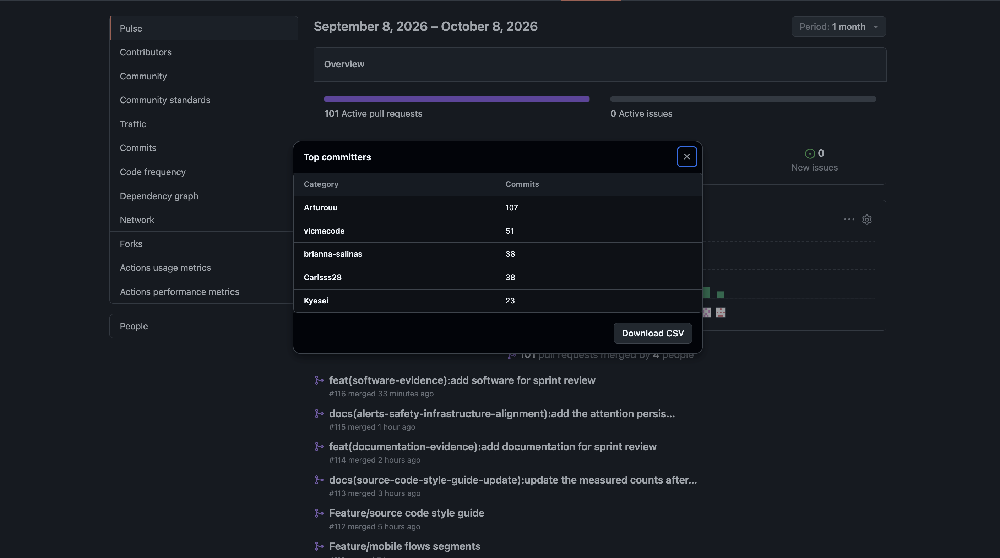

Pull Requests mergeados — Repositorio serenia-report
Se gestionaron los Pull Requests mergeados durante el Sprint, cubriendo la documentación de todos los capítulos del informe, incluyendo correcciones de
wireflows, actualización de mockups, evidencias de desarrollo y backlog del Sprint 1.

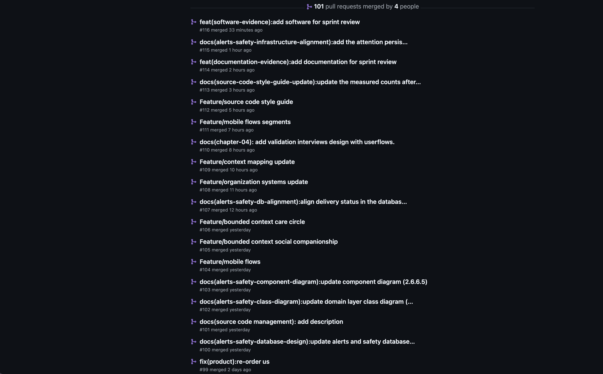

**Resumen de actividad — Repositorio serenia-website (Landing Page)**
Los 5 integrantes del equipo participaron en la implementación de la Landing Page, cada uno responsable de una o más secciones mediante feature branches
independientes.

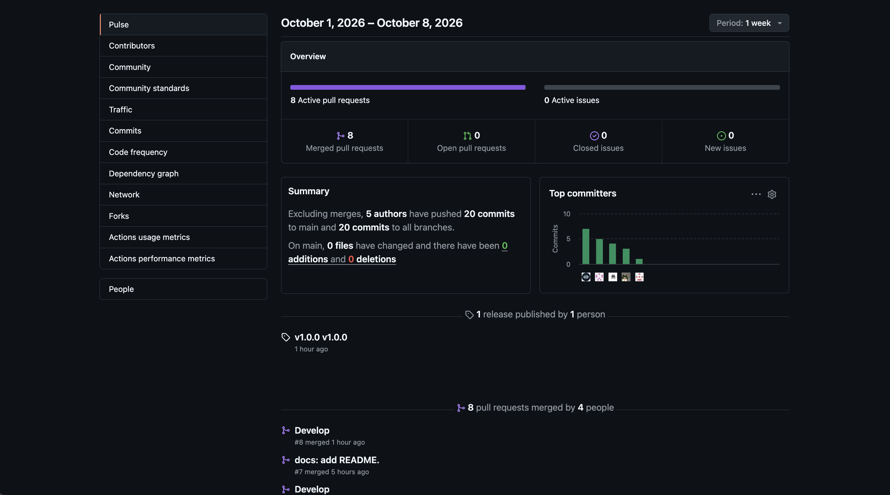


**Resumen de actividad — Repositorio serenia-platform (backend)**
Los 5 integrantes del equipo participaron en la implementación de la plataforma, cada uno responsable de un bounded conext

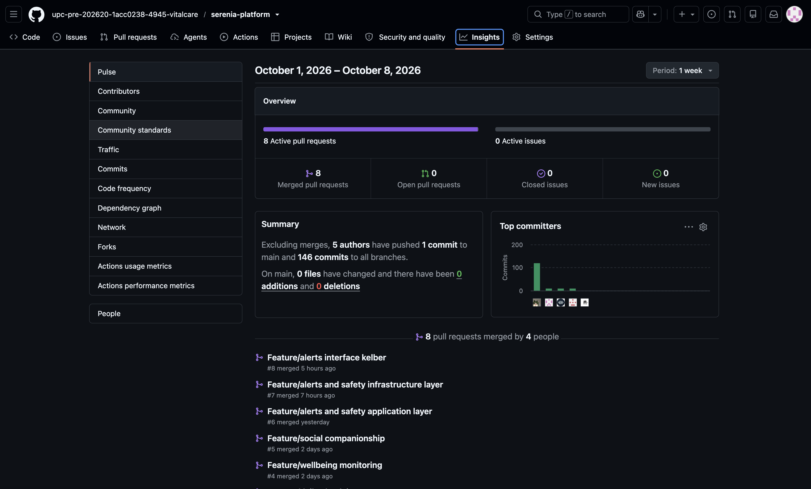


## 4.3. Validation Interviews

En esta sección se registra y explica el proceso de validación de Serenia con usuarios reales de los segmentos objetivo: adultos mayores que viven solos y familiares que los acompañan a distancia. Cada participante interactúa con el landing page y con las aplicaciones móviles, completando tareas sobre los *user flows* principales del producto mientras expresan sus observaciones. La sección se organiza en tres partes: el diseño de las entrevistas, que define los elementos y flujos a evaluar en cada segmento; el registro de las entrevistas, que documenta a cada participante, la evidencia en video y el resumen de sus apreciaciones; y las evaluaciones según heurísticas de usabilidad, arquitectura de información y diseño inclusivo.

### 4.3.1. Diseño de Entrevistas

#### Segmento 1: Adultos mayores que viven solos

Personas de 60 años a más, residentes en zonas urbanas del Perú, que viven solas y cuentan con un teléfono celular. Para las entrevistas de validación se evaluará la usabilidad, la claridad y la accesibilidad de Serenia desde la perspectiva del adulto mayor. Ello se conseguirá considerando los avances del proyecto hasta el Sprint 1, que comprenden el landing page y el prototipo interactivo de la aplicación del adulto mayor, y podrá ajustarse según el avance del equipo de desarrollo y el acuerdo con los entrevistados. Se validará el feedback de cada participante en el uso del prototipo junto con el landing page, poniendo especial atención en si puede completar cada tarea sin ayuda y con la menor cantidad de toques posible.

##### Objetivos de la Entrevista:

1) Validar la experiencia de usuario (UX) y la interfaz de usuario (UI) de la aplicación del adulto mayor, evaluando si comprende los textos, reconoce los botones y completa las tareas principales de forma autónoma, sin necesidad de que alguien le explique cómo hacerlo.

2) Evaluar si Serenia resulta para el adulto mayor una alternativa útil y aceptable frente a la llamada diaria de verificación, y si las funcionalidades base (registro y creación del círculo familiar, check-in diario y botón de ayuda) le transmiten seguridad sin sentirse vigilado.

##### Criterios de Evaluación:

- Evaluar si el adulto mayor completa el registro y la creación del círculo familiar sin asistencia, comprendiendo para qué sirve el código de 4 dígitos y a quién debe compartirlo.
- Medir el tiempo y el número de toques que necesita para responder el check-in diario desde que abre la notificación hasta que ve la confirmación "Tu familia sabrá que estás bien".
- Evaluar si comprende la opción "Hoy no quiero responder" y sabe cómo retomar sus preguntas desde la pantalla de pausa.
- Evaluar si identifica el botón "Ayuda" en la pantalla de inicio sin indicaciones y si entiende, a partir de la confirmación "Ya avisamos a tu familia", que su familia fue notificada.
- Evaluar la legibilidad de los textos, el tamaño de los botones y el contraste de la interfaz, registrando si el participante necesita acercarse a la pantalla o se equivoca de botón.
- Evaluar la comprensión de la propuesta de valor del landing page, verificando si el adulto mayor entiende qué hace Serenia y qué información recibe su familia.

*Se considerarán los siguientes User Flows*:

- **User Flow 1**: Registro y vinculación con la familia.
- **User Flow 2**: Check-in diario.
- **User Flow 3**: Pedir ayuda.

Los User Flows propuestos son los principales de la aplicación del adulto mayor: el primero habilita el círculo familiar al que se dirigen todas las demás funciones, el segundo entrega el valor central de Serenia al reemplazar la llamada de verificación diaria, y el tercero es el flujo crítico por seguridad, que debe resolverse en un solo toque.

#### Segmento 2: Familiares a distancia

Hijos, hijas o parientes cercanos de 25 a 59 años que no conviven con el adulto mayor y buscan saber de él sin recurrir a llamadas constantes. Para las entrevistas de validación se evaluará la usabilidad, la utilidad y la eficiencia de Serenia desde la perspectiva del familiar. Ello se conseguirá considerando los avances del proyecto hasta el Sprint 1, que comprenden el landing page y el prototipo interactivo de la aplicación del familiar, y podrá ajustarse según el avance del equipo de desarrollo y el acuerdo con los entrevistados. Se validará el feedback de cada participante en el uso del prototipo junto con el landing page, enfocándose en si la información que recibe le da tranquilidad y le permite actuar a tiempo cuando el adulto mayor lo necesita.

##### Objetivos de la Entrevista:

1) Validar la experiencia de usuario (UX) y la interfaz de usuario (UI) de la aplicación del familiar, evaluando si comprende la arquitectura de navegación (Inicio, Historial y Alertas) y accede a la información del adulto mayor de manera rápida e intuitiva.

2) Evaluar si Serenia ofrece al familiar una propuesta de valor diferencial frente a las llamadas y los mensajes de verificación, y si las funcionalidades base (vinculación por código, seguimiento del bienestar y atención de alertas) cubren su necesidad de estar presente a distancia.

##### Criterios de Evaluación:

- Evaluar si el familiar completa el registro y la vinculación con el código de 4 dígitos sin ambigüedades, y si entiende qué ocurre cuando el código es inválido o ya venció.
- Medir el tiempo que necesita para identificar, desde Inicio, si el adulto mayor respondió el check-in del día y cuál fue su estado de ánimo.
- Evaluar si navega con facilidad por el Historial, aplica los filtros por estado y abre el detalle de un día, comprendiendo la información que se le muestra.
- Evaluar si interpreta correctamente las "Pequeñas victorias" y la sugerencia de bienestar que aparece cuando hay varios días seguidos con poco ánimo.
- Evaluar si distingue en la sección Alertas una alerta de Emergencia de una de Inactividad, reconoce cuáles están pendientes y sabe qué acción tomar para atenderlas.
- Evaluar la comprensión de la propuesta de valor del landing page orientada al familiar, verificando si percibe con claridad los beneficios de usar Serenia frente a llamar a diario.

*Se considerarán los siguientes User Flows*:

- **User Flow 4**: Registro y vinculación con el adulto mayor.
- **User Flow 5**: Seguimiento del bienestar.
- **User Flow 6**: Atender una alerta.

Los User Flows propuestos corresponden a las funcionalidades core de la aplicación del familiar y cubren su ciclo completo: conectarse con el adulto mayor, mantenerse al tanto de cómo está día a día y actuar cuando el sistema le avisa que necesita ayuda. También se mostrará nuestra landing page para conocer su opinión.

### 4.3.2. Registro de Entrevistas
### 4.3.3. Evaluaciones según heurísticas

<div style="page-break-after: always;"></div>

# Conclusiones
## Conclusiones y Recomendaciones

Esta primera entrega abarca el análisis del problema, la propuesta de valor y el diseño de la solución. Todavía no hay desarrollo de código ni pruebas con usuarios sobre el producto, por lo que las conclusiones contrastan lo planteado en el proceso de Lean UX (sección 1.2.2) con lo encontrado en las entrevistas de descubrimiento (sección 2.2), y las recomendaciones señalan lo que debe validarse en las siguientes entregas.

**Conclusiones**

1. **El problema planteado se confirma, y se observa desde los dos lados.** El Problem Statement describe la ausencia de un canal ligero entre "no comunicarse" y "llamar todos los días". En las entrevistas, los 4 familiares a distancia se preocupan cuando no pueden verificar cómo está el adulto mayor, y los 3 adultos mayores evitan contar sus problemas para no preocupar a sus familiares. Ambos segmentos sufren el mismo vacío desde extremos opuestos, lo que respalda una solución de dos aplicaciones conectadas. La muestra es pequeña (7 entrevistas), por lo que estos resultados orientan el diseño pero no permiten generalizar.

2. **Los assumptions de usuario se cumplen en su mayoría, con dos matices.** Los 3 adultos mayores cuentan con smartphone, tal como se asumió, pero los 3 reportan dificultades con funciones nuevas o con la lentitud de las aplicaciones. Esto exige mantener el check-in de un solo toque y el modo simplificado, y no dar por hecho que sabrán resolver cualquier interacción. Por otro lado, la desconfianza hacia soluciones de vigilancia se confirmó en el segmento de familiares (2 de 4 la expresaron de forma directa), mientras que en los adultos mayores el freno observado fue el temor a ser una carga, más que a ser vigilados.

3. **Los Hypothesis Statements siguen sin validarse.** Las cuatro hipótesis (adopción diaria del check-in, "cuéntame algo", panel de estado con alertas selectivas y botón de auxilio) y sus criterios de éxito (alta tasa de check-ins, menos llamadas por ansiedad y uso recurrente del panel) requieren observar el uso real del producto. Las entrevistas de descubrimiento muestran que la necesidad existe, pero no demuestran adopción. La asunción de mayor riesgo continúa siendo que el Segmento 1 adopte el check-in diario como hábito, tal como se señaló en el Lean UX Canvas. Una revisión reciente indica que el uso sostenido de aplicaciones móviles de salud depende sobre todo de motivos intrínsecos, como la autonomía, la competencia y la relación con otras personas (Baykoca et al., 2026), lo que refuerza la decisión de mantener el check-in simple.

4. **El modelado estratégico dio como resultado seis bounded contexts con fronteras justificadas.** El proceso de EventStorming en diez pasos (sección 2.5.1) permitió delimitar tres contextos Core (Daily Check-in, Wellbeing Monitoring y Alerts & Safety), dos Supporting (Care Circle y Social Companionship) y uno Generic (Identity & Access). Los tres Core coinciden con la propuesta de valor: capturar la señal diaria, interpretarla y alertar cuando corresponde. El Context Map (sección 2.5.2) formaliza sus relaciones con un Shared Kernel mínimo (Account ID y Role), relaciones Customer/Supplier entre los demás contextos y una Anti-Corruption Layer frente al proveedor externo de notificaciones push.

5. **El diseño es coherente entre sus artefactos, pero deja decisiones abiertas.** Diez de las preguntas abiertas de los Bounded Context Canvases (por ejemplo, la vigencia del código de invitación, quién revoca un vínculo, cuántos días forman un patrón de malestar y cuánto dura la ventana de inactividad) se llevaron al EventStorming como pain points (paso 3) y siguen sin respuesta definitiva. El Product Backlog de 46 ítems distribuidos en tres sprints (sección 2.4.3) y la arquitectura de monolito modular con un módulo por bounded context (sección 2.5.3) son consistentes con esa delimitación.

**Recomendaciones**

1. **Validar primero la asunción de mayor riesgo.** En las entrevistas de validación (Capítulo IV), medir con usuarios reales de ambos segmentos si el adulto mayor responde el check-in diario de forma sostenida. Los criterios de éxito del Problem Statement deben convertirse en métricas concretas antes de esas sesiones.

2. **Resolver las preguntas abiertas antes de implementar el contexto que las contiene.** Las que afectan al Sprint 1 son la vigencia y la revocación de vínculos (US02, TS03) y a quién se notifica ante una emergencia (US14). Las que afectan al Sprint 2 son la ventana de inactividad (US16) y los días que configuran un patrón de malestar (US18).

3. **Mantener el orden de construcción del Product Backlog.** El Sprint 1 concentra el núcleo mínimo (registro, vínculo familiar, check-in, botón de auxilio y recepción de alertas), el Sprint 2 agrega la interpretación de bienestar, las alertas por inactividad y los turnos de atención, y el Sprint 3 completa Social Companionship (recordatorios sociales y fotografías), agrega las notas compartidas e integra las notificaciones push (SP01). Este orden respeta que Identity & Access y Care Circle son prerequisitos de los demás contextos.

4. **Tratar la accesibilidad y la privacidad como requisitos de primer nivel.** Dado que los 3 adultos mayores reportaron dificultades tecnológicas, conviene probar la interfaz con ellos desde el primer prototipo (NF01, NF04, US08). Un estudio con personas en edad de jubilación coincide en que las aplicaciones de salud requieren interfaces intuitivas y tutoriales iniciales que compensen la limitada alfabetización digital (Collazo-Castiñeira et al., 2025). Dado que 2 de 4 familiares desconfían de la vigilancia, las alertas deben mantenerse selectivas y el producto debe dejar claro qué información se comparte (NF03).

# Glosario

- **ACL (Anti-Corruption Layer):** Capa de traducción que aísla el modelo de dominio de los modelos externos (DTOs de red o de base de datos local), evitando que estructuras ajenas al negocio contaminen las capas superiores.
- **Aggregate root:** Entidad raíz dentro de un bounded context que controla la consistencia interna del conjunto de objetos que agrupa; ninguna entidad interna debe modificarse sin pasar por ella.
- **Big Picture Event Storming:** Técnica colaborativa de exploración de dominio en la que el equipo mapea eventos significativos del negocio y sus relaciones para obtener una visión general de alto nivel.
- **Bounded Context:** Límite explícito dentro del cual un modelo de dominio y su lenguaje ubicuo tienen un significado consistente y sin ambigüedad.
- **Clean Architecture:** Estilo arquitectónico que organiza el código en capas concéntricas (dominio, aplicación, infraestructura, presentación) donde las dependencias siempre apuntan hacia el núcleo del negocio.
- **Dependency Injection (DI):** Patrón mediante el cual las dependencias de un objeto se proveen externamente en lugar de ser instanciadas internamente, facilitando pruebas y desacoplamiento.
- **Design Thinking:** Metodología centrada en el usuario que guía el proceso de identificación de necesidades y generación de soluciones a través de fases de empatía, definición, ideación, prototipado y validación.
- **Domain layer:** Capa central de la arquitectura que contiene las reglas de negocio puras, sin dependencias de frameworks externos.
- **DTO (Data Transfer Object):** Estructura de datos usada para transportar información entre capas o servicios, sin lógica de negocio.
- **Empathy Map:** Artefacto visual que organiza las observaciones del equipo sobre un User Persona (qué dice, piensa, siente, hace) para identificar necesidades y puntos de dolor.
- **i18n (Internationalization):** Práctica de diseñar una aplicación para que pueda adaptarse a distintos idiomas y regiones sin cambios estructurales en el código.
- **Jetpack Compose:** Framework declarativo de UI para Android usado en la capa de presentación para construir pantallas y componentes reutilizables.
- **Needfinding:** Fase del proceso de Design Thinking dedicada a la investigación y análisis de las necesidades reales de los usuarios mediante entrevistas y artefactos de análisis.
- **Product Backlog:** Lista priorizada de funcionalidades, historias de usuario y mejoras pendientes de un proyecto.
- **Repository (interfaz):** Contrato que define las operaciones de lectura/escritura sobre entidades del dominio, sin exponer detalles de la implementación.
- **Retrofit:** Biblioteca de Android para consumir servicios web REST, usada en la capa de infraestructura para las llamadas de red.
- **Sprint:** Ciclo de tiempo fijo en el que un equipo Scrum desarrolla un incremento de producto.
- **Use Case / Interactor:** Componente de la capa de aplicación que representa una acción específica del usuario, orquestando las reglas del dominio para cumplirla.
- **User Journey Map:** Representación visual del recorrido end-to-end de un usuario al interactuar con un producto o servicio.
- **User Persona:** Arquetipo ficticio que representa a un segmento de usuarios, construido a partir de datos demográficos, conductuales y de entrevistas.
- **Value Object:** Tipo inmutable que encapsula validaciones y no tiene identidad propia; dos instancias con los mismos valores se consideran iguales.
- **ViewModel:** Componente de la capa de presentación que captura interacciones del usuario, invoca casos de uso y expone el estado de la UI de forma inmutable.

<br>

<div style="page-break-after: always;"></div>

# Bibliografía


**Dominio de negocio**

> Agencia Andina. (2025, 26 de marzo). *INEI: En Lima Metropolitana, uno de cada cuatro adulto mayor vive solo*. Andina. https://andina.pe/agencia/noticia-inei-lima-metropolitana-uno-cada-cuatro-adulto-mayor-vive-solo-1023716.aspx

> Banco Interamericano de Desarrollo. (2024). *Cuidadoras de personas mayores: sobrecargadas y mal pagadas. Evidencia de una encuesta del Banco Interamericano de Desarrollo en América Latina y el Caribe* (Versión 1). https://publications.iadb.org/publications/spanish/document/Cuidadoras-de-personas-mayores-sobrecargadas-y-mal-pagadas-evidencia-de-una-encuesta-del-Banco-Interamericano-de-Desarrollo-en-America-Latina-y-el-Caribe.-Version-1-junio-2024.pdf

> Carrasco Freitas, M. (2026, 29 de mayo). Lima es el principal destino migratorio: más de 3 millones de peruanos llegaron desde otras regiones, según Censo 2025. Infobae. https://www.infobae.com/peru/2026/05/29/lima-es-el-principal-destrino-migratorio-mas-de-3-millones-de-peruanos-llegaron-desde-otras-regiones-segun-censo-2025/

> Infobae. (2025, 31 de diciembre). *Las familias peruanas con adultos mayores en el hogar creció en el tercer trimestre de 2025*. Infobae Perú. https://www.infobae.com/peru/2025/12/31/las-familias-peruanas-con-adultos-mayores-en-el-hogar-crecio-en-2025/

> Instituto Nacional de Estadística e Informática. (2025a, 26 de marzo). El 42,0 % de los hogares del país tiene entre sus miembros a un adulto mayor. Gob.pe. https://www.gob.pe/institucion/inei/noticias/1133454-el-42-0-de-los-hogares-

> Instituto Nacional de Estadística e Informática. (2025b). Estadísticas de las tecnologías de información y comunicación en los hogares: informe técnico, enero-febrero-marzo 2025. https://www.inei.gob.pe/media/MenuRecursivo/boletines/informe-tecnico_tecnologiasdelainformacion_ene_feb_mar2025.pdf

> Murayama, H., & Takase, M. (2025). Evaluating the effectiveness of digital social robots in reducing loneliness among community-dwelling older adults in Japan: Randomized controlled trial and qualitative analysis. *JMIR Aging*, *8*(1), Article e74422. https://doi.org/10.2196/74422

> Organismo Supervisor de Inversión Privada en Telecomunicaciones. (2026). Erestel 2025: cada vez más hogares peruanos cuentan con un smartphone. https://www.osiptel.gob.pe/portal-del-usuario/noticias/erestel-2025-cada-vez-m%C3%A1s-hogares-peruanos-cuentan-con-un-smartphone-cu%C3%A1ntos-tienen/

> Xu, W., Yang, B., & Teerawichitchainan, B. (2026). Digital technologies in care for older adults living alone: A scoping review. *Innovation in Aging*, *10*(7), Article igag048. https://doi.org/10.1093/geroni/igag048

**Métodos y técnicas de ingeniería de software**

> Al-Qora'n, L. F., & Al-Said Ahmad, A. (2025). Modular monolith architecture in cloud environments: A systematic literature review. *Future Internet*, *17*(11), Article 496. https://doi.org/10.3390/fi17110496

> Gothelf, J., & Seiden, J. (2021). *Lean UX: Designing great products with agile teams* (3rd ed.). O'Reilly Media. https://www.oreilly.com/library/view/lean-ux-3rd/9781098116293/

> Özkan, O., Babur, Ö., & van den Brand, M. (2025). Domain-driven design in software development: A systematic literature review on implementation, challenges, and effectiveness. *Journal of Systems and Software*, *230*, Article 112537. https://doi.org/10.1016/j.jss.2025.112537

**Lenguajes, frameworks y herramientas (aplicaciones móviles)**

> Baykoca, J., Hurtado Barbeito, G., Pearce, C. J., Milne-Ives, M., Hudson, J., Norton, S., & Moss-Morris, R. (2026). Mechanisms of engagement with mobile health apps for adults with long-term conditions: Overview of systematic reviews. *JMIR mHealth and uHealth*, *14*(1), Article e88382. https://doi.org/10.2196/88382

> Collazo-Castiñeira, P., Rodríguez-Rey, R., Cruz-Jentoft, A. J., Ben Allouch, S., Eglseer, D., Schoufour, J., Topinková, E., Weijs, P. J. M., Boirie, Y., & Sánchez-Izquierdo, M. (2025). Tailoring mHealth for healthy aging: Focus group study with retirement-age adults. *JMIR mHealth and uHealth*, *13*, Article e70051. https://doi.org/10.2196/70051

**Diseño de interfaz y experiencia de usuario**

> Apple. (s. f.). *Human Interface Guidelines*. https://developer.apple.com/design/human-interface-guidelines/

> Google. (s. f.). *Material Design 3*. https://m3.material.io/

> Moran, K. (2016, 17 de julio). *The four dimensions of tone of voice*. Nielsen Norman Group. https://www.nngroup.com/articles/tone-of-voice-dimensions/

> World Wide Web Consortium. (2023). *Web Content Accessibility Guidelines (WCAG) 2.2*. https://www.w3.org/TR/WCAG22/

<br>

<div style="page-break-after: always;"></div>

# Anexos

URL de la organización (Serenia):  [Organización Serenia](https://github.com/upc-pre-202620-1acc0238-4945-vitalcare)

URL del repositorio (Report):  [Repositorio Reporte](https://github.com/upc-pre-202620-1acc0238-4945-vitalcare/serenia-report)

URL del repositorio (Web Services):  [Repositorio Web Services](https://github.com/upc-pre-202620-1acc0238-4945-vitalcare/serenia-web-services)

URL del repositorio (App Native):  [Repositorio App Native](https://github.com/upc-pre-202620-1acc0238-4945-vitalcare/serenia-app-native)

URL del repositorio (Website):  [Repositorio Website](https://github.com/upc-pre-202620-1acc0238-4945-vitalcare/serenia-website)
